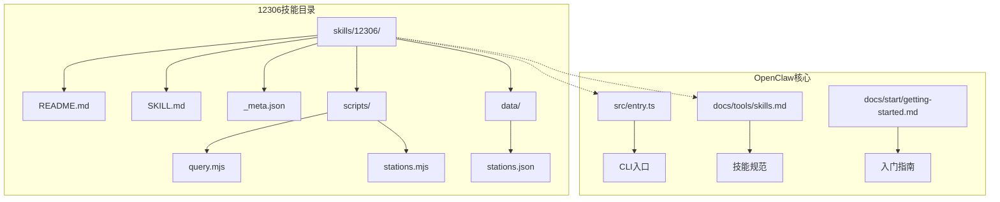
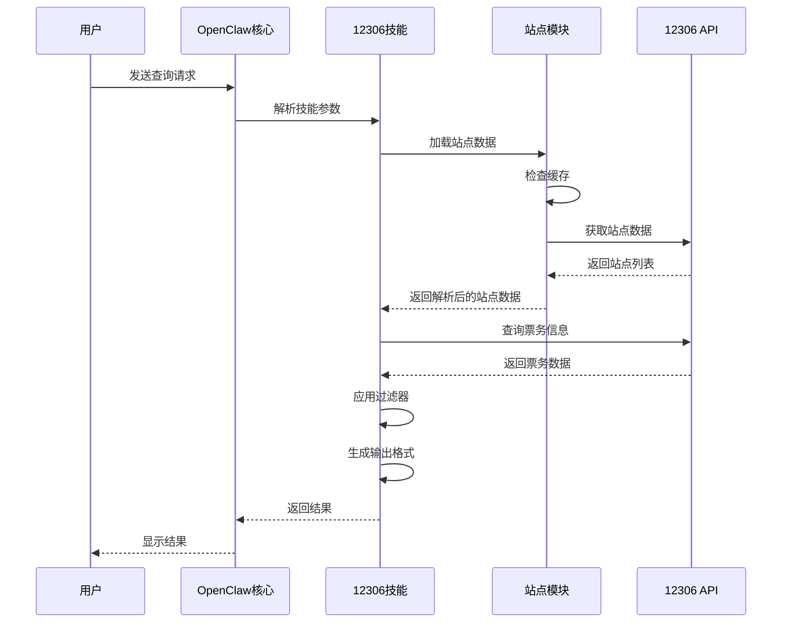
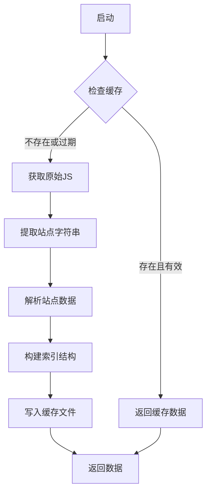
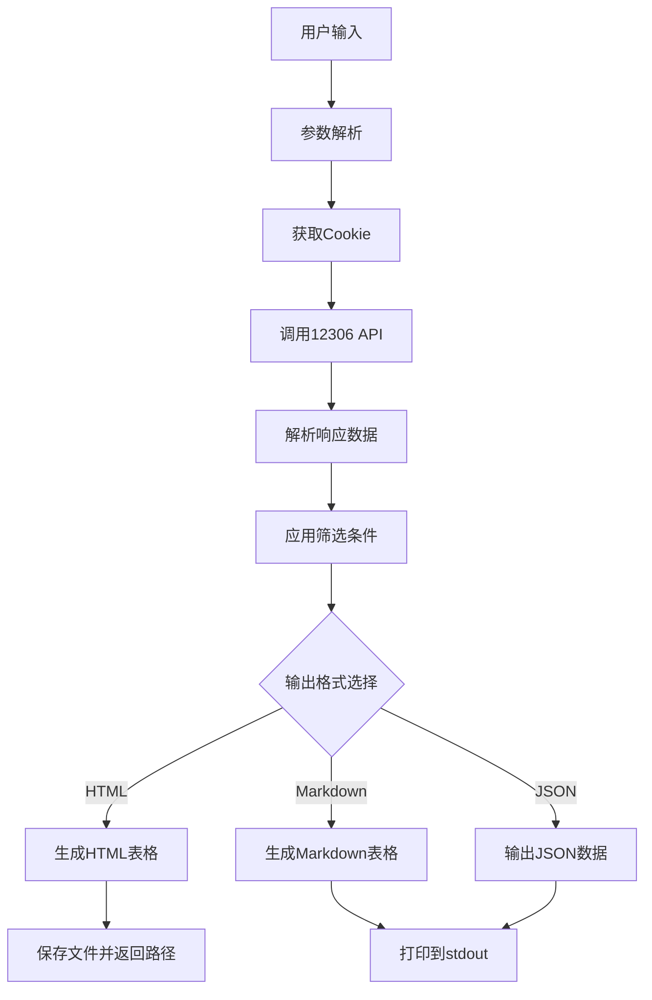
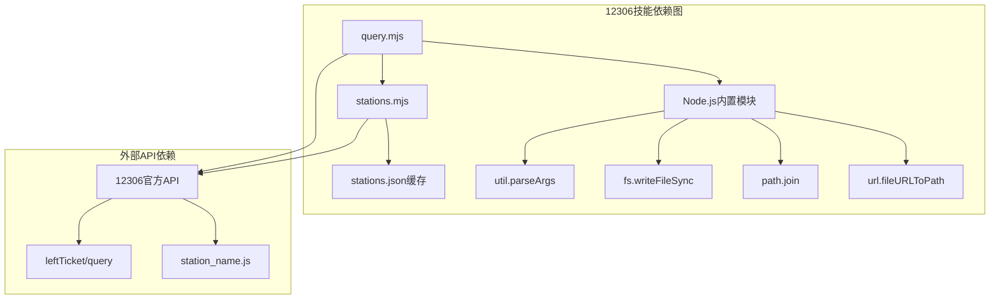
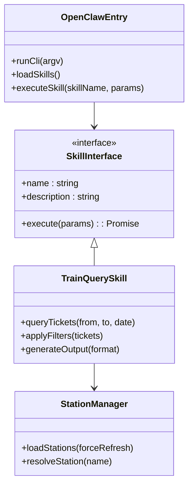

# 12306火车票查询技能

<cite>
**本文档引用的文件**
- [skills/12306/README.md](file://skills/12306/README.md)
- [skills/12306/SKILL.md](file://skills/12306/SKILL.md)
- [skills/12306/_meta.json](file://skills/12306/_meta.json)
- [skills/12306/scripts/query.mjs](file://skills/12306/scripts/query.mjs)
- [skills/12306/scripts/stations.mjs](file://skills/12306/scripts/stations.mjs)
- [src/entry.ts](file://src/entry.ts)
- [docs/tools/skills.md](file://docs/tools/skills.md)
- [docs/start/getting-started.md](file://docs/start/getting-started.md)
- [package.json](file://package.json)
</cite>

## 目录
1. [简介](#简介)
2. [项目结构](#项目结构)
3. [核心组件](#核心组件)
4. [架构概览](#架构概览)
5. [详细组件分析](#详细组件分析)
6. [依赖关系分析](#依赖关系分析)
7. [性能考虑](#性能考虑)
8. [故障排除指南](#故障排除指南)
9. [结论](#结论)

## 简介

12306火车票查询技能是OpenClaw生态系统中的一个专门技能，用于查询中国铁路12306的列车时刻表和余票信息。该技能提供了丰富的筛选功能，包括车次类型、出发/到达时间、耗时、可购票状态和座位类型等条件。

该技能具有以下特点：
- 直接调用12306官方API，无需API密钥
- 支持HTML页面输出（Apple风格）和Markdown表格输出
- 自动缓存站点数据7天
- 支持城市名自动解析到主站或精确站名
- 提供多种输出格式和自定义选项

## 项目结构

12306技能采用标准的OpenClaw技能目录结构：

**图表来源**
- [skills/12306/README.md:1-79](file://skills/12306/README.md#L1-L79)
- [skills/12306/SKILL.md:1-82](file://skills/12306/SKILL.md#L1-L82)
- [src/entry.ts:1-195](file://src/entry.ts#L1-L195)

**章节来源**
- [skills/12306/README.md:1-79](file://skills/12306/README.md#L1-L79)
- [skills/12306/SKILL.md:1-82](file://skills/12306/SKILL.md#L1-L82)
- [skills/12306/_meta.json:1-6](file://skills/12306/_meta.json#L1-L6)

## 核心组件

### 主要功能模块

12306技能包含两个核心JavaScript模块：

#### 1. 票务查询模块 (query.mjs)
负责处理用户输入、调用12306 API、解析数据和生成输出。

#### 2. 站点管理模块 (stations.mjs)
负责站点数据的获取、缓存和解析。

### 技能元数据

技能通过 `_meta.json` 文件提供版本和发布信息，确保OpenClaw能够正确识别和加载该技能。

**章节来源**
- [skills/12306/scripts/query.mjs:1-361](file://skills/12306/scripts/query.mjs#L1-L361)
- [skills/12306/scripts/stations.mjs:1-104](file://skills/12306/scripts/stations.mjs#L1-L104)
- [skills/12306/_meta.json:1-6](file://skills/12306/_meta.json#L1-L6)

## 架构概览

12306技能遵循OpenClaw的AgentSkills兼容规范，采用模块化设计：

**图表来源**
- [skills/12306/scripts/query.mjs:333-361](file://skills/12306/scripts/query.mjs#L333-L361)
- [skills/12306/scripts/stations.mjs:17-32](file://skills/12306/scripts/stations.mjs#L17-L32)

## 详细组件分析

### 站点数据管理系统

站点数据管理系统是技能的重要组成部分，负责处理12306的站点信息：

**图表来源**
- [skills/12306/scripts/stations.mjs:17-32](file://skills/12306/scripts/stations.mjs#L17-L32)
- [skills/12306/scripts/stations.mjs:60-84](file://skills/12306/scripts/stations.mjs#L60-L84)

#### 数据结构设计

站点数据采用多索引结构以支持不同查询方式：

| 索引类型 | 描述 | 示例 |
|---------|------|------|
| STATIONS | 站点代码到完整信息映射 | `{VAP: {station_name: "北京北", ...}}` |
| NAME_STATIONS | 站点名称到代码映射 | `{"北京北": {station_code: "VAP"}}` |
| CITY_STATIONS | 城市到站点列表映射 | `{"北京": [{station_code: "VAP"}, ...]}` |
| CITY_CODES | 城市到主站映射 | `{"北京": {station_code: "VAP"}}` |

**章节来源**
- [skills/12306/scripts/stations.mjs:66-84](file://skills/12306/scripts/stations.mjs#L66-L84)

### 票务查询处理流程

票务查询模块实现了完整的数据处理管道：

**图表来源**
- [skills/12306/scripts/query.mjs:27-60](file://skills/12306/scripts/query.mjs#L27-L60)
- [skills/12306/scripts/query.mjs:108-127](file://skills/12306/scripts/query.mjs#L108-L127)
- [skills/12306/scripts/query.mjs:345-361](file://skills/12306/scripts/query.mjs#L345-L361)

#### 过滤器实现

技能提供了多种筛选条件，每种都有特定的实现逻辑：

| 筛选类型 | 实现方式 | 示例 |
|---------|----------|------|
| 车次类型 | 字符串前缀匹配 | `trainCode.startsWith('G')` |
| 出发时间 | 时间范围比较 | `parseTime(departTime)` |
| 到达时间 | 时间范围比较 | `parseTime(arriveTime)` |
| 最大耗时 | 分钟数比较 | `durationMinutes(duration)` |
| 可购票 | 字符串匹配 | `canBuy === 'Y'` |
| 座位类型 | 多条件AND逻辑 | `hasSeat(seatType)` |

**章节来源**
- [skills/12306/scripts/query.mjs:153-192](file://skills/12306/scripts/query.mjs#L153-L192)

### 输出格式系统

技能支持三种输出格式，每种都有特定的用途和格式要求：

#### HTML输出格式
- Apple风格设计
- 响应式布局
- 内置CSS样式
- 文件保存机制

#### Markdown输出格式
- 终端友好
- 表格格式
- 简洁明了
- 直接stdout输出

#### JSON输出格式
- 结构化数据
- 机器可读
- 完整信息保留
- 便于程序处理

**章节来源**
- [skills/12306/scripts/query.mjs:194-318](file://skills/12306/scripts/query.mjs#L194-L318)

## 依赖关系分析

### 技能内部依赖

**图表来源**
- [skills/12306/scripts/query.mjs:3-7](file://skills/12306/scripts/query.mjs#L3-L7)
- [skills/12306/scripts/stations.mjs:3-5](file://skills/12306/scripts/stations.mjs#L3-L5)

### OpenClaw集成

12306技能通过OpenClaw的技能系统进行集成：

**图表来源**
- [src/entry.ts:168-193](file://src/entry.ts#L168-L193)
- [skills/12306/SKILL.md:1-82](file://skills/12306/SKILL.md#L1-L82)

**章节来源**
- [src/entry.ts:1-195](file://src/entry.ts#L1-L195)
- [docs/tools/skills.md:1-303](file://docs/tools/skills.md#L1-L303)

## 性能考虑

### 缓存策略

12306技能实现了两级缓存机制：

1. **站点数据缓存**：7天有效期，减少对12306服务器的请求
2. **本地文件缓存**：HTML输出文件缓存，避免重复生成

### 网络优化

- 使用适当的User-Agent头模拟浏览器请求
- Cookie自动获取和复用
- 错误重试机制
- 超时控制

### 内存管理

- 流式数据处理
- 及时释放临时变量
- 大数据集的分批处理

## 故障排除指南

### 常见问题及解决方案

| 问题类型 | 症状 | 可能原因 | 解决方案 |
|---------|------|----------|----------|
| 站点解析失败 | "Station not found" | 站点名称不正确或缓存过期 | 清除缓存重新获取 |
| API调用失败 | "No data returned" | 网络连接问题或12306服务异常 | 检查网络连接，稍后重试 |
| 输出格式错误 | 格式不符合预期 | 参数设置错误 | 检查命令行参数 |
| 性能问题 | 查询响应慢 | 缓存未命中或网络延迟 | 启用缓存，优化网络环境 |

### 调试技巧

1. **启用详细日志**：使用 `-v` 或 `--verbose` 参数
2. **检查缓存状态**：验证 `stations.json` 文件是否存在
3. **测试API连通性**：直接访问12306 API验证网络
4. **验证参数格式**：确保日期和时间格式正确

**章节来源**
- [skills/12306/scripts/query.mjs:43-60](file://skills/12306/scripts/query.mjs#L43-L60)
- [skills/12306/scripts/stations.mjs:17-32](file://skills/12306/scripts/stations.mjs#L17-L32)

## 结论

12306火车票查询技能是一个功能完善、设计合理的OpenClaw技能实现。它成功地将复杂的12306 API集成到OpenClaw生态系统中，为用户提供了一个强大而易用的火车票查询工具。

### 主要优势

1. **功能完整性**：涵盖了所有主要的查询需求和筛选条件
2. **用户体验优秀**：支持多种输出格式，满足不同场景需求
3. **性能优化**：智能缓存机制确保高效运行
4. **代码质量高**：模块化设计，易于维护和扩展
5. **符合规范**：完全遵循OpenClaw的AgentSkills标准

### 技术亮点

- **智能缓存系统**：7天站点数据缓存，显著减少API调用
- **灵活的筛选机制**：支持多维度条件组合筛选
- **多样化的输出格式**：适应不同的使用场景
- **健壮的错误处理**：完善的异常处理和用户反馈机制

该技能为OpenClaw平台添加了重要的实用功能，展示了如何将第三方API有效地集成到AI助手生态系统中。其设计模式和实现技术可以作为其他技能开发的参考模板。