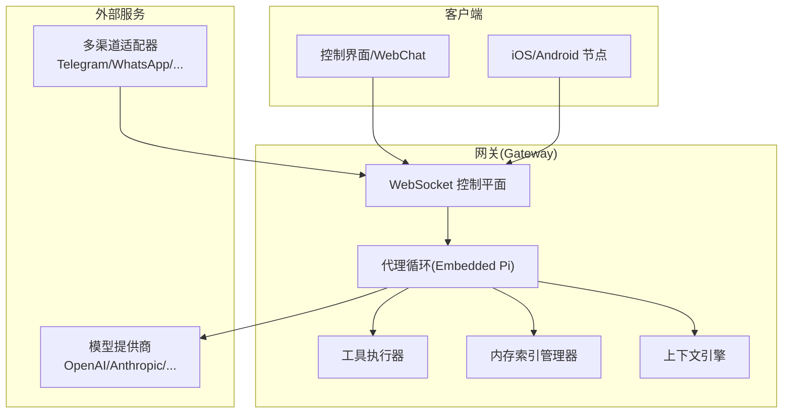
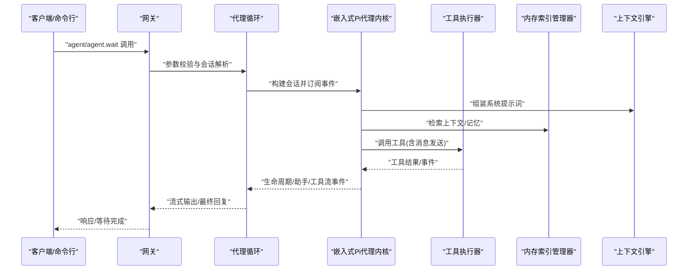
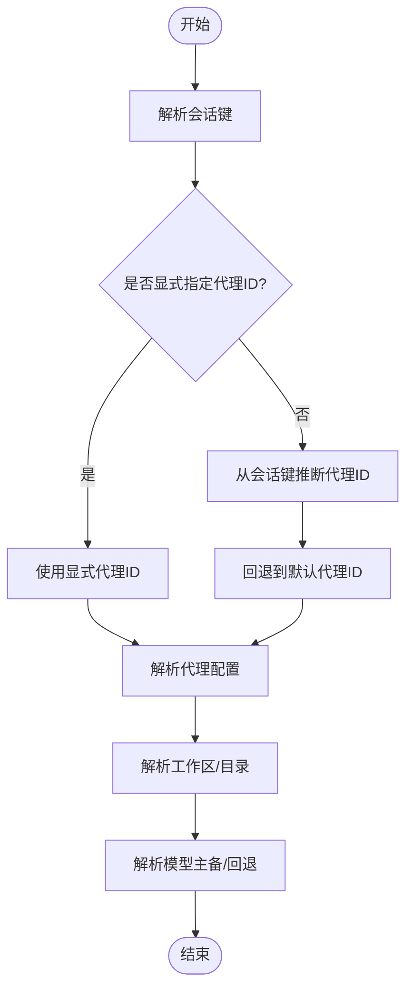
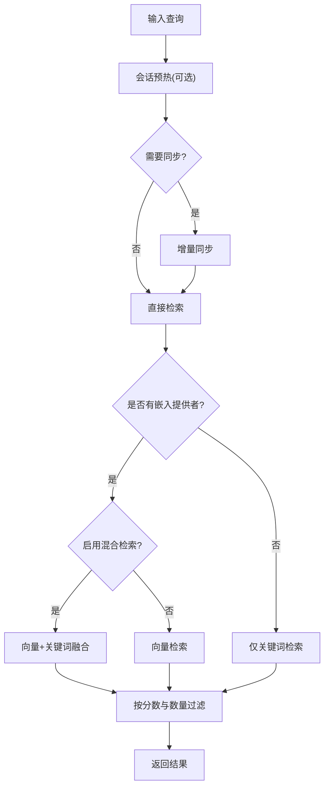
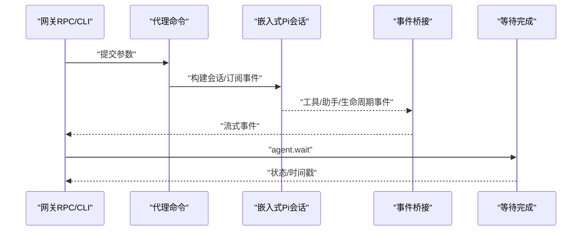
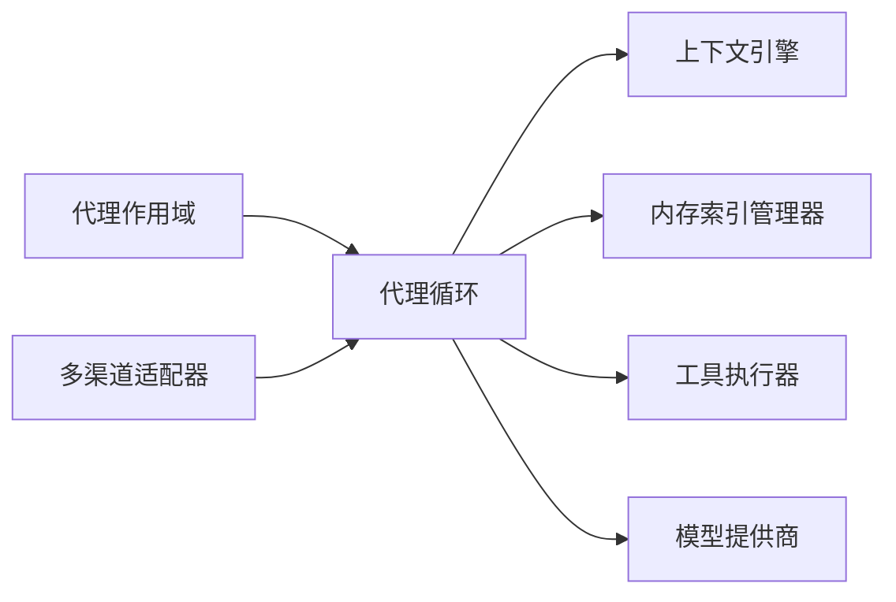

# AI代理系统

<cite>
**本文引用的文件**
- [README.md](file://README.md)
- [AGENTS.md](file://AGENTS.md)
- [docs/concepts/agent-loop.md](file://docs/concepts/agent-loop.md)
- [src/agents/agent-scope.ts](file://src/agents/agent-scope.ts)
- [src/memory/index.ts](file://src/memory/index.ts)
- [src/memory/manager.ts](file://src/memory/manager.ts)
- [src/context-engine/index.ts](file://src/context-engine/index.ts)
</cite>

## 目录

1. [简介](#简介)
2. [项目结构](#项目结构)
3. [核心组件](#核心组件)
4. [架构总览](#架构总览)
5. [详细组件分析](#详细组件分析)
6. [依赖关系分析](#依赖关系分析)
7. [性能考量](#性能考量)
8. [故障排查指南](#故障排查指南)
9. [结论](#结论)
10. [附录](#附录)

## 简介

本文件面向AI代理系统的技术文档，围绕代理的创建与管理、工具执行机制、记忆存储与上下文管理进行深入解析，并覆盖代理循环、思考模式、推理过程与决策制定流程。同时提供工具开发指南、内存查询接口与会话路由策略，以及代理配置示例、性能调优与扩展方法，最后涵盖多代理协作、会话隔离与安全控制机制。

## 项目结构

OpenClaw是一个个人AI助手平台，支持多通道接入（如WhatsApp、Telegram、Discord等），并通过网关（Gateway）作为统一控制平面，协调会话、工具与事件。系统采用“本地优先”的设计，强调在用户设备上运行，确保低延迟与隐私保护。

- 关键子系统
  - 网关（Gateway）：WebSocket控制平面，承载会话、通道、工具与事件。
  - 代理（Agent）：基于Pi代理内核的嵌入式运行时，负责消息到动作与回复的完整闭环。
  - 记忆（Memory）：内置SQLite向量/关键词混合检索，支持增量同步与缓存。
  - 上下文引擎（Context Engine）：负责系统提示词组装、压缩与注入。
  - 工具（Tools）：浏览器控制、画布、节点、定时任务、会话间通信等。

图示来源

- [README.md:185-239](file://README.md#L185-L239)
- [docs/concepts/agent-loop.md:18-49](file://docs/concepts/agent-loop.md#L18-L49)

章节来源

- [README.md:185-239](file://README.md#L185-L239)
- [docs/concepts/agent-loop.md:18-49](file://docs/concepts/agent-loop.md#L18-L49)

## 核心组件

- 代理作用域与路由
  - 通过会话键解析代理ID，支持默认代理与按会话路由。
  - 支持为每个代理配置工作区、技能过滤、沙箱模式、模型主备与心跳等。
- 内存索引管理器
  - 提供向量与关键词混合检索、批量嵌入、增量同步、只读数据库恢复、缓存统计与状态查询。
- 上下文引擎
  - 注册与解析上下文引擎工厂，支持传统引擎与初始化流程。
- 代理循环
  - 定义从入口到生命周期事件、流式输出、工具执行与持久化的完整链路；支持队列化与并发控制。

章节来源

- [src/agents/agent-scope.ts:86-111](file://src/agents/agent-scope.ts#L86-L111)
- [src/agents/agent-scope.ts:118-145](file://src/agents/agent-scope.ts#L118-L145)
- [src/memory/manager.ts:61-187](file://src/memory/manager.ts#L61-L187)
- [src/context-engine/index.ts:1-20](file://src/context-engine/index.ts#L1-L20)
- [docs/concepts/agent-loop.md:23-49](file://docs/concepts/agent-loop.md#L23-L49)

## 架构总览

OpenClaw的代理循环以“单会话串行、全局可选队列”为核心，确保会话一致性与避免工具/会话竞态。代理运行时通过嵌入式Pi代理内核，订阅事件并桥接至OpenClaw的流式输出。工具执行与消息发送由工具执行器完成，记忆检索由内存索引管理器提供，上下文引擎负责系统提示词组装与压缩。

图示来源

- [docs/concepts/agent-loop.md:25-44](file://docs/concepts/agent-loop.md#L25-L44)
- [docs/concepts/agent-loop.md:127-132](file://docs/concepts/agent-loop.md#L127-L132)

章节来源

- [docs/concepts/agent-loop.md:23-49](file://docs/concepts/agent-loop.md#L23-L49)

## 详细组件分析

### 组件A：代理作用域与会话路由

- 会话键解析
  - 支持从会话键中提取代理ID，若未显式指定则回退到默认代理或根据会话键推断。
- 代理配置解析
  - 解析代理名称、工作区、模型主备、技能过滤、记忆检索、心跳、身份、群聊、子代理、沙箱与工具白名单等。
- 工作区与目录解析
  - 默认工作区与代理专属工作区路径解析，支持路径规范化与根目录约束。
- 模型主备与回退
  - 支持代理级与全局级模型主备配置，以及回退策略覆盖。

图示来源

- [src/agents/agent-scope.ts:86-111](file://src/agents/agent-scope.ts#L86-L111)
- [src/agents/agent-scope.ts:118-145](file://src/agents/agent-scope.ts#L118-L145)
- [src/agents/agent-scope.ts:256-272](file://src/agents/agent-scope.ts#L256-L272)
- [src/agents/agent-scope.ts:273-339](file://src/agents/agent-scope.ts#L273-L339)

章节来源

- [src/agents/agent-scope.ts:86-111](file://src/agents/agent-scope.ts#L86-L111)
- [src/agents/agent-scope.ts:118-145](file://src/agents/agent-scope.ts#L118-L145)
- [src/agents/agent-scope.ts:256-272](file://src/agents/agent-scope.ts#L256-L272)
- [src/agents/agent-scope.ts:273-339](file://src/agents/agent-scope.ts#L273-L339)

### 组件B：内存索引管理器（MemoryIndexManager）

- 功能概览
  - 向量与关键词混合检索、嵌入批处理、增量同步、只读数据库自动恢复、缓存统计与状态查询。
  - 支持按源过滤、会话监听与定时同步，提供搜索模式（FTS-only或Hybrid）与向量可用性探测。
- 关键流程
  - 搜索：根据查询类型选择向量/关键词/混合策略，合并结果并按阈值与数量裁剪。
  - 同步：检测只读错误并自动重建连接，保证数据一致性。
  - 文件读取：限制在工作区与额外允许路径范围内，支持按行切片读取。

图示来源

- [src/memory/manager.ts:256-364](file://src/memory/manager.ts#L256-L364)
- [src/memory/manager.ts:451-551](file://src/memory/manager.ts#L451-L551)
- [src/memory/manager.ts:553-624](file://src/memory/manager.ts#L553-L624)

章节来源

- [src/memory/manager.ts:61-187](file://src/memory/manager.ts#L61-L187)
- [src/memory/manager.ts:256-364](file://src/memory/manager.ts#L256-L364)
- [src/memory/manager.ts:451-551](file://src/memory/manager.ts#L451-L551)
- [src/memory/manager.ts:553-624](file://src/memory/manager.ts#L553-L624)

### 组件C：上下文引擎（Context Engine）

- 能力
  - 导出上下文引擎类型、注册与解析工厂、初始化流程与遗留引擎支持。
- 应用
  - 在代理循环中用于系统提示词构建、上下文组装与压缩，确保模型输入质量与长度控制。

章节来源

- [src/context-engine/index.ts:1-20](file://src/context-engine/index.ts#L1-L20)

### 组件D：代理循环（Agent Loop）

- 生命周期
  - 入口：网关RPC与CLI命令；参数验证、会话解析、元数据持久化后立即返回runId。
  - 执行：加载技能快照、运行嵌入式Pi代理、订阅事件并桥接流事件。
  - 结束：等待生命周期事件或超时，返回状态与时间戳。
- 队列与并发
  - 每个会话键串行执行，可选通过全局队列；消息通道可选择队列模式（收集/引导/跟进）。
- 流式输出
  - 助手块流与推理流可分别或合并输出；消息工具重复抑制与最终payload整形。
- 钩子与拦截
  - 内部钩子与插件钩子贯穿生命周期，支持在模型解析、提示词构建、工具调用前后注入逻辑。

图示来源

- [docs/concepts/agent-loop.md:25-44](file://docs/concepts/agent-loop.md#L25-L44)
- [docs/concepts/agent-loop.md:127-132](file://docs/concepts/agent-loop.md#L127-L132)

章节来源

- [docs/concepts/agent-loop.md:18-49](file://docs/concepts/agent-loop.md#L18-L49)
- [docs/concepts/agent-loop.md:127-132](file://docs/concepts/agent-loop.md#L127-L132)

## 依赖关系分析

- 组件耦合
  - 代理循环依赖上下文引擎进行提示词组装、依赖内存索引管理器进行上下文检索、依赖工具执行器进行动作执行。
  - 代理作用域为上述组件提供会话键解析与代理配置，决定工作区、模型与沙箱策略。
- 外部依赖
  - 模型提供商（OpenAI/Anthropic等）通过嵌入式Pi代理内核访问。
  - 多渠道适配器通过网关WebSocket接入，形成统一的消息入口。

图示来源

- [src/agents/agent-scope.ts:86-111](file://src/agents/agent-scope.ts#L86-L111)
- [docs/concepts/agent-loop.md:25-44](file://docs/concepts/agent-loop.md#L25-L44)

章节来源

- [src/agents/agent-scope.ts:86-111](file://src/agents/agent-scope.ts#L86-L111)
- [docs/concepts/agent-loop.md:25-44](file://docs/concepts/agent-loop.md#L25-L44)

## 性能考量

- 代理循环
  - 单会话串行执行降低竞态风险；可通过队列模式优化消息吞吐。
  - 嵌入式Pi代理内核的超时控制与生命周期事件有助于及时中断长耗时运行。
- 内存检索
  - 向量与关键词混合检索可提升召回质量；合理设置候选数与权重、MMR与时间衰减参数可平衡精度与性能。
  - 批量嵌入与缓存统计减少重复计算；只读数据库自动恢复保障稳定性。
- 上下文组装
  - 合理的系统提示词长度与压缩策略可降低token消耗，提高响应速度。

## 故障排查指南

- 代理循环
  - 使用agent.wait等待生命周期结束，检查状态与错误信息；关注超时、取消信号与网关断开等早停条件。
- 内存检索
  - 若出现只读数据库错误，系统会自动重建连接；可查看readonlyRecovery统计与最后一次错误原因。
  - 检查向量维度、FTS可用性与提供者状态；必要时切换到FTS-only模式或调整混合检索参数。
- 上下文引擎
  - 确认系统提示词构建阶段的钩子未引入过长内容；必要时启用压缩钩子或调整提示词长度限制。

章节来源

- [docs/concepts/agent-loop.md:138-149](file://docs/concepts/agent-loop.md#L138-L149)
- [src/memory/manager.ts:468-551](file://src/memory/manager.ts#L468-L551)
- [src/memory/manager.ts:626-738](file://src/memory/manager.ts#L626-L738)

## 结论

OpenClaw通过“网关+代理循环+工具+记忆+上下文引擎”的分层架构，实现了从消息到动作再到回复的完整闭环。代理作用域与会话路由确保多代理协作与会话隔离；内存检索提供高效的知识检索能力；代理循环与钩子体系支撑灵活的推理与决策流程。结合队列化与并发控制、只读数据库恢复与缓存策略，系统在性能与稳定性之间取得良好平衡。

## 附录

### 工具开发指南

- 插件钩子
  - 在before_model_resolve、before_prompt_build、before_tool_call、after_tool_call、tool_result_persist等钩子中注入自定义逻辑。
- 工具调用
  - 工具事件通过tool流输出，结果在持久化前可被tool_result_persist转换。
- 参考
  - [docs/concepts/agent-loop.md:80-95](file://docs/concepts/agent-loop.md#L80-L95)

章节来源

- [docs/concepts/agent-loop.md:80-95](file://docs/concepts/agent-loop.md#L80-L95)

### 内存查询接口

- 搜索
  - 支持向量/关键词/混合检索，可设置最大结果数、最小分数、会话键等参数。
- 状态
  - 返回文件/片段计数、脏标记、提供者信息、缓存统计、FTS/向量可用性与批处理失败统计。
- 文件读取
  - 限定在工作区与额外允许路径范围内，支持按行切片读取。

章节来源

- [src/memory/index.ts:1-12](file://src/memory/index.ts#L1-L12)
- [src/memory/manager.ts:256-364](file://src/memory/manager.ts#L256-L364)
- [src/memory/manager.ts:626-738](file://src/memory/manager.ts#L626-L738)
- [src/memory/manager.ts:553-624](file://src/memory/manager.ts#L553-L624)

### 会话路由策略

- 会话键解析
  - 优先显式代理ID，其次从会话键解析，最后回退到默认代理。
- 代理配置
  - 通过代理作用域解析工作区、模型主备、技能过滤、沙箱与工具白名单等。

章节来源

- [src/agents/agent-scope.ts:86-111](file://src/agents/agent-scope.ts#L86-L111)
- [src/agents/agent-scope.ts:118-145](file://src/agents/agent-scope.ts#L118-L145)

### 代理配置示例与最佳实践

- 基础配置
  - 参考最小配置与全量配置参考，明确模型与默认项。
- 安全与沙箱
  - 主会话默认允许工具执行；非主会话建议启用沙箱并限制工具白名单。
- 思考与冗长度
  - 使用/think与/verbose命令调节思考深度与冗长度，结合/streaming行为优化体验。

章节来源

- [README.md:318-338](file://README.md#L318-L338)
- [README.md:270-282](file://README.md#L270-L282)

### 多代理协作与会话隔离

- 多代理
  - 通过代理作用域解析不同代理ID，各自拥有独立工作区与配置。
- 会话隔离
  - 每个会话键对应独立的串行执行通道，避免跨会话竞态。

章节来源

- [src/agents/agent-scope.ts:86-111](file://src/agents/agent-scope.ts#L86-L111)
- [docs/concepts/agent-loop.md:45-49](file://docs/concepts/agent-loop.md#L45-L49)

### 安全控制机制

- 默认策略
  - 主会话默认允许工具执行；群组/频道安全建议启用沙箱并限制工具白名单。
- 权限与节点
  - macOS节点权限需遵循TCC；执行本地动作需通过node.invoke并注意权限状态。

章节来源

- [README.md:332-338](file://README.md#L332-L338)
- [README.md:240-253](file://README.md#L240-L253)
