# AI代理系统

<cite>
**本文引用的文件**
- [README.md](file://README.md)
- [AGENTS.md](file://AGENTS.md)
- [docs/concepts/agent-loop.md](file://docs/concepts/agent-loop.md)
- [src/agents/agent-scope.ts](file://src/agents/agent-scope.ts)
- [src/memory/index.ts](file://src/memory/index.ts)
- [src/memory/manager.ts](file://src/memory/manager.ts)
- [src/context-engine/index.ts](file://src/context-engine/index.ts)
- [skills/travel-planner/SKILL.md](file://skills/travel-planner/SKILL.md)
- [skills/travel-planner/scripts/cli_args.mjs](file://skills/travel-planner/scripts/cli_args.mjs)
- [skills/travel-planner/scripts/db.mjs](file://skills/travel-planner/scripts/db.mjs)
- [skills/travel-planner/scripts/plan-generator.mjs](file://skills/travel-planner/scripts/plan-generator.mjs)
- [skills/travel-planner/scripts/route-plan.mjs](file://skills/travel-planner/scripts/route-plan.mjs)
- [skills/travel-planner/scripts/route-validation.mjs](file://skills/travel-planner/scripts/route-validation.mjs)
- [skills/travel-planner/scripts/briefing.mjs](file://skills/travel-planner/scripts/briefing.mjs)
- [skills/travel-planner/scripts/booking-ready.mjs](file://skills/travel-planner/scripts/booking-ready.mjs)
- [skills/travel-planner/scripts/xhs-evidence-builder.mjs](file://skills/travel-planner/scripts/xhs-evidence-builder.mjs)
- [skills/travel-planner/package.json](file://skills/travel-planner/package.json)
- [skills/flyai/SKILL.md](file://skills/flyai/SKILL.md)
- [ui/src/ui/controllers/skills.ts](file://ui/src/ui/controllers/skills.ts)
- [ui-react/src/store/skills.store.ts](file://ui-react/src/store/skills.store.ts)
- [ui-react/src/components/skills/SkillCard.tsx](file://ui-react/src/components/skills/SkillCard.tsx)
- [ui-react/src/lib/skills-grouping.ts](file://ui-react/src/lib/skills-grouping.ts)
- [apps/shared/OpenClawKit/Tools/CanvasA2UI/bootstrap.js](file://apps/shared/OpenClawKit/Tools/CanvasA2UI/bootstrap.js)
</cite>

## 更新摘要
**所做更改**
- 更新旅行规划技能章节，反映JavaScript架构迁移，从Python脚本迁移到Node.js实现
- 新增CLI参数解析和数据库管理功能的详细描述
- 更新技能架构图以反映新的JavaScript模块化设计
- 增强数据库管理器的功能说明，包括JSON文件存储和状态管理

## 目录
1. [简介](#简介)
2. [项目结构](#项目结构)
3. [核心组件](#核心组件)
4. [架构总览](#架构总览)
5. [详细组件分析](#详细组件分析)
6. [新增功能模块](#新增功能模块)
7. [UI组件更新](#ui组件更新)
8. [依赖关系分析](#依赖关系分析)
9. [性能考量](#性能考量)
10. [故障排查指南](#故障排查指南)
11. [结论](#结论)
12. [附录](#附录)

## 简介
本文件面向AI代理系统的技术文档，围绕代理的创建与管理、工具执行机制、记忆存储与上下文管理进行深入解析，并覆盖代理循环、思考模式、推理过程与决策制定流程。系统现已集成新的旅行规划技能，该技能已从Python架构完全迁移到JavaScript架构，提供更丰富的旅行相关服务和更好的用户体验。

## 项目结构
OpenClaw是一个个人AI助手平台，支持多通道接入（如WhatsApp、Telegram、Discord等），并通过网关（Gateway）作为统一控制平面，协调会话、工具与事件。系统采用"本地优先"的设计，强调在用户设备上运行，确保低延迟与隐私保护。

- 关键子系统
  - 网关（Gateway）：WebSocket控制平面，承载会话、通道、工具与事件。
  - 代理（Agent）：基于Pi代理内核的嵌入式运行时，负责消息到动作与回复的完整闭环。
  - 记忆（Memory）：内置SQLite向量/关键词混合检索，支持增量同步与缓存。
  - 上下文引擎（Context Engine）：负责系统提示词组装、压缩与注入。
  - 工具（Tools）：浏览器控制、画布、节点、定时任务、会话间通信等。
  - **新增** 旅行规划技能：基于JavaScript的全新架构，提供完整的旅行计划生成和偏好管理。

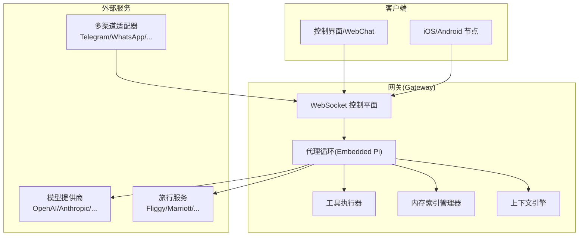
```mermaid
graph TB
subgraph "客户端"
UI["控制界面/WebChat"]
Nodes["iOS/Android 节点"]
end
subgraph "网关(Gateway)"
WS["WebSocket 控制平面"]
AgentLoop["代理循环(Embedded Pi)"]
Tools["工具执行器"]
Memory["内存索引管理器"]
CE["上下文引擎"]
end
subgraph "外部服务"
Channels["多渠道适配器<br/>Telegram/WhatsApp/..."]
Providers["模型提供商<br/>OpenAI/Anthropic/..."]
TravelServices["旅行服务<br/>Fliggy/Marriott/..."]
end
UI --> WS
Nodes --> WS
WS --> AgentLoop
AgentLoop --> Tools
AgentLoop --> Memory
AgentLoop --> CE
AgentLoop --> Providers
AgentLoop --> TravelServices
Channels --> WS
```

**图示来源**
- [README.md:185-239](file://README.md#L185-L239)
- [docs/concepts/agent-loop.md:18-49](file://docs/concepts/agent-loop.md#L18-L49)

**章节来源**
- [README.md:185-239](file://README.md#L185-L239)
- [docs/concepts/agent-loop.md:18-49](file://docs/concepts/agent-loop.md#L18-L49)

## 核心组件
- 代理作用域与路由
  - 通过会话键解析代理ID，支持默认代理与按会话路由。
  - 支持为每个代理配置工作区、技能过滤、沙箱模式、模型主备与心跳等。
- 内存索引管理器
  - 提供向量与关键词混合检索、批量嵌入、增量同步、只读数据库恢复、缓存统计与状态查询。
- 上下文引擎
  - 注册与解析上下文引擎工厂，支持传统引擎与初始化流程。
- 代理循环
  - 定义从入口到生命周期事件、流式输出、工具执行与持久化的完整链路；支持队列化与并发控制。
- **新增** JavaScript旅行规划技能
  - 基于Node.js的全新架构，提供完整的旅行计划生成、偏好管理和数据库管理功能。
- **新增** CLI参数解析系统
  - 统一的`--key=value`参数解析，支持JSON值内联和文件路径引用。
- **新增** 数据库管理器
  - 基于JSON文件的本地存储，提供偏好、行程、预算和状态管理。

**章节来源**
- [src/agents/agent-scope.ts:86-111](file://src/agents/agent-scope.ts#L86-L111)
- [src/agents/agent-scope.ts:118-145](file://src/agents/agent-scope.ts#L118-L145)
- [src/memory/manager.ts:61-187](file://src/memory/manager.ts#L61-L187)
- [src/context-engine/index.ts:1-20](file://src/context-engine/index.ts#L1-L20)
- [docs/concepts/agent-loop.md:23-49](file://docs/concepts/agent-loop.md#L23-L49)

## 架构总览
OpenClaw的代理循环以"单会话串行、全局可选队列"为核心，确保会话一致性与避免工具/会话竞态。代理运行时通过嵌入式Pi代理内核，订阅事件并桥接至OpenClaw的流式输出。工具执行与消息发送由工具执行器完成，记忆检索由内存索引管理器提供，上下文引擎负责系统提示词组装与压缩。

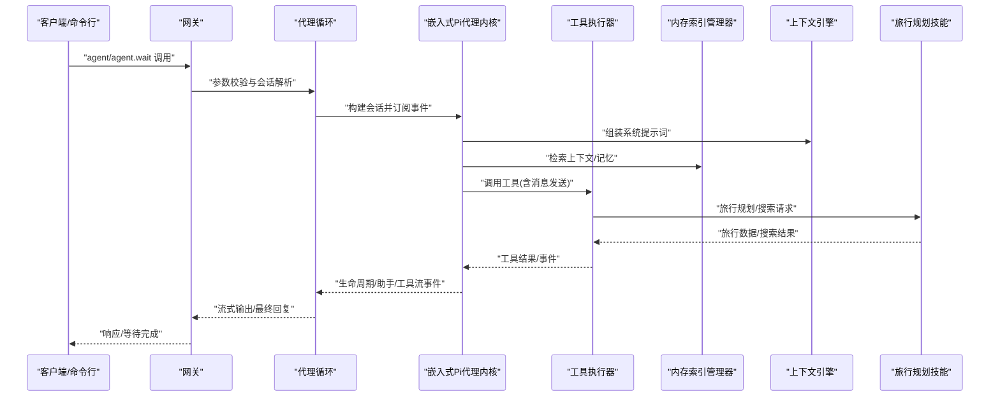
```mermaid
sequenceDiagram
participant Client as "客户端/命令行"
participant Gateway as "网关"
participant Agent as "代理循环"
participant Pi as "嵌入式Pi代理内核"
participant Tools as "工具执行器"
participant Mem as "内存索引管理器"
participant CE as "上下文引擎"
participant Travel as "旅行规划技能"
Client->>Gateway : "agent/agent.wait 调用"
Gateway->>Agent : "参数校验与会话解析"
Agent->>Pi : "构建会话并订阅事件"
Pi->>CE : "组装系统提示词"
Pi->>Mem : "检索上下文/记忆"
Pi->>Tools : "调用工具(含消息发送)"
Tools->>Travel : "旅行规划/搜索请求"
Travel-->>Tools : "旅行数据/搜索结果"
Tools-->>Pi : "工具结果/事件"
Pi-->>Agent : "生命周期/助手/工具流事件"
Agent-->>Gateway : "流式输出/最终回复"
Gateway-->>Client : "响应/等待完成"
```

**图示来源**
- [docs/concepts/agent-loop.md:25-44](file://docs/concepts/agent-loop.md#L25-L44)
- [docs/concepts/agent-loop.md:127-132](file://docs/concepts/agent-loop.md#L127-L132)

**章节来源**
- [docs/concepts/agent-loop.md:23-49](file://docs/concepts/agent-loop.md#L23-L49)

## 详细组件分析

### 组件A：代理作用域与会话路由
- 会话键解析
  - 支持从会话键中提取代理ID，若未显式指定则回退到默认代理或根据会话键推断。
- 代理配置解析
  - 解析代理名称、工作区、模型主备、技能过滤、记忆检索、心跳、身份、群聊、子代理、沙箱与工具白名单等。
- 工作区与目录解析
  - 默认工作区与代理专属工作区路径解析，支持路径规范化与根目录约束。
- 模型主备与回退
  - 支持代理级与全局级模型主备配置，以及回退策略覆盖。

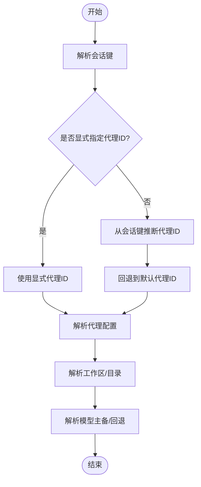
```mermaid
flowchart TD
Start(["开始"]) --> ParseKey["解析会话键"]
ParseKey --> HasExplicit{"是否显式指定代理ID?"}
HasExplicit --> |是| UseExplicit["使用显式代理ID"]
HasExplicit --> |否| Infer["从会话键推断代理ID"]
Infer --> Default["回退到默认代理ID"]
UseExplicit --> ResolveCfg["解析代理配置"]
Default --> ResolveCfg
ResolveCfg --> ResolveWS["解析工作区/目录"]
ResolveWS --> ModelFB["解析模型主备/回退"]
ModelFB --> Done(["结束"])
```

**图示来源**
- [src/agents/agent-scope.ts:86-111](file://src/agents/agent-scope.ts#L86-L111)
- [src/agents/agent-scope.ts:118-145](file://src/agents/agent-scope.ts#L118-L145)
- [src/agents/agent-scope.ts:256-272](file://src/agents/agent-scope.ts#L256-L272)
- [src/agents/agent-scope.ts:273-339](file://src/agents/agent-scope.ts#L273-L339)

**章节来源**
- [src/agents/agent-scope.ts:86-111](file://src/agents/agent-scope.ts#L86-L111)
- [src/agents/agent-scope.ts:118-145](file://src/agents/agent-scope.ts#L118-L145)
- [src/agents/agent-scope.ts:256-272](file://src/agents/agent-scope.ts#L256-L272)
- [src/agents/agent-scope.ts:273-339](file://src/agents/agent-scope.ts#L273-L339)

### 组件B：内存索引管理器（MemoryIndexManager）
- 功能概览
  - 向量与关键词混合检索、嵌入批处理、增量同步、只读数据库自动恢复、缓存统计与状态查询。
  - 支持按源过滤、会话监听与定时同步，提供搜索模式（FTS-only或Hybrid）与向量可用性探测。
- 关键流程
  - 搜索：根据查询类型选择向量/关键词/混合策略，合并结果并按阈值与数量裁剪。
  - 同步：检测只读错误并自动重建连接，保证数据一致性。
  - 文件读取：限制在工作区与额外允许路径范围内，支持按行切片读取。

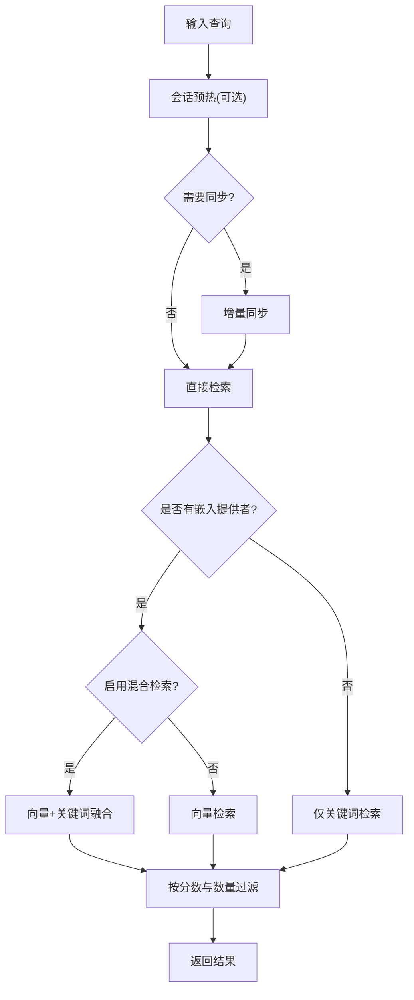
```mermaid
flowchart TD
Q["输入查询"] --> Warm["会话预热(可选)"]
Warm --> Dirty{"需要同步?"}
Dirty --> |是| Sync["增量同步"]
Dirty --> |否| Search["直接检索"]
Sync --> Search
Search --> Provider{"是否有嵌入提供者?"}
Provider --> |否| FTS["仅关键词检索"]
Provider --> |是| Hybrid{"启用混合检索?"}
Hybrid --> |是| Merge["向量+关键词融合"]
Hybrid --> |否| Vec["向量检索"]
Merge --> Filter["按分数与数量过滤"]
Vec --> Filter
FTS --> Filter
Filter --> Out["返回结果"]
```

**图示来源**
- [src/memory/manager.ts:256-364](file://src/memory/manager.ts#L256-L364)
- [src/memory/manager.ts:451-551](file://src/memory/manager.ts#L451-L551)
- [src/memory/manager.ts:553-624](file://src/memory/manager.ts#L553-L624)

**章节来源**
- [src/memory/manager.ts:61-187](file://src/memory/manager.ts#L61-L187)
- [src/memory/manager.ts:256-364](file://src/memory/manager.ts#L256-L364)
- [src/memory/manager.ts:451-551](file://src/memory/manager.ts#L451-L551)
- [src/memory/manager.ts:553-624](file://src/memory/manager.ts#L553-L624)

### 组件C：上下文引擎（Context Engine）
- 能力
  - 导出上下文引擎类型、注册与解析工厂、初始化流程与遗留引擎支持。
- 应用
  - 在代理循环中用于系统提示词构建、上下文组装与压缩，确保模型输入质量与长度控制。

**章节来源**
- [src/context-engine/index.ts:1-20](file://src/context-engine/index.ts#L1-L20)

### 组件D：代理循环（Agent Loop）
- 生命周期
  - 入口：网关RPC与CLI命令；参数验证、会话解析、元数据持久化后立即返回runId。
  - 执行：加载技能快照、运行嵌入式Pi代理、订阅事件并桥接流事件。
  - 结束：等待生命周期事件或超时，返回状态与时间戳。
- 队列与并发
  - 每个会话键串行执行，可选通过全局队列；消息通道可选择队列模式（收集/引导/跟进）。
- 流式输出
  - 助手块流与推理流可分别或合并输出；消息工具重复抑制与最终payload整形。
- 钩子与拦截
  - 内部钩子与插件钩子贯穿生命周期，支持在模型解析、提示词构建、工具调用前后注入逻辑。

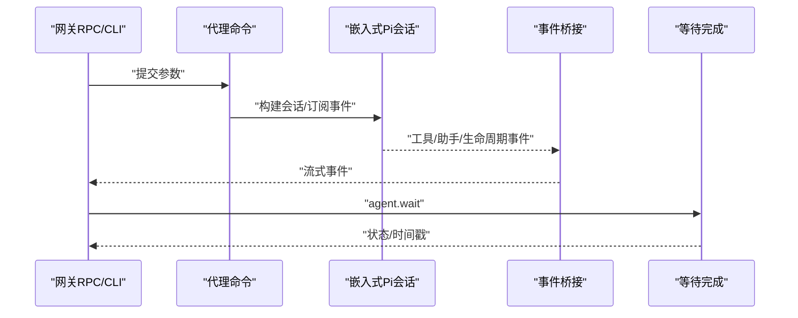
```mermaid
sequenceDiagram
participant RPC as "网关RPC/CLI"
participant Agent as "代理命令"
participant Pi as "嵌入式Pi会话"
participant Bridge as "事件桥接"
participant Wait as "等待完成"
RPC->>Agent : "提交参数"
Agent->>Pi : "构建会话/订阅事件"
Pi-->>Bridge : "工具/助手/生命周期事件"
Bridge-->>RPC : "流式事件"
RPC->>Wait : "agent.wait"
Wait-->>RPC : "状态/时间戳"
```

**图示来源**
- [docs/concepts/agent-loop.md:25-44](file://docs/concepts/agent-loop.md#L25-L44)
- [docs/concepts/agent-loop.md:127-132](file://docs/concepts/agent-loop.md#L127-L132)

**章节来源**
- [docs/concepts/agent-loop.md:18-49](file://docs/concepts/agent-loop.md#L18-L49)
- [docs/concepts/agent-loop.md:127-132](file://docs/concepts/agent-loop.md#L127-L132)

## 新增功能模块

### JavaScript旅行规划技能架构

**更新** 旅行规划技能已从Python架构完全迁移到JavaScript架构，提供更现代化的模块化设计和更好的性能表现。

旅行规划技能现在采用纯JavaScript实现，基于Node.js生态系统，提供完整的旅行计划生成、偏好管理和数据库管理功能。新架构采用模块化设计，每个功能模块都有清晰的职责分工和统一的CLI参数解析系统。

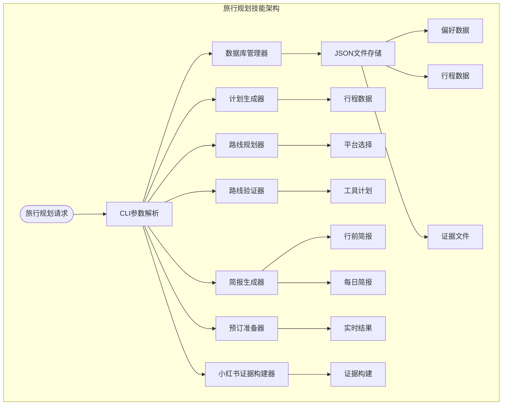
```mermaid
flowchart TD
subgraph "旅行规划技能架构"
Start(["旅行规划请求"]) --> CLI["CLI参数解析"]
CLI --> DB["数据库管理器"]
CLI --> PlanGen["计划生成器"]
CLI --> RoutePlan["路线规划器"]
CLI --> RouteVal["路线验证器"]
CLI --> Briefing["简报生成器"]
CLI --> Booking["预订准备器"]
CLI --> XHSEvidence["小红书证据构建器"]
DB --> JSONStore["JSON文件存储"]
PlanGen --> TripData["行程数据"]
RoutePlan --> PlatformSel["平台选择"]
RouteVal --> ToolPlan["工具计划"]
Briefing --> PreTrip["行前简报"]
Briefing --> DailyBrief["每日简报"]
Booking --> LiveResults["实时结果"]
XHSEvidence --> Evidence["证据构建"]
JSONStore --> Preferences["偏好数据"]
JSONStore --> Trips["行程数据"]
JSONStore --> EvidenceFiles["证据文件"]
end
```

**图示来源**
- [skills/travel-planner/scripts/cli_args.mjs:155-187](file://skills/travel-planner/scripts/cli_args.mjs#L155-L187)
- [skills/travel-planner/scripts/db.mjs:25-35](file://skills/travel-planner/scripts/db.mjs#L25-L35)
- [skills/travel-planner/SKILL.md:412-447](file://skills/travel-planner/SKILL.md#L412-L447)

#### CLI参数解析系统

**新增** 统一的CLI参数解析系统，支持`--key=value`格式和JSON值内联。

新的CLI参数解析系统提供了标准化的命令行接口，支持以下特性：

- `--key=value`格式的参数传递
- JSON值内联支持和文件路径引用（`@/path/to.json`）
- 参数验证和错误处理
- 自动生成帮助信息
- 类型安全的参数访问

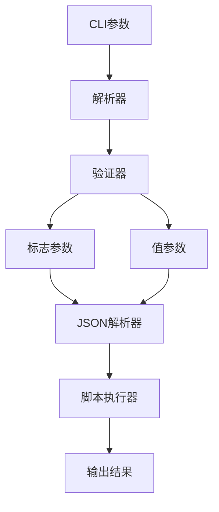
```mermaid
flowchart TD
CLIArgs["CLI参数"] --> Parse["解析器"]
Parse --> Validate["验证器"]
Validate --> Flags["标志参数"]
Validate --> Values["值参数"]
Flags --> JSONParser["JSON解析器"]
Values --> JSONParser
JSONParser --> RunScript["脚本执行器"]
RunScript --> Output["输出结果"]
```

**图示来源**
- [skills/travel-planner/scripts/cli_args.mjs:29-55](file://skills/travel-planner/scripts/cli_args.mjs#L29-L55)
- [skills/travel-planner/scripts/cli_args.mjs:155-187](file://skills/travel-planner/scripts/cli_args.mjs#L155-L187)

#### 数据库管理器

**新增** 基于JSON文件的本地存储系统，提供完整的数据持久化功能。

数据库管理器是旅行规划技能的核心组件，负责所有数据的持久化存储和管理：

- 偏好数据管理：旅行偏好、预算设置、兴趣爱好等
- 行程数据管理：当前行程、历史行程、行程想法等
- 实时结果存储：交通、酒店、景点等实时查询结果
- 证据文件管理：小红书等平台的搜索证据
- 状态跟踪：行程阶段、预订状态、支出记录等

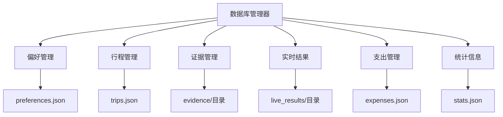
```mermaid
flowchart TD
DBManager["数据库管理器"] --> Preferences["偏好管理"]
DBManager --> Trips["行程管理"]
DBManager --> Evidence["证据管理"]
DBManager --> LiveResults["实时结果"]
DBManager --> Expenses["支出管理"]
DBManager --> Stats["统计信息"]
Preferences --> PrefFile["preferences.json"]
Trips --> TripsFile["trips.json"]
Evidence --> EvidenceDir["evidence/目录"]
LiveResults --> LiveDir["live_results/目录"]
Expenses --> ExpenseFile["expenses.json"]
Stats --> StatsFile["stats.json"]
```

**图示来源**
- [skills/travel-planner/scripts/db.mjs:25-35](file://skills/travel-planner/scripts/db.mjs#L25-L35)
- [skills/travel-planner/scripts/db.mjs:127-165](file://skills/travel-planner/scripts/db.mjs#L127-L165)

**章节来源**
- [skills/travel-planner/SKILL.md:13-447](file://skills/travel-planner/SKILL.md#L13-L447)
- [skills/travel-planner/scripts/cli_args.mjs:1-187](file://skills/travel-planner/scripts/cli_args.mjs#L1-L187)
- [skills/travel-planner/scripts/db.mjs:1-837](file://skills/travel-planner/scripts/db.mjs#L1-L837)

### 旅行规划技能核心模块

#### 计划生成器（Plan Generator）

**更新** 计划生成器现在完全基于JavaScript实现，提供更高效的旅行计划生成能力。

计划生成器负责将已持久化的行程数据转换为结构化的旅行计划骨架，支持以下功能：

- 从数据库读取行程数据
- 生成计划骨架和每日行程
- 计算预算分解和打包清单
- 生成行前和每日简报
- 与预订准备器集成

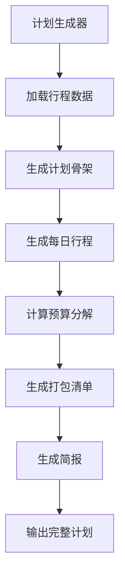
```mermaid
flowchart TD
PlanGen["计划生成器"] --> LoadTrip["加载行程数据"]
LoadTrip --> GenerateSkeleton["生成计划骨架"]
GenerateSkeleton --> GenerateDaily["生成每日行程"]
GenerateDaily --> CalculateBudget["计算预算分解"]
CalculateBudget --> GenerateChecklist["生成打包清单"]
GenerateChecklist --> GenerateBrief["生成简报"]
GenerateBrief --> OutputPlan["输出完整计划"]
```

**图示来源**
- [skills/travel-planner/scripts/plan-generator.mjs:534-654](file://skills/travel-planner/scripts/plan-generator.mjs#L534-L654)

#### 路线规划器（Route Planner）

**更新** 路线规划器采用新的JavaScript实现，提供更灵活的路线选择和验证功能。

路线规划器负责根据用户偏好和平台证据生成候选路线：

- 支持多个平台的路线生成（小红书、高德地图、搜索引擎）
- 自动降级机制和错误处理
- 路线比较和推荐
- 证据质量和来源追踪

#### 路线验证器（Route Validator）

**更新** 路线验证器提供实时的旅行可行性验证，确保计划的可执行性。

路线验证器负责验证旅行计划的可行性：

- 交通可达性验证
- 天气风险评估
- 酒店和景点可用性检查
- 决策门限和风险评级

#### 简报生成器（Briefing Generator）

**更新** 简报生成功能现在支持行前和每日两种模式，提供个性化的旅行指导。

简报生成器负责生成旅行过程中的重要信息：

- 行前简报：出发前的重要事项和准备工作
- 每日简报：当天的活动安排和注意事项
- 个性化提醒：基于用户偏好的特殊提醒

#### 预订准备器（Booking Ready）

**更新** 预订准备器整合实时搜索结果，生成可执行的预订决策包。

预订准备器负责将实时查询结果转换为可执行的预订建议：

- 合并多源实时数据
- 生成最优预订组合
- 风险评估和注意事项
- 决策支持和建议

#### 小红书证据构建器（XHS Evidence Builder）

**更新** 小红书证据构建器专门处理小红书平台的搜索结果，提取有用的旅行线索。

小红书证据构建器负责处理小红书平台的旅行内容：

- 文章内容解析和过滤
- 路线线索提取和聚类
- 热门程度评估
- 证据质量评级

**章节来源**
- [skills/travel-planner/scripts/plan-generator.mjs:1-703](file://skills/travel-planner/scripts/plan-generator.mjs#L1-L703)
- [skills/travel-planner/scripts/route-plan.mjs:1-285](file://skills/travel-planner/scripts/route-plan.mjs#L1-L285)
- [skills/travel-planner/scripts/route-validation.mjs:1-382](file://skills/travel-planner/scripts/route-validation.mjs#L1-L382)
- [skills/travel-planner/scripts/briefing.mjs:1-149](file://skills/travel-planner/scripts/briefing.mjs#L1-L149)
- [skills/travel-planner/scripts/booking-ready.mjs:1-260](file://skills/travel-planner/scripts/booking-ready.mjs#L1-L260)
- [skills/travel-planner/scripts/xhs-evidence-builder.mjs:1-183](file://skills/travel-planner/scripts/xhs-evidence-builder.mjs#L1-L183)

## UI组件更新

### 技能管理系统
新的UI组件提供了完整的技能安装、管理和监控功能，支持旅行规划和FlyAI等新技能的集成。

- 技能卡片组件
  - 显示技能基本信息、状态和可用操作。
  - 支持安装、启用、禁用、删除等操作。
  - 实时显示安装进度和错误信息。

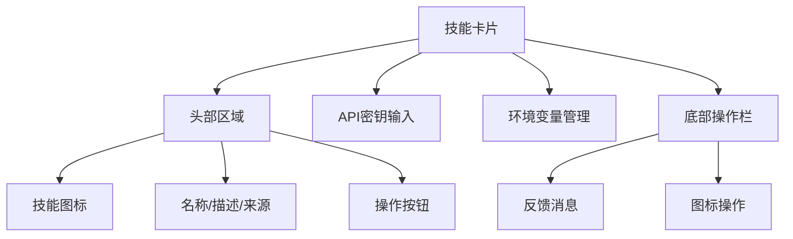
```mermaid
flowchart TD
SkillCard["技能卡片"] --> Header["头部区域"]
Header --> Icon["技能图标"]
Header --> Info["名称/描述/来源"]
Header --> Action["操作按钮"]
SkillCard --> APIKey["API密钥输入"]
SkillCard --> EnvVars["环境变量管理"]
SkillCard --> Footer["底部操作栏"]
Footer --> Feedback["反馈消息"]
Footer --> Actions["图标操作"]
```

**图示来源**
- [ui-react/src/components/skills/SkillCard.tsx:94-318](file://ui-react/src/components/skills/SkillCard.tsx#L94-L318)

- 技能安装流程
  - 支持从URL或文件上传安装新技能。
  - 自动检测缺失的二进制依赖和环境变量。
  - 提供详细的安装进度反馈和错误处理。

**章节来源**
- [ui/src/ui/controllers/skills.ts:125-157](file://ui/src/ui/controllers/skills.ts#L125-L157)
- [ui-react/src/store/skills.store.ts:208-253](file://ui-react/src/store/skills.store.ts#L208-L253)
- [ui-react/src/components/skills/SkillCard.tsx:1-320](file://ui-react/src/components/skills/SkillCard.tsx#L1-L320)
- [ui-react/src/lib/skills-grouping.ts:1-67](file://ui-react/src/lib/skills-grouping.ts#L1-L67)

### Canvas A2UI集成
Canvas A2UI组件提供了增强的用户界面交互能力，支持复杂的用户动作处理和状态管理。

- 用户动作处理
  - 支持复杂的组件上下文解析和数据绑定。
  - 提供结构化对象和字符串消息的双向兼容。
  - 实现完整的动作生命周期管理。

**章节来源**
- [apps/shared/OpenClawKit/Tools/CanvasA2UI/bootstrap.js:393-496](file://apps/shared/OpenClawKit/Tools/CanvasA2UI/bootstrap.js#L393-L496)

## 依赖关系分析
- 组件耦合
  - 代理循环依赖上下文引擎进行提示词组装、依赖内存索引管理器进行上下文检索、依赖工具执行器进行动作执行。
  - 代理作用域为上述组件提供会话键解析与代理配置，决定工作区、模型与沙箱策略。
  - **新增** JavaScript旅行规划技能通过Node.js模块化架构与系统集成，提供本地数据持久化。
  - **新增** CLI参数解析系统为所有技能脚本提供统一的命令行接口。
  - **新增** 数据库管理器提供JSON文件存储和状态管理功能。
- 外部依赖
  - 模型提供商（OpenAI/Anthropic等）通过嵌入式Pi代理内核访问。
  - 多渠道适配器通过网关WebSocket接入，形成统一的消息入口。
  - **新增** 各种旅行服务API通过技能接口访问，如Fliggy MCP、小红书、高德地图等。

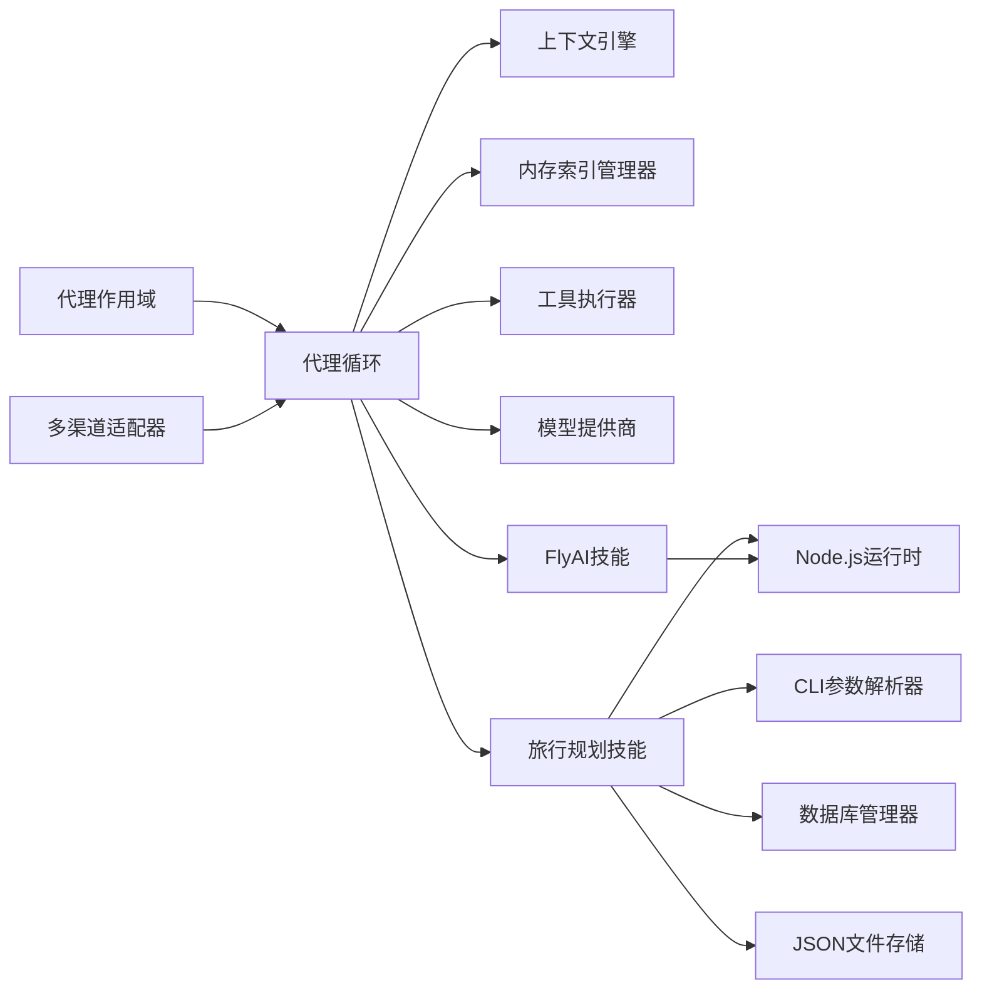
```mermaid
graph LR
AgentScope["代理作用域"] --> AgentLoop["代理循环"]
AgentLoop --> CE["上下文引擎"]
AgentLoop --> Memory["内存索引管理器"]
AgentLoop --> Tools["工具执行器"]
AgentLoop --> Providers["模型提供商"]
AgentLoop --> TravelSkills["旅行规划技能"]
AgentLoop --> FlyAISkills["FlyAI技能"]
Channels["多渠道适配器"] --> AgentLoop
TravelSkills --> NodeRuntime["Node.js运行时"]
TravelSkills --> CLIParser["CLI参数解析器"]
TravelSkills --> DBManager["数据库管理器"]
TravelSkills --> JSONStorage["JSON文件存储"]
FlyAISkills --> NodeRuntime
```

**图示来源**
- [src/agents/agent-scope.ts:86-111](file://src/agents/agent-scope.ts#L86-L111)
- [docs/concepts/agent-loop.md:25-44](file://docs/concepts/agent-loop.md#L25-L44)

**章节来源**
- [src/agents/agent-scope.ts:86-111](file://src/agents/agent-scope.ts#L86-L111)
- [docs/concepts/agent-loop.md:25-44](file://docs/concepts/agent-loop.md#L25-L44)

## 性能考量
- 代理循环
  - 单会话串行执行降低竞态风险；可通过队列模式优化消息吞吐。
  - 嵌入式Pi代理内核的超时控制与生命周期事件有助于及时中断长耗时运行。
- 内存检索
  - 向量与关键词混合检索可提升召回质量；合理设置候选数与权重、MMR与时间衰减参数可平衡精度与性能。
  - 批量嵌入与缓存统计减少重复计算；只读数据库自动恢复保障稳定性。
- 上下文组装
  - 合理的系统提示词长度与压缩策略可降低token消耗，提高响应速度。
- **新增** JavaScript旅行规划技能
  - Node.js运行时相比Python具有更好的性能表现和更低的内存占用。
  - 模块化设计减少了不必要的依赖加载，提高了启动速度。
  - JSON文件存储比数据库操作更快，适合频繁的读写操作。
- **新增** CLI参数解析系统
  - 统一的参数解析减少了重复代码，提高了脚本的一致性和可靠性。
  - 错误处理和验证机制确保了参数的正确性。
- **新增** 数据库管理器
  - JSON文件存储提供了简单可靠的数据持久化方案。
  - 自动文件创建和默认值设置减少了初始化复杂度。

## 故障排查指南
- 代理循环
  - 使用agent.wait等待生命周期结束，检查状态与错误信息；关注超时、取消信号与网关断开等早停条件。
- 内存检索
  - 若出现只读数据库错误，系统会自动重建连接；可查看readonlyRecovery统计与最后一次错误原因。
  - 检查向量维度、FTS可用性与提供者状态；必要时切换到FTS-only模式或调整混合检索参数。
- 上下文引擎
  - 确认系统提示词构建阶段的钩子未引入过长内容；必要时启用压缩钩子或调整提示词长度限制。
- **新增** JavaScript旅行规划技能
  - Node.js运行时检查：确认Node.js版本兼容性和运行时环境。
  - 文件权限检查：确保用户对`~/.openclaw/agents/travel-planner`目录有读写权限。
  - JSON文件格式验证：检查JSON文件的语法正确性和数据完整性。
  - 模块依赖检查：确认所有必需的Node.js模块已正确安装。
- **新增** CLI参数解析系统
  - 参数格式验证：确保使用正确的`--key=value`格式。
  - JSON值解析：检查JSON语法错误和文件路径有效性。
  - 参数验证：确认必需参数已提供且格式正确。
- **新增** 数据库管理器
  - 文件存在性检查：确认JSON文件存在且可访问。
  - 数据完整性验证：检查数据结构的完整性和一致性。
  - 错误处理：查看具体的错误信息和解决建议。

**章节来源**
- [docs/concepts/agent-loop.md:138-149](file://docs/concepts/agent-loop.md#L138-L149)
- [src/memory/manager.ts:468-551](file://src/memory/manager.ts#L468-L551)
- [src/memory/manager.ts:626-738](file://src/memory/manager.ts#L626-L738)

## 结论
OpenClaw通过"网关+代理循环+工具+记忆+上下文引擎"的分层架构，实现了从消息到动作再到回复的完整闭环。系统现已成功集成了全新的JavaScript旅行规划技能，该技能完全替代了原有的Python实现，提供了更现代、更高效的架构设计。新增的CLI参数解析系统和数据库管理器进一步提升了技能的可用性和可靠性。新增的UI组件进一步提升了用户体验，支持技能的安装、管理和监控。代理作用域与会话路由确保多代理协作与会话隔离；内存检索提供高效的知识检索能力；代理循环与钩子体系支撑灵活的推理与决策流程。结合队列化与并发控制、只读数据库恢复与缓存策略，以及新的JavaScript旅行规划技能，系统在性能与稳定性之间取得良好平衡。

## 附录

### 工具开发指南
- 插件钩子
  - 在before_model_resolve、before_prompt_build、before_tool_call、after_tool_call、tool_result_persist等钩子中注入自定义逻辑。
- 工具调用
  - 工具事件通过tool流输出，结果在持久化前可被tool_result_persist转换。
- **新增** JavaScript旅行规划技能开发
  - 使用Node.js和ES模块系统开发，遵循统一的CLI参数解析规范。
  - 实现完整的错误处理和数据验证机制。
  - 使用JSON文件进行数据持久化，确保数据一致性和可靠性。
- **新增** CLI参数解析开发
  - 使用`runScript()`工厂函数简化脚本开发。
  - 实现参数验证和错误处理。
  - 支持JSON值内联和文件路径引用。

**章节来源**
- [docs/concepts/agent-loop.md:80-95](file://docs/concepts/agent-loop.md#L80-L95)

### 内存查询接口
- 搜索
  - 支持向量/关键词/混合检索，可设置最大结果数、最小分数、会话键等参数。
- 状态
  - 返回文件/片段计数、脏标记、提供者信息、缓存统计、FTS/向量可用性与批处理失败统计。
- 文件读取
  - 限定在工作区与额外允许路径范围内，支持按行切片读取。

**章节来源**
- [src/memory/index.ts:1-12](file://src/memory/index.ts#L1-L12)
- [src/memory/manager.ts:256-364](file://src/memory/manager.ts#L256-L364)
- [src/memory/manager.ts:626-738](file://src/memory/manager.ts#L626-L738)
- [src/memory/manager.ts:553-624](file://src/memory/manager.ts#L553-L624)

### 会话路由策略
- 会话键解析
  - 优先显式代理ID，其次从会话键解析，最后回退到默认代理。
- 代理配置
  - 通过代理作用域解析工作区、模型主备、技能过滤、沙箱与工具白名单等。

**章节来源**
- [src/agents/agent-scope.ts:86-111](file://src/agents/agent-scope.ts#L86-L111)
- [src/agents/agent-scope.ts:118-145](file://src/agents/agent-scope.ts#L118-L145)

### 代理配置示例与最佳实践
- 基础配置
  - 参考最小配置与全量配置参考，明确模型与默认项。
- 安全与沙箱
  - 主会话默认允许工具执行；非主会话建议启用沙箱并限制工具白名单。
- 思考与冗长度
  - 使用/think与/verbose命令调节思考深度与冗长度，结合/streaming行为优化体验。
- **新增** JavaScript旅行规划技能配置
  - 确保Node.js运行时可用，检查脚本依赖完整性。
  - 配置旅行偏好数据库目录权限，确保数据持久化正常。
  - 使用统一的CLI参数格式进行技能调用。

**章节来源**
- [README.md:318-338](file://README.md#L318-L338)
- [README.md:270-282](file://README.md#L270-L282)

### 多代理协作与会话隔离
- 多代理
  - 通过代理作用域解析不同代理ID，各自拥有独立工作区与配置。
- 会话隔离
  - 每个会话键对应独立的串行执行通道，避免跨会话竞态。

**章节来源**
- [src/agents/agent-scope.ts:86-111](file://src/agents/agent-scope.ts#L86-L111)
- [docs/concepts/agent-loop.md:45-49](file://docs/concepts/agent-loop.md#L45-L49)

### 安全控制机制
- 默认策略
  - 主会话默认允许工具执行；群组/频道安全建议启用沙箱并限制工具白名单。
- 权限与节点
  - macOS节点权限需遵循TCC；执行本地动作需通过node.invoke并注意权限状态。
- **新增** JavaScript旅行规划技能安全
  - Node.js脚本执行需要适当的沙箱隔离，防止恶意代码执行。
  - JSON文件访问需要权限控制，避免敏感信息泄露。
  - CLI参数解析需要输入验证，防止注入攻击。
- **新增** 数据库管理器安全
  - 文件系统权限管理，确保数据文件的安全访问。
  - JSON数据验证，防止损坏的数据文件。
  - 路径遍历防护，防止恶意文件路径访问。

**章节来源**
- [README.md:332-338](file://README.md#L332-L338)
- [README.md:240-253](file://README.md#L240-L253)

### 技能安装与管理
- 技能安装流程
  - 通过UI界面或命令行安装新技能，自动检测依赖要求。
  - 支持从URL或本地文件导入技能包。
- 技能状态监控
  - 实时显示技能安装进度、运行状态和错误信息。
  - 提供技能启用/禁用和删除操作。

**章节来源**
- [ui/src/ui/controllers/skills.ts:125-157](file://ui/src/ui/controllers/skills.ts#L125-L157)
- [ui-react/src/store/skills.store.ts:208-253](file://ui-react/src/store/skills.store.ts#L208-L253)
- [ui-react/src/components/skills/SkillCard.tsx:1-320](file://ui-react/src/components/skills/SkillCard.tsx#L1-L320)