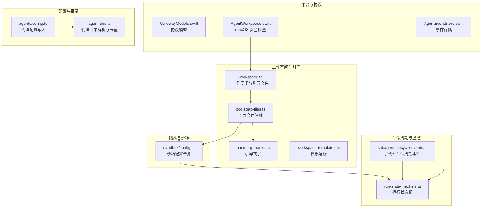
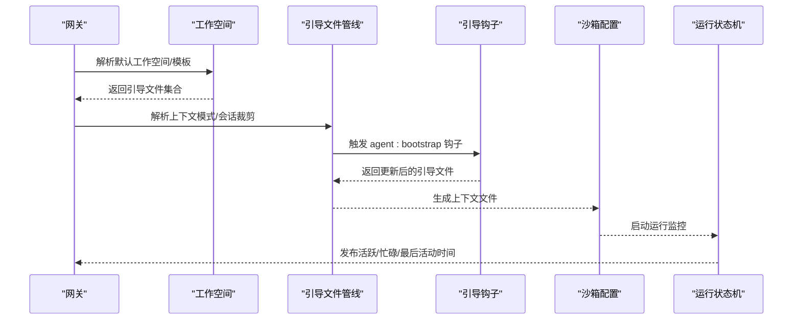
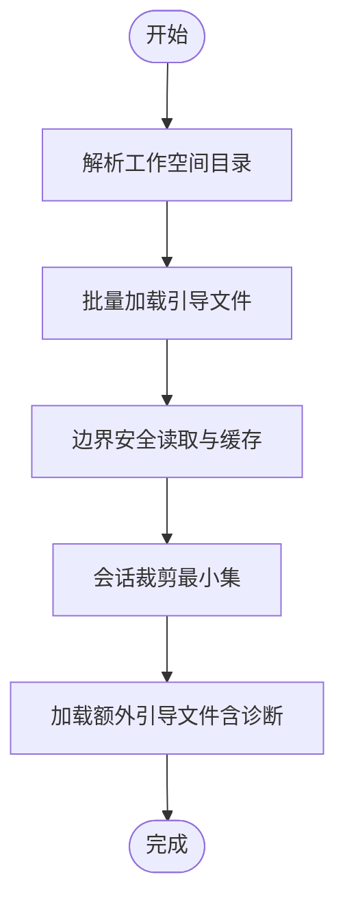
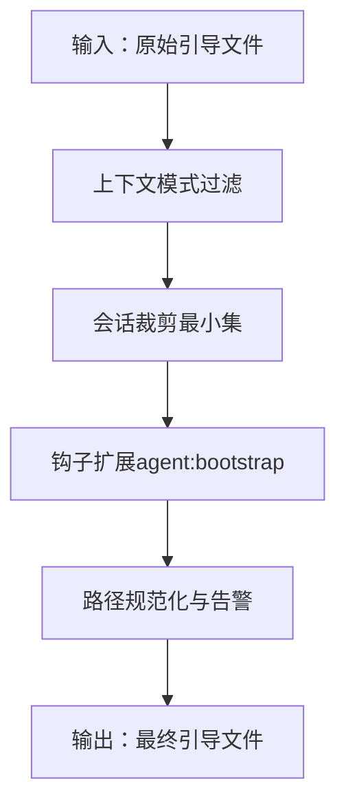
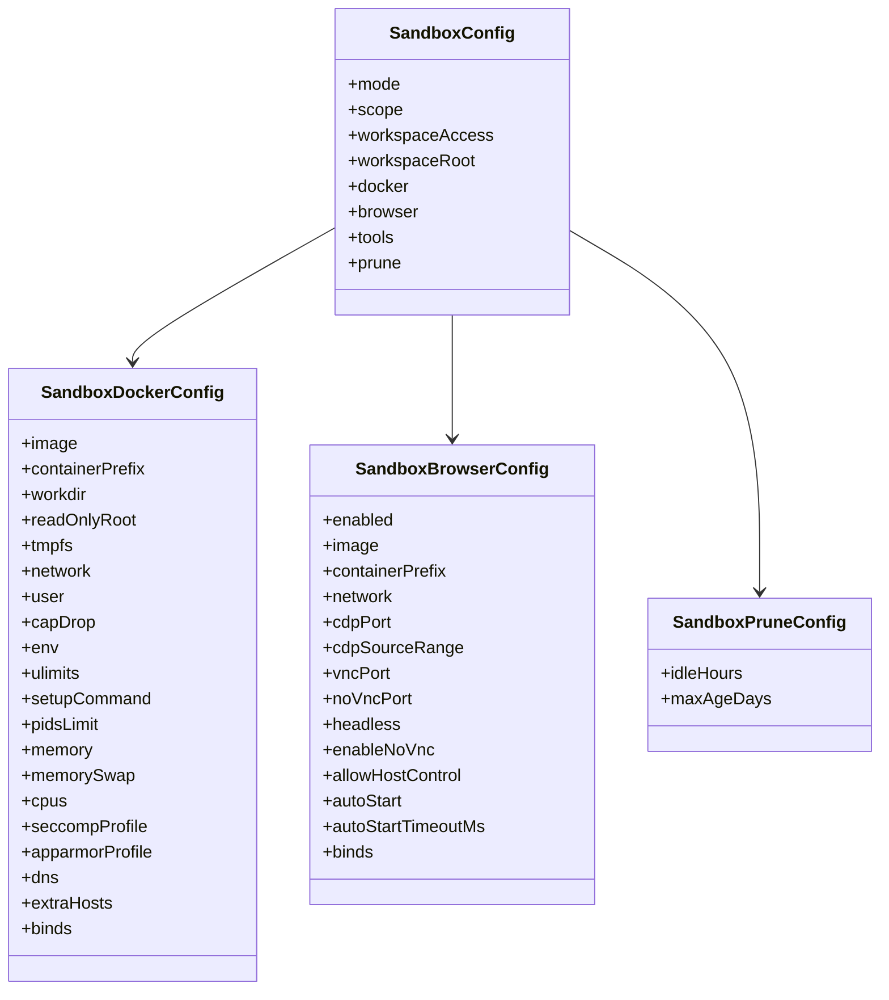
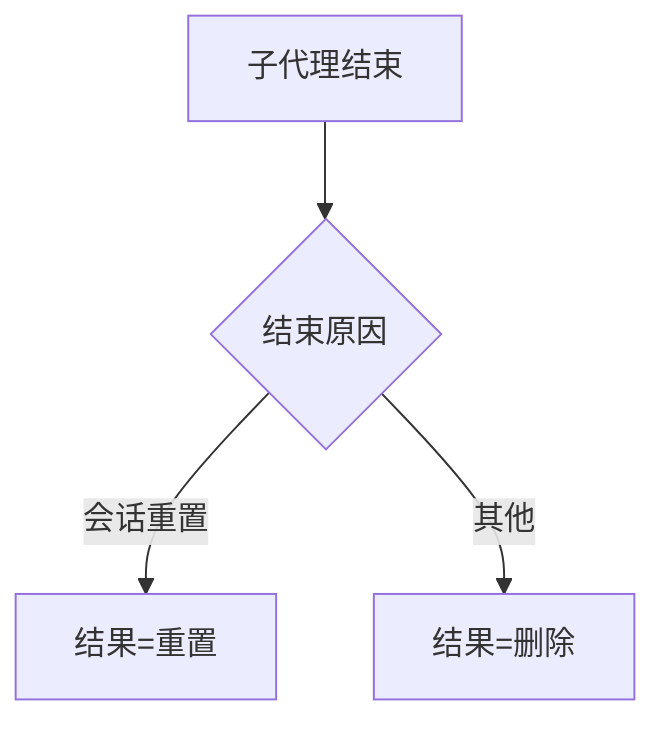
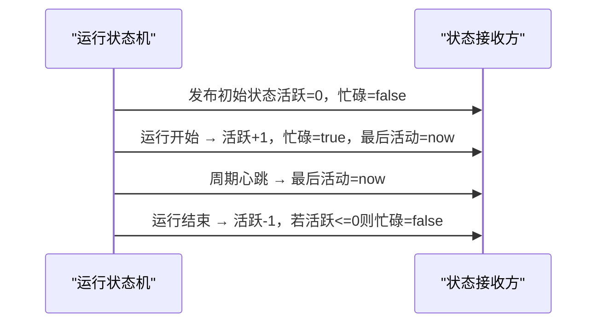
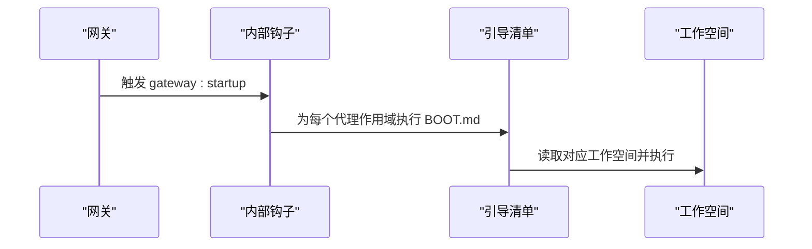
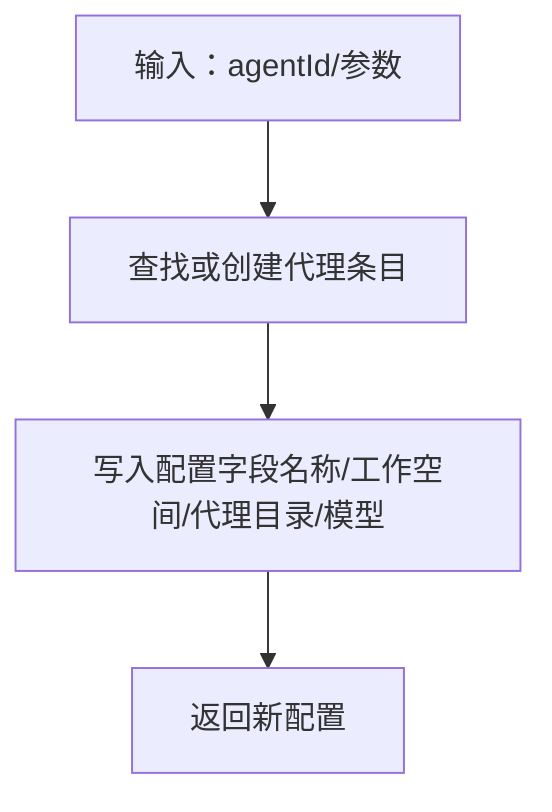
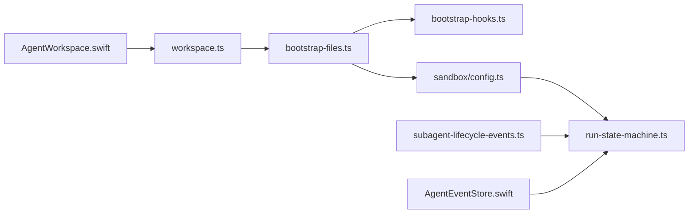

# 代理生命周期管理

<cite>
**本文引用的文件**
- [src/agents/workspace.ts](file://src/agents/workspace.ts)
- [src/agents/bootstrap-files.ts](file://src/agents/bootstrap-files.ts)
- [src/agents/bootstrap-hooks.ts](file://src/agents/bootstrap-hooks.ts)
- [src/agents/sandbox/config.ts](file://src/agents/sandbox/config.ts)
- [src/agents/subagent-lifecycle-events.ts](file://src/agents/subagent-lifecycle-events.ts)
- [src/channels/run-state-machine.ts](file://src/channels/run-state-machine.ts)
- [src/hooks/bundled/boot-md/HOOK.md](file://src/hooks/bundled/boot-md/HOOK.md)
- [src/hooks/bundled/boot-md/handler.gateway-startup.integration.test.ts](file://src/hooks/bundled/boot-md/handler.gateway-startup.integration.test.ts)
- [src/commands/agents.config.ts](file://src/commands/agents.config.ts)
- [src/config/agent-dirs.ts](file://src/config/agent-dirs.ts)
- [apps/macos/Sources/OpenClaw/AgentWorkspace.swift](file://apps/macos/Sources/OpenClaw/AgentWorkspace.swift)
- [apps/macos/Sources/OpenClawKit/Sources/OpenClawProtocol/GatewayModels.swift](file://apps/macos/Sources/OpenClawKit/Sources/OpenClawProtocol/GatewayModels.swift)
- [apps/macos/Sources/OpenClaw/AgentEventStore.swift](file://apps/macos/Sources/OpenClaw/AgentEventStore.swift)
- [src/agents/workspace-templates.ts](file://src/agents/workspace-templates.ts)
</cite>

## 目录

1. [简介](#简介)
2. [项目结构](#项目结构)
3. [核心组件](#核心组件)
4. [架构总览](#架构总览)
5. [详细组件分析](#详细组件分析)
6. [依赖关系分析](#依赖关系分析)
7. [性能考量](#性能考量)
8. [故障排查指南](#故障排查指南)
9. [结论](#结论)
10. [附录](#附录)

## 简介

本文件系统性阐述 OpenClaw 代理生命周期管理的技术细节，覆盖代理的创建、初始化、启动、运行与销毁全链路；详解代理路径管理、作用域隔离、引导文件处理与工作空间配置；说明代理配置文件格式、环境变量注入与资源分配机制；提供代理创建示例、生命周期钩子与状态监控方法，并涵盖代理间隔离、权限控制与资源限制策略。

## 项目结构

围绕代理生命周期的关键模块分布如下：

- 工作空间与引导文件：负责工作空间目录解析、默认模板、引导文件加载与安全读取
- 引导文件管线：负责上下文模式过滤、会话粒度裁剪、钩子扩展与最终校验
- 沙箱与隔离：负责容器镜像、网络、卷挂载、工具策略、浏览器沙箱与清理策略
- 子代理生命周期：负责子代理结束原因与结果映射
- 运行状态机：负责运行活动心跳与状态发布
- 钩子与启动：负责网关启动时的引导清单执行
- 配置与目录：负责代理配置写入与代理目录去重

**图表来源**

- [src/agents/workspace.ts:1-656](file://src/agents/workspace.ts#L1-L656)
- [src/agents/bootstrap-files.ts:1-119](file://src/agents/bootstrap-files.ts#L1-L119)
- [src/agents/bootstrap-hooks.ts:1-32](file://src/agents/bootstrap-hooks.ts#L1-L32)
- [src/agents/sandbox/config.ts:1-217](file://src/agents/sandbox/config.ts#L1-L217)
- [src/agents/subagent-lifecycle-events.ts:1-48](file://src/agents/subagent-lifecycle-events.ts#L1-L48)
- [src/channels/run-state-machine.ts:1-56](file://src/channels/run-state-machine.ts#L1-L56)
- [apps/macos/Sources/OpenClaw/AgentWorkspace.swift:73-92](file://apps/macos/Sources/OpenClaw/AgentWorkspace.swift#L73-L92)
- [apps/macos/Sources/OpenClawKit/Sources/OpenClawProtocol/GatewayModels.swift:1345-1383](file://apps/macos/Sources/OpenClawKit/Sources/OpenClawProtocol/GatewayModels.swift#L1345-L1383)
- [apps/macos/Sources/OpenClaw/AgentEventStore.swift:1-22](file://apps/macos/Sources/OpenClaw/AgentEventStore.swift#L1-L22)
- [src/commands/agents.config.ts:127-178](file://src/commands/agents.config.ts#L127-L178)
- [src/config/agent-dirs.ts:40-84](file://src/config/agent-dirs.ts#L40-L84)

**章节来源**

- [src/agents/workspace.ts:1-656](file://src/agents/workspace.ts#L1-L656)
- [src/agents/bootstrap-files.ts:1-119](file://src/agents/bootstrap-files.ts#L1-L119)
- [src/agents/bootstrap-hooks.ts:1-32](file://src/agents/bootstrap-hooks.ts#L1-L32)
- [src/agents/sandbox/config.ts:1-217](file://src/agents/sandbox/config.ts#L1-L217)
- [src/agents/subagent-lifecycle-events.ts:1-48](file://src/agents/subagent-lifecycle-events.ts#L1-L48)
- [src/channels/run-state-machine.ts:1-56](file://src/channels/run-state-machine.ts#L1-L56)
- [apps/macos/Sources/OpenClaw/AgentWorkspace.swift:73-92](file://apps/macos/Sources/OpenClaw/AgentWorkspace.swift#L73-L92)
- [apps/macos/Sources/OpenClawKit/Sources/OpenClawProtocol/GatewayModels.swift:1345-1383](file://apps/macos/Sources/OpenClawKit/Sources/OpenClawProtocol/GatewayModels.swift#L1345-L1383)
- [apps/macos/Sources/OpenClaw/AgentEventStore.swift:1-22](file://apps/macos/Sources/OpenClaw/AgentEventStore.swift#L1-L22)
- [src/commands/agents.config.ts:127-178](file://src/commands/agents.config.ts#L127-L178)
- [src/config/agent-dirs.ts:40-84](file://src/config/agent-dirs.ts#L40-L84)

## 核心组件

- 工作空间与引导文件
  - 默认工作空间目录解析、模板加载、引导文件批量读取与边界安全读取
  - 支持额外引导文件按通配符加载并带诊断信息
- 引导文件管线
  - 上下文模式（完整/轻量）与运行类型（默认/心跳/定时）裁剪
  - 会话级最小化白名单（子代理/定时任务仅保留关键文件）
  - 钩子扩展与最终路径规范化
- 沙箱与隔离
  - 模式、作用域、工作空间访问、容器镜像与网络、卷挂载、工具策略、浏览器沙箱、清理策略
  - 全局与代理级配置合并，危险开关显式声明
- 子代理生命周期
  - 结束原因枚举与结果映射（重置/删除等）
- 运行状态机
  - 活跃运行计数、忙碌态、最后活动时间的心跳发布
- 钩子与启动
  - 网关启动事件触发，按代理作用域执行 BOOT.md 清单
- 配置与目录
  - 代理配置写入与更新、代理目录解析与重复检测

**章节来源**

- [src/agents/workspace.ts:12-459](file://src/agents/workspace.ts#L12-L459)
- [src/agents/bootstrap-files.ts:16-119](file://src/agents/bootstrap-files.ts#L16-L119)
- [src/agents/bootstrap-hooks.ts:7-31](file://src/agents/bootstrap-hooks.ts#L7-L31)
- [src/agents/sandbox/config.ts:63-216](file://src/agents/sandbox/config.ts#L63-L216)
- [src/agents/subagent-lifecycle-events.ts:8-47](file://src/agents/subagent-lifecycle-events.ts#L8-L47)
- [src/channels/run-state-machine.ts:18-56](file://src/channels/run-state-machine.ts#L18-L56)
- [src/hooks/bundled/boot-md/HOOK.md:1-21](file://src/hooks/bundled/boot-md/HOOK.md#L1-L21)
- [src/commands/agents.config.ts:127-178](file://src/commands/agents.config.ts#L127-L178)
- [src/config/agent-dirs.ts:40-84](file://src/config/agent-dirs.ts#L40-L84)

## 架构总览

代理生命周期从“工作空间准备”开始，经“引导文件构建与钩子扩展”，进入“沙箱隔离与资源分配”，随后在“运行状态机”中持续监控，最终在“子代理生命周期事件”或“手动销毁”中结束。

**图表来源**

- [src/agents/workspace.ts:498-555](file://src/agents/workspace.ts#L498-L555)
- [src/agents/bootstrap-files.ts:64-96](file://src/agents/bootstrap-files.ts#L64-L96)
- [src/agents/bootstrap-hooks.ts:7-31](file://src/agents/bootstrap-hooks.ts#L7-L31)
- [src/agents/sandbox/config.ts:170-216](file://src/agents/sandbox/config.ts#L170-L216)
- [src/channels/run-state-machine.ts:18-56](file://src/channels/run-state-machine.ts#L18-L56)

## 详细组件分析

### 组件一：工作空间与引导文件

- 默认工作空间目录解析支持多配置档（OPENCLAW_PROFILE），并缓存模板目录
- 批量加载引导文件（AGENTS.md、SOUL.md、TOOLS.md、IDENTITY.md、USER.md、HEARTBEAT.md、BOOTSTRAP.md、MEMORY.md 等）
- 边界安全读取与内容缓存，防止越界与缓存穿透
- 会话级裁剪：子代理/定时任务仅保留最小集
- 额外引导文件支持通配符匹配与诊断输出

**图表来源**

- [src/agents/workspace.ts:12-459](file://src/agents/workspace.ts#L12-L459)
- [src/agents/workspace.ts:498-555](file://src/agents/workspace.ts#L498-L555)
- [src/agents/workspace.ts:565-581](file://src/agents/workspace.ts#L565-L581)
- [src/agents/workspace.ts:583-655](file://src/agents/workspace.ts#L583-L655)

**章节来源**

- [src/agents/workspace.ts:12-459](file://src/agents/workspace.ts#L12-L459)
- [src/agents/workspace.ts:498-555](file://src/agents/workspace.ts#L498-L555)
- [src/agents/workspace.ts:565-581](file://src/agents/workspace.ts#L565-L581)
- [src/agents/workspace.ts:583-655](file://src/agents/workspace.ts#L583-L655)
- [src/agents/workspace-templates.ts:14-54](file://src/agents/workspace-templates.ts#L14-L54)

### 组件二：引导文件管线与钩子扩展

- 上下文模式过滤：轻量模式下心跳仅保留 HEARTBEAT.md，定时/默认模式为空
- 会话裁剪：子代理/定时任务仅保留最小白名单
- 钩子扩展：通过内部钩子事件扩展/替换引导文件
- 最终校验：规范化路径字段，缺失路径告警

**图表来源**

- [src/agents/bootstrap-files.ts:16-119](file://src/agents/bootstrap-files.ts#L16-L119)
- [src/agents/bootstrap-hooks.ts:7-31](file://src/agents/bootstrap-hooks.ts#L7-L31)
- [src/agents/workspace.ts:565-573](file://src/agents/workspace.ts#L565-L573)

**章节来源**

- [src/agents/bootstrap-files.ts:16-119](file://src/agents/bootstrap-files.ts#L16-L119)
- [src/agents/bootstrap-hooks.ts:7-31](file://src/agents/bootstrap-hooks.ts#L7-L31)
- [src/agents/workspace.ts:565-573](file://src/agents/workspace.ts#L565-L573)

### 组件三：沙箱与资源分配

- 作用域解析：支持 agent/shared/session 三种范围
- 容器配置合并：镜像、前缀、工作目录、只读根、tmpfs、网络、用户、能力降级、环境变量、ulimit、内存/CPU、seccomp/apparmor、DNS、额外主机、绑定挂载、危险开关
- 浏览器沙箱：独立镜像、端口、自动启动、无头模式、主机控制、绑定挂载
- 工具策略：基于代理与沙箱策略合并，取更严格者
- 清理策略：空闲时长与最大年龄

**图表来源**

- [src/agents/sandbox/config.ts:63-216](file://src/agents/sandbox/config.ts#L63-L216)

**章节来源**

- [src/agents/sandbox/config.ts:63-216](file://src/agents/sandbox/config.ts#L63-L216)

### 组件四：子代理生命周期事件

- 结束原因：完成、错误、被杀、会话重置、会话删除
- 结果映射：会话重置映射为重置，否则映射为删除

**图表来源**

- [src/agents/subagent-lifecycle-events.ts:8-47](file://src/agents/subagent-lifecycle-events.ts#L8-L47)

**章节来源**

- [src/agents/subagent-lifecycle-events.ts:8-47](file://src/agents/subagent-lifecycle-events.ts#L8-L47)

### 组件五：运行状态机与状态监控

- 初始化清零活跃运行与忙碌态
- 运行开始递增计数并发布忙碌态与最后活动时间
- 运行结束递减计数并在计数归零时清空忙碌态
- 心跳周期性发布最后活动时间

**图表来源**

- [src/channels/run-state-machine.ts:18-56](file://src/channels/run-state-machine.ts#L18-L56)

**章节来源**

- [src/channels/run-state-machine.ts:18-56](file://src/channels/run-state-machine.ts#L18-L56)

### 组件六：网关启动与引导清单

- 网关启动事件触发，按代理作用域执行 BOOT.md 清单
- 集成测试验证对多个代理工作空间的引导执行

**图表来源**

- [src/hooks/bundled/boot-md/HOOK.md:1-21](file://src/hooks/bundled/boot-md/HOOK.md#L1-L21)
- [src/hooks/bundled/boot-md/handler.gateway-startup.integration.test.ts:43-60](file://src/hooks/bundled/boot-md/handler.gateway-startup.integration.test.ts#L43-L60)

**章节来源**

- [src/hooks/bundled/boot-md/HOOK.md:1-21](file://src/hooks/bundled/boot-md/HOOK.md#L1-L21)
- [src/hooks/bundled/boot-md/handler.gateway-startup.integration.test.ts:43-60](file://src/hooks/bundled/boot-md/handler.gateway-startup.integration.test.ts#L43-L60)

### 组件七：代理配置与目录管理

- 代理配置写入：按 agentId 更新名称、工作空间、代理目录、模型等
- 代理目录解析：优先使用配置中的 agentDir，否则基于状态目录生成默认路径
- 目录去重：检测并报告相同物理路径的多个代理

**图表来源**

- [src/commands/agents.config.ts:127-178](file://src/commands/agents.config.ts#L127-L178)
- [src/config/agent-dirs.ts:40-84](file://src/config/agent-dirs.ts#L40-L84)

**章节来源**

- [src/commands/agents.config.ts:127-178](file://src/commands/agents.config.ts#L127-L178)
- [src/config/agent-dirs.ts:40-84](file://src/config/agent-dirs.ts#L40-L84)

### 组件八：平台侧安全与事件存储

- macOS 安全检查：工作空间不存在、非目录、非空且未添加 AGENTS.md 则阻断
- 协议模型：包含代理关键字段（标签、思考级别、响应用量、执行主机/安全/节点、模型、spawnedBy/spawnDepth、子代理角色/控制范围、发送策略、分组激活等）
- 事件存储：主线程可观测事件队列，限制最大长度并滚动移除

**章节来源**

- [apps/macos/Sources/OpenClaw/AgentWorkspace.swift:73-92](file://apps/macos/Sources/OpenClaw/AgentWorkspace.swift#L73-L92)
- [apps/macos/Sources/OpenClawKit/Sources/OpenClawProtocol/GatewayModels.swift:1345-1383](file://apps/macos/Sources/OpenClawKit/Sources/OpenClawProtocol/GatewayModels.swift#L1345-L1383)
- [apps/macos/Sources/OpenClaw/AgentEventStore.swift:1-22](file://apps/macos/Sources/OpenClaw/AgentEventStore.swift#L1-L22)

## 依赖关系分析

- 工作空间模块依赖模板解析与边界读取，确保引导文件安全与一致性
- 引导文件管线依赖工作空间与钩子模块，形成“读取→过滤→钩子→校验”的闭环
- 沙箱配置依赖工具策略与常量定义，统一全局与代理级配置
- 运行状态机与子代理生命周期事件共同驱动运行监控与结束处理
- 平台侧模块（macOS）提供工作空间安全检查与事件存储，保障用户体验与可观测性

**图表来源**

- [src/agents/workspace.ts:1-656](file://src/agents/workspace.ts#L1-L656)
- [src/agents/bootstrap-files.ts:1-119](file://src/agents/bootstrap-files.ts#L1-L119)
- [src/agents/bootstrap-hooks.ts:1-32](file://src/agents/bootstrap-hooks.ts#L1-L32)
- [src/agents/sandbox/config.ts:1-217](file://src/agents/sandbox/config.ts#L1-L217)
- [src/channels/run-state-machine.ts:1-56](file://src/channels/run-state-machine.ts#L1-L56)
- [src/agents/subagent-lifecycle-events.ts:1-48](file://src/agents/subagent-lifecycle-events.ts#L1-L48)
- [apps/macos/Sources/OpenClaw/AgentWorkspace.swift:73-92](file://apps/macos/Sources/OpenClaw/AgentWorkspace.swift#L73-L92)
- [apps/macos/Sources/OpenClaw/AgentEventStore.swift:1-22](file://apps/macos/Sources/OpenClaw/AgentEventStore.swift#L1-L22)

**章节来源**

- [src/agents/workspace.ts:1-656](file://src/agents/workspace.ts#L1-L656)
- [src/agents/bootstrap-files.ts:1-119](file://src/agents/bootstrap-files.ts#L1-L119)
- [src/agents/bootstrap-hooks.ts:1-32](file://src/agents/bootstrap-hooks.ts#L1-L32)
- [src/agents/sandbox/config.ts:1-217](file://src/agents/sandbox/config.ts#L1-L217)
- [src/channels/run-state-machine.ts:1-56](file://src/channels/run-state-machine.ts#L1-L56)
- [src/agents/subagent-lifecycle-events.ts:1-48](file://src/agents/subagent-lifecycle-events.ts#L1-L48)
- [apps/macos/Sources/OpenClaw/AgentWorkspace.swift:73-92](file://apps/macos/Sources/OpenClaw/AgentWorkspace.swift#L73-L92)
- [apps/macos/Sources/OpenClaw/AgentEventStore.swift:1-22](file://apps/macos/Sources/OpenClaw/AgentEventStore.swift#L1-L22)

## 性能考量

- 文件缓存与边界读取：通过文件身份标识缓存避免重复读取，减少 IO 开销
- 轻量上下文：心跳与定时任务采用轻量上下文，显著降低上下文大小与处理开销
- 心跳节流：运行状态机以固定周期发布心跳，避免高频状态变更带来的压力
- 模板解析缓存：模板目录解析结果缓存，避免多次扫描包根与工作目录

[本节为通用指导，无需具体文件分析]

## 故障排查指南

- 引导文件缺失或非法
  - 现象：引导文件列表中存在 missing=true 或无效路径
  - 排查：检查工作空间目录与文件名是否符合受控白名单，确认边界安全读取未触发
  - 参考
    - [src/agents/workspace.ts:498-555](file://src/agents/workspace.ts#L498-L555)
    - [src/agents/workspace.ts:583-655](file://src/agents/workspace.ts#L583-L655)
- 钩子扩展异常
  - 现象：agent:bootstrap 钩子未正确应用或返回值类型不合法
  - 排查：确认钩子事件上下文字段完整，最终返回数组类型
  - 参考
    - [src/agents/bootstrap-hooks.ts:7-31](file://src/agents/bootstrap-hooks.ts#L7-L31)
- 沙箱配置冲突
  - 现象：容器网络/绑定/危险开关导致创建失败
  - 排查：核对全局与代理级配置合并逻辑，确认危险开关显式声明
  - 参考
    - [src/agents/sandbox/config.ts:63-216](file://src/agents/sandbox/config.ts#L63-L216)
- 运行状态异常
  - 现象：忙碌态未清零或最后活动时间停滞
  - 排查：确认运行开始/结束配对调用，检查心跳定时器与生命周期信号
  - 参考
    - [src/channels/run-state-machine.ts:18-56](file://src/channels/run-state-machine.ts#L18-L56)
- macOS 工作空间安全检查
  - 现象：选择的工作空间被阻断
  - 排查：确认路径指向目录、目录为空且未添加 AGENTS.md，或无法检查目录
  - 参考
    - [apps/macos/Sources/OpenClaw/AgentWorkspace.swift:73-92](file://apps/macos/Sources/OpenClaw/AgentWorkspace.swift#L73-L92)

**章节来源**

- [src/agents/workspace.ts:498-555](file://src/agents/workspace.ts#L498-L555)
- [src/agents/workspace.ts:583-655](file://src/agents/workspace.ts#L583-L655)
- [src/agents/bootstrap-hooks.ts:7-31](file://src/agents/bootstrap-hooks.ts#L7-L31)
- [src/agents/sandbox/config.ts:63-216](file://src/agents/sandbox/config.ts#L63-L216)
- [src/channels/run-state-machine.ts:18-56](file://src/channels/run-state-machine.ts#L18-L56)
- [apps/macos/Sources/OpenClaw/AgentWorkspace.swift:73-92](file://apps/macos/Sources/OpenClaw/AgentWorkspace.swift#L73-L92)

## 结论

OpenClaw 的代理生命周期管理以“工作空间与引导文件”为基础，通过“引导管线与钩子扩展”实现灵活定制，借助“沙箱配置与工具策略”达成强隔离与可控资源分配，并以“运行状态机与事件模型”提供稳定的状态监控与生命周期治理。平台侧的安全检查与事件存储进一步增强了可用性与可观测性。

[本节为总结，无需具体文件分析]

## 附录

### 代理配置文件格式与环境变量注入

- 配置文件格式
  - 代理配置写入支持更新名称、工作空间、代理目录、模型等字段
  - 参考
    - [src/commands/agents.config.ts:127-178](file://src/commands/agents.config.ts#L127-L178)
- 环境变量注入
  - 沙箱容器环境变量合并：全局优先，代理级覆盖；默认 LANG=C.UTF-8
  - 参考
    - [src/agents/sandbox/config.ts:84-86](file://src/agents/sandbox/config.ts#L84-L86)

**章节来源**

- [src/commands/agents.config.ts:127-178](file://src/commands/agents.config.ts#L127-L178)
- [src/agents/sandbox/config.ts:84-86](file://src/agents/sandbox/config.ts#L84-L86)

### 代理路径管理与作用域隔离

- 路径管理
  - 默认工作空间目录解析与模板加载
  - 代理目录解析：优先配置，其次状态目录下的默认结构
  - 参考
    - [src/agents/workspace.ts:12-22](file://src/agents/workspace.ts#L12-L22)
    - [src/agents/workspace-templates.ts:14-54](file://src/agents/workspace-templates.ts#L14-L54)
    - [src/config/agent-dirs.ts:40-84](file://src/config/agent-dirs.ts#L40-L84)
- 作用域隔离
  - 沙箱作用域：agent/shared/session
  - 工具策略：代理策略与沙箱策略合并，取更严格者
  - 参考
    - [src/agents/sandbox/config.ts:63-74](file://src/agents/sandbox/config.ts#L63-L74)
    - [src/agents/sandbox/config.ts:206-209](file://src/agents/sandbox/config.ts#L206-L209)

**章节来源**

- [src/agents/workspace.ts:12-22](file://src/agents/workspace.ts#L12-L22)
- [src/agents/workspace-templates.ts:14-54](file://src/agents/workspace-templates.ts#L14-L54)
- [src/config/agent-dirs.ts:40-84](file://src/config/agent-dirs.ts#L40-L84)
- [src/agents/sandbox/config.ts:63-74](file://src/agents/sandbox/config.ts#L63-L74)
- [src/agents/sandbox/config.ts:206-209](file://src/agents/sandbox/config.ts#L206-L209)

### 引导文件处理与工作空间配置

- 引导文件处理
  - 批量加载、边界安全读取、缓存、会话裁剪、额外文件诊断
  - 参考
    - [src/agents/workspace.ts:498-555](file://src/agents/workspace.ts#L498-L555)
    - [src/agents/workspace.ts:565-573](file://src/agents/workspace.ts#L565-L573)
    - [src/agents/workspace.ts:583-655](file://src/agents/workspace.ts#L583-L655)
- 工作空间配置
  - 确保引导文件存在、引导种子状态、onboarding 完成状态、Git 初始化
  - 参考
    - [src/agents/workspace.ts:321-459](file://src/agents/workspace.ts#L321-L459)

**章节来源**

- [src/agents/workspace.ts:498-555](file://src/agents/workspace.ts#L498-L555)
- [src/agents/workspace.ts:565-573](file://src/agents/workspace.ts#L565-L573)
- [src/agents/workspace.ts:583-655](file://src/agents/workspace.ts#L583-L655)
- [src/agents/workspace.ts:321-459](file://src/agents/workspace.ts#L321-L459)

### 代理创建示例与生命周期钩子

- 创建示例
  - 使用代理配置写入函数更新代理条目字段，返回新配置
  - 参考
    - [src/commands/agents.config.ts:127-178](file://src/commands/agents.config.ts#L127-L178)
- 生命周期钩子
  - agent:bootstrap 钩子用于扩展/替换引导文件
  - gateway:startup 钩子用于启动时执行 BOOT.md 清单
  - 参考
    - [src/agents/bootstrap-hooks.ts:7-31](file://src/agents/bootstrap-hooks.ts#L7-L31)
    - [src/hooks/bundled/boot-md/HOOK.md:1-21](file://src/hooks/bundled/boot-md/HOOK.md#L1-L21)

**章节来源**

- [src/commands/agents.config.ts:127-178](file://src/commands/agents.config.ts#L127-L178)
- [src/agents/bootstrap-hooks.ts:7-31](file://src/agents/bootstrap-hooks.ts#L7-L31)
- [src/hooks/bundled/boot-md/HOOK.md:1-21](file://src/hooks/bundled/boot-md/HOOK.md#L1-L21)

### 状态监控方法

- 运行状态机
  - 提供活跃运行数、忙碌态、最后活动时间的发布接口
  - 参考
    - [src/channels/run-state-machine.ts:18-56](file://src/channels/run-state-machine.ts#L18-L56)
- 事件存储
  - 主线程可观测事件队列，限制最大长度并滚动移除
  - 参考
    - [apps/macos/Sources/OpenClaw/AgentEventStore.swift:1-22](file://apps/macos/Sources/OpenClaw/AgentEventStore.swift#L1-L22)

**章节来源**

- [src/channels/run-state-machine.ts:18-56](file://src/channels/run-state-machine.ts#L18-L56)
- [apps/macos/Sources/OpenClaw/AgentEventStore.swift:1-22](file://apps/macos/Sources/OpenClaw/AgentEventStore.swift#L1-L22)

### 代理间隔离、权限控制与资源限制策略

- 代理间隔离
  - 作用域隔离：agent/shared/session 三种范围
  - 工具策略：代理策略与沙箱策略合并，取更严格者
  - 参考
    - [src/agents/sandbox/config.ts:63-74](file://src/agents/sandbox/config.ts#L63-L74)
    - [src/agents/sandbox/config.ts:206-209](file://src/agents/sandbox/config.ts#L206-L209)
- 权限控制
  - 容器能力降级（默认丢弃 ALL）、网络隔离（默认 none）、只读根文件系统
  - 参考
    - [src/agents/sandbox/config.ts:105](file://src/agents/sandbox/config.ts#L105)
    - [src/agents/sandbox/config.ts:101](file://src/agents/sandbox/config.ts#L101)
    - [src/agents/sandbox/config.ts:103](file://src/agents/sandbox/config.ts#L103)
- 资源限制
  - 内存/CPU、PID 限制、ulimit、tmpfs、DNS、额外主机、绑定挂载
  - 参考
    - [src/agents/sandbox/config.ts:109-117](file://src/agents/sandbox/config.ts#L109-L117)

**章节来源**

- [src/agents/sandbox/config.ts:63-74](file://src/agents/sandbox/config.ts#L63-L74)
- [src/agents/sandbox/config.ts:206-209](file://src/agents/sandbox/config.ts#L206-L209)
- [src/agents/sandbox/config.ts:105](file://src/agents/sandbox/config.ts#L105)
- [src/agents/sandbox/config.ts:101](file://src/agents/sandbox/config.ts#L101)
- [src/agents/sandbox/config.ts:103](file://src/agents/sandbox/config.ts#L103)
- [src/agents/sandbox/config.ts:109-117](file://src/agents/sandbox/config.ts#L109-L117)
