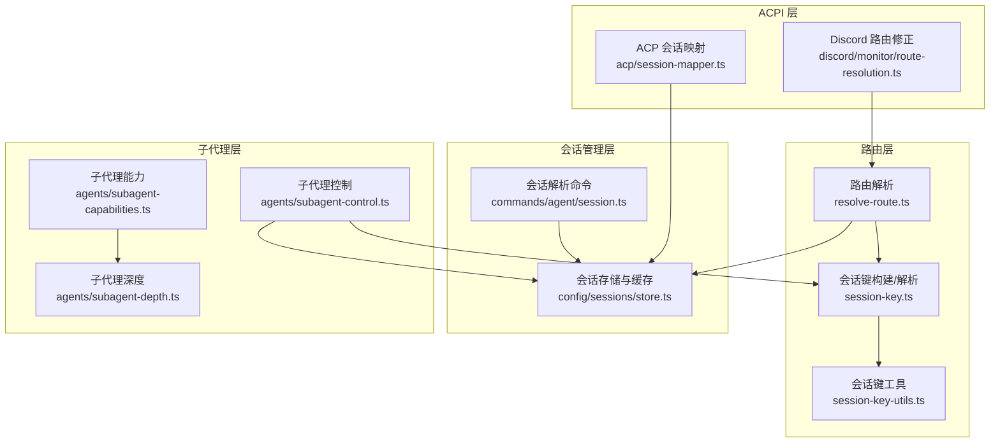
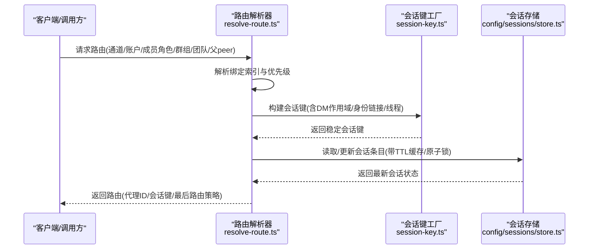
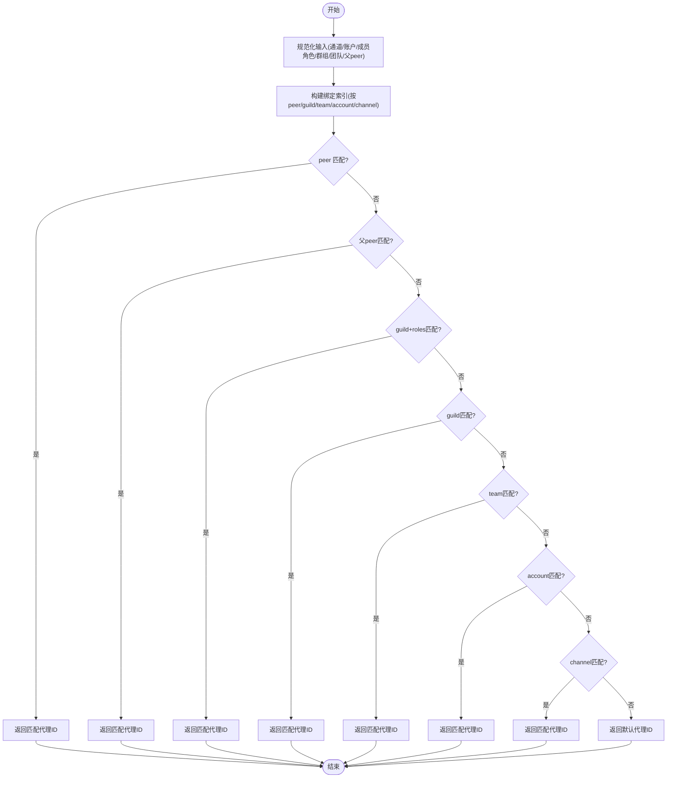
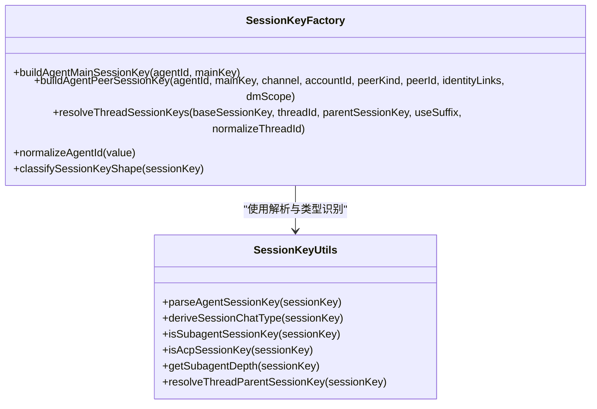
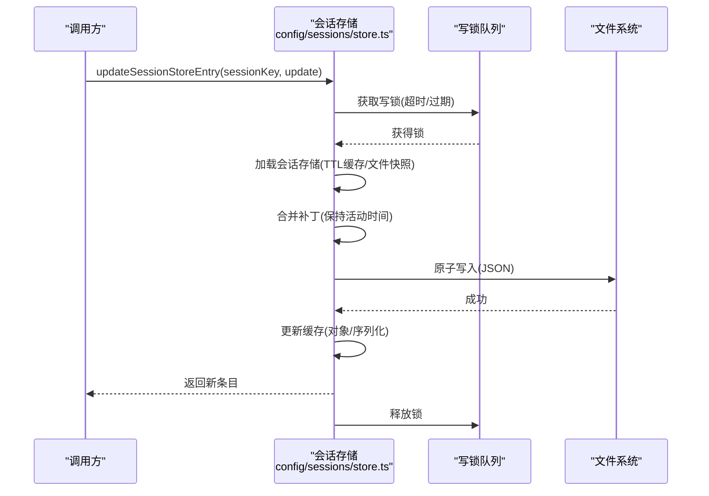
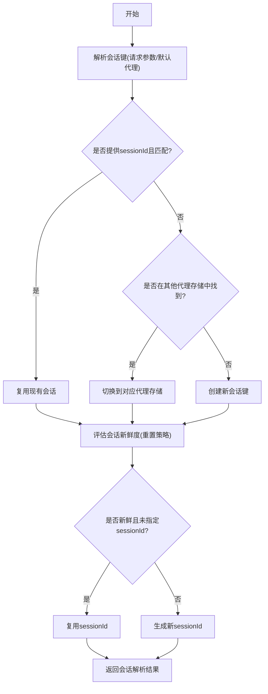
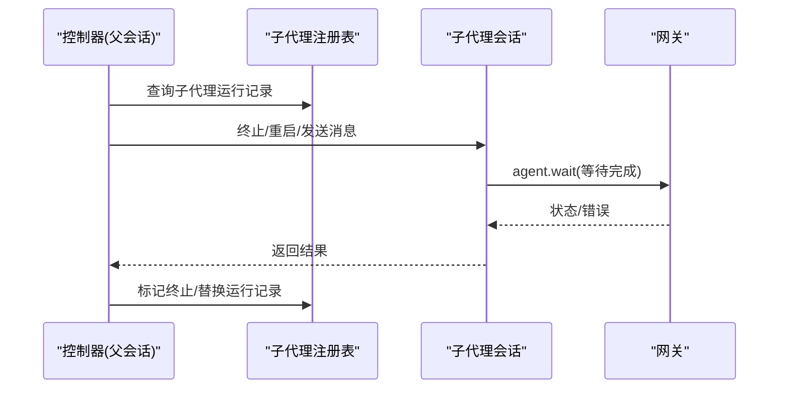
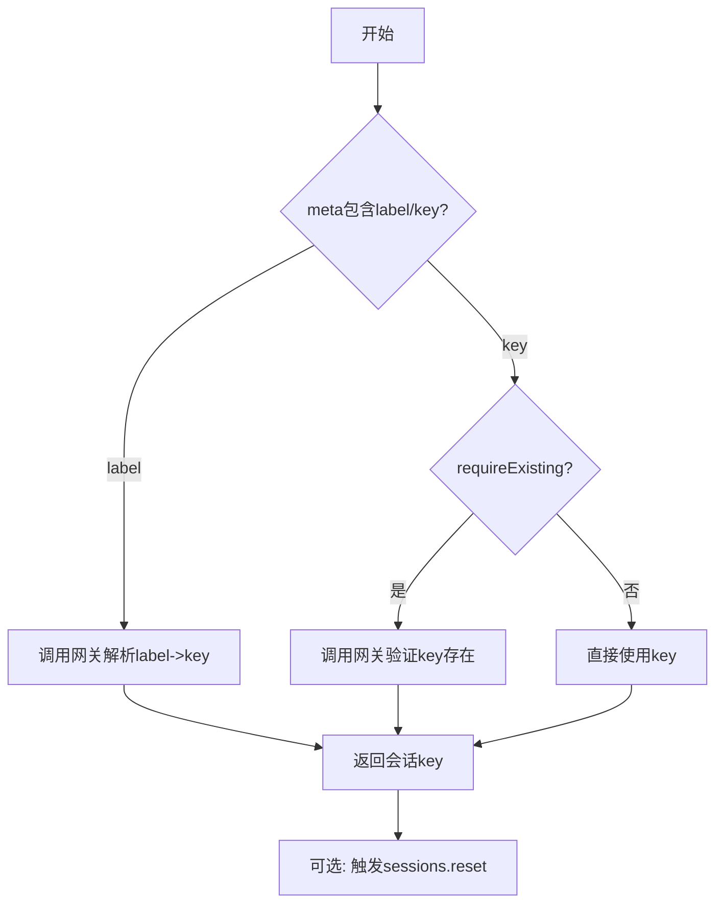
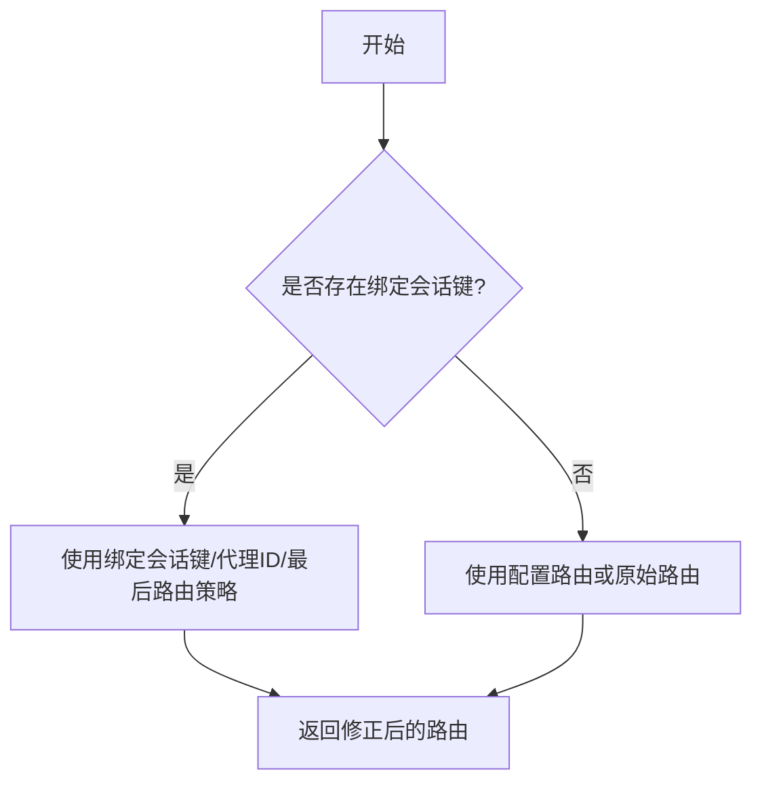
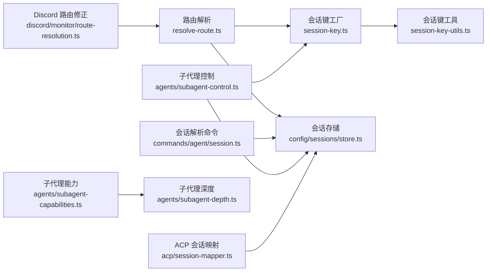

# 会话路由系统

<cite>
**本文档引用的文件**
- [src/routing/resolve-route.ts](file://src/routing/resolve-route.ts)
- [src/routing/session-key.ts](file://src/routing/session-key.ts)
- [src/sessions/session-key-utils.ts](file://src/sessions/session-key-utils.ts)
- [src/commands/agent/session.ts](file://src/commands/agent/session.ts)
- [src/config/sessions/store.ts](file://src/config/sessions/store.ts)
- [src/agents/subagent-control.ts](file://src/agents/subagent-control.ts)
- [src/agents/subagent-capabilities.ts](file://src/agents/subagent-capabilities.ts)
- [src/agents/subagent-depth.ts](file://src/agents/subagent-depth.ts)
- [src/acp/session-mapper.ts](file://src/acp/session-mapper.ts)
- [src/discord/monitor/route-resolution.ts](file://src/discord/monitor/route-resolution.ts)
- [docs/concepts/multi-agent.md](file://docs/concepts/multi-agent.md)
- [docs/zh-CN/gateway/configuration.md](file://docs/zh-CN/gateway/configuration.md)
</cite>

## 目录

1. [简介](#简介)
2. [项目结构](#项目结构)
3. [核心组件](#核心组件)
4. [架构总览](#架构总览)
5. [详细组件分析](#详细组件分析)
6. [依赖关系分析](#依赖关系分析)
7. [性能考量](#性能考量)
8. [故障排除指南](#故障排除指南)
9. [结论](#结论)
10. [附录](#附录)

## 简介

本文件系统性阐述 OpenClaw 会话路由系统的设计与实现，覆盖会话创建、路由选择、负载均衡与故障转移、子代理注册与控制、会话工具结果保护、会话状态管理、路由策略配置与优先级、性能监控、会话隔离与并发控制、资源调度策略等主题。文档面向不同技术背景读者，既提供高层概览也包含代码级细节与可视化图示。

## 项目结构

会话路由系统由以下模块协同工作：

- 路由解析与绑定：根据通道、账户、成员角色、群组/团队、父会话等维度解析路由并生成会话键。
- 会话键构建与解析：标准化 agent 会话键格式，支持主会话键、私聊作用域、线程继承等。
- 会话存储与缓存：持久化会话元数据、运行时上下文、交付上下文，并提供 TTL 缓存与原子写入锁。
- 子代理控制：管理子代理生命周期、控制范围、深度限制与重启/终止操作。
- ACP 会话映射：通过标签或键解析会话，支持强制现有键校验与重置。
- Discord 特定路由：在 Discord 场景下对线程绑定进行显式路由约束与回退策略。

**图表来源**

- [src/routing/resolve-route.ts:614-800](file://src/routing/resolve-route.ts#L614-L800)
- [src/routing/session-key.ts:118-174](file://src/routing/session-key.ts#L118-L174)
- [src/sessions/session-key-utils.ts:1-133](file://src/sessions/session-key-utils.ts#L1-L133)
- [src/config/sessions/store.ts:195-270](file://src/config/sessions/store.ts#L195-L270)
- [src/commands/agent/session.ts:111-173](file://src/commands/agent/session.ts#L111-L173)
- [src/agents/subagent-control.ts:1-150](file://src/agents/subagent-control.ts#L1-L150)
- [src/agents/subagent-capabilities.ts:1-157](file://src/agents/subagent-capabilities.ts#L1-L157)
- [src/agents/subagent-depth.ts:124-155](file://src/agents/subagent-depth.ts#L124-L155)
- [src/acp/session-mapper.ts:38-98](file://src/acp/session-mapper.ts#L38-L98)
- [src/discord/monitor/route-resolution.ts:80-100](file://src/discord/monitor/route-resolution.ts#L80-L100)

**章节来源**

- [src/routing/resolve-route.ts:614-800](file://src/routing/resolve-route.ts#L614-L800)
- [src/routing/session-key.ts:118-174](file://src/routing/session-key.ts#L118-L174)
- [src/sessions/session-key-utils.ts:1-133](file://src/sessions/session-key-utils.ts#L1-L133)
- [src/config/sessions/store.ts:195-270](file://src/config/sessions/store.ts#L195-L270)
- [src/commands/agent/session.ts:111-173](file://src/commands/agent/session.ts#L111-L173)
- [src/agents/subagent-control.ts:1-150](file://src/agents/subagent-control.ts#L1-L150)
- [src/agents/subagent-capabilities.ts:1-157](file://src/agents/subagent-capabilities.ts#L1-L157)
- [src/agents/subagent-depth.ts:124-155](file://src/agents/subagent-depth.ts#L124-L155)
- [src/acp/session-mapper.ts:38-98](file://src/acp/session-mapper.ts#L38-L98)
- [src/discord/monitor/route-resolution.ts:80-100](file://src/discord/monitor/route-resolution.ts#L80-L100)

## 核心组件

- 路由解析器：基于绑定规则与优先级确定目标代理与会话键，支持缓存与调试日志。
- 会话键工厂：根据 agentId、通道、账户、DM 作用域、身份链接、线程 ID 构建稳定键。
- 会话存储：提供 TTL 缓存、原子写入锁、维护清理、磁盘配额与归档。
- 会话解析命令：从请求参数推导 sessionKey、sessionId，评估新鲜度与重置策略。
- 子代理控制：管理子代理运行记录、控制范围、重启/终止、队列清理与超时等待。
- 子代理能力：根据深度与最大生成深度推断角色与控制范围。
- ACP 会话映射：通过标签/键解析会话，支持强制现有键校验与重置。
- Discord 路由修正：在 Discord 场景下对线程绑定进行显式路由约束与回退策略。

**章节来源**

- [src/routing/resolve-route.ts:614-800](file://src/routing/resolve-route.ts#L614-L800)
- [src/routing/session-key.ts:118-174](file://src/routing/session-key.ts#L118-L174)
- [src/config/sessions/store.ts:195-270](file://src/config/sessions/store.ts#L195-L270)
- [src/commands/agent/session.ts:111-173](file://src/commands/agent/session.ts#L111-L173)
- [src/agents/subagent-control.ts:526-745](file://src/agents/subagent-control.ts#L526-L745)
- [src/agents/subagent-capabilities.ts:110-157](file://src/agents/subagent-capabilities.ts#L110-L157)
- [src/acp/session-mapper.ts:38-98](file://src/acp/session-mapper.ts#L38-L98)
- [src/discord/monitor/route-resolution.ts:80-100](file://src/discord/monitor/route-resolution.ts#L80-L100)

## 架构总览

会话路由系统采用“绑定优先、键稳定、状态持久、并发受控”的设计原则：

- 绑定优先：按 peer、父 peer、guild+roles、guild、team、account、channel 的层级优先匹配。
- 键稳定：会话键包含 agentId、通道、账户、DM 作用域、线程等信息，确保路由一致性。
- 状态持久：会话元数据与运行时上下文持久化，支持 TTL 缓存与原子写入。
- 并发受控：会话存储写入使用全局锁队列，避免竞态与丢失更新。

**图表来源**

- [src/routing/resolve-route.ts:614-800](file://src/routing/resolve-route.ts#L614-L800)
- [src/routing/session-key.ts:118-174](file://src/routing/session-key.ts#L118-L174)
- [src/config/sessions/store.ts:195-270](file://src/config/sessions/store.ts#L195-L270)

**章节来源**

- [src/routing/resolve-route.ts:614-800](file://src/routing/resolve-route.ts#L614-L800)
- [src/routing/session-key.ts:118-174](file://src/routing/session-key.ts#L118-L174)
- [src/config/sessions/store.ts:195-270](file://src/config/sessions/store.ts#L195-L270)

## 详细组件分析

### 路由解析与绑定

- 绑定规则与优先级：peer 匹配 > 父 peer 继承 > guild+roles > guild > team > account > channel。
- 多账户支持：通道支持多账户登录，通过 accountId 区分路由。
- 私聊作用域：支持 main、per-peer、per-channel-peer、per-account-channel-peer。
- 调试与缓存：启用调试日志时输出绑定匹配详情；路由与绑定索引缓存提升性能。

**图表来源**

- [src/routing/resolve-route.ts:723-781](file://src/routing/resolve-route.ts#L723-L781)
- [docs/concepts/multi-agent.md:172-208](file://docs/concepts/multi-agent.md#L172-L208)

**章节来源**

- [src/routing/resolve-route.ts:614-800](file://src/routing/resolve-route.ts#L614-L800)
- [docs/concepts/multi-agent.md:172-208](file://docs/concepts/multi-agent.md#L172-L208)

### 会话键构建与解析

- 标准化 agent 会话键：agent:<agentId>:<rest>，大小写不敏感，便于稳定比较。
- 私聊作用域：根据 dmScope 与 identityLinks 决定 peerId 规范化与合并。
- 线程继承：支持从父会话键派生子线程会话键，保留父会话信息。
- 类型识别：支持子代理、ACP、定时任务等特殊键类型识别与深度计算。

**图表来源**

- [src/routing/session-key.ts:118-174](file://src/routing/session-key.ts#L118-L174)
- [src/sessions/session-key-utils.ts:1-133](file://src/sessions/session-key-utils.ts#L1-L133)

**章节来源**

- [src/routing/session-key.ts:118-174](file://src/routing/session-key.ts#L118-L174)
- [src/sessions/session-key-utils.ts:1-133](file://src/sessions/session-key-utils.ts#L1-L133)

### 会话存储与缓存

- TTL 缓存：基于环境变量与默认值决定缓存 TTL，支持对象缓存与序列化缓存。
- 原子写入：使用写锁队列保证并发安全，Windows 下具备重试与错误码处理。
- 维护策略：过期清理、数量上限、磁盘配额、归档清理与文件轮转。
- 入站元数据：入站消息仅更新非活动字段，避免干扰空闲重置评估。

**图表来源**

- [src/config/sessions/store.ts:521-533](file://src/config/sessions/store.ts#L521-L533)
- [src/config/sessions/store.ts:695-727](file://src/config/sessions/store.ts#L695-L727)
- [src/config/sessions/store.ts:340-509](file://src/config/sessions/store.ts#L340-L509)

**章节来源**

- [src/config/sessions/store.ts:195-270](file://src/config/sessions/store.ts#L195-L270)
- [src/config/sessions/store.ts:340-509](file://src/config/sessions/store.ts#L340-L509)
- [src/config/sessions/store.ts:521-533](file://src/config/sessions/store.ts#L521-L533)
- [src/config/sessions/store.ts:695-727](file://src/config/sessions/store.ts#L695-L727)

### 会话解析与重置策略

- 会话解析：从请求参数推导 sessionKey、sessionId，支持跨代理存储查找。
- 新鲜度评估：结合会话更新时间与重置策略判断是否复用。
- 重置策略：支持按日/空闲重置，按会话类型覆盖，心跳空闲覆盖。
- 思维/详细级别持久化：复用会话时恢复思考与详细级别。

**图表来源**

- [src/commands/agent/session.ts:43-109](file://src/commands/agent/session.ts#L43-L109)
- [src/commands/agent/session.ts:111-173](file://src/commands/agent/session.ts#L111-L173)

**章节来源**

- [src/commands/agent/session.ts:43-109](file://src/commands/agent/session.ts#L43-L109)
- [src/commands/agent/session.ts:111-173](file://src/commands/agent/session.ts#L111-L173)

### 子代理注册与控制

- 控制范围：根据角色(主/编排器/叶子)与控制范围(children/none)限制子代理操作。
- 运行记录：维护运行记录、重启标记、终止标记与后代计数。
- 控制操作：终止/级联终止、重启(带速率限制)、发送消息(内部通道)、等待完成。
- 队列清理：终止/重启时清理跟随队列与车道队列，避免残留。

**图表来源**

- [src/agents/subagent-control.ts:526-745](file://src/agents/subagent-control.ts#L526-L745)
- [src/agents/subagent-capabilities.ts:110-157](file://src/agents/subagent-capabilities.ts#L110-L157)

**章节来源**

- [src/agents/subagent-control.ts:526-745](file://src/agents/subagent-control.ts#L526-L745)
- [src/agents/subagent-capabilities.ts:110-157](file://src/agents/subagent-capabilities.ts#L110-L157)

### ACP 会话映射与重置

- 标签/键解析：支持通过标签或键解析会话，可强制要求现有键存在。
- 重置控制：支持在 ACP 侧触发会话重置，确保路由一致性。

**图表来源**

- [src/acp/session-mapper.ts:38-98](file://src/acp/session-mapper.ts#L38-L98)

**章节来源**

- [src/acp/session-mapper.ts:38-98](file://src/acp/session-mapper.ts#L38-L98)

### Discord 路由修正与线程绑定

- 绑定覆盖：当存在显式绑定会话键时，强制使用该键，忽略配置路由。
- 最后路由策略：主会话键与普通会话键影响最后路由更新的目标。
- 回退策略：若未提供绑定键，回退到配置路由或原始路由。

**图表来源**

- [src/discord/monitor/route-resolution.ts:80-100](file://src/discord/monitor/route-resolution.ts#L80-L100)

**章节来源**

- [src/discord/monitor/route-resolution.ts:80-100](file://src/discord/monitor/route-resolution.ts#L80-L100)

## 依赖关系分析

- 路由解析依赖绑定索引与会话键工厂，输出稳定的会话键与代理ID。
- 会话存储依赖写锁队列与缓存，保障并发安全与性能。
- 子代理控制依赖会话存储与网关调用，实现运行时控制。
- ACP 会话映射依赖网关 RPC，实现跨节点会话解析与重置。
- Discord 路由修正依赖路由解析器，提供显式绑定覆盖。

**图表来源**

- [src/routing/resolve-route.ts:614-800](file://src/routing/resolve-route.ts#L614-L800)
- [src/routing/session-key.ts:118-174](file://src/routing/session-key.ts#L118-L174)
- [src/sessions/session-key-utils.ts:1-133](file://src/sessions/session-key-utils.ts#L1-L133)
- [src/config/sessions/store.ts:195-270](file://src/config/sessions/store.ts#L195-L270)
- [src/commands/agent/session.ts:111-173](file://src/commands/agent/session.ts#L111-L173)
- [src/agents/subagent-control.ts:526-745](file://src/agents/subagent-control.ts#L526-L745)
- [src/agents/subagent-capabilities.ts:110-157](file://src/agents/subagent-capabilities.ts#L110-L157)
- [src/agents/subagent-depth.ts:124-155](file://src/agents/subagent-depth.ts#L124-L155)
- [src/acp/session-mapper.ts:38-98](file://src/acp/session-mapper.ts#L38-L98)
- [src/discord/monitor/route-resolution.ts:80-100](file://src/discord/monitor/route-resolution.ts#L80-L100)

**章节来源**

- [src/routing/resolve-route.ts:614-800](file://src/routing/resolve-route.ts#L614-L800)
- [src/routing/session-key.ts:118-174](file://src/routing/session-key.ts#L118-L174)
- [src/sessions/session-key-utils.ts:1-133](file://src/sessions/session-key-utils.ts#L1-L133)
- [src/config/sessions/store.ts:195-270](file://src/config/sessions/store.ts#L195-L270)
- [src/commands/agent/session.ts:111-173](file://src/commands/agent/session.ts#L111-L173)
- [src/agents/subagent-control.ts:526-745](file://src/agents/subagent-control.ts#L526-L745)
- [src/agents/subagent-capabilities.ts:110-157](file://src/agents/subagent-capabilities.ts#L110-L157)
- [src/agents/subagent-depth.ts:124-155](file://src/agents/subagent-depth.ts#L124-L155)
- [src/acp/session-mapper.ts:38-98](file://src/acp/session-mapper.ts#L38-L98)
- [src/discord/monitor/route-resolution.ts:80-100](file://src/discord/monitor/route-resolution.ts#L80-L100)

## 性能考量

- 路由缓存：路由与绑定索引缓存，阈值控制，避免频繁重建。
- 会话存储缓存：TTL 缓存与序列化缓存，减少磁盘 IO；Windows 下读取重试。
- 写锁队列：串行化写入，降低竞争；超时与过期保护。
- 维护策略：定期清理过期与上限裁剪，磁盘配额与归档清理，防止膨胀。
- 子代理控制：速率限制与等待超时，避免过度重启与堆积。

[本节为通用性能建议，无需特定文件引用]

## 故障排除指南

- 路由不生效：检查绑定规则优先级与匹配字段，确认 peer、guild、team、account 是否正确。
- 会话键异常：核对 agentId、通道、账户、DM 作用域、线程标识是否一致。
- 写入冲突：查看写锁队列长度与超时日志，确认并发写入是否过多。
- 子代理无法控制：确认控制范围与角色，叶子节点不可控制其他会话。
- ACP 解析失败：检查标签/键是否存在，必要时开启 requireExisting。
- Discord 线程路由异常：确认是否提供了绑定会话键，以及最后路由策略。

**章节来源**

- [src/routing/resolve-route.ts:614-800](file://src/routing/resolve-route.ts#L614-L800)
- [src/config/sessions/store.ts:695-727](file://src/config/sessions/store.ts#L695-L727)
- [src/agents/subagent-control.ts:526-745](file://src/agents/subagent-control.ts#L526-L745)
- [src/acp/session-mapper.ts:38-98](file://src/acp/session-mapper.ts#L38-L98)
- [src/discord/monitor/route-resolution.ts:80-100](file://src/discord/monitor/route-resolution.ts#L80-L100)

## 结论

会话路由系统通过“稳定键 + 优先绑定 + 持久状态 + 并发受控”的设计，在多通道、多账户、多代理场景下实现了高可靠、可扩展、可观测的会话管理。配合子代理控制、ACPI 映射与 Discord 特定修正，系统在复杂业务场景中仍能保持路由一致性与运行稳定性。

[本节为总结性内容，无需特定文件引用]

## 附录

### 路由策略配置与优先级

- 绑定优先级：peer > 父 peer > guild+roles > guild > team > account > channel。
- 多账户：通道支持多账户登录，通过 accountId 区分路由。
- 私聊作用域：main、per-peer、per-channel-peer、per-account-channel-peer。
- 心跳与重置：支持按日/空闲重置，按会话类型覆盖，心跳空闲覆盖。

**章节来源**

- [docs/concepts/multi-agent.md:172-208](file://docs/concepts/multi-agent.md#L172-L208)
- [docs/zh-CN/gateway/configuration.md:2713-2733](file://docs/zh-CN/gateway/configuration.md#L2713-L2733)

### 会话隔离与并发控制

- 会话隔离：通过 agentId、通道、账户、线程等维度隔离，避免会话交叉污染。
- 并发控制：会话存储写入使用全局锁队列，避免竞态；TTL 缓存减少锁持有时间。
- 资源调度：子代理运行记录与队列清理，避免资源泄漏与堆积。

**章节来源**

- [src/routing/session-key.ts:118-174](file://src/routing/session-key.ts#L118-L174)
- [src/config/sessions/store.ts:695-727](file://src/config/sessions/store.ts#L695-L727)
- [src/agents/subagent-control.ts:526-745](file://src/agents/subagent-control.ts#L526-L745)

### 扩展方法与最佳实践

- 自定义绑定：新增匹配字段与优先级，确保与现有规则兼容。
- 会话键扩展：新增键类型时，完善解析与类型识别函数。
- 子代理扩展：通过能力配置与深度限制控制子代理行为。
- ACP 扩展：通过网关 RPC 实现跨节点会话解析与重置。

**章节来源**

- [src/routing/resolve-route.ts:614-800](file://src/routing/resolve-route.ts#L614-L800)
- [src/sessions/session-key-utils.ts:1-133](file://src/sessions/session-key-utils.ts#L1-L133)
- [src/agents/subagent-capabilities.ts:110-157](file://src/agents/subagent-capabilities.ts#L110-L157)
- [src/acp/session-mapper.ts:38-98](file://src/acp/session-mapper.ts#L38-L98)
