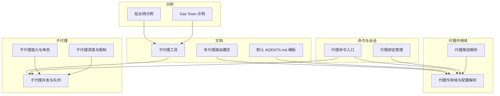
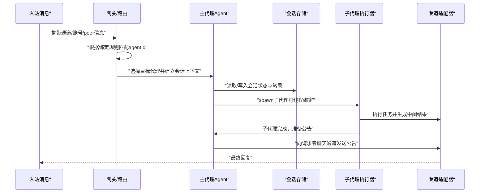
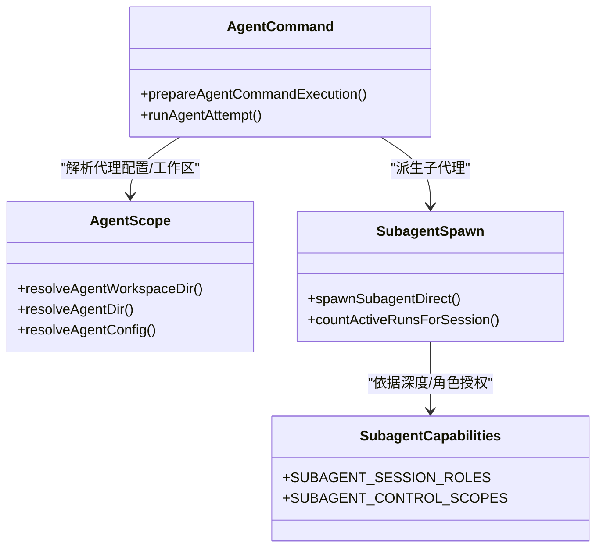
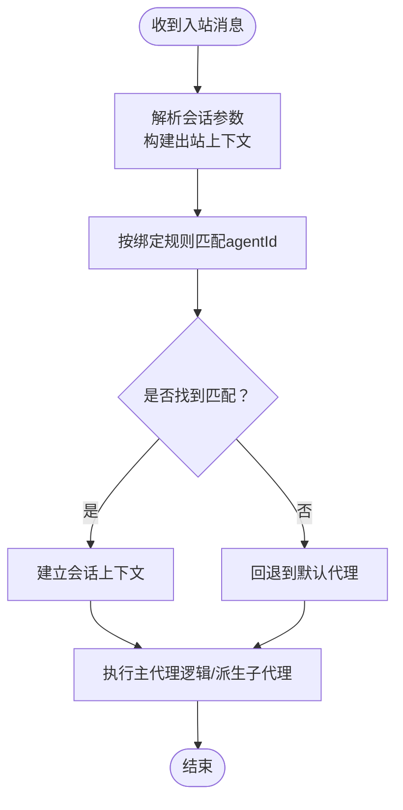
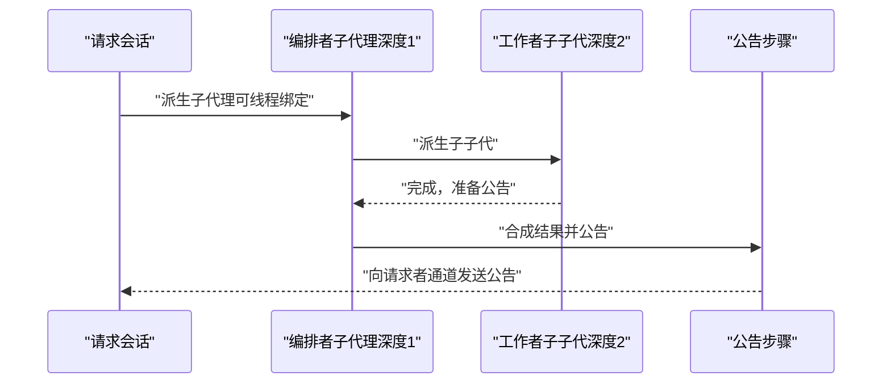
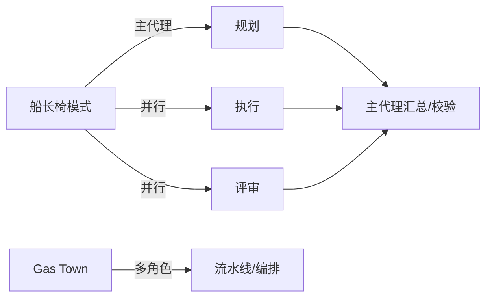
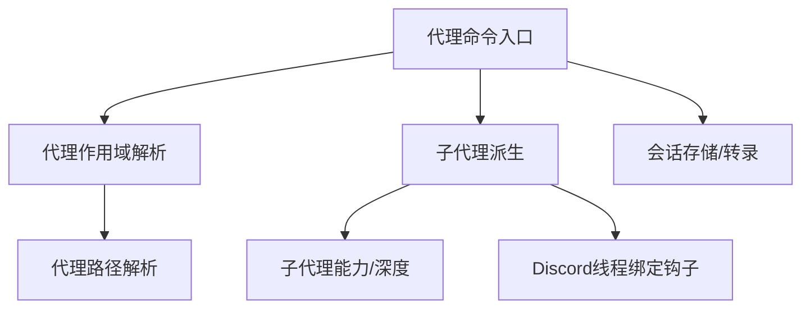

# 多代理协作

<cite>
**本文引用的文件**
- [多代理路由（概念）](file://docs/concepts/multi-agent.md)
- [子代理（工具）](file://docs/tools/subagents.md)
- [默认 AGENTS.md 模板](file://docs/reference/AGENTS.default.md)
- [代理路径解析](file://src/agents/agent-paths.ts)
- [代理作用域与配置解析](file://src/agents/agent-scope.ts)
- [代理命令入口](file://src/commands/agent.ts)
- [代理绑定管理](file://src/commands/agents.bindings.ts)
- [子代理能力与角色](file://src/agents/subagent-capabilities.ts)
- [子代理深度与限制](file://src/agents/subagent-depth.ts)
- [子代理并发与队列](file://src/agents/subagent-spawn.ts)
- [Discord 子代理钩子测试](file://extensions/discord/src/subagent-hooks.test.ts)
- [Open-Prose 示例：简单船长椅](file://extensions/open-prose/skills/prose/examples/30-captains-chair-simple.prose)
- [Open-Prose 示例：Gas Town 多代理编排](file://extensions/open-prose/skills/prose/examples/28-gas-town.prose)
</cite>

## 目录

1. [引言](#引言)
2. [项目结构](#项目结构)
3. [核心组件](#核心组件)
4. [架构总览](#架构总览)
5. [详细组件分析](#详细组件分析)
6. [依赖关系分析](#依赖关系分析)
7. [性能考量](#性能考量)
8. [故障排查指南](#故障排查指南)
9. [结论](#结论)
10. [附录](#附录)

## 引言

本文件面向需要在单一网关进程中运行多个“隔离代理”的用户与开发者，系统性阐述主代理与子代理的关系、任务分配与协调机制、代理深度控制、生命周期管理、通信协议与权限继承、资源共享策略，并提供多代理使用示例、协作模式与性能优化方法，以及冲突解决、状态同步与故障恢复机制。

## 项目结构

围绕多代理协作的关键目录与文件包括：

- 文档层：多代理路由与子代理工具说明
- 命令层：代理命令入口与会话解析
- 代理作用域：代理配置解析、工作区与 agentDir 解析
- 子代理：深度控制、并发与线程绑定、公告回传
- 扩展示例：Open-Prose 提供的编排范式

**图表来源**

- [多代理路由（概念）](file://docs/concepts/multi-agent.md)
- [子代理（工具）](file://docs/tools/subagents.md)
- [默认 AGENTS.md 模板](file://docs/reference/AGENTS.default.md)
- [代理路径解析](file://src/agents/agent-paths.ts)
- [代理作用域与配置解析](file://src/agents/agent-scope.ts)
- [代理命令入口](file://src/commands/agent.ts)
- [代理绑定管理](file://src/commands/agents.bindings.ts)
- [子代理能力与角色](file://src/agents/subagent-capabilities.ts)
- [子代理深度与限制](file://src/agents/subagent-depth.ts)
- [子代理并发与队列](file://src/agents/subagent-spawn.ts)
- [Open-Prose 示例：简单船长椅](file://extensions/open-prose/skills/prose/examples/30-captains-chair-simple.prose)
- [Open-Prose 示例：Gas Town 多代理编排](file://extensions/open-prose/skills/prose/examples/28-gas-town.prose)

**章节来源**

- [多代理路由（概念）](file://docs/concepts/multi-agent.md)
- [子代理（工具）](file://docs/tools/subagents.md)
- [默认 AGENTS.md 模板](file://docs/reference/AGENTS.default.md)
- [代理路径解析](file://src/agents/agent-paths.ts)
- [代理作用域与配置解析](file://src/agents/agent-scope.ts)
- [代理命令入口](file://src/commands/agent.ts)
- [代理绑定管理](file://src/commands/agents.bindings.ts)
- [子代理能力与角色](file://src/agents/subagent-capabilities.ts)
- [子代理深度与限制](file://src/agents/subagent-depth.ts)
- [子代理并发与队列](file://src/agents/subagent-spawn.ts)
- [Open-Prose 示例：简单船长椅](file://extensions/open-prose/skills/prose/examples/30-captains-chair-simple.prose)
- [Open-Prose 示例：Gas Town 多代理编排](file://extensions/open-prose/skills/prose/examples/28-gas-town.prose)

## 核心组件

- 多代理路由与隔离
  - 单一网关可托管多个“完全隔离”的代理，每个代理拥有独立工作区、agentDir、会话存储与认证档案；不同代理间默认无交叉访问。
  - 支持为每个代理配置独立模型、技能、沙箱与工具策略。
- 绑定与路由
  - 通过“绑定”将入站消息按通道、账号、peer 等维度路由到指定 agentId；支持最具体匹配优先与跨账号/群组/频道的路由规则。
- 子代理与深度控制
  - 子代理是后台运行的独立会话，完成时向请求者聊天通道公告结果；支持嵌套深度控制、并发限制、线程绑定与自动归档。
- 生命周期与状态
  - 会话键命名规范明确区分主会话与子代理会话；会话存储负责记录状态、转录与统计；支持超时、重试与幂等投递。
- 权限继承与资源共享
  - 子代理认证以 agentId 解析，请求代理的认证档案作为回退；工具策略按深度分层授予；并发与深度限制防止资源滥用。

**章节来源**

- [多代理路由（概念）](file://docs/concepts/multi-agent.md)
- [子代理（工具）](file://docs/tools/subagents.md)
- [代理作用域与配置解析](file://src/agents/agent-scope.ts)
- [代理路径解析](file://src/agents/agent-paths.ts)

## 架构总览

下图展示从入站消息到主代理、子代理执行与公告回传的整体流程，以及与会话存储、沙箱与工具策略的交互。

**图表来源**

- [多代理路由（概念）](file://docs/concepts/multi-agent.md)
- [子代理（工具）](file://docs/tools/subagents.md)
- [代理命令入口](file://src/commands/agent.ts)
- [子代理并发与队列](file://src/agents/subagent-spawn.ts)

## 详细组件分析

### 主代理与子代理的关系

- 会话键命名
  - 主会话键形如“agent:<agentId>:main”，子代理会话键形如“agent:<agentId>:subagent:<uuid>”，深度为2的子子代会话键形如“agent:<agentId>:subagent:_:subagent:_”。
- 角色与控制范围
  - 深度0为主代理；深度1为子代理（当允许嵌套时，可作为“编排者”管理其子代）；深度2为叶子工作节点，不具进一步派生能力。
- 工具策略
  - 深度1（编排者）可获得会话管理工具集；深度2（工作者）不具会话工具，仅能汇报结果。
- 认证
  - 子代理认证以 agentId 解析，若未显式配置则回退至请求代理的认证档案。

**图表来源**

- [代理作用域与配置解析](file://src/agents/agent-scope.ts)
- [子代理能力与角色](file://src/agents/subagent-capabilities.ts)
- [子代理并发与队列](file://src/agents/subagent-spawn.ts)
- [代理命令入口](file://src/commands/agent.ts)

**章节来源**

- [子代理（工具）](file://docs/tools/subagents.md)
- [子代理能力与角色](file://src/agents/subagent-capabilities.ts)
- [子代理并发与队列](file://src/agents/subagent-spawn.ts)
- [代理命令入口](file://src/commands/agent.ts)

### 任务分配与协调机制

- 路由规则
  - 绑定按“peer匹配 > 父peer匹配 > 频道级匹配 > 默认代理”逐级生效；同一层级多条命中时按配置顺序优先。
  - 支持全局默认账号与通配账号（accountId: "\*"）以实现跨账号路由。
- 绑定管理
  - 可增删改查绑定；移除绑定时会检查冲突与缺失项，避免误删。
- 会话上下文
  - 代理命令入口统一解析会话参数，构建出站会话上下文，确保后续工具调用与回复路由正确。

**图表来源**

- [代理命令入口](file://src/commands/agent.ts)
- [代理绑定管理](file://src/commands/agents.bindings.ts)
- [多代理路由（概念）](file://docs/concepts/multi-agent.md)

**章节来源**

- [代理绑定管理](file://src/commands/agents.bindings.ts)
- [代理命令入口](file://src/commands/agent.ts)
- [多代理路由（概念）](file://docs/concepts/multi-agent.md)

### 代理深度控制与生命周期管理

- 深度与并发
  - 默认最大派生深度为1；可通过配置提升至2，形成“主代理 → 编排者子代理 → 工作者子子代”的编排模式。
  - 全局并发与每会话最大活跃子代数受控，防止资源耗尽。
- 生命周期阶段
  - 子代理启动、运行、完成、公告回传、自动归档；公告链路自底向上传播，避免跨层级污染。
- 线程绑定
  - 在支持的频道中，子代理可绑定到线程，后续消息继续路由至该会话；支持空闲与最长存活时间配置。

**图表来源**

- [子代理（工具）](file://docs/tools/subagents.md)
- [子代理并发与队列](file://src/agents/subagent-spawn.ts)

**章节来源**

- [子代理（工具）](file://docs/tools/subagents.md)
- [子代理并发与队列](file://src/agents/subagent-spawn.ts)

### 通信协议与权限继承

- 通信协议
  - 入站消息经路由后进入目标代理会话；代理内部事件流与可见文本合并策略保证输出质量；公告采用幂等键与队列回退，确保送达。
- 权限继承
  - 子代理工具策略按深度分层授予；认证档案以目标代理为准，请求代理档案作为回退。
- 资源共享
  - 会话存储与转录文件按会话键隔离；线程绑定保持话题一致性；沙箱模式可按代理粒度启用。

**章节来源**

- [代理命令入口](file://src/commands/agent.ts)
- [子代理（工具）](file://docs/tools/subagents.md)

### 多代理配置、权限与资源共享策略

- 多代理配置
  - 在配置中定义 agents 列表、默认工作区与 agentDir、模型与工具策略、沙箱设置；每个代理可独立覆盖全局默认值。
- 权限与工具策略
  - 全局工具策略与代理级工具策略叠加；子代理工具策略按深度授予；线程绑定相关开关在频道适配器中配置。
- 资源共享
  - 会话键隔离数据；转录文件与统计信息按会话维护；并发与深度限制保障资源安全。

**章节来源**

- [多代理路由（概念）](file://docs/concepts/multi-agent.md)
- [默认 AGENTS.md 模板](file://docs/reference/AGENTS.default.md)
- [代理作用域与配置解析](file://src/agents/agent-scope.ts)

### 使用示例与协作模式

- 船长椅模式（Captain’s Chair）
  - 主代理负责规划与校验，派生并行执行与评审子代理，再整合结果；适合“只协调不执行”的编排场景。
- Gas Town 工业化编排
  - 类似“Kubernetes for agents”的多角色流水线，强调原子工作单元、史诗与分子工作流的组合表达与模板化。

**图表来源**

- [Open-Prose 示例：简单船长椅](file://extensions/open-prose/skills/prose/examples/30-captains-chair-simple.prose)
- [Open-Prose 示例：Gas Town 多代理编排](file://extensions/open-prose/skills/prose/examples/28-gas-town.prose)

**章节来源**

- [Open-Prose 示例：简单船长椅](file://extensions/open-prose/skills/prose/examples/30-captains-chair-simple.prose)
- [Open-Prose 示例：Gas Town 多代理编排](file://extensions/open-prose/skills/prose/examples/28-gas-town.prose)

## 依赖关系分析

- 组件耦合
  - 代理命令入口依赖代理作用域解析工作区与 agentDir，并在会话上下文中驱动子代理派生。
  - 子代理派生模块依赖并发与深度控制策略，同时与线程绑定钩子集成。
- 外部依赖
  - 频道适配器（如 Discord）提供线程绑定能力与相关配置开关；会话存储负责转录与状态持久化。

**图表来源**

- [代理命令入口](file://src/commands/agent.ts)
- [代理作用域与配置解析](file://src/agents/agent-scope.ts)
- [代理路径解析](file://src/agents/agent-paths.ts)
- [子代理并发与队列](file://src/agents/subagent-spawn.ts)
- [Discord 子代理钩子测试](file://extensions/discord/src/subagent-hooks.test.ts)

**章节来源**

- [代理命令入口](file://src/commands/agent.ts)
- [代理作用域与配置解析](file://src/agents/agent-scope.ts)
- [代理路径解析](file://src/agents/agent-paths.ts)
- [子代理并发与队列](file://src/agents/subagent-spawn.ts)
- [Discord 子代理钩子测试](file://extensions/discord/src/subagent-hooks.test.ts)

## 性能考量

- 模型与思考层级
  - 子代理可使用更低成本模型以降低整体成本；思考层级可在派生时覆盖。
- 并发与深度
  - 合理设置最大并发与每会话最大活跃子代数，避免资源争用；必要时提升最大派生深度以支持编排者模式。
- 自动归档
  - 子代理完成后自动归档，减少长期占用；注意重启后定时器可能丢失，需结合告警与重试策略。

**章节来源**

- [子代理（工具）](file://docs/tools/subagents.md)

## 故障排查指南

- 绑定冲突与缺失
  - 移除绑定时会返回被移除项、缺失项与冲突项列表，便于定位问题。
- 公告失败
  - 公告采用幂等键与队列回退策略；若网关重启导致待处理公告丢失，需重新触发或检查队列状态。
- 认证与工具策略
  - 子代理认证以目标代理为准；若出现权限不足，检查代理级工具策略与沙箱模式配置。
- 会话超时与重试
  - 子代理运行超时不会自动归档，需单独处理；建议在上层逻辑中结合停止指令与级联停止。

**章节来源**

- [代理绑定管理](file://src/commands/agents.bindings.ts)
- [子代理（工具）](file://docs/tools/subagents.md)
- [子代理并发与队列](file://src/agents/subagent-spawn.ts)

## 结论

通过“多代理路由 + 子代理编排”的组合，系统实现了在同一网关进程内对多个隔离代理的高效管理与协作。主代理负责决策与协调，子代理专注于执行与产出，借助深度控制、并发限制、线程绑定与公告回传机制，既保证了安全性与可扩展性，也提供了灵活的资源与权限治理方案。配合示例化的编排模式，用户可以快速落地从简单并行到复杂流水线的多代理工作负载。

## 附录

- 快速参考
  - 多代理路由与绑定规则参见多代理路由文档。
  - 子代理派生、线程绑定与公告策略参见子代理工具文档。
  - 代理路径与配置解析参见代理作用域与路径解析文件。
  - 示例编排参见 Open-Prose 的船长椅与 Gas Town 示例。

**章节来源**

- [多代理路由（概念）](file://docs/concepts/multi-agent.md)
- [子代理（工具）](file://docs/tools/subagents.md)
- [代理作用域与配置解析](file://src/agents/agent-scope.ts)
- [代理路径解析](file://src/agents/agent-paths.ts)
- [Open-Prose 示例：简单船长椅](file://extensions/open-prose/skills/prose/examples/30-captains-chair-simple.prose)
- [Open-Prose 示例：Gas Town 多代理编排](file://extensions/open-prose/skills/prose/examples/28-gas-town.prose)
