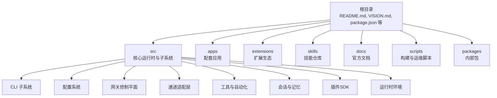
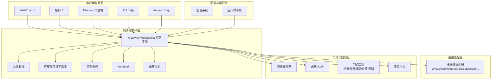
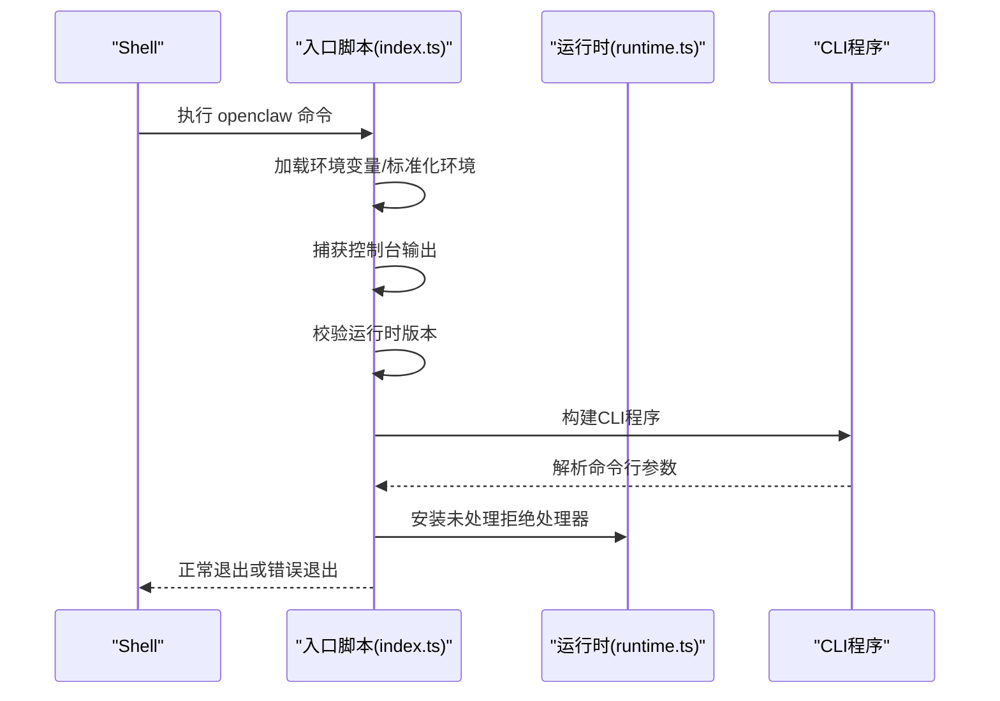
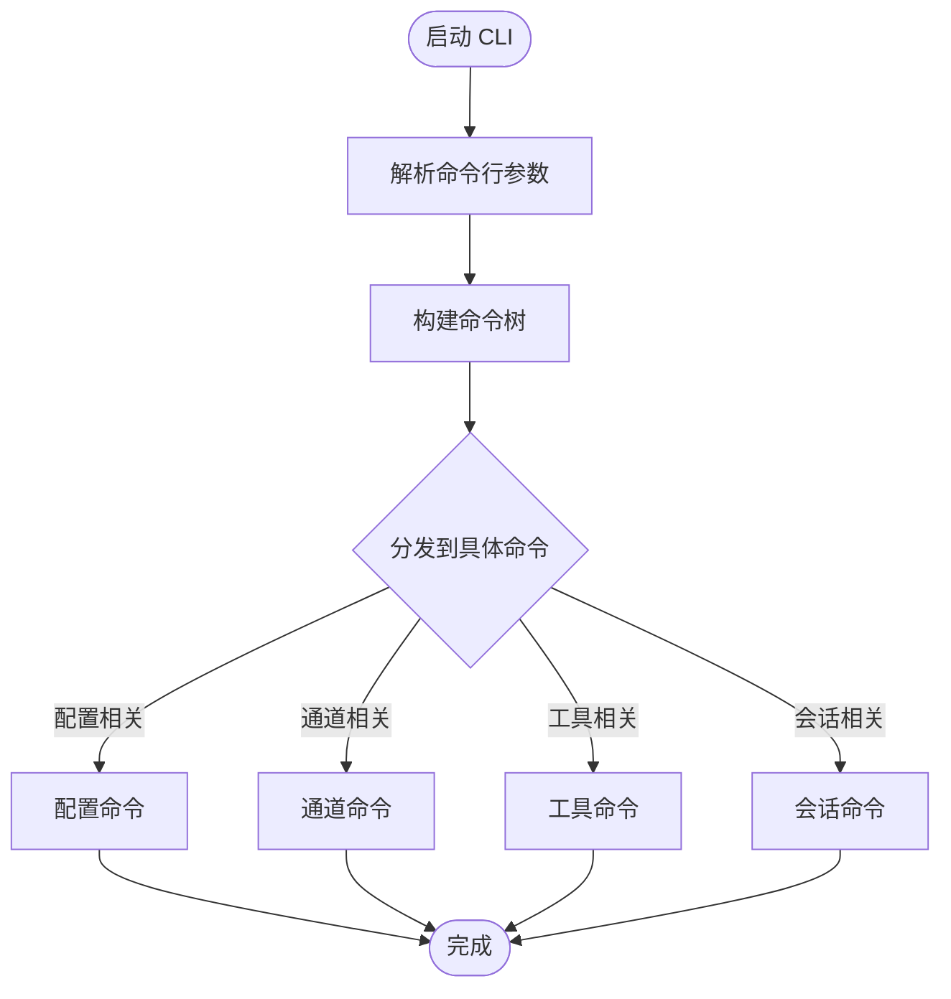
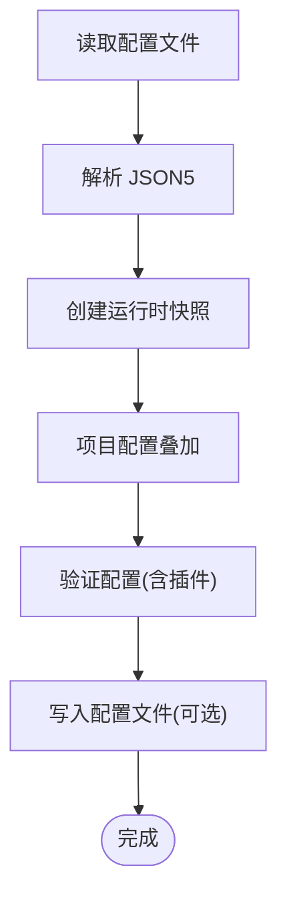
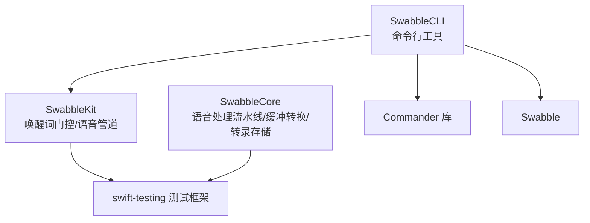
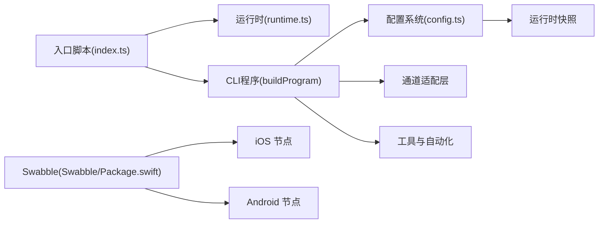

# 多代理协作系统

<cite>
**本文档引用的文件**
- [README.md](file://README.md)
- [VISION.md](file://VISION.md)
- [src/index.ts](file://src/index.ts)
- [src/runtime.ts](file://src/runtime.ts)
- [src/cli/program.ts](file://src/cli/program.ts)
- [src/config/config.ts](file://src/config/config.ts)
- [Swabble/Package.swift](file://Swabble/Package.swift)
</cite>

## 目录
1. [简介](#简介)
2. [项目结构](#项目结构)
3. [核心组件](#核心组件)
4. [架构总览](#架构总览)
5. [详细组件分析](#详细组件分析)
6. [依赖关系分析](#依赖关系分析)
7. [性能考虑](#性能考虑)
8. [故障排除指南](#故障排除指南)
9. [结论](#结论)

## 简介
本项目是一个个人AI助手系统，支持在用户设备上运行，并通过多种即时通讯渠道（如WhatsApp、Telegram、Slack、Discord、Google Chat、Signal、iMessage、BlueBubbles、IRC、Microsoft Teams、Matrix、Feishu、LINE、Mattermost、Nextcloud Talk、Nostr、Synology Chat、Tlon、Twitch、Zalo、Zalo Personal、WebChat等）与用户交互。系统采用“网关优先”的设计，网关作为控制平面，负责会话管理、通道路由、工具执行和事件处理；同时提供多代理路由能力，将不同来源的消息路由到独立的代理工作空间中，实现群组隔离与个性化会话。

系统特性包括：
- 本地优先的网关控制平面
- 多通道统一收件箱
- 多代理路由与会话隔离
- 语音唤醒与对话模式
- 实时画布与A2UI
- 一等公民工具（浏览器、节点、定时任务、会话工具等）
- 配套应用（macOS菜单栏应用、iOS/Android节点）
- 向导驱动的设置与技能平台

## 项目结构
从顶层看，项目由以下主要部分组成：
- 根目录：入口脚本、文档、安装说明、安全策略等
- src：核心运行时与子系统（CLI、配置、通道、网关、工具、会话、内存、插件SDK等）
- apps：配套应用（Electron桌面端、iOS/Android节点、macOS应用）
- extensions：扩展生态（各渠道插件、诊断、设备配对等）
- skills：技能仓库（内置与工作区技能）
- docs：官方文档与指南
- scripts：构建、测试、发布与运维脚本
- packages：内部包（如clawdbot、moltbot）

**图表来源**
- [README.md:185-212](file://README.md#L185-L212)
- [VISION.md:17-32](file://VISION.md#L17-L32)

**章节来源**
- [README.md:185-212](file://README.md#L185-L212)
- [VISION.md:17-32](file://VISION.md#L17-L32)

## 核心组件
- 入口与运行时
  - 入口脚本负责加载环境变量、标准化环境、确保CLI可用、捕获日志、校验运行时版本，并构建CLI程序。
  - 运行时环境提供统一的日志输出、错误处理与进程退出机制，支持测试场景下的非退出式运行时。
- CLI与命令行程序
  - CLI程序负责解析命令行参数、构建命令树、执行对应逻辑。
- 配置系统
  - 提供配置读取、验证、迁移、运行时快照与写入能力，支持项目配置叠加与运行时覆盖。
- 网关控制平面
  - 作为单一路由器，承载会话、存在性、配置、定时任务、Webhook、控制UI与画布主机等。
- 通道适配层
  - 支持多种即时通讯渠道，提供消息路由、分组规则、提及门控、回复标签与分块路由。
- 工具与自动化
  - 包括浏览器控制、画布/A2UI、节点（相机、屏幕录制、位置、通知）、定时任务、Webhook、Gmail Pub/Sub等。
- 会话与记忆
  - 提供会话模型、会话工具（sessions_*系列）、会话历史查询、会话间消息传递与会话修剪。
- 插件SDK
  - 为扩展生态提供SDK，支持插件加载、生命周期管理与接口契约。

**章节来源**
- [src/index.ts:1-94](file://src/index.ts#L1-L94)
- [src/runtime.ts:1-54](file://src/runtime.ts#L1-L54)
- [src/cli/program.ts:1-3](file://src/cli/program.ts#L1-L3)
- [src/config/config.ts:1-29](file://src/config/config.ts#L1-L29)

## 架构总览
系统采用“网关控制平面 + 多代理路由 + 通道适配层 + 工具与自动化”的分层架构。网关作为单一控制平面，连接客户端、工具与事件；多代理路由将不同来源的消息分配到独立的代理工作空间，实现群组隔离与个性化会话；通道适配层负责与外部即时通讯渠道对接；工具与自动化模块提供浏览器、画布、节点、定时任务等能力；配置系统贯穿全局，提供运行时快照与验证。

**图表来源**
- [README.md:185-212](file://README.md#L185-L212)
- [README.md:128-176](file://README.md#L128-L176)

**章节来源**
- [README.md:128-176](file://README.md#L128-L176)

## 详细组件分析

### 组件A：入口与运行时
- 入口脚本负责：
  - 加载环境变量与标准化环境
  - 确保CLI在PATH中可用
  - 捕获控制台输出为结构化日志
  - 校验运行时版本
  - 构建CLI程序并处理未捕获异常
- 运行时环境：
  - 提供统一的日志与错误输出
  - 在退出时恢复终端状态
  - 支持测试场景下的非退出式运行时

**图表来源**
- [src/index.ts:36-94](file://src/index.ts#L36-L94)
- [src/runtime.ts:37-54](file://src/runtime.ts#L37-L54)

**章节来源**
- [src/index.ts:1-94](file://src/index.ts#L1-L94)
- [src/runtime.ts:1-54](file://src/runtime.ts#L1-L54)

### 组件B：CLI与命令行程序
- CLI程序负责：
  - 构建命令树与子命令
  - 解析参数并执行对应逻辑
  - 与配置系统、通道适配层、工具模块协同工作
- 关键导出：
  - buildProgram：构建CLI程序
  - forceFreePort：端口占用处理辅助

**图表来源**
- [src/cli/program.ts:1-3](file://src/cli/program.ts#L1-L3)

**章节来源**
- [src/cli/program.ts:1-3](file://src/cli/program.ts#L1-L3)

### 组件C：配置系统
- 功能概览：
  - 读取与解析配置文件（JSON5）
  - 运行时配置快照与源快照
  - 项目配置叠加到运行时源快照
  - 配置验证（含插件）
  - 迁移旧配置格式
  - 路径解析与写入
- 关键导出：
  - loadConfig、writeConfigFile
  - getRuntimeConfigSnapshot、setRuntimeConfigSnapshot
  - validateConfigObject、validateConfigObjectWithPlugins
  - migrateLegacyConfig

**图表来源**
- [src/config/config.ts:1-29](file://src/config/config.ts#L1-L29)

**章节来源**
- [src/config/config.ts:1-29](file://src/config/config.ts#L1-L29)

### 组件D：Swabble（语音唤醒与语音处理）
- Swabble是用于语音唤醒与语音处理的Swift库，包含：
  - SwabbleCore：语音处理流水线、缓冲转换、转录存储等
  - SwabbleKit：唤醒词门控、语音管道等
  - SwabbleCLI：命令行工具
- 平台要求：macOS 15、iOS 17
- Swift语言版本：6

**图表来源**
- [Swabble/Package.swift:1-56](file://Swabble/Package.swift#L1-L56)

**章节来源**
- [Swabble/Package.swift:1-56](file://Swabble/Package.swift#L1-L56)

## 依赖关系分析
- 入口脚本依赖运行时环境与CLI程序构建器，确保日志捕获、运行时校验与未处理异常处理。
- CLI程序依赖配置系统以读取运行时配置，并与通道适配层、工具模块进行交互。
- 配置系统提供运行时快照与验证，确保系统在启动与运行时的配置一致性。
- Swabble作为语音处理库，为iOS/Android节点提供语音唤醒与语音处理能力。

**图表来源**
- [src/index.ts:46-48](file://src/index.ts#L46-L48)
- [src/runtime.ts:37-44](file://src/runtime.ts#L37-L44)
- [src/config/config.ts:1-29](file://src/config/config.ts#L1-L29)
- [Swabble/Package.swift:1-56](file://Swabble/Package.swift#L1-L56)

**章节来源**
- [src/index.ts:46-48](file://src/index.ts#L46-L48)
- [src/runtime.ts:37-44](file://src/runtime.ts#L37-L44)
- [src/config/config.ts:1-29](file://src/config/config.ts#L1-L29)
- [Swabble/Package.swift:1-56](file://Swabble/Package.swift#L1-L56)

## 性能考虑
- 本地优先与轻量控制平面：网关作为单一控制平面，减少跨服务通信开销，提升响应速度。
- 会话隔离与沙箱：非主会话（群组/频道）可在沙箱中运行，避免高风险操作影响宿主系统。
- 工具流式传输：工具与块流式传输支持长任务与实时反馈，降低延迟。
- 缓存与快照：配置快照与运行时缓存减少重复解析与验证成本。
- 语音处理优化：Swabble使用高效的语音处理流水线，结合唤醒词门控，降低资源消耗。

## 故障排除指南
- 端口占用：当端口被占用时，系统会检测并提示端口占用者信息，可通过强制释放端口或更换端口解决。
- 运行时版本：系统在启动前校验Node运行时版本，确保兼容性。
- 未处理异常：安装未处理拒绝处理器，记录错误并优雅退出，避免静默崩溃。
- 配置验证：配置加载失败时，检查配置文件格式与字段合法性，必要时使用迁移工具修复旧配置。
- 通道与权限：根据渠道文档检查认证令牌、Webhook配置与权限设置，确保通道正常工作。

**章节来源**
- [src/index.ts:25-29](file://src/index.ts#L25-L29)
- [src/index.ts:30-31](file://src/index.ts#L30-L31)
- [src/index.ts:84-92](file://src/index.ts#L84-L92)
- [src/config/config.ts:24-28](file://src/config/config.ts#L24-L28)

## 结论
本多代理协作系统通过“网关控制平面 + 多代理路由 + 通道适配层 + 工具与自动化”的架构，实现了在多渠道、多设备上的本地化、隐私友好的AI助手体验。系统强调安全默认与可操作性，提供丰富的工具与自动化能力，并通过配置系统与运行时环境保障稳定性与可维护性。Swabble为语音唤醒与语音处理提供了坚实的底层支持，进一步增强了用户体验。未来将持续完善模型提供商支持、渠道覆盖与性能基础设施，同时保持核心简洁与扩展灵活。