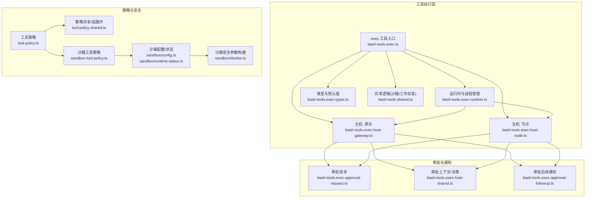
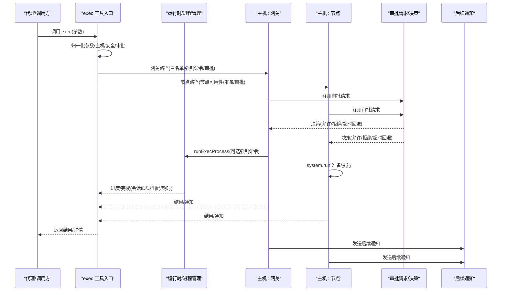
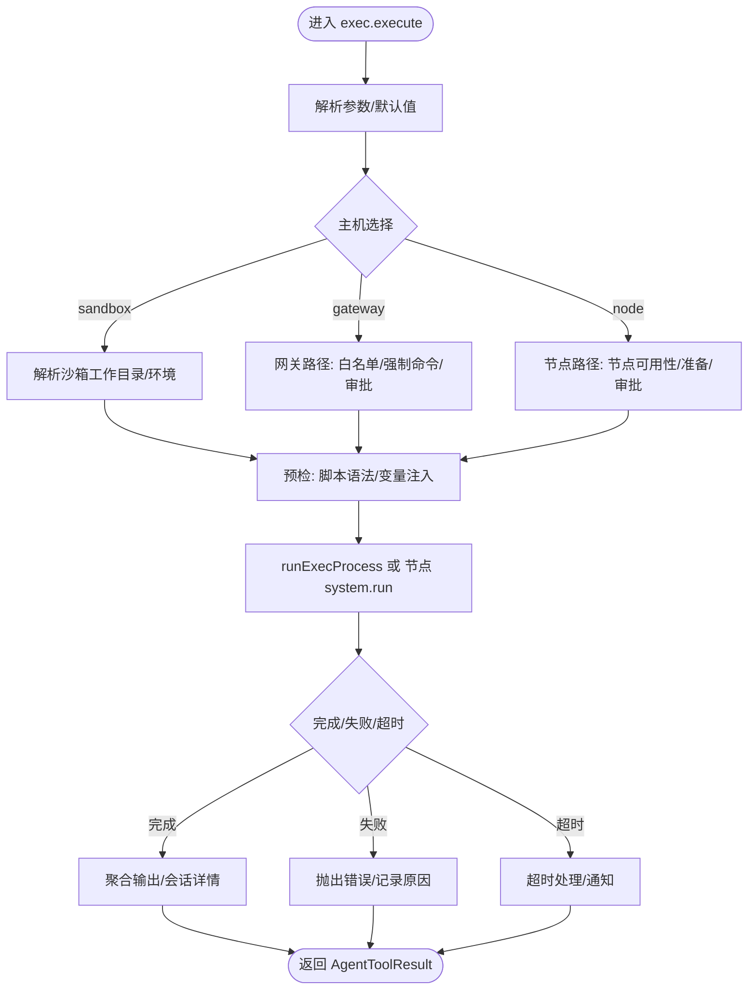
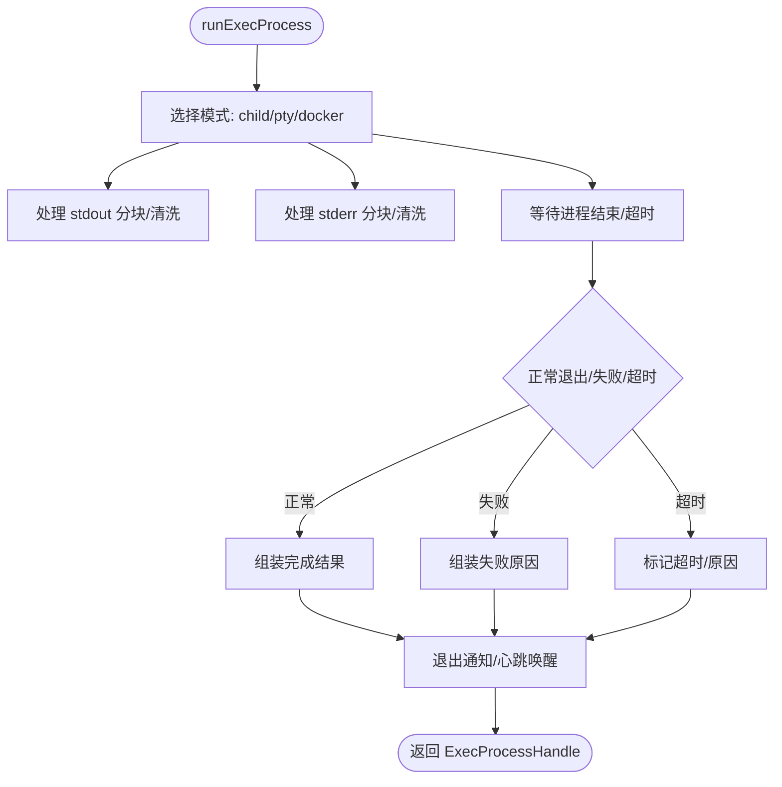
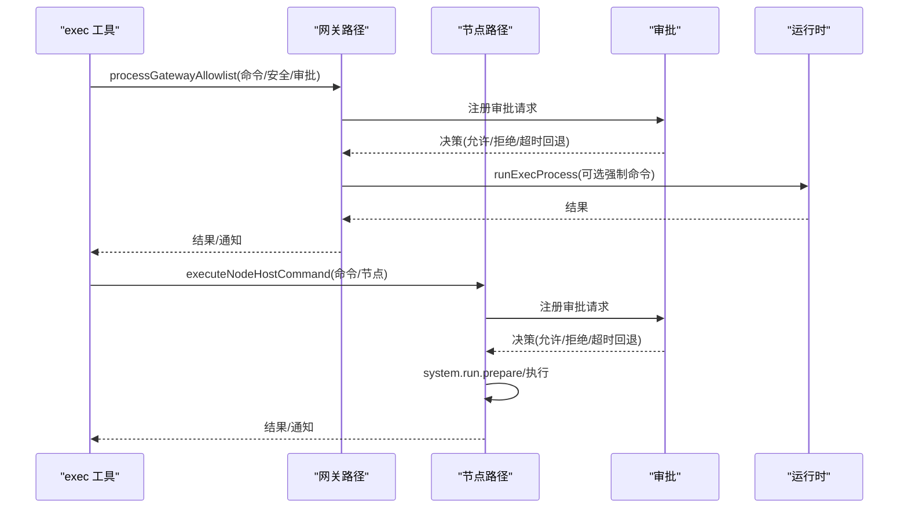
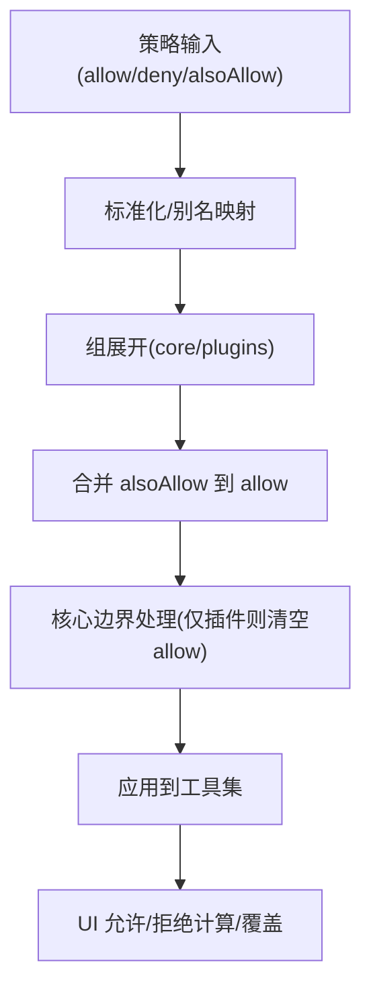
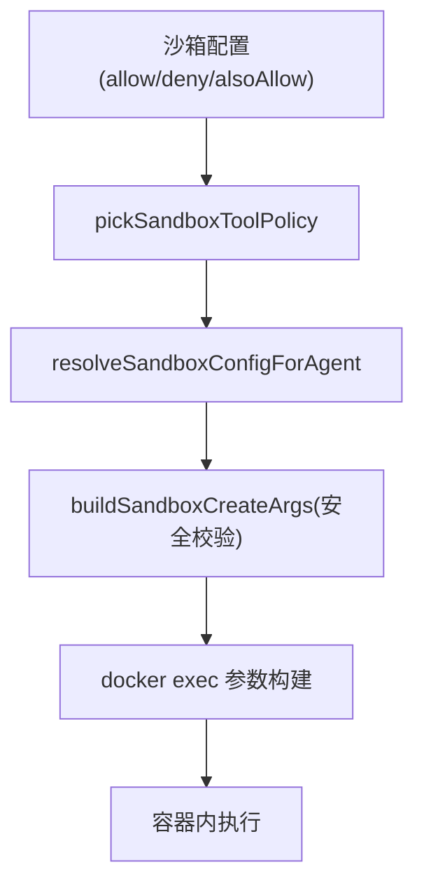
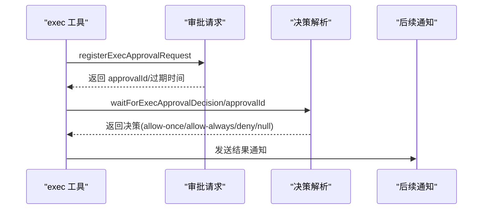
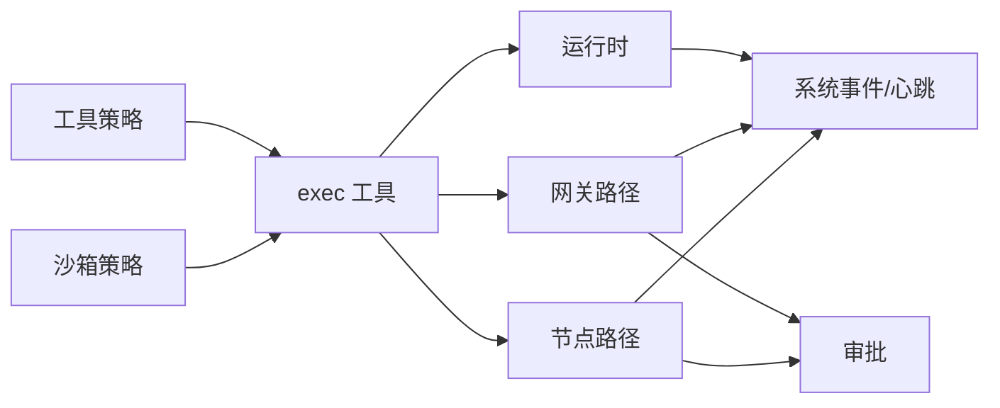

# 工具执行引擎

<cite>
**本文档引用的文件**
- [src/agents/bash-tools.exec.ts](file://src/agents/bash-tools.exec.ts)
- [src/agents/bash-tools.exec-runtime.ts](file://src/agents/bash-tools.exec-runtime.ts)
- [src/agents/bash-tools.exec-host-gateway.ts](file://src/agents/bash-tools.exec-host-gateway.ts)
- [src/agents/bash-tools.exec-host-node.ts](file://src/agents/bash-tools.exec-host-node.ts)
- [src/agents/bash-tools.exec-types.ts](file://src/agents/bash-tools.exec-types.ts)
- [src/agents/bash-tools.shared.ts](file://src/agents/bash-tools.shared.ts)
- [src/agents/tools/common.ts](file://src/agents/tools/common.ts)
- [src/agents/tool-policy.ts](file://src/agents/tool-policy.ts)
- [src/agents/tool-policy-shared.ts](file://src/agents/tool-policy-shared.ts)
- [src/agents/sandbox-tool-policy.ts](file://src/agents/sandbox-tool-policy.ts)
- [src/agents/sandbox/config.ts](file://src/agents/sandbox/config.ts)
- [src/agents/sandbox/runtime-status.ts](file://src/agents/sandbox/runtime-status.ts)
- [src/agents/sandbox/docker.ts](file://src/agents/sandbox/docker.ts)
- [src/agents/bash-tools.exec-approval-request.ts](file://src/agents/bash-tools.exec-approval-request.ts)
- [src/agents/bash-tools.exec-host-shared.ts](file://src/agents/bash-tools.exec-host-shared.ts)
- [src/agents/bash-tools.exec-approval-followup.ts](file://src/agents/bash-tools.exec-approval-followup.ts)
- [src/agents/tool-policy.ts](file://src/agents/tool-policy.ts)
- [src/agents/sandbox-tool-policy.ts](file://src/agents/sandbox-tool-policy.ts)
- [src/agents/sandbox-explain.test.ts](file://src/agents/sandbox-explain.test.ts)
- [src/agents/bash-tools.exec-runtime.ts](file://src/agents/bash-tools.exec-runtime.ts)
- [src/agents/bash-tools.exec-host-gateway.ts](file://src/agents/bash-tools.exec-host-gateway.ts)
- [src/agents/bash-tools.exec-host-node.ts](file://src/agents/bash-tools.exec-host-node.ts)
- [src/agents/bash-tools.exec.ts](file://src/agents/bash-tools.exec.ts)
- [src/agents/tools/common.ts](file://src/agents/tools/common.ts)
- [src/agents/tool-policy-shared.ts](file://src/agents/tool-policy-shared.ts)
- [src/agents/tool-policy.ts](file://src/agents/tool-policy.ts)
- [src/agents/sandbox/config.ts](file://src/agents/sandbox/config.ts)
- [src/agents/sandbox/runtime-status.ts](file://src/agents/sandbox/runtime-status.ts)
- [src/agents/sandbox/docker.ts](file://src/agents/sandbox/docker.ts)
- [src/agents/bash-tools.exec-approval-request.ts](file://src/agents/bash-tools.exec-approval-request.ts)
- [src/agents/bash-tools.exec-host-shared.ts](file://src/agents/bash-tools.exec-host-shared.ts)
- [src/agents/bash-tools.exec-approval-followup.ts](file://src/agents/bash-tools.exec-approval-followup.ts)
</cite>

## 目录

1. [简介](#简介)
2. [项目结构](#项目结构)
3. [核心组件](#核心组件)
4. [架构总览](#架构总览)
5. [详细组件分析](#详细组件分析)
6. [依赖关系分析](#依赖关系分析)
7. [性能考量](#性能考量)
8. [故障排查指南](#故障排查指南)
9. [结论](#结论)
10. [附录](#附录)

## 简介

本文件系统性阐述工具执行引擎的设计与实现，覆盖工具注册、发现、执行与结果处理全流程；详解工具策略（允许/拒绝/附加）、权限控制（审批、沙箱、主机隔离）、显示配置与输出截断；并提供工具开发规范、参数校验与错误处理流程、执行监控与性能优化建议，以及工具沙箱隔离、安全策略与资源管理机制。

## 项目结构

工具执行引擎围绕“exec”工具展开，核心代码位于 agents 子目录中，按职责划分为：

- 执行入口与编排：bash-tools.exec.ts
- 运行时与进程管理：bash-tools.exec-runtime.ts
- 主机执行路径（网关/节点）：bash-tools.exec-host-gateway.ts、bash-tools.exec-host-node.ts
- 类型定义与默认值：bash-tools.exec-types.ts
- 沙箱环境与工作目录解析：bash-tools.shared.ts
- 通用工具基元与输入校验：tools/common.ts
- 工具策略与组展开：tool-policy.ts、tool-policy-shared.ts
- 沙箱工具策略：sandbox-tool-policy.ts
- 沙箱配置与运行状态：sandbox/config.ts、sandbox/runtime-status.ts、sandbox/docker.ts
- 审批请求与后续通知：bash-tools.exec-approval-request.ts、bash-tools.exec-host-shared.ts、bash-tools.exec-approval-followup.ts

图表来源

- [src/agents/bash-tools.exec.ts:1-599](file://src/agents/bash-tools.exec.ts#L1-L599)
- [src/agents/bash-tools.exec-runtime.ts:1-599](file://src/agents/bash-tools.exec-runtime.ts#L1-L599)
- [src/agents/bash-tools.exec-host-gateway.ts:1-380](file://src/agents/bash-tools.exec-host-gateway.ts#L1-L380)
- [src/agents/bash-tools.exec-host-node.ts:1-457](file://src/agents/bash-tools.exec-host-node.ts#L1-L457)
- [src/agents/bash-tools.exec-types.ts:1-79](file://src/agents/bash-tools.exec-types.ts#L1-L79)
- [src/agents/bash-tools.shared.ts:1-289](file://src/agents/bash-tools.shared.ts#L1-L289)
- [src/agents/tool-policy.ts:1-206](file://src/agents/tool-policy.ts#L1-L206)
- [src/agents/tool-policy-shared.ts:1-50](file://src/agents/tool-policy-shared.ts#L1-L50)
- [src/agents/sandbox-tool-policy.ts:1-38](file://src/agents/sandbox-tool-policy.ts#L1-L38)
- [src/agents/sandbox/config.ts:157-188](file://src/agents/sandbox/config.ts#L157-L188)
- [src/agents/sandbox/runtime-status.ts:1-43](file://src/agents/sandbox/runtime-status.ts#L1-L43)
- [src/agents/sandbox/docker.ts:292-344](file://src/agents/sandbox/docker.ts#L292-L344)
- [src/agents/bash-tools.exec-approval-request.ts:113-149](file://src/agents/bash-tools.exec-approval-request.ts#L113-L149)
- [src/agents/bash-tools.exec-host-shared.ts:1-43](file://src/agents/bash-tools.exec-host-shared.ts#L1-L43)
- [src/agents/bash-tools.exec-approval-followup.ts:1-200](file://src/agents/bash-tools.exec-approval-followup.ts#L1-L200)

章节来源

- [src/agents/bash-tools.exec.ts:1-599](file://src/agents/bash-tools.exec.ts#L1-L599)
- [src/agents/bash-tools.exec-runtime.ts:1-599](file://src/agents/bash-tools.exec-runtime.ts#L1-L599)
- [src/agents/bash-tools.exec-host-gateway.ts:1-380](file://src/agents/bash-tools.exec-host-gateway.ts#L1-L380)
- [src/agents/bash-tools.exec-host-node.ts:1-457](file://src/agents/bash-tools.exec-host-node.ts#L1-L457)
- [src/agents/bash-tools.exec-types.ts:1-79](file://src/agents/bash-tools.exec-types.ts#L1-L79)
- [src/agents/bash-tools.shared.ts:1-289](file://src/agents/bash-tools.shared.ts#L1-L289)
- [src/agents/tool-policy.ts:1-206](file://src/agents/tool-policy.ts#L1-L206)
- [src/agents/tool-policy-shared.ts:1-50](file://src/agents/tool-policy-shared.ts#L1-L50)
- [src/agents/sandbox-tool-policy.ts:1-38](file://src/agents/sandbox-tool-policy.ts#L1-L38)
- [src/agents/sandbox/config.ts:157-188](file://src/agents/sandbox/config.ts#L157-L188)
- [src/agents/sandbox/runtime-status.ts:1-43](file://src/agents/sandbox/runtime-status.ts#L1-L43)
- [src/agents/sandbox/docker.ts:292-344](file://src/agents/sandbox/docker.ts#L292-L344)
- [src/agents/bash-tools.exec-approval-request.ts:113-149](file://src/agents/bash-tools.exec-approval-request.ts#L113-L149)
- [src/agents/bash-tools.exec-host-shared.ts:1-43](file://src/agents/bash-tools.exec-host-shared.ts#L1-L43)
- [src/agents/bash-tools.exec-approval-followup.ts:1-200](file://src/agents/bash-tools.exec-approval-followup.ts#L1-L200)

## 核心组件

- 执行工具（exec）：统一入口，负责参数归一化、主机选择、安全模式、审批策略、沙箱/主机执行分发、输出聚合与超时控制。
- 运行时与进程管理：封装子进程/容器 spawn、PTY 支持、输出分块、超时与信号处理、会话状态维护与通知。
- 主机执行路径：网关侧基于白名单/强制命令与审批；节点侧通过网关调用节点执行器，并支持本地审批预检。
- 工具策略：工具名标准化、组展开、允许/拒绝列表合并、插件组与核心工具边界处理。
- 沙箱策略：允许/拒绝集合的合并与规范化，支持 alsoAllow 的叠加行为。
- 沙箱配置：作用域、生命周期裁剪、工具策略解析与来源追踪。
- 审批与通知：审批请求注册、决策解析、超时回退、后续通知与系统事件。

章节来源

- [src/agents/bash-tools.exec.ts:151-599](file://src/agents/bash-tools.exec.ts#L151-L599)
- [src/agents/bash-tools.exec-runtime.ts:289-599](file://src/agents/bash-tools.exec-runtime.ts#L289-L599)
- [src/agents/bash-tools.exec-host-gateway.ts:74-380](file://src/agents/bash-tools.exec-host-gateway.ts#L74-L380)
- [src/agents/bash-tools.exec-host-node.ts:66-457](file://src/agents/bash-tools.exec-host-node.ts#L66-L457)
- [src/agents/tool-policy.ts:70-206](file://src/agents/tool-policy.ts#L70-L206)
- [src/agents/sandbox-tool-policy.ts:21-38](file://src/agents/sandbox-tool-policy.ts#L21-L38)
- [src/agents/sandbox/config.ts:157-188](file://src/agents/sandbox/config.ts#L157-L188)
- [src/agents/bash-tools.exec-approval-request.ts:113-149](file://src/agents/bash-tools.exec-approval-request.ts#L113-L149)

## 架构总览

下图展示从工具调用到执行完成的关键交互路径，包括策略评估、主机选择、审批与执行、结果返回与通知。

图表来源

- [src/agents/bash-tools.exec.ts:209-594](file://src/agents/bash-tools.exec.ts#L209-L594)
- [src/agents/bash-tools.exec-runtime.ts:289-599](file://src/agents/bash-tools.exec-runtime.ts#L289-L599)
- [src/agents/bash-tools.exec-host-gateway.ts:74-380](file://src/agents/bash-tools.exec-host-gateway.ts#L74-L380)
- [src/agents/bash-tools.exec-host-node.ts:66-457](file://src/agents/bash-tools.exec-host-node.ts#L66-L457)
- [src/agents/bash-tools.exec-approval-request.ts:113-149](file://src/agents/bash-tools.exec-approval-request.ts#L113-L149)
- [src/agents/bash-tools.exec-approval-followup.ts:1-200](file://src/agents/bash-tools.exec-approval-followup.ts#L1-L200)

## 详细组件分析

### 组件A：exec 工具入口与执行编排

- 职责：创建 exec 工具实例，解析默认值（主机、安全、审批、超时、背景执行窗口、PATH 前缀、安全二进制策略等），根据参数与默认值决定执行路径（sandbox/gateway/node），进行预检（脚本语法检查、安全二进制策略、主机环境变量限制），最终调用运行时执行并处理结果与异常。
- 关键流程：
  - 参数归一化与默认值合并
  - 主机选择与安全模式协商
  - 审批策略评估与强制模式处理
  - 沙箱工作目录解析与环境构建
  - 预检：脚本目标文件检测、Shell 变量注入风险识别
  - 进程/容器执行与输出分块
  - 背景执行与会话管理
  - 异常处理与超时/信号响应

图表来源

- [src/agents/bash-tools.exec.ts:151-599](file://src/agents/bash-tools.exec.ts#L151-L599)
- [src/agents/bash-tools.exec-runtime.ts:289-599](file://src/agents/bash-tools.exec-runtime.ts#L289-L599)

章节来源

- [src/agents/bash-tools.exec.ts:151-599](file://src/agents/bash-tools.exec.ts#L151-L599)

### 组件B：运行时与进程管理

- 职责：统一管理子进程/容器执行，支持 PTY、输出分块、超时与信号处理、会话状态维护、退出通知与心跳唤醒。
- 关键点：
  - 环境变量清洗与主机执行安全限制（禁止危险变量与自定义 PATH）
  - 输出清洗与分块传输，避免大文本阻塞
  - PTY 回退与 DSR 请求处理
  - 会话生命周期管理与后台标记
  - 超时/无输出超时/信号中断等多类失败场景

图表来源

- [src/agents/bash-tools.exec-runtime.ts:289-599](file://src/agents/bash-tools.exec-runtime.ts#L289-L599)

章节来源

- [src/agents/bash-tools.exec-runtime.ts:1-599](file://src/agents/bash-tools.exec-runtime.ts#L1-L599)

### 组件C：主机执行路径（网关/节点）

- 网关路径：
  - 白名单评估与强制命令生成
  - heredoc 等高危段落的显式审批
  - 审批注册、决策解析、超时回退策略
  - 记录允许使用情况、可选添加 allow-always 条目
  - 执行后发送后续通知
- 节点路径：
  - 节点可用性与 system.run 支持校验
  - system.run.prepare 生成执行计划
  - 本地白名单预检（若节点侧可用）
  - 审批注册与决策解析
  - 执行后发送后续通知

图表来源

- [src/agents/bash-tools.exec-host-gateway.ts:74-380](file://src/agents/bash-tools.exec-host-gateway.ts#L74-L380)
- [src/agents/bash-tools.exec-host-node.ts:66-457](file://src/agents/bash-tools.exec-host-node.ts#L66-L457)
- [src/agents/bash-tools.exec-approval-request.ts:113-149](file://src/agents/bash-tools.exec-approval-request.ts#L113-L149)
- [src/agents/bash-tools.exec-approval-followup.ts:1-200](file://src/agents/bash-tools.exec-approval-followup.ts#L1-L200)

章节来源

- [src/agents/bash-tools.exec-host-gateway.ts:1-380](file://src/agents/bash-tools.exec-host-gateway.ts#L1-L380)
- [src/agents/bash-tools.exec-host-node.ts:1-457](file://src/agents/bash-tools.exec-host-node.ts#L1-L457)

### 组件D：工具策略与显示配置

- 工具策略：
  - 工具名标准化与别名映射
  - 组展开（核心/插件组）
  - 允许/拒绝列表合并与去重
  - alsoAllow 的叠加行为与核心工具边界处理
- 显示配置：
  - UI 层对工具允许/拒绝的计算与覆盖
  - 允许列表与拒绝列表的优先级与互斥

图表来源

- [src/agents/tool-policy.ts:70-206](file://src/agents/tool-policy.ts#L70-L206)
- [src/agents/tool-policy-shared.ts:19-47](file://src/agents/tool-policy-shared.ts#L19-L47)
- [src/agents/sandbox-tool-policy.ts:21-38](file://src/agents/sandbox-tool-policy.ts#L21-L38)
- [ui/src/ui/views/agents-panels-tools-skills.ts:68-100](file://ui/src/ui/views/agents-panels-tools-skills.ts#L68-L100)

章节来源

- [src/agents/tool-policy.ts:1-206](file://src/agents/tool-policy.ts#L1-L206)
- [src/agents/tool-policy-shared.ts:1-50](file://src/agents/tool-policy-shared.ts#L1-L50)
- [src/agents/sandbox-tool-policy.ts:1-38](file://src/agents/sandbox-tool-policy.ts#L1-L38)
- [ui/src/ui/views/agents-panels-tools-skills.ts:68-100](file://ui/src/ui/views/agents-panels-tools-skills.ts#L68-L100)

### 组件E：沙箱隔离与安全策略

- 沙箱策略：
  - allow/deny 合并与 alsoAllow 叠加
  - 未设置 allow 时隐式允许全部（带 \*）
- 沙箱配置：
  - 作用域（全局/代理/会话）、生命周期裁剪（空闲/最大年龄）
  - 工具策略解析与来源追踪（优先代理覆盖 > 全局 > 默认）
- 安全参数构建：
  - Docker exec 参数构建与安全校验（绑定源根、保留容器目标、命名空间加入等）
  - 环境变量传递与 PATH 处理（避免 Windows 路径污染）

图表来源

- [src/agents/sandbox-tool-policy.ts:21-38](file://src/agents/sandbox-tool-policy.ts#L21-L38)
- [src/agents/sandbox/config.ts:157-188](file://src/agents/sandbox/config.ts#L157-L188)
- [src/agents/sandbox/docker.ts:292-344](file://src/agents/sandbox/docker.ts#L292-L344)
- [src/agents/sandbox-explain.test.ts:1-34](file://src/agents/sandbox-explain.test.ts#L1-L34)

章节来源

- [src/agents/sandbox-tool-policy.ts:1-38](file://src/agents/sandbox-tool-policy.ts#L1-L38)
- [src/agents/sandbox/config.ts:157-188](file://src/agents/sandbox/config.ts#L157-L188)
- [src/agents/sandbox/docker.ts:292-344](file://src/agents/sandbox/docker.ts#L292-L344)
- [src/agents/sandbox-explain.test.ts:1-34](file://src/agents/sandbox-explain.test.ts#L1-L34)

### 组件F：权限控制与审批流程

- 审批请求：
  - 注册审批请求、生成短码/完整ID、过期时间
  - 等待审批决策或超时/清理
- 决策解析：
  - 预解析决策（preResolvedDecision）
  - 超时回退策略（askFallback）
  - 拒绝原因与告警
- 通知：
  - 审批通过/拒绝/不可用的后续通知
  - 系统事件与心跳唤醒

图表来源

- [src/agents/bash-tools.exec-approval-request.ts:113-149](file://src/agents/bash-tools.exec-approval-request.ts#L113-L149)
- [src/agents/bash-tools.exec-host-shared.ts:1-43](file://src/agents/bash-tools.exec-host-shared.ts#L1-L43)
- [src/agents/bash-tools.exec-approval-followup.ts:1-200](file://src/agents/bash-tools.exec-approval-followup.ts#L1-L200)

章节来源

- [src/agents/bash-tools.exec-approval-request.ts:113-149](file://src/agents/bash-tools.exec-approval-request.ts#L113-L149)
- [src/agents/bash-tools.exec-host-shared.ts:1-43](file://src/agents/bash-tools.exec-host-shared.ts#L1-L43)
- [src/agents/bash-tools.exec-approval-followup.ts:1-200](file://src/agents/bash-tools.exec-approval-followup.ts#L1-L200)

## 依赖关系分析

- 组件耦合：
  - exec 工具入口强依赖运行时与主机执行路径；运行时依赖进程监管与输出处理；主机路径依赖审批模块与通知模块。
  - 策略模块与沙箱策略模块相互独立但共同影响工具可见性与执行范围。
- 外部依赖：
  - Docker（容器执行）
  - 网关 RPC（节点执行与审批）
  - 系统事件与心跳服务（通知与唤醒）

图表来源

- [src/agents/bash-tools.exec.ts:1-599](file://src/agents/bash-tools.exec.ts#L1-L599)
- [src/agents/bash-tools.exec-runtime.ts:1-599](file://src/agents/bash-tools.exec-runtime.ts#L1-L599)
- [src/agents/bash-tools.exec-host-gateway.ts:1-380](file://src/agents/bash-tools.exec-host-gateway.ts#L1-L380)
- [src/agents/bash-tools.exec-host-node.ts:1-457](file://src/agents/bash-tools.exec-host-node.ts#L1-L457)
- [src/agents/tool-policy.ts:1-206](file://src/agents/tool-policy.ts#L1-L206)
- [src/agents/sandbox-tool-policy.ts:1-38](file://src/agents/sandbox-tool-policy.ts#L1-L38)

章节来源

- [src/agents/bash-tools.exec.ts:1-599](file://src/agents/bash-tools.exec.ts#L1-L599)
- [src/agents/bash-tools.exec-runtime.ts:1-599](file://src/agents/bash-tools.exec-runtime.ts#L1-L599)
- [src/agents/bash-tools.exec-host-gateway.ts:1-380](file://src/agents/bash-tools.exec-host-gateway.ts#L1-L380)
- [src/agents/bash-tools.exec-host-node.ts:1-457](file://src/agents/bash-tools.exec-host-node.ts#L1-L457)
- [src/agents/tool-policy.ts:1-206](file://src/agents/tool-policy.ts#L1-L206)
- [src/agents/sandbox-tool-policy.ts:1-38](file://src/agents/sandbox-tool-policy.ts#L1-L38)

## 性能考量

- 输出截断与分块：默认最大输出与挂起输出上限，避免内存膨胀与消息体过大。
- 背景执行与超时：支持在未指定显式超时时按背景执行窗口自动让出，减少阻塞；明确超时与无输出超时区分。
- PTY 回退：PTY 失败自动回退至 child 模式，保证可用性。
- 沙箱 PATH 处理：通过环境变量传递 PATH，避免容器内 PATH 解析问题导致的额外开销。
- 审批预检：网关侧白名单预检与节点侧本地预检，降低无效执行次数。

章节来源

- [src/agents/bash-tools.exec-runtime.ts:77-91](file://src/agents/bash-tools.exec-runtime.ts#L77-L91)
- [src/agents/bash-tools.exec-runtime.ts:483-516](file://src/agents/bash-tools.exec-runtime.ts#L483-L516)
- [src/agents/bash-tools.shared.ts:72-86](file://src/agents/bash-tools.shared.ts#L72-L86)

## 故障排查指南

- 常见错误与定位：
  - “缺少命令”、“不可执行”：shell 退出码 127/126，通常为二进制缺失或权限问题。
  - “超时”：检查 timeoutSec 设置与任务耗时；区分总体超时与无输出超时。
  - “审批超时/不可用”：确认审批路由配置、平台支持状态与过期时间。
  - “PATH 修改被阻止”：主机执行不允许自定义 PATH，需通过其他方式配置。
  - “工作目录不可用”：沙箱工作目录映射失败时回退到沙箱工作区根。
- 排查步骤：
  - 查看会话详情中的状态、退出码、耗时与尾部输出。
  - 检查审批请求是否已注册、是否超时或被拒绝。
  - 确认主机选择与安全模式是否符合预期。
  - 核对 PATH 与环境变量是否被正确传递与清洗。

章节来源

- [src/agents/bash-tools.exec-runtime.ts:520-587](file://src/agents/bash-tools.exec-runtime.ts#L520-L587)
- [src/agents/bash-tools.exec-host-gateway.ts:372-374](file://src/agents/bash-tools.exec-host-gateway.ts#L372-L374)
- [src/agents/bash-tools.exec-runtime.ts:58-76](file://src/agents/bash-tools.exec-runtime.ts#L58-L76)
- [src/agents/bash-tools.shared.ts:89-126](file://src/agents/bash-tools.shared.ts#L89-L126)

## 结论

工具执行引擎以 exec 工具为核心，结合策略、审批与沙箱机制，实现了从工具注册、发现、执行到结果处理的完整闭环。通过白名单/强制命令、PT/PTY 支持、输出截断与超时控制、审批与通知联动，既保障了安全性与可控性，也兼顾了可观测性与可维护性。建议在实际部署中合理配置主机/沙箱策略、审批与超时参数，并结合监控与日志进行持续优化。

## 附录

- 开发规范与最佳实践：
  - 使用标准化工具名与组展开，避免硬编码工具名。
  - 在策略中优先使用 allowlist 与 alsoAllow 的组合，确保核心工具不被意外屏蔽。
  - 对于需要 TTY 的命令启用 pty；对长时间任务设置合理超时。
  - 审批路径尽量前置预检，减少无效执行。
  - 沙箱工作目录与 PATH 通过环境变量传递，避免直接修改 PATH。
- 参数验证与错误处理：
  - 输入参数严格校验（必填、类型、长度、格式），必要时抛出 ToolInputError/ToolAuthorizationError。
  - 对外部调用（节点/网关）设置合理超时与重试策略。
  - 对异常进行分类处理，区分超时、信号、权限与不可恢复错误。

章节来源

- [src/agents/tools/common.ts:26-42](file://src/agents/tools/common.ts#L26-L42)
- [src/agents/tools/common.ts:74-201](file://src/agents/tools/common.ts#L74-L201)
- [src/agents/bash-tools.exec.ts:288-302](file://src/agents/bash-tools.exec.ts#L288-L302)
- [src/agents/bash-tools.exec-host-gateway.ts:132-140](file://src/agents/bash-tools.exec-host-gateway.ts#L132-L140)
- [src/agents/bash-tools.exec-host-node.ts:186-192](file://src/agents/bash-tools.exec-host-node.ts#L186-L192)
