# 自动回复机制

<cite>
**本文引用的文件**
- [src/auto-reply/command-detection.ts](file://src/auto-reply/command-detection.ts)
- [src/auto-reply/dispatch.ts](file://src/auto-reply/dispatch.ts)
- [src/auto-reply/thinking.ts](file://src/auto-reply/thinking.ts)
- [src/auto-reply/templating.ts](file://src/auto-reply/templating.ts)
- [src/auto-reply/types.ts](file://src/auto-reply/types.ts)
- [src/auto-reply/model.ts](file://src/auto-reply/model.ts)
- [src/auto-reply/send-policy.ts](file://src/auto-reply/send-policy.ts)
- [src/auto-reply/envelope.ts](file://src/auto-reply/envelope.ts)
- [src/auto-reply/status.ts](file://src/auto-reply/status.ts)
- [src/auto-reply/fallback-state.ts](file://src/auto-reply/fallback-state.ts)
- [src/auto-reply/group-activation.ts](file://src/auto-reply/group-activation.ts)
- [src/auto-reply/inbound-debounce.ts](file://src/auto-reply/inbound-debounce.ts)
- [src/auto-reply/media-note.ts](file://src/auto-reply/media-note.ts)
- [src/auto-reply/heartbeat.ts](file://src/auto-reply/heartbeat.ts)
- [src/auto-reply/reply.ts](file://src/auto-reply/reply.ts)
</cite>

## 目录

1. [简介](#简介)
2. [项目结构](#项目结构)
3. [核心组件](#核心组件)
4. [架构总览](#架构总览)
5. [详细组件分析](#详细组件分析)
6. [依赖关系分析](#依赖关系分析)
7. [性能考量](#性能考量)
8. [故障排查指南](#故障排查指南)
9. [结论](#结论)
10. [附录](#附录)

## 简介

本文件系统性阐述 OpenClaw 的自动回复机制，覆盖消息触发检测、指令解析与执行、回复生成与模板化、思考模式与推理控制、流式输出与去重策略，并给出配置项、触发条件、响应模板、多轮会话与上下文保持、性能优化与调试方法等实用指南。目标是帮助开发者与运维人员快速理解并高效扩展自动回复能力。

## 项目结构

自动回复相关代码集中于 src/auto-reply 目录，围绕“入站消息上下文构建”“命令与指令检测”“回复调度与派发”“思考/推理/冗余控制”“媒体与信封格式化”“心跳与发送策略”等模块协同工作。

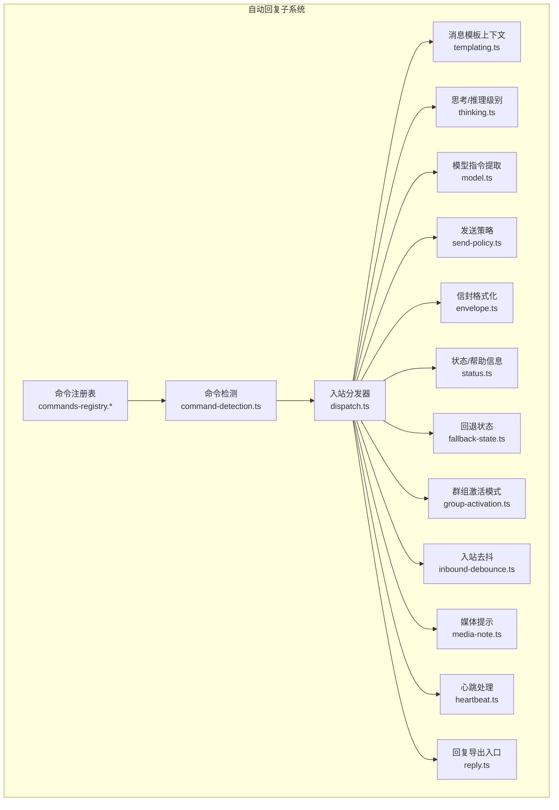

图示来源

- [src/auto-reply/command-detection.ts](file://src/auto-reply/command-detection.ts)
- [src/auto-reply/dispatch.ts](file://src/auto-reply/dispatch.ts)
- [src/auto-reply/templating.ts](file://src/auto-reply/templating.ts)
- [src/auto-reply/thinking.ts](file://src/auto-reply/thinking.ts)
- [src/auto-reply/model.ts](file://src/auto-reply/model.ts)
- [src/auto-reply/send-policy.ts](file://src/auto-reply/send-policy.ts)
- [src/auto-reply/envelope.ts](file://src/auto-reply/envelope.ts)
- [src/auto-reply/status.ts](file://src/auto-reply/status.ts)
- [src/auto-reply/fallback-state.ts](file://src/auto-reply/fallback-state.ts)
- [src/auto-reply/group-activation.ts](file://src/auto-reply/group-activation.ts)
- [src/auto-reply/inbound-debounce.ts](file://src/auto-reply/inbound-debounce.ts)
- [src/auto-reply/media-note.ts](file://src/auto-reply/media-note.ts)
- [src/auto-reply/heartbeat.ts](file://src/auto-reply/heartbeat.ts)
- [src/auto-reply/reply.ts](file://src/auto-reply/reply.ts)

章节来源

- [src/auto-reply/command-detection.ts](file://src/auto-reply/command-detection.ts)
- [src/auto-reply/dispatch.ts](file://src/auto-reply/dispatch.ts)
- [src/auto-reply/templating.ts](file://src/auto-reply/templating.ts)
- [src/auto-reply/thinking.ts](file://src/auto-reply/thinking.ts)
- [src/auto-reply/model.ts](file://src/auto-reply/model.ts)
- [src/auto-reply/send-policy.ts](file://src/auto-reply/send-policy.ts)
- [src/auto-reply/envelope.ts](file://src/auto-reply/envelope.ts)
- [src/auto-reply/status.ts](file://src/auto-reply/status.ts)
- [src/auto-reply/fallback-state.ts](file://src/auto-reply/fallback-state.ts)
- [src/auto-reply/group-activation.ts](file://src/auto-reply/group-activation.ts)
- [src/auto-reply/inbound-debounce.ts](file://src/auto-reply/inbound-debounce.ts)
- [src/auto-reply/media-note.ts](file://src/auto-reply/media-note.ts)
- [src/auto-reply/heartbeat.ts](file://src/auto-reply/heartbeat.ts)
- [src/auto-reply/reply.ts](file://src/auto-reply/reply.ts)

## 核心组件

- 命令检测与授权：识别文本中的控制命令与内联令牌，决定是否计算权限与执行指令。
- 入站消息分发：将消息上下文标准化后交由回复调度器执行，支持打字指示与缓冲派发。
- 思考/推理/冗余控制：统一的思考层级、推理可见性、使用显示模式、提升权限等策略。
- 模型选择与指令：从消息中抽取模型/认证档位指令，清理原始正文。
- 发送策略：/send 命令对单次发送进行允许/拒绝/继承控制。
- 信封与模板：为回复注入时间线、来源、上下文等元信息；支持占位符模板渲染。
- 状态与帮助：/status、/help 等命令输出当前运行态、队列、成本、媒体理解等摘要。
- 回退状态：在首选模型不可用时的回退通知与过渡状态判定。
- 群组激活：群聊/频道场景下的“提及才触发”或“始终触发”模式。
- 入站去抖：按通道/键聚合入站消息，降低并发与重复处理压力。
- 媒体提示：根据媒体理解结果与转录情况，智能提示附件与音频转录。
- 心跳：周期性任务与 ACK 规则，避免空闲循环与重复任务。
- 回复导出入口：统一导出指令解析、回复生成、执行/排队/回复标签等能力。

章节来源

- [src/auto-reply/command-detection.ts](file://src/auto-reply/command-detection.ts)
- [src/auto-reply/dispatch.ts](file://src/auto-reply/dispatch.ts)
- [src/auto-reply/thinking.ts](file://src/auto-reply/thinking.ts)
- [src/auto-reply/model.ts](file://src/auto-reply/model.ts)
- [src/auto-reply/send-policy.ts](file://src/auto-reply/send-policy.ts)
- [src/auto-reply/envelope.ts](file://src/auto-reply/envelope.ts)
- [src/auto-reply/status.ts](file://src/auto-reply/status.ts)
- [src/auto-reply/fallback-state.ts](file://src/auto-reply/fallback-state.ts)
- [src/auto-reply/group-activation.ts](file://src/auto-reply/group-activation.ts)
- [src/auto-reply/inbound-debounce.ts](file://src/auto-reply/inbound-debounce.ts)
- [src/auto-reply/media-note.ts](file://src/auto-reply/media-note.ts)
- [src/auto-reply/heartbeat.ts](file://src/auto-reply/heartbeat.ts)
- [src/auto-reply/reply.ts](file://src/auto-reply/reply.ts)

## 架构总览

自动回复流程自“入站消息”开始，经“命令检测与授权”“上下文模板化”“思考/推理策略”“模型指令解析”“发送策略与路由”“去抖与派发”“媒体提示与信封格式化”，最终输出“块级流式回复”，并在必要时触发“心跳”。

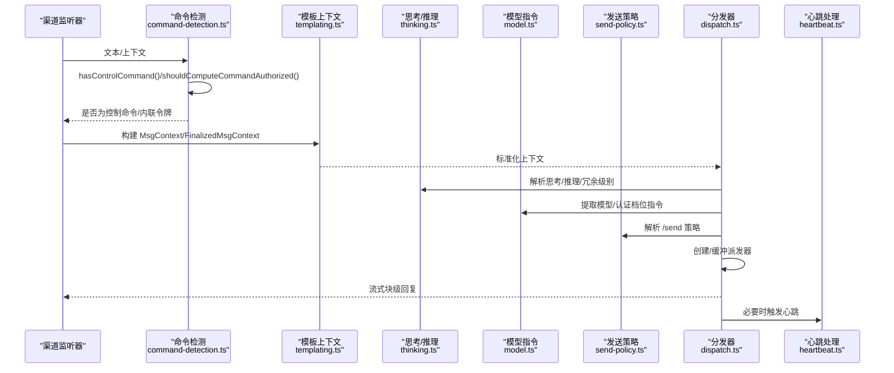

图示来源

- [src/auto-reply/command-detection.ts](file://src/auto-reply/command-detection.ts)
- [src/auto-reply/templating.ts](file://src/auto-reply/templating.ts)
- [src/auto-reply/thinking.ts](file://src/auto-reply/thinking.ts)
- [src/auto-reply/model.ts](file://src/auto-reply/model.ts)
- [src/auto-reply/send-policy.ts](file://src/auto-reply/send-policy.ts)
- [src/auto-reply/dispatch.ts](file://src/auto-reply/dispatch.ts)
- [src/auto-reply/heartbeat.ts](file://src/auto-reply/heartbeat.ts)

## 详细组件分析

### 命令检测与触发

- 控制命令识别：对消息进行规范化（去空白、小写、别名匹配），支持带参数的命令前缀匹配。
- 内联令牌粗检：通过正则快速判断是否存在“/”或“!”开头的简短指令，用于前置授权决策。
- 终止触发：支持特定“取消/终止”关键词作为触发条件，便于打断或清理。

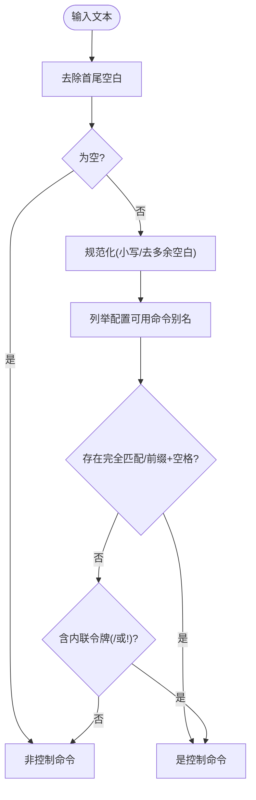

图示来源

- [src/auto-reply/command-detection.ts](file://src/auto-reply/command-detection.ts)

章节来源

- [src/auto-reply/command-detection.ts](file://src/auto-reply/command-detection.ts)

### 入站消息分发与派发器

- 上下文终化：确保 CommandAuthorized 字段存在且默认为 false，避免未授权执行。
- 分发器封装：提供“直接派发”“带打字指示缓冲派发”“保留/等待空闲”的生命周期管理。
- 外层保护：无论成功与否均释放资源，保证派发器状态一致。

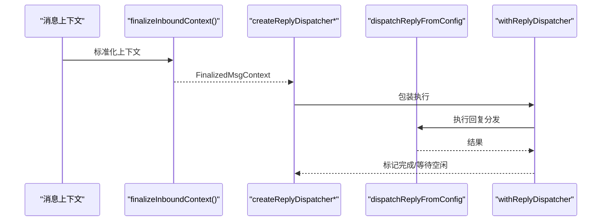

图示来源

- [src/auto-reply/dispatch.ts](file://src/auto-reply/dispatch.ts)

章节来源

- [src/auto-reply/dispatch.ts](file://src/auto-reply/dispatch.ts)

### 思考模式与推理控制

- 思考层级：off/minimal/low/medium/high/xhigh/adaptive，支持二进制提供方（如 z.ai）与常规枚举。
- 推理可见性：off/on/stream，支持“实时/草稿”流式展示。
- 冗余显示：tokens/full/off，控制用量后缀显示粒度。
- 提升权限：off/on/ask/full，控制是否自动批准高权限执行。
- 模型能力：针对特定“超高思考”模型集合进行能力判定与提示。

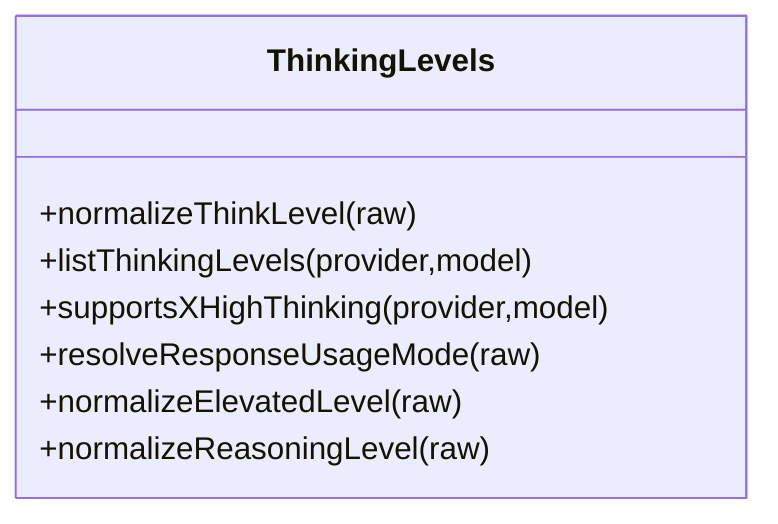

图示来源

- [src/auto-reply/thinking.ts](file://src/auto-reply/thinking.ts)

章节来源

- [src/auto-reply/thinking.ts](file://src/auto-reply/thinking.ts)

### 模型指令解析

- 指令形式：/model 或别名，可携带 provider/model 与认证档位。
- 清理正文：移除已识别指令，返回“干净正文”，便于后续模板与提示工程。
- 认证档位：支持从尾部解析认证配置片段，分离模型与认证档位。

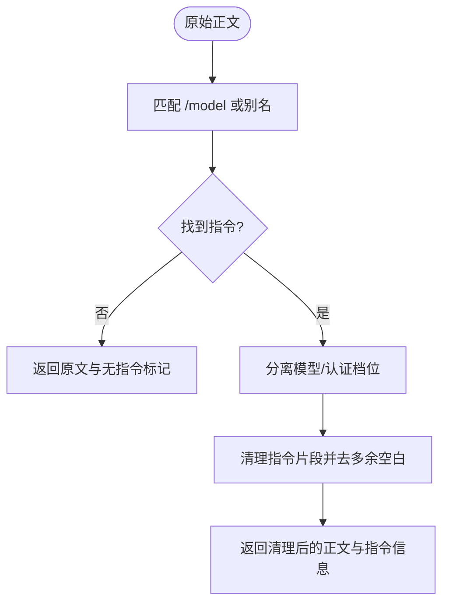

图示来源

- [src/auto-reply/model.ts](file://src/auto-reply/model.ts)

章节来源

- [src/auto-reply/model.ts](file://src/auto-reply/model.ts)

### 发送策略与 /send 命令

- /send inherit/reset/default：继承全局/默认设置。
- /send allow/on：强制允许本次发送。
- /send deny/off：强制拒绝本次发送。
- 归一化：大小写/空白不敏感，未知值忽略。

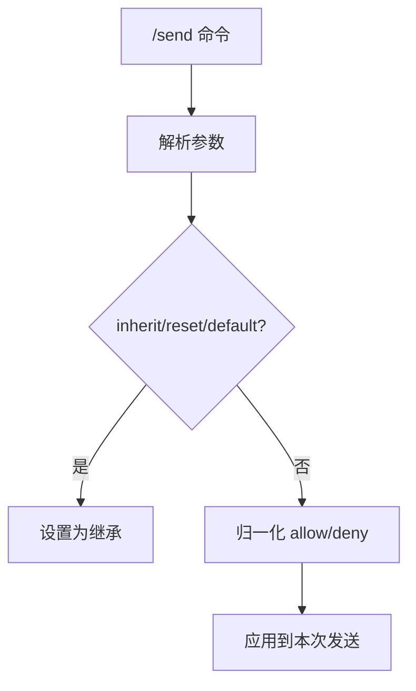

图示来源

- [src/auto-reply/send-policy.ts](file://src/auto-reply/send-policy.ts)

章节来源

- [src/auto-reply/send-policy.ts](file://src/auto-reply/send-policy.ts)

### 信封格式化与模板

- 信封：支持时区、相对时间、主机/IP 等元信息，适配不同渠道风格。
- 模板：简单占位符 {{Key}} 替换，类型安全地将上下文字段注入提示或回复。
- 入站信封：区分群组/私聊、自聊标注、转发来源等。

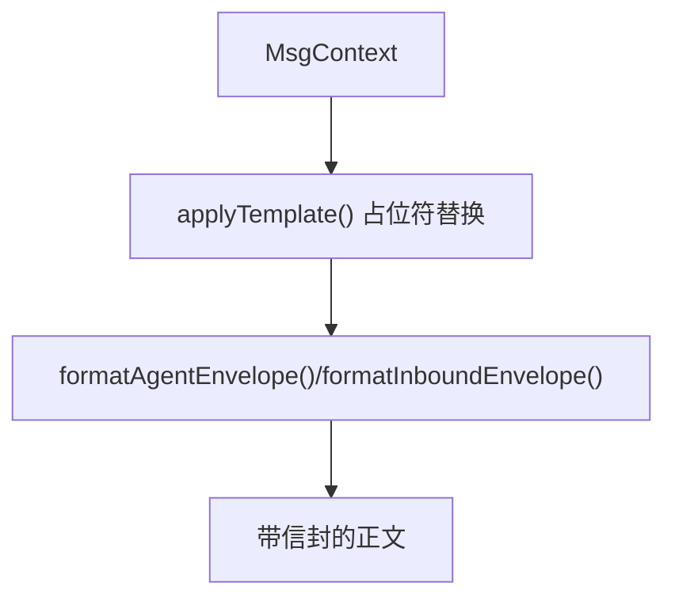

图示来源

- [src/auto-reply/templating.ts](file://src/auto-reply/templating.ts)
- [src/auto-reply/envelope.ts](file://src/auto-reply/envelope.ts)

章节来源

- [src/auto-reply/templating.ts](file://src/auto-reply/templating.ts)
- [src/auto-reply/envelope.ts](file://src/auto-reply/envelope.ts)

### 状态与帮助信息

- /status：汇总版本、模型、用量、缓存命中率、上下文占用、队列深度、语音合成、群组激活模式等。
- /help：列出常用命令类别与入口。
- 可选开关：/config、/debug 等。

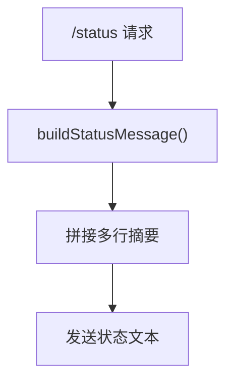

图示来源

- [src/auto-reply/status.ts](file://src/auto-reply/status.ts)

章节来源

- [src/auto-reply/status.ts](file://src/auto-reply/status.ts)

### 回退状态与模型切换

- 回退原因摘要：截断并人性化展示首次失败原因。
- 过渡判定：比较“选定模型”与“活跃模型”，判断是否发生回退、清除或保持。
- 通知：在状态变更时输出简洁提示，便于用户感知。

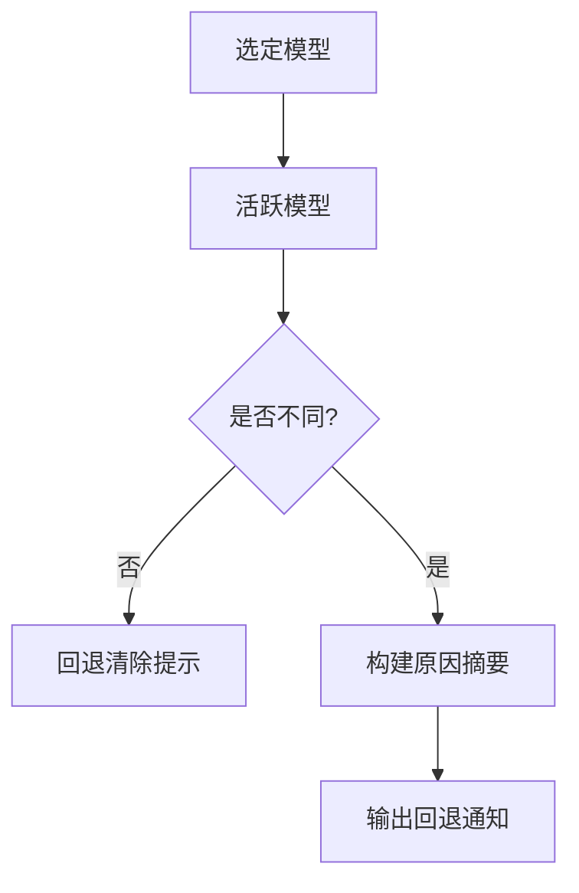

图示来源

- [src/auto-reply/fallback-state.ts](file://src/auto-reply/fallback-state.ts)

章节来源

- [src/auto-reply/fallback-state.ts](file://src/auto-reply/fallback-state.ts)

### 群组激活模式

- /activation mention：仅当被提及才触发。
- /activation always：群组内始终触发。
- 归一化：大小写/空白不敏感，未知值忽略。

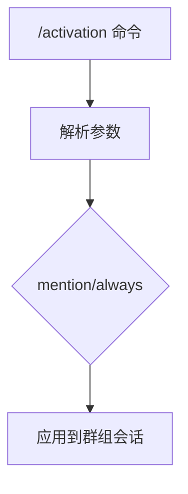

图示来源

- [src/auto-reply/group-activation.ts](file://src/auto-reply/group-activation.ts)

章节来源

- [src/auto-reply/group-activation.ts](file://src/auto-reply/group-activation.ts)

### 入站去抖与批处理

- 按键聚合：支持按通道/键/自定义键聚合入站消息。
- 可插拔去抖：支持每条消息独立去抖时长，或统一去抖窗口。
- 刷新策略：定时器到期后批量刷新，减少并发与重复处理。

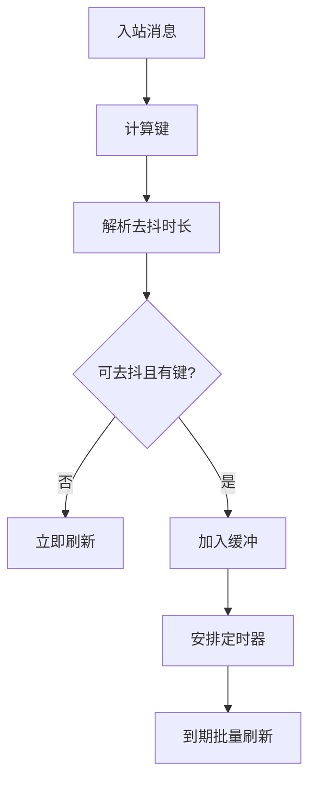

图示来源

- [src/auto-reply/inbound-debounce.ts](file://src/auto-reply/inbound-debounce.ts)

章节来源

- [src/auto-reply/inbound-debounce.ts](file://src/auto-reply/inbound-debounce.ts)

### 媒体提示与转录优化

- 媒体理解：根据能力与决策结果，标记应抑制/保留的附件索引。
- 音频转录：若已成功转录，则优先保留转录文本，抑制原始音频以节省 token。
- 多附件：支持单附件与多附件列表提示，包含类型与链接。

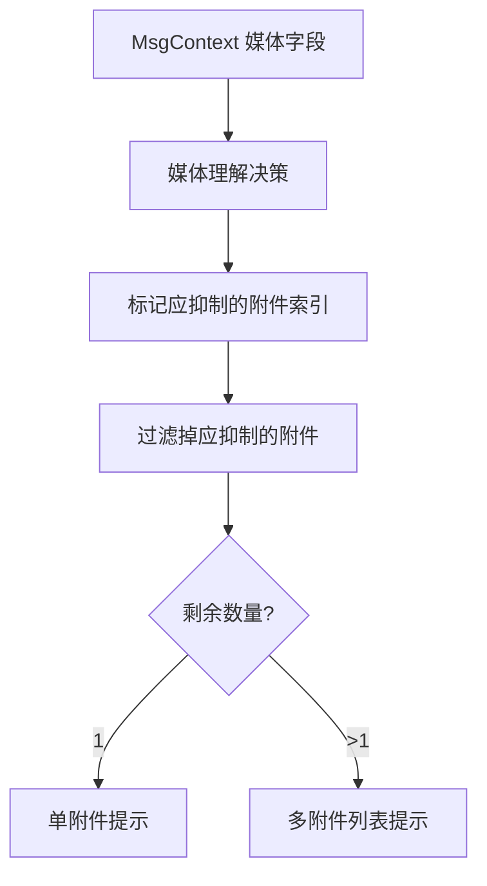

图示来源

- [src/auto-reply/media-note.ts](file://src/auto-reply/media-note.ts)

章节来源

- [src/auto-reply/media-note.ts](file://src/auto-reply/media-note.ts)

### 心跳与 ACK 规则

- 默认心跳提示：严格遵循工作区内的 HEARTBEAT.md，避免重复旧任务。
- 空内容判定：仅注释/空行时视为“有效空”，可跳过 API 调用。
- 心跳令牌剥离：支持在消息/心跳模式下剥离令牌与边缘标点，必要时整条跳过。

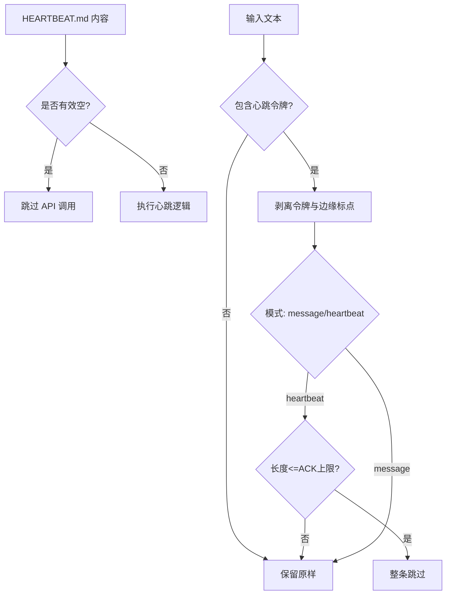

图示来源

- [src/auto-reply/heartbeat.ts](file://src/auto-reply/heartbeat.ts)

章节来源

- [src/auto-reply/heartbeat.ts](file://src/auto-reply/heartbeat.ts)

### 回复导出与能力入口

- 导出指令解析：思考/推理/提升/冗余等指令抽取。
- 执行/排队/回复标签：统一对外接口，便于上层集成。

章节来源

- [src/auto-reply/reply.ts](file://src/auto-reply/reply.ts)

## 依赖关系分析

- 命令检测依赖命令注册表与“终止触发”判定。
- 分发器依赖上下文终化、回复分发实现、打字控制器与缓冲策略。
- 思考/推理依赖模型能力清单与提供方归一化。
- 模型指令解析依赖正则与认证档位拆分工具。
- 发送策略依赖命令正文归一化。
- 信封与模板依赖时间格式化、信使标签与聊天类型。
- 状态汇总依赖用量统计、媒体理解、语音合成、通道模型覆盖等。
- 回退状态依赖最近一次尝试记录与模型引用格式化。
- 群组激活依赖命令解析与会话上下文。
- 入站去抖依赖配置与键函数。
- 媒体提示依赖媒体理解输出与转录结果。
- 心跳依赖令牌常量与正则工具。

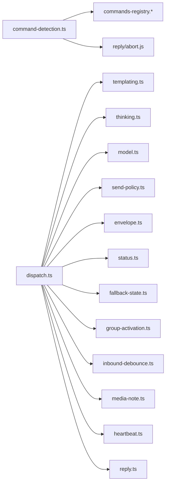

图示来源

- [src/auto-reply/command-detection.ts](file://src/auto-reply/command-detection.ts)
- [src/auto-reply/dispatch.ts](file://src/auto-reply/dispatch.ts)
- [src/auto-reply/thinking.ts](file://src/auto-reply/thinking.ts)
- [src/auto-reply/model.ts](file://src/auto-reply/model.ts)
- [src/auto-reply/send-policy.ts](file://src/auto-reply/send-policy.ts)
- [src/auto-reply/envelope.ts](file://src/auto-reply/envelope.ts)
- [src/auto-reply/status.ts](file://src/auto-reply/status.ts)
- [src/auto-reply/fallback-state.ts](file://src/auto-reply/fallback-state.ts)
- [src/auto-reply/group-activation.ts](file://src/auto-reply/group-activation.ts)
- [src/auto-reply/inbound-debounce.ts](file://src/auto-reply/inbound-debounce.ts)
- [src/auto-reply/media-note.ts](file://src/auto-reply/media-note.ts)
- [src/auto-reply/heartbeat.ts](file://src/auto-reply/heartbeat.ts)
- [src/auto-reply/reply.ts](file://src/auto-reply/reply.ts)

章节来源

- [src/auto-reply/command-detection.ts](file://src/auto-reply/command-detection.ts)
- [src/auto-reply/dispatch.ts](file://src/auto-reply/dispatch.ts)
- [src/auto-reply/thinking.ts](file://src/auto-reply/thinking.ts)
- [src/auto-reply/model.ts](file://src/auto-reply/model.ts)
- [src/auto-reply/send-policy.ts](file://src/auto-reply/send-policy.ts)
- [src/auto-reply/envelope.ts](file://src/auto-reply/envelope.ts)
- [src/auto-reply/status.ts](file://src/auto-reply/status.ts)
- [src/auto-reply/fallback-state.ts](file://src/auto-reply/fallback-state.ts)
- [src/auto-reply/group-activation.ts](file://src/auto-reply/group-activation.ts)
- [src/auto-reply/inbound-debounce.ts](file://src/auto-reply/inbound-debounce.ts)
- [src/auto-reply/media-note.ts](file://src/auto-reply/media-note.ts)
- [src/auto-reply/heartbeat.ts](file://src/auto-reply/heartbeat.ts)
- [src/auto-reply/reply.ts](file://src/auto-reply/reply.ts)

## 性能考量

- 去抖与批处理：通过入站去抖减少并发与重复处理，建议按通道/会话键合理设置去抖窗口。
- 媒体优化：音频转录成功后抑制原始音频附件，显著降低 token 使用与延迟。
- 缓冲派发：在需要打字指示或跨通道路由时启用缓冲派发，避免频繁 IO。
- 思考层级：在低算力/低成本场景下调低思考层级，必要时启用 adaptive 以动态平衡质量与成本。
- 用量与成本：结合 /status 输出的 token/缓存/成本摘要，定期评估与调优上下文与模型选择。
- 心跳节流：当 HEARTBEAT.md 有效空时跳过 API 调用，避免无效负载。

## 故障排查指南

- 命令未生效
  - 检查命令别名与大小写归一化是否正确。
  - 确认是否命中内联令牌粗检，以便提前授权。
  - 参考：命令检测与终止触发判定。
- 权限不足
  - 确认 CommandAuthorized 已在上下文中终化为 true。
  - 检查发送策略是否被 /send deny 强制拒绝。
- 回复未发送或延迟
  - 查看队列模式与去抖设置，确认是否被聚合或延后。
  - 检查缓冲派发器是否已 markComplete 并 waitForIdle。
- 媒体未显示或过多
  - 检查媒体理解决策与转录结果，确认是否被抑制。
  - 审核媒体路径/类型数组与索引一致性。
- 模型选择异常
  - 校验 /model 指令语法与认证档位拆分。
  - 关注回退状态通知，确认是否因首选模型不可用而切换。
- 群组未触发
  - 检查 /activation 设置与会话上下文。
- 心跳无效
  - 确认 HEARTBEAT.md 是否有效空，或是否剥离了心跳令牌导致整条跳过。

章节来源

- [src/auto-reply/command-detection.ts](file://src/auto-reply/command-detection.ts)
- [src/auto-reply/send-policy.ts](file://src/auto-reply/send-policy.ts)
- [src/auto-reply/inbound-debounce.ts](file://src/auto-reply/inbound-debounce.ts)
- [src/auto-reply/media-note.ts](file://src/auto-reply/media-note.ts)
- [src/auto-reply/model.ts](file://src/auto-reply/model.ts)
- [src/auto-reply/fallback-state.ts](file://src/auto-reply/fallback-state.ts)
- [src/auto-reply/group-activation.ts](file://src/auto-reply/group-activation.ts)
- [src/auto-reply/heartbeat.ts](file://src/auto-reply/heartbeat.ts)

## 结论

该自动回复体系以“命令检测—上下文—策略—派发—流式输出”为主线，辅以思考/推理控制、媒体优化、发送策略、回退通知与心跳机制，形成稳定、可观测、可扩展的回复闭环。通过合理的配置与监控（/status、/context、用量与成本），可在多渠道、多模型环境下实现高质量与低成本的自动化交互。

## 附录

### 自动回复配置要点

- 思考/推理/冗余/提升：通过命令或全局默认设置，结合模型能力与提供方特性进行权衡。
- 发送策略：/send allow/deny/inherit，按需覆盖单次发送行为。
- 群组激活：/activation mention/always，按场景选择。
- 入站去抖：按通道/键设置去抖窗口，平衡吞吐与延迟。
- 心跳：HEARTBEAT.md 内容与 ACK 上限，避免空任务与重复。

### 触发条件与响应模板

- 触发条件：控制命令、内联令牌、终止触发、群组激活模式、心跳令牌剥离后的剩余文本。
- 响应模板：使用 {{占位符}} 将上下文注入提示或回复，注意类型安全与空值处理。

### 回复规则示例

- 模型切换：/model provider/model[:profile]，支持别名与认证档位。
- 发送控制：/send allow/on 或 /send deny/off。
- 群组激活：/activation mention 或 /activation always。
- 心跳处理：HEARTBEAT.md 存在时严格遵循，有效空时跳过。

### 多轮对话管理与上下文保持

- 会话键与线程：通过 SessionKey/MessageThreadId/RootMessageId 等字段维持多轮语义连贯。
- 历史与上下文：优先将历史结构化注入提示，避免纯文本拼接带来的噪声。
- 压缩与成本：定期 compact 与评估上下文占用，避免超出模型上下文限制。

### 流式输出与去重

- 块级流式：onPartialReply/onReasoningStream/onBlockReply 支持边生成边输出。
- 去重策略：入站去抖按键聚合，避免重复处理；媒体提示抑制重复音频。
- 打字指示：按策略开启/关闭，改善用户体验。
