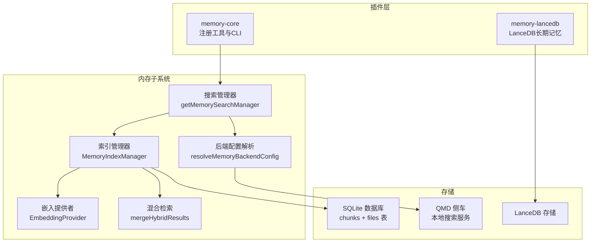
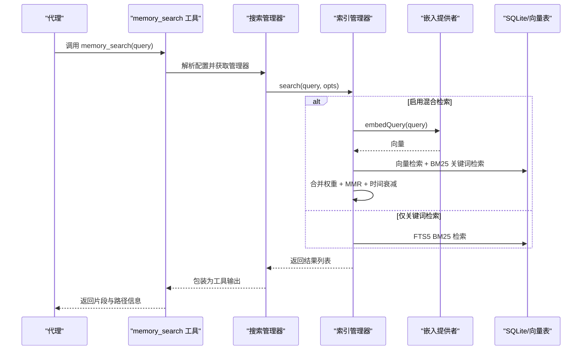
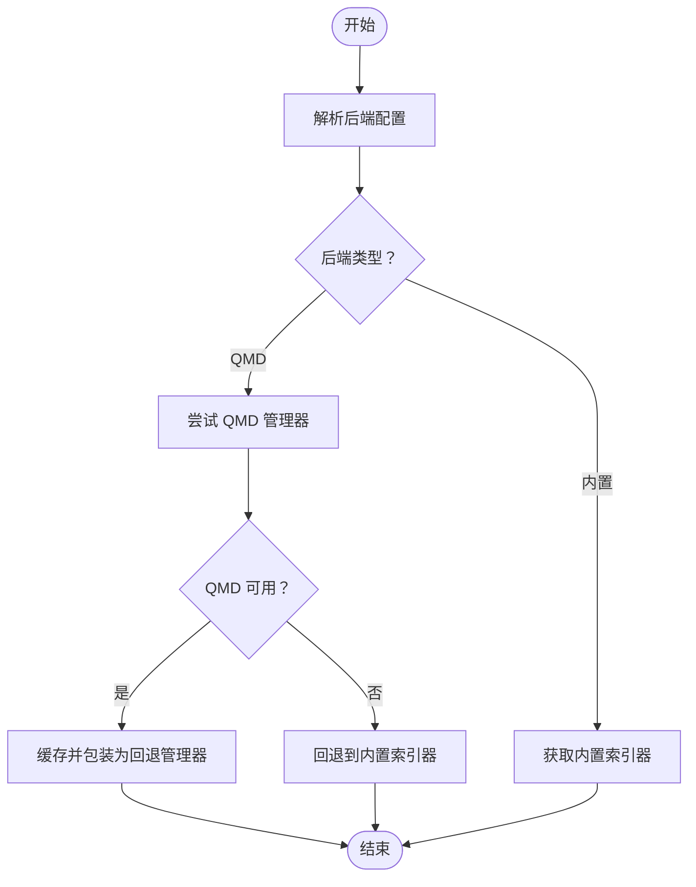
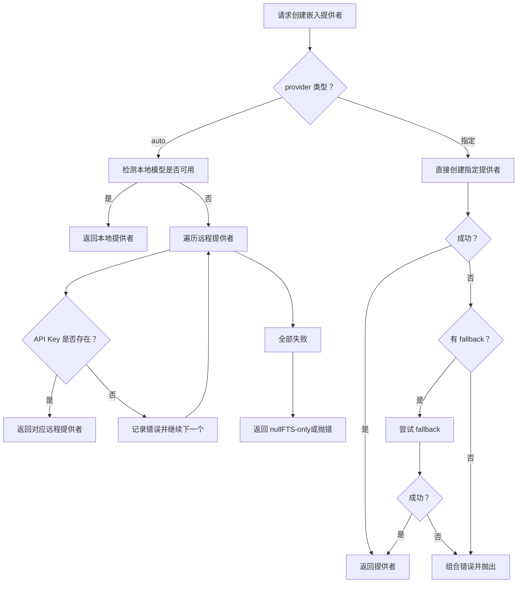
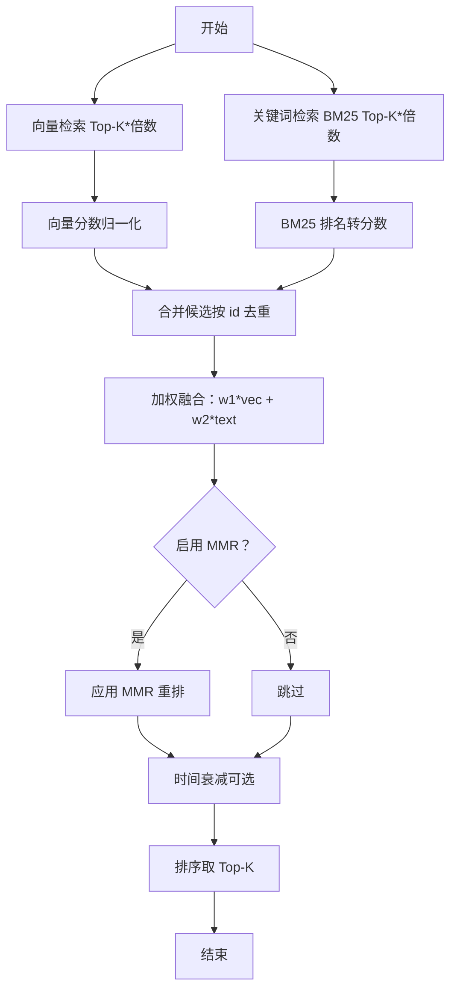
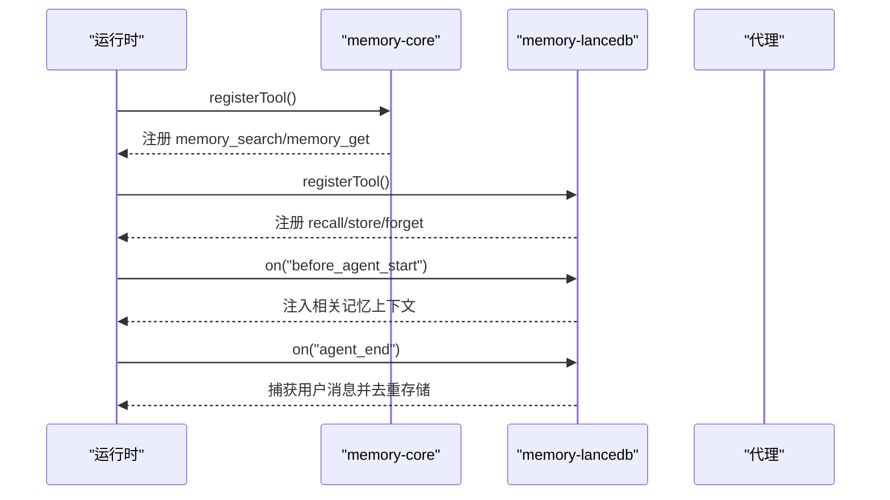
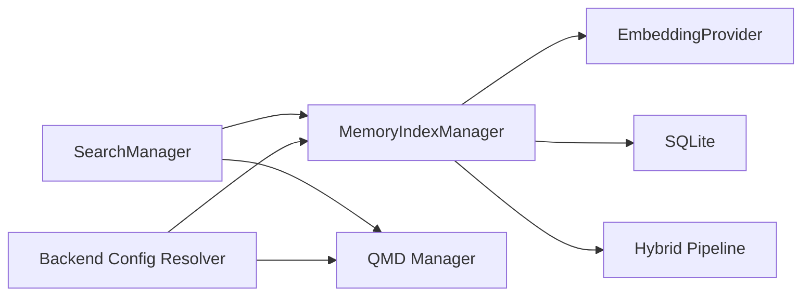

# 记忆存储系统

<cite>
**本文档引用的文件**
- [src/memory/index.ts](file://src/memory/index.ts)
- [src/memory/types.ts](file://src/memory/types.ts)
- [src/memory/search-manager.ts](file://src/memory/search-manager.ts)
- [src/memory/manager.ts](file://src/memory/manager.ts)
- [src/memory/backend-config.ts](file://src/memory/backend-config.ts)
- [src/memory/hybrid.ts](file://src/memory/hybrid.ts)
- [src/memory/embeddings.ts](file://src/memory/embeddings.ts)
- [extensions/memory-core/index.ts](file://extensions/memory-core/index.ts)
- [extensions/memory-lancedb/index.ts](file://extensions/memory-lancedb/index.ts)
- [extensions/memory-lancedb/config.ts](file://extensions/memory-lancedb/config.ts)
- [docs/concepts/memory.md](file://docs/concepts/memory.md)
- [docs/cli/memory.md](file://docs/cli/memory.md)
- [src/memory/test-manager.ts](file://src/memory/test-manager.ts)
</cite>

## 目录

1. [简介](#简介)
2. [项目结构](#项目结构)
3. [核心组件](#核心组件)
4. [架构总览](#架构总览)
5. [详细组件分析](#详细组件分析)
6. [依赖关系分析](#依赖关系分析)
7. [性能考量](#性能考量)
8. [故障排查指南](#故障排查指南)
9. [结论](#结论)
10. [附录](#附录)

## 简介

本文件系统性阐述 OpenClaw 的记忆存储体系：包括记忆的存储、检索、更新与清理机制；上下文窗口管理策略；记忆搜索算法与语义索引构建；配置项、存储格式与访问权限控制；查询示例、性能调优与容量规划；以及记忆压缩、去重策略与隐私保护机制。文档面向不同技术背景的读者，既提供高层概览也包含代码级细节与可视化图示。

## 项目结构

OpenClaw 的记忆子系统由“内置 SQLite 索引器（默认）”和“可选 QMD 后端”构成，并通过插件化扩展支持 LanceDB 长期记忆。核心模块分布如下：

- 内置内存工具与搜索管理器：对外暴露 memory_search 与 memory_get 工具，负责向量化检索、关键词检索、混合检索与结果后处理。
- 插件层：memory-core 提供默认工具注册与 CLI；memory-lancedb 提供长期记忆（LanceDB）与自动回忆/捕获能力。
- 文档与 CLI：概念文档定义工作区布局、自动刷新与向量搜索；CLI 提供状态、索引与搜索命令。



**图表来源**

- [extensions/memory-core/index.ts:1-39](file://extensions/memory-core/index.ts#L1-L39)
- [extensions/memory-lancedb/index.ts:1-679](file://extensions/memory-lancedb/index.ts#L1-L679)
- [src/memory/search-manager.ts:25-86](file://src/memory/search-manager.ts#L25-L86)
- [src/memory/manager.ts:61-238](file://src/memory/manager.ts#L61-L238)
- [src/memory/backend-config.ts:297-354](file://src/memory/backend-config.ts#L297-L354)

**章节来源**

- [docs/concepts/memory.md:1-120](file://docs/concepts/memory.md#L1-L120)
- [docs/cli/memory.md:1-67](file://docs/cli/memory.md#L1-L67)

## 核心组件

- 搜索管理器与工厂
  - getMemorySearchManager：根据配置选择内置或 QMD 后端，支持主备回退与缓存。
  - FallbackMemoryManager：在 QMD 失败时自动切换到内置索引器。
- 索引管理器 MemoryIndexManager
  - 负责数据库初始化、模式校验、文件监听与增量同步、向量/关键词检索、混合检索与后处理（MMR、时间衰减）、状态报告与关闭。
- 嵌入提供者 EmbeddingProvider
  - 支持 OpenAI、Gemini、Voyage、Mistral、Ollama 与本地 node-llama-cpp；具备自动选择与回退能力。
- 混合检索与后处理
  - 向量相似度与 BM25 关键词检索融合，支持 MMR 多样性重排与时间衰减。
- 插件接口
  - memory-core：注册 memory_search 与 memory_get 工具及 CLI。
  - memory-lancedb：提供长期记忆（LanceDB）的 recall/store/forget 工具与生命周期钩子。

**章节来源**

- [src/memory/search-manager.ts:25-102](file://src/memory/search-manager.ts#L25-L102)
- [src/memory/manager.ts:61-238](file://src/memory/manager.ts#L61-L238)
- [src/memory/embeddings.ts:166-286](file://src/memory/embeddings.ts#L166-L286)
- [src/memory/hybrid.ts:57-155](file://src/memory/hybrid.ts#L57-L155)
- [extensions/memory-core/index.ts:10-35](file://extensions/memory-core/index.ts#L10-L35)
- [extensions/memory-lancedb/index.ts:292-679](file://extensions/memory-lancedb/index.ts#L292-L679)

## 架构总览

下图展示从请求到返回的关键流程：工具调用经搜索管理器路由至具体后端，内置后端再结合嵌入提供者与 SQLite 存储执行检索，必要时进行混合检索与后处理。



**图表来源**

- [src/memory/search-manager.ts:118-139](file://src/memory/search-manager.ts#L118-L139)
- [src/memory/manager.ts:256-364](file://src/memory/manager.ts#L256-L364)
- [src/memory/hybrid.ts:57-155](file://src/memory/hybrid.ts#L57-L155)

## 详细组件分析

### 组件A：搜索管理器与回退机制

- 功能要点
  - 根据配置选择 QMD 或内置后端；QMD 成功则缓存管理器实例，失败自动回退内置索引器。
  - 对外统一 MemorySearchManager 接口，屏蔽后端差异。
- 关键流程
  - 主后端失败时记录错误、关闭主后端、移除缓存条目，随后按需创建内置回退实例。
  - status() 方法在主后端失败时合并回退状态并标注回退原因。



**图表来源**

- [src/memory/search-manager.ts:25-86](file://src/memory/search-manager.ts#L25-L86)
- [src/memory/search-manager.ts:104-246](file://src/memory/search-manager.ts#L104-L246)

**章节来源**

- [src/memory/search-manager.ts:25-102](file://src/memory/search-manager.ts#L25-L102)
- [src/memory/search-manager.ts:104-246](file://src/memory/search-manager.ts#L104-L246)

### 组件B：索引管理器与检索管线

- 数据模型与存储
  - SQLite 数据库存储 files 与 chunks 表，chunks_vec 为向量表，chunks_fts 为全文检索表。
  - 支持嵌入缓存表以避免重复计算。
- 检索流程
  - 查询预处理：清洗输入、确定候选数、构建 FTS 查询。
  - 向量检索：使用已加载的嵌入提供者生成查询向量，基于 sqlite-vec 或内存相似度计算。
  - 关键词检索：FTS5 BM25 排名转换为 0..1 分数。
  - 混合检索：加权融合向量与文本得分，应用 MMR 与时间衰减，最终排序取 Top-K。
- 同步与一致性
  - 文件系统监听与会话增量同步，支持强制同步与只读数据库恢复。
  - 提供 status() 报告文件/块数量、向量维度、FTS 状态、批处理状态等。

```mermaid
classDiagram
class MemoryIndexManager {
+search(query, opts) MemorySearchResult[]
+readFile(params) {text, path}
+status() MemoryProviderStatus
+sync(params) void
+probeEmbeddingAvailability() MemoryEmbeddingProbeResult
+probeVectorAvailability() boolean
+close() void
}
class EmbeddingProvider {
+id string
+model string
+embedQuery(text) number[]
+embedBatch(texts) number[][]
}
class FallbackMemoryManager {
+search()
+readFile()
+status()
+sync()
+probeEmbeddingAvailability()
+probeVectorAvailability()
+close()
}
MemoryIndexManager --> EmbeddingProvider : "使用"
FallbackMemoryManager --> MemoryIndexManager : "回退"
```

**图表来源**

- [src/memory/manager.ts:61-238](file://src/memory/manager.ts#L61-L238)
- [src/memory/types.ts:61-80](file://src/memory/types.ts#L61-L80)
- [src/memory/embeddings.ts:32-60](file://src/memory/embeddings.ts#L32-L60)
- [src/memory/search-manager.ts:104-246](file://src/memory/search-manager.ts#L104-L246)

**章节来源**

- [src/memory/manager.ts:256-466](file://src/memory/manager.ts#L256-L466)
- [src/memory/manager.ts:626-738](file://src/memory/manager.ts#L626-L738)

### 组件C：嵌入提供者与自动选择

- 自动选择策略
  - 当 provider 为 "auto" 时，优先本地 node-llama-cpp（若可用），否则按顺序尝试 OpenAI、Gemini、Voyage、Mistral。
  - 若所有远程提供者因缺少 API Key 而失败，则降级为 FTS-only 模式。
- 回退机制
  - 支持配置 primary/fallback provider，若 primary 失败且 fallback 可用则自动切换，并在状态中记录回退原因。
- 本地模型
  - 默认本地模型路径与下载行为；缺失依赖时提供清晰提示与替代方案。



**图表来源**

- [src/memory/embeddings.ts:166-286](file://src/memory/embeddings.ts#L166-L286)

**章节来源**

- [src/memory/embeddings.ts:166-286](file://src/memory/embeddings.ts#L166-L286)

### 组件D：混合检索与后处理

- 混合检索
  - 向量检索与 BM25 关键词检索分别产生候选集，按权重融合得分。
  - 若无 FTS 可用则仅向量检索；若无嵌入提供者则仅关键词检索。
- 后处理
  - MMR：最大化 λ×相关性 − (1−λ)×与已选结果的最大相似度，平衡多样性与相关性。
  - 时间衰减：按指数函数对旧结果打折扣，近期结果权重更高；根文件与非日期文件不衰减。
- 配置
  - 权重归一化、候选倍数、阈值放宽策略、时间半衰期、MMR λ 参数等。



**图表来源**

- [src/memory/hybrid.ts:57-155](file://src/memory/hybrid.ts#L57-L155)

**章节来源**

- [src/memory/hybrid.ts:57-155](file://src/memory/hybrid.ts#L57-L155)

### 组件E：插件与工具集成

- memory-core
  - 注册 memory_search 与 memory_get 工具；注册 CLI 子命令。
- memory-lancedb
  - 提供 recall/store/forget 工具；支持自动回忆与自动捕获；提供 CLI 子命令；生命周期钩子注入上下文与捕获对话内容。



**图表来源**

- [extensions/memory-core/index.ts:10-35](file://extensions/memory-core/index.ts#L10-L35)
- [extensions/memory-lancedb/index.ts:292-679](file://extensions/memory-lancedb/index.ts#L292-L679)

**章节来源**

- [extensions/memory-core/index.ts:10-35](file://extensions/memory-core/index.ts#L10-L35)
- [extensions/memory-lancedb/index.ts:292-679](file://extensions/memory-lancedb/index.ts#L292-L679)

## 依赖关系分析

- 组件耦合
  - MemoryIndexManager 依赖 EmbeddingProvider、SQLite 存储与混合检索模块；通过抽象接口解耦具体实现。
  - FallbackMemoryManager 作为装饰器，隔离主后端与回退后端的差异。
- 外部依赖
  - sqlite-vec 扩展用于加速向量距离查询；缺失时回退到内存相似度计算。
  - node-llama-cpp 用于本地嵌入；缺失时提供替代方案或回退。
- 配置解析
  - resolveMemoryBackendConfig 将用户配置解析为稳定的后端参数，支持 QMD 集合、更新策略、范围控制等。



**图表来源**

- [src/memory/manager.ts:61-238](file://src/memory/manager.ts#L61-L238)
- [src/memory/search-manager.ts:25-86](file://src/memory/search-manager.ts#L25-L86)
- [src/memory/backend-config.ts:297-354](file://src/memory/backend-config.ts#L297-L354)

**章节来源**

- [src/memory/manager.ts:61-238](file://src/memory/manager.ts#L61-L238)
- [src/memory/search-manager.ts:25-86](file://src/memory/search-manager.ts#L25-L86)
- [src/memory/backend-config.ts:297-354](file://src/memory/backend-config.ts#L297-L354)

## 性能考量

- 检索性能
  - 启用 sqlite-vec 可显著降低向量搜索开销；FTS5 BM25 在关键词检索上表现稳定。
  - 候选倍数与 Top-K 控制：candidateMultiplier 与 maxResults 共同决定召回规模，建议按数据体量与延迟目标调参。
- 向量维度与批处理
  - 批处理（OpenAI/Gemini/Voyage）可大幅缩短大规模索引耗时；并发与轮询间隔需结合 API 限制与资源情况设置。
- 缓存与增量
  - 嵌入缓存减少重复计算；文件监听与会话增量同步避免全量重建。
- 读写优化
  - 只读数据库场景自动重连与模式重建，确保稳定性。

[本节为通用指导，无需特定文件引用]

## 故障排查指南

- 常见问题定位
  - 嵌入不可用：检查 API Key、网络与 provider/fallback 配置；查看 status() 中的 providerUnavailableReason 与 fallback 字段。
  - QMD 不可用：确认二进制存在、SQLite 扩展可用、XDG 目录权限；查看回退日志与 lastError。
  - 只读数据库：系统会自动重连并重建连接，观察 readonlyRecovery 统计。
- 诊断命令
  - 使用 CLI memory status/--deep/--index/--json 获取详细状态与索引信息。
- 安全与权限
  - memory_get 严格限制路径，仅允许工作区内 Markdown 文件；额外路径需显式配置。

**章节来源**

- [src/memory/manager.ts:451-551](file://src/memory/manager.ts#L451-L551)
- [src/memory/manager.ts:626-738](file://src/memory/manager.ts#L626-L738)
- [docs/cli/memory.md:34-67](file://docs/cli/memory.md#L34-L67)

## 结论

OpenClaw 的记忆存储系统以“内置 SQLite + 可选 QMD”为核心，结合多提供商嵌入与混合检索策略，在准确性与性能之间取得平衡。通过插件化扩展，系统既能满足日常知识检索，也能支持长期记忆与自动化上下文注入。合理的配置与监控（状态、批处理、缓存）是保障稳定性的关键。

[本节为总结性内容，无需特定文件引用]

## 附录

### 记忆配置选项与存储格式

- 存储位置
  - 内置：每代理 SQLite 数据库，默认路径包含 agentId 占位符。
  - QMD：独立集合与索引，支持自定义路径与会话导出。
  - LanceDB：可选插件，持久化长短期记忆。
- 搜索配置
  - provider、model、remote、local、fallback、cache、query.hybrid、store.vector、extraPaths 等。
- 访问权限
  - memory_get 仅限工作区内 Markdown 文件；额外路径需在配置中显式声明。

**章节来源**

- [docs/concepts/memory.md:380-741](file://docs/concepts/memory.md#L380-L741)
- [src/memory/backend-config.ts:297-354](file://src/memory/backend-config.ts#L297-L354)
- [extensions/memory-lancedb/config.ts:92-135](file://extensions/memory-lancedb/config.ts#L92-L135)

### 上下文窗口管理与自动刷新

- 自动刷新
  - 会话开始、搜索前、定时器与文件变更触发增量同步；支持强制全量重建。
- 预压缩提醒
  - 会话接近压缩阈值时触发静默提醒，促使模型在压缩前写入持久记忆。

**章节来源**

- [docs/concepts/memory.md:52-91](file://docs/concepts/memory.md#L52-L91)
- [src/memory/manager.ts:240-254](file://src/memory/manager.ts#L240-L254)

### 记忆搜索算法与语义索引

- 索引构建
  - Markdown 文件扫描、分块（约 400 token，80 token 重叠）、嵌入生成与入库。
  - 支持额外路径与会话索引（实验性）。
- 检索算法
  - 向量检索（cosine 相似度）与 BM25 关键词检索融合；可选 MMR 与时间衰减。
- 引擎选择
  - 内置 SQLite（默认）与 QMD（实验性）；QMD 支持 BM25、向量与重排组合。

**章节来源**

- [docs/concepts/memory.md:386-451](file://docs/concepts/memory.md#L386-L451)
- [src/memory/hybrid.ts:57-155](file://src/memory/hybrid.ts#L57-L155)

### 记忆查询示例与最佳实践

- 示例命令
  - openclaw memory status、openclaw memory index --force、openclaw memory search "部署笔记"。
- 最佳实践
  - 合理设置 maxResults/minScore；在每日笔记较多时启用时间衰减；对近似重复内容启用 MMR。
  - 使用 extraPaths 索引团队文档；在只读工作区禁用自动刷新。

**章节来源**

- [docs/cli/memory.md:19-67](file://docs/cli/memory.md#L19-L67)
- [docs/concepts/memory.md:579-615](file://docs/concepts/memory.md#L579-L615)

### 性能调优与容量规划

- 调优方向
  - 候选倍数、Top-K、向量维度、批处理并发与轮询间隔、缓存大小。
- 容量规划
  - 评估 Markdown 文件数量与大小、会话增量频率、向量维度与索引规模；预留磁盘空间与内存缓存。

**章节来源**

- [docs/concepts/memory.md:616-741](file://docs/concepts/memory.md#L616-L741)

### 压缩、去重与隐私保护

- 去重策略
  - 向量相似度阈值（如 0.95）检测近似重复；LanceDB 插件在存储前检查相似项。
- 压缩与清理
  - 会话压缩前的“预压缩提醒”促使模型写入持久记忆；定期清理过期会话与冗余索引。
- 隐私保护
  - 会话日志可选择索引与导出；敏感信息应避免明文存储；访问权限严格限制在工作区内。

**章节来源**

- [extensions/memory-lancedb/index.ts:391-407](file://extensions/memory-lancedb/index.ts#L391-L407)
- [docs/concepts/memory.md:635-675](file://docs/concepts/memory.md#L635-L675)
