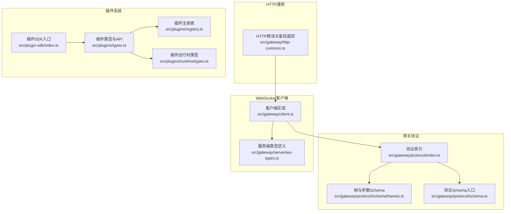
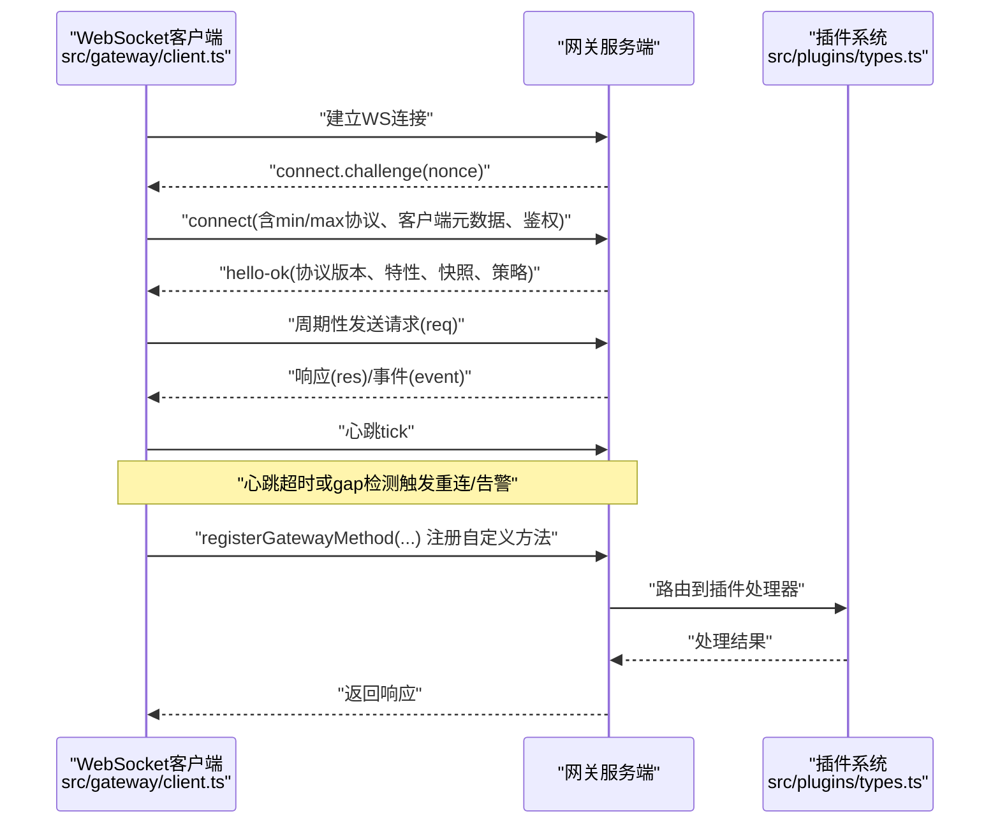
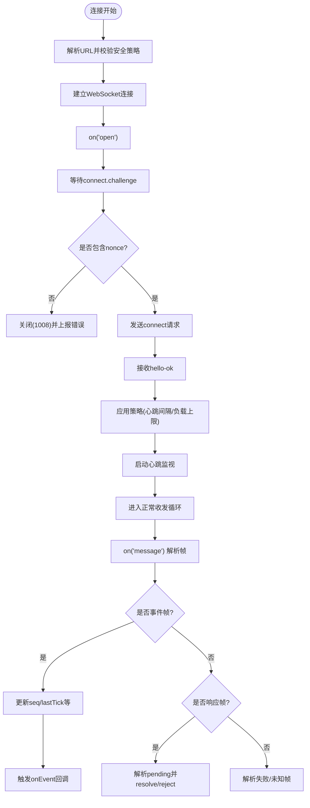
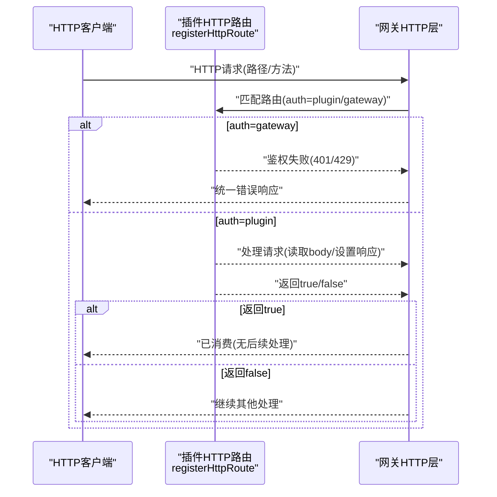
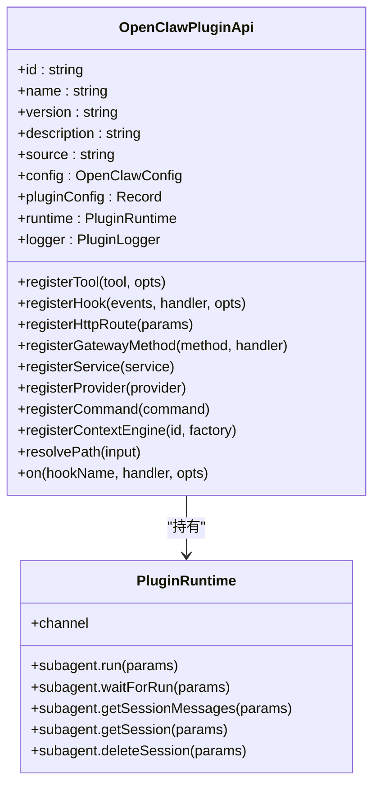
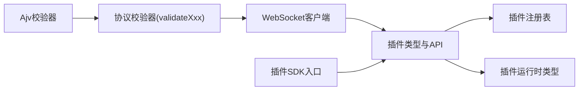

# API参考

<cite>
**本文引用的文件**
- [src/gateway/protocol/index.ts](file://src/gateway/protocol/index.ts)
- [src/gateway/protocol/schema/frames.ts](file://src/gateway/protocol/schema/frames.ts)
- [src/gateway/protocol/schema.ts](file://src/gateway/protocol/schema.ts)
- [src/gateway/client.ts](file://src/gateway/client.ts)
- [src/gateway/server/ws-types.ts](file://src/gateway/server/ws-types.ts)
- [src/gateway/http-common.ts](file://src/gateway/http-common.ts)
- [src/plugins/types.ts](file://src/plugins/types.ts)
- [src/plugins/runtime/types.ts](file://src/plugins/runtime/types.ts)
- [src/plugin-sdk/index.ts](file://src/plugin-sdk/index.ts)
- [src/plugins/registry.ts](file://src/plugins/registry.ts)
- [scripts/e2e/plugins-docker.sh](file://scripts/e2e/plugins-docker.sh)
- [apps/macos/Tests/OpenClawIPCTests/GatewayWebSocketTestSupport.swift](file://apps/macos/Tests/OpenClawIPCTests/GatewayWebSocketTestSupport.swift)
- [apps/shared/OpenClawKit/Tests/OpenClawKitTests/GatewayNodeSessionTests.swift](file://apps/shared/OpenClawKit/Tests/OpenClawKitTests/GatewayNodeSessionTests.swift)
- [src/agents/openai-ws-connection.test.ts](file://src/agents/openai-ws-connection.test.ts)
</cite>

## 目录

1. [简介](#简介)
2. [项目结构](#项目结构)
3. [核心组件](#核心组件)
4. [架构总览](#架构总览)
5. [详细组件分析](#详细组件分析)
6. [依赖关系分析](#依赖关系分析)
7. [性能考量](#性能考量)
8. [故障排查指南](#故障排查指南)
9. [结论](#结论)
10. [附录](#附录)

## 简介

本文件为 OpenClaw 的 API 参考文档，覆盖以下三类接口规范：

- WebSocket API：网关客户端与服务端之间的实时通信协议，包括连接握手、帧格式、事件类型与心跳检测。
- HTTP API：网关侧的通用 HTTP 错误处理与鉴权返回约定，以及插件可注册的 HTTP 路由规范。
- 插件 API：插件开发者的扩展接口、回调机制、生命周期钩子、运行时能力与集成模式。

文档同时提供版本信息、迁移指南与向后兼容性说明，帮助开发者在不同版本间平滑演进。

## 项目结构

围绕 API 的关键模块分布如下：

- 网关协议与帧格式：位于 src/gateway/protocol，定义了连接参数、帧结构、校验器与协议版本。
- 网关 WebSocket 客户端：位于 src/gateway/client.ts，负责连接建立、鉴权挑战、消息收发与重连策略。
- 网关 WebSocket 类型：位于 src/gateway/server/ws-types.ts，描述服务端侧客户端会话上下文。
- HTTP 通用错误与鉴权返回：位于 src/gateway/http-common.ts，统一 400/401/429 等响应格式。
- 插件系统类型与注册表：位于 src/plugins/types.ts、src/plugins/registry.ts，定义插件 API、钩子、HTTP 路由与服务等。
- 插件运行时类型：位于 src/plugins/runtime/types.ts，定义子代理运行、等待与会话查询等能力。
- 插件 SDK 入口：位于 src/plugin-sdk/index.ts，导出插件可用的工具与适配器集合。
- 示例与测试：包括 macOS/iOS 测试中对“hello-ok”帧的构造与解析示例，以及插件安装与方法注册的端到端脚本。

**图表来源**

- [src/gateway/protocol/index.ts:1-673](file://src/gateway/protocol/index.ts#L1-L673)
- [src/gateway/protocol/schema/frames.ts:1-164](file://src/gateway/protocol/schema/frames.ts#L1-L164)
- [src/gateway/protocol/schema.ts:1-19](file://src/gateway/protocol/schema.ts#L1-L19)
- [src/gateway/client.ts:1-674](file://src/gateway/client.ts#L1-L674)
- [src/gateway/server/ws-types.ts:1-14](file://src/gateway/server/ws-types.ts#L1-L14)
- [src/gateway/http-common.ts:36-71](file://src/gateway/http-common.ts#L36-L71)
- [src/plugins/types.ts:1-893](file://src/plugins/types.ts#L1-L893)
- [src/plugins/registry.ts:46-100](file://src/plugins/registry.ts#L46-L100)
- [src/plugins/runtime/types.ts:1-64](file://src/plugins/runtime/types.ts#L1-L64)
- [src/plugin-sdk/index.ts:1-826](file://src/plugin-sdk/index.ts#L1-L826)

**章节来源**

- [src/gateway/protocol/index.ts:1-673](file://src/gateway/protocol/index.ts#L1-L673)
- [src/gateway/client.ts:1-674](file://src/gateway/client.ts#L1-L674)
- [src/gateway/http-common.ts:36-71](file://src/gateway/http-common.ts#L36-L71)
- [src/plugins/types.ts:1-893](file://src/plugins/types.ts#L1-L893)
- [src/plugin-sdk/index.ts:1-826](file://src/plugin-sdk/index.ts#L1-L826)

## 核心组件

- 协议与帧格式
  - 连接参数 ConnectParams：包含最小/最大协议版本、客户端元数据、权限、角色、作用域、设备签名与可选鉴权信息。
  - 帧类型：请求帧 req、响应帧 res、事件帧 event；并有 hello-ok 响应帧与错误结构体。
  - 校验器：基于 Ajv 的 validateXxx 函数，用于请求/响应/事件帧与各业务参数的结构校验。
  - 协议版本：PROTOCOL_VERSION 常量贯穿客户端与协议层。
- WebSocket 客户端
  - 连接流程：建立 WS 连接 → 接收 connect.challenge → 发送 connect 请求 → 成功后接收 hello-ok → 启动心跳监控。
  - 事件处理：解析事件帧，维护序列号与 gap 检测，记录最近 tick 时间。
  - 错误与重连：连接失败、鉴权失败、TLS 指纹不匹配、设备令牌异常等场景下的错误码与重连策略。
- HTTP 通用
  - 统一错误响应：400（无效请求）、401（未授权）、405（方法不允许）、429（限流），并支持 Retry-After 头。
- 插件系统
  - 插件 API：registerTool、registerHook、registerHttpRoute、registerGatewayMethod、registerService、registerProvider、registerCommand、registerContextEngine 等。
  - 生命周期钩子：覆盖模型解析、提示构建、消息收发、工具调用、会话开始/结束、子代理生命周期等。
  - 运行时能力：子代理运行/等待/获取会话消息/删除会话，通道适配器等。
  - 注册表：管理工具、CLI、HTTP 路由、通道、提供方、钩子、服务、命令等注册项。

**章节来源**

- [src/gateway/protocol/schema/frames.ts:20-164](file://src/gateway/protocol/schema/frames.ts#L20-L164)
- [src/gateway/protocol/index.ts:259-458](file://src/gateway/protocol/index.ts#L259-L458)
- [src/gateway/client.ts:109-674](file://src/gateway/client.ts#L109-L674)
- [src/gateway/http-common.ts:36-71](file://src/gateway/http-common.ts#L36-L71)
- [src/plugins/types.ts:248-306](file://src/plugins/types.ts#L248-L306)
- [src/plugins/runtime/types.ts:51-63](file://src/plugins/runtime/types.ts#L51-L63)
- [src/plugins/registry.ts:46-100](file://src/plugins/registry.ts#L46-L100)

## 架构总览

下图展示客户端、网关与插件之间的交互关系与数据流。

**图表来源**

- [src/gateway/client.ts:134-415](file://src/gateway/client.ts#L134-L415)
- [src/gateway/protocol/schema/frames.ts:20-112](file://src/gateway/protocol/schema/frames.ts#L20-L112)
- [src/plugins/types.ts:282-287](file://src/plugins/types.ts#L282-L287)

## 详细组件分析

### WebSocket API 规范

- 连接处理
  - 安全要求：仅允许 wss:// 或本地回环的 ws://（可通过环境变量放宽限制）。
  - TLS 指纹校验：可选指纹校验，避免中间人攻击。
  - 鉴权挑战：服务端下发 nonce，客户端在 connect 中携带签名与凭据。
  - 设备令牌：支持持久化的设备令牌缓存与重试策略。
  - 心跳与空闲检测：根据策略设置 tick 间隔，超过两倍阈值将主动关闭。
- 帧格式
  - 请求帧 req：包含 type、id、method、params。
  - 响应帧 res：包含 type、id、ok、payload 或 error。
  - 事件帧 event：包含 type、event、payload、可选 seq 与 stateVersion。
  - hello-ok：握手成功后的初始化帧，包含协议版本、特性列表、快照、策略与可选鉴权信息。
- 事件类型
  - connect.challenge：服务端发起的鉴权挑战。
  - tick：心跳事件，用于检测连接活性。
  - shutdown：服务端通知关闭与重启预期时间。
- 实时交互模式
  - 客户端在收到事件帧后更新内部状态（如 seq、lastTick），并触发上层回调。
  - 对于 expectFinal 的请求，响应中 status 为 accepted 时不立即 resolve，直到最终响应到达。

**图表来源**

- [src/gateway/client.ts:134-251](file://src/gateway/client.ts#L134-L251)
- [src/gateway/client.ts:497-554](file://src/gateway/client.ts#L497-L554)
- [src/gateway/protocol/schema/frames.ts:125-155](file://src/gateway/protocol/schema/frames.ts#L125-L155)

**章节来源**

- [src/gateway/client.ts:134-415](file://src/gateway/client.ts#L134-L415)
- [src/gateway/protocol/schema/frames.ts:20-164](file://src/gateway/protocol/schema/frames.ts#L20-L164)
- [src/gateway/server/ws-types.ts:4-13](file://src/gateway/server/ws-types.ts#L4-L13)
- [apps/macos/Tests/OpenClawIPCTests/GatewayWebSocketTestSupport.swift:31-53](file://apps/macos/Tests/OpenClawIPCTests/GatewayWebSocketTestSupport.swift#L31-L53)
- [apps/shared/OpenClawKit/Tests/OpenClawKitTests/GatewayNodeSessionTests.swift:104-138](file://apps/shared/OpenClawKit/Tests/OpenClawKitTests/GatewayNodeSessionTests.swift#L104-L138)
- [src/agents/openai-ws-connection.test.ts:617-648](file://src/agents/openai-ws-connection.test.ts#L617-L648)

### HTTP API 规范

- 端点与方法
  - 插件可注册 HTTP 路由，支持 exact/prefix 匹配与替换现有路由选项。
  - 认证方式：支持 gateway 与 plugin 两种鉴权模式，具体取决于路由注册时的 auth 字段。
- 请求/响应模式
  - 统一使用 Node.js http.IncomingMessage 与 ServerResponse。
  - 插件路由处理器返回 boolean | void，true 表示已处理该请求。
- 错误处理
  - 400：sendInvalidRequest，返回 invalid_request_error。
  - 401：sendUnauthorized，返回 unauthorized。
  - 405：sendMethodNotAllowed，返回 Method Not Allowed 并设置 Allow 头。
  - 429：sendRateLimited，返回 rate_limited，并设置 Retry-After。
  - 网关鉴权失败：sendGatewayAuthFailure，根据结果决定是否限流。
- 示例
  - 插件通过 registerHttpRoute 注册路由，handler 内部可读取请求体、设置响应头与状态码、返回 true/false 表示消费请求。

**图表来源**

- [src/plugins/types.ts:208-219](file://src/plugins/types.ts#L208-L219)
- [src/gateway/http-common.ts:36-71](file://src/gateway/http-common.ts#L36-L71)

**章节来源**

- [src/plugins/types.ts:208-219](file://src/plugins/types.ts#L208-L219)
- [src/gateway/http-common.ts:36-71](file://src/gateway/http-common.ts#L36-L71)

### 插件 API 规范

- 扩展接口
  - registerTool：注册工具工厂或工具数组，支持可选工具。
  - registerHook：注册生命周期钩子，支持优先级与描述。
  - registerHttpRoute：注册 HTTP 路由，支持 exact/prefix 匹配与替换。
  - registerGatewayMethod：注册网关方法，供客户端通过 request 调用。
  - registerService：注册后台服务，支持 start/stop。
  - registerProvider：注册提供方（模型/鉴权等）。
  - registerCommand：注册简单命令（绕过 LLM），先于内置命令与代理调用。
  - registerContextEngine：注册上下文引擎（独占槽位）。
- 回调机制与钩子
  - 覆盖模型解析、提示构建、消息收发、工具调用、会话生命周期、子代理生命周期、网关启停等。
  - 提供事件对象与上下文对象，支持修改/阻断/取消等操作。
- 集成模式
  - 插件通过 openclaw.plugin.json 声明 id、配置 Schema 等。
  - 支持从 tgz、本地目录、file: 规范等多种方式安装与加载。
  - 安装后，插件被加载并注册其网关方法，客户端可直接调用。

**图表来源**

- [src/plugins/types.ts:263-306](file://src/plugins/types.ts#L263-L306)
- [src/plugins/runtime/types.ts:51-63](file://src/plugins/runtime/types.ts#L51-L63)

**章节来源**

- [src/plugins/types.ts:248-306](file://src/plugins/types.ts#L248-L306)
- [src/plugins/runtime/types.ts:1-64](file://src/plugins/runtime/types.ts#L1-L64)
- [src/plugin-sdk/index.ts:1-826](file://src/plugin-sdk/index.ts#L1-L826)
- [src/plugins/registry.ts:46-100](file://src/plugins/registry.ts#L46-L100)
- [scripts/e2e/plugins-docker.sh:79-224](file://scripts/e2e/plugins-docker.sh#L79-L224)

## 依赖关系分析

- 协议层依赖 Ajv 进行结构校验，validateXxx 函数贯穿请求/响应/事件与各业务参数。
- 客户端依赖协议层提供的校验器与常量，确保帧格式与参数合法。
- 插件系统通过 OpenClawPluginApi 暴露统一能力，插件注册表管理各类注册项。
- 插件 SDK 对外提供工具与适配器，简化插件开发。

**图表来源**

- [src/gateway/protocol/index.ts:253-423](file://src/gateway/protocol/index.ts#L253-L423)
- [src/gateway/client.ts:33-41](file://src/gateway/client.ts#L33-L41)
- [src/plugins/types.ts:1-18](file://src/plugins/types.ts#L1-L18)
- [src/plugins/registry.ts:46-100](file://src/plugins/registry.ts#L46-L100)
- [src/plugin-sdk/index.ts:1-826](file://src/plugin-sdk/index.ts#L1-L826)

**章节来源**

- [src/gateway/protocol/index.ts:253-423](file://src/gateway/protocol/index.ts#L253-L423)
- [src/gateway/client.ts:33-41](file://src/gateway/client.ts#L33-L41)
- [src/plugins/types.ts:1-18](file://src/plugins/types.ts#L1-L18)
- [src/plugin-sdk/index.ts:1-826](file://src/plugin-sdk/index.ts#L1-L826)

## 性能考量

- 心跳与空闲检测：客户端根据策略设置 tick 间隔，超过阈值自动关闭，避免资源占用。
- 序列号与 gap 检测：维护 lastSeq，发现 gap 时触发 onGap 回调，便于上层诊断丢包。
- 负载与缓冲：策略帧包含 maxPayload 与 maxBufferedBytes，客户端在连接时设置 maxPayload，避免过大消息导致内存压力。
- 重连退避：连接失败时采用指数退避，上限不超过固定值，降低风暴效应。

**章节来源**

- [src/gateway/client.ts:123-125](file://src/gateway/client.ts#L123-L125)
- [src/gateway/client.ts:514-520](file://src/gateway/client.ts#L514-L520)
- [src/gateway/client.ts:584-587](file://src/gateway/client.ts#L584-L587)
- [src/gateway/protocol/schema/frames.ts:102-109](file://src/gateway/protocol/schema/frames.ts#L102-L109)

## 故障排查指南

- WebSocket 连接失败
  - 安全策略：确认使用 wss:// 或本地回环 ws://（必要时设置环境变量）。
  - TLS 指纹：若启用指纹校验，需确保证书指纹匹配。
  - 鉴权挑战：服务端必须返回 nonce，否则客户端会关闭并报告错误。
  - 设备令牌：当出现设备令牌不匹配且满足条件时，客户端会清除缓存令牌并提示重试。
- 心跳与空闲
  - 若 lastTick 与当前时间差超过两倍 tickIntervalMs，客户端会以特定代码关闭连接。
- HTTP 错误
  - 400：检查请求体与参数结构，遵循统一错误格式。
  - 401/429：检查鉴权与限流策略，必要时增加重试间隔。
- 插件安装与方法注册
  - 使用脚本验证插件安装与方法注册是否生效，确保 status 为 loaded 且包含期望的 gateway 方法。

**章节来源**

- [src/gateway/client.ts:144-168](file://src/gateway/client.ts#L144-L168)
- [src/gateway/client.ts:170-196](file://src/gateway/client.ts#L170-L196)
- [src/gateway/client.ts:502-512](file://src/gateway/client.ts#L502-L512)
- [src/gateway/client.ts:614-617](file://src/gateway/client.ts#L614-L617)
- [src/gateway/http-common.ts:36-71](file://src/gateway/http-common.ts#L36-L71)
- [scripts/e2e/plugins-docker.sh:79-224](file://scripts/e2e/plugins-docker.sh#L79-L224)

## 结论

本文档系统梳理了 OpenClaw 的 WebSocket API、HTTP API 与插件 API 的接口规范与实现要点。通过协议层的严格校验、客户端的心跳与重连策略、HTTP 层的统一错误处理以及插件系统的丰富扩展能力，OpenClaw 为多渠道消息与智能代理提供了稳定、可扩展的基础设施。建议在开发与集成过程中遵循本文档的版本与兼容性说明，确保平滑升级与长期维护。

## 附录

- 版本信息
  - 协议版本：PROTOCOL_VERSION（常量），客户端与协议层共同使用。
  - 插件 SDK：语义化版本控制，随发布版本更新。
  - 运行时：按核心版本进行版本控制，提供 api.runtime.version。
- 迁移指南（分阶段、安全）
  - 引入 openclaw/plugin-sdk，新增 api.runtime 并保留现有导入（带弃用警告）。
  - 清理桥接代码，逐步迁移到 SDK + 运行时。
  - 强制执行：禁止 extensions/** 从 src/** 导入；增加 SDK/运行时版本兼容性检查。
- 向后兼容性
  - 插件声明所需运行时版本范围（例如 openclawRuntime: ">=YYYY.M.D"）。
  - 保持请求/响应帧字段稳定，新增字段为可选，避免破坏既有客户端。

**章节来源**

- [src/gateway/protocol/index.ts:173-173](file://src/gateway/protocol/index.ts#L173-L173)
- [src/plugins/types.ts:190-192](file://src/plugins/types.ts#L190-L192)
- [docs/refactor/plugin-sdk.md:154-199](file://docs/refactor/plugin-sdk.md#L154-L199)
