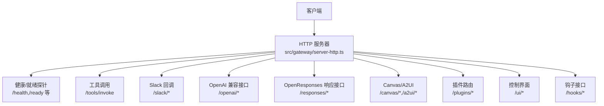
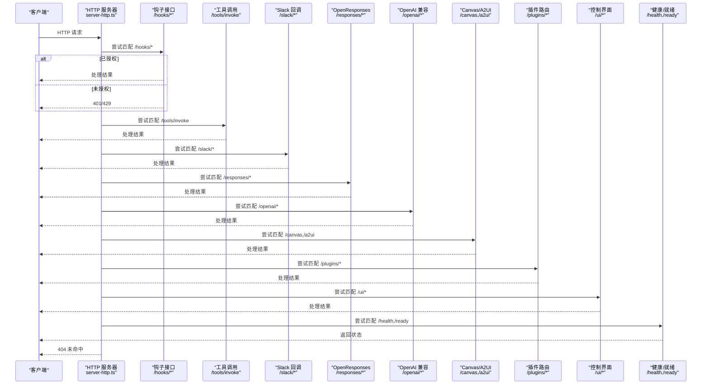
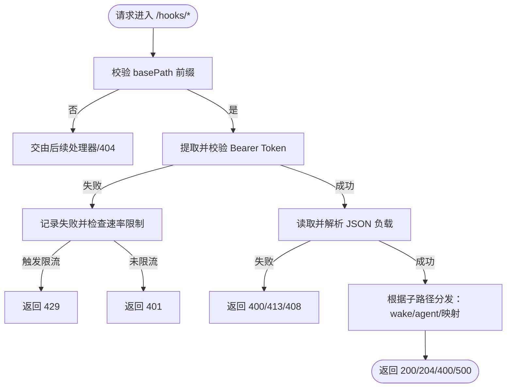
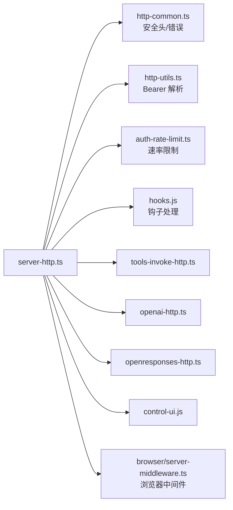

# HTTP API

<cite>
**本文引用的文件**
- [src/gateway/server-http.ts](file://src/gateway/server-http.ts)
- [src/gateway/server-methods/health.ts](file://src/gateway/server-methods/health.ts)
- [src/gateway/auth-rate-limit.ts](file://src/gateway/auth-rate-limit.ts)
- [src/gateway/http-common.ts](file://src/gateway/http-common.ts)
- [src/gateway/http-utils.ts](file://src/gateway/http-utils.ts)
- [src/gateway/tools-invoke-http.ts](file://src/gateway/tools-invoke-http.ts)
- [src/gateway/openai-http.ts](file://src/gateway/openai-http.ts)
- [src/gateway/openresponses-http.ts](file://src/gateway/openresponses-http.ts)
- [src/gateway/hooks.js](file://src/gateway/hooks.js)
- [src/gateway/control-ui.js](file://src/gateway/control-ui.js)
- [src/browser/http-auth.ts](file://src/browser/http-auth.ts)
- [src/browser/server-middleware.ts](file://src/browser/server-middleware.ts)
- [src/config/legacy-migrate.test.ts](file://src/config/legacy-migrate.test.ts)
- [docs/zh-CN/gateway/openresponses-http-api.md](file://docs/zh-CN/gateway/openresponses-http-api.md)
- [docs/zh-CN/gateway/configuration.md](file://docs/zh-CN/gateway/configuration.md)
- [src/gateway/server-http.test-harness.ts](file://src/gateway/server-http.test-harness.ts)
</cite>

## 目录

1. [简介](#简介)
2. [项目结构](#项目结构)
3. [核心组件](#核心组件)
4. [架构总览](#架构总览)
5. [详细组件分析](#详细组件分析)
6. [依赖关系分析](#依赖关系分析)
7. [性能与限流](#性能与限流)
8. [故障排查指南](#故障排查指南)
9. [结论](#结论)
10. [附录](#附录)

## 简介

本文件面向 OpenClaw 的 HTTP API，系统性梳理网关内置的 RESTful 与专用 HTTP 接口，覆盖控制界面 API、健康检查端点、配置管理接口、系统状态查询、工具调用接口、OpenAI 兼容接口、OpenResponses 响应接口以及 Canvas/A2UI 相关路由。文档同时说明认证方式、CORS/跨域策略、速率限制、安全头、错误响应格式与状态码约定，并给出端到端调用流程与时序图。

## 项目结构

OpenClaw 的 HTTP API 主要由“网关 HTTP 服务器”统一调度，按路径与功能拆分为多个子处理器：

- 健康与就绪探针：/health、/healthz、/ready、/readyz
- 工具调用：/tools/invoke
- Slack 回调：/slack/\*
- OpenAI 兼容接口：/openai/\*
- OpenResponses 响应接口：/responses/\*
- Canvas/A2UI：/a2ui/_、/canvas/_
- 插件路由：/plugins/\*
- 控制界面：/ui/\*（受 basePath 控制）
- 钩子接口：/hooks/\*（需令牌）

图表来源

- [src/gateway/server-http.ts:612-786](file://src/gateway/server-http.ts#L612-L786)

章节来源

- [src/gateway/server-http.ts:612-786](file://src/gateway/server-http.ts#L612-L786)

## 核心组件

- HTTP 服务器与请求分发：负责统一设置安全头、解析路径、按优先级执行各模块处理器。
- 健康与就绪探针：支持 /health、/healthz（存活）、/ready、/readyz（就绪），就绪详情对本地直连或授权访问可见。
- 工具调用接口：统一入口 /tools/invoke，按配置与鉴权策略进行处理。
- OpenAI 兼容接口：/openai/chat/completions 等，按配置启用。
- OpenResponses 响应接口：/responses/\*，支持文件/图片限制与 SSE 流式输出。
- Canvas/A2UI：Canvas 能力 URL 规范化与鉴权、A2UI 请求处理。
- 插件路由：/plugins/\*，支持网关级鉴权强制策略与路径上下文解析。
- 控制界面：/ui/\*，受 basePath 控制，提供头像与静态资源。
- 钩子接口：/hooks/\*，基于 basePath，要求 Bearer 令牌，支持映射与代理。

章节来源

- [src/gateway/server-http.ts:612-786](file://src/gateway/server-http.ts#L612-L786)
- [src/gateway/server-methods/health.ts:10-37](file://src/gateway/server-methods/health.ts#L10-L37)

## 架构总览

下图展示 HTTP 请求从进入网关到各处理器的流转顺序与鉴权/速率限制策略：

图表来源

- [src/gateway/server-http.ts:612-786](file://src/gateway/server-http.ts#L612-L786)

## 详细组件分析

### 健康检查与就绪探针

- 端点
  - GET /health, /healthz：返回存活状态
  - GET /ready, /readyz：返回就绪状态；若开启就绪检查且调用方满足条件，可返回详细信息
- 方法与路径
  - 方法：仅 GET/HEAD
  - 响应：JSON；就绪详情包含 ready、failing、uptimeMs 等（视权限）
- 认证与访问控制
  - 本地直连或具备有效 Bearer Token 的请求可获取详细就绪信息
- 状态码
  - 存活：200
  - 就绪：200（就绪）或 503（未就绪）
  - 其他：405（方法不允许）

章节来源

- [src/gateway/server-http.ts:184-236](file://src/gateway/server-http.ts#L184-L236)
- [src/gateway/server-http.ts:160-182](file://src/gateway/server-http.ts#L160-L182)

### 工具调用接口 /tools/invoke

- 功能
  - 统一入口，按配置与鉴权策略处理工具调用请求
- 认证
  - 使用网关鉴权策略（Bearer Token 或 Basic 密码等，取决于配置）
- 速率限制
  - 受统一鉴权速率限制器保护
- 错误与响应
  - 成功：200，返回工具执行结果
  - 失败：400/401/429/500 等，按错误类型返回相应状态码

章节来源

- [src/gateway/server-http.ts:644-653](file://src/gateway/server-http.ts#L644-L653)
- [src/gateway/tools-invoke-http.ts](file://src/gateway/tools-invoke-http.ts)

### OpenAI 兼容接口 /openai/\*

- 功能
  - 提供 OpenAI 风格的聊天补全等接口（按配置启用）
- 认证
  - 使用网关鉴权策略
- 速率限制
  - 受统一鉴权速率限制器保护
- 错误与响应
  - 成功：200，返回兼容格式
  - 失败：400/401/429/500 等

章节来源

- [src/gateway/server-http.ts:672-684](file://src/gateway/server-http.ts#L672-L684)
- [src/gateway/openai-http.ts](file://src/gateway/openai-http.ts)

### OpenResponses 响应接口 /responses/\*

- 功能
  - 支持文件与图片上传限制、SSE 流式输出等
- 配置项（节选）
  - responses.enabled、maxBodyBytes、files._、images._
- SSE
  - Content-Type: text/event-stream
  - 事件行：event: <type>、data: <json>
  - 结束：data: [DONE]
- 认证与速率限制
  - 使用网关鉴权策略与速率限制器

章节来源

- [src/gateway/server-http.ts:659-671](file://src/gateway/server-http.ts#L659-L671)
- [src/gateway/openresponses-http.ts](file://src/gateway/openresponses-http.ts)
- [docs/zh-CN/gateway/openresponses-http-api.md:191-257](file://docs/zh-CN/gateway/openresponses-http-api.md#L191-L257)

### Canvas/A2UI 接口

- 路径
  - /a2ui/_、/canvas/_
- 能力与鉴权
  - Canvas 能力 URL 规范化与鉴权，WebSocket 升级路径也受控
- A2UI
  - 专门处理 A2UI 请求

章节来源

- [src/gateway/server-http.ts:685-717](file://src/gateway/server-http.ts#L685-L717)
- [src/gateway/server-http.ts:11-12](file://src/gateway/server-http.ts#L11-L12)

### 插件路由 /plugins/\*

- 路由匹配
  - 基于路径上下文解析，支持强制网关鉴权策略
- 鉴权
  - 对受保护路径强制执行网关鉴权
- 优先级
  - 明确注册的插件端点优先于控制界面 SPA 捕获

章节来源

- [src/gateway/server-http.ts:718-735](file://src/gateway/server-http.ts#L718-L735)
- [src/gateway/server-http.ts:297-346](file://src/gateway/server-http.ts#L297-L346)

### 控制界面 /ui/\*

- 路径
  - 受 basePath 控制，默认 /ui
- 能力
  - 提供头像与静态资源服务
- 安全
  - 与网关鉴权策略一致

章节来源

- [src/gateway/server-http.ts:737-755](file://src/gateway/server-http.ts#L737-L755)
- [src/gateway/control-ui.js](file://src/gateway/control-ui.js)

### 钩子接口 /hooks/\*

- 基础路径
  - 由配置决定 basePath
- 认证
  - 必须通过 Authorization: Bearer <token> 或 X-OpenClaw-Token（不支持 query token）
- 速率限制
  - 钩子鉴权失败将触发速率限制，多次失败返回 429
- 支持动作
  - wake：触发唤醒
  - agent：派发给指定 Agent
  - 映射：根据映射规则转换为 wake/agent 并执行
- 错误与响应
  - 400：参数/负载错误
  - 401：未授权
  - 404：未找到
  - 413/408：请求过大/超时
  - 429：速率限制
  - 500：映射失败

图表来源

- [src/gateway/server-http.ts:348-564](file://src/gateway/server-http.ts#L348-L564)
- [src/gateway/hooks.js](file://src/gateway/hooks.js)

章节来源

- [src/gateway/server-http.ts:348-564](file://src/gateway/server-http.ts#L348-L564)

### 系统状态查询与健康 API

- 健康接口
  - 方法：GET /health
  - 参数：probe=true/false（是否强制探测）
  - 响应：缓存控制、快照或后台刷新
- 状态接口
  - 方法：GET /status
  - 权限：operator.admin 可见敏感信息
  - 响应：系统状态摘要

章节来源

- [src/gateway/server-methods/health.ts:10-37](file://src/gateway/server-methods/health.ts#L10-L37)

## 依赖关系分析

- 安全头与通用工具
  - 设置默认安全头（如 HSTS），统一错误响应格式
- 鉴权与速率限制
  - 统一鉴权策略与速率限制器，保护钩子与工具调用
- 路径规范化
  - Canvas 能力 URL 规范化与重写
- 中间件
  - 浏览器端中间件：JSON 限制、CSRF 保护、请求中断信号传递

图表来源

- [src/gateway/server-http.ts:1-71](file://src/gateway/server-http.ts#L1-L71)
- [src/gateway/http-common.ts](file://src/gateway/http-common.ts)
- [src/gateway/http-utils.ts](file://src/gateway/http-utils.ts)
- [src/gateway/auth-rate-limit.ts](file://src/gateway/auth-rate-limit.ts)
- [src/gateway/hooks.js](file://src/gateway/hooks.js)
- [src/gateway/tools-invoke-http.ts](file://src/gateway/tools-invoke-http.ts)
- [src/gateway/openai-http.ts](file://src/gateway/openai-http.ts)
- [src/gateway/openresponses-http.ts](file://src/gateway/openresponses-http.ts)
- [src/gateway/control-ui.js](file://src/gateway/control-ui.js)
- [src/browser/server-middleware.ts](file://src/browser/server-middleware.ts)

章节来源

- [src/gateway/server-http.ts:1-71](file://src/gateway/server-http.ts#L1-L71)

## 性能与限流

- 速率限制
  - 钩子鉴权失败：固定窗口（60s）内最多 20 次失败，触发 429 并返回 Retry-After
  - 统一鉴权速率限制器用于保护认证相关攻击
- 超时与负载
  - 请求体读取超时返回 408，过大返回 413
- 缓存与探测
  - 健康接口支持缓存与后台刷新，减少频繁探测开销

章节来源

- [src/gateway/server-http.ts:74-76](file://src/gateway/server-http.ts#L74-L76)
- [src/gateway/server-http.ts:400-420](file://src/gateway/server-http.ts#L400-L420)
- [src/gateway/auth-rate-limit.ts](file://src/gateway/auth-rate-limit.ts)

## 故障排查指南

- 401 未授权
  - 检查 Authorization 头是否正确（Bearer Token 或 Basic 密码）
  - 确认网关鉴权模式与令牌配置
- 429 太多请求
  - 钩子鉴权失败过多触发限流，稍后再试或检查令牌有效性
- 404 未找到
  - 确认请求路径与 basePath 是否匹配
  - 插件路由需确保路径上下文解析无误
- 503 就绪检查失败
  - 本地直连或具备授权可查看详细 failing 列表
- CORS/跨域
  - 控制界面允许来源可通过配置注入（参见配置迁移测试）
  - 浏览器端中间件包含 CSRF 保护与请求中断信号传递

章节来源

- [src/gateway/server-http.ts:238-266](file://src/gateway/server-http.ts#L238-L266)
- [src/gateway/server-http.ts:757-769](file://src/gateway/server-http.ts#L757-L769)
- [src/config/legacy-migrate.test.ts:333-347](file://src/config/legacy-migrate.test.ts#L333-L347)
- [src/browser/server-middleware.ts:1-37](file://src/browser/server-middleware.ts#L1-L37)

## 结论

OpenClaw 的 HTTP API 采用集中式路由与模块化处理器设计，统一的安全头、鉴权与速率限制保障了安全性与稳定性。内置的健康/就绪探针、工具调用、OpenAI 兼容、OpenResponses、Canvas/A2UI、插件路由与控制界面接口覆盖了从系统运维到业务集成的多种场景。建议在生产环境合理配置 basePath、鉴权模式与速率限制策略，并结合就绪检查与健康接口进行可观测性建设。

## 附录

### 认证方法与安全头

- 认证方式
  - Bearer Token：Authorization: Bearer <token>
  - Basic：Authorization: Basic <base64(user:password)>
  - 钩子接口：X-OpenClaw-Token 或 Authorization: Bearer
- 安全头
  - 默认设置安全头，可配置 HSTS
- 速率限制
  - 钩子鉴权失败：60s 窗口 20 次上限，触发 429

章节来源

- [src/gateway/http-common.ts](file://src/gateway/http-common.ts)
- [src/gateway/http-utils.ts](file://src/gateway/http-utils.ts)
- [src/gateway/auth-rate-limit.ts](file://src/gateway/auth-rate-limit.ts)
- [src/gateway/server-http.ts:74-76](file://src/gateway/server-http.ts#L74-L76)

### CORS 与跨域

- 控制界面允许来源可通过配置注入，避免硬编码
- 浏览器端中间件包含 CSRF 保护与请求中断信号传递

章节来源

- [src/config/legacy-migrate.test.ts:333-347](file://src/config/legacy-migrate.test.ts#L333-L347)
- [src/browser/server-middleware.ts:1-37](file://src/browser/server-middleware.ts#L1-L37)

### API 版本控制与文档生成

- 版本控制
  - 未发现显式的 API 版本号头或路径版本段
- 文档生成
  - 未发现自动化的 OpenAPI/Swagger 文档生成机制
  - 建议在后续迭代中引入自动化文档生成与校验

章节来源

- [src/gateway/server-http.ts:612-786](file://src/gateway/server-http.ts#L612-L786)

### 请求示例与参数说明（示意）

- 健康/就绪
  - GET /health → 200 {"ok":true,"status":"live"}
  - GET /ready → 200 {"ready":true} 或 503 {"ready":false}
- 工具调用
  - POST /tools/invoke → 200 成功；400/401/429/500 失败
- OpenAI 兼容
  - POST /openai/chat/completions → 200 成功；400/401/429/500 失败
- OpenResponses
  - POST /responses/files → 200 成功；400/401/413/429/500 失败
- Canvas/A2UI
  - GET /a2ui/_、/canvas/_ → 200 成功；401/403/404
- 插件路由
  - GET /plugins/\* → 200 成功；401/403/404
- 控制界面
  - GET /ui/\* → 200 成功；401/403/404
- 钩子接口
  - POST /hooks/basePath/wake → 200 成功；400/401/404/413/408/429/500

章节来源

- [src/gateway/server-http.ts:184-236](file://src/gateway/server-http.ts#L184-L236)
- [src/gateway/server-http.ts:644-684](file://src/gateway/server-http.ts#L644-L684)
- [src/gateway/server-http.ts:348-564](file://src/gateway/server-http.ts#L348-L564)
