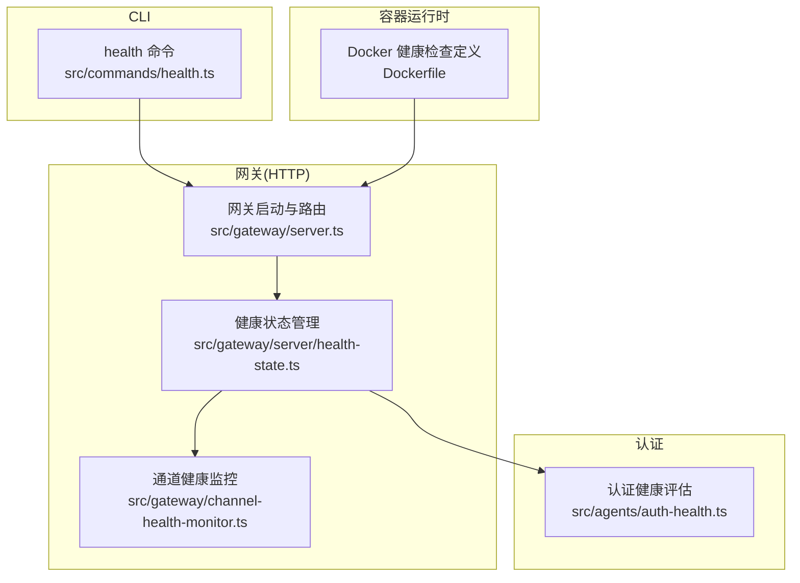
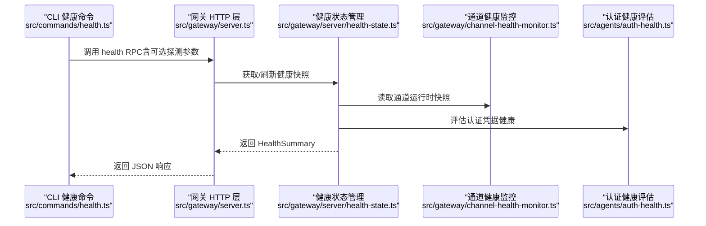
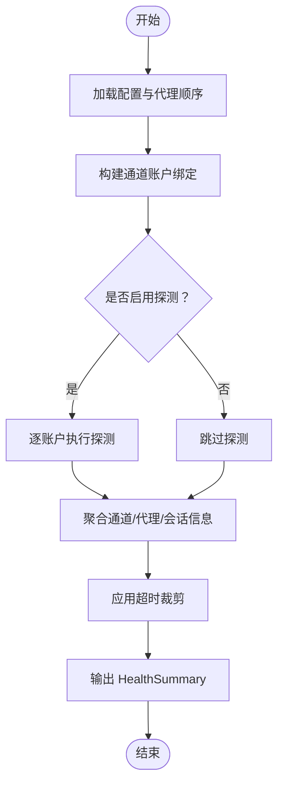
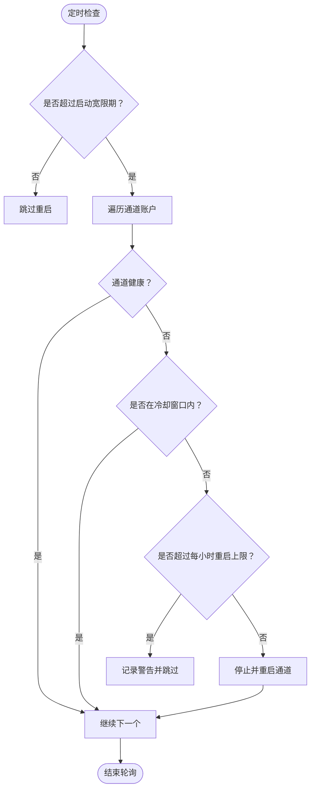
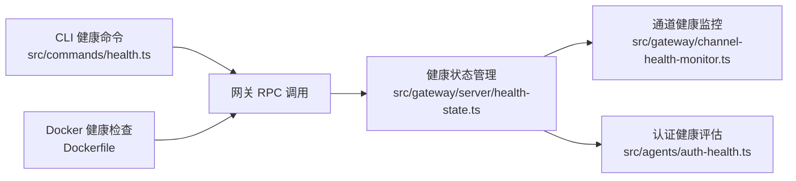

# 健康检查API

<cite>
**本文档引用的文件**
- [src/commands/health.ts](file://src/commands/health.ts)
- [src/gateway/server/health-state.ts](file://src/gateway/server/health-state.ts)
- [src/gateway/channel-health-monitor.ts](file://src/gateway/channel-health-monitor.ts)
- [src/agents/auth-health.ts](file://src/agents/auth-health.ts)
- [Dockerfile](file://Dockerfile)
- [src/gateway/server.ts](file://src/gateway/server.ts)
</cite>

## 目录

1. [简介](#简介)
2. [项目结构](#项目结构)
3. [核心组件](#核心组件)
4. [架构总览](#架构总览)
5. [详细组件分析](#详细组件分析)
6. [依赖关系分析](#依赖关系分析)
7. [性能考量](#性能考量)
8. [故障排查指南](#故障排查指南)
9. [结论](#结论)
10. [附录](#附录)

## 简介

本文件系统性地文档化 OpenClaw 的健康检查 API，覆盖以下端点与行为：

- /health（别名 /healthz）
- /ready（别名 /readyz）

重点说明：

- HTTP 方法与响应格式
- 存活检查与就绪检查的差异
- 触发条件、检查逻辑与超时处理
- 监控集成、告警配置与故障诊断
- 本地直连访问与远程访问的安全差异

## 项目结构

与健康检查直接相关的模块分布如下：

- CLI 命令层：负责发起健康检查请求并格式化输出
- 网关服务层：维护健康快照、广播更新、暴露 HTTP 探针端点
- 通道健康监控：周期性评估通道健康状况并自动重启异常通道
- 认证健康：评估凭据有效期与可用性，辅助理解整体健康状态

**图表来源**

- [src/commands/health.ts:525-751](file://src/commands/health.ts#L525-L751)
- [src/gateway/server.ts:1-4](file://src/gateway/server.ts#L1-L4)
- [src/gateway/server/health-state.ts:17-85](file://src/gateway/server/health-state.ts#L17-L85)
- [src/gateway/channel-health-monitor.ts:76-200](file://src/gateway/channel-health-monitor.ts#L76-L200)
- [src/agents/auth-health.ts:39-283](file://src/agents/auth-health.ts#L39-L283)
- [Dockerfile:224-229](file://Dockerfile#L224-L229)

**章节来源**

- [src/commands/health.ts:1-752](file://src/commands/health.ts#L1-L752)
- [src/gateway/server/health-state.ts:1-86](file://src/gateway/server/health-state.ts#L1-L86)
- [src/gateway/channel-health-monitor.ts:1-201](file://src/gateway/channel-health-monitor.ts#L1-L201)
- [src/agents/auth-health.ts:1-284](file://src/agents/auth-health.ts#L1-L284)
- [Dockerfile:220-231](file://Dockerfile#L220-L231)

## 核心组件

- 健康快照生成器：聚合通道、代理、会话等信息，支持可选探测
- 健康状态缓存与广播：异步刷新健康快照，版本号递增，支持推送更新
- 通道健康监控：周期性扫描通道连接与事件活跃度，必要时自动重启
- 认证健康评估：对 OAuth/Token/API Key 类型凭据进行有效期与可用性评估
- Docker 健康检查：内置探针端点与容器级健康检查指令

**章节来源**

- [src/commands/health.ts:348-523](file://src/commands/health.ts#L348-L523)
- [src/gateway/server/health-state.ts:49-85](file://src/gateway/server/health-state.ts#L49-L85)
- [src/gateway/channel-health-monitor.ts:76-200](file://src/gateway/channel-health-monitor.ts#L76-L200)
- [src/agents/auth-health.ts:39-283](file://src/agents/auth-health.ts#L39-L283)
- [Dockerfile:224-229](file://Dockerfile#L224-L229)

## 架构总览

下图展示从 CLI 到网关、再到通道与认证健康的整体调用链路。

**图表来源**

- [src/commands/health.ts:525-544](file://src/commands/health.ts#L525-L544)
- [src/gateway/server/health-state.ts:70-85](file://src/gateway/server/health-state.ts#L70-L85)
- [src/gateway/channel-health-monitor.ts:111-172](file://src/gateway/channel-health-monitor.ts#L111-L172)
- [src/agents/auth-health.ts:187-283](file://src/agents/auth-health.ts#L187-L283)

## 详细组件分析

### 健康检查端点与语义

- /health 与 /healthz
  - 语义：存活探针（liveness），仅验证网关可达性与基本运行状态
  - HTTP 方法：GET
  - 响应：返回健康摘要对象（包含时间戳、耗时、通道概要、默认代理、会话统计等）
  - 状态码：成功时 200；失败时 5xx（由网关层根据错误传播）
- /ready 与 /readyz
  - 语义：就绪探针（readiness），在存活基础上，额外结合通道层面的“启动宽限期”与连接状态
  - HTTP 方法：GET
  - 响应：与 /health 相同的结构
  - 状态码：成功时 200；若通道处于断开且未过启动宽限期，返回 503

注意：容器运行时通过内置探针端点进行健康检查，容器镜像中已声明健康检查指令。

**章节来源**

- [Dockerfile:224-229](file://Dockerfile#L224-L229)

### 健康快照生成与超时控制

- 快照生成流程
  - 解析配置、代理顺序、通道绑定与首选账户
  - 可选执行通道账户探测（按账户维度）
  - 汇聚通道概要、代理心跳、会话统计
  - 输出 HealthSummary 结构
- 超时控制
  - 默认超时 10 秒；可通过参数传入自定义值
  - 实际探测超时将被裁剪到最小 50ms，避免过短导致误判
- 错误处理
  - 探测异常会被记录为失败项，但不阻断整体健康返回

**图表来源**

- [src/commands/health.ts:348-523](file://src/commands/health.ts#L348-L523)

**章节来源**

- [src/commands/health.ts:74-80](file://src/commands/health.ts#L74-L80)
- [src/commands/health.ts:377-379](file://src/commands/health.ts#L377-L379)
- [src/commands/health.ts:427-441](file://src/commands/health.ts#L427-L441)

### 就绪检查的触发条件与逻辑

- 启动宽限期
  - 在网关刚启动的一段时间内，即使通道断开也不立即判定为不可就绪
- 连接状态与事件活跃度
  - 若通道连接存在但长时间无事件，视为“陈旧事件”，可能触发重启
- 通道健康策略
  - 依据连接建立宽限、事件陈旧阈值与冷却周期，综合评估是否健康
  - 超过每小时最大重启次数将暂时停止重启

**图表来源**

- [src/gateway/channel-health-monitor.ts:99-176](file://src/gateway/channel-health-monitor.ts#L99-L176)

**章节来源**

- [src/gateway/channel-health-monitor.ts:14-18](file://src/gateway/channel-health-monitor.ts#L14-L18)
- [src/gateway/channel-health-monitor.ts:124-151](file://src/gateway/channel-health-monitor.ts#L124-L151)

### 认证健康评估

- 评估范围
  - OAuth、Token、API Key 三类凭据
  - 统计各提供商的总体健康状态（ok/expiring/expired/missing/static）
- 关键指标
  - 凭证剩余有效期、到期时间、状态原因码
- 用途
  - 辅助理解整体健康状态，特别是当通道探测失败由认证问题引起时

**章节来源**

- [src/agents/auth-health.ts:39-44](file://src/agents/auth-health.ts#L39-L44)
- [src/agents/auth-health.ts:187-283](file://src/agents/auth-health.ts#L187-L283)

### Docker 容器健康检查

- 内置探针端点
  - /healthz（存活）、/readyz（就绪）
  - 别名 /health、/ready
- 健康检查指令
  - 使用本地回环地址访问 /healthz
  - 配置间隔、超时、启动期与重试次数

**章节来源**

- [Dockerfile:224-229](file://Dockerfile#L224-L229)

## 依赖关系分析

- CLI 健康命令依赖网关 RPC 调用以获取健康摘要
- 网关健康状态管理依赖通道运行时快照与认证健康评估
- 通道健康监控独立于 HTTP 层，定期扫描并按策略重启通道
- Docker 健康检查通过内置探针端点与容器运行时集成

**图表来源**

- [src/commands/health.ts:525-544](file://src/commands/health.ts#L525-L544)
- [src/gateway/server/health-state.ts:70-85](file://src/gateway/server/health-state.ts#L70-L85)
- [src/gateway/channel-health-monitor.ts:111-172](file://src/gateway/channel-health-monitor.ts#L111-L172)
- [src/agents/auth-health.ts:187-283](file://src/agents/auth-health.ts#L187-L283)
- [Dockerfile:224-229](file://Dockerfile#L224-L229)

**章节来源**

- [src/commands/health.ts:525-544](file://src/commands/health.ts#L525-L544)
- [src/gateway/server/health-state.ts:70-85](file://src/gateway/server/health-state.ts#L70-L85)
- [src/gateway/channel-health-monitor.ts:111-172](file://src/gateway/channel-health-monitor.ts#L111-L172)
- [src/agents/auth-health.ts:187-283](file://src/agents/auth-health.ts#L187-L283)
- [Dockerfile:224-229](file://Dockerfile#L224-L229)

## 性能考量

- 探测超时裁剪：避免过短超时导致频繁失败
- 异步刷新：健康快照异步刷新，避免每次请求阻塞
- 缓存与版本：健康版本号递增，便于客户端感知变更
- 通道重启节流：冷却窗口与每小时重启上限，防止风暴式重启

**章节来源**

- [src/commands/health.ts:377-379](file://src/commands/health.ts#L377-L379)
- [src/gateway/server/health-state.ts:70-85](file://src/gateway/server/health-state.ts#L70-L85)
- [src/gateway/channel-health-monitor.ts:86-87](file://src/gateway/channel-health-monitor.ts#L86-L87)
- [src/gateway/channel-health-monitor.ts:145-151](file://src/gateway/channel-health-monitor.ts#L145-L151)

## 故障排查指南

- 本地直连访问
  - 通过 CLI 健康命令直接查询网关健康摘要，适合本地调试
  - 可开启调试环境变量以输出更详细的中间结果
- 远程访问
  - 需确保网关绑定与鉴权配置正确，容器运行时建议使用内置探针端点
- 常见问题定位
  - 通道断开：检查通道健康监控日志与重启记录
  - 认证失效：使用认证健康评估输出，确认凭据状态与剩余有效期
  - 探测失败：关注探测错误信息与耗时，必要时增大超时或减少并发探测

**章节来源**

- [src/commands/health.ts:525-544](file://src/commands/health.ts#L525-L544)
- [src/gateway/channel-health-monitor.ts:147-151](file://src/gateway/channel-health-monitor.ts#L147-L151)
- [src/agents/auth-health.ts:187-283](file://src/agents/auth-health.ts#L187-L283)

## 结论

OpenClaw 的健康检查体系以“存活探针 + 就绪探针”的双层设计为核心，结合异步健康快照、通道健康监控与认证健康评估，既满足容器运行时的自动化健康检查需求，也支持本地调试与远程监控集成。通过合理的超时控制、冷却与重启限制，系统在保证稳定性的同时具备良好的可观测性与可运维性。

## 附录

### 端点规范与响应字段

- 端点
  - GET /health 或 /healthz：存活探针
  - GET /ready 或 /readyz：就绪探针
- 响应体（HealthSummary）
  - ok：布尔，表示网关可达性
  - ts：时间戳
  - durationMs：总耗时
  - channels：通道概要（含账户级探测结果）
  - channelOrder：通道顺序
  - channelLabels：通道标签映射
  - heartbeatSeconds：默认代理心跳秒数（历史字段）
  - defaultAgentId：默认代理 ID
  - agents：代理列表（含心跳与会话统计）
  - sessions：会话存储路径、数量与最近条目

**章节来源**

- [src/commands/health.ts:47-72](file://src/commands/health.ts#L47-L72)
