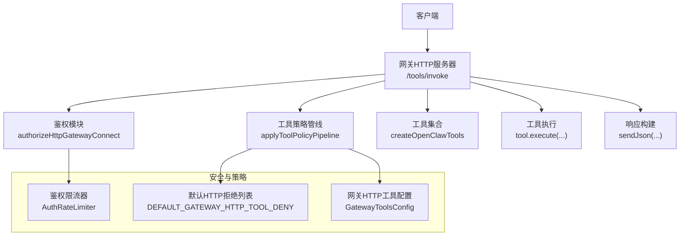
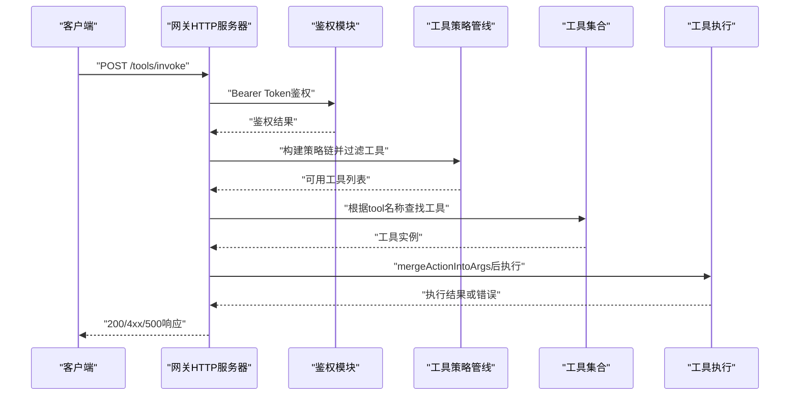
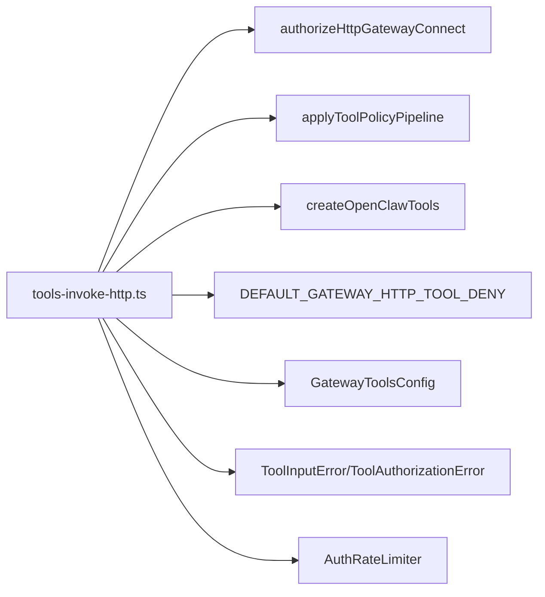
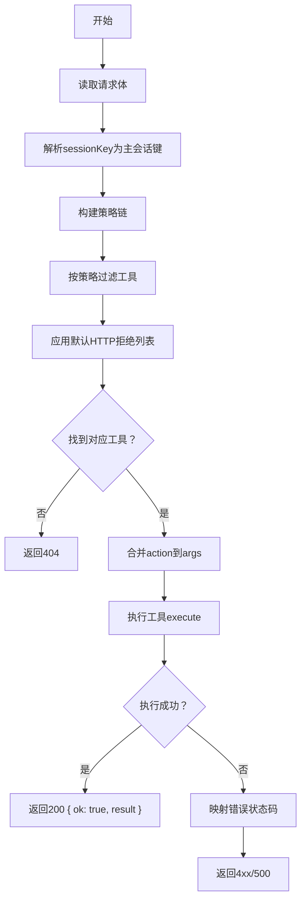

# 工具调用API

<cite>
**本文引用的文件**
- [tools-invoke-http-api.md](file://docs/gateway/tools-invoke-http-api.md)
- [tools-invoke-http.ts](file://src/gateway/tools-invoke-http.ts)
- [dangerous-tools.ts](file://src/security/dangerous-tools.ts)
- [auth-rate-limit.ts](file://src/gateway/auth-rate-limit.ts)
- [common.ts](file://src/agents/tools/common.ts)
- [tools-invoke-http.cron-regression.test.ts](file://src/gateway/tools-invoke-http.cron-regression.test.ts)
- [types.gateway.ts](file://src/config/types.gateway.ts)
- [InvokeErrorParser.kt](file://apps/android/app/src/main/java/ai/openclaw/app/gateway/InvokeErrorParser.kt)
</cite>

## 目录

1. [简介](#简介)
2. [项目结构](#项目结构)
3. [核心组件](#核心组件)
4. [架构总览](#架构总览)
5. [详细组件分析](#详细组件分析)
6. [依赖关系分析](#依赖关系分析)
7. [性能考量](#性能考量)
8. [故障排查指南](#故障排查指南)
9. [结论](#结论)
10. [附录](#附录)

## 简介

本文件面向需要通过HTTP直接调用OpenClaw网关内工具的开发者与集成方，系统性说明“工具调用API”的端点、请求格式、响应结构、参数传递、策略与路由、权限验证、安全限制、错误处理与最佳实践。该API允许在不启动完整代理对话的前提下，对单个工具进行鉴权与策略校验后的直接调用，并返回结构化结果。

## 项目结构

- 文档层：位于 docs/gateway/tools-invoke-http-api.md，提供端点概览、认证方式、请求体字段、策略与路由行为、响应码与示例。
- 实现层：位于 src/gateway/tools-invoke-http.ts，包含HTTP入口、鉴权、请求体解析、工具选择与执行、错误映射与响应发送。
- 安全与策略：位于 src/security/dangerous-tools.ts（默认HTTP拒绝列表）、src/gateway/auth-rate-limit.ts（鉴权限流）、src/config/types.gateway.ts（可配置的HTTP工具策略）。
- 错误处理与通用工具异常：位于 src/agents/tools/common.ts（工具输入/授权错误类型及状态码映射）。
- 平台侧错误解析：位于 apps/android/app/src/main/java/.../InvokeErrorParser.kt（Android侧对错误消息的解析与展示）。

图表来源

- [tools-invoke-http.ts:134-340](file://src/gateway/tools-invoke-http.ts#L134-L340)
- [dangerous-tools.ts:9-20](file://src/security/dangerous-tools.ts#L9-L20)
- [auth-rate-limit.ts:95-232](file://src/gateway/auth-rate-limit.ts#L95-L232)
- [types.gateway.ts:362-367](file://src/config/types.gateway.ts#L362-L367)

章节来源

- [tools-invoke-http-api.md:1-111](file://docs/gateway/tools-invoke-http-api.md#L1-L111)
- [tools-invoke-http.ts:1-341](file://src/gateway/tools-invoke-http.ts#L1-L341)

## 核心组件

- 端点与方法
  - 方法：POST
  - 路径：/tools/invoke
  - 端口：与网关WebSocket同端口复用
- 认证
  - 使用Bearer Token；支持token/password两种模式；支持速率限制与重试头
- 请求体字段
  - tool（必填）：工具名称
  - action（可选）：当工具schema支持时，可自动注入到args
  - args（可选）：工具特定参数对象
  - sessionKey（可选）：目标会话键，默认“main”
  - dryRun（可选）：保留字段，当前忽略
- 响应
  - 200：成功，返回{ ok: true, result }
  - 400/401/403/404/405/429/500：失败，返回{ ok: false, error: { type, message } }
- 策略与路由
  - 采用与代理相同的工具策略链：profile/provider/全局/代理/组/子代理
  - 默认HTTP拒绝列表：sessions_spawn、sessions_send、cron、gateway、whatsapp_login
  - 可通过gateway.tools配置deny/allow扩展或移除默认拒绝项
- 执行与结果
  - 将action合并入args后调用工具execute并返回结果
  - 对工具输入错误与授权错误进行状态码映射

章节来源

- [tools-invoke-http-api.md:13-110](file://docs/gateway/tools-invoke-http-api.md#L13-L110)
- [tools-invoke-http.ts:40-46](file://src/gateway/tools-invoke-http.ts#L40-L46)
- [tools-invoke-http.ts:134-340](file://src/gateway/tools-invoke-http.ts#L134-L340)
- [dangerous-tools.ts:9-20](file://src/security/dangerous-tools.ts#L9-L20)
- [types.gateway.ts:362-367](file://src/config/types.gateway.ts#L362-L367)

## 架构总览

下图展示了从客户端到工具执行的完整调用链路，包括鉴权、策略过滤、工具选择与执行、错误映射与响应。

图表来源

- [tools-invoke-http.ts:134-340](file://src/gateway/tools-invoke-http.ts#L134-L340)
- [tools-invoke-http.ts:270-311](file://src/gateway/tools-invoke-http.ts#L270-L311)

## 详细组件分析

### HTTP端点与请求处理

- 入口匹配：仅处理路径为/tools/invoke且方法为POST的请求
- 鉴权：使用authorizeHttpGatewayConnect，支持可信代理与速率限制
- 请求体读取：默认最大2MB，解析为ToolsInvokeBody
- 参数解析：tool必填，action与args可选，sessionKey解析为主会话键或指定键
- 可选上下文头：x-openclaw-message-channel、x-openclaw-account-id、x-openclaw-message-to、x-openclaw-thread-id用于策略继承

章节来源

- [tools-invoke-http.ts:144-218](file://src/gateway/tools-invoke-http.ts#L144-L218)

### 策略与路由行为

- 策略链步骤：profile/provider profile → 全局allow → provider allow → 代理allow → 代理provider allow → 组allow
- 子代理策略：当sessionKey为子代理时追加子代理工具allow
- 默认HTTP拒绝：即使会话策略允许，仍强制拒绝默认高风险工具
- 可配置拒绝/允许：通过gateway.tools.deny/allow扩展或移除默认拒绝项

章节来源

- [tools-invoke-http.ts:270-302](file://src/gateway/tools-invoke-http.ts#L270-L302)
- [dangerous-tools.ts:9-20](file://src/security/dangerous-tools.ts#L9-L20)
- [types.gateway.ts:362-367](file://src/config/types.gateway.ts#L362-L367)

### 工具执行与参数传递

- 参数合并：若action存在且工具schema支持action，则自动注入到args
- 会话键：未提供或为“main”时使用主会话键
- 执行：调用工具execute，返回结果包装为{ ok: true, result }

章节来源

- [tools-invoke-http.ts:199-209](file://src/gateway/tools-invoke-http.ts#L199-L209)
- [tools-invoke-http.ts:313-322](file://src/gateway/tools-invoke-http.ts#L313-L322)

### 错误处理与状态码映射

- 输入错误：ToolInputError映射为400；ToolAuthorizationError映射为403
- 其他工具执行错误：统一映射为500，消息经清理
- 鉴权失败：401；速率限制：429并设置Retry-After
- 方法不被允许：405
- 工具不可用：404（未找到或不在白名单）

章节来源

- [tools-invoke-http.ts:115-132](file://src/gateway/tools-invoke-http.ts#L115-L132)
- [tools-invoke-http.ts:323-337](file://src/gateway/tools-invoke-http.ts#L323-L337)
- [common.ts:26-42](file://src/agents/tools/common.ts#L26-L42)

### 安全限制与审计

- 默认HTTP拒绝列表：防止通过HTTP发起会话编排、控制面操作与交互式登录
- 审计告警：若operator显式允许默认拒绝项，将触发警告/严重级别提醒
- 速率限制：支持滑动窗口与锁定，环回地址默认豁免

章节来源

- [dangerous-tools.ts:9-20](file://src/security/dangerous-tools.ts#L9-L20)
- [auth-rate-limit.ts:95-232](file://src/gateway/auth-rate-limit.ts#L95-L232)

### Android侧错误解析

- 将服务端返回的错误消息解析为带前缀的结构化错误，便于UI展示
- 支持空消息兜底与冒号分隔的显式错误码

章节来源

- [InvokeErrorParser.kt:1-39](file://apps/android/app/src/main/java/ai/openclaw/app/gateway/InvokeErrorParser.kt#L1-L39)

## 依赖关系分析

- 网关HTTP实现依赖：
  - 鉴权模块：authorizeHttpGatewayConnect
  - 策略模块：applyToolPolicyPipeline、resolveEffectiveToolPolicy、resolveGroupToolPolicy、resolveSubagentToolPolicy
  - 工具集合：createOpenClawTools
  - 安全常量：DEFAULT_GATEWAY_HTTP_TOOL_DENY
  - 配置类型：GatewayToolsConfig
  - 通用工具异常：ToolInputError、ToolAuthorizationError
  - 速率限制：AuthRateLimiter

图表来源

- [tools-invoke-http.ts:1-341](file://src/gateway/tools-invoke-http.ts#L1-L341)
- [dangerous-tools.ts:1-40](file://src/security/dangerous-tools.ts#L1-L40)
- [types.gateway.ts:362-367](file://src/config/types.gateway.ts#L362-L367)
- [common.ts:26-42](file://src/agents/tools/common.ts#L26-L42)
- [auth-rate-limit.ts:95-232](file://src/gateway/auth-rate-limit.ts#L95-L232)

章节来源

- [tools-invoke-http.ts:1-341](file://src/gateway/tools-invoke-http.ts#L1-L341)

## 性能考量

- 请求体大小：默认2MB，避免过大载荷导致内存压力
- 会话键解析：优先使用主会话键，减少跨会话开销
- 工具执行：直接调用execute，避免代理对话轮次
- 速率限制：合理配置maxAttempts/windowMs/lockoutMs，平衡安全性与吞吐
- 日志与诊断：错误路径记录日志，便于定位问题

## 故障排查指南

- 401未授权
  - 检查Authorization头是否为Bearer Token
  - 确认gateway.auth.mode与凭据配置一致
- 403禁止访问
  - 工具输入参数不符合schema或授权不足
- 404工具不可用
  - 工具名拼写错误或不在策略白名单
  - 被默认HTTP拒绝列表屏蔽
- 429速率限制
  - 观察Retry-After头，降低请求频率
- 500工具执行失败
  - 查看服务端日志中的错误堆栈与消息
- Android侧错误显示
  - 使用InvokeErrorParser解析错误消息，确认是否存在显式错误码

章节来源

- [tools-invoke-http.ts:150-168](file://src/gateway/tools-invoke-http.ts#L150-L168)
- [tools-invoke-http.ts:304-311](file://src/gateway/tools-invoke-http.ts#L304-L311)
- [tools-invoke-http.ts:323-337](file://src/gateway/tools-invoke-http.ts#L323-L337)
- [auth-rate-limit.ts:141-172](file://src/gateway/auth-rate-limit.ts#L141-L172)
- [InvokeErrorParser.kt:12-39](file://apps/android/app/src/main/java/ai/openclaw/app/gateway/InvokeErrorParser.kt#L12-L39)

## 结论

工具调用API为自动化与轻量工具执行提供了安全、可控且高效的HTTP接口。通过严格的鉴权、策略过滤与默认拒绝列表，确保高风险操作不会通过非交互式HTTP表面被触发。建议在生产环境中：

- 明确配置gateway.auth与gateway.tools
- 合理设置AuthRateLimiter参数
- 严格校验请求体字段与会话键
- 在客户端侧做好错误解析与重试策略

## 附录

### API定义与示例

- 端点：POST /tools/invoke
- 认证：Authorization: Bearer <token>
- 请求体字段
  - tool（必填）：工具名称
  - action（可选）：工具schema支持时自动注入
  - args（可选）：工具参数对象
  - sessionKey（可选）：默认“main”
  - dryRun（可选）：保留字段
- 响应
  - 成功：200 { ok: true, result }
  - 失败：400/401/403/404/405/429/500 { ok: false, error: { type, message } }

章节来源

- [tools-invoke-http-api.md:13-110](file://docs/gateway/tools-invoke-http-api.md#L13-L110)

### 完整请求示例（不含具体代码内容）

- 使用curl发送POST请求至http://<gateway-host>:<port>/tools/invoke
- 请求头包含Authorization: Bearer YOUR_TOKEN与Content-Type: application/json
- 请求体包含tool、action与args等字段

章节来源

- [tools-invoke-http-api.md:99-110](file://docs/gateway/tools-invoke-http-api.md#L99-L110)

### 策略与路由流程图

图表来源

- [tools-invoke-http.ts:174-322](file://src/gateway/tools-invoke-http.ts#L174-L322)
