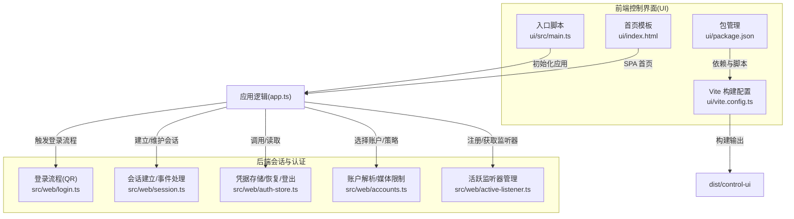
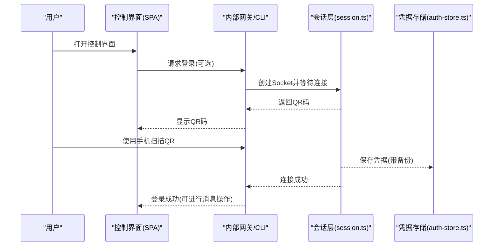
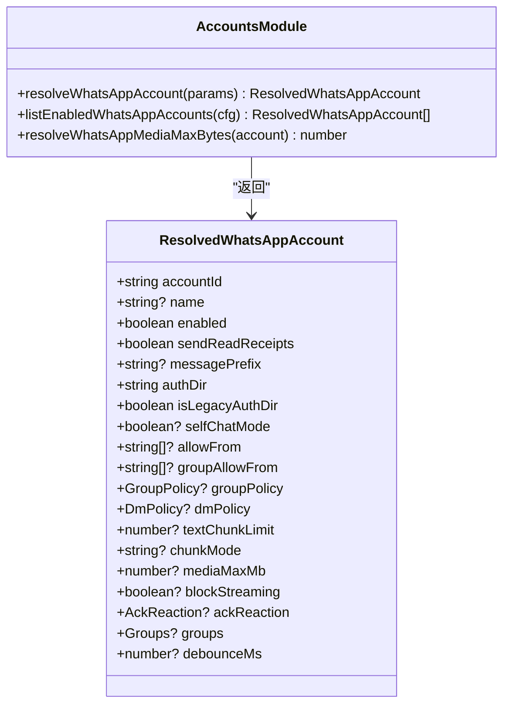
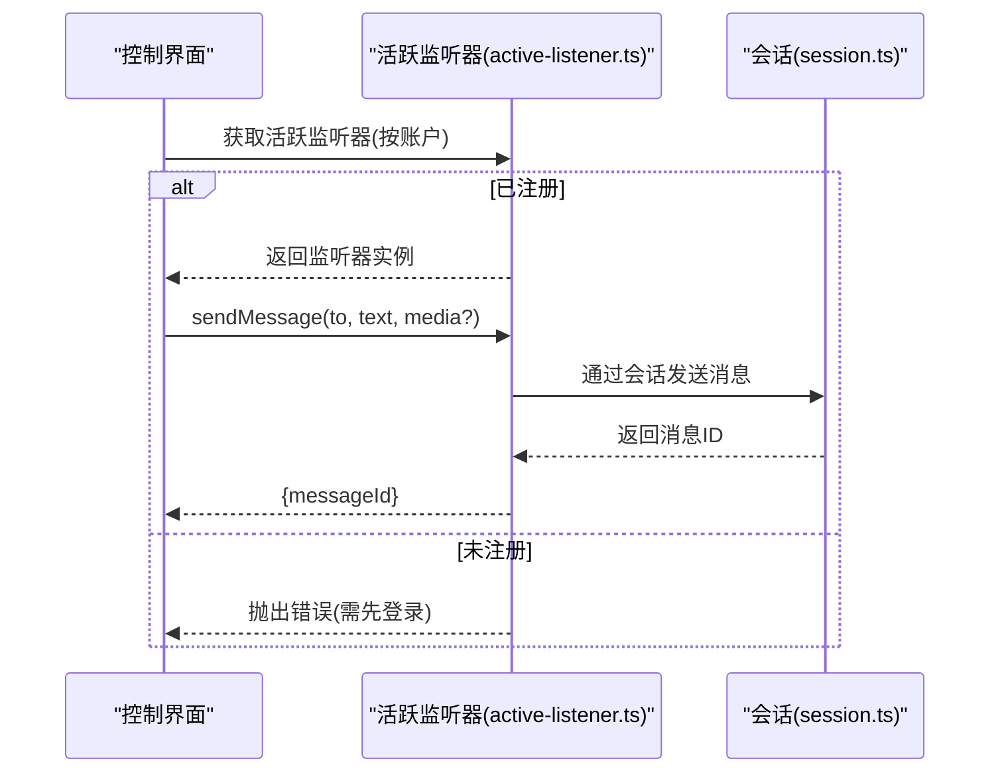
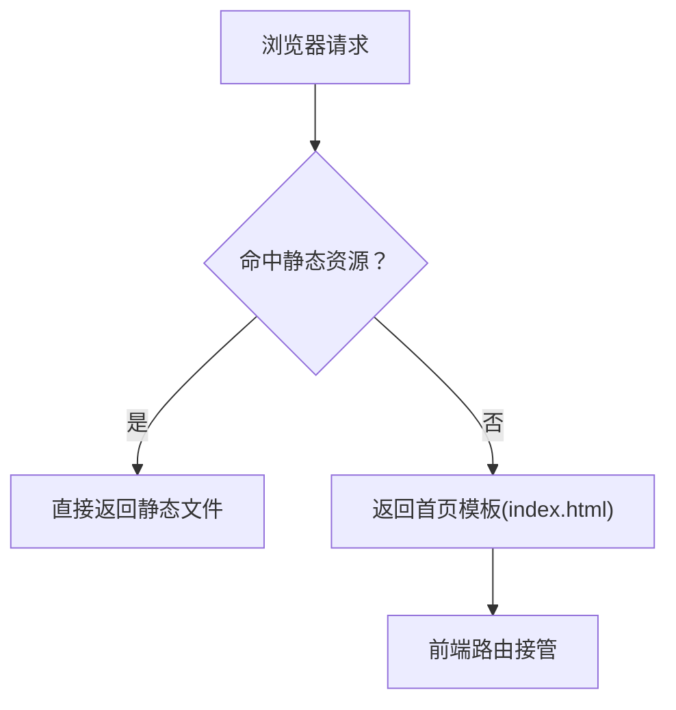
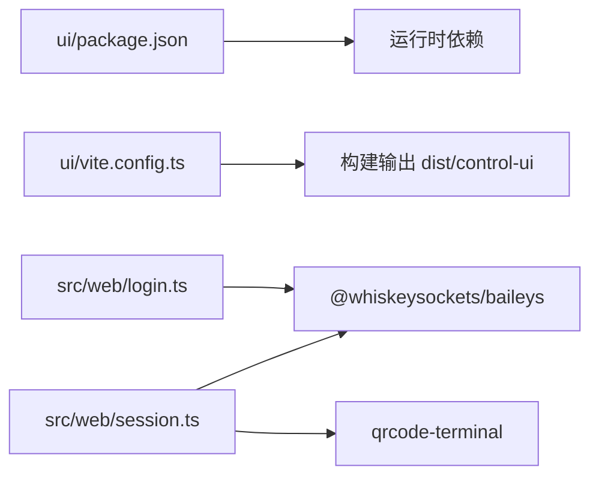

# 控制界面API

<cite>
**本文引用的文件**
- [src/web/login.ts](file://src/web/login.ts)
- [src/web/session.ts](file://src/web/session.ts)
- [src/web/auth-store.ts](file://src/web/auth-store.ts)
- [src/web/accounts.ts](file://src/web/accounts.ts)
- [src/web/active-listener.ts](file://src/web/active-listener.ts)
- [ui/vite.config.ts](file://ui/vite.config.ts)
- [ui/package.json](file://ui/package.json)
- [ui/src/main.ts](file://ui/src/main.ts)
- [ui/index.html](file://ui/index.html)
</cite>

## 目录

1. [简介](#简介)
2. [项目结构](#项目结构)
3. [核心组件](#核心组件)
4. [架构总览](#架构总览)
5. [详细组件分析](#详细组件分析)
6. [依赖关系分析](#依赖关系分析)
7. [性能考量](#性能考量)
8. [故障排查指南](#故障排查指南)
9. [结论](#结论)
10. [附录](#附录)

## 简介

本文件面向OpenClaw控制界面（Web UI）与后端交互的API文档，聚焦以下目标：

- 控制界面的HTTP端点、请求格式与响应结构
- 仪表板访问、配置管理、会话管理与系统状态查询
- 完整的请求示例、参数说明、状态码定义与错误处理机制
- 认证方式、权限控制与安全注意事项
- 前端路由处理、静态资源服务与SPA回退机制

说明：当前仓库中未发现独立的“控制界面HTTP API”后端服务源文件；控制界面以前端单页应用（SPA）形式存在，通过内部网关或CLI工具与后端通信。本文将基于现有Web与会话相关模块，梳理控制界面的运行时行为、认证与会话管理，并给出API使用建议与最佳实践。

## 项目结构

控制界面由前端Vite工程组成，构建产物输出到dist目录，供后端或反向代理提供静态资源服务。核心目录与文件如下：

- 前端工程：ui/
  - 构建配置：ui/vite.config.ts
  - 入口脚本：ui/src/main.ts
  - 包管理：ui/package.json
  - 首屏模板：ui/index.html
- 后端Web会话与认证：src/web/\*
  - 登录流程与QR：src/web/login.ts
  - 会话建立与事件：src/web/session.ts
  - 凭据存储与清理：src/web/auth-store.ts
  - 账户解析与媒体限制：src/web/accounts.ts
  - 活跃监听器注册：src/web/active-listener.ts

图表来源

- [ui/vite.config.ts:1-44](file://ui/vite.config.ts#L1-L44)
- [ui/src/main.ts:1-3](file://ui/src/main.ts#L1-L3)
- [ui/package.json:1-28](file://ui/package.json#L1-L28)
- [src/web/login.ts:1-79](file://src/web/login.ts#L1-L79)
- [src/web/session.ts:1-313](file://src/web/session.ts#L1-L313)
- [src/web/auth-store.ts:1-207](file://src/web/auth-store.ts#L1-L207)
- [src/web/accounts.ts:1-167](file://src/web/accounts.ts#L1-L167)
- [src/web/active-listener.ts:1-85](file://src/web/active-listener.ts#L1-L85)

章节来源

- [ui/vite.config.ts:1-44](file://ui/vite.config.ts#L1-L44)
- [ui/src/main.ts:1-3](file://ui/src/main.ts#L1-L3)
- [ui/package.json:1-28](file://ui/package.json#L1-L28)
- [src/web/login.ts:1-79](file://src/web/login.ts#L1-L79)
- [src/web/session.ts:1-313](file://src/web/session.ts#L1-L313)
- [src/web/auth-store.ts:1-207](file://src/web/auth-store.ts#L1-L207)
- [src/web/accounts.ts:1-167](file://src/web/accounts.ts#L1-L167)
- [src/web/active-listener.ts:1-85](file://src/web/active-listener.ts#L1-L85)

## 核心组件

- 登录与QR流程
  - 功能：创建Baileys Socket，等待连接，打印QR码，处理重启与登出等场景
  - 关键路径：[loginWeb:10-79](file://src/web/login.ts#L10-L79)，[createWaSocket:90-161](file://src/web/session.ts#L90-L161)
- 会话生命周期
  - 功能：连接建立、事件监听、错误处理、保存凭据、备份恢复
  - 关键路径：[waitForWaConnection:163-184](file://src/web/session.ts#L163-L184)，[formatError:258-308](file://src/web/session.ts#L258-L308)
- 凭据存储与清理
  - 功能：凭据文件读写、备份恢复、登出清理、自检与年龄统计
  - 关键路径：[webAuthExists:82-102](file://src/web/auth-store.ts#L82-L102)，[logoutWeb:131-150](file://src/web/auth-store.ts#L131-L150)，[maybeRestoreCredsFromBackup:51-80](file://src/web/auth-store.ts#L51-L80)
- 账户解析与策略
  - 功能：解析默认/指定账户、媒体大小限制、策略合并
  - 关键路径：[resolveWhatsAppAccount:116-149](file://src/web/accounts.ts#L116-L149)，[resolveWhatsAppMediaMaxBytes:152-160](file://src/web/accounts.ts#L152-L160)
- 活跃监听器
  - 功能：按账户维度注册/获取活跃Web监听器，用于消息发送/投票/反应等
  - 关键路径：[setActiveWebListener:53-84](file://src/web/active-listener.ts#L53-L84)，[requireActiveWebListener:39-51](file://src/web/active-listener.ts#L39-L51)

章节来源

- [src/web/login.ts:10-79](file://src/web/login.ts#L10-L79)
- [src/web/session.ts:90-184](file://src/web/session.ts#L90-L184)
- [src/web/auth-store.ts:51-150](file://src/web/auth-store.ts#L51-L150)
- [src/web/accounts.ts:116-160](file://src/web/accounts.ts#L116-L160)
- [src/web/active-listener.ts:39-84](file://src/web/active-listener.ts#L39-L84)

## 架构总览

控制界面作为SPA运行于浏览器，通过内部网关或CLI工具与后端会话层交互。登录阶段通过QR完成设备配对，凭据持久化至本地，后续连接自动恢复。UI侧负责展示与用户交互，后端负责与WhatsApp Web保持长连接并处理消息收发。

图表来源

- [src/web/session.ts:90-161](file://src/web/session.ts#L90-L161)
- [src/web/auth-store.ts:51-80](file://src/web/auth-store.ts#L51-L80)
- [src/web/login.ts:10-79](file://src/web/login.ts#L10-L79)

## 详细组件分析

### 组件A：登录与会话管理

- 功能要点
  - 支持打印QR码以便手机端扫描登录
  - 处理连接关闭与登出现象，必要时清理缓存并提示重新登录
  - 连接成功后保存凭据并设置权限最小化（文件权限）
- 错误处理
  - 识别特定状态码（如登出、重启），执行相应动作
  - 对异常进行格式化输出，便于诊断
- 性能与可靠性
  - 凭据保存采用队列化，避免并发写入冲突
  - 启动时尝试从备份恢复损坏的凭据文件

```mermaid
flowchart TD
Start(["开始登录"]) --> CreateSock["创建Socket并初始化"]
CreateSock --> WaitConn["等待连接事件"]
WaitConn --> ConnOpen{"连接已打开？"}
ConnOpen --> |是| SaveCreds["保存凭据(含备份)"]
SaveCreds --> Done(["完成"])
ConnOpen --> |否| CloseReason{"关闭原因？"}
CloseReason --> |登出| Logout["清理缓存并提示重新登录"]
CloseReason --> |重启| Retry["重试一次连接"]
CloseReason --> |其他| FormatErr["格式化错误信息并抛出"]
Retry --> Done
Logout --> Done
FormatErr --> Done
```

图表来源

- [src/web/session.ts:90-184](file://src/web/session.ts#L90-L184)
- [src/web/auth-store.ts:51-80](file://src/web/auth-store.ts#L51-L80)
- [src/web/login.ts:23-78](file://src/web/login.ts#L23-L78)

章节来源

- [src/web/login.ts:10-79](file://src/web/login.ts#L10-L79)
- [src/web/session.ts:90-184](file://src/web/session.ts#L90-L184)
- [src/web/auth-store.ts:51-80](file://src/web/auth-store.ts#L51-L80)

### 组件B：账户解析与配置管理

- 功能要点
  - 解析默认或指定账户，合并全局与账户级策略
  - 计算媒体最大字节限制，确保上传合规
  - 列举可用账户与启用账户集合
- 配置项示例（非穷举）
  - enabled：是否启用该账户
  - sendReadReceipts：是否发送已读回执
  - messagePrefix：消息前缀
  - allowFrom/groupAllowFrom：允许来源/群组白名单
  - groupPolicy/dmPolicy：群组/私聊策略
  - textChunkLimit/chunkMode：文本分片策略
  - mediaMaxMb：媒体大小上限
  - blockStreaming/selfChatMode：流式/自聊模式
  - ackReaction/groups/debounceMs：反应/群组/防抖

图表来源

- [src/web/accounts.ts:12-167](file://src/web/accounts.ts#L12-L167)

章节来源

- [src/web/accounts.ts:12-167](file://src/web/accounts.ts#L12-L167)

### 组件C：活跃监听器与消息发送

- 功能要点
  - 按账户ID注册/获取活跃监听器
  - 提供发送消息、投票、反应、输入状态等能力
  - 当无活跃监听器时抛出明确错误，引导用户先启动网关并登录
- 使用建议
  - 在UI侧显示“未激活”状态时，引导用户执行登录命令
  - 发送前校验目标JID与账户策略

图表来源

- [src/web/active-listener.ts:39-84](file://src/web/active-listener.ts#L39-L84)
- [src/web/session.ts:90-161](file://src/web/session.ts#L90-L161)

章节来源

- [src/web/active-listener.ts:39-84](file://src/web/active-listener.ts#L39-L84)
- [src/web/session.ts:90-161](file://src/web/session.ts#L90-L161)

### 组件D：前端路由、静态资源与SPA回退

- 路由与回退
  - SPA路由由前端应用自行处理；当访问未匹配路径时，应回退到首页模板
- 静态资源服务
  - 构建产物输出至dist/control-ui，可通过反向代理或内置服务器提供
- 基础路径
  - 可通过环境变量OPENCLAW_CONTROL_UI_BASE_PATH调整相对路径

图表来源

- [ui/vite.config.ts:21-44](file://ui/vite.config.ts#L21-L44)
- [ui/index.html](file://ui/index.html)

章节来源

- [ui/vite.config.ts:21-44](file://ui/vite.config.ts#L21-L44)
- [ui/index.html](file://ui/index.html)

## 依赖关系分析

- 前端依赖
  - 基于Vite构建，生产环境输出到dist/control-ui
  - 运行时依赖包括Lit、marked、signal等
- 后端依赖
  - 会话层依赖@whiskeysockets/baileys、qrcode-terminal
  - 日志与路径解析依赖内部工具集

图表来源

- [ui/package.json:11-26](file://ui/package.json#L11-L26)
- [ui/vite.config.ts:30-36](file://ui/vite.config.ts#L30-L36)
- [src/web/login.ts:1-8](file://src/web/login.ts#L1-L8)
- [src/web/session.ts:1-15](file://src/web/session.ts#L1-L15)

章节来源

- [ui/package.json:11-26](file://ui/package.json#L11-L26)
- [ui/vite.config.ts:30-36](file://ui/vite.config.ts#L30-L36)
- [src/web/login.ts:1-8](file://src/web/login.ts#L1-L8)
- [src/web/session.ts:1-15](file://src/web/session.ts#L1-L15)

## 性能考量

- 凭据保存队列化：避免频繁I/O导致阻塞
- 备份恢复：在凭据损坏时快速恢复，减少人工干预
- 文件权限：保存凭据时设置严格权限，降低泄露风险
- 媒体大小限制：根据账户策略限制上传大小，避免超限失败

## 故障排查指南

- 登录失败
  - 现象：连接提前关闭或报错
  - 排查：检查网络、代理与QR扫描是否完成；查看格式化后的错误信息
  - 参考：[formatError:258-308](file://src/web/session.ts#L258-L308)
- 会话登出
  - 现象：收到登出通知
  - 排查：执行登出清理，重新登录
  - 参考：[logoutWeb:131-150](file://src/web/auth-store.ts#L131-L150)
- 凭据损坏
  - 现象：凭据无法解析
  - 排查：尝试从备份恢复
  - 参考：[maybeRestoreCredsFromBackup:51-80](file://src/web/auth-store.ts#L51-L80)
- 无活跃监听器
  - 现象：发送消息时报错
  - 排查：确认已启动网关并完成登录
  - 参考：[requireActiveWebListener:39-51](file://src/web/active-listener.ts#L39-L51)

章节来源

- [src/web/session.ts:258-308](file://src/web/session.ts#L258-L308)
- [src/web/auth-store.ts:51-150](file://src/web/auth-store.ts#L51-L150)
- [src/web/active-listener.ts:39-51](file://src/web/active-listener.ts#L39-L51)

## 结论

- 控制界面为SPA，不直接暴露HTTP API端点；其功能通过内部网关与会话层实现
- 登录与会话管理围绕QR配对、凭据持久化与错误恢复展开
- 账户解析与策略合并确保多账户与合规性
- 前端路由与静态资源服务遵循标准SPA实践，支持回退到首页模板

## 附录

### A. 前端构建与部署

- 构建命令：参见ui/package.json中的scripts
- 输出目录：dist/control-ui
- 开发服务器：端口5173，host开启
- 基础路径：通过OPENCLAW_CONTROL_UI_BASE_PATH设置

章节来源

- [ui/package.json:5-10](file://ui/package.json#L5-L10)
- [ui/vite.config.ts:37-42](file://ui/vite.config.ts#L37-L42)
- [ui/vite.config.ts:22-23](file://ui/vite.config.ts#L22-L23)
