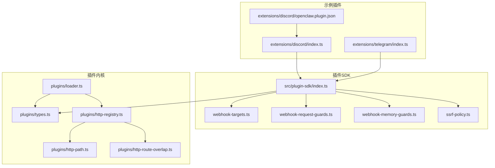
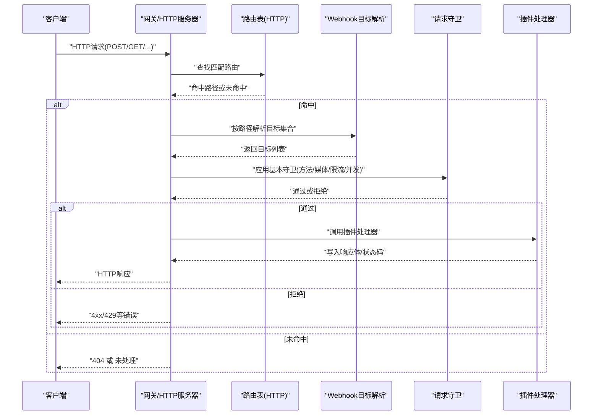
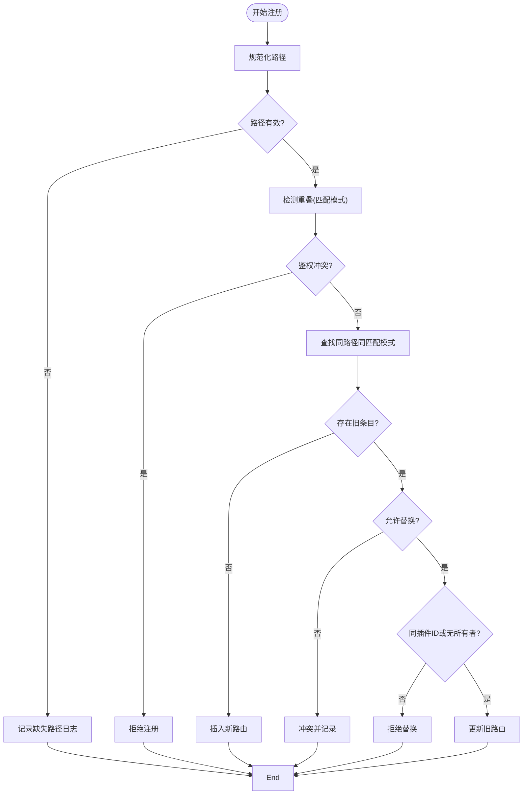
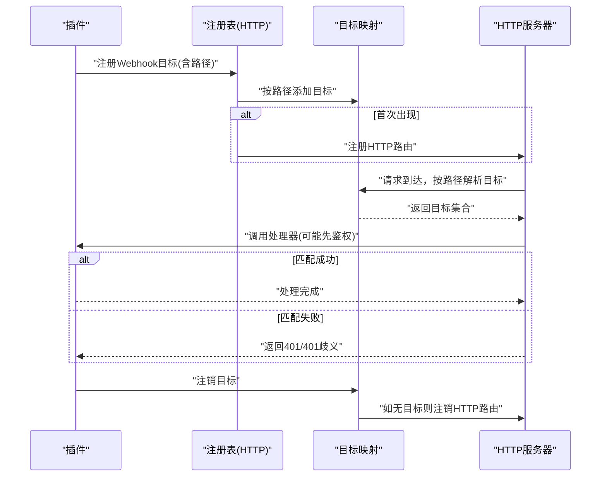
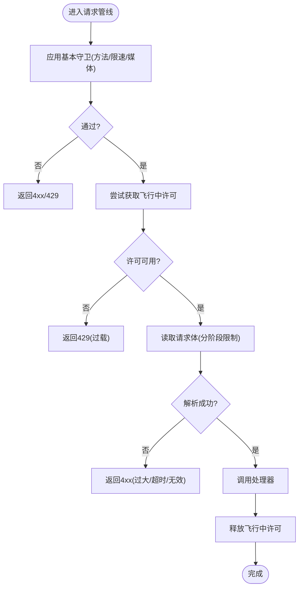
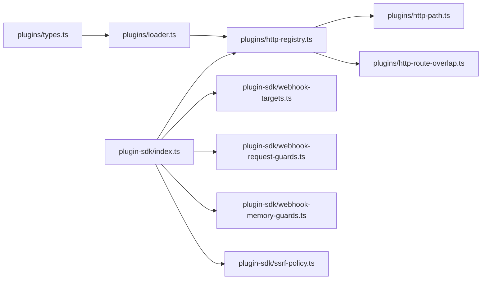

# 插件API

<cite>
**本文引用的文件**
- [src/plugin-sdk/index.ts](file://src/plugin-sdk/index.ts)
- [src/plugins/http-registry.ts](file://src/plugins/http-registry.ts)
- [src/plugins/http-path.ts](file://src/plugins/http-path.ts)
- [src/plugins/http-route-overlap.ts](file://src/plugins/http-route-overlap.ts)
- [src/plugin-sdk/webhook-targets.ts](file://src/plugin-sdk/webhook-targets.ts)
- [src/plugin-sdk/webhook-request-guards.ts](file://src/plugin-sdk/webhook-request-guards.ts)
- [src/plugin-sdk/webhook-memory-guards.ts](file://src/plugin-sdk/webhook-memory-guards.ts)
- [src/plugin-sdk/ssrf-policy.ts](file://src/plugin-sdk/ssrf-policy.ts)
- [src/plugins/types.ts](file://src/plugins/types.ts)
- [src/plugins/loader.ts](file://src/plugins/loader.ts)
- [extensions/discord/openclaw.plugin.json](file://extensions/discord/openclaw.plugin.json)
- [extensions/discord/index.ts](file://extensions/discord/index.ts)
- [extensions/telegram/index.ts](file://extensions/telegram/index.ts)
</cite>

## 目录

1. [简介](#简介)
2. [项目结构](#项目结构)
3. [核心组件](#核心组件)
4. [架构总览](#架构总览)
5. [详细组件分析](#详细组件分析)
6. [依赖关系分析](#依赖关系分析)
7. [性能考量](#性能考量)
8. [故障排查指南](#故障排查指南)
9. [结论](#结论)
10. [附录](#附录)

## 简介

本文件系统性阐述 OpenClaw 插件的 HTTP 路由与 Webhook 处理机制，覆盖以下主题：

- 插件 HTTP 路由注册与冲突检测
- 请求解析、鉴权与安全控制
- 中间件式请求管线（速率限制、并发限制、内容类型校验）
- 错误传播与响应格式
- 完整请求示例、路由规则与开发指南
- 安全策略、性能优化与调试方法

## 项目结构

OpenClaw 的插件子系统围绕“插件SDK导出入口”“HTTP路由注册器”“Webhook目标与匹配器”“请求守卫与内存防护”等模块组织，形成可扩展、可组合的插件API。

图示来源

- [src/plugin-sdk/index.ts:125-127](file://src/plugin-sdk/index.ts#L125-L127)
- [src/plugins/http-registry.ts:12-24](file://src/plugins/http-registry.ts#L12-L24)
- [src/plugins/http-path.ts:1-15](file://src/plugins/http-path.ts#L1-L15)
- [src/plugins/http-route-overlap.ts:15-44](file://src/plugins/http-route-overlap.ts#L15-L44)
- [src/plugin-sdk/webhook-targets.ts:27-42](file://src/plugin-sdk/webhook-targets.ts#L27-L42)
- [src/plugin-sdk/webhook-request-guards.ts:179-227](file://src/plugin-sdk/webhook-request-guards.ts#L179-L227)
- [src/plugin-sdk/webhook-memory-guards.ts:51-105](file://src/plugin-sdk/webhook-memory-guards.ts#L51-L105)
- [src/plugin-sdk/ssrf-policy.ts:65-85](file://src/plugin-sdk/ssrf-policy.ts#L65-L85)
- [src/plugins/types.ts:205-219](file://src/plugins/types.ts#L205-L219)
- [src/plugins/loader.ts:503-507](file://src/plugins/loader.ts#L503-L507)
- [extensions/discord/openclaw.plugin.json:1-10](file://extensions/discord/openclaw.plugin.json#L1-L10)
- [extensions/discord/index.ts:12-16](file://extensions/discord/index.ts#L12-L16)
- [extensions/telegram/index.ts:11-14](file://extensions/telegram/index.ts#L11-L14)

章节来源

- [src/plugin-sdk/index.ts:125-127](file://src/plugin-sdk/index.ts#L125-L127)
- [src/plugins/http-registry.ts:12-92](file://src/plugins/http-registry.ts#L12-L92)
- [src/plugins/http-path.ts:1-15](file://src/plugins/http-path.ts#L1-L15)
- [src/plugins/http-route-overlap.ts:15-44](file://src/plugins/http-route-overlap.ts#L15-L44)
- [src/plugin-sdk/webhook-targets.ts:27-162](file://src/plugin-sdk/webhook-targets.ts#L27-L162)
- [src/plugin-sdk/webhook-request-guards.ts:179-291](file://src/plugin-sdk/webhook-request-guards.ts#L179-L291)
- [src/plugin-sdk/webhook-memory-guards.ts:51-197](file://src/plugin-sdk/webhook-memory-guards.ts#L51-L197)
- [src/plugin-sdk/ssrf-policy.ts:1-86](file://src/plugin-sdk/sssf-policy.ts#L1-L86)
- [src/plugins/types.ts:205-219](file://src/plugins/types.ts#L205-L219)
- [src/plugins/loader.ts:503-507](file://src/plugins/loader.ts#L503-L507)
- [extensions/discord/openclaw.plugin.json:1-10](file://extensions/discord/openclaw.plugin.json#L1-L10)
- [extensions/discord/index.ts:12-16](file://extensions/discord/index.ts#L12-L16)
- [extensions/telegram/index.ts:11-14](file://extensions/telegram/index.ts#L11-L14)

## 核心组件

- 插件HTTP路由注册器：负责将插件声明的路径注册到全局路由表，执行重名/重叠冲突检查，并支持替换现有路由。
- Webhook目标管理：按路径聚合多个目标，动态注册/注销HTTP路由，支持单目标匹配与鉴权拒绝。
- 请求守卫与限流：统一的请求方法、媒体类型、速率限制、并发限制与超时控制。
- 内存防护：固定窗口限速器、异常计数器与飞行中请求限制，避免资源耗尽。
- SSRF策略：基于后缀白名单的HTTPS主机允许列表转换，用于网络访问安全。
- 类型与契约：定义HTTP路由鉴权模式、匹配模式、处理器签名与插件API接口。

章节来源

- [src/plugins/http-registry.ts:12-92](file://src/plugins/http-registry.ts#L12-L92)
- [src/plugin-sdk/webhook-targets.ts:57-162](file://src/plugin-sdk/webhook-targets.ts#L57-L162)
- [src/plugin-sdk/webhook-request-guards.ts:139-291](file://src/plugin-sdk/webhook-request-guards.ts#L139-L291)
- [src/plugin-sdk/webhook-memory-guards.ts:51-197](file://src/plugin-sdk/webhook-memory-guards.ts#L51-L197)
- [src/plugin-sdk/ssrf-policy.ts:65-85](file://src/plugin-sdk/ssrf-policy.ts#L65-L85)
- [src/plugins/types.ts:205-219](file://src/plugins/types.ts#L205-L219)

## 架构总览

下图展示从请求进入网关到插件处理的端到端流程，包括路由解析、鉴权与安全控制。

图示来源

- [src/plugins/http-registry.ts:12-92](file://src/plugins/http-registry.ts#L12-L92)
- [src/plugin-sdk/webhook-targets.ts:102-162](file://src/plugin-sdk/webhook-targets.ts#L102-L162)
- [src/plugin-sdk/webhook-request-guards.ts:179-227](file://src/plugin-sdk/webhook-request-guards.ts#L179-L227)

## 详细组件分析

### 组件A：HTTP路由注册与冲突检测

- 注册参数：路径、回退路径、处理器、鉴权模式、匹配模式、是否替换、插件ID、来源、账户ID、日志回调、自定义注册表。
- 规范化路径：自动去除首尾空白并确保以“/”开头；若均为空则拒绝注册。
- 冲突与重叠：
  - 若存在同路径且匹配模式不同的重叠，拒绝注册。
  - 若存在相同路径与匹配模式的已注册项：
    - replaceExisting=false：冲突并记录日志。
    - replaceExisting=true：仅允许同插件ID或未指定所有者，否则拒绝替换。
- 返回值：返回一个注销函数，可用于在生命周期结束时移除该路由。

图示来源

- [src/plugins/http-registry.ts:12-92](file://src/plugins/http-registry.ts#L12-L92)
- [src/plugins/http-path.ts:1-15](file://src/plugins/http-path.ts#L1-L15)
- [src/plugins/http-route-overlap.ts:15-44](file://src/plugins/http-route-overlap.ts#L15-L44)

章节来源

- [src/plugins/http-registry.ts:12-92](file://src/plugins/http-registry.ts#L12-L92)
- [src/plugins/http-path.ts:1-15](file://src/plugins/http-path.ts#L1-L15)
- [src/plugins/http-route-overlap.ts:15-44](file://src/plugins/http-route-overlap.ts#L15-L44)

### 组件B：Webhook目标注册与单目标匹配

- 目标注册：按路径归集多个目标，首次出现某路径时自动注册对应HTTP路由；最后移除时自动注销。
- 单目标匹配：支持同步/异步匹配，返回“无匹配”“唯一匹配”“歧义”三种结果。
- 鉴权拒绝：当匹配结果为“歧义”或“未授权”时，写入相应状态码与消息并终止后续处理。

图示来源

- [src/plugin-sdk/webhook-targets.ts:27-100](file://src/plugin-sdk/webhook-targets.ts#L27-L100)
- [src/plugin-sdk/webhook-targets.ts:102-162](file://src/plugin-sdk/webhook-targets.ts#L102-L162)
- [src/plugin-sdk/webhook-targets.ts:222-271](file://src/plugin-sdk/webhook-targets.ts#L222-L271)

章节来源

- [src/plugin-sdk/webhook-targets.ts:27-100](file://src/plugin-sdk/webhook-targets.ts#L27-L100)
- [src/plugin-sdk/webhook-targets.ts:102-162](file://src/plugin-sdk/webhook-targets.ts#L102-L162)
- [src/plugin-sdk/webhook-targets.ts:222-271](file://src/plugin-sdk/webhook-targets.ts#L222-L271)

### 组件C：请求守卫与中间件

- 基本守卫：校验HTTP方法、速率限制、Content-Type（可选）。
- 飞行中限制：对每个键（默认远端地址拼接路径）进行并发上限控制。
- 请求体读取：区分“预认证”与“认证后”阶段的大小与超时限制，支持JSON解析。
- 异常追踪：对特定状态码进行计数与周期性日志输出，便于识别异常流量。

图示来源

- [src/plugin-sdk/webhook-request-guards.ts:139-291](file://src/plugin-sdk/webhook-request-guards.ts#L139-L291)
- [src/plugin-sdk/webhook-memory-guards.ts:51-105](file://src/plugin-sdk/webhook-memory-guards.ts#L51-L105)

章节来源

- [src/plugin-sdk/webhook-request-guards.ts:139-291](file://src/plugin-sdk/webhook-request-guards.ts#L139-L291)
- [src/plugin-sdk/webhook-memory-guards.ts:51-197](file://src/plugin-sdk/webhook-memory-guards.ts#L51-L197)

### 组件D：SSRF策略与主机白名单

- 支持以“域名后缀”形式配置主机白名单，自动展开为精确域名与通配域名。
- 将后缀白名单转换为共享SSRF策略对象，用于网络访问控制。

章节来源

- [src/plugin-sdk/ssrf-policy.ts:27-85](file://src/plugin-sdk/ssrf-policy.ts#L27-L85)

### 组件E：插件API与类型契约

- 插件API：提供注册工具、钩子、HTTP路由、通道、网关方法、CLI、服务、提供商等能力。
- HTTP路由类型：定义鉴权模式（网关/插件）、匹配模式（精确/前缀）与处理器签名。
- 插件加载：通过加载器创建运行时、注册表与API，扫描插件清单，校验配置并执行注册。

章节来源

- [src/plugins/types.ts:263-306](file://src/plugins/types.ts#L263-L306)
- [src/plugins/types.ts:205-219](file://src/plugins/types.ts#L205-L219)
- [src/plugins/loader.ts:503-507](file://src/plugins/loader.ts#L503-L507)

## 依赖关系分析

- 插件SDK导出入口集中暴露注册函数与工具，供各插件使用。
- HTTP路由注册依赖路径规范化与重叠检测。
- Webhook目标管理依赖HTTP注册器与路径规范化。
- 请求守卫与内存防护相互配合，前者负责准入控制，后者负责资源保护。
- 加载器负责构建运行时与API，驱动插件注册。

图示来源

- [src/plugins/types.ts:205-219](file://src/plugins/types.ts#L205-L219)
- [src/plugins/loader.ts:503-507](file://src/plugins/loader.ts#L503-L507)
- [src/plugins/http-registry.ts:12-92](file://src/plugins/http-registry.ts#L12-L92)
- [src/plugins/http-path.ts:1-15](file://src/plugins/http-path.ts#L1-L15)
- [src/plugins/http-route-overlap.ts:15-44](file://src/plugins/http-route-overlap.ts#L15-L44)
- [src/plugin-sdk/index.ts:125-127](file://src/plugin-sdk/index.ts#L125-L127)
- [src/plugin-sdk/webhook-targets.ts:27-42](file://src/plugin-sdk/webhook-targets.ts#L27-L42)
- [src/plugin-sdk/webhook-request-guards.ts:179-227](file://src/plugin-sdk/webhook-request-guards.ts#L179-L227)
- [src/plugin-sdk/webhook-memory-guards.ts:51-105](file://src/plugin-sdk/webhook-memory-guards.ts#L51-L105)
- [src/plugin-sdk/ssrf-policy.ts:65-85](file://src/plugin-sdk/ssrf-policy.ts#L65-L85)

章节来源

- [src/plugins/types.ts:205-219](file://src/plugins/types.ts#L205-L219)
- [src/plugins/loader.ts:503-507](file://src/plugins/loader.ts#L503-L507)
- [src/plugins/http-registry.ts:12-92](file://src/plugins/http-registry.ts#L12-L92)
- [src/plugins/http-path.ts:1-15](file://src/plugins/http-path.ts#L1-L15)
- [src/plugins/http-route-overlap.ts:15-44](file://src/plugins/http-route-overlap.ts#L15-L44)
- [src/plugin-sdk/index.ts:125-127](file://src/plugin-sdk/index.ts#L125-L127)
- [src/plugin-sdk/webhook-targets.ts:27-42](file://src/plugin-sdk/webhook-targets.ts#L27-L42)
- [src/plugin-sdk/webhook-request-guards.ts:179-227](file://src/plugin-sdk/webhook-request-guards.ts#L179-L227)
- [src/plugin-sdk/webhook-memory-guards.ts:51-105](file://src/plugin-sdk/webhook-memory-guards.ts#L51-L105)
- [src/plugin-sdk/ssrf-policy.ts:65-85](file://src/plugin-sdk/ssrf-policy.ts#L65-L85)

## 性能考量

- 固定窗口限速器与异常计数器：通过窗口与TTL控制内存占用，避免长期累积导致的内存膨胀。
- 飞行中请求限制：对每键并发上限进行控制，防止热点路径被突发流量击穿。
- 请求体读取分阶段限制：区分“预认证”与“认证后”阶段，降低恶意请求对后端的压力。
- 路由冲突检测：在注册阶段尽早发现并拒绝潜在冲突，减少运行期开销。
- 路径规范化与重叠检测：统一路径格式，避免重复注册与歧义匹配。

## 故障排查指南

- 路由冲突/重叠
  - 现象：注册被拒绝，日志提示冲突或重叠。
  - 排查：检查路径与匹配模式是否与其他插件重复；确认鉴权模式一致性。
  - 参考
    - [src/plugins/http-registry.ts:36-74](file://src/plugins/http-registry.ts#L36-L74)
    - [src/plugins/http-route-overlap.ts:15-44](file://src/plugins/http-route-overlap.ts#L15-L44)
- 方法不被允许
  - 现象：返回405，Allow 头指明允许的方法。
  - 排查：确认请求方法是否在允许列表中。
  - 参考
    - [src/plugin-sdk/webhook-request-guards.ts:148-154](file://src/plugin-sdk/webhook-request-guards.ts#L148-L154)
- 媒体类型不支持
  - 现象：返回415。
  - 排查：确认 Content-Type 是否为 application/json 或 +json。
  - 参考
    - [src/plugin-sdk/webhook-request-guards.ts:166-174](file://src/plugin-sdk/webhook-request-guards.ts#L166-L174)
- 请求体过大/超时/连接关闭
  - 现象：返回413/408/400。
  - 排查：调整读取限制或客户端发送策略。
  - 参考
    - [src/plugin-sdk/webhook-request-guards.ts:243-261](file://src/plugin-sdk/webhook-request-guards.ts#L243-L261)
- 过多并发请求
  - 现象：返回429。
  - 排查：检查飞行中限制键与并发上限设置。
  - 参考
    - [src/plugin-sdk/webhook-request-guards.ts:206-212](file://src/plugin-sdk/webhook-request-guards.ts#L206-L212)
- 未授权/歧义目标
  - 现象：返回401，或歧义消息。
  - 排查：确认鉴权逻辑与目标匹配条件。
  - 参考
    - [src/plugin-sdk/webhook-targets.ts:250-271](file://src/plugin-sdk/webhook-targets.ts#L250-L271)

章节来源

- [src/plugins/http-registry.ts:36-74](file://src/plugins/http-registry.ts#L36-L74)
- [src/plugins/http-route-overlap.ts:15-44](file://src/plugins/http-route-overlap.ts#L15-L44)
- [src/plugin-sdk/webhook-request-guards.ts:148-174](file://src/plugin-sdk/webhook-request-guards.ts#L148-L174)
- [src/plugin-sdk/webhook-request-guards.ts:206-212](file://src/plugin-sdk/webhook-request-guards.ts#L206-L212)
- [src/plugin-sdk/webhook-targets.ts:250-271](file://src/plugin-sdk/webhook-targets.ts#L250-L271)

## 结论

OpenClaw 插件API通过“路由注册+目标管理+请求守卫+内存防护”的组合，提供了高扩展性与强安全性的HTTP/Webhook处理能力。开发者应遵循路径规范化、鉴权模式一致、匹配模式明确的原则，结合速率与并发限制，确保插件在生产环境中的稳定性与安全性。

## 附录

### 路由规则与鉴权模式

- 鉴权模式
  - gateway：由网关层鉴权
  - plugin：由插件内部鉴权
- 匹配模式
  - exact：精确匹配
  - prefix：前缀匹配
- 处理器签名
  - 接收 Node.js 原生 IncomingMessage 与 ServerResponse，返回布尔或 void。

章节来源

- [src/plugins/types.ts:205-219](file://src/plugins/types.ts#L205-L219)

### 开发指南

- 注册HTTP路由
  - 使用注册器传入路径、处理器、鉴权模式与匹配模式；必要时启用 replaceExisting。
  - 参考
    - [src/plugins/http-registry.ts:12-92](file://src/plugins/http-registry.ts#L12-L92)
- 动态Webhook目标
  - 使用目标注册器按路径聚合目标；首次出现时自动注册HTTP路由；最后移除时自动注销。
  - 参考
    - [src/plugin-sdk/webhook-targets.ts:57-100](file://src/plugin-sdk/webhook-targets.ts#L57-L100)
- 请求管线
  - 在处理器前调用守卫与限流；根据需要设置速率限制键、飞行中键与JSON解析策略。
  - 参考
    - [src/plugin-sdk/webhook-request-guards.ts:179-227](file://src/plugin-sdk/webhook-request-guards.ts#L179-L227)
    - [src/plugin-sdk/webhook-memory-guards.ts:51-105](file://src/plugin-sdk/webhook-memory-guards.ts#L51-L105)
- 示例插件
  - Discord/Telegram 插件通过注册通道与运行时实现功能集成。
  - 参考
    - [extensions/discord/index.ts:12-16](file://extensions/discord/index.ts#L12-L16)
    - [extensions/telegram/index.ts:11-14](file://extensions/telegram/index.ts#L11-L14)

### 请求示例（步骤说明）

- 步骤1：向插件注册HTTP路由（精确/前缀），设置鉴权模式。
  - 参考
    - [src/plugins/http-registry.ts:12-92](file://src/plugins/http-registry.ts#L12-L92)
- 步骤2：在插件激活时注册Webhook目标，首次出现路径时自动注册HTTP路由。
  - 参考
    - [src/plugin-sdk/webhook-targets.ts:27-42](file://src/plugin-sdk/webhook-targets.ts#L27-L42)
- 步骤3：客户端发起请求，网关匹配路由并进入请求管线。
  - 参考
    - [src/plugin-sdk/webhook-request-guards.ts:179-227](file://src/plugin-sdk/webhook-request-guards.ts#L179-L227)
- 步骤4：处理器处理业务逻辑并返回响应。
  - 参考
    - [src/plugin-sdk/webhook-targets.ts:115-162](file://src/plugin-sdk/webhook-targets.ts#L115-L162)
