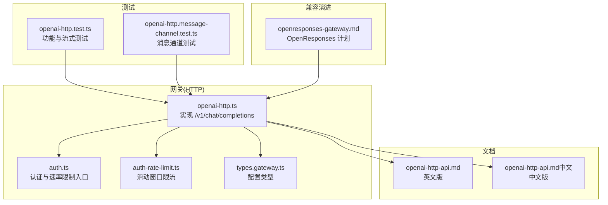
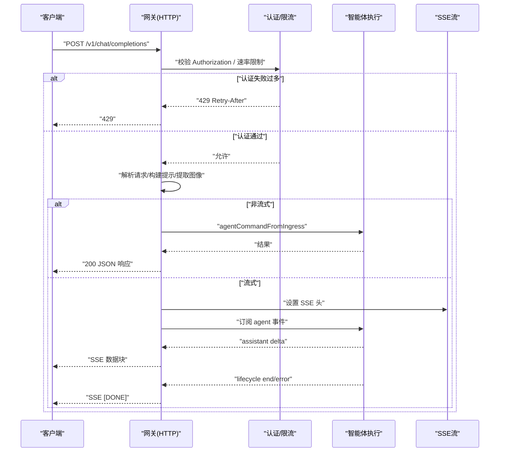
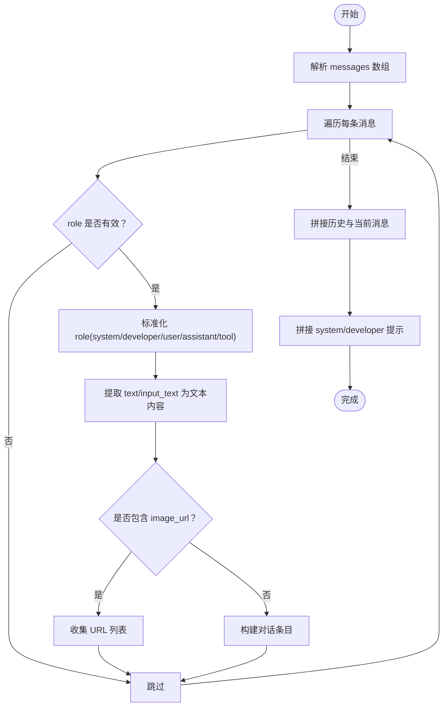
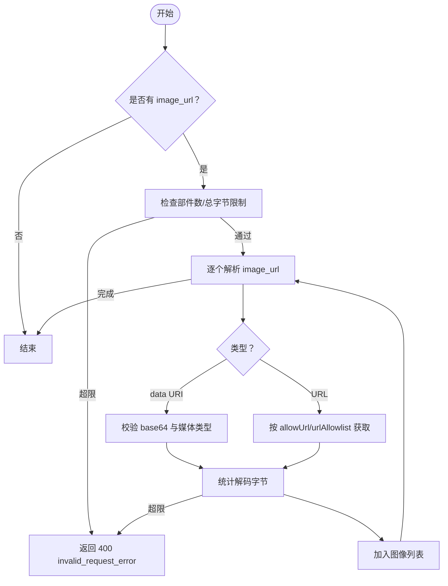
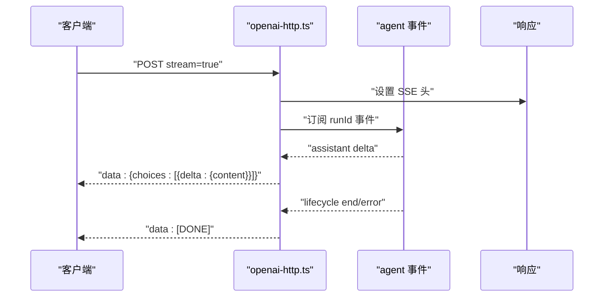
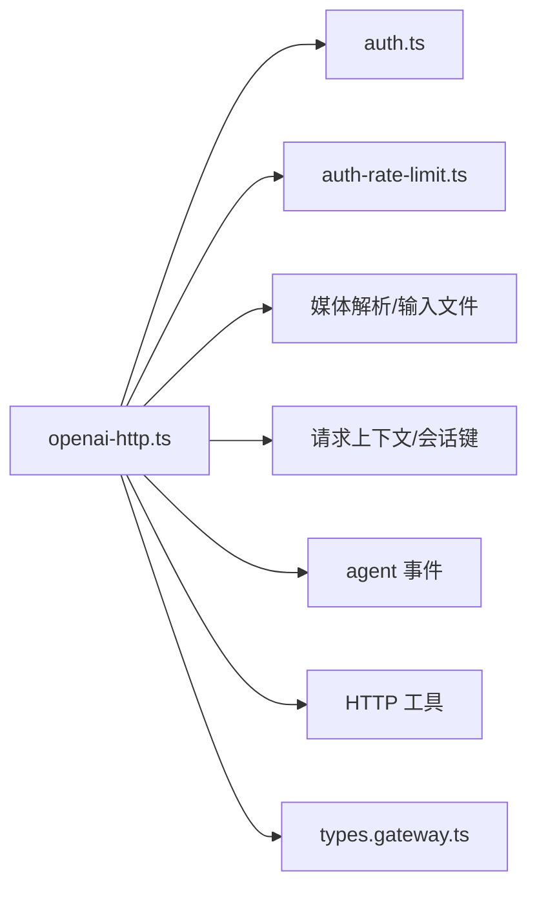

# OpenAI聊天完成API

<cite>
**本文档引用的文件**
- [openai-http.ts](file://src/gateway/openai-http.ts)
- [openai-http-api.md](file://docs/gateway/openai-http-api.md)
- [openai-http-api.md（中文）](file://docs/zh-CN/gateway/openai-http-api.md)
- [types.gateway.ts](file://src/config/types.gateway.ts)
- [auth-rate-limit.ts](file://src/gateway/auth-rate-limit.ts)
- [auth.ts](file://src/gateway/auth.ts)
- [openai-http.test.ts](file://src/gateway/openai-http.test.ts)
- [openai-http.message-channel.test.ts](file://src/gateway/openai-http.message-channel.test.ts)
- [openresponses-gateway.md](file://docs/experiments/plans/openresponses-gateway.md)
- [openresponses-gateway.md（中文）](file://docs/zh-CN/experiments/plans/openresponses-gateway.md)
</cite>

## 目录

1. [简介](#简介)
2. [项目结构](#项目结构)
3. [核心组件](#核心组件)
4. [架构总览](#架构总览)
5. [详细组件分析](#详细组件分析)
6. [依赖关系分析](#依赖关系分析)
7. [性能考量](#性能考量)
8. [故障排查指南](#故障排查指南)
9. [结论](#结论)
10. [附录](#附录)

## 简介

本文件面向使用 OpenAI 兼容的聊天完成接口（/v1/chat/completions）的开发者，系统性说明该端点的 HTTP 请求格式、参数规范、响应结构、消息格式转换、多模态输入（文本与图像）、流式响应（SSE）实现与错误处理机制，并给出认证方式、模型选择、限流策略以及实际的调用示例与最佳实践。该端点由 OpenClaw Gateway 网关提供，默认关闭，需在配置中显式启用。

## 项目结构

与 /v1/chat/completions 相关的核心文件与职责如下：

- 实现层：src/gateway/openai-http.ts
- 文档说明：docs/gateway/openai-http-api.md（英文）、docs/zh-CN/gateway/openai-http-api.md（中文）
- 配置类型：src/config/types.gateway.ts
- 认证与限流：src/gateway/auth.ts、src/gateway/auth-rate-limit.ts
- 行为测试：src/gateway/openai-http.test.ts、src/gateway/openai-http.message-channel.test.ts
- OpenResponses 计划（兼容演进方向）：docs/experiments/plans/openresponses-gateway.md（英文/中文）

**图表来源**

- [openai-http.ts:1-613](file://src/gateway/openai-http.ts#L1-L613)
- [auth.ts:448-485](file://src/gateway/auth.ts#L448-L485)
- [auth-rate-limit.ts:1-233](file://src/gateway/auth-rate-limit.ts#L1-L233)
- [types.gateway.ts:214-255](file://src/config/types.gateway.ts#L214-L255)
- [openai-http-api.md:1-133](file://docs/gateway/openai-http-api.md#L1-L133)
- [openai-http-api.md（中文）:1-126](file://docs/zh-CN/gateway/openai-http-api.md#L1-L126)
- [openai-http.test.ts:1-751](file://src/gateway/openai-http.test.ts#L1-L751)
- [openai-http.message-channel.test.ts:1-60](file://src/gateway/openai-http.message-channel.test.ts#L1-L60)
- [openresponses-gateway.md:1-71](file://docs/experiments/plans/openresponses-gateway.md#L1-L71)

**章节来源**

- [openai-http.ts:1-613](file://src/gateway/openai-http.ts#L1-L613)
- [openai-http-api.md:1-133](file://docs/gateway/openai-http-api.md#L1-L133)
- [openai-http-api.md（中文）:1-126](file://docs/zh-CN/gateway/openai-http-api.md#L1-L126)

## 核心组件

- 端点与路由
  - 方法与路径：POST /v1/chat/completions
  - 端口：与网关同一端口（HTTP/WS 复用）
  - 默认禁用，需通过配置开启
- 认证
  - 支持 Bearer Token（token/password 两种模式）
  - 可配置速率限制，失败过多返回 429 并带 Retry-After
- 会话行为
  - 默认每请求无状态（每次调用生成新会话键）
  - 若携带 OpenAI user 字段，则派生稳定会话键，便于跨请求共享会话
- 模型选择
  - 通过 OpenAI model 字段编码 agent id（如 openclaw:<agentId> 或 agent:<agentId>）
  - 或通过 x-openclaw-agent-id 头指定 agent
- 多模态输入
  - 支持 text 与 image_url（data URI base64 或受限 URL）
  - 图像数量与总字节有上限控制
- 流式响应（SSE）
  - stream=true 时返回 text/event-stream
  - 每条事件为 data: <json>，结束为 data: [DONE]
- 错误处理
  - 缺少用户消息：400 invalid_request_error
  - 图像内容无效：400 invalid_request_error
  - 内部错误：500 api_error
  - 认证失败过多：429 且带 Retry-After

**章节来源**

- [openai-http.ts:408-613](file://src/gateway/openai-http.ts#L408-L613)
- [openai-http-api.md:19-133](file://docs/gateway/openai-http-api.md#L19-L133)
- [openai-http-api.md（中文）:26-126](file://docs/zh-CN/gateway/openai-http-api.md#L26-L126)
- [types.gateway.ts:214-255](file://src/config/types.gateway.ts#L214-L255)
- [auth-rate-limit.ts:25-72](file://src/gateway/auth-rate-limit.ts#L25-L72)
- [auth.ts:448-485](file://src/gateway/auth.ts#L448-L485)

## 架构总览

下图展示了从客户端到网关、再到智能体执行与事件流的完整链路，以及关键的错误与限流路径。

**图表来源**

- [openai-http.ts:408-613](file://src/gateway/openai-http.ts#L408-L613)
- [auth.ts:448-485](file://src/gateway/auth.ts#L448-L485)
- [auth-rate-limit.ts:141-172](file://src/gateway/auth-rate-limit.ts#L141-L172)

## 详细组件分析

### 请求与参数规范

- 必填字段
  - model：用于选择 agent（如 openclaw:<agentId>）
  - messages：消息数组，支持 role 为 system/developer/user/assistant/tool，content 支持纯文本或包含 text 与 image_url 的数组
- 可选字段
  - stream：是否启用 SSE 流式输出
  - user：用于派生稳定会话键
  - 其他 OpenAI 兼容字段会被宽松解析（未强制校验）
- 头部
  - Authorization: Bearer <token>
  - Content-Type: application/json
  - x-openclaw-agent-id: <agentId>（可选，优先级低于 model）
  - x-openclaw-session-key: <sessionKey>（可选，完全控制会话）
  - x-openclaw-message-channel: <channel>（可选，透传到智能体执行）

**章节来源**

- [openai-http.ts:408-439](file://src/gateway/openai-http.ts#L408-L439)
- [openai-http-api.md:44-58](file://docs/gateway/openai-http-api.md#L44-L58)
- [openai-http-api.md（中文）:37-51](file://docs/zh-CN/gateway/openai-http-api.md#L37-L51)

### 消息格式转换

- 角色映射
  - system/developer → 系统提示拼接
  - user/assistant/tool → 转换为对话条目
  - function → 映射为 tool
- 内容提取
  - text：直接拼接
  - input_text：也视为文本
  - image_url：仅记录 URL 列表，后续统一解析为图像数据
- 图像占位符
  - 当仅含图像且为当前用户回合时，替换为“User sent image(s) with no text.”，避免历史图像被重复回放

**图表来源**

- [openai-http.ts:321-387](file://src/gateway/openai-http.ts#L321-L387)

**章节来源**

- [openai-http.ts:321-387](file://src/gateway/openai-http.ts#L321-L387)

### 多模态输入处理（文本与图像）

- 支持的数据类型
  - text：普通文本
  - input_text：输入文本（与 text 等价）
  - image_url：支持 data:image/<mime>;base64,<data> 与受限 URL
- 图像解析流程
  - 解析 data URI：校验 base64 与媒体类型
  - 解析 URL：受 allowUrl 与 urlAllowlist 控制
  - 统计解码后总字节，超过阈值则拒绝
- 限制与配置
  - 最大图像部件数、最大总解码字节数、MIME 白名单、单图最大字节、重定向次数、超时等
- 行为细节
  - 仅当前用户回合的图像才会带上真实数据，历史回合图像仅保留占位符

**图表来源**

- [openai-http.ts:279-314](file://src/gateway/openai-http.ts#L279-L314)
- [openai-http.ts:55-97](file://src/gateway/openai-http.ts#L55-L97)
- [types.gateway.ts:239-255](file://src/config/types.gateway.ts#L239-L255)

**章节来源**

- [openai-http.ts:279-314](file://src/gateway/openai-http.ts#L279-L314)
- [openai-http.ts:55-97](file://src/gateway/openai-http.ts#L55-L97)
- [types.gateway.ts:239-255](file://src/config/types.gateway.ts#L239-L255)

### 流式响应（SSE）实现

- 开启条件
  - stream=true
- 响应头
  - Content-Type: text/event-stream
  - 每行 data: <JSON>
  - 结束标记 data: [DONE]
- 事件流
  - 首次输出包含 role=assistant 的 chunk
  - 连续输出 content delta
  - 结束时触发 lifecycle end/error，随后发送 [DONE]
- 容错
  - 若智能体未产生任何 delta，仍会输出一次 role+content 的 fallback
  - 发生内部错误时，输出包含 finish_reason 的错误块并结束

**图表来源**

- [openai-http.ts:508-613](file://src/gateway/openai-http.ts#L508-L613)

**章节来源**

- [openai-http.ts:508-613](file://src/gateway/openai-http.ts#L508-L613)
- [openai-http.test.ts:639-749](file://src/gateway/openai-http.test.ts#L639-L749)

### 错误处理机制

- 请求级错误
  - 缺少 user 消息：400 invalid_request_error
  - 图像内容无效（非 base64 data URI 或超出限制）：400 invalid_request_error
- 认证级错误
  - 未提供凭据：401
  - 凭据错误且已配置速率限制：429 Retry-After
- 执行级错误
  - 非流式：500 api_error
  - 流式：输出包含 finish_reason 的错误块并结束

**章节来源**

- [openai-http.ts:444-466](file://src/gateway/openai-http.ts#L444-L466)
- [openai-http.ts:501-507](file://src/gateway/openai-http.ts#L501-L507)
- [openai-http.ts:585-609](file://src/gateway/openai-http.ts#L585-L609)
- [auth.ts:448-485](file://src/gateway/auth.ts#L448-L485)
- [auth-rate-limit.ts:141-172](file://src/gateway/auth-rate-limit.ts#L141-L172)

### 认证与限流策略

- 认证方式
  - token/password 两种模式，均通过 Bearer 令牌
  - 速率限制可配置，失败次数过多将被临时封禁
- 限流实现
  - 滑动窗口 + 固定锁定期
  - 支持按作用域区分（如共享密钥与设备令牌）
  - 可配置最大失败次数、窗口时长、锁定期、是否豁免本地回环地址
- 网关安全边界
  - 该端点为全操作员权限面，建议仅在内网/受控入口使用

**章节来源**

- [openai-http-api.md:19-42](file://docs/gateway/openai-http-api.md#L19-L42)
- [openai-http-api.md（中文）:26-36](file://docs/zh-CN/gateway/openai-http-api.md#L26-L36)
- [auth.ts:448-485](file://src/gateway/auth.ts#L448-L485)
- [auth-rate-limit.ts:25-72](file://src/gateway/auth-rate-limit.ts#L25-L72)
- [auth-rate-limit.ts:141-172](file://src/gateway/auth-rate-limit.ts#L141-L172)

### OpenAI 兼容性与演进方向

- 兼容性
  - 端点路径与基本字段与 OpenAI 兼容
  - 支持 SSE 流式输出
- 演进方向
  - 计划引入 OpenResponses /v1/responses 端点，逐步弃用 chat completions
  - 第一阶段对图片/文件等不支持的输入返回 invalid_request_error

**章节来源**

- [openresponses-gateway.md:1-71](file://docs/experiments/plans/openresponses-gateway.md#L1-L71)
- [openresponses-gateway.md（中文）:16-84](file://docs/zh-CN/experiments/plans/openresponses-gateway.md#L16-L84)

## 依赖关系分析

- 组件耦合
  - openai-http.ts 依赖认证与限流、媒体解析、会话上下文、事件系统与 HTTP 工具
  - 配置类型集中于 types.gateway.ts，便于统一管理
- 外部依赖
  - Node.js 内置 crypto/http
  - 测试依赖 Vitest 与网关测试辅助工具

**图表来源**

- [openai-http.ts:1-31](file://src/gateway/openai-http.ts#L1-L31)
- [types.gateway.ts:214-255](file://src/config/types.gateway.ts#L214-L255)

**章节来源**

- [openai-http.ts:1-31](file://src/gateway/openai-http.ts#L1-L31)
- [types.gateway.ts:214-255](file://src/config/types.gateway.ts#L214-L255)

## 性能考量

- 请求体大小限制：默认 20MB，可通过配置调整
- 图像处理成本：base64 解码与总字节统计，建议合理控制图像数量与尺寸
- 流式传输：SSE 适合长文本生成场景，减少一次性响应体积
- 限流策略：适度降低失败尝试次数与窗口时间，平衡安全性与可用性

[本节为通用指导，无需特定文件引用]

## 故障排查指南

- 404：端点未启用
  - 检查配置 gateway.http.endpoints.chatCompletions.enabled
- 401：缺少或错误的 Authorization
  - 确认 Bearer 令牌与认证模式（token/password）
- 429：认证失败过多
  - 查看 Retry-After，检查速率限制配置
- 400 invalid_request_error
  - 缺少 user 消息或图像内容无效
  - 检查 messages 结构与 image_url 格式
- 流式无输出
  - 确认 stream=true 且客户端正确解析 SSE
  - 检查智能体事件是否正常产生

**章节来源**

- [openai-http.test.ts:86-94](file://src/gateway/openai-http.test.ts#L86-L94)
- [openai-http.test.ts:596-637](file://src/gateway/openai-http.test.ts#L596-L637)
- [openai-http.test.ts:140-152](file://src/gateway/openai-http.test.ts#L140-L152)
- [openai-http.ts:444-466](file://src/gateway/openai-http.ts#L444-L466)
- [openai-http.ts:501-507](file://src/gateway/openai-http.ts#L501-L507)

## 结论

/v1/chat/completions 端点提供了与 OpenAI 兼容的聊天完成能力，具备完善的认证、限流、多模态输入与 SSE 流式输出支持。对于生产环境，建议启用内网访问控制与速率限制，合理配置图像与请求体限制，并在合适时机迁移到 OpenResponses /v1/responses 端点以获得更开放的推理标准支持。

[本节为总结，无需特定文件引用]

## 附录

### 请求与响应示例（路径引用）

- 非流式请求示例
  - [示例路径:107-118](file://docs/gateway/openai-http-api.md#L107-L118)
  - [示例路径（中文）:100-111](file://docs/zh-CN/gateway/openai-http-api.md#L100-L111)
- 流式请求示例
  - [示例路径:120-132](file://docs/gateway/openai-http-api.md#L120-L132)
  - [示例路径（中文）:113-125](file://docs/zh-CN/gateway/openai-http-api.md#L113-L125)

### 参数与配置参考

- 端点启用/禁用
  - [配置项:59-89](file://docs/gateway/openai-http-api.md#L59-L89)
  - [配置项（中文）:52-82](file://docs/zh-CN/gateway/openai-http-api.md#L52-L82)
- 请求体与图像限制
  - [类型定义:214-255](file://src/config/types.gateway.ts#L214-L255)
- 认证与限流
  - [认证逻辑:448-485](file://src/gateway/auth.ts#L448-L485)
  - [限流接口:59-72](file://src/gateway/auth-rate-limit.ts#L59-L72)
  - [限流实现:141-172](file://src/gateway/auth-rate-limit.ts#L141-L172)

### 实际调用与处理要点

- 选择 agent
  - model 字段或 x-openclaw-agent-id 头
  - [参考:44-58](file://docs/gateway/openai-http-api.md#L44-L58)
- 会话行为
  - user 字段派生稳定会话键
  - [参考:91-96](file://docs/gateway/openai-http-api.md#L91-L96)
- 消息通道透传
  - x-openclaw-message-channel
  - [测试覆盖:47-59](file://src/gateway/openai-http.message-channel.test.ts#L47-L59)
