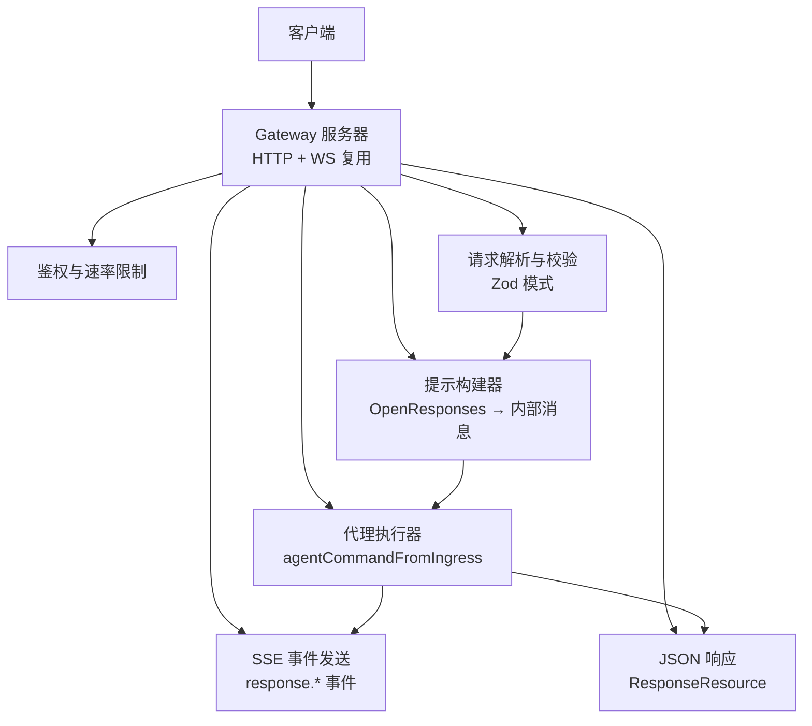
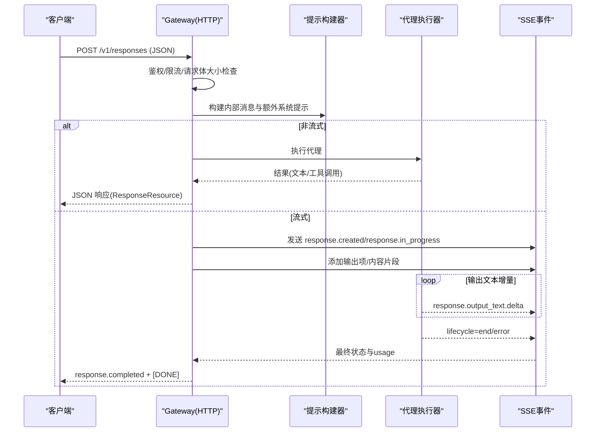
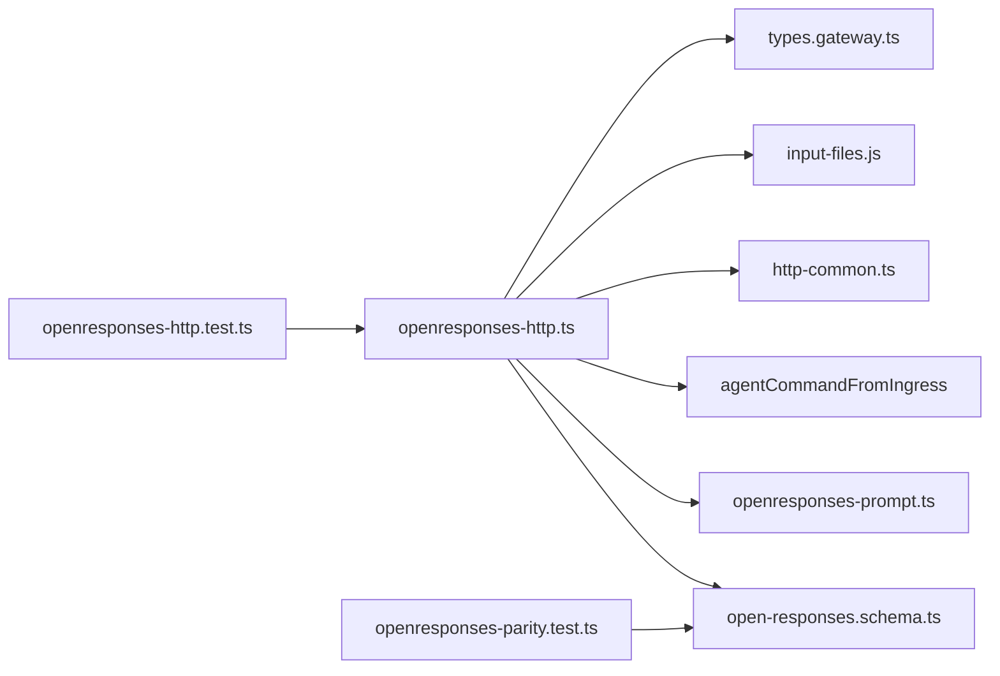

# OpenResponses API

<cite>
**本文引用的文件**
- [openresponses-http-api.md](file://docs/gateway/openresponses-http-api.md)
- [openresponses-http.ts](file://src/gateway/openresponses-http.ts)
- [open-responses.schema.ts](file://src/gateway/open-responses.schema.ts)
- [openresponses-prompt.ts](file://src/gateway/openresponses-prompt.ts)
- [openresponses-http.test.ts](file://src/gateway/openresponses-http.test.ts)
- [openresponses-parity.test.ts](file://src/gateway/openresponses-parity.test.ts)
- [types.gateway.ts](file://src/config/types.gateway.ts)
- [server.impl.ts](file://src/gateway/server.impl.ts)
- [openai-http-api.md](file://docs/gateway/openai-http-api.md)
</cite>

## 目录

1. [简介](#简介)
2. [项目结构](#项目结构)
3. [核心组件](#核心组件)
4. [架构总览](#架构总览)
5. [详细组件分析](#详细组件分析)
6. [依赖关系分析](#依赖关系分析)
7. [性能考量](#性能考量)
8. [故障排查指南](#故障排查指南)
9. [结论](#结论)
10. [附录](#附录)

## 简介

本文件为 OpenResponses API 的完整技术文档，面向希望在 OpenClaw Gateway 上集成 OpenResponses 兼容接口的开发者与运维人员。内容涵盖：

- HTTP 端点与请求/响应格式
- 消息与工具处理流程
- 流式传输（SSE）事件模型
- 配置项、认证与安全边界
- 错误处理与常见问题排查
- 与 OpenAI Chat Completions 的差异与迁移建议
- OpenResponses 特有参数、响应字段与使用场景

## 项目结构

OpenResponses API 在 OpenClaw Gateway 中以“HTTP 多路复用”的形式提供，与 WebSocket 控制面共享同一端口。其核心由以下模块组成：

- HTTP 请求处理器：负责解析请求、鉴权、限流、构建提示、触发代理运行、处理非流式与流式响应
- 模式定义：基于 Zod 的请求/响应与事件模式校验
- 提示构建器：将 OpenResponses 输入转换为内部代理可消费的消息与系统提示
- 配置类型：定义 HTTP 端点开关、输入限制、URL 白名单等
- 测试：覆盖请求解析、流式事件、URL 安全策略、功能对齐等

图表来源

- [openresponses-http.ts:265-800](file://src/gateway/openresponses-http.ts#L265-L800)
- [open-responses.schema.ts:181-206](file://src/gateway/open-responses.schema.ts#L181-L206)
- [openresponses-prompt.ts:25-71](file://src/gateway/openresponses-prompt.ts#L25-L71)

章节来源

- [openresponses-http-api.md:1-355](file://docs/gateway/openresponses-http-api.md#L1-L355)
- [openresponses-http.ts:1-847](file://src/gateway/openresponses-http.ts#L1-L847)
- [open-responses.schema.ts:1-362](file://src/gateway/open-responses.schema.ts#L1-L362)
- [openresponses-prompt.ts:1-71](file://src/gateway/openresponses-prompt.ts#L1-L71)

## 核心组件

- HTTP 处理器：实现 POST /v1/responses，支持鉴权、请求体大小限制、URL 来源输入解析、工具选择、会话路由、非流式与流式响应
- 模式定义：严格定义请求体、输出项、使用统计与 SSE 事件类型
- 提示构建器：将多轮对话、系统/开发者提示、文件/图片输入、函数调用结果等整合为内部消息
- 配置类型：定义 HTTP 端点开关、最大请求体、URL 数量上限、文件/图片输入限制、PDF 解析策略等
- 测试：验证请求解析、SSE 事件序列、URL 安全策略、工具选择、Turn-based 工具流程

章节来源

- [openresponses-http.ts:265-800](file://src/gateway/openresponses-http.ts#L265-L800)
- [open-responses.schema.ts:181-362](file://src/gateway/open-responses.schema.ts#L181-L362)
- [openresponses-prompt.ts:25-71](file://src/gateway/openresponses-prompt.ts#L25-L71)
- [types.gateway.ts:257-326](file://src/config/types.gateway.ts#L257-L326)
- [openresponses-http.test.ts:1-664](file://src/gateway/openresponses-http.test.ts#L1-L664)
- [openresponses-parity.test.ts:1-320](file://src/gateway/openresponses-parity.test.ts#L1-L320)

## 架构总览

OpenResponses HTTP 端点与 OpenAI Chat Completions 共享相同的后端执行路径（agentCommandFromIngress），但请求格式与事件模型不同。OpenResponses 支持：

- item-based 输入（消息、图片、文件、函数调用结果）
- 客户端侧工具定义与选择
- SSE 流式事件
- 会话键稳定化（基于 user 字段）

图表来源

- [openresponses-http.ts:472-800](file://src/gateway/openresponses-http.ts#L472-L800)
- [open-responses.schema.ts:287-362](file://src/gateway/open-responses.schema.ts#L287-L362)

章节来源

- [openresponses-http-api.md:1-355](file://docs/gateway/openresponses-http-api.md#L1-L355)
- [openresponses-http.ts:265-800](file://src/gateway/openresponses-http.ts#L265-L800)

## 详细组件分析

### HTTP 端点与请求/响应

- 端点：POST /v1/responses
- 默认禁用，需通过配置开启
- 认证：Bearer Token 或密码（与 Gateway 全局鉴权一致）
- 请求体字段（支持与忽略）：
  - 支持：model、input（字符串或 item 数组）、instructions、tools、tool_choice、stream、max_output_tokens、user
  - 接受但忽略：max_tool_calls、reasoning、metadata、store、previous_response_id、truncation 等
- 响应资源（ResponseResource）：
  - id、object、created_at、status、model、output（数组，元素为 message 或 function_call）、usage、error（可选）
- 使用统计（usage）：当底层提供方返回时填充

章节来源

- [openresponses-http-api.md:100-120](file://docs/gateway/openresponses-http-api.md#L100-L120)
- [open-responses.schema.ts:181-206](file://src/gateway/open-responses.schema.ts#L181-L206)
- [open-responses.schema.ts:264-281](file://src/gateway/open-responses.schema.ts#L264-L281)

### 消息与工具处理

- 输入项（ItemParam）：
  - message（role: system/developer/user/assistant；content 可为字符串或内容部件数组）
  - function_call_output（用于 Turn-based 工具回传）
  - reasoning、item_reference（兼容性接受，不参与提示构建）
- 内容部件（ContentPart）：
  - input_text、output_text、input_image、input_file
- 工具定义（ToolDefinition）：
  - function 类型，包含 name、description、parameters
- 工具选择（tool_choice）：
  - auto、none、required、指定函数名
  - 当 tool_choice=required 且未提供 tools 时返回 400
  - 当 tool_choice 指定未知函数名时返回 400
- 提示构建：
  - system/developer 角色内容合并为额外系统提示
  - user/assistant 轮次转为历史上下文
  - function_call_output 转为工具输出条目
  - reasoning/item_reference 在当前阶段被忽略（保留用于后续扩展）

章节来源

- [open-responses.schema.ts:95-143](file://src/gateway/open-responses.schema.ts#L95-L143)
- [open-responses.schema.ts:151-163](file://src/gateway/open-responses.schema.ts#L151-L163)
- [open-responses.schema.ts:171-179](file://src/gateway/open-responses.schema.ts#L171-L179)
- [openresponses-prompt.ts:25-71](file://src/gateway/openresponses-prompt.ts#L25-L71)

### 图像与文件输入

- input_image：
  - 支持 URL 与 base64；允许 MIME 类型包括 jpeg/png/gif/webp/heic/heif
  - 默认最大 10MB；可配置 allowUrl、urlAllowlist、maxBytes、maxRedirects、timeoutMs
- input_file：
  - 支持 URL 与 base64；允许 MIME 类型包括 text/plain、text/markdown、text/html、text/csv、application/json、application/pdf
  - 默认最大 5MB；可配置 maxBytes、maxChars、pdf 解析策略（maxPages、maxPixels、minTextChars）
- 行为：
  - 文件内容解码后作为“系统提示”附加，不进入会话历史
  - PDF 文本不足时将前几页光栅化为图片并传入模型
- URL 安全：
  - 默认允许 URL；可配置 allowlist；对私网/内部地址进行阻断
  - 对 metadata.google.internal 等敏感主机默认拒绝
  - URL 数量上限（maxUrlParts）防止滥用

章节来源

- [openresponses-http-api.md:154-286](file://docs/gateway/openresponses-http-api.md#L154-L286)
- [open-responses.schema.ts:30-83](file://src/gateway/open-responses.schema.ts#L30-L83)
- [types.gateway.ts:279-326](file://src/config/types.gateway.ts#L279-L326)

### 流式传输（SSE）事件

- Content-Type: text/event-stream
- 事件类型（当前实现）：
  - response.created、response.in_progress
  - response.output_item.added、response.content_part.added
  - response.output_text.delta
  - response.output_text.done、response.content_part.done、response.output_item.done
  - response.completed、response.failed
- 事件一致性：事件对象的 type 字段与事件名称一致
- 终止：以 data: [DONE] 结束

章节来源

- [openresponses-http-api.md:288-308](file://docs/gateway/openresponses-http-api.md#L288-L308)
- [open-responses.schema.ts:287-362](file://src/gateway/open-responses.schema.ts#L287-L362)
- [openresponses-http.test.ts:500-582](file://src/gateway/openresponses-http.test.ts#L500-L582)

### 会话行为与路由

- 默认无状态：每次请求生成新的会话键
- user 字符串：派生稳定会话键，使多次请求可共享同一会话
- agent 选择：
  - model: "openclaw:<agentId>" 或 "agent:<agentId>"
  - x-openclaw-agent-id 头可直接指定 agentId
- 消息通道：默认 webchat，可通过头控制（当前实现未使用）

章节来源

- [openresponses-http-api.md:93-110](file://docs/gateway/openresponses-http-api.md#L93-L110)
- [openresponses-http.ts:429-436](file://src/gateway/openresponses-http.ts#L429-L436)

### 配置与启用

- 启用端点：
  - gateway.http.endpoints.responses.enabled=true
- 关键配置项（gateway.http.endpoints.responses.\*）：
  - enabled、maxBodyBytes、maxUrlParts
  - files: allowUrl、urlAllowlist、allowedMimes、maxBytes、maxChars、maxRedirects、timeoutMs、pdf.maxPages/pdf.maxPixels/pdf.minTextChars
  - images: allowUrl、urlAllowlist、allowedMimes、maxBytes、maxRedirects、timeoutMs
- 服务器启动选项：
  - openResponsesEnabled：用于测试或动态控制

章节来源

- [openresponses-http-api.md:61-91](file://docs/gateway/openresponses-http-api.md#L61-L91)
- [types.gateway.ts:257-326](file://src/config/types.gateway.ts#L257-L326)
- [server.impl.ts:240-243](file://src/gateway/server.impl.ts#L240-L243)

### 认证与安全边界

- 认证方式：Bearer Token 或密码（与 Gateway 全局鉴权一致）
- 速率限制：失败次数过多返回 429 并带 Retry-After
- 安全边界：该端点被视为“全操作员权限”面，鉴权通过即视为可信操作者，具备与受信任操作者相同的控制平面能力
- 建议：仅在本地回环/内网暴露，避免直接向公网开放

章节来源

- [openresponses-http-api.md:21-44](file://docs/gateway/openresponses-http-api.md#L21-L44)

### 错误处理

- 鉴权失败：401
- 方法错误：405（非 POST）
- 请求体无效：400（invalid_request_error）
- 工具配置错误：400（invalid tool configuration）
- 内部错误：500（api_error）
- 错误响应格式：{ error: { message, type } }

章节来源

- [openresponses-http-api.md:313-327](file://docs/gateway/openresponses-http-api.md#L313-L327)
- [openresponses-http.ts:296-300](file://src/gateway/openresponses-http.ts#L296-L300)
- [openresponses-http.ts:424-428](file://src/gateway/openresponses-http.ts#L424-L428)

### 与 OpenAI Chat Completions 的差异与迁移

- 端点与方法：
  - OpenAI: POST /v1/chat/completions
  - OpenResponses: POST /v1/responses
- 请求体字段：
  - OpenAI: messages（数组，每项含 role/content）
  - OpenResponses: input（字符串或 item 数组），支持 system/developer/user/assistant 角色与内容部件
- 工具与流式：
  - OpenAI: tools/messages/stream
  - OpenResponses: tools/tool_choice/stream；SSE 事件模型不同
- 会话与 agent：
  - 两者均通过 model/x-openclaw-agent-id 指定 agent
- 迁移建议：
  - 将 messages 映射到 input 的 message item
  - 将工具定义从 OpenAI 的 tools 移植到 OpenResponses 的 tools
  - 将流式处理替换为 SSE 事件序列
  - 若需 Turn-based 工具，使用 function_call_output 回传工具结果

章节来源

- [openai-http-api.md:1-133](file://docs/gateway/openai-http-api.md#L1-L133)
- [openresponses-http-api.md:1-355](file://docs/gateway/openresponses-http-api.md#L1-L355)

## 依赖关系分析

- 处理器依赖：
  - Zod 模式：CreateResponseBodySchema、OutputItemSchema、UsageSchema、StreamingEvent 类型
  - 提示构建器：buildAgentPrompt
  - 代理执行器：agentCommandFromIngress
  - SSE 工具：setSseHeaders、writeDone、writeSseEvent
  - 输入解析：extractImageContentFromSource、extractFileContentFromSource
- 配置依赖：
  - GatewayHttpResponsesConfig、GatewayHttpEndpointsConfig
- 测试依赖：
  - 测试助手：emitAgentEvent、buildAssistantDeltaResult
  - 端到端测试：SSE 事件解析、URL 安全策略、工具选择

图表来源

- [openresponses-http.ts:1-847](file://src/gateway/openresponses-http.ts#L1-L847)
- [open-responses.schema.ts:1-362](file://src/gateway/open-responses.schema.ts#L1-L362)
- [openresponses-prompt.ts:1-71](file://src/gateway/openresponses-prompt.ts#L1-L71)
- [types.gateway.ts:257-326](file://src/config/types.gateway.ts#L257-L326)
- [openresponses-http.test.ts:1-664](file://src/gateway/openresponses-http.test.ts#L1-L664)
- [openresponses-parity.test.ts:1-320](file://src/gateway/openresponses-parity.test.ts#L1-L320)

章节来源

- [openresponses-http.ts:1-847](file://src/gateway/openresponses-http.ts#L1-L847)
- [open-responses.schema.ts:1-362](file://src/gateway/open-responses.schema.ts#L1-L362)
- [openresponses-prompt.ts:1-71](file://src/gateway/openresponses-prompt.ts#L1-L71)
- [types.gateway.ts:257-326](file://src/config/types.gateway.ts#L257-L326)
- [openresponses-http.test.ts:1-664](file://src/gateway/openresponses-http.test.ts#L1-L664)
- [openresponses-parity.test.ts:1-320](file://src/gateway/openresponses-parity.test.ts#L1-L320)

## 性能考量

- 流式优先：SSE 可降低首字延迟，提升交互体验
- 输入限制：合理设置 maxBodyBytes、maxUrlParts、文件/图片大小与 PDF 渲染阈值，避免资源滥用
- URL 安全：通过 allowlist 与私网阻断减少外部依赖与潜在风险
- 会话键稳定：对高频用户使用 user 字段派生稳定会话，有助于上下文复用与缓存

## 故障排查指南

- 404：端点未启用或路径错误
- 401：缺少/错误的 Bearer Token 或密码
- 400：请求体不符合 Zod 模式；检查 model、input、tools/tool_choice、max_output_tokens 等字段
- 405：方法错误（非 POST）
- 429：鉴权失败过多，触发速率限制
- SSE 无事件：确认 stream=true、网络连接未中断、事件类型与数据解析正确
- Turn-based 工具未返回 function_call：检查工具选择与代理是否决定调用工具

章节来源

- [openresponses-http.test.ts:154-183](file://src/gateway/openresponses-http.test.ts#L154-L183)
- [openresponses-http.test.ts:185-498](file://src/gateway/openresponses-http.test.ts#L185-L498)
- [openresponses-http.test.ts:500-582](file://src/gateway/openresponses-http.test.ts#L500-L582)
- [openresponses-http.ts:296-300](file://src/gateway/openresponses-http.ts#L296-L300)
- [openresponses-http.ts:424-428](file://src/gateway/openresponses-http.ts#L424-L428)

## 结论

OpenResponses API 在 OpenClaw Gateway 中提供了与 OpenAI Chat Completions 不同的 item-based 输入与 SSE 事件模型，适合需要细粒度内容部件、Turn-based 工具与更丰富事件流的场景。通过严格的模式校验、URL 安全策略与会话路由，可在保证安全的前提下灵活扩展代理能力。

## 附录

### 请求示例（非流式与流式）

- 非流式
  - curl -sS http://127.0.0.1:18789/v1/responses -H 'Authorization: Bearer YOUR_TOKEN' -H 'Content-Type: application/json' -H 'x-openclaw-agent-id: main' -d '{ "model": "openclaw", "input": "hi" }'
- 流式
  - curl -N http://127.0.0.1:18789/v1/responses -H 'Authorization: Bearer YOUR_TOKEN' -H 'Content-Type: application/json' -H 'x-openclaw-agent-id: main' -d '{ "model": "openclaw", "stream": true, "input": "hi" }'

章节来源

- [openresponses-http-api.md:329-355](file://docs/gateway/openresponses-http-api.md#L329-L355)

### OpenResponses 特有参数与响应字段

- 请求体特有：input（字符串或 item 数组）、instructions、tools、tool_choice、max_output_tokens、user
- 响应体特有：object="response"、output（数组，元素为 message/function_call）、usage、error（可选）
- SSE 特有：response.created、response.in_progress、response.output_item.added、response.content_part.added、response.output_text.delta、response.output_text.done、response.content_part.done、response.output_item.done、response.completed、response.failed

章节来源

- [open-responses.schema.ts:181-206](file://src/gateway/open-responses.schema.ts#L181-L206)
- [open-responses.schema.ts:264-281](file://src/gateway/open-responses.schema.ts#L264-L281)
- [open-responses.schema.ts:287-362](file://src/gateway/open-responses.schema.ts#L287-L362)
