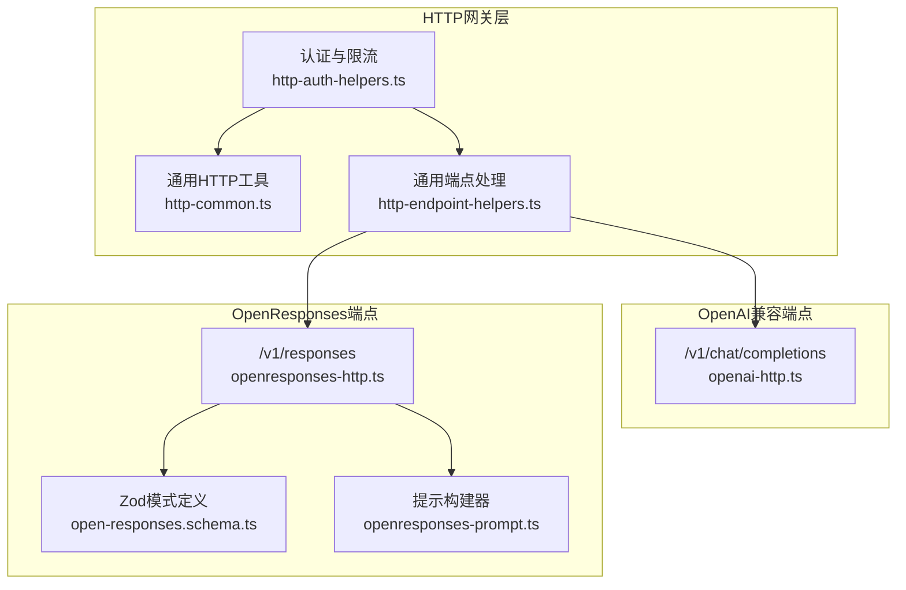
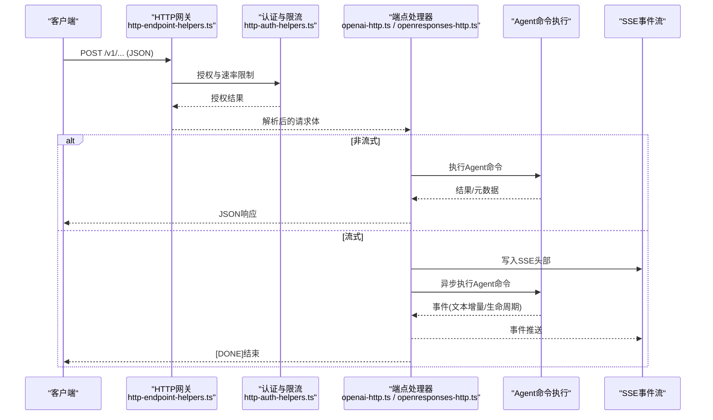
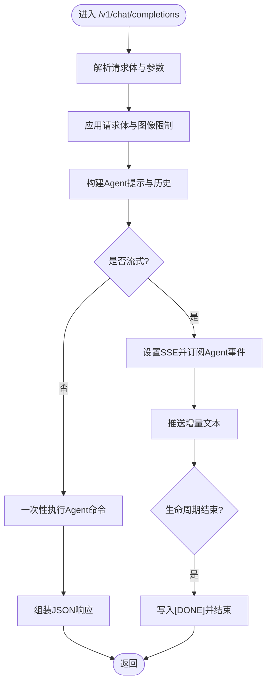
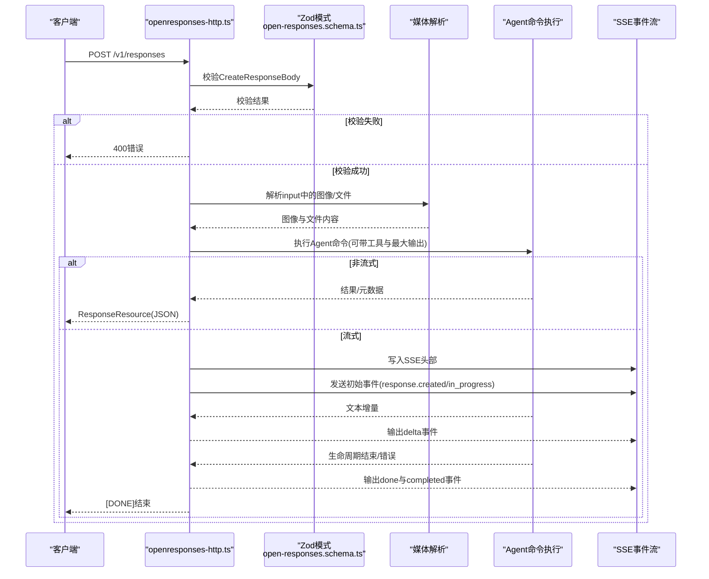
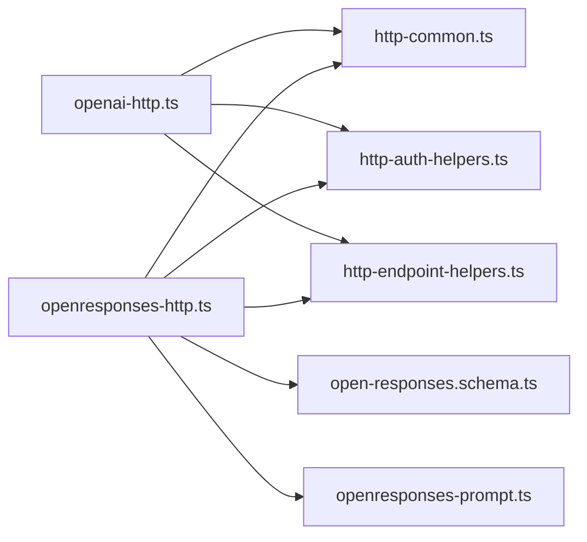

# 模型提供商API

<cite>
**本文引用的文件**
- [openai-http-api.md](file://docs/gateway/openai-http-api.md)
- [openresponses-http-api.md](file://docs/gateway/openresponses-http-api.md)
- [openai-http.ts](file://src/gateway/openai-http.ts)
- [openresponses-http.ts](file://src/gateway/openresponses-http.ts)
- [open-responses.schema.ts](file://src/gateway/open-responses.schema.ts)
- [openresponses-prompt.ts](file://src/gateway/openresponses-prompt.ts)
- [http-common.ts](file://src/gateway/http-common.ts)
- [http-auth-helpers.ts](file://src/gateway/http-auth-helpers.ts)
- [http-endpoint-helpers.ts](file://src/gateway/http-endpoint-helpers.ts)
- [test-openai-responses-model.ts](file://src/gateway/test-openai-responses-model.ts)
</cite>

## 目录

1. [简介](#简介)
2. [项目结构](#项目结构)
3. [核心组件](#核心组件)
4. [架构总览](#架构总览)
5. [详细组件分析](#详细组件分析)
6. [依赖关系分析](#依赖关系分析)
7. [性能考量](#性能考量)
8. [故障排查指南](#故障排查指南)
9. [结论](#结论)
10. [附录](#附录)

## 简介

本文件面向OpenClaw模型提供商API，系统性说明两类HTTP端点：OpenAI兼容的聊天补全端点与OpenResponses标准的响应端点。内容覆盖端点定义、请求/响应格式、消息与工具处理、流式SSE响应、版本控制与参数映射、错误处理、认证与安全边界、限流与缓存策略、监控指标建议，以及集成示例与最佳实践。

## 项目结构

OpenClaw在“网关”层提供HTTP接口，统一接入认证、请求解析、会话路由与代理执行，并通过事件流输出结果。OpenAI兼容端点与OpenResponses端点共享通用的HTTP基础设施，分别在不同模块中实现。

图表来源

- [openai-http.ts:1-613](file://src/gateway/openai-http.ts#L1-L613)
- [openresponses-http.ts:1-847](file://src/gateway/openresponses-http.ts#L1-L847)
- [open-responses.schema.ts:1-362](file://src/gateway/open-responses.schema.ts#L1-L362)
- [openresponses-prompt.ts:1-71](file://src/gateway/openresponses-prompt.ts#L1-L71)
- [http-common.ts:1-109](file://src/gateway/http-common.ts#L1-L109)
- [http-auth-helpers.ts:1-30](file://src/gateway/http-auth-helpers.ts#L1-L30)
- [http-endpoint-helpers.ts:1-48](file://src/gateway/http-endpoint-helpers.ts#L1-L48)

章节来源

- [openai-http-api.md:1-133](file://docs/gateway/openai-http-api.md#L1-L133)
- [openresponses-http-api.md:1-355](file://docs/gateway/openresponses-http-api.md#L1-L355)

## 核心组件

- 认证与限流：基于Bearer Token的授权流程，支持速率限制与重试头。
- 通用HTTP工具：JSON发送、SSE头部、错误码封装。
- 通用端点处理：路径匹配、方法校验、JSON体读取与大小限制。
- OpenAI兼容端点：/v1/chat/completions，支持非流与SSE流式。
- OpenResponses端点：/v1/responses，支持item-based输入、客户端工具、SSE事件流。
- 模式与提示：OpenResponses使用Zod模式校验请求；提示构建器将输入转换为内部对话格式。

章节来源

- [http-auth-helpers.ts:1-30](file://src/gateway/http-auth-helpers.ts#L1-L30)
- [http-common.ts:1-109](file://src/gateway/http-common.ts#L1-L109)
- [http-endpoint-helpers.ts:1-48](file://src/gateway/http-endpoint-helpers.ts#L1-L48)
- [openai-http.ts:1-613](file://src/gateway/openai-http.ts#L1-L613)
- [openresponses-http.ts:1-847](file://src/gateway/openresponses-http.ts#L1-L847)
- [open-responses.schema.ts:1-362](file://src/gateway/open-responses.schema.ts#L1-L362)
- [openresponses-prompt.ts:1-71](file://src/gateway/openresponses-prompt.ts#L1-L71)

## 架构总览

下图展示从HTTP请求到Agent执行再到SSE事件或JSON响应的整体流程。

图表来源

- [http-endpoint-helpers.ts:7-47](file://src/gateway/http-endpoint-helpers.ts#L7-L47)
- [http-auth-helpers.ts:7-29](file://src/gateway/http-auth-helpers.ts#L7-L29)
- [openai-http.ts:408-612](file://src/gateway/openai-http.ts#L408-L612)
- [openresponses-http.ts:265-800](file://src/gateway/openresponses-http.ts#L265-L800)
- [http-common.ts:102-108](file://src/gateway/http-common.ts#L102-L108)

## 详细组件分析

### OpenAI兼容聊天补全（/v1/chat/completions）

- 端点启用与禁用：通过配置项开启/关闭。
- 认证：Bearer Token，支持速率限制返回Retry-After。
- 会话行为：默认每请求无状态；可通过user字段派生稳定会话键。
- 请求体字段：model、messages、stream、user等。
- 响应：非流返回完整响应；流式返回SSE，逐段推送delta，最后[DONE]。
- 图像输入：支持messages中的image_url，解析为base64或URL，受图像限制约束。
- 错误：400无效请求、401未授权、405方法不被允许、500内部错误。

图表来源

- [openai-http.ts:408-612](file://src/gateway/openai-http.ts#L408-L612)
- [openai-http-api.md:100-132](file://docs/gateway/openai-http-api.md#L100-L132)

章节来源

- [openai-http-api.md:1-133](file://docs/gateway/openai-http-api.md#L1-L133)
- [openai-http.ts:1-613](file://src/gateway/openai-http.ts#L1-L613)

### OpenResponses响应（/v1/responses）

- 端点启用与禁用：独立配置开关。
- 认证：同上。
- 会话行为：默认每请求无状态；可通过user派生稳定会话键。
- 请求体字段：model、input（字符串或Item数组）、instructions、tools、tool_choice、stream、max_output_tokens、user等。
- 输入类型：message、function_call_output、reasoning、item_reference；当前阶段reasoning与item_reference用于模式兼容但不参与提示构建。
- 客户端工具：tools为function工具定义；tool_choice可限制工具选择。
- 文件与图像：支持URL与base64两种来源，受MIME白名单与大小限制；PDF解析与图片提取逻辑由媒体模块负责。
- 流式事件：response.created、response.in_progress、response.output_item.added、response.content_part.added、response.output_text.delta、response.output_text.done、response.content_part.done、response.output_item.done、response.completed、response.failed。
- 响应资源：包含id、object、created_at、status、model、output（消息或function_call）、usage等。
- 错误：400无效请求体、401未授权、405方法不被允许、500内部错误。

图表来源

- [openresponses-http.ts:265-800](file://src/gateway/openresponses-http.ts#L265-L800)
- [open-responses.schema.ts:181-206](file://src/gateway/open-responses.schema.ts#L181-L206)
- [openresponses-prompt.ts:25-70](file://src/gateway/openresponses-prompt.ts#L25-L70)

章节来源

- [openresponses-http-api.md:1-355](file://docs/gateway/openresponses-http-api.md#L1-L355)
- [openresponses-http.ts:1-847](file://src/gateway/openresponses-http.ts#L1-L847)
- [open-responses.schema.ts:1-362](file://src/gateway/open-responses.schema.ts#L1-L362)
- [openresponses-prompt.ts:1-71](file://src/gateway/openresponses-prompt.ts#L1-L71)

### 参数映射与版本控制

- OpenAI兼容端点：messages映射为内部提示；image_url映射为图像输入；user映射为会话键派生。
- OpenResponses端点：input（字符串或Item数组）映射为提示；instructions合并为系统提示；tools与tool_choice映射为客户端工具；stream映射为SSE事件流；max_output_tokens映射为最大输出令牌数。
- 版本控制：OpenResponses规范要求Content-Type为text/event-stream，事件行以event: <type>与data: <json>形式，最终以data: [DONE]结束。OpenAI兼容端点同样遵循SSE格式。

章节来源

- [openai-http.ts:321-387](file://src/gateway/openai-http.ts#L321-L387)
- [openresponses-http.ts:438-462](file://src/gateway/openresponses-http.ts#L438-L462)
- [openresponses-http-api.md:288-307](file://docs/gateway/openresponses-http-api.md#L288-L307)
- [openai-http-api.md:97-103](file://docs/gateway/openai-http-api.md#L97-L103)

### 错误处理机制

- 通用错误：400无效请求、401未授权、405方法不被允许、413负载过大、408请求超时、429速率限制。
- 端点特定：OpenAI兼容端点对无效image_url与缺失用户消息返回400；OpenResponses端点对无效请求体、工具配置错误、缺失用户消息返回400；内部错误返回500。
- 速率限制：当认证失败过多时返回429并携带Retry-After。

章节来源

- [http-common.ts:47-96](file://src/gateway/http-common.ts#L47-L96)
- [openai-http.ts:447-466](file://src/gateway/openai-http.ts#L447-L466)
- [openresponses-http.ts:292-300](file://src/gateway/openresponses-http.ts#L292-L300)
- [openresponses-http.ts:404-410](file://src/gateway/openresponses-http.ts#L404-L410)
- [openresponses-http.ts:422-428](file://src/gateway/openresponses-http.ts#L422-L428)
- [openresponses-http.ts:454-462](file://src/gateway/openresponses-http.ts#L454-L462)

### 认证与安全边界

- 认证：Bearer Token；支持token/password两种模式；速率限制触发后返回429。
- 安全边界：该端点视为网关实例的全操作员权限面，不应暴露至公网；建议仅在内网/私有入口使用。
- 会话与代理：请求经由同一Agent执行路径，具备与受信任操作者相同的控制平面能力；若目标Agent策略允许敏感工具，该端点亦可使用。

章节来源

- [openai-http-api.md:19-42](file://docs/gateway/openai-http-api.md#L19-L42)
- [openresponses-http-api.md:21-44](file://docs/gateway/openresponses-http-api.md#L21-L44)

### 会话与消息处理

- 会话键：默认每请求生成新会话；若请求包含user字段，则从user派生稳定会话键，便于复用Agent会话。
- 消息历史：OpenAI兼容端点将messages映射为系统提示与对话历史；OpenResponses端点将input中的message与function_call_output映射为对话历史，assistant与user角色标准化。
- 工具调用：OpenResponses端点支持客户端工具定义与调用；当Agent决定调用工具时，返回function_call，需由客户端发送function_call_output继续回合。

章节来源

- [openai-http.ts:434-441](file://src/gateway/openai-http.ts#L434-L441)
- [openresponses-http.ts:429-436](file://src/gateway/openresponses-http.ts#L429-L436)
- [openresponses-prompt.ts:36-62](file://src/gateway/openresponses-prompt.ts#L36-L62)

### 流式响应（SSE）

- OpenAI兼容端点：Content-Type为text/event-stream；事件行形如data: <json>；以data: [DONE]结束。
- OpenResponses端点：事件类型包括response.created、response.in_progress、response.output_item.added、response.content_part.added、response.output_text.delta、response.output_text.done、response.content_part.done、response.output_item.done、response.completed、response.failed；事件行以event: <type>与data: <json>形式，最终以data: [DONE]结束。

章节来源

- [openai-http-api.md:97-103](file://docs/gateway/openai-http-api.md#L97-L103)
- [openresponses-http-api.md:288-307](file://docs/gateway/openresponses-http-api.md#L288-L307)
- [openai-http.ts:99-101](file://src/gateway/openai-http.ts#L99-L101)
- [openresponses-http.ts:61-64](file://src/gateway/openresponses-http.ts#L61-L64)

### 配置与示例

- 启用/禁用端点：通过配置项开启对应端点；OpenAI兼容端点与OpenResponses端点可独立开关。
- 示例：提供非流式与流式的curl示例，包含必要的头部与请求体字段。

章节来源

- [openai-http-api.md:59-89](file://docs/gateway/openai-http-api.md#L59-L89)
- [openresponses-http-api.md:61-91](file://docs/gateway/openresponses-http-api.md#L61-L91)
- [openai-http-api.md:105-132](file://docs/gateway/openai-http-api.md#L105-L132)
- [openresponses-http-api.md:327-354](file://docs/gateway/openresponses-http-api.md#L327-L354)

## 依赖关系分析

- 组件耦合：端点处理器依赖通用HTTP工具与认证限流；OpenResponses端点额外依赖Zod模式与提示构建器。
- 外部依赖：媒体解析模块负责图像/文件的来源解析与限制；Agent执行模块负责实际推理与事件发布。
- 可能的循环依赖：模式定义模块与端点处理器解耦，避免直接导入网关其他模块，降低循环风险。

图表来源

- [openai-http.ts:1-613](file://src/gateway/openai-http.ts#L1-L613)
- [openresponses-http.ts:1-847](file://src/gateway/openresponses-http.ts#L1-L847)
- [open-responses.schema.ts:1-362](file://src/gateway/open-responses.schema.ts#L1-L362)
- [openresponses-prompt.ts:1-71](file://src/gateway/openresponses-prompt.ts#L1-L71)
- [http-common.ts:1-109](file://src/gateway/http-common.ts#L1-L109)
- [http-auth-helpers.ts:1-30](file://src/gateway/http-auth-helpers.ts#L1-L30)
- [http-endpoint-helpers.ts:1-48](file://src/gateway/http-endpoint-helpers.ts#L1-L48)

章节来源

- [openai-http.ts:1-613](file://src/gateway/openai-http.ts#L1-L613)
- [openresponses-http.ts:1-847](file://src/gateway/openresponses-http.ts#L1-L847)
- [open-responses.schema.ts:1-362](file://src/gateway/open-responses.schema.ts#L1-L362)
- [openresponses-prompt.ts:1-71](file://src/gateway/openresponses-prompt.ts#L1-L71)
- [http-common.ts:1-109](file://src/gateway/http-common.ts#L1-L109)
- [http-auth-helpers.ts:1-30](file://src/gateway/http-auth-helpers.ts#L1-L30)
- [http-endpoint-helpers.ts:1-48](file://src/gateway/http-endpoint-helpers.ts#L1-L48)

## 性能考量

- 限流与速率限制：启用认证速率限制，避免暴力尝试；在高并发场景下建议前置反向代理或WAF进行DDoS防护。
- 负载与超时：合理设置请求体大小上限与读取超时，防止大体积请求导致内存压力。
- 流式传输：优先使用SSE流式响应，减少长连接占用与延迟；确保客户端及时消费事件。
- 媒体处理：对图像/文件的MIME类型、大小与URL数量进行严格限制，避免过大的媒体内容影响性能。
- 缓存策略：对于静态内容与非敏感响应，可在反向代理层启用短期缓存；对流式SSE响应不建议缓存。
- 监控指标：建议采集请求量、错误率、响应时间、流式事件速率、媒体处理耗时、Agent执行耗时等指标。

[本节为通用性能建议，无需列出章节来源]

## 故障排查指南

- 401未授权：检查Bearer Token是否正确；确认网关认证模式与密钥配置；查看速率限制是否触发。
- 400无效请求：核对请求体字段与类型；OpenAI兼容端点注意messages格式与image_url；OpenResponses端点注意input、tools与tool_choice。
- 405方法不被允许：确认使用POST方法访问对应端点。
- 413/408：请求体过大或读取超时，调整maxBodyBytes与网络超时设置。
- 429速率限制：降低请求频率或增加重试退避；检查Retry-After头。
- 流式无输出：确认客户端正确处理SSE事件；检查Agent事件订阅与生命周期回调。

章节来源

- [http-common.ts:47-96](file://src/gateway/http-common.ts#L47-L96)
- [openai-http.ts:447-466](file://src/gateway/openai-http.ts#L447-L466)
- [openresponses-http.ts:292-300](file://src/gateway/openresponses-http.ts#L292-L300)
- [openresponses-http.ts:404-410](file://src/gateway/openresponses-http.ts#L404-L410)
- [openresponses-http.ts:422-428](file://src/gateway/openresponses-http.ts#L422-L428)
- [openresponses-http.ts:454-462](file://src/gateway/openresponses-http.ts#L454-L462)

## 结论

OpenClaw通过统一的HTTP网关层为OpenAI兼容与OpenResponses标准提供了标准化接入方式。OpenAI兼容端点适合快速迁移现有OpenAI生态；OpenResponses端点则提供更丰富的item-based输入与语义化SSE事件，更适合智能体工作流。通过严格的认证、限流、媒体限制与事件流设计，系统在安全性与性能之间取得平衡。建议在生产环境中结合反向代理、WAF与监控体系，持续优化端到端体验。

[本节为总结性内容，无需列出章节来源]

## 附录

### API端点对照表

- OpenAI兼容聊天补全
  - 方法：POST
  - 路径：/v1/chat/completions
  - 认证：Bearer Token
  - 主要参数：model、messages、stream、user
  - 响应：JSON（非流）或SSE（流式）

- OpenResponses响应
  - 方法：POST
  - 路径：/v1/responses
  - 认证：Bearer Token
  - 主要参数：model、input、instructions、tools、tool_choice、stream、max_output_tokens、user
  - 响应：JSON（非流）或SSE（流式）

章节来源

- [openai-http-api.md:14-17](file://docs/gateway/openai-http-api.md#L14-L17)
- [openresponses-http-api.md:15-19](file://docs/gateway/openresponses-http-api.md#L15-L19)

### 集成示例（步骤指引）

- OpenAI兼容端点
  - 启用端点：在配置中将gateway.http.endpoints.chatCompletions.enabled设为true。
  - 发送请求：使用Bearer Token与x-openclaw-agent-id指定Agent；非流式或流式均可。
- OpenResponses端点
  - 启用端点：在配置中将gateway.http.endpoints.responses.enabled设为true。
  - 发送请求：使用Bearer Token；input支持字符串或Item数组；可选tools与tool_choice；流式SSE事件按规范接收。

章节来源

- [openai-http-api.md:59-89](file://docs/gateway/openai-http-api.md#L59-L89)
- [openresponses-http-api.md:61-91](file://docs/gateway/openresponses-http-api.md#L61-L91)
- [openai-http-api.md:105-132](file://docs/gateway/openai-http-api.md#L105-L132)
- [openresponses-http-api.md:327-354](file://docs/gateway/openresponses-http-api.md#L327-L354)

### 测试模型配置（参考）

- 提供测试模型与提供商配置的构建函数，便于单元测试与集成验证。

章节来源

- [test-openai-responses-model.ts:1-21](file://src/gateway/test-openai-responses-model.ts#L1-L21)
