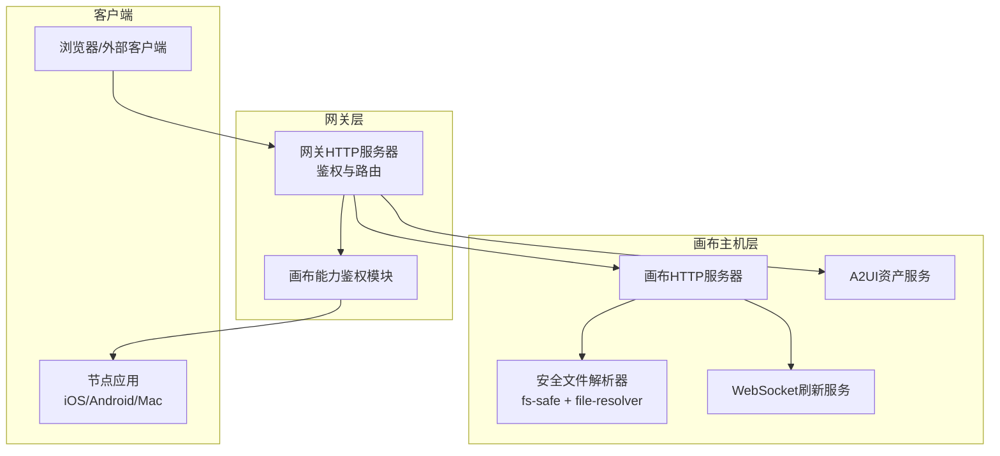
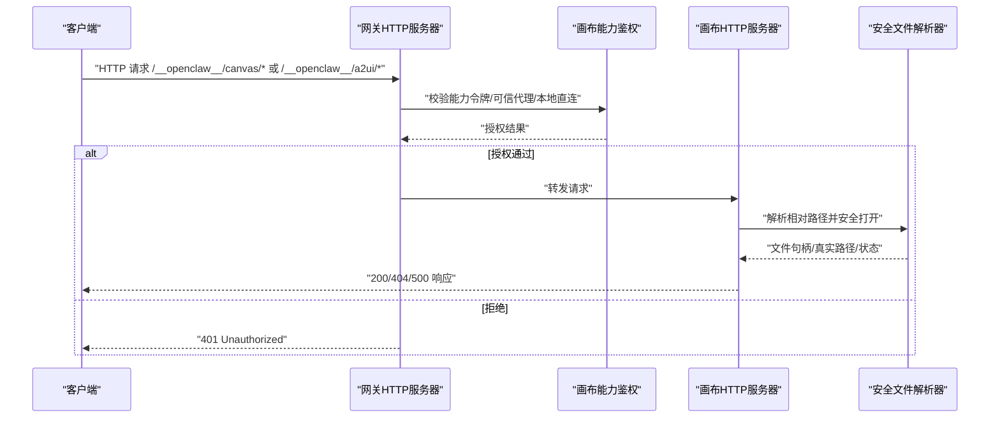
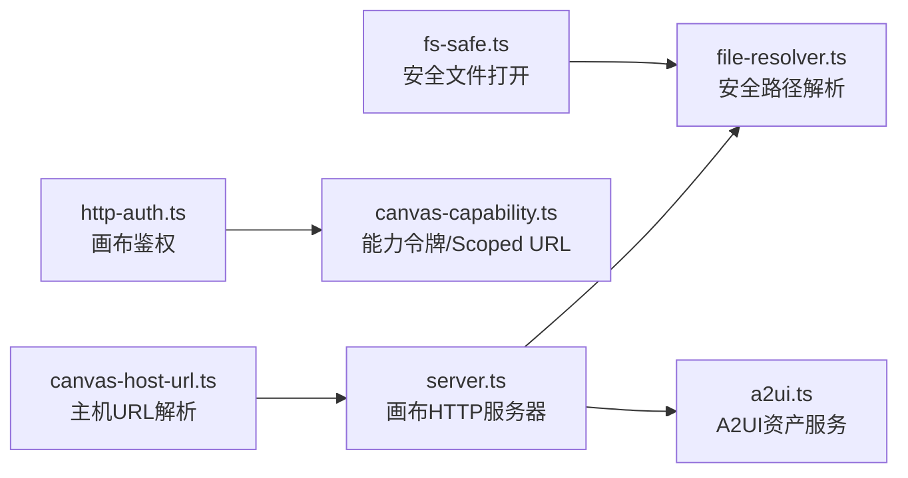

# 画布API

<cite>
**本文引用的文件**
- [server.ts](file://src/canvas-host/server.ts)
- [a2ui.ts](file://src/canvas-host/a2ui.ts)
- [file-resolver.ts](file://src/canvas-host/file-resolver.ts)
- [canvas-capability.ts](file://src/gateway/canvas-capability.ts)
- [http-auth.ts](file://src/gateway/server/http-auth.ts)
- [server.canvas-auth.test.ts](file://src/gateway/server.canvas-auth.test.ts)
- [canvas-host-url.ts](file://src/infra/canvas-host-url.ts)
- [fs-safe.ts](file://src/infra/fs-safe.ts)
- [SKILL.md](file://skills/canvas/SKILL.md)
- [canvas.md](file://docs/platforms/mac/canvas.md)
</cite>

## 目录

1. [简介](#简介)
2. [项目结构](#项目结构)
3. [核心组件](#核心组件)
4. [架构总览](#架构总览)
5. [详细组件分析](#详细组件分析)
6. [依赖关系分析](#依赖关系分析)
7. [性能考量](#性能考量)
8. [故障排除指南](#故障排除指南)
9. [结论](#结论)
10. [附录](#附录)

## 简介

本文件系统性地文档化 OpenClaw 画布（Canvas）API，覆盖画布主机的 HTTP 端点、请求格式与响应结构；画布能力验证、权限控制与安全机制；画布路径处理、作用域管理与访问控制；完整的请求示例、参数说明与集成方法；以及安全策略、性能考虑与故障排除建议。目标是帮助开发者与运维人员快速理解并正确使用画布能力。

## 项目结构

画布能力由“画布主机”（Canvas Host）与“网关鉴权层”（Gateway Auth）协同实现：

- 画布主机：提供静态资源服务、WebSocket 实时刷新、A2UI 资产托管等能力。
- 网关鉴权层：对画布相关请求进行能力范围授权、可信代理校验、速率限制等。
- 安全边界：通过安全文件打开与路径解析、硬链接/符号链接防护、根目录隔离等机制保障。

图表来源

- [server.ts:415-478](file://src/canvas-host/server.ts#L415-L478)
- [a2ui.ts:142-210](file://src/canvas-host/a2ui.ts#L142-L210)
- [http-auth.ts:58-83](file://src/gateway/server/http-auth.ts#L58-L83)
- [fs-safe.ts:177-210](file://src/infra/fs-safe.ts#L177-L210)

章节来源

- [server.ts:1-479](file://src/canvas-host/server.ts#L1-L479)
- [a2ui.ts:1-210](file://src/canvas-host/a2ui.ts#L1-L210)
- [canvas-capability.ts:1-88](file://src/gateway/canvas-capability.ts#L1-L88)
- [http-auth.ts:34-83](file://src/gateway/server/http-auth.ts#L34-L83)
- [fs-safe.ts:177-210](file://src/infra/fs-safe.ts#L177-L210)

## 核心组件

- 画布主机 HTTP 服务器
  - 提供静态资源服务、基础路径裁剪、方法限制、错误处理与 MIME 推断。
  - 支持 A2UI 资产直通与注入式 WebSocket 刷新脚本。
- 画布能力作用域与令牌
  - 生成能力令牌、构建带能力的 Scoped URL、规范化 Scoped URL。
- 网关鉴权与访问控制
  - 基于能力令牌的节点级授权、本地直连豁免、可信代理头校验、滑动过期。
- 安全文档与路径解析
  - 安全打开文件、拒绝符号链接、禁止路径逃逸、硬链接检测、根目录隔离。
- URL 规范与主机地址解析
  - 解析暴露端口、HTTPS/TLS 场景下的端口映射、主机名与协议推断。

章节来源

- [server.ts:205-397](file://src/canvas-host/server.ts#L205-L397)
- [canvas-capability.ts:20-87](file://src/gateway/canvas-capability.ts#L20-L87)
- [http-auth.ts:34-83](file://src/gateway/server/http-auth.ts#L34-L83)
- [fs-safe.ts:177-210](file://src/infra/fs-safe.ts#L177-L210)
- [canvas-host-url.ts:57-93](file://src/infra/canvas-host-url.ts#L57-L93)

## 架构总览

画布 API 的请求流从浏览器或外部客户端发起，经网关鉴权后到达画布主机；若启用 A2UI 或 Live Reload，则在 HTML 注入 WebSocket 客户端以实现自动刷新。

图表来源

- [server.canvas-auth.test.ts:196-280](file://src/gateway/server.canvas-auth.test.ts#L196-L280)
- [http-auth.ts:58-83](file://src/gateway/server/http-auth.ts#L58-L83)
- [server.ts:301-379](file://src/canvas-host/server.ts#L301-L379)
- [file-resolver.ts:11-50](file://src/canvas-host/file-resolver.ts#L11-L50)

## 详细组件分析

### 画布主机 HTTP 服务器

- 基础路径与方法限制
  - 仅允许 GET/HEAD；非基础路径前缀返回 404。
  - 支持自定义 basePath（默认为画布前缀），自动去除多余斜杠。
- 静态资源服务
  - 自动注入 Live Reload 脚本（当启用）；根据扩展名推断 MIME 类型。
  - 目录访问回退到 index.html；符号链接与目录直接访问均被拒绝。
- 错误处理
  - 文件不存在、读取异常统一返回 404/500，并记录运行时日志。
- WebSocket 升级
  - 仅在启用 Live Reload 时接受升级；否则返回 426 或 404。

章节来源

- [server.ts:168-175](file://src/canvas-host/server.ts#L168-L175)
- [server.ts:301-379](file://src/canvas-host/server.ts#L301-L379)
- [server.ts:415-478](file://src/canvas-host/server.ts#L415-L478)
- [file-resolver.ts:11-50](file://src/canvas-host/file-resolver.ts#L11-L50)

### A2UI 资产服务

- A2UI 路径前缀固定，支持 GET/HEAD；HTML 注入 Live Reload 脚本。
- 未找到 A2UI 资产时返回 503；HEAD 请求仅返回内容类型与空体。
- 与画布主机共享同一 HTTP 服务器实例，优先匹配 A2UI 前缀。

章节来源

- [a2ui.ts:14-17](file://src/canvas-host/a2ui.ts#L14-L17)
- [a2ui.ts:142-210](file://src/canvas-host/a2ui.ts#L142-L210)

### 画布能力作用域与令牌

- 能力令牌生成与 Scoped URL 构建
  - 令牌长度与字符集满足安全要求；将能力编码进路径前缀。
- Scoped URL 规范化
  - 识别路径前缀、解码能力、重写查询参数、标记畸形路径。
- 过期与滑动过期
  - 能力令牌具备 TTL；连接中的节点使用期间会滑动延长过期时间。

章节来源

- [canvas-capability.ts:20-40](file://src/gateway/canvas-capability.ts#L20-L40)
- [canvas-capability.ts:42-87](file://src/gateway/canvas-capability.ts#L42-L87)

### 网关鉴权与访问控制

- 授权判定
  - 恶意/畸形 Scoped 路径直接拒绝；本地直连（受信任代理）放行。
  - 其他场景需匹配已连接节点的画布能力令牌，且未过期。
- 可信代理与客户端 IP
  - 通过 Forwarded/Host/X-Forwarded-\* 等头部推断真实来源；IPv6/IPv4 均支持。
- 速率限制
  - 可选速率限制器用于保护鉴权阶段。

章节来源

- [http-auth.ts:34-56](file://src/gateway/server/http-auth.ts#L34-L56)
- [http-auth.ts:58-83](file://src/gateway/server/http-auth.ts#L58-L83)
- [server.canvas-auth.test.ts:196-280](file://src/gateway/server.canvas-auth.test.ts#L196-L280)

### 安全文档与路径解析

- 安全打开文件
  - 拒绝目录、符号链接、硬链接；严格校验真实路径与根目录边界。
  - 打开失败时抛出明确错误码，避免越界与信息泄露。
- 路径解析
  - 规范化 URL 路径、拒绝父目录穿越；目录访问回退至 index.html。

章节来源

- [fs-safe.ts:177-210](file://src/infra/fs-safe.ts#L177-L210)
- [fs-safe.ts:20-37](file://src/infra/fs-safe.ts#L20-L37)
- [file-resolver.ts:5-9](file://src/canvas-host/file-resolver.ts#L5-L9)
- [file-resolver.ts:11-50](file://src/canvas-host/file-resolver.ts#L11-L50)

### URL 规范与主机地址解析

- 主机地址解析
  - 支持 host/forwardedProto/localAddress/scheme 组合推断最终暴露 URL。
  - 在特定代理场景下（如 Tailscale Serve）自动映射端口。
- 画布 URL 结构
  - 默认前缀为固定常量；可配置 basePath；WebSocket 路径固定。

章节来源

- [canvas-host-url.ts:57-93](file://src/infra/canvas-host-url.ts#L57-L93)
- [a2ui.ts:8-12](file://src/canvas-host/a2ui.ts#L8-L12)

## 依赖关系分析

图表来源

- [server.ts:1-40](file://src/canvas-host/server.ts#L1-L40)
- [file-resolver.ts:1-51](file://src/canvas-host/file-resolver.ts#L1-L51)
- [a2ui.ts:1-210](file://src/canvas-host/a2ui.ts#L1-L210)
- [http-auth.ts:1-83](file://src/gateway/server/http-auth.ts#L1-L83)
- [canvas-capability.ts:1-88](file://src/gateway/canvas-capability.ts#L1-L88)
- [fs-safe.ts:1-800](file://src/infra/fs-safe.ts#L1-L800)
- [canvas-host-url.ts:1-94](file://src/infra/canvas-host-url.ts#L1-L94)

## 性能考量

- Live Reload
  - 启用时通过 chokidar 监听文件变更，去抖后向所有连接的 WebSocket 客户端广播刷新消息；测试模式降低延迟阈值。
- MIME 推断与缓存
  - 静态资源响应设置 Cache-Control: no-store；HTML 注入脚本按需注入。
- 文件系统操作
  - 读取前先 lstat 判断类型，避免不必要的 IO；拒绝符号链接与硬链接，减少潜在攻击面。

章节来源

- [server.ts:224-285](file://src/canvas-host/server.ts#L224-L285)
- [server.ts:355-370](file://src/canvas-host/server.ts#L355-L370)
- [fs-safe.ts:81-153](file://src/infra/fs-safe.ts#L81-L153)

## 故障排除指南

- 白屏/内容不加载
  - 检查网关绑定模式与暴露 URL 是否一致；确保使用与绑定模式匹配的主机名与端口。
- “node required”或“node not connected”
  - 使用画布工具时必须指定节点 ID；确认节点在线并具备相应能力。
- Live Reload 不生效
  - 确认配置中启用 liveReload；检查文件是否位于画布根目录；关注日志中的 watcher 错误。
- 权限被拒（401）
  - 确认请求是否来自受信任代理；检查能力令牌是否正确传递；确认节点仍处于连接状态且未过期。
- 路径逃逸/符号链接/硬链接
  - 画布主机与安全文件解析器会拒绝此类访问；请将资源放置在根目录内并移除符号链接。

章节来源

- [SKILL.md:151-199](file://skills/canvas/SKILL.md#L151-L199)
- [canvas.md:121-126](file://docs/platforms/mac/canvas.md#L121-L126)
- [server.canvas-auth.test.ts:282-306](file://src/gateway/server.canvas-auth.test.ts#L282-L306)
- [fs-safe.ts:177-210](file://src/infra/fs-safe.ts#L177-L210)

## 结论

OpenClaw 画布 API 通过“画布主机 + 网关鉴权”的分层设计，在保证安全的前提下提供了灵活的静态资源服务与实时刷新能力。能力令牌与作用域控制确保了最小权限原则，结合安全文件解析与路径边界检查，有效降低了越权与注入风险。合理配置可信代理与暴露 URL，可进一步提升跨网络环境的可用性与安全性。

## 附录

### API 端点与请求格式

- 画布静态资源
  - 方法：GET/HEAD
  - 路径：/**openclaw**/canvas/{\*}
  - 响应：200（成功）、404（未找到）、500（内部错误）
  - 头部：Content-Type 根据扩展名推断；Cache-Control: no-store
- A2UI 资产
  - 方法：GET/HEAD
  - 路径：/**openclaw**/a2ui/{\*}
  - 响应：200（成功）、404（未找到）、503（A2UI资源缺失）
- WebSocket 刷新
  - 路径：/**openclaw**/ws
  - 升级条件：仅在启用 Live Reload 时接受；否则返回 426 或 404

章节来源

- [server.ts:301-379](file://src/canvas-host/server.ts#L301-L379)
- [a2ui.ts:142-210](file://src/canvas-host/a2ui.ts#L142-L210)

### 权限控制与安全机制

- 能力令牌
  - 生成：随机字节经 URL 安全编码
  - 使用：作为查询参数或路径前缀的一部分
  - 过期：TTL 滑动更新，保持活跃节点的持续访问
- 作用域与路径
  - Scoped URL 将能力嵌入路径前缀；规范化流程确保能力提取与重写
- 可信代理与本地直连
  - 本地直连豁免；受信任代理需提供正确的来源头
- 安全文件访问
  - 拒绝符号链接、硬链接；根目录隔离；路径逃逸检测

章节来源

- [canvas-capability.ts:20-87](file://src/gateway/canvas-capability.ts#L20-L87)
- [http-auth.ts:34-83](file://src/gateway/server/http-auth.ts#L34-L83)
- [fs-safe.ts:177-210](file://src/infra/fs-safe.ts#L177-L210)

### 画布路径处理与作用域管理

- 基础路径裁剪
  - 自动去除多余斜杠；支持自定义 basePath
- 目录回退
  - 目录访问回退到 index.html；非 HTML 文件按原扩展名返回
- A2UI 注入
  - HTML 注入 WebSocket 刷新脚本与用户动作桥接函数

章节来源

- [server.ts:168-175](file://src/canvas-host/server.ts#L168-L175)
- [server.ts:316-345](file://src/canvas-host/server.ts#L316-L345)
- [a2ui.ts:81-140](file://src/canvas-host/a2ui.ts#L81-L140)

### 访问控制与集成方法

- 画布工具调用
  - 支持 present/hide/navigate/eval/snapshot/a2ui_push/a2ui_reset 等动作
  - 参数校验与网关调用封装，返回标准化结果
- URL 构造
  - 根据网关绑定模式构造画布 URL；必要时使用能力令牌
- Live Reload
  - 开发阶段推荐开启；生产环境可根据需要关闭

章节来源

- [canvas-tool.ts:80-216](file://src/agents/tools/canvas-tool.ts#L80-L216)
- [SKILL.md:181-199](file://skills/canvas/SKILL.md#L181-L199)
