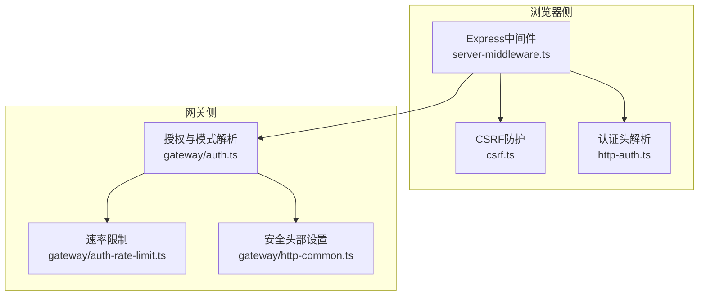
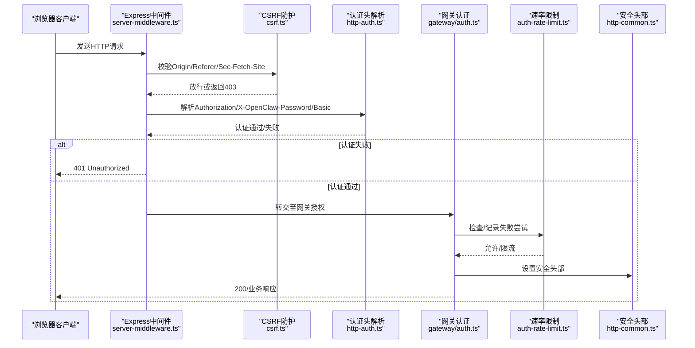
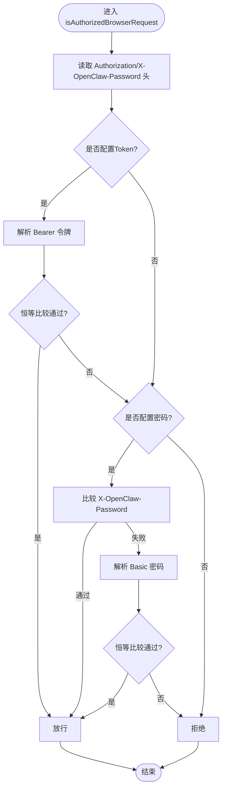
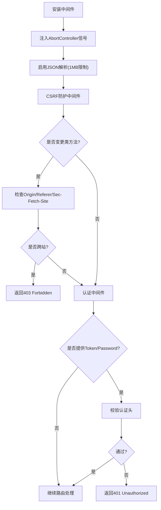
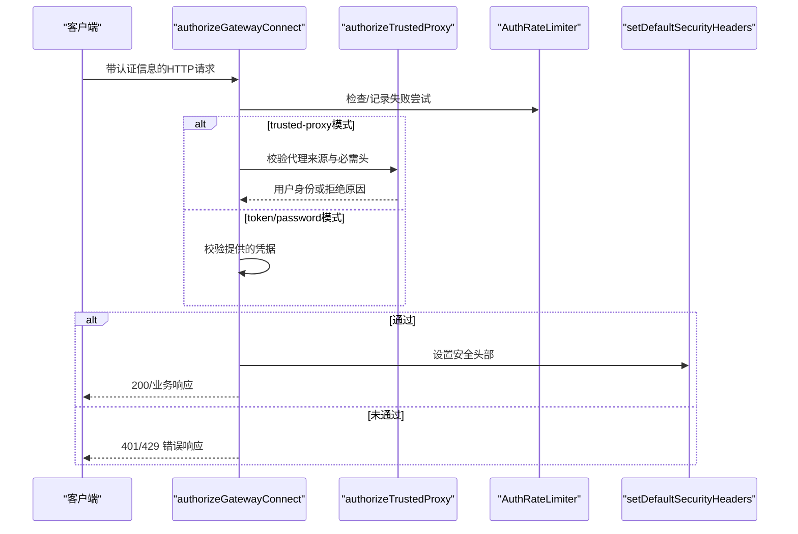
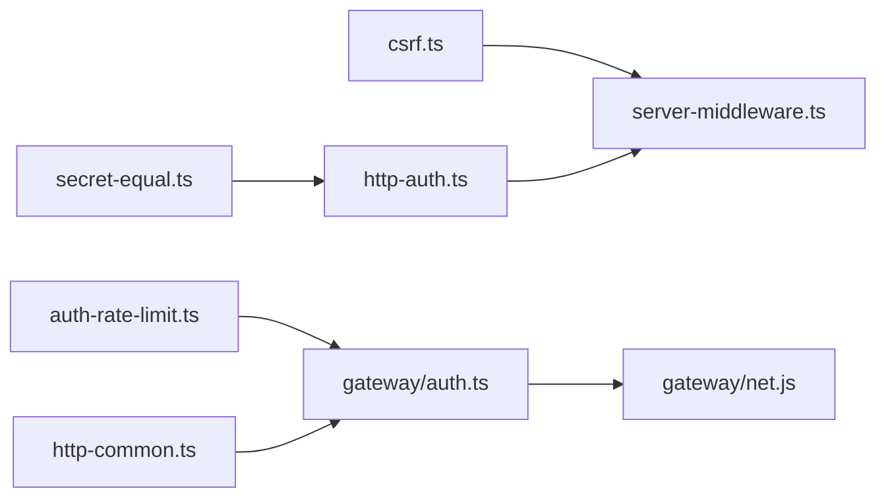

# HTTP认证

<cite>
**本文档引用的文件**
- [src/browser/http-auth.ts](file://src/browser/http-auth.ts)
- [src/browser/server-middleware.ts](file://src/browser/server-middleware.ts)
- [src/browser/csrf.ts](file://src/browser/csrf.ts)
- [src/gateway/auth.ts](file://src/gateway/auth.ts)
- [src/gateway/auth-rate-limit.ts](file://src/gateway/auth-rate-limit.ts)
- [src/gateway/http-common.ts](file://src/gateway/http-common.ts)
- [src/gateway/server.plugin-http-auth.test.ts](file://src/gateway/server.plugin-http-auth.test.ts)
- [src/gateway/http-common.test.ts](file://src/gateway/http-common.test.ts)
- [src/security/secret-equal.ts](file://src/security/secret-equal.ts)
</cite>

## 目录

1. [简介](#简介)
2. [项目结构](#项目结构)
3. [核心组件](#核心组件)
4. [架构总览](#架构总览)
5. [详细组件分析](#详细组件分析)
6. [依赖关系分析](#依赖关系分析)
7. [性能考量](#性能考量)
8. [故障排查指南](#故障排查指南)
9. [结论](#结论)
10. [附录](#附录)

## 简介

本文件面向OpenClaw的HTTP认证系统，系统性阐述浏览器与网关之间的HTTP请求认证处理流程、头部验证与会话管理策略。内容覆盖：

- 认证头解析（Bearer Token、Basic认证、自定义密码头）
- 请求上下文与安全头部设置
- HTTP认证中间件与失败处理、重定向策略
- 完整请求示例、错误响应与调试方法
- 安全最佳实践与防护措施

## 项目结构

OpenClaw将HTTP认证能力分为两层：

- 浏览器侧：Express中间件负责请求拦截、CSRF防护与认证头校验
- 网关侧：统一认证授权逻辑、可信代理与速率限制、安全头部设置

图表来源

- [src/browser/server-middleware.ts:1-38](file://src/browser/server-middleware.ts#L1-L38)
- [src/browser/csrf.ts:1-88](file://src/browser/csrf.ts#L1-L88)
- [src/browser/http-auth.ts:1-64](file://src/browser/http-auth.ts#L1-L64)
- [src/gateway/auth.ts:1-504](file://src/gateway/auth.ts#L1-L504)
- [src/gateway/auth-rate-limit.ts:1-233](file://src/gateway/auth-rate-limit.ts#L1-L233)
- [src/gateway/http-common.ts:1-109](file://src/gateway/http-common.ts#L1-L109)

章节来源

- [src/browser/server-middleware.ts:1-38](file://src/browser/server-middleware.ts#L1-L38)
- [src/gateway/auth.ts:1-504](file://src/gateway/auth.ts#L1-L504)

## 核心组件

- 浏览器HTTP认证模块：解析Authorization头、Basic认证、自定义密码头，使用恒等比较进行安全比对
- 浏览器HTTP中间件：安装通用中间件、CSRF防护与认证中间件，统一401响应
- 网关HTTP认证模块：解析认证模式（none/token/password/trusted-proxy）、可信代理校验、速率限制、安全头部设置
- 安全工具：恒等比较函数，避免时序攻击

章节来源

- [src/browser/http-auth.ts:1-64](file://src/browser/http-auth.ts#L1-L64)
- [src/browser/server-middleware.ts:1-38](file://src/browser/server-middleware.ts#L1-L38)
- [src/gateway/auth.ts:1-504](file://src/gateway/auth.ts#L1-L504)
- [src/gateway/auth-rate-limit.ts:1-233](file://src/gateway/auth-rate-limit.ts#L1-L233)
- [src/gateway/http-common.ts:1-109](file://src/gateway/http-common.ts#L1-L109)
- [src/security/secret-equal.ts:1-13](file://src/security/secret-equal.ts#L1-L13)

## 架构总览

下图展示从浏览器到网关的认证请求流，包括中间件、认证与安全头部设置：

图表来源

- [src/browser/server-middleware.ts:24-37](file://src/browser/server-middleware.ts#L24-L37)
- [src/browser/csrf.ts:57-87](file://src/browser/csrf.ts#L57-L87)
- [src/browser/http-auth.ts:37-63](file://src/browser/http-auth.ts#L37-L63)
- [src/gateway/auth.ts:378-485](file://src/gateway/auth.ts#L378-L485)
- [src/gateway/auth-rate-limit.ts:95-232](file://src/gateway/auth-rate-limit.ts#L95-L232)
- [src/gateway/http-common.ts:11-22](file://src/gateway/http-common.ts#L11-L22)

## 详细组件分析

### 浏览器HTTP认证头解析

- 支持的认证方式
  - Bearer Token：Authorization以"Bearer "前缀开头，提取令牌后进行恒等比较
  - Basic认证：Authorization以"Basic "前缀，Base64解码后按":"分割取密码，再进行恒等比较
  - 自定义密码头：X-OpenClaw-Password，直接与期望值进行恒等比较
- 安全要点
  - 使用恒等比较函数避免时序攻击
  - 对空字符串与缺失头进行显式判定

图表来源

- [src/browser/http-auth.ts:37-63](file://src/browser/http-auth.ts#L37-L63)
- [src/security/secret-equal.ts:3-12](file://src/security/secret-equal.ts#L3-L12)

章节来源

- [src/browser/http-auth.ts:1-64](file://src/browser/http-auth.ts#L1-L64)
- [src/security/secret-equal.ts:1-13](file://src/security/secret-equal.ts#L1-L13)

### 浏览器HTTP中间件与CSRF防护

- 中间件职责
  - 统一超时/中断信号注入
  - JSON请求体解析限制
  - CSRF防护中间件：基于Origin/Referer/Sec-Fetch-Site判断跨站变更类请求
  - 认证中间件：在存在token或password时拦截并校验
- 认证失败处理
  - 返回401状态与文本响应

图表来源

- [src/browser/server-middleware.ts:6-22](file://src/browser/server-middleware.ts#L6-L22)
- [src/browser/server-middleware.ts:24-37](file://src/browser/server-middleware.ts#L24-L37)
- [src/browser/csrf.ts:57-87](file://src/browser/csrf.ts#L57-L87)

章节来源

- [src/browser/server-middleware.ts:1-38](file://src/browser/server-middleware.ts#L1-L38)
- [src/browser/csrf.ts:1-88](file://src/browser/csrf.ts#L1-L88)

### 网关HTTP认证与可信代理

- 认证模式
  - none：无需认证
  - token：共享密钥模式
  - password：密码模式
  - trusted-proxy：由可信代理注入用户身份
- 授权流程
  - 受信代理校验：校验来源地址、必需头、用户头、白名单用户
  - 速率限制：对失败尝试计数，超过阈值锁定
  - 安全头部：默认设置基础安全头，可选Strict-Transport-Security
- 失败处理
  - 401 Unauthorized 或 429 Too Many Requests（限流）

图表来源

- [src/gateway/auth.ts:378-485](file://src/gateway/auth.ts#L378-L485)
- [src/gateway/auth.ts:335-372](file://src/gateway/auth.ts#L335-L372)
- [src/gateway/auth-rate-limit.ts:95-232](file://src/gateway/auth-rate-limit.ts#L95-L232)
- [src/gateway/http-common.ts:11-22](file://src/gateway/http-common.ts#L11-L22)

章节来源

- [src/gateway/auth.ts:1-504](file://src/gateway/auth.ts#L1-L504)
- [src/gateway/auth-rate-limit.ts:1-233](file://src/gateway/auth-rate-limit.ts#L1-L233)
- [src/gateway/http-common.ts:1-109](file://src/gateway/http-common.ts#L1-L109)

### 安全头部与速率限制

- 安全头部
  - 默认设置：X-Content-Type-Options、Referrer-Policy、Permissions-Policy
  - 可选设置：Strict-Transport-Security（需显式配置）
- 速率限制
  - 滑动窗口+锁定期策略
  - 支持多作用域（共享密钥、设备令牌、钩子等）
  - 本地回环地址默认豁免

章节来源

- [src/gateway/http-common.ts:11-22](file://src/gateway/http-common.ts#L11-L22)
- [src/gateway/http-common.test.ts:1-49](file://src/gateway/http-common.test.ts#L1-L49)
- [src/gateway/auth-rate-limit.ts:1-233](file://src/gateway/auth-rate-limit.ts#L1-L233)

## 依赖关系分析

- 浏览器侧
  - server-middleware依赖csrf与http-auth
  - http-auth依赖secret-equal进行恒等比较
- 网关侧
  - auth依赖auth-rate-limit与http-common
  - auth依赖net工具（IP解析、可信代理判断）与安全工具

图表来源

- [src/browser/server-middleware.ts:1-38](file://src/browser/server-middleware.ts#L1-L38)
- [src/browser/csrf.ts:1-88](file://src/browser/csrf.ts#L1-L88)
- [src/browser/http-auth.ts:1-64](file://src/browser/http-auth.ts#L1-L64)
- [src/security/secret-equal.ts:1-13](file://src/security/secret-equal.ts#L1-L13)
- [src/gateway/auth.ts:1-504](file://src/gateway/auth.ts#L1-L504)
- [src/gateway/auth-rate-limit.ts:1-233](file://src/gateway/auth-rate-limit.ts#L1-L233)
- [src/gateway/http-common.ts:1-109](file://src/gateway/http-common.ts#L1-L109)

章节来源

- [src/browser/http-auth.ts:1-64](file://src/browser/http-auth.ts#L1-L64)
- [src/gateway/auth.ts:1-504](file://src/gateway/auth.ts#L1-L504)

## 性能考量

- 恒等比较采用哈希+timingSafeEqual，避免时序泄漏，常数时间复杂度
- 速率限制使用内存Map存储，带周期清理，避免无界增长
- 中间件链路短、分支明确，认证失败快速返回，减少无效处理

## 故障排查指南

- 常见错误与响应
  - 401 Unauthorized：缺少或错误的认证头；使用统一错误响应格式
  - 429 Too Many Requests：触发速率限制，包含Retry-After头部
  - 403 Forbidden：CSRF防护拒绝跨站变更请求
- 调试建议
  - 启用严格传输安全头（HSTS）以提升安全性
  - 在受信代理场景，确保代理正确转发必需头并配置允许用户列表
  - 使用测试用例参考认证边界行为（插件HTTP认证边界测试）

章节来源

- [src/gateway/http-common.ts:41-65](file://src/gateway/http-common.ts#L41-L65)
- [src/gateway/server.plugin-http-auth.test.ts:84-111](file://src/gateway/server.plugin-http-auth.test.ts#L84-L111)

## 结论

OpenClaw的HTTP认证体系在浏览器与网关两端协同工作：浏览器侧通过中间件与CSRF防护拦截非预期请求，并在必要时进行认证头校验；网关侧统一解析认证模式、执行可信代理校验与速率限制，并设置基础安全头部。该设计兼顾易用性与安全性，适合在多种部署环境中使用。

## 附录

### HTTP认证请求示例与错误响应

- Bearer Token请求
  - 请求头：Authorization: Bearer <token>
  - 成功：200 OK
  - 失败：401 Unauthorized
- Basic认证请求
  - 请求头：Authorization: Basic <Base64(username:password)>
  - 成功：200 OK
  - 失败：401 Unauthorized
- 自定义密码头
  - 请求头：X-OpenClaw-Password: <password>
  - 成功：200 OK
  - 失败：401 Unauthorized
- CSRF拒绝
  - 场景：跨站变更类请求（POST/PUT/PATCH/DELETE）
  - 响应：403 Forbidden
- 速率限制
  - 触发：连续多次错误认证
  - 响应：429 Too Many Requests，包含Retry-After

章节来源

- [src/browser/http-auth.ts:37-63](file://src/browser/http-auth.ts#L37-L63)
- [src/browser/server-middleware.ts:24-37](file://src/browser/server-middleware.ts#L24-L37)
- [src/browser/csrf.ts:57-87](file://src/browser/csrf.ts#L57-L87)
- [src/gateway/http-common.ts:41-65](file://src/gateway/http-common.ts#L41-L65)

### 安全最佳实践与防护措施

- 使用恒等比较进行密钥/密码校验，避免时序攻击
- 启用速率限制并合理配置作用域，防止暴力破解
- 设置默认安全头部，必要时启用Strict-Transport-Security
- 在可信代理场景，严格校验代理来源与必需头，限制允许用户列表
- 对跨站变更类请求启用CSRF防护，拒绝非本地Origin/Referer

章节来源

- [src/security/secret-equal.ts:1-13](file://src/security/secret-equal.ts#L1-L13)
- [src/gateway/auth-rate-limit.ts:1-233](file://src/gateway/auth-rate-limit.ts#L1-L233)
- [src/gateway/http-common.ts:11-22](file://src/gateway/http-common.ts#L11-L22)
- [src/gateway/auth.ts:335-372](file://src/gateway/auth.ts#L335-L372)
- [src/browser/csrf.ts:26-55](file://src/browser/csrf.ts#L26-L55)
