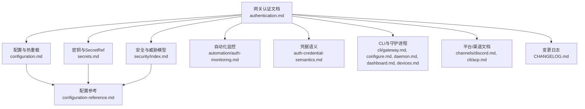
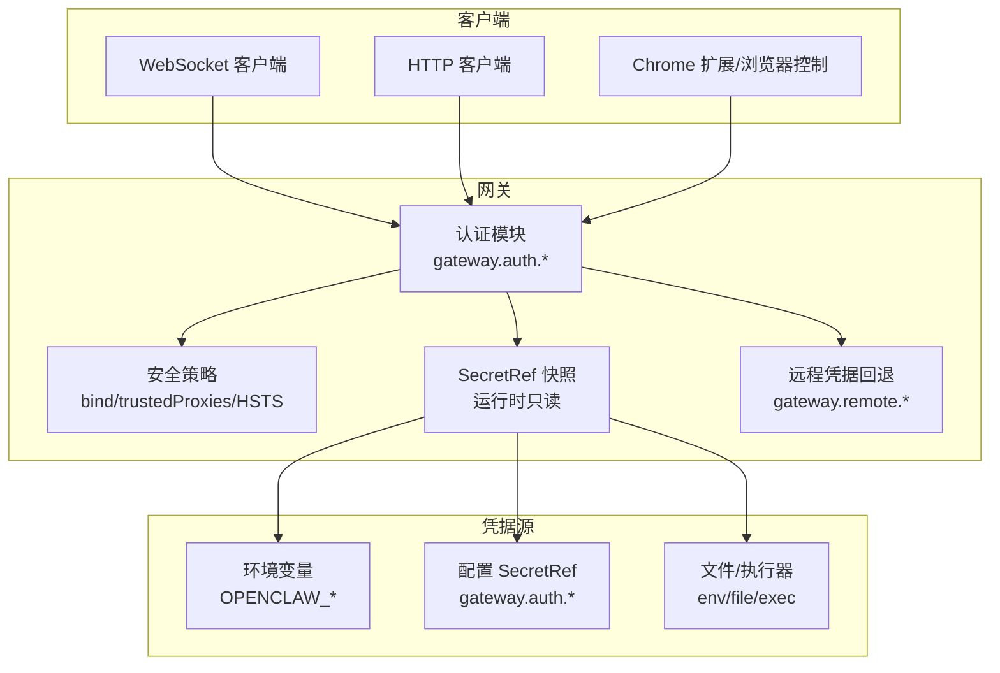
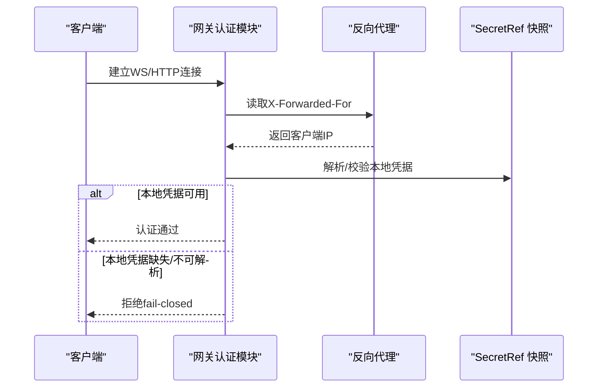
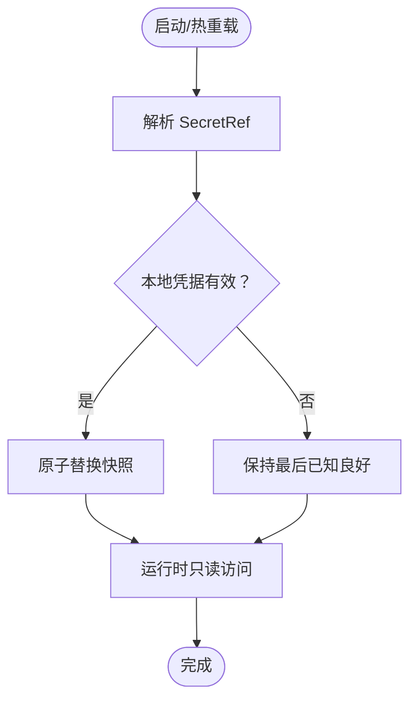
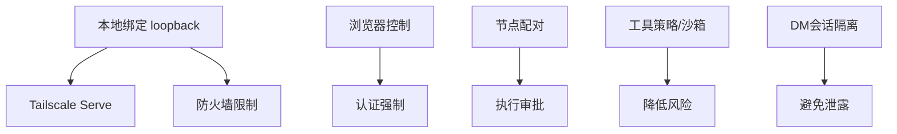
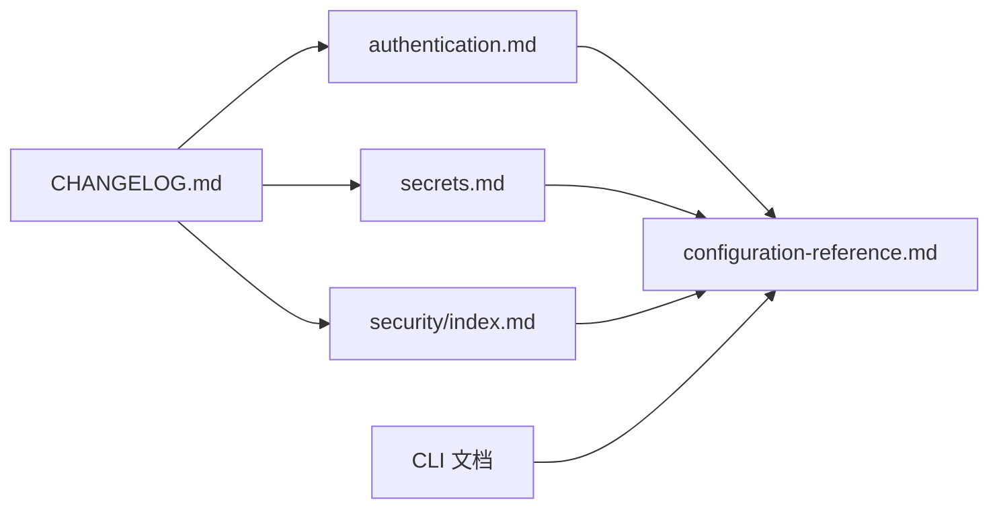

# 网关认证

<cite>
**本文引用的文件**
- [authentication.md](file://docs/gateway/authentication.md)
- [configuration.md](file://docs/gateway/configuration.md)
- [configuration-reference.md](file://docs/gateway/configuration-reference.md)
- [secrets.md](file://docs/gateway/secrets.md)
- [security/index.md](file://docs/gateway/security/index.md)
- [configuration-examples.md](file://docs/gateway/configuration-examples.md)
- [auth-monitoring.md](file://docs/automation/auth-monitoring.md)
- [auth-credential-semantics.md](file://docs/auth-credential-semantics.md)
- [gateway.md](file://docs/cli/gateway.md)
- [configure.md](file://docs/cli/configure.md)
- [daemon.md](file://docs/cli/daemon.md)
- [dashboard.md](file://docs/cli/dashboard.md)
- [devices.md](file://docs/cli/devices.md)
- [discord.md](file://docs/channels/discord.md)
- [acp.md](file://docs/cli/acp.md)
- [README.md](file://README.md)
- [CHANGELOG.md](file://CHANGELOG.md)
</cite>

## 目录

1. [简介](#简介)
2. [项目结构](#项目结构)
3. [核心组件](#核心组件)
4. [架构总览](#架构总览)
5. [详细组件分析](#详细组件分析)
6. [依赖关系分析](#依赖关系分析)
7. [性能考量](#性能考量)
8. [故障排查指南](#故障排查指南)
9. [结论](#结论)
10. [附录](#附录)

## 简介

本文件面向OpenClaw网关的“网关级认证”，聚焦以下主题：

- 网关级别的认证机制（共享令牌、密码、受信代理）
- 连接验证与凭据管理（本地WS与HTTP API、远程调用）
- 凭据预处理与认证策略选择（SecretRef、环境变量、明文回退）
- 多层认证与安全策略（本地绑定、反向代理、浏览器控制、节点配对）
- 完整配置示例、错误处理与安全审计
- 认证性能优化与最佳实践

## 项目结构

OpenClaw的网关认证由“文档+CLI+配置参考+变更日志”共同构成，核心文档包括：

- 网关认证与凭据：docs/gateway/authentication.md
- 配置与热重载：docs/gateway/configuration.md
- 配置参考（含gateway.auth等字段）：docs/gateway/configuration-reference.md
- 密钥与SecretRef：docs/gateway/secrets.md
- 安全与威胁模型：docs/gateway/security/index.md
- 自动化监控与探针：docs/automation/auth-monitoring.md
- 凭据语义与探测：docs/auth-credential-semantics.md
- CLI与守护进程集成：docs/cli/gateway.md、docs/cli/configure.md、docs/cli/daemon.md、docs/cli/dashboard.md、docs/cli/devices.md
- 平台与渠道文档中的认证细节：docs/channels/discord.md、docs/cli/acp.md
- 变更与安全修复：CHANGELOG.md

图示来源

- [authentication.md:1-180](file://docs/gateway/authentication.md#L1-L180)
- [configuration.md:1-547](file://docs/gateway/configuration.md#L1-L547)
- [configuration-reference.md:1-2986](file://docs/gateway/configuration-reference.md#L1-L2986)
- [secrets.md:1-455](file://docs/gateway/secrets.md#L1-L455)
- [security/index.md:1-1208](file://docs/gateway/security/index.md#L1-L1208)
- [auth-monitoring.md](file://docs/automation/auth-monitoring.md)
- [auth-credential-semantics.md](file://docs/auth-credential-semantics.md)
- [gateway.md](file://docs/cli/gateway.md)
- [configure.md](file://docs/cli/configure.md)
- [daemon.md](file://docs/cli/daemon.md)
- [dashboard.md](file://docs/cli/dashboard.md)
- [devices.md](file://docs/cli/devices.md)
- [discord.md](file://docs/channels/discord.md)
- [acp.md](file://docs/cli/acp.md)
- [CHANGELOG.md](file://CHANGELOG.md)

章节来源

- [authentication.md:1-180](file://docs/gateway/authentication.md#L1-L180)
- [configuration.md:1-547](file://docs/gateway/configuration.md#L1-L547)
- [configuration-reference.md:1-2986](file://docs/gateway/configuration-reference.md#L1-L2986)
- [secrets.md:1-455](file://docs/gateway/secrets.md#L1-L455)
- [security/index.md:1-1208](file://docs/gateway/security/index.md#L1-L1208)

## 核心组件

- 网关认证模式
  - 共享令牌（Bearer Token）：默认推荐，适合大多数部署；支持SecretRef与环境变量注入。
  - 密码认证：适合需要口令的场景；支持SecretRef与环境变量。
  - 受信代理认证：通过反向代理传递身份头进行认证，需配置可信代理列表与安全头。
- 连接验证
  - WebSocket与HTTP API均要求认证（默认拒绝未认证连接）。
  - 本地回环（loopback）与同主机Tailnet地址可自动批准配对，其他远端需显式配对。
- 凭据管理
  - 明文凭据仍被支持，但建议使用SecretRef（env/file/exec）以降低磁盘暴露风险。
  - SecretRef在启动时解析并采用“最后已知良好快照”策略，失败时保持旧快照或启动失败。
- 凭据预处理与策略选择
  - 解析顺序：环境变量 → 配置中SecretRef → 明文字段。
  - 对于本地模式，已配置但不可解析的SecretRef会失败关闭，不回退到远程凭据。
  - 支持按会话/按代理覆盖认证配置。

章节来源

- [authentication.md:11-180](file://docs/gateway/authentication.md#L11-L180)
- [configuration-reference.md:1-2986](file://docs/gateway/configuration-reference.md#L1-L2986)
- [secrets.md:16-327](file://docs/gateway/secrets.md#L16-L327)
- [security/index.md:735-800](file://docs/gateway/security/index.md#L735-L800)
- [discord.md:947-948](file://docs/channels/discord.md#L947-L948)
- [acp.md:275-275](file://docs/cli/acp.md#L275-L275)

## 架构总览

下图展示OpenClaw网关认证的整体交互：客户端发起WS/HTTP请求，网关根据配置执行认证检查，并在必要时回退至受信代理或远程凭据。SecretRef在启动阶段解析并进入运行时快照，确保热路径不访问敏感源。

图示来源

- [configuration-reference.md:1-2986](file://docs/gateway/configuration-reference.md#L1-L2986)
- [secrets.md:16-327](file://docs/gateway/secrets.md#L16-L327)
- [security/index.md:318-360](file://docs/gateway/security/index.md#L318-L360)
- [discord.md:947-948](file://docs/channels/discord.md#L947-L948)

## 详细组件分析

### 组件A：网关认证模式与连接验证

- 模式选择
  - token/password：默认启用，需显式配置mode；支持SecretRef与环境变量。
  - trusted-proxy：通过反向代理注入身份头进行认证，需配置trustedProxies与安全头。
- 连接验证
  - 默认拒绝未认证连接；本地回环与同主机Tailnet自动批准配对。
  - 受控的远程调用可通过gateway.remote.\*作为回退（仅在本地无本地凭据时）。
- 反向代理与TLS
  - 使用X-Forwarded-For确定客户端IP；可选X-Real-IP回退。
  - HSTS与Control UI安全上下文要求HTTPS或localhost。

图示来源

- [security/index.md:318-360](file://docs/gateway/security/index.md#L318-L360)
- [discord.md:947-948](file://docs/channels/discord.md#L947-L948)
- [secrets.md:312-327](file://docs/gateway/secrets.md#L312-L327)

章节来源

- [security/index.md:735-800](file://docs/gateway/security/index.md#L735-L800)
- [configuration-reference.md:1-2986](file://docs/gateway/configuration-reference.md#L1-L2986)
- [discord.md:947-948](file://docs/channels/discord.md#L947-L948)

### 组件B：凭据预处理与认证策略选择

- 解析优先级
  - 环境变量（OPENCLAW\_\*） → 配置中的SecretRef → 明文字段。
  - 对于本地模式，已配置但不可解析的SecretRef会失败关闭，不回退到远程凭据。
- SecretRef激活与快照
  - 启动/热重载/手动reload触发激活；成功后原子替换快照；失败保持“最后已知良好”。
  - 命令行路径可选择严格或降级行为（严格命令路径失败，只读命令路径降级）。
- 覆盖与回退
  - 本地模式下，gateway.remote.*仅在gateway.auth.*未配置时才作为回退。
  - 受信代理模式下，Tailscale Serve身份头可用于HTTP API认证。

图示来源

- [secrets.md:312-327](file://docs/gateway/secrets.md#L312-L327)
- [secrets.md:344-364](file://docs/gateway/secrets.md#L344-L364)
- [discord.md:947-948](file://docs/channels/discord.md#L947-L948)

章节来源

- [secrets.md:16-327](file://docs/gateway/secrets.md#L16-L327)
- [discord.md:947-948](file://docs/channels/discord.md#L947-L948)

### 组件C：多层认证与安全策略

- 本地绑定与网络暴露
  - bind: loopback（默认）仅本地可连；非loopback扩展攻击面。
  - 推荐Tailscale Serve替代LAN绑定；防火墙限制容器发布端口。
- 浏览器控制与节点配对
  - 浏览器控制路由需认证；自动在无认证时生成token并加入安全审计。
  - 节点配对需显式批准，远程执行受控于执行审批与沙箱。
- 工具与会话隔离
  - 工具策略（profile/deny）与沙箱隔离降低工具滥用风险。
  - DM会话隔离（dmScope）避免跨用户上下文泄露。

图示来源

- [security/index.md:601-780](file://docs/gateway/security/index.md#L601-L780)
- [configuration-reference.md:1-2986](file://docs/gateway/configuration-reference.md#L1-L2986)

章节来源

- [security/index.md:601-800](file://docs/gateway/security/index.md#L601-L800)
- [configuration-reference.md:1-2986](file://docs/gateway/configuration-reference.md#L1-L2986)

### 组件D：凭据管理与凭据语义

- 凭据类型与来源
  - API Key、Token、OAuth等；支持SecretRef（env/file/exec）与环境变量。
  - 模型提供商凭据可通过auth-profiles.json或SecretRef管理。
- 凭据语义与探测
  - models status --probe依据凭据资格规则输出；setup-token订阅授权需满足特定条件。
- 旋转与失效处理
  - API Key轮换按优先级顺序尝试；仅在限流错误时重试下一个Key。
  - 失效/过期可通过自动化脚本与诊断命令检测与修复。

章节来源

- [authentication.md:116-180](file://docs/gateway/authentication.md#L116-L180)
- [auth-credential-semantics.md](file://docs/auth-credential-semantics.md)
- [auth-monitoring.md](file://docs/automation/auth-monitoring.md)

## 依赖关系分析

- 文档间依赖
  - authentication.md依赖configuration-reference.md中的gateway.auth字段定义。
  - secrets.md与configuration-reference.md共同定义SecretRef与凭据解析。
  - security/index.md为authentication与secrets提供安全基线。
- CLI与配置依赖
  - CLI命令（gateway、configure、daemon、dashboard、devices）读取/写入配置与凭据。
  - 变更日志记录认证与安全相关的关键修复与破坏性变更。

图示来源

- [authentication.md:1-180](file://docs/gateway/authentication.md#L1-L180)
- [configuration-reference.md:1-2986](file://docs/gateway/configuration-reference.md#L1-L2986)
- [secrets.md:1-455](file://docs/gateway/secrets.md#L1-L455)
- [security/index.md:1-1208](file://docs/gateway/security/index.md#L1-L1208)
- [CHANGELOG.md](file://CHANGELOG.md)

章节来源

- [authentication.md:1-180](file://docs/gateway/authentication.md#L1-L180)
- [configuration-reference.md:1-2986](file://docs/gateway/configuration-reference.md#L1-L2986)
- [secrets.md:1-455](file://docs/gateway/secrets.md#L1-L455)
- [security/index.md:1-1208](file://docs/gateway/security/index.md#L1-L1208)
- [CHANGELOG.md](file://CHANGELOG.md)

## 性能考量

- 认证热路径
  - SecretRef解析在启动/热重载时完成，运行时仅读快照，避免热路径阻塞。
  - 反向代理仅用于IP识别与身份头注入，不参与凭据解析。
- 重试与轮换
  - API Key轮换仅在限流错误时生效，减少不必要的重试开销。
- 配置热重载
  - hybrid模式自动区分可热应用与需重启的变更，降低停机时间。

章节来源

- [secrets.md:16-327](file://docs/gateway/secrets.md#L16-L327)
- [configuration.md:349-387](file://docs/gateway/configuration.md#L349-L387)
- [authentication.md:123-139](file://docs/gateway/authentication.md#L123-L139)

## 故障排查指南

- 常见问题
  - “未找到凭据”：检查本地凭据是否配置且可解析；若使用SecretRef，确认提供者与ID正确。
  - 凭据即将过期/已过期：使用诊断命令确认当前状态，必要时重新设置或轮换。
  - 启动失败：当本地SecretRef不可解析时会启动失败；检查提供者配置与权限。
- 诊断与修复
  - 使用doctor与security audit检查配置与暴露面。
  - 使用secrets audit与secrets configure进行凭据审计与迁移。
  - 使用auth-monitoring脚本与定时任务监控认证状态。
- 回滚与恢复
  - SecretRef失败时保持“最后已知良好”快照；通过secrets.reload刷新。

章节来源

- [authentication.md:160-180](file://docs/gateway/authentication.md#L160-L180)
- [secrets.md:328-343](file://docs/gateway/secrets.md#L328-L343)
- [auth-monitoring.md](file://docs/automation/auth-monitoring.md)
- [security/index.md:26-40](file://docs/gateway/security/index.md#L26-L40)

## 结论

OpenClaw的网关认证体系以“本地凭据优先、SecretRef安全、受信代理可控”为核心设计，结合严格的启动失败策略与“最后已知良好”快照机制，确保在复杂部署场景下的安全性与稳定性。配合工具策略、沙箱与会话隔离，可显著降低工具滥用与上下文泄露风险。建议在生产环境中采用token认证、最小暴露面、受信代理与定期安全审计。

## 附录

### A. 网关认证配置要点清单

- 必填项
  - gateway.auth.mode：token 或 password
  - gateway.auth.token 或 gateway.auth.password（建议SecretRef）
- 可选项
  - gateway.auth.allowTailscale：Serve模式下允许Tailscale身份头
  - gateway.trustedProxies：受信代理列表
  - gateway.bind：loopback/l latter需配合强认证
- CLI与守护进程
  - 守护进程安装时需明确认证模式；SecretRef解析通过配置而非服务元数据持久化明文

章节来源

- [configuration-reference.md:1-2986](file://docs/gateway/configuration-reference.md#L1-L2986)
- [gateway.md](file://docs/cli/gateway.md)
- [configure.md:26-28](file://docs/cli/configure.md#L26-L28)
- [daemon.md:44-46](file://docs/cli/daemon.md#L44-L46)

### B. 完整配置示例（节选）

- 最小安全配置（本地+token）
  - 参考：[configuration.md:26-50](file://docs/gateway/configuration.md#L26-L50)
- 硬化基线（本地+token+工具限制）
  - 参考：[security/index.md:146-172](file://docs/gateway/security/index.md#L146-L172)
- SecretRef示例（env/file/exec）
  - 参考：[secrets.md:119-153](file://docs/gateway/secrets.md#L119-L153)
- 环境变量注入与替换
  - 参考：[configuration.md:449-539](file://docs/gateway/configuration.md#L449-L539)

### C. 错误处理与安全审计

- 启动失败与降级
  - 本地SecretRef不可解析时启动失败；运行时SecretRef失败保持旧快照。
  - 参考：[secrets.md:328-343](file://docs/gateway/secrets.md#L328-L343)
- 安全审计检查项
  - 网络暴露、工具策略、浏览器控制、权限、插件等。
  - 参考：[security/index.md:184-262](file://docs/gateway/security/index.md#L184-L262)
- 变更与回归
  - 关键安全修复与破坏性变更记录。
  - 参考：[CHANGELOG.md](file://CHANGELOG.md)

### D. 认证性能优化与最佳实践

- 优化建议
  - 使用SecretRef并在启动时解析，避免运行时IO。
  - 仅在必要时开启非loopback绑定；优先Tailscale Serve。
  - 合理设置API Key轮换策略，仅在限流错误时重试。
- 最佳实践
  - 明确gateway.auth.mode；避免同时配置token与password而不设mode。
  - 使用dmScope隔离DM会话，降低跨用户影响。
  - 定期运行security audit与secrets audit，保持最小暴露面。

章节来源

- [secrets.md:16-327](file://docs/gateway/secrets.md#L16-L327)
- [security/index.md:601-800](file://docs/gateway/security/index.md#L601-L800)
- [authentication.md:123-139](file://docs/gateway/authentication.md#L123-L139)
- [CHANGELOG.md](file://CHANGELOG.md)
