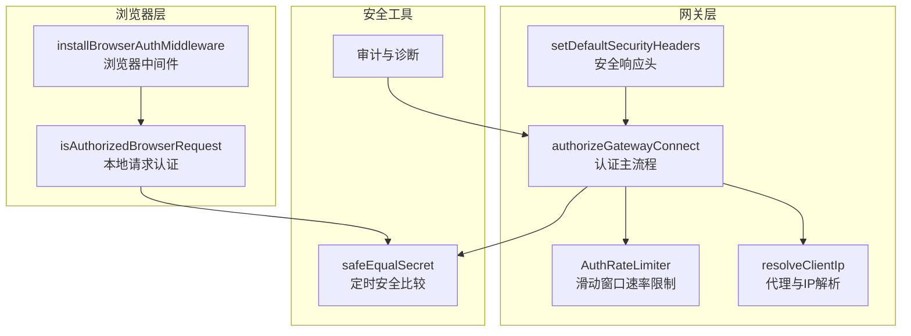
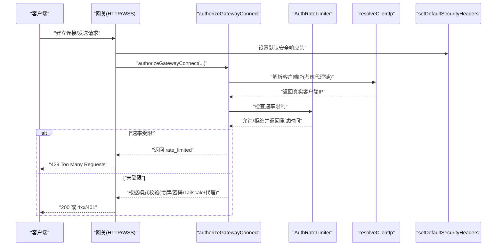
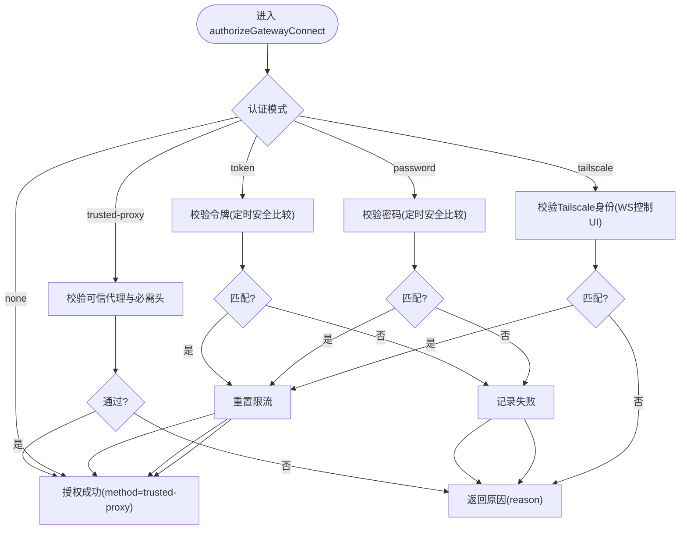
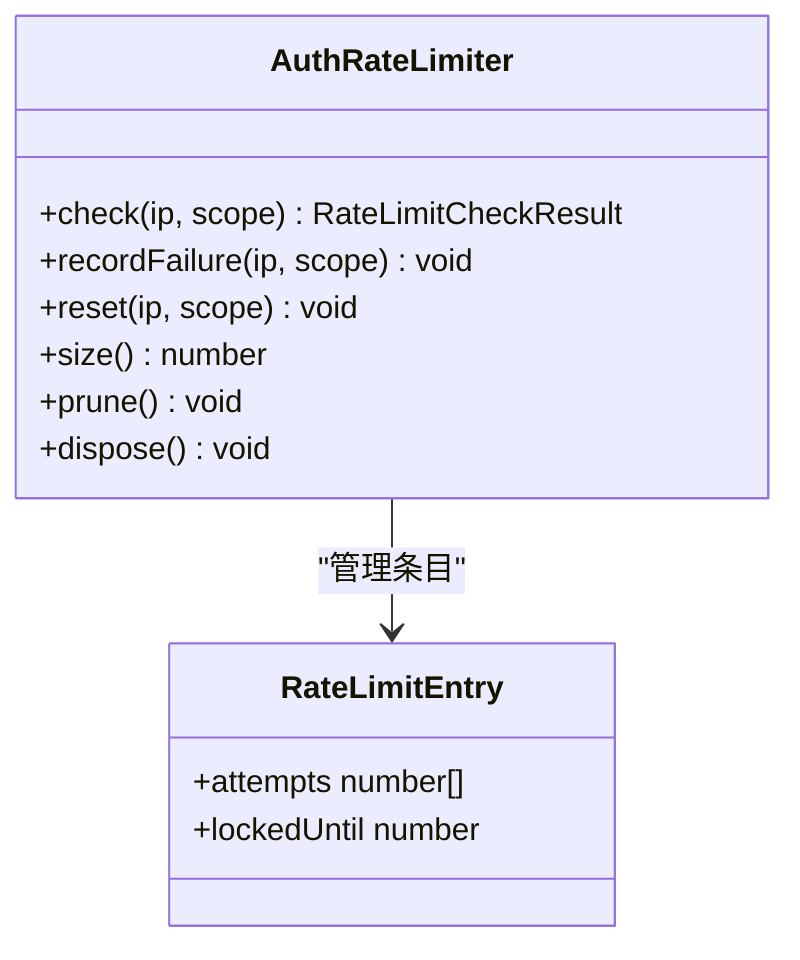
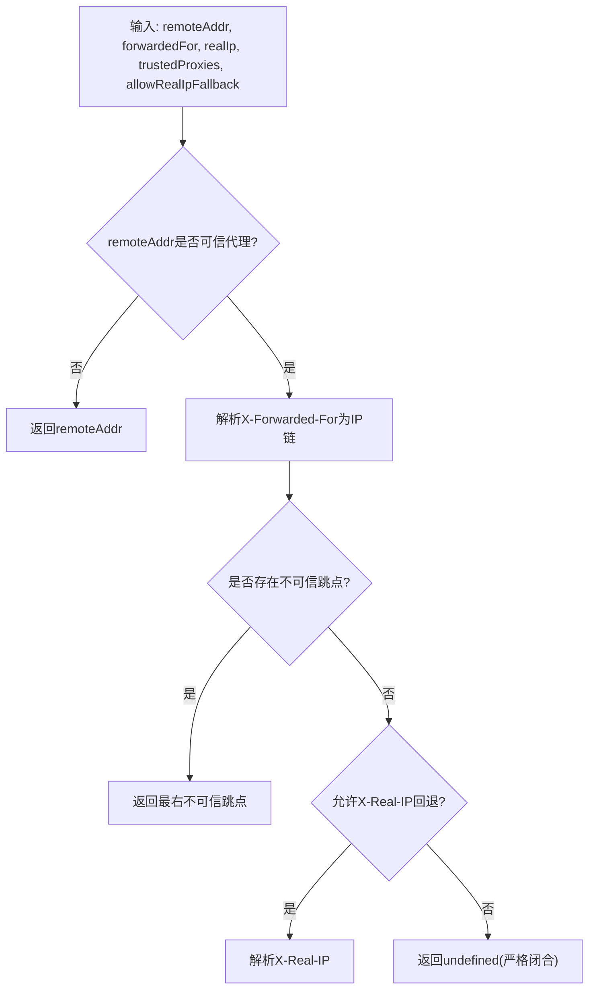
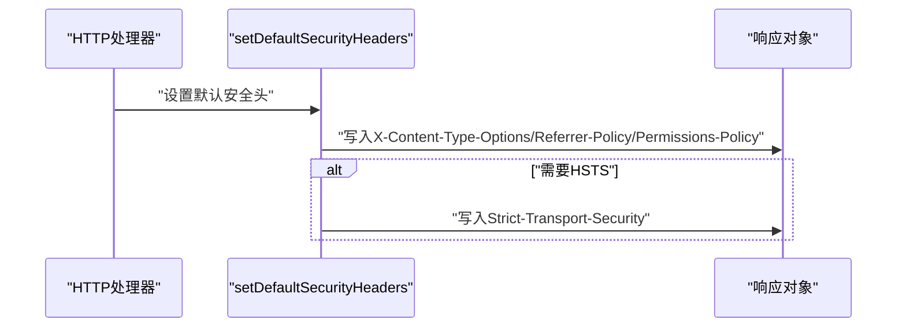
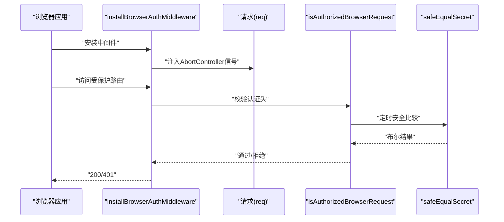
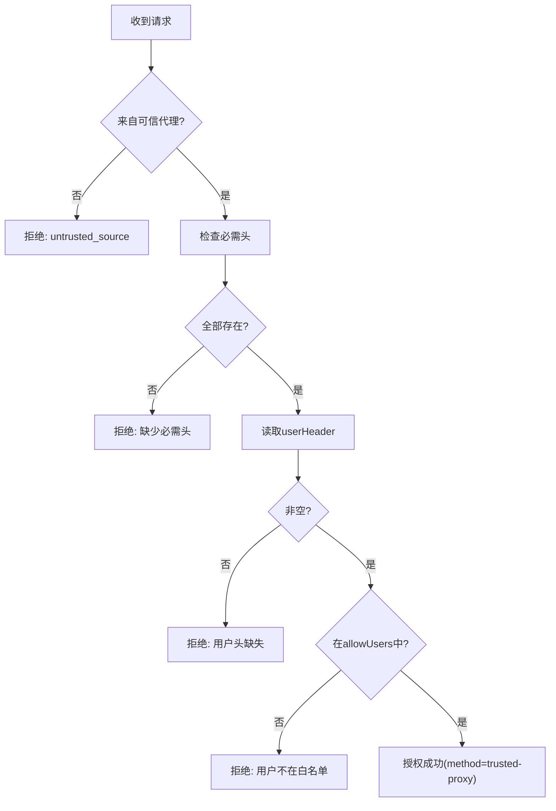
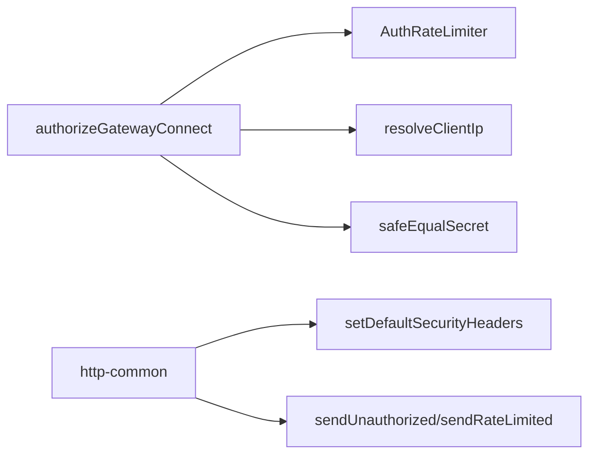

# 认证API

<cite>
**本文引用的文件**
- [src/gateway/auth.ts](file://src/gateway/auth.ts)
- [src/gateway/auth-rate-limit.ts](file://src/gateway/auth-rate-limit.ts)
- [src/gateway/net.ts](file://src/gateway/net.ts)
- [src/gateway/http-common.ts](file://src/gateway/http-common.ts)
- [src/browser/http-auth.ts](file://src/browser/http-auth.ts)
- [src/browser/server-middleware.ts](file://src/browser/server-middleware.ts)
- [src/security/secret-equal.ts](file://src/security/secret-equal.ts)
- [docs/gateway/trusted-proxy-auth.md](file://docs/gateway/trusted-proxy-auth.md)
- [docs/gateway/authentication.md](file://docs/gateway/authentication.md)
- [src/gateway/auth.test.ts](file://src/gateway/auth.test.ts)
- [src/gateway/http-common.test.ts](file://src/gateway/http-common.test.ts)
- [src/gateway/server.plugin-http-auth.test.ts](file://src/gateway/server.plugin-http-auth.test.ts)
- [src/infra/net/fetch-guard.ts](file://src/infra/net/fetch-guard.ts)
- [src/commands/status.command.ts](file://src/commands/status.command.ts)
- [src/security/audit-extra.async.ts](file://src/security/audit-extra.async.ts)
- [src/security/audit.test.ts](file://src/security/audit.test.ts)
- [src/gateway/protocol/connect-error-details.ts](file://src/gateway/protocol/connect-error-details.ts)
</cite>

## 目录

1. [简介](#简介)
2. [项目结构](#项目结构)
3. [核心组件](#核心组件)
4. [架构总览](#架构总览)
5. [详细组件分析](#详细组件分析)
6. [依赖关系分析](#依赖关系分析)
7. [性能考量](#性能考量)
8. [故障排查指南](#故障排查指南)
9. [结论](#结论)
10. [附录](#附录)

## 简介

本文件系统性地文档化 OpenClaw 的认证API与相关安全机制，覆盖以下主题：

- HTTP 认证实现：Bearer Token、Basic 密码、代理认证（trusted-proxy）、Tailscale 身份认证
- 令牌验证与权限控制：基于安全等值比较、速率限制、客户端IP解析与代理信任链
- 安全头部设置：默认安全响应头、可选 HSTS
- 请求示例与错误处理：统一的401/429响应格式与错误码映射
- 安全最佳实践、防护措施与审计日志

## 项目结构

认证相关代码主要分布在网关层与浏览器层：

- 网关层负责 HTTP/WebSocket 连接认证、代理信任链校验、速率限制与安全头部输出
- 浏览器层负责本地请求的认证中间件与自动注入认证头
- 安全工具提供定时安全比较与审计辅助

**图表来源**

- [src/gateway/auth.ts:378-485](file://src/gateway/auth.ts#L378-L485)
- [src/gateway/auth-rate-limit.ts:95-233](file://src/gateway/auth-rate-limit.ts#L95-L233)
- [src/gateway/net.ts:156-185](file://src/gateway/net.ts#L156-L185)
- [src/gateway/http-common.ts:11-22](file://src/gateway/http-common.ts#L11-L22)
- [src/browser/server-middleware.ts:24-37](file://src/browser/server-middleware.ts#L24-L37)
- [src/browser/http-auth.ts:37-64](file://src/browser/http-auth.ts#L37-L64)
- [src/security/secret-equal.ts:3-12](file://src/security/secret-equal.ts#L3-L12)

**章节来源**

- [src/gateway/auth.ts:1-504](file://src/gateway/auth.ts#L1-L504)
- [src/gateway/auth-rate-limit.ts:1-233](file://src/gateway/auth-rate-limit.ts#L1-L233)
- [src/gateway/net.ts:1-457](file://src/gateway/net.ts#L1-L457)
- [src/gateway/http-common.ts:1-109](file://src/gateway/http-common.ts#L1-L109)
- [src/browser/http-auth.ts:1-64](file://src/browser/http-auth.ts#L1-L64)
- [src/browser/server-middleware.ts:1-37](file://src/browser/server-middleware.ts#L1-L37)
- [src/security/secret-equal.ts:1-13](file://src/security/secret-equal.ts#L1-L13)

## 核心组件

- 认证主流程与模式选择
  - 支持模式：无认证、令牌认证、密码认证、代理认证、Tailscale 身份认证
  - 模式来源：配置覆盖、配置文件、密码优先、令牌优先、默认
- 速率限制
  - 滑动窗口计数、锁定期、循环清理、支持多作用域（共享密钥、设备令牌、钩子）
- 客户端IP解析与代理信任
  - 解析 X-Forwarded-For、X-Real-IP、远端地址；支持可信代理CIDR白名单
- 安全响应头
  - 默认安全头（X-Content-Type-Options、Referrer-Policy、Permissions-Policy）
  - 可选 HSTS 头部
- 浏览器本地认证
  - Bearer Token 与 x-openclaw-password 头注入与校验
  - Basic 密码解析与校验

**章节来源**

- [src/gateway/auth.ts:23-292](file://src/gateway/auth.ts#L23-L292)
- [src/gateway/auth-rate-limit.ts:25-72](file://src/gateway/auth-rate-limit.ts#L25-L72)
- [src/gateway/net.ts:156-185](file://src/gateway/net.ts#L156-L185)
- [src/gateway/http-common.ts:11-22](file://src/gateway/http-common.ts#L11-L22)
- [src/browser/http-auth.ts:37-64](file://src/browser/http-auth.ts#L37-L64)

## 架构总览

下图展示从请求进入网关到完成认证与响应的关键路径。

**图表来源**

- [src/gateway/auth.ts:378-485](file://src/gateway/auth.ts#L378-L485)
- [src/gateway/auth-rate-limit.ts:141-172](file://src/gateway/auth-rate-limit.ts#L141-L172)
- [src/gateway/net.ts:156-185](file://src/gateway/net.ts#L156-L185)
- [src/gateway/http-common.ts:11-22](file://src/gateway/http-common.ts#L11-L22)

## 详细组件分析

### 组件A：网关认证主流程 authorizeGatewayConnect

- 功能要点
  - 支持多种认证模式与来源
  - 速率限制前置检查，失败记录，成功重置
  - Tailscale 身份认证（仅在WS控制UI表面启用）
  - 代理认证：校验可信代理、必需头、用户白名单
  - 令牌/密码认证：使用定时安全比较
- 错误码映射
  - 将内部reason映射为连接错误码，便于前端提示

**图表来源**

- [src/gateway/auth.ts:378-485](file://src/gateway/auth.ts#L378-L485)

**章节来源**

- [src/gateway/auth.ts:378-485](file://src/gateway/auth.ts#L378-L485)
- [src/gateway/protocol/connect-error-details.ts:51-84](file://src/gateway/protocol/connect-error-details.ts#L51-L84)

### 组件B：速率限制器 AuthRateLimiter

- 设计特性
  - 内存Map存储，滑动窗口计数，锁定期
  - 循环清理避免内存膨胀
  - 支持作用域隔离（共享密钥、设备令牌、钩子）
  - 本地回环豁免
- 关键接口
  - check/reset/recordFailure/prune/dispose

**图表来源**

- [src/gateway/auth-rate-limit.ts:59-72](file://src/gateway/auth-rate-limit.ts#L59-L72)
- [src/gateway/auth-rate-limit.ts:43-48](file://src/gateway/auth-rate-limit.ts#L43-L48)

**章节来源**

- [src/gateway/auth-rate-limit.ts:1-233](file://src/gateway/auth-rate-limit.ts#L1-L233)

### 组件C：客户端IP解析与代理信任 resolveClientIp

- 输入
  - 远端地址、X-Forwarded-For、X-Real-IP、可信代理列表
- 行为
  - 若远端来自可信代理，优先从XFF链中取第一个不可信跳点
  - 可选启用X-Real-IP回退
  - 严格闭合：缺失或无效时返回undefined，避免误判

**图表来源**

- [src/gateway/net.ts:156-185](file://src/gateway/net.ts#L156-L185)

**章节来源**

- [src/gateway/net.ts:156-185](file://src/gateway/net.ts#L156-L185)

### 组件D：安全响应头与错误响应 http-common

- 默认安全头
  - X-Content-Type-Options: nosniff
  - Referrer-Policy: no-referrer
  - Permissions-Policy: camera=(), microphone=(), geolocation=()
  - 可选 Strict-Transport-Security
- 错误响应
  - 401 Unauthorized（JSON）
  - 429 Too Many Requests（带 Retry-After）

**图表来源**

- [src/gateway/http-common.ts:11-22](file://src/gateway/http-common.ts#L11-L22)

**章节来源**

- [src/gateway/http-common.ts:11-57](file://src/gateway/http-common.ts#L11-L57)
- [src/gateway/http-common.test.ts:38-49](file://src/gateway/http-common.test.ts#L38-L49)
- [src/gateway/server.plugin-http-auth.test.ts:84-111](file://src/gateway/server.plugin-http-auth.test.ts#L84-L111)

### 组件E：浏览器本地认证 middleware 与 http-auth

- 中间件
  - express中间件安装，统一超时与中断信号
  - 浏览器认证中间件：校验 Authorization/x-openclaw-password
- 本地请求认证
  - Bearer Token（Authorization: Bearer …）
  - x-openclaw-password 头
  - Basic 密码解析（Authorization: Basic …）

**图表来源**

- [src/browser/server-middleware.ts:24-37](file://src/browser/server-middleware.ts#L24-L37)
- [src/browser/http-auth.ts:37-64](file://src/browser/http-auth.ts#L37-L64)
- [src/security/secret-equal.ts:3-12](file://src/security/secret-equal.ts#L3-L12)

**章节来源**

- [src/browser/server-middleware.ts:1-37](file://src/browser/server-middleware.ts#L1-L37)
- [src/browser/http-auth.ts:1-64](file://src/browser/http-auth.ts#L1-L64)
- [src/security/secret-equal.ts:1-13](file://src/security/secret-equal.ts#L1-L13)

### 组件F：代理认证 trusted-proxy

- 配置项
  - trustedProxies：可信代理IP/CIDR
  - userHeader：承载已认证用户标识的头
  - requiredHeaders：必须存在的头集合
  - allowUsers：用户白名单（为空表示允许所有）
- 行为
  - 仅当请求来自可信代理且满足必需头与用户白名单时放行
  - 控制UI WebSocket在该模式下可无需设备配对

**图表来源**

- [src/gateway/auth.ts:335-372](file://src/gateway/auth.ts#L335-L372)
- [docs/gateway/trusted-proxy-auth.md:50-90](file://docs/gateway/trusted-proxy-auth.md#L50-L90)

**章节来源**

- [src/gateway/auth.ts:331-372](file://src/gateway/auth.ts#L331-L372)
- [src/gateway/auth.test.ts:506-595](file://src/gateway/auth.test.ts#L506-L595)
- [docs/gateway/trusted-proxy-auth.md:1-330](file://docs/gateway/trusted-proxy-auth.md#L1-L330)

### 组件G：令牌与密码认证的安全比较

- 使用定时安全比较函数，避免时序攻击
- Bearer Token 与 Basic 密码均采用相同比较策略

**章节来源**

- [src/security/secret-equal.ts:1-13](file://src/security/secret-equal.ts#L1-L13)
- [src/browser/http-auth.ts:4-35](file://src/browser/http-auth.ts#L4-L35)

## 依赖关系分析

- 认证主流程依赖
  - 速率限制器：用于失败计数与锁定期
  - IP解析：用于速率限制与代理信任
  - 安全比较：用于令牌/密码比较
- 响应层依赖
  - 安全头设置：统一输出安全响应头
  - 错误响应：统一401/429输出

**图表来源**

- [src/gateway/auth.ts:378-485](file://src/gateway/auth.ts#L378-L485)
- [src/gateway/auth-rate-limit.ts:95-233](file://src/gateway/auth-rate-limit.ts#L95-L233)
- [src/gateway/net.ts:156-185](file://src/gateway/net.ts#L156-L185)
- [src/gateway/http-common.ts:11-57](file://src/gateway/http-common.ts#L11-L57)
- [src/security/secret-equal.ts:3-12](file://src/security/secret-equal.ts#L3-L12)

**章节来源**

- [src/gateway/auth.ts:1-504](file://src/gateway/auth.ts#L1-L504)
- [src/gateway/http-common.ts:1-109](file://src/gateway/http-common.ts#L1-L109)

## 性能考量

- 速率限制
  - 滑动窗口与锁定期减少暴力破解成功率
  - 循环清理避免Map无限增长
  - 本地回环豁免降低开发体验影响
- IP解析
  - 严格闭合策略避免误判带来的额外开销
  - 可选X-Real-IP回退仅在显式开启时生效
- 安全头设置
  - 常量时间写入，开销极低

[本节为通用性能讨论，不直接分析具体文件]

## 故障排查指南

- 速率限制导致429
  - 检查 Retry-After 头，等待后重试
  - 调整速率限制配置或作用域
- 代理认证失败
  - 确认 trustedProxies 是否包含代理IP
  - 确认必需头是否存在且非空
  - 确认 userHeader 是否正确，allowUsers 是否包含该用户
- 本地浏览器认证失败
  - 确认 Authorization 或 x-openclaw-password 头是否正确
  - 确认 Basic 密码格式是否符合 Basic 规范
- 安全头问题
  - 如需HSTS，请在代理或网关处设置 Strict-Transport-Security
- 审计与诊断
  - 使用安全审计命令查看关键/警告发现
  - 检查日志文件权限与敏感信息脱敏

**章节来源**

- [src/gateway/http-common.ts:47-65](file://src/gateway/http-common.ts#L47-L65)
- [src/gateway/auth.test.ts:332-355](file://src/gateway/auth.test.ts#L332-L355)
- [src/commands/status.command.ts:473-508](file://src/commands/status.command.ts#L473-L508)
- [src/security/audit-extra.async.ts:1095-1127](file://src/security/audit-extra.async.ts#L1095-L1127)
- [src/security/audit.test.ts:593-643](file://src/security/audit.test.ts#L593-L643)

## 结论

OpenClaw 的认证API以“最小暴露、强安全比较、可审计”为核心设计原则：

- 通过速率限制与代理信任链有效抵御暴力破解
- 采用定时安全比较与严格IP解析，降低侧信道风险
- 提供统一的安全响应头与错误响应，便于集成与监控
- 文档化的代理认证与Tailscale方案，适配多样化部署场景

[本节为总结性内容，不直接分析具体文件]

## 附录

### 认证API请求示例（概念性）

- Bearer Token 认证
  - 请求头：Authorization: Bearer <token>
  - 成功：200；失败：401
- Basic 密码认证
  - 请求头：Authorization: Basic base64("user:password")
  - 成功：200；失败：401
- 代理认证
  - 请求头：由代理注入（如 x-forwarded-user、x-forwarded-proto 等）
  - 成功：200；失败：401
- 速率限制触发
  - 返回：429，并携带 Retry-After

[本节为概念性示例，不直接分析具体文件]

### 安全最佳实践

- 速率限制
  - 合理设置最大尝试次数与锁定期
  - 使用作用域隔离不同凭据类型
- 代理认证
  - 仅在代理为唯一入口时启用
  - 严格配置 trustedProxies、必需头与用户白名单
- 头部与传输
  - 在代理或网关设置 HSTS
  - 仅在必要时启用 X-Real-IP 回退
- 审计与日志
  - 使用安全审计命令识别高危配置
  - 确保日志文件权限最小化与敏感信息脱敏

**章节来源**

- [docs/gateway/trusted-proxy-auth.md:256-275](file://docs/gateway/trusted-proxy-auth.md#L256-L275)
- [src/security/audit.test.ts:593-643](file://src/security/audit.test.ts#L593-L643)
- [src/security/audit-extra.async.ts:1095-1127](file://src/security/audit-extra.async.ts#L1095-L1127)
