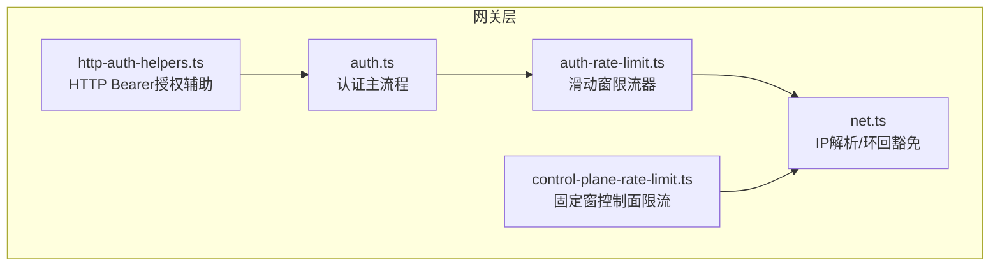
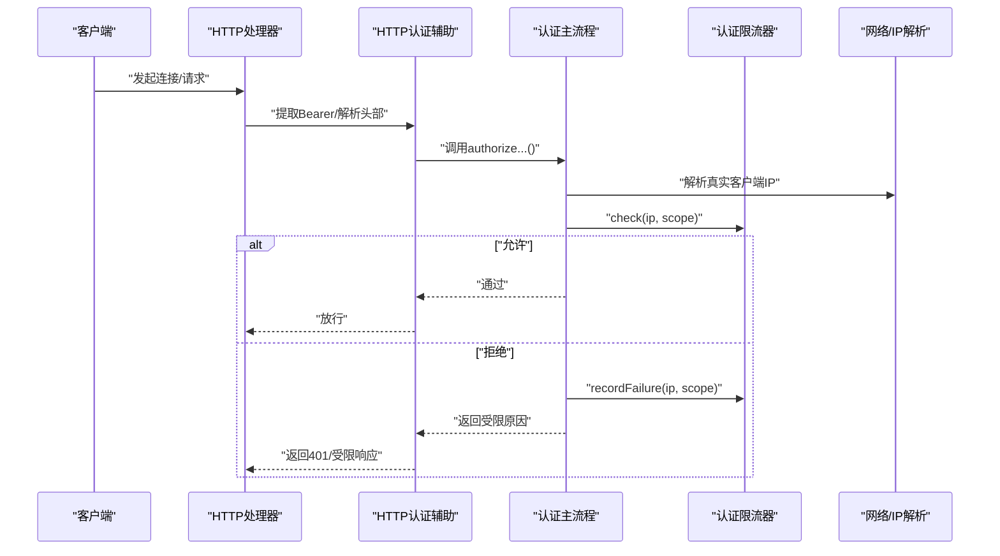
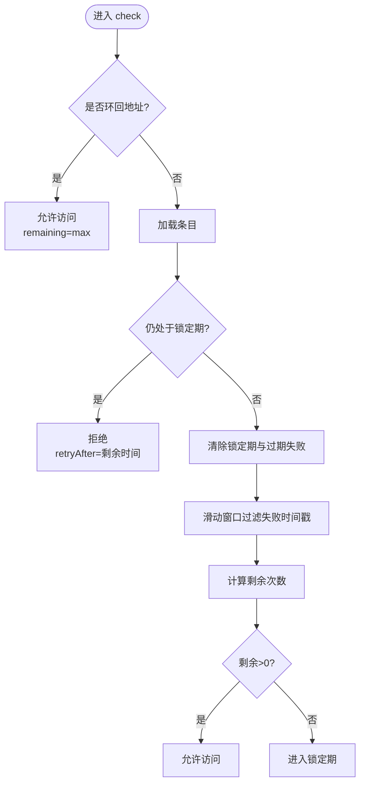
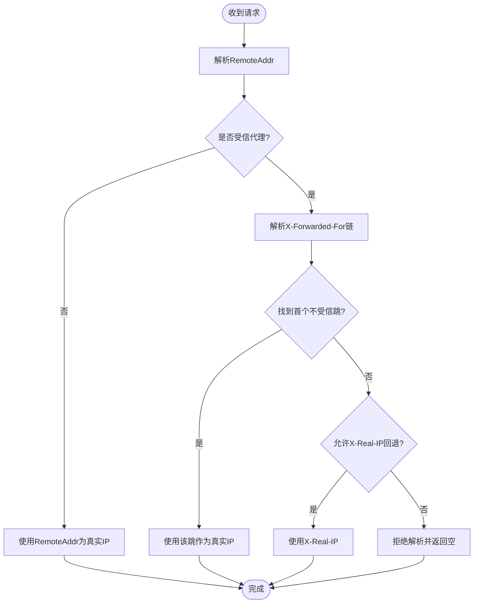
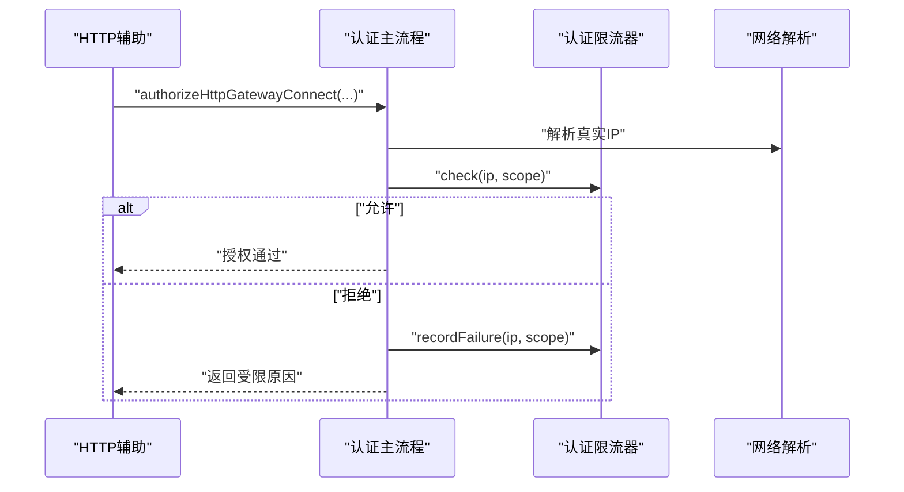
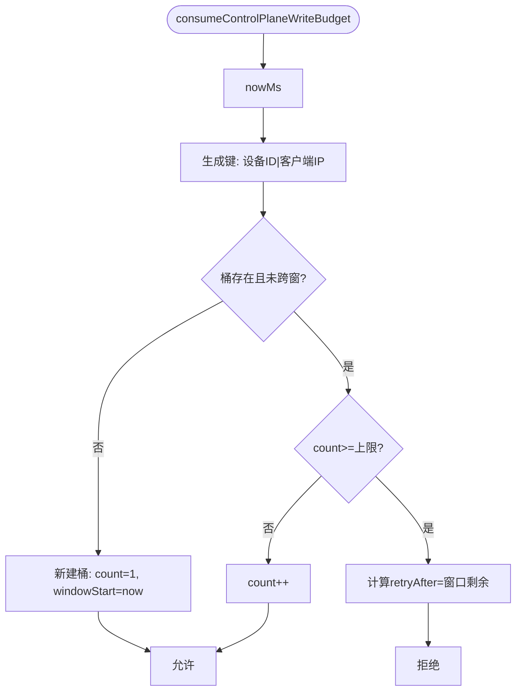
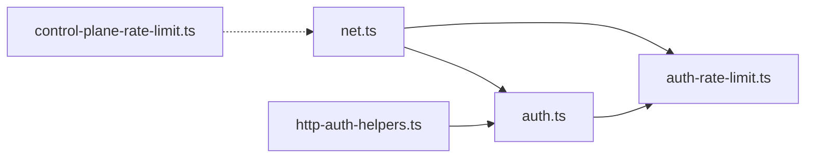

# 速率限制

<cite>
**本文引用的文件**
- [src/gateway/auth-rate-limit.ts](file://src/gateway/auth-rate-limit.ts)
- [src/gateway/net.ts](file://src/gateway/net.ts)
- [src/gateway/auth.ts](file://src/gateway/auth.ts)
- [src/gateway/http-auth-helpers.ts](file://src/gateway/http-auth-helpers.ts)
- [src/gateway/control-plane-rate-limit.ts](file://src/gateway/control-plane-rate-limit.ts)
- [src/gateway/auth-rate-limit.test.ts](file://src/gateway/auth-rate-limit.test.ts)
- [dist/plugin-sdk/gateway/auth-rate-limit.d.ts](file://dist/plugin-sdk/gateway/auth-rate-limit.d.ts)
</cite>

## 目录

1. [简介](#简介)
2. [项目结构](#项目结构)
3. [核心组件](#核心组件)
4. [架构总览](#架构总览)
5. [详细组件分析](#详细组件分析)
6. [依赖关系分析](#依赖关系分析)
7. [性能考量](#性能考量)
8. [故障排查指南](#故障排查指南)
9. [结论](#结论)
10. [附录](#附录)

## 简介

本文件面向 OpenClaw 的“认证速率限制”子系统，系统性说明其设计与实现：基于滑动时间窗的内存型限流器、IP 地址归一化与代理信任链解析、按作用域（scope）隔离的计数模型、以及在网关认证流程中的集成方式。文档同时覆盖配置项、阈值设定、降级策略、触发条件与缓解措施，并给出监控与性能影响分析建议。

## 项目结构

与速率限制直接相关的代码主要位于网关层：

- 认证速率限制器：滑动时间窗 + 锁定期 + 作用域隔离
- 网络与代理解析：客户端真实 IP 解析、环回地址豁免
- 认证流程：在密码/令牌校验失败时记录失败并重试时间提示
- 控制面写入限流：固定时间窗 + 桶模型，用于控制平面写操作

图表来源

- [src/gateway/auth-rate-limit.ts:1-233](file://src/gateway/auth-rate-limit.ts#L1-L233)
- [src/gateway/net.ts:1-457](file://src/gateway/net.ts#L1-L457)
- [src/gateway/auth.ts:470-504](file://src/gateway/auth.ts#L470-L504)
- [src/gateway/http-auth-helpers.ts:1-29](file://src/gateway/http-auth-helpers.ts#L1-L29)
- [src/gateway/control-plane-rate-limit.ts:1-87](file://src/gateway/control-plane-rate-limit.ts#L1-L87)

章节来源

- [src/gateway/auth-rate-limit.ts:1-233](file://src/gateway/auth-rate-limit.ts#L1-L233)
- [src/gateway/net.ts:1-457](file://src/gateway/net.ts#L1-L457)
- [src/gateway/auth.ts:470-504](file://src/gateway/auth.ts#L470-L504)
- [src/gateway/http-auth-helpers.ts:1-29](file://src/gateway/http-auth-helpers.ts#L1-L29)
- [src/gateway/control-plane-rate-limit.ts:1-87](file://src/gateway/control-plane-rate-limit.ts#L1-L87)

## 核心组件

- 滑动时间窗认证限流器
  - 支持按 {scope, 客户端IP} 隔离计数
  - 默认参数：最大失败次数、滑动窗口、锁定期、后台清理间隔
  - 提供检查、记录失败、重置、清理、销毁等能力
- 客户端 IP 归一化与代理信任链
  - 支持从多种来源解析真实客户端 IP（RemoteAddr、X-Forwarded-For、X-Real-IP）
  - 受信任代理白名单校验，避免被伪造
  - 环回地址默认豁免，支持关闭豁免
- 认证流程集成
  - 密码/令牌错误时记录失败；成功时重置状态
  - 返回“重试等待毫秒数”，便于上层提示或退避
- 控制面写入限流（固定窗）
  - 基于设备ID+客户端IP键控的固定时间窗桶
  - 用于控制平面写操作的突发保护

章节来源

- [src/gateway/auth-rate-limit.ts:25-72](file://src/gateway/auth-rate-limit.ts#L25-L72)
- [src/gateway/auth-rate-limit.ts:95-232](file://src/gateway/auth-rate-limit.ts#L95-L232)
- [src/gateway/net.ts:156-185](file://src/gateway/net.ts#L156-L185)
- [src/gateway/net.ts:58-60](file://src/gateway/net.ts#L58-L60)
- [src/gateway/auth.ts:470-485](file://src/gateway/auth.ts#L470-L485)
- [src/gateway/control-plane-rate-limit.ts:3-87](file://src/gateway/control-plane-rate-limit.ts#L3-L87)

## 架构总览

下图展示认证速率限制在请求处理链路中的位置与交互：

图表来源

- [src/gateway/http-auth-helpers.ts:7-29](file://src/gateway/http-auth-helpers.ts#L7-L29)
- [src/gateway/auth.ts:470-485](file://src/gateway/auth.ts#L470-L485)
- [src/gateway/auth-rate-limit.ts:141-172](file://src/gateway/auth-rate-limit.ts#L141-L172)
- [src/gateway/net.ts:156-185](file://src/gateway/net.ts#L156-L185)

## 详细组件分析

### 组件A：滑动时间窗认证限流器

- 数据结构
  - 条目：最近失败时间戳数组 + 可选锁定截止时间
  - 键：scope:ip 字符串
- 关键逻辑
  - 环回豁免：默认豁免 127.0.0.1 与 ::1
  - 滑动窗口：仅保留窗口内的失败时间戳
  - 锁定：超过阈值后进入锁定期，期间直接拒绝
  - 清理：周期性清理过期条目，保留仍在锁定期的条目
- 接口要点
  - check：返回是否允许、剩余次数、重试等待
  - recordFailure：在未锁定时记录一次失败并可能触发锁定期
  - reset：按键重置状态（如登录成功）
  - prune/dispose：清理与释放资源

图表来源

- [src/gateway/auth-rate-limit.ts:141-172](file://src/gateway/auth-rate-limit.ts#L141-L172)
- [src/gateway/auth-rate-limit.ts:174-199](file://src/gateway/auth-rate-limit.ts#L174-L199)
- [src/gateway/auth-rate-limit.ts:206-218](file://src/gateway/auth-rate-limit.ts#L206-L218)

章节来源

- [src/gateway/auth-rate-limit.ts:25-72](file://src/gateway/auth-rate-limit.ts#L25-L72)
- [src/gateway/auth-rate-limit.ts:95-232](file://src/gateway/auth-rate-limit.ts#L95-L232)
- [src/gateway/auth-rate-limit.test.ts:18-81](file://src/gateway/auth-rate-limit.test.ts#L18-L81)
- [src/gateway/auth-rate-limit.test.ts:111-133](file://src/gateway/auth-rate-limit.test.ts#L111-L133)
- [src/gateway/auth-rate-limit.test.ts:162-191](file://src/gateway/auth-rate-limit.test.ts#L162-L191)
- [src/gateway/auth-rate-limit.test.ts:195-208](file://src/gateway/auth-rate-limit.test.ts#L195-L208)
- [src/gateway/auth-rate-limit.test.ts:212-218](file://src/gateway/auth-rate-limit.test.ts#L212-L218)
- [dist/plugin-sdk/gateway/auth-rate-limit.d.ts:18-67](file://dist/plugin-sdk/gateway/auth-rate-limit.d.ts#L18-L67)

### 组件B：客户端 IP 解析与代理信任链

- 支持来源
  - RemoteAddr：直接来源地址
  - X-Forwarded-For：代理链，从右向左遍历，遇到首个不受信跳即为真实客户端
  - X-Real-IP：可选回退（需显式允许）
- 信任判定
  - 通过 CIDR 白名单判断代理可信
- 环回豁免
  - isLoopbackAddress 判断 127.0.0.1 / ::1
- 归一化
  - normalizeRateLimitClientIp 使用 resolveClientIp 输出统一表示（含 IPv4/IPv4映射IPv6）

图表来源

- [src/gateway/net.ts:156-185](file://src/gateway/net.ts#L156-L185)
- [src/gateway/net.ts:111-139](file://src/gateway/net.ts#L111-L139)
- [src/gateway/net.ts:141-154](file://src/gateway/net.ts#L141-L154)
- [src/gateway/net.ts:58-60](file://src/gateway/net.ts#L58-L60)

章节来源

- [src/gateway/net.ts:156-185](file://src/gateway/net.ts#L156-L185)
- [src/gateway/net.ts:111-139](file://src/gateway/net.ts#L111-L139)
- [src/gateway/net.ts:58-60](file://src/gateway/net.ts#L58-L60)
- [src/gateway/auth-rate-limit.ts:91-93](file://src/gateway/auth-rate-limit.ts#L91-L93)

### 组件C：认证流程中的速率限制集成

- 密码模式
  - 密码不匹配：记录失败并返回受限原因
  - 成功：重置限流状态
- 令牌模式
  - 令牌不匹配：记录失败并返回受限原因
  - 缺失：不记录失败（非暴力破解）
- HTTP Bearer 辅助
  - 提取 Bearer Token 并调用授权流程，传入可选限流器与代理信息

图表来源

- [src/gateway/http-auth-helpers.ts:7-29](file://src/gateway/http-auth-helpers.ts#L7-L29)
- [src/gateway/auth.ts:470-485](file://src/gateway/auth.ts#L470-L485)
- [src/gateway/auth-rate-limit.ts:141-172](file://src/gateway/auth-rate-limit.ts#L141-L172)

章节来源

- [src/gateway/auth.ts:470-485](file://src/gateway/auth.ts#L470-L485)
- [src/gateway/http-auth-helpers.ts:7-29](file://src/gateway/http-auth-helpers.ts#L7-L29)

### 组件D：控制面写入限流（固定窗）

- 设计
  - 固定时间窗 + 桶计数
  - 键：设备ID|客户端IP（缺失时采用连接ID兜底）
- 行为
  - 超出上限则返回重试等待
  - 新窗口开始或首次请求会重置计数

图表来源

- [src/gateway/control-plane-rate-limit.ts:21-80](file://src/gateway/control-plane-rate-limit.ts#L21-L80)

章节来源

- [src/gateway/control-plane-rate-limit.ts:3-87](file://src/gateway/control-plane-rate-limit.ts#L3-L87)

## 依赖关系分析

- 认证限流器依赖网络模块进行 IP 归一化与环回豁免
- 认证主流程在错误路径调用限流器记录失败，在成功路径调用重置
- HTTP 辅助在授权前先解析真实 IP 再调用认证流程
- 控制面限流独立于认证限流，但共享“键控 + 时间窗”的通用思想

图表来源

- [src/gateway/net.ts:156-185](file://src/gateway/net.ts#L156-L185)
- [src/gateway/auth-rate-limit.ts:19](file://src/gateway/auth-rate-limit.ts#L19)
- [src/gateway/auth.ts:470-485](file://src/gateway/auth.ts#L470-L485)
- [src/gateway/http-auth-helpers.ts:1-29](file://src/gateway/http-auth-helpers.ts#L1-L29)
- [src/gateway/control-plane-rate-limit.ts:1-87](file://src/gateway/control-plane-rate-limit.ts#L1-L87)

章节来源

- [src/gateway/auth-rate-limit.ts:19](file://src/gateway/auth-rate-limit.ts#L19)
- [src/gateway/auth.ts:470-485](file://src/gateway/auth.ts#L470-L485)
- [src/gateway/http-auth-helpers.ts:1-29](file://src/gateway/http-auth-helpers.ts#L1-L29)
- [src/gateway/control-plane-rate-limit.ts:1-87](file://src/gateway/control-plane-rate-limit.ts#L1-L87)

## 性能考量

- 内存占用
  - 以 Map 存储每个 {scope, ip} 的条目，随并发与失败频率增长
  - 默认每分钟清理一次，避免无限增长
- 时间复杂度
  - check/recordFailure 主要为 O(1)（Map 查找），滑动窗口过滤为 O(k)，k 为窗口内失败次数
- CPU 开销
  - 定时清理与每次请求的 Map 操作开销较小
- 代理解析成本
  - 解析 X-Forwarded-For 与 CIDR 匹配为常量级，通常可忽略
- 建议
  - 在高并发场景下，适当增大清理间隔与窗口大小，降低清理频率
  - 对于大规模部署，考虑引入分布式缓存或外部限流服务替代纯内存方案

[本节为通用性能讨论，无需列出具体文件来源]

## 故障排查指南

- 常见问题
  - 本地 CLI 误被限流：确认环回豁免配置
  - 代理链导致 IP 不正确：检查受信代理白名单与 X-Forwarded-For 顺序
  - 同一 IP 下不同凭据类型互相影响：确认作用域隔离是否按预期工作
  - 登录成功后仍被限制：确认成功路径是否调用了重置
- 诊断手段
  - 使用 size() 获取当前跟踪的 IP 数量
  - 使用 prune() 手动清理过期条目
  - 使用 dispose() 释放资源（进程退出前）
- 测试参考
  - 单元测试覆盖了基本滑动窗、锁定期、IP 隔离、作用域隔离、环回豁免、重置与清理等行为

章节来源

- [src/gateway/auth-rate-limit.test.ts:18-81](file://src/gateway/auth-rate-limit.test.ts#L18-L81)
- [src/gateway/auth-rate-limit.test.ts:85-107](file://src/gateway/auth-rate-limit.test.ts#L85-L107)
- [src/gateway/auth-rate-limit.test.ts:111-133](file://src/gateway/auth-rate-limit.test.ts#L111-L133)
- [src/gateway/auth-rate-limit.test.ts:137-158](file://src/gateway/auth-rate-limit.test.ts#L137-L158)
- [src/gateway/auth-rate-limit.test.ts:162-191](file://src/gateway/auth-rate-limit.test.ts#L162-L191)
- [src/gateway/auth-rate-limit.test.ts:195-208](file://src/gateway/auth-rate-limit.test.ts#L195-L208)
- [src/gateway/auth-rate-limit.test.ts:212-218](file://src/gateway/auth-rate-limit.test.ts#L212-L218)

## 结论

OpenClaw 的认证速率限制采用“滑动时间窗 + 锁定期 + 作用域隔离”的内存限流器，结合严格的客户端 IP 解析与环回豁免策略，能够在单进程场景下有效抵御暴力破解与异常流量。配合控制面写入限流，整体形成“认证入口 + 控制面写入”的双层防护。通过合理的配置与监控，可在安全与可用性之间取得良好平衡。

[本节为总结性内容，无需列出具体文件来源]

## 附录

### 配置项与默认值

- 认证限流器配置
  - 最大失败次数：默认 10
  - 滑动窗口（毫秒）：默认 60000（1 分钟）
  - 锁定期（毫秒）：默认 300000（5 分钟）
  - 环回豁免：默认开启
  - 自动清理间隔（毫秒）：默认 60000（1 分钟）
- 控制面写入限流
  - 窗口（毫秒）：60000（1 分钟）
  - 最大请求数：3

章节来源

- [src/gateway/auth-rate-limit.ts:25-36](file://src/gateway/auth-rate-limit.ts#L25-L36)
- [src/gateway/auth-rate-limit.ts:78-81](file://src/gateway/auth-rate-limit.ts#L78-L81)
- [src/gateway/control-plane-rate-limit.ts:3-4](file://src/gateway/control-plane-rate-limit.ts#L3-L4)

### 作用域与键控

- 预定义作用域
  - default
  - shared-secret
  - device-token
  - hook-auth
- 键格式：scope:ip
- 说明：同一 IP 下不同作用域相互独立，便于对不同凭据类型分别限流

章节来源

- [src/gateway/auth-rate-limit.ts:38-41](file://src/gateway/auth-rate-limit.ts#L38-L41)
- [src/gateway/auth-rate-limit.ts:119-129](file://src/gateway/auth-rate-limit.ts#L119-L129)

### 触发条件与缓解措施

- 触发条件
  - 密码/令牌错误（非缺失）
  - 环回地址（默认豁免，可通过配置关闭）
  - 超过最大失败次数进入锁定期
- 缓解措施
  - 等待锁定期结束自动恢复
  - 调用 reset 在成功登录后立即清空状态
  - 调整配置（增大窗口/锁定期/失败阈值）以适配业务场景

章节来源

- [src/gateway/auth.ts:470-485](file://src/gateway/auth.ts#L470-L485)
- [src/gateway/auth-rate-limit.ts:141-172](file://src/gateway/auth-rate-limit.ts#L141-L172)
- [src/gateway/auth-rate-limit.ts:174-199](file://src/gateway/auth-rate-limit.ts#L174-L199)

### 监控与可观测性

- 可用指标
  - 当前跟踪条目数量：size()
  - 每个键的剩余尝试次数：check 返回值
  - 锁定期剩余时间：check 返回值
- 建议
  - 将 size() 与关键阈值对比纳入健康检查
  - 记录被限流事件（原因、IP、作用域、重试等待）以便审计
  - 在高负载场景下观察清理频率与内存占用

章节来源

- [src/gateway/auth-rate-limit.ts:67-72](file://src/gateway/auth-rate-limit.ts#L67-L72)
- [src/gateway/auth-rate-limit.ts:141-172](file://src/gateway/auth-rate-limit.ts#L141-L172)
