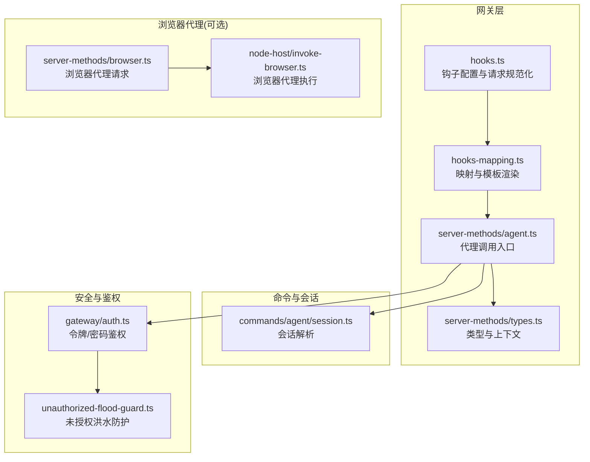
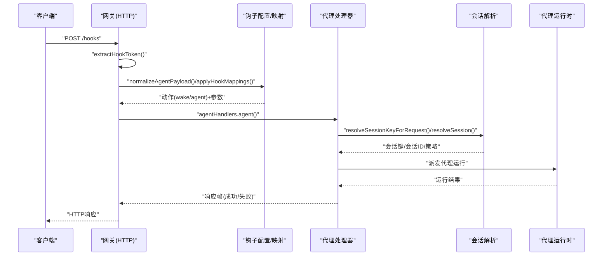
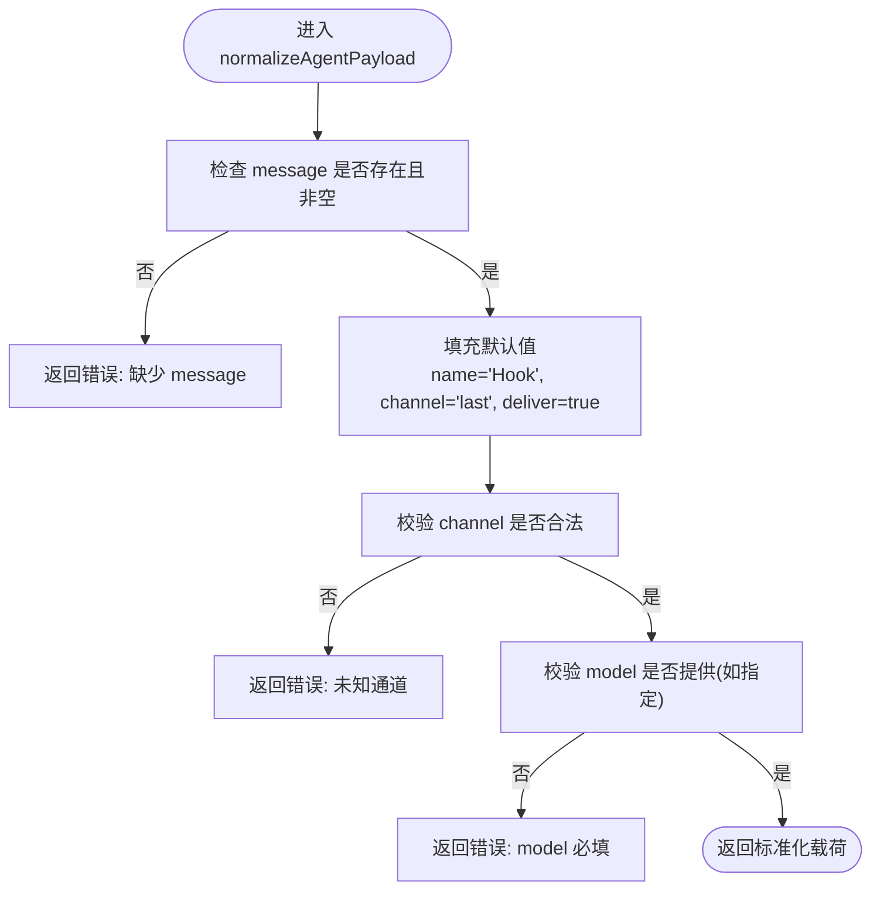
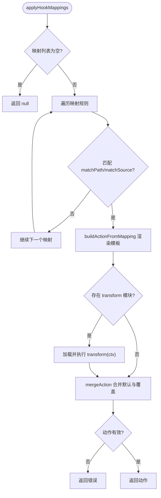
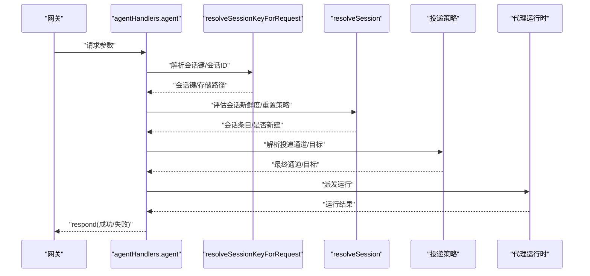
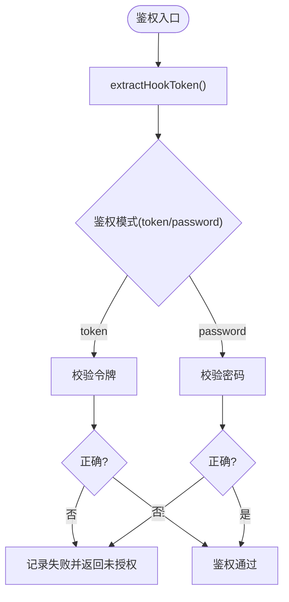
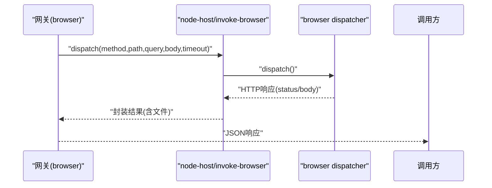
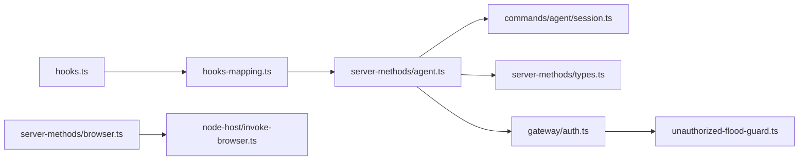

# 代理钩子

<cite>
**本文引用的文件**
- [hooks.ts](file://src/gateway/hooks.ts)
- [hooks-mapping.ts](file://src/gateway/hooks-mapping.ts)
- [agent.ts](file://src/gateway/server-methods/agent.ts)
- [types.ts](file://src/gateway/server-methods/types.ts)
- [session.ts](file://src/commands/agent/session.ts)
- [hooks.test.ts](file://src/gateway/hooks.test.ts)
- [hooks-test-helpers.ts](file://src/gateway/hooks-test-helpers.ts)
- [browser.ts](file://src/gateway/server-methods/browser.ts)
- [invoke-browser.ts](file://src/node-host/invoke-browser.ts)
- [auth.ts](file://src/gateway/auth.ts)
- [unauthorized-flood-guard.ts](file://src/gateway/server/ws-connection/unauthorized-flood-guard.ts)
</cite>

## 目录

1. [简介](#简介)
2. [项目结构](#项目结构)
3. [核心组件](#核心组件)
4. [架构总览](#架构总览)
5. [详细组件分析](#详细组件分析)
6. [依赖关系分析](#依赖关系分析)
7. [性能考量](#性能考量)
8. [故障排查指南](#故障排查指南)
9. [结论](#结论)
10. [附录](#附录)

## 简介

本文件系统性地文档化“代理钩子”API，涵盖其HTTP端点、请求与响应格式、代理ID解析、会话键处理、消息传递机制、代理选择策略、权限验证与错误处理，并提供完整的请求示例、参数说明与集成方法。同时总结安全注意事项与性能优化建议，帮助开发者在生产环境中稳定、安全地使用该能力。

## 项目结构

代理钩子由网关层的钩子配置与映射、请求规范化、会话解析与代理调度等模块协同完成。关键文件包括：

- 钩子配置与请求规范化：hooks.ts
- 映射与模板渲染：hooks-mapping.ts
- 代理调用入口与会话管理：server-methods/agent.ts
- 会话解析工具：commands/agent/session.ts
- 类型定义与上下文：server-methods/types.ts
- 安全与鉴权：gateway/auth.ts、unauthorized-flood-guard.ts
- 浏览器代理相关（可选）：server-methods/browser.ts、node-host/invoke-browser.ts
- 测试与示例：hooks.test.ts、hooks-test-helpers.ts

图表来源

- [hooks.ts:1-410](file://src/gateway/hooks.ts#L1-L410)
- [hooks-mapping.ts:1-527](file://src/gateway/hooks-mapping.ts#L1-L527)
- [agent.ts:149-784](file://src/gateway/server-methods/agent.ts#L149-L784)
- [types.ts:1-113](file://src/gateway/server-methods/types.ts#L1-L113)
- [session.ts:43-173](file://src/commands/agent/session.ts#L43-L173)
- [auth.ts:448-485](file://src/gateway/auth.ts#L448-L485)
- [unauthorized-flood-guard.ts:1-69](file://src/gateway/server/ws-connection/unauthorized-flood-guard.ts#L1-L69)
- [browser.ts:142-266](file://src/gateway/server-methods/browser.ts#L142-L266)
- [invoke-browser.ts:250-333](file://src/node-host/invoke-browser.ts#L250-L333)

章节来源

- [hooks.ts:1-410](file://src/gateway/hooks.ts#L1-L410)
- [hooks-mapping.ts:1-527](file://src/gateway/hooks-mapping.ts#L1-L527)
- [agent.ts:149-784](file://src/gateway/server-methods/agent.ts#L149-L784)
- [types.ts:1-113](file://src/gateway/server-methods/types.ts#L1-L113)
- [session.ts:43-173](file://src/commands/agent/session.ts#L43-L173)
- [auth.ts:448-485](file://src/gateway/auth.ts#L448-L485)
- [unauthorized-flood-guard.ts:1-69](file://src/gateway/server/ws-connection/unauthorized-flood-guard.ts#L1-L69)
- [browser.ts:142-266](file://src/gateway/server-methods/browser.ts#L142-L266)
- [invoke-browser.ts:250-333](file://src/node-host/invoke-browser.ts#L250-L333)

## 核心组件

- 钩子配置与路径
  - basePath：默认“/hooks”，支持自定义但不可为根路径“/”
  - token：必需，用于鉴权
  - maxBodyBytes：请求体大小限制
  - mappings：映射规则集合
  - agentPolicy：代理选择策略（默认代理、已知代理、白名单）
  - sessionPolicy：会话键策略（是否允许请求携带会话键、默认会话键、前缀白名单）

- 请求规范化
  - normalizeAgentPayload：校验并标准化代理请求载荷
  - normalizeHookHeaders：标准化请求头
  - normalizeWakePayload：唤醒模式文本校验
  - resolveHookChannel：通道合法性校验
  - resolveHookDeliver：投递开关默认值
  - resolveHookTargetAgentId：目标代理ID解析与回退
  - isHookAgentAllowed：代理ID白名单判定
  - resolveHookSessionKey：会话键解析与前缀校验
  - normalizeHookDispatchSessionKey：派发时会话键归一化

- 映射与模板
  - resolveHookMappings：解析映射规则与转换函数
  - applyHookMappings：匹配并构建动作（wake/agent），支持模板渲染与转换函数覆盖
  - renderTemplate/getByPath：安全的模板表达式求值，阻断原型链访问

- 代理调用与会话
  - agentHandlers.agent：代理入口，负责参数校验、会话解析、投递策略、运行上下文与派发
  - resolveSessionKeyForRequest/resolveSession：会话键与会话ID解析、重置策略、新鲜度评估
  - 会话存储与合并：loadSessionStore、mergeSessionEntry、updateSessionStore

- 安全与鉴权
  - extractHookToken：优先从Authorization头提取Bearer Token，其次从自定义头获取
  - auth.ts：令牌/密码鉴权流程与限流
  - unauthorized flood guard：未授权连接的洪水防护

章节来源

- [hooks.ts:15-94](file://src/gateway/hooks.ts#L15-L94)
- [hooks.ts:158-409](file://src/gateway/hooks.ts#L158-L409)
- [hooks-mapping.ts:106-183](file://src/gateway/hooks-mapping.ts#L106-L183)
- [hooks-mapping.ts:444-526](file://src/gateway/hooks-mapping.ts#L444-L526)
- [agent.ts:149-784](file://src/gateway/server-methods/agent.ts#L149-L784)
- [session.ts:43-173](file://src/commands/agent/session.ts#L43-L173)
- [auth.ts:448-485](file://src/gateway/auth.ts#L448-L485)
- [unauthorized-flood-guard.ts:18-58](file://src/gateway/server/ws-connection/unauthorized-flood-guard.ts#L18-L58)

## 架构总览

代理钩子的请求生命周期如下：

- 客户端向网关发送HTTP请求至“/hooks”路径（可配置）
- 网关提取并校验鉴权令牌
- 解析请求体，进行规范化与映射匹配
- 根据映射结果决定是“唤醒”还是“代理调用”
- 若为代理调用，解析会话键与会话ID，构建运行上下文并派发给代理
- 返回标准响应帧（成功/失败、错误码与消息）

图表来源

- [hooks.ts:158-409](file://src/gateway/hooks.ts#L158-L409)
- [hooks-mapping.ts:147-183](file://src/gateway/hooks-mapping.ts#L147-L183)
- [agent.ts:149-784](file://src/gateway/server-methods/agent.ts#L149-L784)
- [session.ts:43-173](file://src/commands/agent/session.ts#L43-L173)

## 详细组件分析

### 组件A：钩子配置与请求规范化

- 路径与令牌
  - basePath必须非根路径；token必填；maxBodyBytes限制请求体大小
- 代理策略
  - 默认代理ID来自全局配置；已知代理ID集合包含默认代理与所有已注册代理
  - allowedAgentIds为空表示拒绝所有显式代理ID；含“\*”表示允许全部
- 会话策略
  - 默认禁止请求携带会话键；可通过allowRequestSessionKey开启
  - allowedSessionKeyPrefixes限制会话键前缀；若设置defaultSessionKey则必须满足前缀要求
- 请求规范化
  - normalizeAgentPayload：message必填；channel默认“last”，可别名；deliver默认true；model/thinking/timeoutSeconds可选
  - normalizeHookHeaders：统一小写键名
  - normalizeWakePayload：text必填，mode可选“now/next-heartbeat”

图表来源

- [hooks.ts:209-409](file://src/gateway/hooks.ts#L209-L409)

章节来源

- [hooks.ts:15-94](file://src/gateway/hooks.ts#L15-L94)
- [hooks.ts:158-409](file://src/gateway/hooks.ts#L158-L409)
- [hooks.test.ts:18-145](file://src/gateway/hooks.test.ts#L18-L145)

### 组件B：映射与模板渲染

- 映射解析
  - 支持内建预设（如gmail）、用户自定义映射与转换函数目录
  - transform模块必须导出函数，支持默认或命名导出
- 匹配与动作
  - 匹配条件：path/source；支持模板渲染与转换函数二次覆盖
  - 动作类型：wake（仅文本）或 agent（消息+可选字段）
- 模板表达式
  - 支持payload._、headers._、query.\*与path、now等内置变量
  - 内置阻断：**proto**/prototype/constructor等键被屏蔽

图表来源

- [hooks-mapping.ts:147-183](file://src/gateway/hooks-mapping.ts#L147-L183)
- [hooks-mapping.ts:239-326](file://src/gateway/hooks-mapping.ts#L239-L326)
- [hooks-mapping.ts:444-526](file://src/gateway/hooks-mapping.ts#L444-L526)

章节来源

- [hooks-mapping.ts:106-183](file://src/gateway/hooks-mapping.ts#L106-L183)
- [hooks-mapping.ts:444-526](file://src/gateway/hooks-mapping.ts#L444-L526)
- [hooks.test.ts:457-496](file://src/gateway/hooks.test.ts#L457-L496)

### 组件C：代理调用与会话处理

- 参数校验与代理选择
  - 校验agentId是否在已知集合；若不在，按策略回退到默认代理
  - 校验sessionKey格式；若显式提供且与agentId不一致则拒绝
- 会话解析与重置
  - resolveSessionKeyForRequest：基于scope、mainKey与to计算会话键；支持按sessionId复用
  - resolveSession：评估会话新鲜度、重置策略，决定是否新建会话
- 投递策略与通道选择
  - 若请求要求投递且通道为内部通道，则需明确通道或已有通道历史
  - 通过resolveAgentDeliveryPlan与resolveAgentOutboundTarget确定最终目标
- 运行与响应
  - 采用去重与终端快照机制，支持agent.wait查询运行状态
  - 通过respond返回标准帧（成功/失败、错误码、元数据）

图表来源

- [agent.ts:149-784](file://src/gateway/server-methods/agent.ts#L149-L784)
- [session.ts:43-173](file://src/commands/agent/session.ts#L43-L173)

章节来源

- [agent.ts:149-784](file://src/gateway/server-methods/agent.ts#L149-L784)
- [session.ts:43-173](file://src/commands/agent/session.ts#L43-L173)

### 组件D：权限验证与错误处理

- 鉴权
  - extractHookToken：优先Bearer，其次自定义头
  - auth.ts：令牌/密码鉴权，错误计入限流
- 未授权洪水防护
  - UnauthorizedFloodGuard：统计未授权尝试，超过阈值关闭连接，周期性日志
- 错误码与响应
  - INVALID_REQUEST：参数非法、通道无效、会话键格式错误、投递通道缺失等
  - UNAVAILABLE：服务不可用（如浏览器代理失败）

图表来源

- [hooks.ts:158-175](file://src/gateway/hooks.ts#L158-L175)
- [auth.ts:448-485](file://src/gateway/auth.ts#L448-L485)
- [unauthorized-flood-guard.ts:18-58](file://src/gateway/server/ws-connection/unauthorized-flood-guard.ts#L18-L58)

章节来源

- [hooks.ts:158-175](file://src/gateway/hooks.ts#L158-L175)
- [auth.ts:448-485](file://src/gateway/auth.ts#L448-L485)
- [unauthorized-flood-guard.ts:18-58](file://src/gateway/server/ws-connection/unauthorized-flood-guard.ts#L18-L58)

### 组件E：浏览器代理（可选）

- 网关侧浏览器代理
  - 校验method/path/query/body/timeoutMs
  - 调用node-host层执行，超时/错误时构造详细错误信息
  - 支持文件路径收集与持久化映射
- 浏览器代理文件读取与结果封装
  - 读取代理文件，拼装结果与文件数组

图表来源

- [browser.ts:142-266](file://src/gateway/server-methods/browser.ts#L142-L266)
- [invoke-browser.ts:250-333](file://src/node-host/invoke-browser.ts#L250-L333)

章节来源

- [browser.ts:142-266](file://src/gateway/server-methods/browser.ts#L142-L266)
- [invoke-browser.ts:250-333](file://src/node-host/invoke-browser.ts#L250-L333)

## 依赖关系分析

- 组件耦合
  - hooks.ts与hooks-mapping.ts强关联：前者提供策略，后者提供动作与模板
  - agent.ts依赖session.ts进行会话解析，依赖types.ts的上下文与类型
  - auth.ts与unauthorized-flood-guard.ts共同保障接入安全
- 外部依赖
  - 映射中的transform模块需在受控目录内加载，防止路径逃逸
  - 浏览器代理依赖node-host层的路由分发与超时控制

图表来源

- [hooks.ts:1-410](file://src/gateway/hooks.ts#L1-L410)
- [hooks-mapping.ts:1-527](file://src/gateway/hooks-mapping.ts#L1-L527)
- [agent.ts:149-784](file://src/gateway/server-methods/agent.ts#L149-L784)
- [session.ts:43-173](file://src/commands/agent/session.ts#L43-L173)
- [types.ts:1-113](file://src/gateway/server-methods/types.ts#L1-L113)
- [auth.ts:448-485](file://src/gateway/auth.ts#L448-L485)
- [unauthorized-flood-guard.ts:1-69](file://src/gateway/server/ws-connection/unauthorized-flood-guard.ts#L1-L69)
- [browser.ts:142-266](file://src/gateway/server-methods/browser.ts#L142-L266)
- [invoke-browser.ts:250-333](file://src/node-host/invoke-browser.ts#L250-L333)

章节来源

- [hooks.ts:1-410](file://src/gateway/hooks.ts#L1-L410)
- [hooks-mapping.ts:1-527](file://src/gateway/hooks-mapping.ts#L1-L527)
- [agent.ts:149-784](file://src/gateway/server-methods/agent.ts#L149-L784)
- [session.ts:43-173](file://src/commands/agent/session.ts#L43-L173)
- [types.ts:1-113](file://src/gateway/server-methods/types.ts#L1-L113)
- [auth.ts:448-485](file://src/gateway/auth.ts#L448-L485)
- [unauthorized-flood-guard.ts:1-69](file://src/gateway/server/ws-connection/unauthorized-flood-guard.ts#L1-L69)
- [browser.ts:142-266](file://src/gateway/server-methods/browser.ts#L142-L266)
- [invoke-browser.ts:250-333](file://src/node-host/invoke-browser.ts#L250-L333)

## 性能考量

- 请求体大小限制：maxBodyBytes默认256KB，避免过大载荷导致内存压力
- 会话缓存与去重：使用去重表避免重复运行，agent.wait减少轮询开销
- 超时控制：浏览器代理与代理运行均支持超时，超时后返回明确错误
- 通道与投递：尽量在会话中保留通道信息，减少动态解析成本
- 日志与广播：谨慎使用高频日志与广播，避免放大网络与CPU消耗

## 故障排查指南

- 鉴权失败
  - 确认Authorization头或自定义头携带正确令牌
  - 检查令牌配置与客户端是否一致
- 通道无效
  - 确认channel为已知通道或“last”，别名会被规范化
- 会话键错误
  - 确认会话键前缀符合allowedSessionKeyPrefixes
  - 若允许请求携带会话键，请启用allowRequestSessionKey
- 投递通道缺失
  - 当请求要求投递且通道为内部通道时，需提供通道或具备历史通道
- 浏览器代理失败
  - 检查超时设置与代理状态；查看详细错误信息与状态快照

章节来源

- [hooks.ts:158-175](file://src/gateway/hooks.ts#L158-L175)
- [hooks.ts:304-333](file://src/gateway/hooks.ts#L304-L333)
- [agent.ts:520-561](file://src/gateway/server-methods/agent.ts#L520-L561)
- [browser.ts:247-262](file://src/gateway/server-methods/browser.ts#L247-L262)

## 结论

代理钩子提供了安全、可配置、可扩展的消息入口，结合映射与模板实现灵活的触发与派发。通过严格的鉴权、会话键前缀校验与通道策略，确保在多代理、多会话场景下的稳定性与安全性。建议在生产中合理设置令牌、路径与会话键前缀，利用映射与模板降低集成复杂度，并关注超时与日志开销以获得最佳性能。

## 附录

### 接口定义与参数说明

- 端点
  - 方法：POST
  - 路径：/hooks（可配置）
  - 认证：Authorization: Bearer <token> 或 X-OpenClaw-Token: <token>
- 请求体（代理动作）
  - message: 字符串，必填
  - name: 字符串，默认“Hook”
  - agentId: 字符串，可选（受allowedAgentIds约束）
  - wakeMode: "now"|"next-heartbeat"，默认"now"
  - sessionKey: 字符串，可选（受allowedSessionKeyPrefixes约束）
  - deliver: 布尔，默认true
  - channel: 字符串，通道ID或"last"，默认"last"
  - to: 字符串，目标标识，可选
  - model: 字符串，可选
  - thinking: 字符串，可选
  - timeoutSeconds: 数字，可选
- 响应
  - 成功：返回运行接受状态与runId
  - 失败：返回错误码与错误信息

章节来源

- [hooks.ts:209-409](file://src/gateway/hooks.ts#L209-L409)
- [agent.ts:149-784](file://src/gateway/server-methods/agent.ts#L149-L784)

### 完整请求示例（路径与参数）

- 示例A：基础代理调用
  - 路径：POST /hooks
  - 头部：Authorization: Bearer <token>
  - 请求体：
    - message: "你好"
    - channel: "telegram"
    - deliver: true
- 示例B：带会话键与模型
  - 请求体：
    - message: "请帮我查询状态"
    - sessionKey: "hook:incident-123"
    - model: "gpt-4"
    - thinking: "verbose"
    - timeoutSeconds: 30
- 示例C：唤醒模式
  - 请求体：
    - text: "有新邮件"
    - mode: "now"

章节来源

- [hooks.test.ts:68-87](file://src/gateway/hooks.test.ts#L68-L87)
- [hooks.test.ts:89-95](file://src/gateway/hooks.test.ts#L89-L95)
- [hooks.test.ts:97-145](file://src/gateway/hooks.test.ts#L97-L145)

### 集成方法

- 配置
  - 在配置中启用hooks并设置token、path、maxBodyBytes
  - 如需允许外部请求携带会话键，设置allowRequestSessionKey与allowedSessionKeyPrefixes
  - 可选：配置allowedAgentIds限制代理路由范围
- 映射
  - 定义mappings与可选transform模块，使用模板表达式从payload/headers/query中抽取字段
- 调用
  - 通过HTTP客户端向“/hooks”发送POST请求，遵循上述参数规范
  - 使用agent.wait查询运行状态，或直接接收即时响应

章节来源

- [hooks.ts:36-94](file://src/gateway/hooks.ts#L36-L94)
- [hooks-mapping.ts:106-183](file://src/gateway/hooks-mapping.ts#L106-L183)
- [hooks-test-helpers.ts:4-42](file://src/gateway/hooks-test-helpers.ts#L4-L42)

### 安全考虑

- 令牌管理：严格保管hooks.token，避免泄露
- 通道与代理白名单：通过allowedAgentIds与通道校验限制路由
- 会话键前缀：强制前缀白名单，防止跨域会话键滥用
- 模板安全：阻断原型链访问，避免注入风险
- 防洪与限流：结合UnauthorizedFloodGuard与鉴权限流，抵御未授权攻击

章节来源

- [hooks.ts:304-333](file://src/gateway/hooks.ts#L304-L333)
- [hooks-mapping.ts:485-526](file://src/gateway/hooks-mapping.ts#L485-L526)
- [unauthorized-flood-guard.ts:18-58](file://src/gateway/server/ws-connection/unauthorized-flood-guard.ts#L18-L58)
