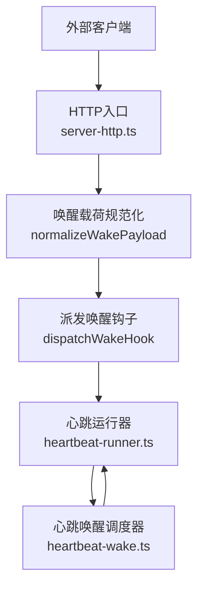
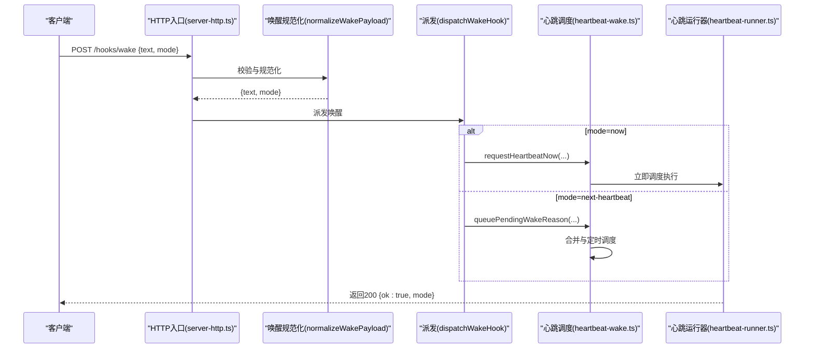
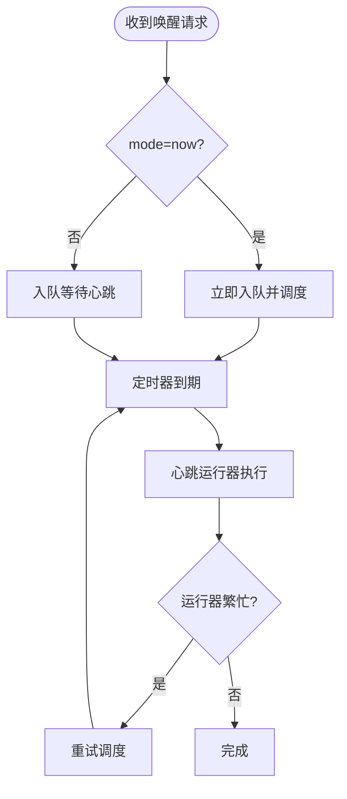

# 唤醒钩子

<cite>
**本文引用的文件**
- [src/gateway/hooks.ts](file://src/gateway/hooks.ts)
- [src/gateway/server-http.ts](file://src/gateway/server-http.ts)
- [src/infra/heartbeat-wake.ts](file://src/infra/heartbeat-wake.ts)
- [src/infra/heartbeat-runner.ts](file://src/infra/heartbeat-runner.ts)
- [docs/automation/webhook.md](file://docs/automation/webhook.md)
- [src/gateway/server.hooks.test.ts](file://src/gateway/server.hooks.test.ts)
- [src/gateway/server-http.hooks-request-timeout.test.ts](file://src/gateway/server-http.hooks-request-timeout.test.ts)
- [src/security/audit-extra.sync.ts](file://src/security/audit-extra.sync.ts)
- [src/security/audit.test.ts](file://src/security/audit.test.ts)
</cite>

## 目录

1. [简介](#简介)
2. [项目结构](#项目结构)
3. [核心组件](#核心组件)
4. [架构总览](#架构总览)
5. [详细组件分析](#详细组件分析)
6. [依赖关系分析](#依赖关系分析)
7. [性能考量](#性能考量)
8. [故障排查指南](#故障排查指南)
9. [结论](#结论)
10. [附录](#附录)

## 简介

本文件面向“唤醒钩子”API，系统性说明其HTTP端点、请求格式、响应结构与工作机制。重点覆盖两类触发模式：

- 即时唤醒（mode=now）：立即调度心跳运行，尽快执行会话检查与处理。
- 下次心跳（mode=next-heartbeat）：将唤醒请求排队合并，等待下一次周期性心跳统一执行。

文档同时解释唤醒文本处理、模式选择与执行逻辑，并提供完整的请求示例、参数说明、使用场景以及触发条件与状态反馈机制。

## 项目结构

与唤醒钩子直接相关的核心模块包括：

- 网关HTTP入口与路由：负责解析/校验请求、分发到具体处理函数。
- 唤醒规范化与派发：负责将外部请求转换为内部唤醒动作。
- 心跳调度与合并：负责将多个唤醒请求合并、去抖、按优先级调度执行。
- 文档与安全审计：提供官方文档与安全建议。

图表来源

- [src/gateway/server-http.ts:444-453](file://src/gateway/server-http.ts#L444-L453)
- [src/gateway/hooks.ts:209-220](file://src/gateway/hooks.ts#L209-L220)
- [src/infra/heartbeat-wake.ts:119-194](file://src/infra/heartbeat-wake.ts#L119-L194)
- [src/infra/heartbeat-runner.ts:1118-1144](file://src/infra/heartbeat-runner.ts#L1118-L1144)

章节来源

- [src/gateway/server-http.ts:444-453](file://src/gateway/server-http.ts#L444-L453)
- [src/gateway/hooks.ts:209-220](file://src/gateway/hooks.ts#L209-L220)
- [src/infra/heartbeat-wake.ts:119-194](file://src/infra/heartbeat-wake.ts#L119-L194)
- [src/infra/heartbeat-runner.ts:1118-1144](file://src/infra/heartbeat-runner.ts#L1118-L1144)

## 核心组件

- HTTP入口与路由
  - 路径：/hooks/wake
  - 方法：POST
  - 负载字段：text（必填）、mode（可选，默认now）
  - 响应：成功返回200，包含{ ok: true, mode }；失败返回400/401/413等错误码及错误信息
- 唤醒规范化
  - 将text进行trim并校验非空；mode标准化为"now"或"next-heartbeat"
- 派发与调度
  - 根据规范化后的mode，调用心跳调度器进行合并与定时执行
- 心跳运行器
  - 在心跳周期内实际执行会话检查、事件处理与回复

章节来源

- [src/gateway/server-http.ts:444-453](file://src/gateway/server-http.ts#L444-L453)
- [src/gateway/hooks.ts:209-220](file://src/gateway/hooks.ts#L209-L220)
- [src/infra/heartbeat-wake.ts:119-194](file://src/infra/heartbeat-wake.ts#L119-L194)
- [src/infra/heartbeat-runner.ts:1118-1144](file://src/infra/heartbeat-runner.ts#L1118-L1144)

## 架构总览

以下序列图展示从HTTP请求到心跳执行的关键流程：

图表来源

- [src/gateway/server-http.ts:444-453](file://src/gateway/server-http.ts#L444-L453)
- [src/gateway/hooks.ts:209-220](file://src/gateway/hooks.ts#L209-L220)
- [src/infra/heartbeat-wake.ts:238-250](file://src/infra/heartbeat-wake.ts#L238-L250)
- [src/infra/heartbeat-runner.ts:1118-1144](file://src/infra/heartbeat-runner.ts#L1118-L1144)

## 详细组件分析

### HTTP端点与请求/响应

- 端点
  - POST /hooks/wake
- 请求头
  - Authorization: Bearer <token>（推荐）
  - x-openclaw-token: <token>
  - Content-Type: application/json
- 请求体
  - text（字符串，必填）：事件描述文本
  - mode（字符串，可选，默认now）："now" 或 "next-heartbeat"
- 成功响应
  - 200 OK，JSON：{ ok: true, mode }
- 失败响应
  - 400 Bad Request：无效负载（如缺少text、字段类型不符）
  - 401 Unauthorized：鉴权失败
  - 413 Payload Too Large：请求体过大
  - 408 Request Timeout：读取请求体超时
  - 405 Method Not Allowed：非POST方法
  - 429 Too Many Requests：重复鉴权失败触发速率限制

章节来源

- [docs/automation/webhook.md:42-60](file://docs/automation/webhook.md#L42-L60)
- [src/gateway/server-http.ts:429-453](file://src/gateway/server-http.ts#L429-L453)
- [src/gateway/server-http.hooks-request-timeout.test.ts:81-96](file://src/gateway/server-http.hooks-request-timeout.test.ts#L81-L96)

### 唤醒文本处理与模式选择

- 文本处理
  - 规范化时对text执行trim并校验非空；空或缺失将导致400错误
- 模式选择
  - mode=now：立即触发心跳调度
  - mode=next-heartbeat：将唤醒理由入队，等待心跳周期统一执行
- 会话键与目标
  - /hooks/wake不接受sessionKey参数；默认作用于主会话

章节来源

- [src/gateway/hooks.ts:209-220](file://src/gateway/hooks.ts#L209-L220)
- [src/gateway/server-http.ts:444-453](file://src/gateway/server-http.ts#L444-L453)

### 执行逻辑与调度合并

- 即时唤醒（mode=now）
  - 调用requestHeartbeatNow，将唤醒理由入队并启动合并定时器
  - 定时器到期后，心跳运行器逐个取出待处理项并执行
- 下次心跳（mode=next-heartbeat）
  - 将唤醒理由入队，按优先级与时间合并
  - 若当前运行器繁忙或发生错误，自动安排重试
- 优先级与合并
  - 支持根据原因类型（如重试、间隔、动作）设定优先级
  - 同一目标（agentId+sessionKey）的多次请求会被合并，保留更高优先级或更新时间更近的请求

图表来源

- [src/infra/heartbeat-wake.ts:119-194](file://src/infra/heartbeat-wake.ts#L119-L194)
- [src/infra/heartbeat-runner.ts:1118-1144](file://src/infra/heartbeat-runner.ts#L1118-L1144)

章节来源

- [src/infra/heartbeat-wake.ts:119-194](file://src/infra/heartbeat-wake.ts#L119-L194)
- [src/infra/heartbeat-runner.ts:1118-1144](file://src/infra/heartbeat-runner.ts#L1118-L1144)

### 触发条件与状态反馈

- 触发条件
  - 正确的鉴权头（Authorization或x-openclaw-token）
  - 合法的JSON负载（text存在且非空；mode合法）
  - 网关已启用hooks且路径正确
- 状态反馈
  - 成功：200，返回mode
  - 失败：400/401/413/408/405/429等，返回错误信息

章节来源

- [src/gateway/server-http.ts:429-453](file://src/gateway/server-http.ts#L429-L453)
- [src/gateway/server.hooks.test.ts:60-71](file://src/gateway/server.hooks.test.ts#L60-L71)
- [src/gateway/server-http.hooks-request-timeout.test.ts:81-96](file://src/gateway/server-http.hooks-request-timeout.test.ts#L81-L96)

### 使用场景

- 即时唤醒（mode=now）
  - 需要立即响应的外部事件（如新邮件到达、监控告警）
- 下次心跳（mode=next-heartbeat）
  - 批量事件合并处理，降低心跳频率与资源消耗
- 与映射钩子配合
  - 通过hooks.mappings将任意外部事件转换为wake或agent动作

章节来源

- [docs/automation/webhook.md:42-60](file://docs/automation/webhook.md#L42-L60)
- [src/gateway/server-http.ts:487-512](file://src/gateway/server-http.ts#L487-L512)

## 依赖关系分析

- 组件耦合
  - server-http.ts依赖hooks.ts进行载荷规范化与鉴权
  - hooks.ts中的normalizeWakePayload与resolveHooksConfig为上层提供契约
  - heartbeat-wake.ts与heartbeat-runner.ts共同构成心跳调度与执行闭环
- 外部依赖
  - Node.js内置HTTP与定时器
  - 配置系统（OpenClaw配置）

图表来源

- [src/gateway/server-http.ts:444-453](file://src/gateway/server-http.ts#L444-L453)
- [src/gateway/hooks.ts:209-220](file://src/gateway/hooks.ts#L209-L220)
- [src/infra/heartbeat-wake.ts:119-194](file://src/infra/heartbeat-wake.ts#L119-L194)
- [src/infra/heartbeat-runner.ts:1118-1144](file://src/infra/heartbeat-runner.ts#L1118-L1144)

章节来源

- [src/gateway/server-http.ts:444-453](file://src/gateway/server-http.ts#L444-L453)
- [src/gateway/hooks.ts:209-220](file://src/gateway/hooks.ts#L209-L220)
- [src/infra/heartbeat-wake.ts:119-194](file://src/infra/heartbeat-wake.ts#L119-L194)
- [src/infra/heartbeat-runner.ts:1118-1144](file://src/infra/heartbeat-runner.ts#L1118-L1144)

## 性能考量

- 合并与去抖
  - 多个唤醒请求按目标聚合，减少心跳次数
- 重试与退避
  - 运行器繁忙或异常时自动重试，避免丢失请求
- 速率限制
  - 对重复鉴权失败进行限流，防止暴力破解

章节来源

- [src/infra/heartbeat-wake.ts:166-191](file://src/infra/heartbeat-wake.ts#L166-L191)
- [src/gateway/server-http.hooks-request-timeout.test.ts:98-122](file://src/gateway/server-http.hooks-request-timeout.test.ts#L98-L122)

## 故障排查指南

- 401 Unauthorized
  - 检查Authorization或x-openclaw-token是否正确传递
- 400 Bad Request
  - 检查text是否存在且非空；mode是否为"now"或"next-heartbeat"
- 413 Payload Too Large
  - 检查请求体大小是否超过配置限制
- 408 Request Timeout
  - 检查网络稳定性与请求体读取超时设置
- 429 Too Many Requests
  - 鉴权失败过多触发限流，稍后再试
- 行为验证
  - 可参考测试用例验证鉴权、模式切换与错误码行为

章节来源

- [src/gateway/server.hooks.test.ts:358-410](file://src/gateway/server.hooks.test.ts#L358-L410)
- [src/gateway/server-http.hooks-request-timeout.test.ts:81-96](file://src/gateway/server-http.hooks-request-timeout.test.ts#L81-L96)

## 结论

唤醒钩子提供简洁可靠的外部事件入口，支持即时与延后两种模式。通过规范化与调度合并，系统能在保证及时性的前提下降低资源消耗。建议结合hooks.mappings与安全审计配置，确保事件路由可控、鉴权可靠、日志安全。

## 附录

### 请求示例与参数说明

- 示例1：即时唤醒
  - curl -X POST http://127.0.0.1:18789/hooks/wake -H 'Authorization: Bearer SECRET' -H 'Content-Type: application/json' -d '{"text":"New email received","mode":"now"}'
- 示例2：下次心跳
  - curl -X POST http://127.0.0.1:18789/hooks/wake -H 'x-openclaw-token: SECRET' -H 'Content-Type: application/json' -d '{"text":"Monitor alert","mode":"next-heartbeat"}'

参数说明

- text：事件描述文本（必填）
- mode：触发模式（可选，默认now），"now"或"next-heartbeat"

章节来源

- [docs/automation/webhook.md:168-175](file://docs/automation/webhook.md#L168-L175)
- [src/gateway/server-http.ts:444-453](file://src/gateway/server-http.ts#L444-L453)

### 安全与配置要点

- 鉴权
  - 使用独立的hooks.token，不要复用网关令牌
  - 推荐Authorization头而非查询参数
- 速率限制
  - 重复鉴权失败将被限流
- 会话键策略
  - /hooks/wake不接受sessionKey；如需隔离会话，请使用/agent端点
- 日志与安全
  - 避免在日志中记录敏感原始负载
  - 默认对外部内容施加安全边界，必要时可在映射中开启例外

章节来源

- [docs/automation/webhook.md:204-216](file://docs/automation/webhook.md#L204-L216)
- [src/security/audit-extra.sync.ts:591-603](file://src/security/audit-extra.sync.ts#L591-L603)
- [src/security/audit.test.ts:2620-2657](file://src/security/audit.test.ts#L2620-L2657)
