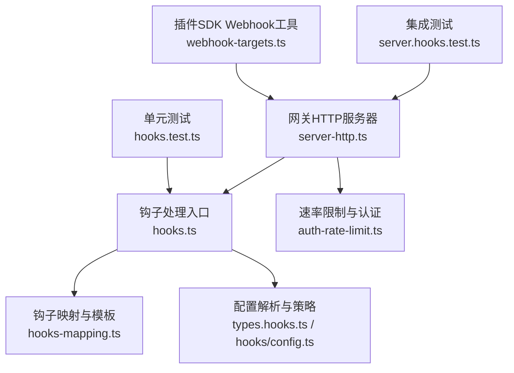
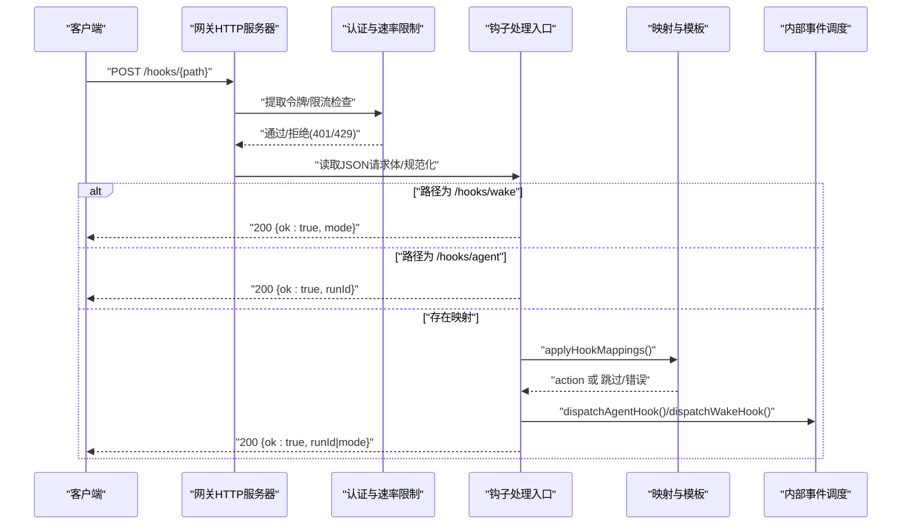
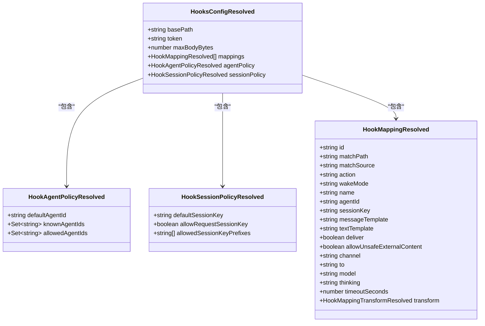

# 钩子API

<cite>
**本文引用的文件**
- [src/gateway/server-http.ts](file://src/gateway/server-http.ts)
- [src/gateway/hooks.ts](file://src/gateway/hooks.ts)
- [src/gateway/hooks-mapping.ts](file://src/gateway/hooks-mapping.ts)
- [src/gateway/auth-rate-limit.ts](file://src/gateway/auth-rate-limit.ts)
- [src/gateway/hooks.test.ts](file://src/gateway/hooks.test.ts)
- [src/gateway/server.hooks.test.ts](file://src/gateway/server.hooks.test.ts)
- [src/config/types.hooks.ts](file://src/config/types.hooks.ts)
- [src/hooks/config.ts](file://src/hooks/config.ts)
- [src/hooks/types.ts](file://src/hooks/types.ts)
- [src/plugin-sdk/webhook-targets.ts](file://src/plugin-sdk/webhook-targets.ts)
- [docs/automation/webhook.md](file://docs/automation/webhook.md)
</cite>

## 目录

1. [简介](#简介)
2. [项目结构](#项目结构)
3. [核心组件](#核心组件)
4. [架构总览](#架构总览)
5. [详细组件分析](#详细组件分析)
6. [依赖关系分析](#依赖关系分析)
7. [性能考量](#性能考量)
8. [故障排查指南](#故障排查指南)
9. [结论](#结论)
10. [附录](#附录)

## 简介

本文件为 OpenClaw 钩子API的权威技术文档，覆盖以下主题：

- HTTP端点与路由规则
- 认证与授权机制（含令牌、速率限制）
- 请求与响应格式规范
- agent钩子与wake钩子的调用方式、参数与返回值
- 钩子映射配置、模板渲染与事件处理
- 错误响应与安全策略、访问控制与审计建议
- 完整请求示例与集成步骤

## 项目结构

钩子API由“网关HTTP服务器”“钩子核心处理”“映射与模板引擎”“速率限制与认证”等模块协同完成。关键文件如下图所示：

**图表来源**

- [src/gateway/server-http.ts](file://src/gateway/server-http.ts)
- [src/gateway/hooks.ts](file://src/gateway/hooks.ts)
- [src/gateway/hooks-mapping.ts](file://src/gateway/hooks-mapping.ts)
- [src/gateway/auth-rate-limit.ts](file://src/gateway/auth-rate-limit.ts)
- [src/config/types.hooks.ts](file://src/config/types.hooks.ts)
- [src/hooks/config.ts](file://src/hooks/config.ts)
- [src/gateway/hooks.test.ts](file://src/gateway/hooks.test.ts)
- [src/gateway/server.hooks.test.ts](file://src/gateway/server.hooks.test.ts)
- [src/plugin-sdk/webhook-targets.ts](file://src/plugin-sdk/webhook-targets.ts)

**章节来源**

- [src/gateway/server-http.ts](file://src/gateway/server-http.ts)
- [src/gateway/hooks.ts](file://src/gateway/hooks.ts)
- [src/gateway/hooks-mapping.ts](file://src/gateway/hooks-mapping.ts)
- [src/gateway/auth-rate-limit.ts](file://src/gateway/auth-rate-limit.ts)
- [src/config/types.hooks.ts](file://src/config/types.hooks.ts)
- [src/hooks/config.ts](file://src/hooks/config.ts)
- [src/gateway/hooks.test.ts](file://src/gateway/hooks.test.ts)
- [src/gateway/server.hooks.test.ts](file://src/gateway/server.hooks.test.ts)
- [src/plugin-sdk/webhook-targets.ts](file://src/plugin-sdk/webhook-targets.ts)

## 核心组件

- 网关HTTP服务器：负责接收/校验/分发钩子请求，执行速率限制与认证，路由到具体处理逻辑。
- 钩子处理入口：解析配置、校验令牌、规范化请求体、路由到agent或wake处理。
- 映射与模板：将外部路径/来源匹配到内部动作（agent/wake），支持模板渲染与可选转换函数。
- 速率限制与认证：针对钩子认证失败进行滑动窗口限流，防止暴力破解。
- 配置与策略：定义钩子启用、令牌、默认会话键、允许的agentId、会话键前缀、最大请求体等。

**章节来源**

- [src/gateway/server-http.ts](file://src/gateway/server-http.ts)
- [src/gateway/hooks.ts](file://src/gateway/hooks.ts)
- [src/gateway/hooks-mapping.ts](file://src/gateway/hooks-mapping.ts)
- [src/gateway/auth-rate-limit.ts](file://src/gateway/auth-rate-limit.ts)
- [src/config/types.hooks.ts](file://src/config/types.hooks.ts)

## 架构总览

下图展示钩子API从请求进入网关到最终触发内部事件的完整流程。

**图表来源**

- [src/gateway/server-http.ts](file://src/gateway/server-http.ts)
- [src/gateway/hooks.ts](file://src/gateway/hooks.ts)
- [src/gateway/hooks-mapping.ts](file://src/gateway/hooks-mapping.ts)

## 详细组件分析

### HTTP端点与路由

- 默认基础路径：/hooks（可通过配置调整，但不可为根路径“/”）。
- 支持子路径：
  - /hooks/wake：触发唤醒
  - /hooks/agent：触发agent执行
  - 其他任意子路径：若配置了映射，则按映射规则处理
- 方法限制：仅允许POST；非POST返回405。
- 查询参数限制：禁止通过查询参数传递令牌；若携带token查询参数，直接返回400。

**章节来源**

- [src/gateway/server-http.ts](file://src/gateway/server-http.ts)
- [src/gateway/hooks.ts](file://src/gateway/hooks.ts)

### 认证与授权

- 令牌位置：
  - Authorization: Bearer <token>
  - 或 X-OpenClaw-Token 头
- 令牌校验：严格比较（恒等比较），不通过则记录失败并触发限流。
- 速率限制：
  - 作用域：钩子认证（hook-auth）
  - 窗口与锁定期：默认1分钟最多10次失败，超过则锁定5分钟
  - 重试等待：429响应包含Retry-After头
- 成功后重置：认证成功会重置该客户端的限流状态。

**章节来源**

- [src/gateway/server-http.ts](file://src/gateway/server-http.ts)
- [src/gateway/auth-rate-limit.ts](file://src/gateway/auth-rate-limit.ts)

### 请求与响应格式

#### 通用请求头

- Content-Type: application/json
- Authorization: Bearer <token> 或 X-OpenClaw-Token
- 不允许使用查询参数传递令牌

#### 通用响应

- 成功：200，返回 {ok: true, ...}
- 参数错误：400，返回 {ok: false, error: "..."}
- 未授权：401
- 限流：429，包含 Retry-After
- 方法不允许：405
- 路径不存在：404
- 请求体过大/超时：413/408
- 映射异常：500

**章节来源**

- [src/gateway/server-http.ts](file://src/gateway/server-http.ts)
- [src/gateway/hooks.ts](file://src/gateway/hooks.ts)

### agent钩子（/hooks/agent）

- 功能：将外部请求转化为一次agent执行任务。
- 请求体字段（均需规范化/校验）：
  - message: 必填，去空白后不能为空
  - name: 可选，默认“Hook”
  - agentId: 可选，受allowedAgentIds策略约束
  - wakeMode: 可选，“now”或“next-heartbeat”，默认“now”
  - sessionKey: 可选，受allowRequestSessionKey与allowedSessionKeyPrefixes策略约束
  - channel: 可选，必须是已注册通道之一；若为特定通道别名，会被规范化
  - to: 可选，目标标识
  - model: 可选，模型名称
  - deliver: 可选，默认true
  - thinking: 可选，思考模式
  - timeoutSeconds: 可选，正整数秒
- 响应：
  - 200 {ok: true, runId: string}

- 会话键策略：
  - 若请求携带sessionKey且未开启allowRequestSessionKey，将被拒绝
  - 若未携带且未设置defaultSessionKey，则自动生成以“hook:”开头的会话键
  - 生成的会话键需满足allowedSessionKeyPrefixes要求

- agent路由策略：
  - 若显式agentId不在allowedAgentIds中，将被拒绝
  - 若未指定agentId，将回退到默认agent

**章节来源**

- [src/gateway/server-http.ts](file://src/gateway/server-http.ts)
- [src/gateway/hooks.ts](file://src/gateway/hooks.ts)

### wake钩子（/hooks/wake）

- 功能：触发一次系统唤醒（可选择立即或下次心跳）。
- 请求体字段：
  - text: 必填，去空白后不能为空
  - mode: 可选，“now”或“next-heartbeat”，默认“now”
- 响应：
  - 200 {ok: true, mode: "now"|"next-heartbeat"}

- 安全与策略：
  - 文本为空白将被拒绝
  - 令牌校验失败将触发限流

**章节来源**

- [src/gateway/server-http.ts](file://src/gateway/server-http.ts)
- [src/gateway/hooks.ts](file://src/gateway/hooks.ts)

### 钩子映射（mappings）

- 目的：将任意子路径/来源请求映射为agent或wake动作，并支持模板渲染与可选转换函数。
- 关键配置项（节选）：
  - match.path: 匹配请求路径
  - match.source: 匹配payload中的source字段
  - action: "agent" 或 "wake"
  - messageTemplate/textTemplate: 模板字符串，使用payload变量渲染
  - agentId/sessionKey/channel/to/model/thinking/timeoutSeconds: 可选覆盖
  - deliver/allowUnsafeExternalContent: 可选覆盖
  - transform.module: 可选转换模块路径（相对配置目录内）
  - transform.export: 可选导出名（默认default或transform）

- 渲染与合并：
  - 先根据模板生成基础动作，再应用转换函数的覆盖结果
  - 对于wake，要求最终text非空；对于agent，要求message非空
  - 若转换函数返回null，表示跳过该映射

- 安全与路径限制：
  - 转换模块路径必须位于配置目录内，禁止绝对路径与逃逸
  - 映射列表为空时直接跳过

**章节来源**

- [src/gateway/hooks-mapping.ts](file://src/gateway/hooks-mapping.ts)
- [src/config/types.hooks.ts](file://src/config/types.hooks.ts)

### 配置与策略（节选）

- hooks.enabled: 开启钩子API
- hooks.path: 自定义基础路径（默认“/hooks”）
- hooks.token: 必填，用于鉴权
- hooks.defaultSessionKey: 默认会话键（可选）
- hooks.allowRequestSessionKey: 是否允许请求体中的sessionKey（默认false）
- hooks.allowedSessionKeyPrefixes: 会话键前缀白名单（可选）
- hooks.allowedAgentIds: 允许的agentId白名单（支持通配符“\*”）
- hooks.maxBodyBytes: 最大请求体字节数（默认约256KB）
- hooks.presets: 预设映射（如gmail）
- hooks.mappings: 自定义映射列表
- hooks.transformsDir: 转换模块目录（相对配置目录）

- 运行时策略解析：
  - 会话键前缀与默认值的合法性校验
  - agentId白名单与默认agent解析
  - 映射解析与转换模块路径解析

**章节来源**

- [src/config/types.hooks.ts](file://src/config/types.hooks.ts)
- [src/hooks/config.ts](file://src/hooks/config.ts)
- [src/gateway/hooks.ts](file://src/gateway/hooks.ts)

### 插件SDK Webhook工具（对比参考）

- 提供统一的Webhook目标匹配与拒绝响应工具，包括方法限制、未授权/歧义响应等，便于理解钩子API的错误处理风格。

**章节来源**

- [src/plugin-sdk/webhook-targets.ts](file://src/plugin-sdk/webhook-targets.ts)

## 依赖关系分析

**图表来源**

- [src/gateway/hooks.ts](file://src/gateway/hooks.ts)
- [src/gateway/hooks-mapping.ts](file://src/gateway/hooks-mapping.ts)

**章节来源**

- [src/gateway/hooks.ts](file://src/gateway/hooks.ts)
- [src/gateway/hooks-mapping.ts](file://src/gateway/hooks-mapping.ts)

## 性能考量

- 速率限制：针对钩子认证失败采用滑动窗口限流，降低暴力破解风险。
- 请求体大小：默认最大约256KB，避免过大负载。
- 映射缓存：转换函数模块按路径+导出名缓存，减少重复导入开销。
- 会话键生成：在未提供时按需生成，避免不必要的复杂性。

[本节为通用指导，无需列出具体文件来源]

## 故障排查指南

- 400 Bad Request
  - 查询参数包含token：请改用Authorization头或X-OpenClaw-Token头
  - wake请求text为空白
  - agent请求message为空白
  - 映射缺少必要字段（如wake的text或agent的message）
- 401 Unauthorized
  - 令牌缺失或错误
  - 令牌校验失败将触发限流
- 429 Too Many Requests
  - 连续认证失败触发限流，等待Retry-After秒后重试
- 405 Method Not Allowed
  - 仅允许POST
- 404 Not Found
  - 未匹配到具体处理逻辑（路径不存在或无映射）
- 413 Payload Too Large / 408 Request Timeout
  - 请求体过大或连接超时
- 500 Internal Server Error
  - 映射处理异常（转换模块抛错或非法导出）

**章节来源**

- [src/gateway/server-http.ts](file://src/gateway/server-http.ts)
- [src/gateway/hooks.test.ts](file://src/gateway/hooks.test.ts)
- [src/gateway/server.hooks.test.ts](file://src/gateway/server.hooks.test.ts)

## 结论

OpenClaw钩子API提供了简洁、安全、可扩展的HTTP接口，支持两类核心能力：

- wake钩子：快速触发系统唤醒
- agent钩子：将外部事件转化为agent执行任务
  同时通过令牌认证、速率限制、会话键与agent路由策略、映射模板与转换函数，确保在多场景下的可控性与安全性。

[本节为总结，无需列出具体文件来源]

## 附录

### 请求示例（不含代码内容）

- 发送 wake 请求
  - 方法：POST
  - 路径：/hooks/wake
  - 头部：Authorization: Bearer <你的钩子令牌>
  - 请求体：{ "text": "你好", "mode": "now" }
  - 响应：200 { "ok": true, "mode": "now" }

- 发送 agent 请求
  - 方法：POST
  - 路径：/hooks/agent
  - 头部：Authorization: Bearer <你的钩子令牌>
  - 请求体：{ "message": "帮我查邮件", "name": "邮件助手", "agentId": "main" }
  - 响应：200 { "ok": true, "runId": "<任务ID>" }

- 使用映射
  - 方法：POST
  - 路径：/hooks/任意子路径
  - 头部：Authorization: Bearer <你的钩子令牌>
  - 请求体：任意JSON（映射将根据模板渲染）
  - 响应：200 { "ok": true, "runId" 或 "mode" }

**章节来源**

- [src/gateway/server.hooks.test.ts](file://src/gateway/server.hooks.test.ts)
- [src/gateway/server-http.ts](file://src/gateway/server-http.ts)

### 集成指南

- 在配置中启用钩子API并设置hooks.token
- 将外部系统通过HTTP POST调用 /hooks/wake 或 /hooks/agent
- 如需复杂路由与模板，请配置hooks.mappings与transform模块
- 为钩子令牌设置独立密钥，避免与网关其他令牌混用
- 启用并合理配置allowedAgentIds、allowedSessionKeyPrefixes与allowRequestSessionKey
- 保持maxBodyBytes适中，避免过大负载
- 参考安全建议：仅在可信网络暴露端点、避免敏感日志输出原始payload、必要时禁用unsafe外部内容

**章节来源**

- [src/config/types.hooks.ts](file://src/config/types.hooks.ts)
- [docs/automation/webhook.md](file://docs/automation/webhook.md)
