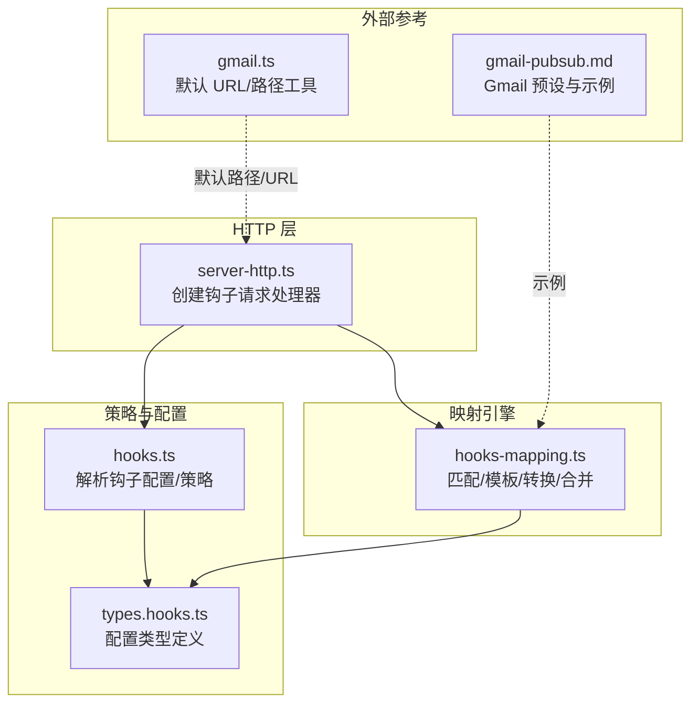
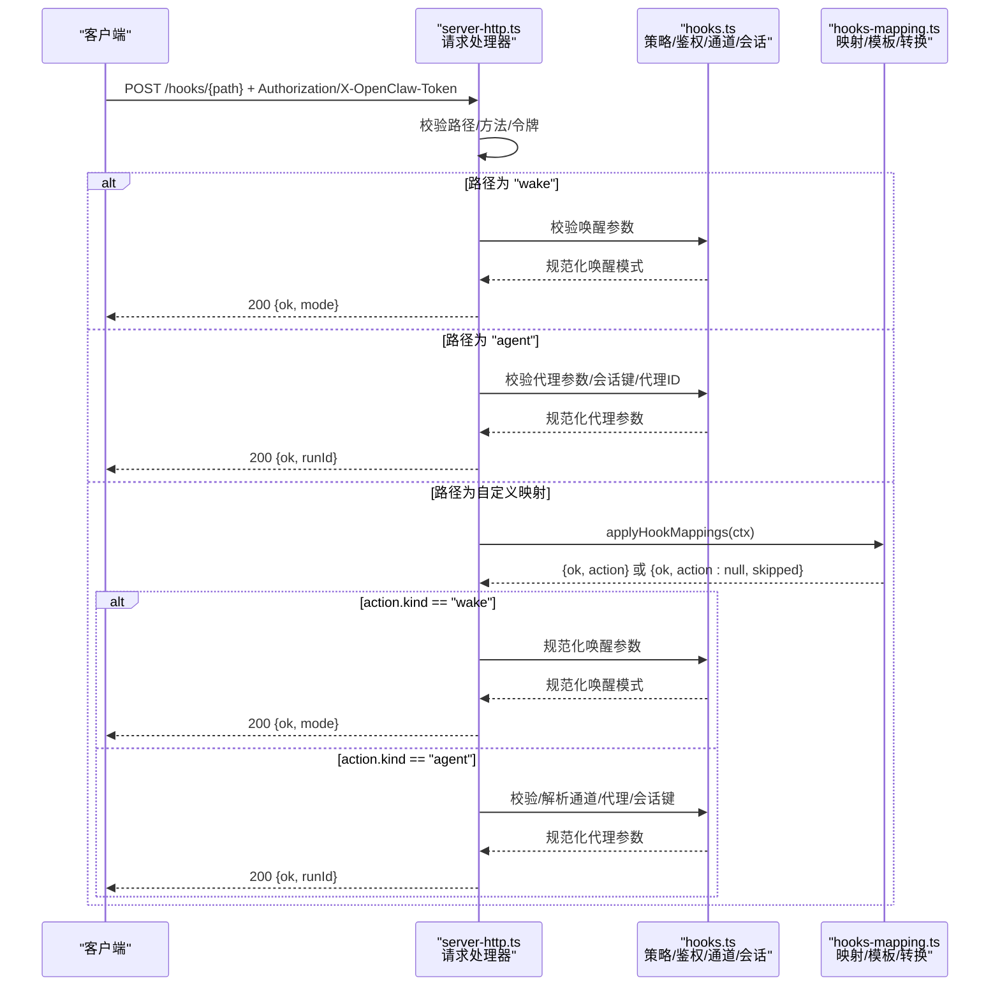
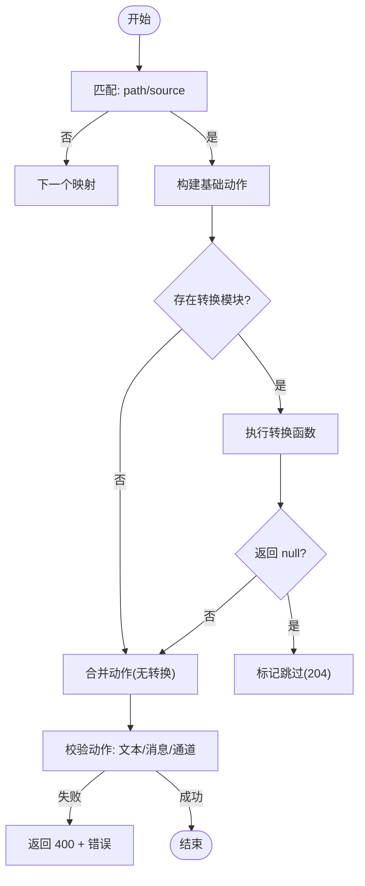
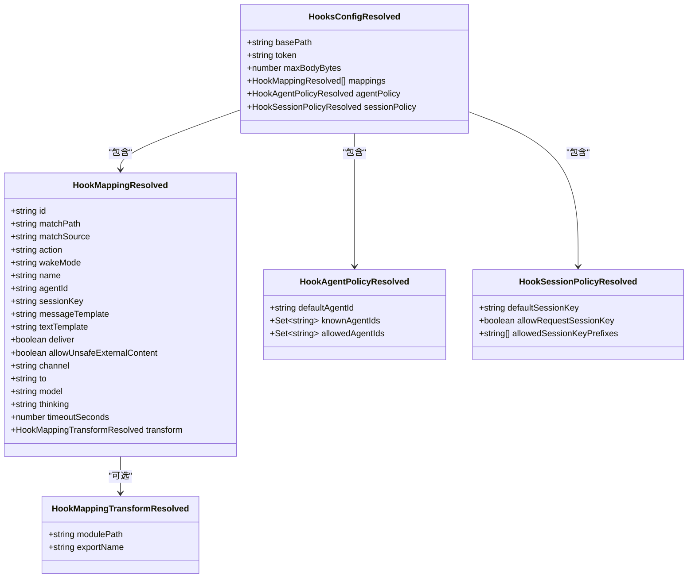

# 钩子映射

<cite>
**本文引用的文件**
- [src/gateway/hooks-mapping.ts](file://src/gateway/hooks-mapping.ts)
- [src/gateway/hooks.ts](file://src/gateway/hooks.ts)
- [src/gateway/server-http.ts](file://src/gateway/server-http.ts)
- [src/config/types.hooks.ts](file://src/config/types.hooks.ts)
- [src/gateway/hooks-mapping.test.ts](file://src/gateway/hooks-mapping.test.ts)
- [src/config/config.hooks-module-paths.test.ts](file://src/config/config.hooks-module-paths.test.ts)
- [docs/zh-CN/automation/gmail-pubsub.md](file://docs/zh-CN/automation/gmail-pubsub.md)
- [src/hooks/gmail.ts](file://src/hooks/gmail.ts)
</cite>

## 目录

1. [简介](#简介)
2. [项目结构](#项目结构)
3. [核心组件](#核心组件)
4. [架构总览](#架构总览)
5. [详细组件分析](#详细组件分析)
6. [依赖关系分析](#依赖关系分析)
7. [性能考量](#性能考量)
8. [故障排除指南](#故障排除指南)
9. [结论](#结论)
10. [附录](#附录)

## 简介

本文件面向“钩子映射”API，系统化说明其配置格式、匹配与转换规则、动作类型、通道解析与代理选择机制、错误处理与调试方法，并提供完整配置示例与最佳实践。钩子映射允许你基于请求上下文（路径、来源、头部、查询与载荷）进行条件匹配，并将结果映射为“唤醒”或“代理消息”动作，最终由网关调度至指定代理与通道。

## 项目结构

钩子映射相关实现集中在以下模块：

- 配置类型与策略：hooks.ts、types.hooks.ts
- 映射解析与模板渲染：hooks-mapping.ts
- HTTP 入口与鉴权/路由：server-http.ts
- 示例与参考：gmail-pubsub 文档、Gmail 辅助工具

图表来源

- [src/gateway/server-http.ts:348-564](file://src/gateway/server-http.ts#L348-L564)
- [src/gateway/hooks.ts:36-94](file://src/gateway/hooks.ts#L36-L94)
- [src/gateway/hooks-mapping.ts:106-145](file://src/gateway/hooks-mapping.ts#L106-L145)
- [src/config/types.hooks.ts:110-141](file://src/config/types.hooks.ts#L110-L141)
- [docs/zh-CN/automation/gmail-pubsub.md:42-94](file://docs/zh-CN/automation/gmail-pubsub.md#L42-L94)
- [src/hooks/gmail.ts:91-98](file://src/hooks/gmail.ts#L91-L98)

章节来源

- [src/gateway/server-http.ts:348-564](file://src/gateway/server-http.ts#L348-L564)
- [src/gateway/hooks.ts:36-94](file://src/gateway/hooks.ts#L36-L94)
- [src/gateway/hooks-mapping.ts:106-145](file://src/gateway/hooks-mapping.ts#L106-L145)
- [src/config/types.hooks.ts:110-141](file://src/config/types.hooks.ts#L110-L141)

## 核心组件

- 配置类型与策略
  - HooksConfig/HookMappingConfig：定义映射项、动作、通道、会话键策略、预设与 Gmail 特定配置等。
  - HooksConfigResolved：运行时解析后的配置，含基础路径、令牌、最大载荷、映射集与策略集合。
- 映射引擎
  - 解析映射：resolveHookMappings，规范化匹配条件、动作字段与转换模块路径。
  - 应用映射：applyHookMappings，按序匹配、构建基础动作、可选转换、合并结果。
  - 模板与表达式：renderTemplate/resolveTemplateExpr，支持 payload._、headers._、query.\*、path、now 等。
  - 转换模块：loadTransform/resolveTransformFn，缓存与安全校验，支持默认导出与命名导出。
- HTTP 请求处理
  - createHooksRequestHandler：鉴权、路径校验、方法限制、读取 JSON、分发到“唤醒”或“代理”分支，或应用映射。
  - 会话键与代理选择：resolveHookSessionKey/normalizeHookDispatchSessionKey、resolveHookTargetAgentId、resolveHookChannel、resolveHookDeliver。
- 错误与安全
  - 令牌鉴权与限流、路径/模块路径安全校验、模板表达式黑名单、映射动作必填校验。

章节来源

- [src/config/types.hooks.ts:1-143](file://src/config/types.hooks.ts#L1-L143)
- [src/gateway/hooks.ts:15-410](file://src/gateway/hooks.ts#L15-L410)
- [src/gateway/hooks-mapping.ts:7-527](file://src/gateway/hooks-mapping.ts#L7-L527)
- [src/gateway/server-http.ts:348-564](file://src/gateway/server-http.ts#L348-L564)

## 架构总览

钩子映射的端到端流程如下：

图表来源

- [src/gateway/server-http.ts:348-564](file://src/gateway/server-http.ts#L348-L564)
- [src/gateway/hooks.ts:241-410](file://src/gateway/hooks.ts#L241-L410)
- [src/gateway/hooks-mapping.ts:147-183](file://src/gateway/hooks-mapping.ts#L147-L183)

## 详细组件分析

### 配置格式与策略

- 基础配置
  - hooks.enabled、hooks.path、hooks.token、hooks.maxBodyBytes、hooks.defaultSessionKey、hooks.allowRequestSessionKey、hooks.allowedSessionKeyPrefixes、hooks.allowedAgentIds、hooks.presets、hooks.transformsDir、hooks.mappings、hooks.gmail、hooks.internal。
- 映射项（HookMappingConfig）
  - id、match（path/source）、action（"wake"|"agent"）、wakeMode（"now"|"next-heartbeat"）、name、agentId、sessionKey、messageTemplate、textTemplate、deliver、allowUnsafeExternalContent、channel、to、model、thinking、timeoutSeconds、transform（module/export）。
- 运行时解析（HooksConfigResolved）
  - basePath、token、maxBodyBytes、mappings、agentPolicy（defaultAgentId/knownAgentIds/allowedAgentIds）、sessionPolicy（defaultSessionKey/allowRequestSessionKey/allowedSessionKeyPrefixes）。
- 策略要点
  - 令牌必须通过 Authorization Bearer 或 X-OpenClaw-Token 提供，禁止 query 参数传 token。
  - basePath 必须非根路径，且映射 path 匹配需严格。
  - 会话键默认生成，可受 allowedSessionKeyPrefixes 限制；请求级 sessionKey 受 allowRequestSessionKey 控制。
  - 代理 ID 未知时回退到默认代理，allowedAgentIds 为空表示允许全部。

章节来源

- [src/config/types.hooks.ts:110-141](file://src/config/types.hooks.ts#L110-L141)
- [src/gateway/hooks.ts:36-94](file://src/gateway/hooks.ts#L36-L94)
- [src/gateway/server-http.ts:378-420](file://src/gateway/server-http.ts#L378-L420)

### 映射规则与处理逻辑

- 匹配
  - match.path：标准化路径前后斜杠后比较；未设置则不参与匹配。
  - match.source：payload.source 字符串精确匹配；未设置则不参与匹配。
- 构建基础动作
  - action == "wake"：使用 textTemplate 渲染文本；action == "agent"：使用 messageTemplate 渲染消息体。
- 转换模块（可选）
  - transform.module 必须位于 hooks.transformsDir 或其子目录内，支持相对路径与命名导出；默认导出或 export: "transform"。
  - 返回 null 表示跳过该映射；返回部分字段用于与基础动作合并。
- 合并策略
  - wake：优先使用覆盖的 text/模式；若未覆盖则保留基础值。
  - agent：优先使用覆盖字段；未覆盖则保留基础字段；deliver 默认 true。
- 校验
  - wake 必须提供非空文本；agent 必须提供非空消息；channel 必须在允许集合内；agentId 必须被允许。

图表来源

- [src/gateway/hooks-mapping.ts:147-183](file://src/gateway/hooks-mapping.ts#L147-L183)
- [src/gateway/hooks-mapping.ts:224-237](file://src/gateway/hooks-mapping.ts#L224-L237)
- [src/gateway/hooks-mapping.ts:239-273](file://src/gateway/hooks-mapping.ts#L239-L273)
- [src/gateway/hooks-mapping.ts:275-313](file://src/gateway/hooks-mapping.ts#L275-L313)
- [src/gateway/hooks-mapping.ts:315-326](file://src/gateway/hooks-mapping.ts#L315-L326)

章节来源

- [src/gateway/hooks-mapping.ts:147-183](file://src/gateway/hooks-mapping.ts#L147-L183)
- [src/gateway/hooks-mapping.ts:224-237](file://src/gateway/hooks-mapping.ts#L224-L237)
- [src/gateway/hooks-mapping.ts:239-273](file://src/gateway/hooks-mapping.ts#L239-L273)
- [src/gateway/hooks-mapping.ts:275-313](file://src/gateway/hooks-mapping.ts#L275-L313)
- [src/gateway/hooks-mapping.ts:315-326](file://src/gateway/hooks-mapping.ts#L315-L326)

### 动作类型与通道解析

- 动作类型
  - wake：触发唤醒，支持 now/next-heartbeat 模式。
  - agent：派发给代理，支持 name、agentId、sessionKey、deliver、channel、to、model、thinking、timeoutSeconds、allowUnsafeExternalContent。
- 通道解析
  - 支持 "last" 与各插件通道 ID；未设置默认 "last"；非法通道返回错误。
- 代理选择
  - 若显式 agentId 未知，回退到默认代理；allowedAgentIds 为空表示允许全部。
- 会话键
  - 优先使用请求/映射提供的 sessionKey（受 allowRequestSessionKey 与前缀白名单控制）；否则使用默认值或随机生成；最终会根据目标代理规范化。

章节来源

- [src/gateway/hooks.ts:241-352](file://src/gateway/hooks.ts#L241-L352)
- [src/gateway/server-http.ts:513-548](file://src/gateway/server-http.ts#L513-L548)

### 模板与表达式

- 支持表达式
  - path：当前子路径
  - now：当前时间 ISO 字符串
  - headers.{key}：请求头
  - query.{key}：查询参数
  - payload.{key}：请求载荷（数组索引与点号访问）
- 访问控制
  - 对 payload/query/headers 的路径访问进行黑名单过滤，避免原型链污染。
- 渲染行为
  - 未命中或空值渲染为空字符串；数值/布尔转字符串；对象序列化。

章节来源

- [src/gateway/hooks-mapping.ts:444-483](file://src/gateway/hooks-mapping.ts#L444-L483)
- [src/gateway/hooks-mapping.ts:485-526](file://src/gateway/hooks-mapping.ts#L485-L526)

### 转换模块与安全

- 模块路径
  - transform.module 必须位于 hooks.transformsDir 或其子目录内，支持相对路径；拒绝绝对路径与越界路径。
  - transformsDir 可选，默认在配置目录 hooks/transforms 下。
- 导出解析
  - 支持显式 export 名称，或默认导出与 "transform" 命名导出。
- 缓存
  - 按模块路径与导出名缓存转换函数，避免重复加载。
- 符号链接保护
  - 对现有祖先路径进行 realpath 校验，防止符号链接逃逸。

章节来源

- [src/gateway/hooks-mapping.ts:136-144](file://src/gateway/hooks-mapping.ts#L136-L144)
- [src/gateway/hooks-mapping.ts:328-350](file://src/gateway/hooks-mapping.ts#L328-L350)
- [src/gateway/hooks-mapping.test.ts:185-203](file://src/gateway/hooks-mapping.test.ts#L185-L203)
- [src/gateway/hooks-mapping.test.ts:226-245](file://src/gateway/hooks-mapping.test.ts#L226-L245)
- [src/gateway/hooks-mapping.test.ts:274-299](file://src/gateway/hooks-mapping.test.ts#L274-L299)
- [src/config/config.hooks-module-paths.test.ts:14-30](file://src/config/config.hooks-module-paths.test.ts#L14-L30)

### Gmail 预设与示例

- 预设
  - presets: ["gmail"] 将注入默认 Gmail 映射（含 sessionKey、messageTemplate 等）。
- 覆盖与增强
  - 可在 mappings 中覆盖 deliver、channel、to、model、thinking 等字段。
- 默认 URL/路径
  - 默认钩子路径与 Gmail 推送路径可通过工具函数生成与规范化。

章节来源

- [src/gateway/hooks-mapping.ts:67-80](file://src/gateway/hooks-mapping.ts#L67-L80)
- [docs/zh-CN/automation/gmail-pubsub.md:42-94](file://docs/zh-CN/automation/gmail-pubsub.md#L42-L94)
- [src/hooks/gmail.ts:91-98](file://src/hooks/gmail.ts#L91-L98)

## 依赖关系分析

图表来源

- [src/gateway/hooks.ts:15-34](file://src/gateway/hooks.ts#L15-L34)
- [src/gateway/hooks-mapping.ts:7-31](file://src/gateway/hooks-mapping.ts#L7-L31)

章节来源

- [src/gateway/hooks.ts:15-34](file://src/gateway/hooks.ts#L15-L34)
- [src/gateway/hooks-mapping.ts:7-31](file://src/gateway/hooks-mapping.ts#L7-L31)

## 性能考量

- 模块缓存
  - 转换函数按模块路径与导出名缓存，减少重复导入开销。
- 最大载荷限制
  - hooks.maxBodyBytes 控制 JSON 读取上限，避免过大请求导致内存压力。
- 匹配顺序
  - 映射按顺序遍历，建议将高命中率与简单匹配的映射靠前放置。
- 模板渲染
  - 模板表达式仅支持有限键路径，避免深层复杂计算；必要时在转换模块中预处理。
- 通道与代理
  - 通道解析与代理选择为常量时间操作；避免在映射中做昂贵的外部调用。

[本节为通用指导，无需列出具体文件来源]

## 故障排除指南

- 常见错误与定位
  - 令牌错误/限流：检查 Authorization Bearer 或 X-OpenClaw-Token 是否正确提供；确认未使用 query 参数传 token；关注 401/429 响应。
  - 方法错误：仅允许 POST；确认方法为 POST。
  - 路径错误：basePath 与子路径必须符合规范；确认 basePath 非根路径。
  - 载荷过大/超时：调整 hooks.maxBodyBytes；检查网络与上游服务。
  - 映射失败：检查映射是否匹配（path/source）、模板是否正确、转换模块是否可导入。
  - 动作校验失败：wake 需要非空文本；agent 需要非空消息；channel 必须合法；agentId 必须允许。
  - 会话键问题：若禁用请求级 sessionKey，不要在请求中携带；确保 sessionKey 前缀符合 allowedSessionKeyPrefixes。
  - 转换模块路径：确保 transform.module 在 hooks.transformsDir 或其子目录内；避免绝对路径与越界路径；注意符号链接逃逸防护。
- 调试建议
  - 查看网关日志中的 hook 相关警告与错误。
  - 使用最小映射验证：先用最简映射（仅 path/source + action）验证匹配与动作。
  - 分步验证：先验证模板渲染，再验证转换模块，最后验证通道与代理。
  - 使用测试用例思路：参考 hooks-mapping.test.ts 与 config.hooks-module-paths.test.ts 的断言场景。

章节来源

- [src/gateway/server-http.ts:383-420](file://src/gateway/server-http.ts#L383-L420)
- [src/gateway/server-http.ts:429-439](file://src/gateway/server-http.ts#L429-L439)
- [src/gateway/hooks-mapping.ts:315-326](file://src/gateway/hooks-mapping.ts#L315-L326)
- [src/gateway/hooks.ts:298-302](file://src/gateway/hooks.ts#L298-L302)
- [src/gateway/hooks.ts:304-333](file://src/gateway/hooks.ts#L304-L333)
- [src/gateway/hooks-mapping.test.ts:185-203](file://src/gateway/hooks-mapping.test.ts#L185-L203)
- [src/config/config.hooks-module-paths.test.ts:14-30](file://src/config/config.hooks-module-paths.test.ts#L14-L30)

## 结论

钩子映射提供了灵活、可扩展的事件驱动入口，结合模板与转换模块，能够将任意外部事件转化为统一的“唤醒/代理消息”动作。通过严格的令牌鉴权、路径与模块路径安全校验、动作必填校验与会话键策略，系统在保证安全性的同时提供了强大的可定制能力。建议在生产环境中配合最小可行映射、逐步验证与完善的日志监控，确保稳定与可观测性。

[本节为总结性内容，无需列出具体文件来源]

## 附录

### 完整配置示例（Gmail 预设与覆盖）

- 启用 hooks、设置 token、启用 gmail 预设，并覆盖 deliver、channel、to、model、thinking 等字段。
- 参考路径：[docs/zh-CN/automation/gmail-pubsub.md:42-94](file://docs/zh-CN/automation/gmail-pubsub.md#L42-L94)

章节来源

- [docs/zh-CN/automation/gmail-pubsub.md:42-94](file://docs/zh-CN/automation/gmail-pubsub.md#L42-L94)

### 最佳实践

- 明确 basePath 并避免根路径。
- 为映射设置明确的 match.path/source，提高匹配确定性。
- 使用转换模块集中处理复杂逻辑，保持映射简洁。
- 严格管理 allowedAgentIds 与 allowedSessionKeyPrefixes，确保会话隔离与安全。
- 为高风险通道开启 allowUnsafeExternalContent 时务必评估安全影响。
- 使用测试用例覆盖典型场景与边界条件，参考 hooks-mapping.test.ts 的断言思路。

章节来源

- [src/gateway/hooks-mapping.test.ts:178-183](file://src/gateway/hooks-mapping.test.ts#L178-L183)
- [src/gateway/hooks-mapping.test.ts:185-203](file://src/gateway/hooks-mapping.test.ts#L185-L203)
- [src/gateway/hooks-mapping.test.ts:226-245](file://src/gateway/hooks-mapping.test.ts#L226-L245)
- [src/gateway/hooks-mapping.test.ts:274-299](file://src/gateway/hooks-mapping.test.ts#L274-L299)
- [src/config/config.hooks-module-paths.test.ts:14-30](file://src/config/config.hooks-module-paths.test.ts#L14-L30)
