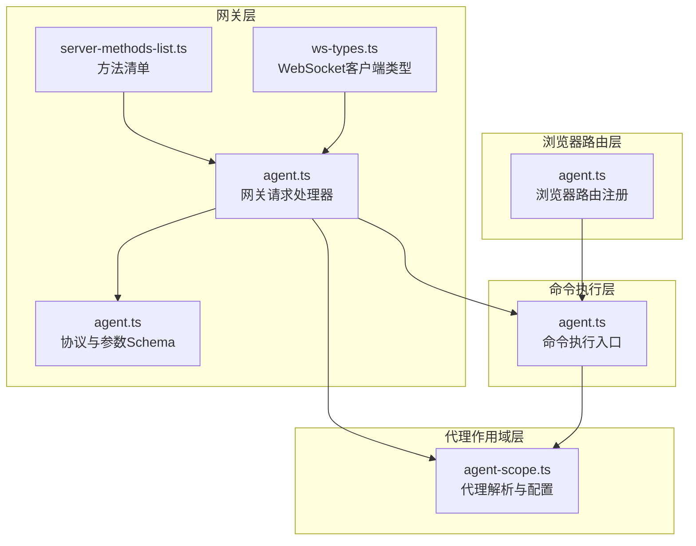
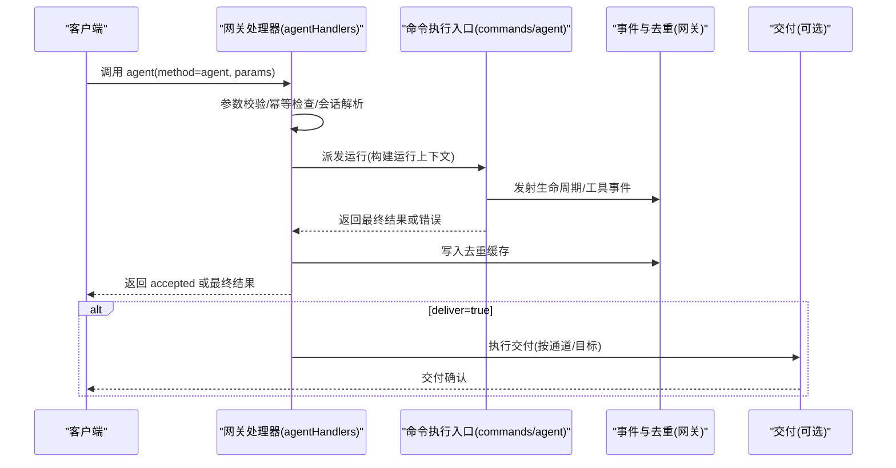
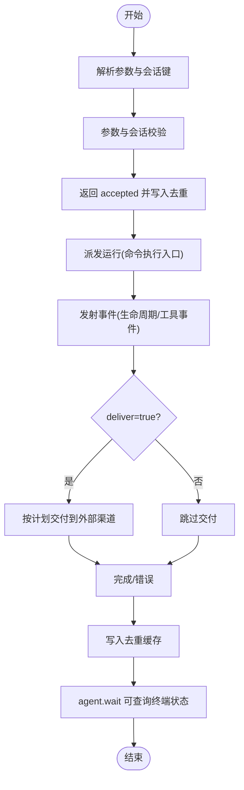
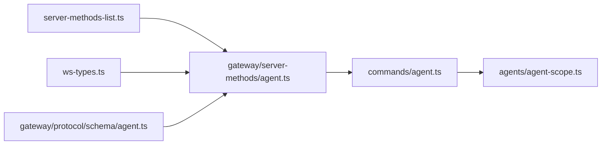

# Agent API

<cite>
**本文引用的文件**
- [agent.ts](file://src/gateway/server-methods/agent.ts)
- [agent.ts](file://src/gateway/protocol/schema/agent.ts)
- [agent-scope.ts](file://src/agents/agent-scope.ts)
- [agent.ts](file://src/commands/agent.ts)
- [agent.ts](file://src/browser/routes/agent.ts)
- [server-methods-list.ts](file://src/gateway/server-methods-list.ts)
- [ws-types.ts](file://src/gateway/server/ws-types.ts)
</cite>

## 目录

1. [简介](#简介)
2. [项目结构](#项目结构)
3. [核心组件](#核心组件)
4. [架构总览](#架构总览)
5. [详细组件分析](#详细组件分析)
6. [依赖关系分析](#依赖关系分析)
7. [性能考量](#性能考量)
8. [故障排查指南](#故障排查指南)
9. [结论](#结论)
10. [附录](#附录)

## 简介

本文件面向使用 OpenClaw 的开发者与集成方，系统化说明基于 WebSocket 的 AI 代理（Agent）API，覆盖以下主题：

- 代理相关 WebSocket 方法：agent、agent.identity.get、agent.wait
- 代理创建、配置管理与任务调度流程
- 方法调用格式、参数结构与返回值规范
- 代理生命周期管理、会话绑定与状态查询
- 权限控制、并发限制与性能监控机制
- 完整示例流程：创建代理、更新配置、提交任务、获取结果

## 项目结构

Agent API 的实现由“网关协议层”“命令执行层”“代理作用域解析层”“浏览器路由层”等组成，关键文件如下：

- 网关请求处理器：定义 agent、agent.identity.get、agent.wait 的处理逻辑
- 协议与参数校验：定义参数 Schema 与错误码
- 代理作用域解析：解析代理 ID、工作区、模型回退策略等
- 命令执行入口：封装会话解析、运行上下文、事件发射与交付
- 浏览器路由注册：在浏览器侧暴露调试与快照能力
- 方法清单与 WebSocket 类型：声明可用方法与客户端连接类型

**图表来源**

- [agent.ts:149-784](file://src/gateway/server-methods/agent.ts#L149-L784)
- [agent.ts:75-152](file://src/gateway/protocol/schema/agent.ts#L75-L152)
- [agent-scope.ts:118-339](file://src/agents/agent-scope.ts#L118-L339)
- [agent.ts:504-800](file://src/commands/agent.ts#L504-L800)
- [agent.ts:8-14](file://src/browser/routes/agent.ts#L8-L14)
- [server-methods-list.ts:97-104](file://src/gateway/server-methods-list.ts#L97-L104)
- [ws-types.ts:4-13](file://src/gateway/server/ws-types.ts#L4-L13)

**章节来源**

- [agent.ts:149-784](file://src/gateway/server-methods/agent.ts#L149-L784)
- [agent.ts:75-152](file://src/gateway/protocol/schema/agent.ts#L75-L152)
- [agent-scope.ts:118-339](file://src/agents/agent-scope.ts#L118-L339)
- [agent.ts:504-800](file://src/commands/agent.ts#L504-L800)
- [agent.ts:8-14](file://src/browser/routes/agent.ts#L8-L14)
- [server-methods-list.ts:97-104](file://src/gateway/server-methods-list.ts#L97-L104)
- [ws-types.ts:4-13](file://src/gateway/server/ws-types.ts#L4-L13)

## 核心组件

- 网关请求处理器（agentHandlers）
  - 提供 agent、agent.identity.get、agent.wait 三个方法
  - 负责参数校验、幂等去重、会话解析、投递计划、运行派发与结果回传
- 协议与参数 Schema
  - 定义 agent、agent.identity.get、agent.wait 的参数与返回结构
  - 统一错误码与校验错误格式
- 代理作用域解析（agent-scope）
  - 解析代理 ID、默认代理、工作区路径、模型主备策略等
  - 支持通过会话键推导代理 ID
- 命令执行入口（commands/agent）
  - 封装会话准备、运行上下文、事件发射、交付与持久化
  - 支持 CLI/嵌入式运行、AC/CP 集成与超时控制
- 浏览器路由（browser/routes/agent）
  - 注册调试、快照、存储与动作相关路由（便于本地开发与诊断）

**章节来源**

- [agent.ts:149-784](file://src/gateway/server-methods/agent.ts#L149-L784)
- [agent.ts:75-152](file://src/gateway/protocol/schema/agent.ts#L75-L152)
- [agent-scope.ts:118-339](file://src/agents/agent-scope.ts#L118-L339)
- [agent.ts:504-800](file://src/commands/agent.ts#L504-L800)
- [agent.ts:8-14](file://src/browser/routes/agent.ts#L8-L14)

## 架构总览

Agent API 的调用链路从 WebSocket 连接进入，经由网关处理器完成参数校验与会话解析，再交由命令执行入口进行实际运行，并通过事件流与去重机制向客户端反馈状态。

**图表来源**

- [agent.ts:149-784](file://src/gateway/server-methods/agent.ts#L149-L784)
- [agent.ts:678-800](file://src/commands/agent.ts#L678-L800)

**章节来源**

- [agent.ts:149-784](file://src/gateway/server-methods/agent.ts#L149-L784)
- [agent.ts:678-800](file://src/commands/agent.ts#L678-L800)

## 详细组件分析

### 方法：agent

- 功能：提交一条消息给指定代理，触发一次推理/执行回合；可选交付到外部渠道
- 请求参数（部分关键字段）
  - message: 必填，用户输入文本
  - agentId: 可选，显式指定代理 ID
  - sessionId/sessionKey: 可选，绑定会话上下文
  - to/replyTo: 可选，目标联系人/群组标识
  - channel/replyChannel: 可选，发送通道与回复通道
  - accountId/replyAccountId: 可选，账户标识
  - threadId: 可选，线程/话题标识
  - deliver: 可选，是否交付到外部渠道
  - attachments: 可选，附件数组（含类型、MIME、文件名、内容）
  - thinking: 可选，思考级别提示
  - timeout/bestEffortDeliver: 可选，超时与尽力而为交付
  - lane: 可选，运行通道（如子代理通道）
  - extraSystemPrompt: 可选，附加系统提示
  - internalEvents: 可选，内部事件数组（用于子代理/定时任务等）
  - inputProvenance: 可选，输入来源信息
  - idempotencyKey: 必填，幂等键
  - label/spawnedBy/workspaceDir: 可选，标签、父运行、工作区覆盖
- 返回值
  - accepted（接受）：包含 runId、status=accepted、acceptedAt
  - completed（完成）：包含 runId、status=ok、summary=completed、result
  - error（失败）：包含 runId、status=error、summary、error
  - 同步响应后，客户端可通过 agent.wait 查询终端状态
- 幂等性与去重
  - 使用 idempotencyKey 去重，重复请求返回缓存结果
- 会话绑定
  - 支持 sessionKey、sessionId、agentId 三者组合解析
  - 若传入 sessionKey，会校验其形状并确保与 agentId 匹配
- 交付策略
  - deliver=true 且目标通道非内部通道时，按投递计划执行交付
  - 未显式设置时，主会话默认尽力而为交付
- 超时与轮询
  - 可设置 timeout；完成后通过 agent.wait 获取最终结果

**章节来源**

- [agent.ts:149-784](file://src/gateway/server-methods/agent.ts#L149-L784)
- [agent.ts:75-117](file://src/gateway/protocol/schema/agent.ts#L75-L117)

### 方法：agent.identity.get

- 功能：查询当前会话或指定代理的身份信息（名称、头像、emoji 等）
- 请求参数
  - agentId: 可选，显式代理 ID
  - sessionKey: 可选，会话键（若提供则与 agentId 对比校验）
- 返回值
  - agentId、name、avatar、emoji

**章节来源**

- [agent.ts:641-694](file://src/gateway/server-methods/agent.ts#L641-L694)
- [agent.ts:119-135](file://src/gateway/protocol/schema/agent.ts#L119-L135)

### 方法：agent.wait

- 功能：阻塞等待指定 runId 的终端状态（完成或错误），支持超时
- 请求参数
  - runId: 必填，需等待的运行 ID
  - timeoutMs: 可选，超时时间（毫秒，默认 30 秒）
- 返回值
  - status: timeout/ok/error
  - startedAt/endedAt: 时间戳
  - error: 错误信息（如有）

**章节来源**

- [agent.ts:695-782](file://src/gateway/server-methods/agent.ts#L695-L782)
- [agent.ts:137-143](file://src/gateway/protocol/schema/agent.ts#L137-L143)

### 代理生命周期与会话绑定

- 生命周期阶段
  - 接受：accepted（写入去重缓存）
  - 运行：事件流（生命周期、工具事件等）
  - 终止：completed 或 error（写入去重缓存）
- 会话绑定
  - 支持 sessionKey、sessionId、agentId 三者组合解析
  - 主会话（main session）默认开启尽力而为交付
  - 通过会话存储合并与修剪，保持上下文一致性
- 工作区与模型
  - 通过代理作用域解析工作区路径与模型主备策略
  - 支持通过 workspaceDir 覆盖子代理运行的工作区

**图表来源**

- [agent.ts:149-784](file://src/gateway/server-methods/agent.ts#L149-L784)
- [agent.ts:678-800](file://src/commands/agent.ts#L678-L800)

**章节来源**

- [agent.ts:149-784](file://src/gateway/server-methods/agent.ts#L149-L784)
- [agent.ts:678-800](file://src/commands/agent.ts#L678-L800)

### 权限控制与并发限制

- 权限控制
  - 通过客户端连接中的 scopes 判断是否具备管理员权限
  - 管理员可能享有更宽松的运行策略或更高优先级
- 并发限制
  - 通过 runId 与去重缓存避免重复运行
  - agent.wait 在同一 runId 上仅保留一个等待协程
- 交付并发
  - 多个 runId 并行运行，但同一会话内的工具事件仅对同会话订阅者可见

**章节来源**

- [agent.ts:70-73](file://src/gateway/server-methods/agent.ts#L70-L73)
- [agent.ts:731-782](file://src/gateway/server-methods/agent.ts#L731-L782)

### 性能监控机制

- 事件流
  - 生命周期事件与工具事件通过事件发射器广播，便于前端实时展示
- 去重与幂等
  - 基于 idempotencyKey 的去重缓存减少重复计算
- 超时与尽力而为
  - 支持超时控制与尽力而为交付策略，平衡吞吐与可靠性
- 日志与诊断
  - 网关侧日志与格式化错误输出，便于问题定位

**章节来源**

- [agent.ts:149-784](file://src/gateway/server-methods/agent.ts#L149-L784)
- [agent.ts:678-800](file://src/commands/agent.ts#L678-L800)

## 依赖关系分析

- 方法注册
  - agent、agent.identity.get、agent.wait 在方法清单中注册
- WebSocket 客户端类型
  - 定义了客户端连接参数与能力位，影响工具事件订阅行为
- 协议与参数校验
  - 使用 TypeBox Schema 定义参数结构，统一错误格式

**图表来源**

- [server-methods-list.ts:97-104](file://src/gateway/server-methods-list.ts#L97-L104)
- [ws-types.ts:4-13](file://src/gateway/server/ws-types.ts#L4-L13)
- [agent.ts:75-152](file://src/gateway/protocol/schema/agent.ts#L75-L152)
- [agent.ts:149-784](file://src/gateway/server-methods/agent.ts#L149-L784)
- [agent.ts:504-800](file://src/commands/agent.ts#L504-L800)
- [agent-scope.ts:118-339](file://src/agents/agent-scope.ts#L118-L339)

**章节来源**

- [server-methods-list.ts:97-104](file://src/gateway/server-methods-list.ts#L97-L104)
- [ws-types.ts:4-13](file://src/gateway/server/ws-types.ts#L4-L13)
- [agent.ts:75-152](file://src/gateway/protocol/schema/agent.ts#L75-L152)
- [agent.ts:149-784](file://src/gateway/server-methods/agent.ts#L149-L784)
- [agent.ts:504-800](file://src/commands/agent.ts#L504-L800)
- [agent-scope.ts:118-339](file://src/agents/agent-scope.ts#L118-L339)

## 性能考量

- 幂等与去重：通过 idempotencyKey 缓存已处理请求，避免重复运行
- 事件流：前端可订阅生命周期与工具事件，降低轮询开销
- 超时与尽力而为：合理设置 timeout 与 bestEffortDeliver，提升吞吐与稳定性
- 会话合并：在会话存储中合并与修剪键值，减少冗余数据

## 故障排查指南

- 常见错误
  - 参数无效：INVALID_REQUEST，检查参数 Schema 与必填项
  - 未知代理 ID：校验已配置代理列表
  - 会话键不匹配：确保 sessionKey 与 agentId 一致
  - 发送被策略阻止：检查会话发送策略
- 排查步骤
  - 使用 agent.wait 获取 runId 的最终状态
  - 检查去重缓存是否命中（返回 cached=true）
  - 查看网关日志与格式化错误输出
  - 确认交付通道与目标是否正确

**章节来源**

- [agent.ts:152-162](file://src/gateway/server-methods/agent.ts#L152-L162)
- [agent.ts:261-274](file://src/gateway/server-methods/agent.ts#L261-L274)
- [agent.ts:419-426](file://src/gateway/server-methods/agent.ts#L419-L426)
- [agent.ts:708-713](file://src/gateway/server-methods/agent.ts#L708-L713)

## 结论

OpenClaw 的 Agent API 以 WebSocket 为基础，提供统一的代理调用、身份查询与状态等待能力。通过严格的参数校验、会话绑定、幂等去重与事件流机制，既保证了易用性，也兼顾了可观测性与可扩展性。结合权限控制与并发限制策略，可在多场景下稳定地调度代理任务。

## 附录

### 方法与参数速查

- agent
  - 请求参数要点：message、agentId、sessionId/sessionKey、to/replyTo、channel/replyChannel、accountId/replyAccountId、threadId、deliver、attachments、thinking、timeout、bestEffortDeliver、lane、extraSystemPrompt、internalEvents、inputProvenance、idempotencyKey、label、spawnedBy、workspaceDir
  - 返回值：accepted/completed/error
- agent.identity.get
  - 请求参数：agentId、sessionKey
  - 返回值：agentId、name、avatar、emoji
- agent.wait
  - 请求参数：runId、timeoutMs
  - 返回值：status、startedAt、endedAt、error

**章节来源**

- [agent.ts:149-784](file://src/gateway/server-methods/agent.ts#L149-L784)
- [agent.ts:75-152](file://src/gateway/protocol/schema/agent.ts#L75-L152)

### 示例流程（文字版）

- 创建代理
  - 通过配置文件定义代理列表与默认代理
  - 使用 agentId 或 sessionKey 绑定代理
- 更新配置
  - 通过会话键携带的上下文，动态调整模型、技能、工作区等
- 提交任务
  - 调用 agent，传入 message、idempotencyKey、可选 deliver 与附件
  - 立即收到 accepted，随后通过 agent.wait 获取最终结果
- 获取结果
  - 使用 agent.wait 查询 runId 的状态与时间戳
  - 如 deliver=true，可在外部渠道确认交付

**章节来源**

- [agent.ts:149-784](file://src/gateway/server-methods/agent.ts#L149-L784)
- [agent.ts:75-152](file://src/gateway/protocol/schema/agent.ts#L75-L152)
- [agent-scope.ts:118-339](file://src/agents/agent-scope.ts#L118-L339)
