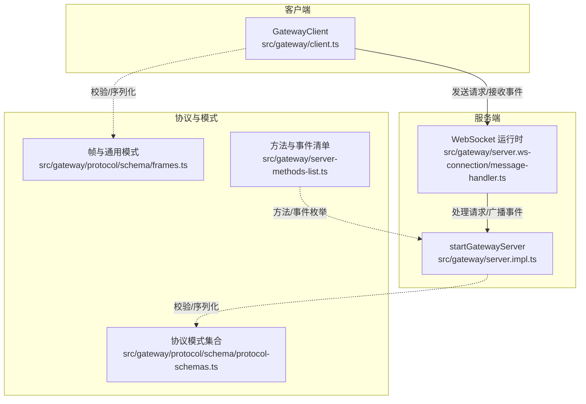
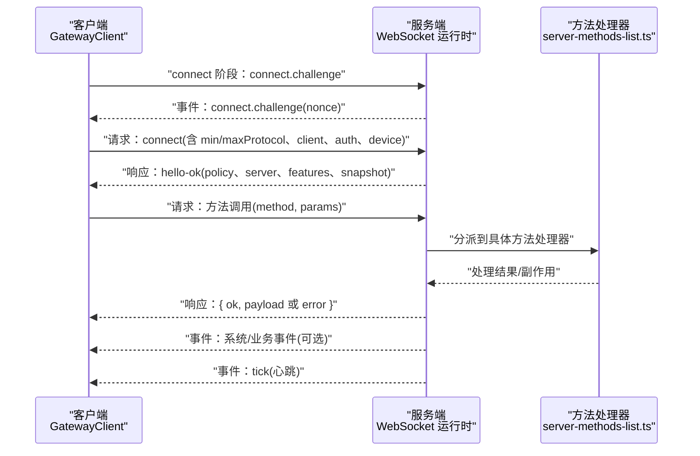
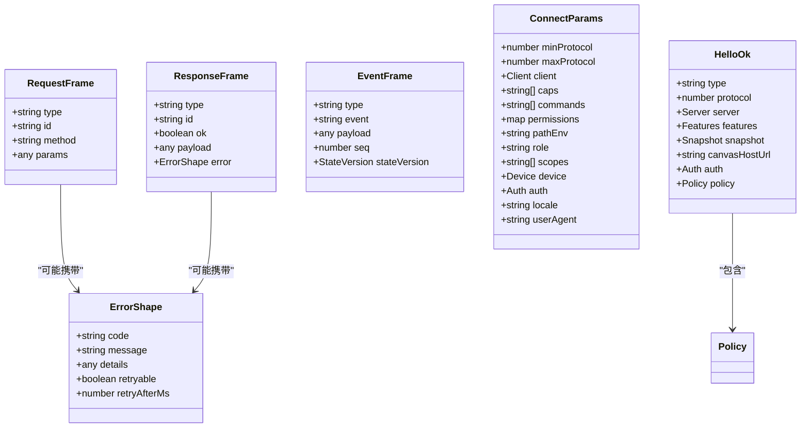
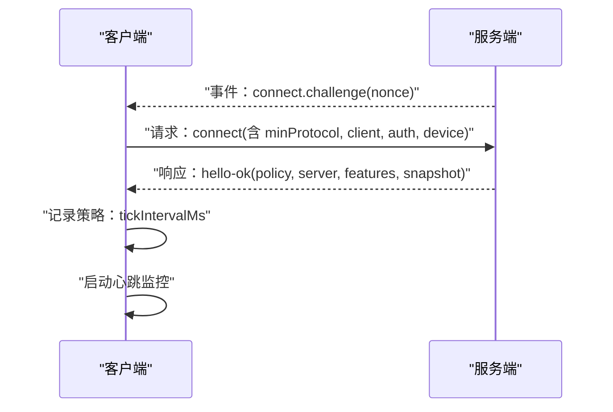
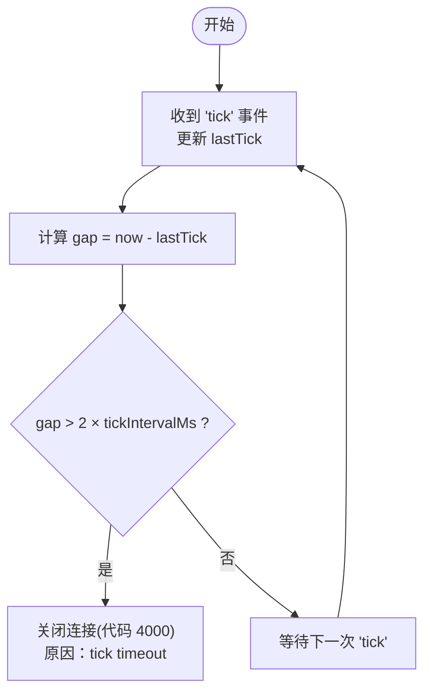
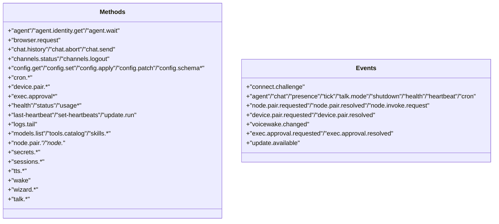
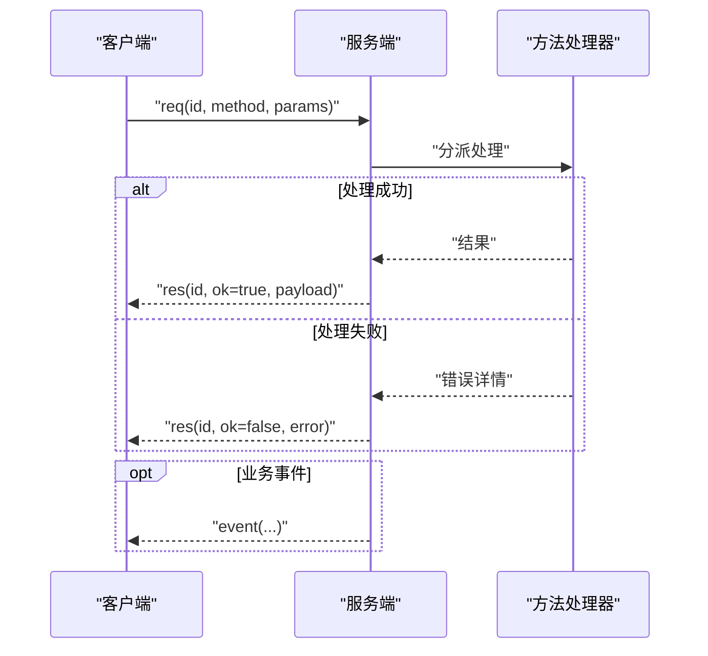
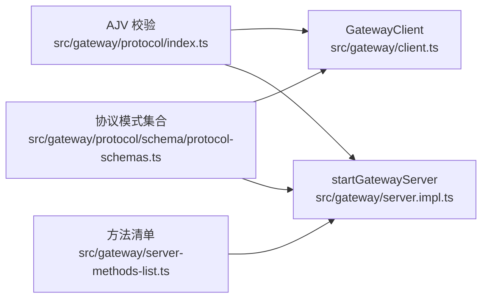

# WebSocket API

<cite>
**本文引用的文件**
- [src/gateway/protocol/schema/frames.ts](file://src/gateway/protocol/schema/frames.ts)
- [src/gateway/protocol/schema/protocol-schemas.ts](file://src/gateway/protocol/schema/protocol-schemas.ts)
- [src/gateway/server-methods-list.ts](file://src/gateway/server-methods-list.ts)
- [src/gateway/client.ts](file://src/gateway/client.ts)
- [src/gateway/server.impl.ts](file://src/gateway/server.impl.ts)
- [src/gateway/server.ts](file://src/gateway/server.ts)
- [src/gateway/server.ws-connection/message-handler.ts](file://src/gateway/server.ws-connection/message-handler.ts)
- [apps/macos/Tests/OpenClawIPCTests/GatewayWebSocketTestSupport.swift](file://apps/macos/Tests/OpenClawIPCTests/GatewayWebSocketTestSupport.swift)
- [src/gateway/client.watchdog.test.ts](file://src/gateway/client.watchdog.test.ts)
- [src/gateway/server-node-events-types.ts](file://src/gateway/server-node-events-types.ts)
- [src/gateway/server.ws-types.ts](file://src/gateway/server.ws-types.ts)
</cite>

## 目录

1. [简介](#简介)
2. [项目结构](#项目结构)
3. [核心组件](#核心组件)
4. [架构总览](#架构总览)
5. [详细组件分析](#详细组件分析)
6. [依赖关系分析](#依赖关系分析)
7. [性能考量](#性能考量)
8. [故障排查指南](#故障排查指南)
9. [结论](#结论)
10. [附录](#附录)

## 简介

本文件系统性地文档化 OpenClaw 的 WebSocket API，覆盖连接建立流程、消息帧格式、事件类型、方法调用清单（agent、chat、channels、nodes 等）、参数与返回值规范、错误处理机制，并提供连接认证、会话管理、消息收发、心跳与连接状态管理等常见场景的完整示例与最佳实践。

## 项目结构

OpenClaw 的 WebSocket 协议由“客户端库 + 服务端实现”两部分组成，协议模式通过 TypeBox 定义并使用 Ajv 校验，确保强类型与运行时安全。

图表来源

- [src/gateway/client.ts:1-674](file://src/gateway/client.ts#L1-L674)
- [src/gateway/server.impl.ts:1-200](file://src/gateway/server.impl.ts#L1-L200)
- [src/gateway/server.ws-connection/message-handler.ts:363-390](file://src/gateway/server.ws-connection/message-handler.ts#L363-L390)
- [src/gateway/protocol/schema/frames.ts:125-164](file://src/gateway/protocol/schema/frames.ts#L125-L164)
- [src/gateway/protocol/schema/protocol-schemas.ts:162-302](file://src/gateway/protocol/schema/protocol-schemas.ts#L162-L302)
- [src/gateway/server-methods-list.ts:1-133](file://src/gateway/server-methods-list.ts#L1-L133)

章节来源

- [src/gateway/client.ts:1-674](file://src/gateway/client.ts#L1-L674)
- [src/gateway/server.impl.ts:1-200](file://src/gateway/server.impl.ts#L1-L200)
- [src/gateway/server.ts:1-4](file://src/gateway/server.ts#L1-L4)

## 核心组件

- 协议帧与模式
  - 请求帧、响应帧、事件帧三类帧结构，统一通过 Discriminated Union 聚合，便于下游工具生成强类型。
  - 通用模式包含 HelloOk、ConnectParams、ErrorShape、TickEvent、ShutdownEvent 等。
- 方法与事件清单
  - 列出所有可用方法（如 agent、chat、nodes、cron、system 等）与事件（如 connect.challenge、agent、chat、presence、tick 等）。
- 客户端
  - GatewayClient 提供连接、握手挑战、鉴权、请求/响应、事件监听、心跳监控、重连策略、TLS 指纹校验等功能。
- 服务端
  - startGatewayServer 启动服务，注册方法处理器与事件广播；消息入口在 WebSocket 运行时中解析并分派。

章节来源

- [src/gateway/protocol/schema/frames.ts:125-164](file://src/gateway/protocol/schema/frames.ts#L125-L164)
- [src/gateway/protocol/schema/protocol-schemas.ts:162-302](file://src/gateway/protocol/schema/protocol-schemas.ts#L162-L302)
- [src/gateway/server-methods-list.ts:1-133](file://src/gateway/server-methods-list.ts#L1-L133)
- [src/gateway/client.ts:109-674](file://src/gateway/client.ts#L109-L674)
- [src/gateway/server.impl.ts:80-102](file://src/gateway/server.impl.ts#L80-L102)

## 架构总览

OpenClaw 的 WebSocket API 采用“请求-响应-事件”的三向通信模型：客户端发起方法请求，服务端返回响应；服务端可向客户端推送事件；同时通过“tick”事件维持心跳与健康状态。

图表来源

- [src/gateway/client.ts:497-554](file://src/gateway/client.ts#L497-L554)
- [src/gateway/server.ws-connection/message-handler.ts:363-390](file://src/gateway/server.ws-connection/message-handler.ts#L363-L390)
- [src/gateway/server-methods-list.ts:107-132](file://src/gateway/server-methods-list.ts#L107-L132)

## 详细组件分析

### 协议帧与消息格式

- 帧类型
  - req：请求帧，包含 type、id、method、params。
  - res：响应帧，包含 type、id、ok、payload 或 error。
  - event：事件帧，包含 type、event、payload、seq、stateVersion。
- 通用模式
  - ConnectParams：握手参数，包含协议版本范围、客户端信息、权限、设备签名、认证信息等。
  - HelloOk：握手成功返回，包含协议版本、服务器标识、特性列表、快照、策略（最大负载、缓冲字节、心跳间隔）。
  - ErrorShape：错误结构，包含 code、message、details、retryable、retryAfterMs。
  - TickEvent：心跳事件，包含时间戳。
  - ShutdownEvent：关闭事件，包含原因与重启预期时间。
- 协议版本
  - PROTOCOL_VERSION 当前为 3。

图表来源

- [src/gateway/protocol/schema/frames.ts:125-164](file://src/gateway/protocol/schema/frames.ts#L125-L164)
- [src/gateway/protocol/schema/protocol-schemas.ts:162-302](file://src/gateway/protocol/schema/protocol-schemas.ts#L162-L302)

章节来源

- [src/gateway/protocol/schema/frames.ts:125-164](file://src/gateway/protocol/schema/frames.ts#L125-L164)
- [src/gateway/protocol/schema/protocol-schemas.ts:162-302](file://src/gateway/protocol/schema/protocol-schemas.ts#L162-L302)

### 连接建立与握手

- 安全约束
  - 非本地主机的 ws:// 将被拒绝，避免明文传输暴露凭据与会话内容；wss:// 可结合 TLS 指纹校验进一步加固。
- 握手流程
  - 服务端先发送 connect.challenge 事件，携带 nonce。
  - 客户端收到后准备 connect 参数（含 min/maxProtocol、client、caps、permissions、auth、device 等），并签名设备信息（如适用）。
  - 服务端验证后返回 hello-ok，包含策略（tickIntervalMs）与快照。
- 认证方式
  - 支持共享令牌、密码、设备令牌与设备签名等多种组合，优先级与回退逻辑由客户端内部处理。

图表来源

- [src/gateway/client.ts:267-415](file://src/gateway/client.ts#L267-L415)
- [src/gateway/client.ts:497-525](file://src/gateway/client.ts#L497-L525)

章节来源

- [src/gateway/client.ts:134-197](file://src/gateway/client.ts#L134-L197)
- [src/gateway/client.ts:267-415](file://src/gateway/client.ts#L267-L415)
- [src/gateway/client.ts:497-525](file://src/gateway/client.ts#L497-L525)

### 心跳机制与连接状态管理

- 心跳事件
  - 服务端周期性发送 tick 事件，客户端记录 lastTick 并启动心跳监视器。
- 心跳超时
  - 若超过 2×tickIntervalMs 未收到心跳，客户端主动关闭连接（代码 4000，原因包含“tick timeout”）。
- 关闭码语义
  - 1000 正常关闭；1006 异常关闭（无关闭帧）；1008 策略违规；1012 服务重启。
- 重连策略
  - 客户端维护指数退避（上限 30 秒），在异常关闭后自动重连。

图表来源

- [src/gateway/client.ts:596-618](file://src/gateway/client.ts#L596-L618)
- [src/gateway/client.watchdog.test.ts:39-86](file://src/gateway/client.watchdog.test.ts#L39-L86)

章节来源

- [src/gateway/client.ts:596-618](file://src/gateway/client.ts#L596-L618)
- [src/gateway/client.watchdog.test.ts:39-86](file://src/gateway/client.watchdog.test.ts#L39-L86)

### 方法调用与事件类型

- 方法清单（节选）
  - 系统与配置：health、status、usage、config._、logs.tail、models.list、tools.catalog、skills._、cron._、tts._、wake、last-heartbeat、set-heartbeats、update.run、wizard._、talk._、channels._、secrets._、sessions._、exec.approvals._
  - 设备与节点：device.pair._、node.pair._、node.\*（rename/list/describe/invoke/pending 等）、node.event、node.canvas.capability.refresh
  - 代理与聊天：agent、agent.identity.get、agent.wait、browser.request、chat.history、chat.abort、chat.send
- 事件清单（节选）
  - connect.challenge、agent、chat、presence、tick、talk.mode、shutdown、health、heartbeat、cron、node.pair.requested/resolved、node.invoke.request、device.pair.requested/resolved、voicewake.changed、exec.approval.requested/resolved、update.available

图表来源

- [src/gateway/server-methods-list.ts:4-132](file://src/gateway/server-methods-list.ts#L4-L132)

章节来源

- [src/gateway/server-methods-list.ts:4-132](file://src/gateway/server-methods-list.ts#L4-L132)

### 请求/响应与错误处理

- 请求
  - 客户端为每个请求生成唯一 id，发送 req 帧；服务端在消息入口解析并记录帧元数据，随后分派到对应方法处理器。
- 响应
  - 成功：ok=true，payload 为方法结果；失败：ok=false，error 包含 code/message/details。
- 错误细节
  - 错误结构支持 details 与 retryable/retryAfterMs，便于客户端进行重试或提示。
- 事件
  - 事件帧包含 seq（序号）与 stateVersion（状态版本），客户端可据此检测丢包与状态一致性。

图表来源

- [src/gateway/server.ws-connection/message-handler.ts:363-390](file://src/gateway/server.ws-connection/message-handler.ts#L363-L390)
- [src/gateway/client.ts:527-554](file://src/gateway/client.ts#L527-L554)
- [src/gateway/protocol/schema/frames.ts:114-144](file://src/gateway/protocol/schema/frames.ts#L114-L144)

章节来源

- [src/gateway/server.ws-connection/message-handler.ts:363-390](file://src/gateway/server.ws-connection/message-handler.ts#L363-L390)
- [src/gateway/client.ts:527-554](file://src/gateway/client.ts#L527-L554)
- [src/gateway/protocol/schema/frames.ts:114-144](file://src/gateway/protocol/schema/frames.ts#L114-L144)

### 会话管理与节点事件上下文

- 会话键
  - 服务端通过会话键将事件定向到特定会话，支持订阅/取消订阅与一次性事件推送。
- 节点事件上下文
  - 提供广播、会话事件推送、订阅管理、语音唤醒变更通知、聊天运行时管理等能力。

章节来源

- [src/gateway/server-node-events-types.ts:8-36](file://src/gateway/server-node-events-types.ts#L8-L36)

### 服务端类型与客户端类型

- 服务端 WebSocket 客户端类型
  - 包含 socket、connect、connId、presenceKey、clientIp、canvasHostUrl、canvasCapability、canvasCapabilityExpiresAtMs 等字段。
- 服务端启动与导出
  - 通过 startGatewayServer 导出服务实例与选项类型，便于集成与测试。

章节来源

- [src/gateway/server.ws-types.ts:4-13](file://src/gateway/server.ws-types.ts#L4-L13)
- [src/gateway/server.ts:1-4](file://src/gateway/server.ts#L1-L4)

## 依赖关系分析

- 客户端依赖
  - 协议模式：AJV 编译后的校验函数用于请求/响应/事件帧与各参数模式。
  - 网络与安全：ws 库、TLS 指纹校验、URL 安全检查。
  - 设备身份：设备公私钥、签名、设备令牌持久化与加载。
- 服务端依赖
  - 方法处理器注册：基于方法清单动态注册 handlers。
  - 事件广播：对 agent、chat、presence、cron、node/device pair、exec approval、voicewake 等事件进行广播。
  - 运行时状态：健康快照、存在版本、模型目录缓存、插件与子代理运行时。

图表来源

- [src/gateway/protocol/index.ts:253-458](file://src/gateway/protocol/index.ts#L253-L458)
- [src/gateway/client.ts:1-674](file://src/gateway/client.ts#L1-L674)
- [src/gateway/server.impl.ts:80-102](file://src/gateway/server.impl.ts#L80-L102)
- [src/gateway/server-methods-list.ts:107-110](file://src/gateway/server-methods-list.ts#L107-L110)
- [src/gateway/protocol/schema/protocol-schemas.ts:162-302](file://src/gateway/protocol/schema/protocol-schemas.ts#L162-L302)

章节来源

- [src/gateway/protocol/index.ts:253-458](file://src/gateway/protocol/index.ts#L253-L458)
- [src/gateway/server.impl.ts:80-102](file://src/gateway/server.impl.ts#L80-L102)

## 性能考量

- 最大负载与缓冲
  - 客户端默认允许较大的消息体（例如 25MB），适合屏幕快照等场景。
- 心跳间隔
  - 服务端通过 hello-ok 的 policy.tickIntervalMs 下发心跳周期，客户端据此调整心跳监视器。
- 事件序号与丢包检测
  - 客户端根据事件帧中的 seq 字段检测乱序与丢包，并触发 onGap 回调。

章节来源

- [src/gateway/client.ts:169-173](file://src/gateway/client.ts#L169-L173)
- [src/gateway/client.ts:384-389](file://src/gateway/client.ts#L384-L389)
- [src/gateway/client.ts:514-520](file://src/gateway/client.ts#L514-L520)

## 故障排查指南

- 连接被拒绝（ws:// 非本地）
  - 现象：启动即报错，提示不能使用明文 ws:// 连接远程地址。
  - 处理：改用 wss://，或通过 SSH 隧道/受信任网络；必要时设置环境变量启用私有网络豁免。
- 缺少 nonce 或挑战超时
  - 现象：收到 connect.challenge 但未提供有效 nonce，或超过挑战时限。
  - 处理：确保服务端正确下发 nonce，客户端在限定时间内完成 connect。
- TLS 指纹不匹配
  - 现象：wss:// 连接但指纹校验失败。
  - 处理：确认期望指纹与服务端证书一致，或移除指纹强制校验。
- 心跳超时导致断开
  - 现象：长时间无心跳，连接被关闭（代码 4000）。
  - 处理：检查网络稳定性、防火墙、代理设置；适当增大 tickIntervalMs 或优化服务端负载。
- 设备令牌不匹配
  - 现象：设备令牌错误，服务端返回策略违规。
  - 处理：清理过期设备令牌，重新配对或使用共享令牌。

章节来源

- [src/gateway/client.ts:134-197](file://src/gateway/client.ts#L134-L197)
- [src/gateway/client.ts:497-525](file://src/gateway/client.ts#L497-L525)
- [src/gateway/client.ts:614-617](file://src/gateway/client.ts#L614-L617)
- [src/gateway/client.watchdog.test.ts:39-86](file://src/gateway/client.watchdog.test.ts#L39-L86)

## 结论

OpenClaw 的 WebSocket API 以强类型协议与严格的校验为基础，提供了稳定可靠的连接、方法调用与事件推送能力。通过心跳监控、序号跟踪与错误细节，客户端能够稳健地处理网络波动与服务端异常。建议在生产环境中优先使用 wss:// 并配合 TLS 指纹校验，合理配置心跳与负载参数，以获得最佳的安全性与性能表现。

## 附录

### 常见场景示例（路径引用）

- 连接认证与握手
  - [握手挑战与连接发送:267-415](file://src/gateway/client.ts#L267-L415)
  - [心跳监视与超时关闭:596-618](file://src/gateway/client.ts#L596-L618)
- 会话管理
  - [节点事件上下文与会话事件推送:8-36](file://src/gateway/server-node-events-types.ts#L8-L36)
- 消息发送与接收
  - [请求帧构造与发送:647-672](file://src/gateway/client.ts#L647-L672)
  - [响应帧解析与错误封装:527-554](file://src/gateway/client.ts#L527-L554)
- 事件类型与方法清单
  - [事件清单:112-132](file://src/gateway/server-methods-list.ts#L112-L132)
  - [方法清单:4-105](file://src/gateway/server-methods-list.ts#L4-L105)
- 测试与示例数据
  - [连接成功响应示例数据:31-53](file://apps/macos/Tests/OpenClawIPCTests/GatewayWebSocketTestSupport.swift#L31-L53)
