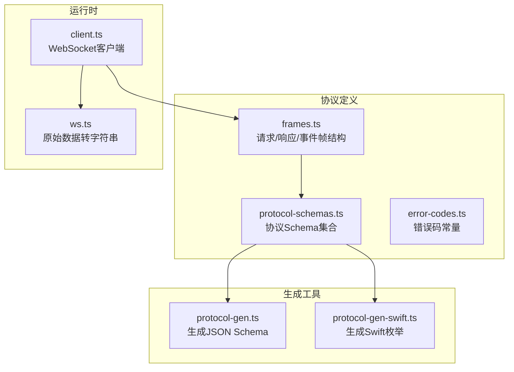
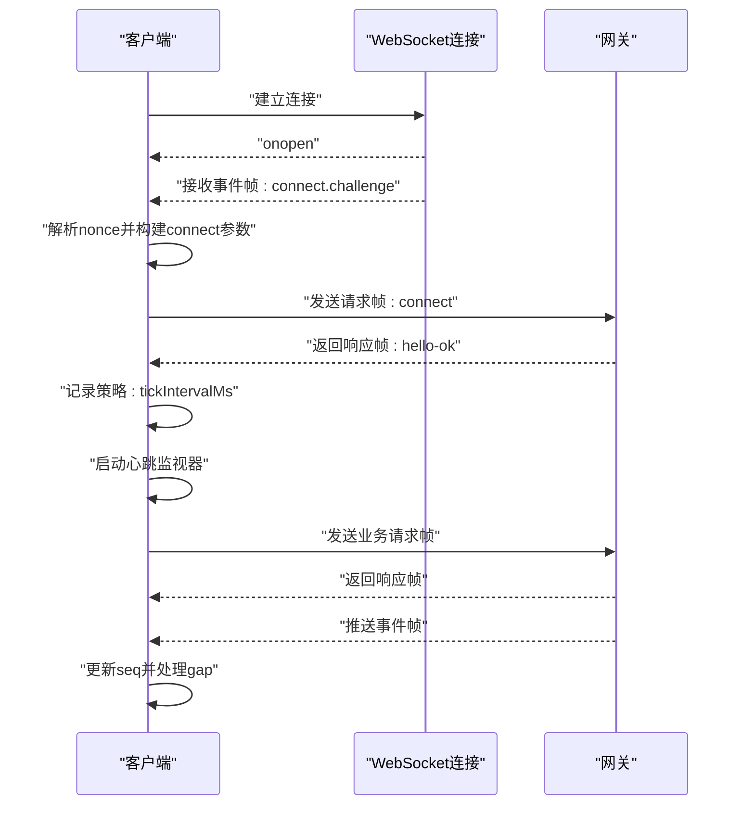
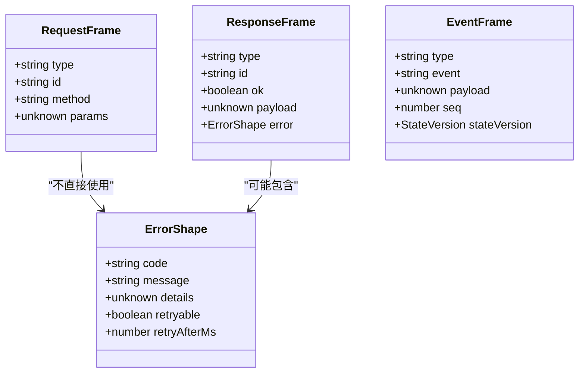
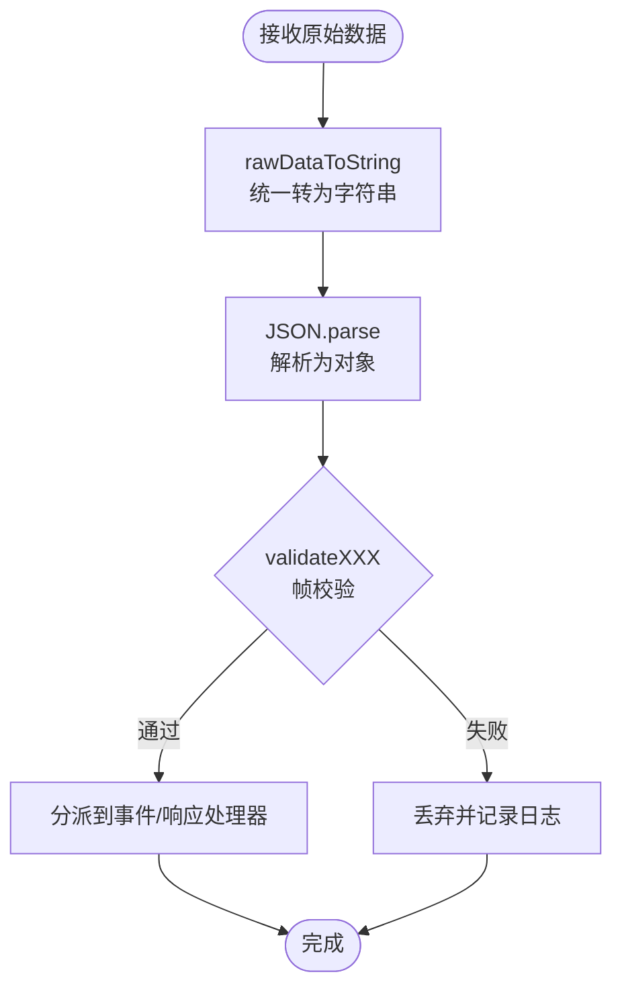
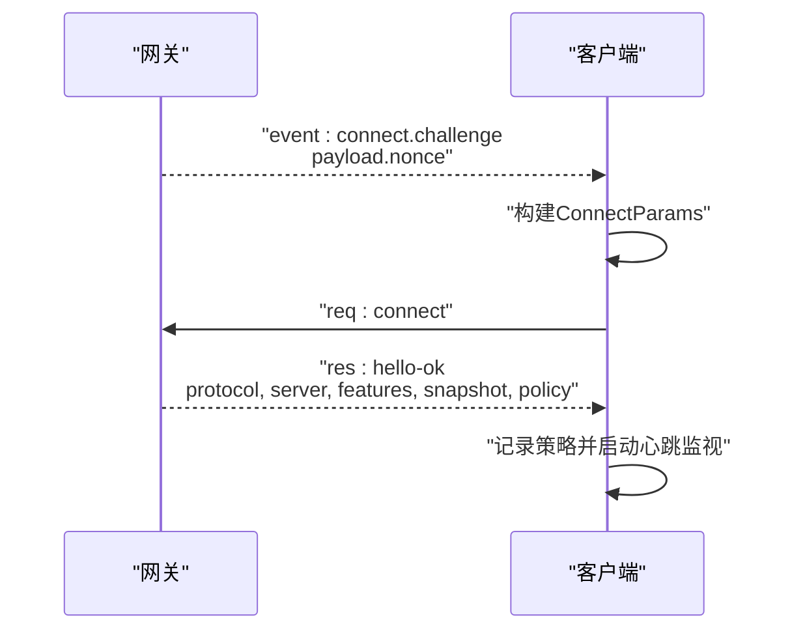
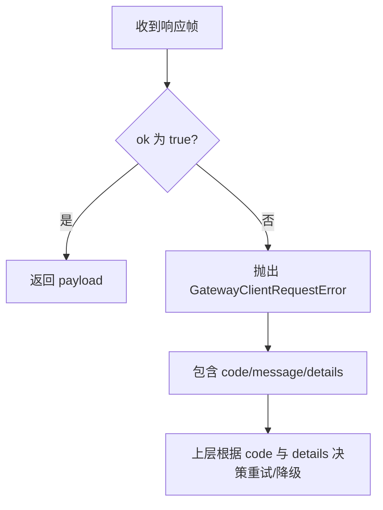
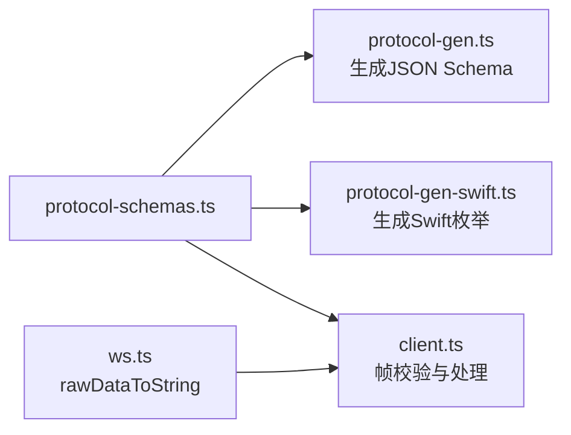

# 消息格式规范

<cite>
**本文引用的文件**
- [protocol-schemas.ts](file://src/gateway/protocol/schema/protocol-schemas.ts)
- [frames.ts](file://src/gateway/protocol/schema/frames.ts)
- [protocol-gen.ts](file://scripts/protocol-gen.ts)
- [client.ts](file://src/gateway/client.ts)
- [ws.ts](file://src/infra/ws.ts)
- [error-codes.ts](file://src/gateway/protocol/schema/error-codes.ts)
- [GatewayWebSocketTestSupport.swift](file://apps/macos/Tests/OpenClawIPCTests/GatewayWebSocketTestSupport.swift)
- [protocol-gen-swift.ts](file://scripts/protocol-gen-swift.ts)
</cite>

## 目录

1. [简介](#简介)
2. [项目结构](#项目结构)
3. [核心组件](#核心组件)
4. [架构总览](#架构总览)
5. [详细组件分析](#详细组件分析)
6. [依赖关系分析](#依赖关系分析)
7. [性能考量](#性能考量)
8. [故障排查指南](#故障排查指南)
9. [结论](#结论)
10. [附录](#附录)

## 简介

本文件系统性地定义了 OpenClaw 的 WebSocket 消息协议规范，覆盖消息帧类型（握手、请求/响应、事件）、数据结构与编码标准、序列化与校验机制、错误码与状态码说明，以及消息在客户端与网关之间的传输流程。文档同时给出请求/响应消息格式示例与字段说明，并讨论消息压缩、加密与传输优化策略。

## 项目结构

OpenClaw 的协议定义采用“TypeBox Schema + JSON Schema + 代码生成”的方式组织：

- 协议 Schema 定义集中于协议目录，包含帧结构、参数结构、错误结构等
- 通过脚本生成 JSON Schema 与 Swift 枚举，确保跨语言一致性
- 客户端实现负责消息编解码、校验、重连与心跳监控

**图表来源**

- [protocol-schemas.ts:162-302](file://src/gateway/protocol/schema/protocol-schemas.ts#L162-L302)
- [frames.ts:125-164](file://src/gateway/protocol/schema/frames.ts#L125-L164)
- [protocol-gen.ts:9-42](file://scripts/protocol-gen.ts#L9-L42)
- [protocol-gen-swift.ts:213-242](file://scripts/protocol-gen-swift.ts#L213-L242)
- [client.ts:109-674](file://src/gateway/client.ts#L109-L674)
- [ws.ts:1-21](file://src/infra/ws.ts#L1-L21)

**章节来源**

- [protocol-schemas.ts:162-302](file://src/gateway/protocol/schema/protocol-schemas.ts#L162-L302)
- [protocol-gen.ts:9-42](file://scripts/protocol-gen.ts#L9-L42)
- [client.ts:109-674](file://src/gateway/client.ts#L109-L674)

## 核心组件

- 帧类型与结构
  - 请求帧：携带 type="req"、id、method、params
  - 响应帧：携带 type="res"、id、ok、payload 或 error
  - 事件帧：携带 type="event"、event、payload、可选 seq 与 stateVersion
- 协议版本与握手
  - 协议版本号由协议定义导出
  - 握手阶段通过事件帧发送 connect.challenge，随后客户端发送 connect 请求
- 错误模型
  - 统一的错误形状包含 code、message、details、retryable、retryAfterMs
  - 提供错误码常量集合与构造函数

**章节来源**

- [frames.ts:125-164](file://src/gateway/protocol/schema/frames.ts#L125-L164)
- [protocol-schemas.ts:301](file://src/gateway/protocol/schema/protocol-schemas.ts#L301)
- [error-codes.ts:1-23](file://src/gateway/protocol/schema/error-codes.ts#L1-L23)

## 架构总览

下图展示了客户端与网关之间的消息交互路径：握手挑战、连接建立、请求/响应往返、事件推送与心跳检测。

**图表来源**

- [client.ts:199-251](file://src/gateway/client.ts#L199-L251)
- [client.ts:497-554](file://src/gateway/client.ts#L497-L554)
- [client.ts:647-672](file://src/gateway/client.ts#L647-L672)
- [frames.ts:125-164](file://src/gateway/protocol/schema/frames.ts#L125-L164)

## 详细组件分析

### 帧结构与数据模型

- 请求帧（req）
  - 字段：type、id、method、params（可选）
  - 用途：发起方法调用
- 响应帧（res）
  - 字段：type、id、ok、payload（可选）、error（可选）
  - 语义：ok=true 表示成功，否则 error 包含错误信息
- 事件帧（event）
  - 字段：type、event、payload（可选）、seq（可选）、stateVersion（可选）
  - 用途：推送状态变更、心跳、断线提示等

**图表来源**

- [frames.ts:125-164](file://src/gateway/protocol/schema/frames.ts#L125-L164)
- [frames.ts:114-123](file://src/gateway/protocol/schema/frames.ts#L114-L123)

**章节来源**

- [frames.ts:125-164](file://src/gateway/protocol/schema/frames.ts#L125-L164)
- [frames.ts:114-123](file://src/gateway/protocol/schema/frames.ts#L114-L123)

### 序列化、反序列化与验证

- 编解码
  - 客户端统一将对象序列化为 JSON 字符串后发送，收到字符串后解析为对象
  - 原始二进制数据通过工具函数转换为字符串，确保兼容不同底层数据类型
- 校验
  - 使用 TypeBox Schema 对帧进行强类型校验，保证字段完整性与类型正确性
  - 客户端在处理消息前先进行帧校验，再分派到事件或响应处理逻辑

**图表来源**

- [ws.ts:4-21](file://src/infra/ws.ts#L4-L21)
- [client.ts:497-554](file://src/gateway/client.ts#L497-L554)

**章节来源**

- [ws.ts:4-21](file://src/infra/ws.ts#L4-L21)
- [client.ts:497-554](file://src/gateway/client.ts#L497-L554)

### 握手与连接流程

- 握手步骤
  - 网关推送事件帧：connect.challenge，包含 nonce
  - 客户端解析 nonce 并构造 connect 请求帧，包含客户端能力、权限、认证信息等
  - 网关返回 hello-ok，包含协议版本、服务器信息、特性列表、快照、策略等
- 连接策略
  - 客户端根据 hello-ok 中的策略设置心跳间隔
  - 启动心跳监视器，若超过阈值未收到心跳则主动关闭连接

**图表来源**

- [client.ts:502-525](file://src/gateway/client.ts#L502-L525)
- [client.ts:369-391](file://src/gateway/client.ts#L369-L391)
- [client.ts:619-618](file://src/gateway/client.ts#L619-L618)

**章节来源**

- [client.ts:502-525](file://src/gateway/client.ts#L502-L525)
- [client.ts:369-391](file://src/gateway/client.ts#L369-L391)
- [client.ts:619-618](file://src/gateway/client.ts#L619-L618)

### 请求/响应消息格式示例与字段说明

以下示例展示典型请求与响应的结构与字段含义（仅描述字段与语义，不包含具体值）：

- 请求帧（req）
  - type: 固定为 "req"
  - id: 唯一请求标识，用于匹配响应
  - method: 方法名，如 "connect"、"sessions.list" 等
  - params: 方法参数对象，按方法定义进行校验
- 响应帧（res）
  - type: 固定为 "res"
  - id: 与请求 id 对应
  - ok: 布尔值，true 表示成功
  - payload: 成功时返回的方法结果对象
  - error: 失败时返回的错误对象，包含 code、message、details 等
- 事件帧（event）
  - type: 固定为 "event"
  - event: 事件类型，如 "connect.challenge"、"tick"、"shutdown"
  - payload: 事件载荷，按事件类型定义
  - seq: 可选，事件序号，用于检测乱序或丢包
  - stateVersion: 可选，状态版本号，用于增量同步

**章节来源**

- [frames.ts:125-164](file://src/gateway/protocol/schema/frames.ts#L125-L164)

### 错误码与状态码说明

- 错误码常量
  - 示例：NOT_LINKED、NOT_PAIRED、AGENT_TIMEOUT、INVALID_REQUEST、UNAVAILABLE
- 错误形状
  - code: 错误码字符串
  - message: 人类可读的错误信息
  - details: 可选的详细上下文
  - retryable: 可选，是否可重试
  - retryAfterMs: 可选，建议重试间隔（毫秒）

**图表来源**

- [client.ts:539-549](file://src/gateway/client.ts#L539-L549)
- [error-codes.ts:13-23](file://src/gateway/protocol/schema/error-codes.ts#L13-L23)

**章节来源**

- [error-codes.ts:1-23](file://src/gateway/protocol/schema/error-codes.ts#L1-L23)
- [client.ts:539-549](file://src/gateway/client.ts#L539-L549)

### 消息压缩、加密与传输优化

- 压缩
  - 协议层未内置压缩；客户端对大响应（如屏幕快照）有独立的媒体优化与压缩逻辑，可用于参考实现
- 加密
  - 通过 wss:// 传输，TLS 证书校验支持指纹校验，防止中间人攻击
  - 支持设备签名与设备令牌，增强端到端身份与会话安全
- 传输优化
  - 客户端启用较大的 maxPayload 以支持大响应
  - 心跳监视与断线重连策略降低网络抖动影响
  - 事件帧支持 seq 与 stateVersion，便于增量同步与顺序控制

**章节来源**

- [client.ts:169-196](file://src/gateway/client.ts#L169-L196)
- [client.ts:319-343](file://src/gateway/client.ts#L319-L343)
- [client.ts:170-172](file://src/gateway/client.ts#L170-L172)
- [client.ts:619-618](file://src/gateway/client.ts#L619-L618)

## 依赖关系分析

- 协议定义依赖 TypeBox Schema 提供强类型约束
- 生成脚本将协议定义导出为 JSON Schema 与 Swift 枚举，确保跨语言一致性
- 客户端依赖协议定义进行帧校验与消息处理

**图表来源**

- [protocol-schemas.ts:162-302](file://src/gateway/protocol/schema/protocol-schemas.ts#L162-L302)
- [protocol-gen.ts:9-42](file://scripts/protocol-gen.ts#L9-L42)
- [protocol-gen-swift.ts:213-242](file://scripts/protocol-gen-swift.ts#L213-L242)
- [client.ts:109-674](file://src/gateway/client.ts#L109-L674)
- [ws.ts:1-21](file://src/infra/ws.ts#L1-L21)

**章节来源**

- [protocol-schemas.ts:162-302](file://src/gateway/protocol/schema/protocol-schemas.ts#L162-L302)
- [protocol-gen.ts:9-42](file://scripts/protocol-gen.ts#L9-L42)
- [protocol-gen-swift.ts:213-242](file://scripts/protocol-gen-swift.ts#L213-L242)
- [client.ts:109-674](file://src/gateway/client.ts#L109-L674)
- [ws.ts:1-21](file://src/infra/ws.ts#L1-L21)

## 性能考量

- 心跳与断线检测
  - 客户端根据网关策略设置心跳周期，并在超时后主动关闭连接，避免长时间挂起
- 负载与缓冲
  - 客户端允许较大的消息负载，适合传输大响应；同时可通过策略限制缓冲字节数
- 重连退避
  - 断线重连采用指数退避，上限固定，减少网络拥塞

**章节来源**

- [client.ts:384-389](file://src/gateway/client.ts#L384-L389)
- [client.ts:614-617](file://src/gateway/client.ts#L614-L617)
- [client.ts:170-172](file://src/gateway/client.ts#L170-L172)
- [client.ts:584-587](file://src/gateway/client.ts#L584-L587)

## 故障排查指南

- 连接失败
  - 若收到 connect.challenge 缺少 nonce，需检查握手流程与网关配置
  - TLS 指纹不匹配会导致连接被拒绝，需核对指纹与证书
- 认证问题
  - 设备令牌不匹配时，客户端会清理过期缓存并提示重新配对
  - 共享令牌/密码错误会触发暂停重连策略，需人工干预
- 心跳与断线
  - 长时间无心跳会触发断开，检查网络稳定性与防火墙设置
- 响应异常
  - 响应帧中的错误对象包含 code 与 details，结合错误码表定位问题

**章节来源**

- [client.ts:502-512](file://src/gateway/client.ts#L502-L512)
- [client.ts:200-207](file://src/gateway/client.ts#L200-L207)
- [client.ts:220-236](file://src/gateway/client.ts#L220-L236)
- [client.ts:614-617](file://src/gateway/client.ts#L614-L617)
- [client.ts:542-549](file://src/gateway/client.ts#L542-L549)

## 结论

OpenClaw 的 WebSocket 协议以强类型 Schema 为基础，通过 JSON Schema 与 Swift 枚举实现跨语言一致性；客户端在握手、请求/响应、事件与心跳方面具备完善的校验、容错与优化机制。遵循本文档的格式规范与最佳实践，可确保消息在各端稳定、高效地流转。

## 附录

### 协议版本与生成物

- 协议版本号：由协议定义导出
- JSON Schema：由生成脚本输出，包含帧类型鉴别器与所有定义
- Swift 枚举：由生成脚本输出，映射到 GatewayFrame 枚举

**章节来源**

- [protocol-schemas.ts:301](file://src/gateway/protocol/schema/protocol-schemas.ts#L301)
- [protocol-gen.ts:15-34](file://scripts/protocol-gen.ts#L15-L34)
- [protocol-gen-swift.ts:203-242](file://scripts/protocol-gen-swift.ts#L203-L242)

### 测试辅助与示例

- 测试中包含握手与响应的示例数据构造方法，便于单元测试与集成测试
- 示例字段包括：connect.challenge、connect.ok、通用响应等

**章节来源**

- [GatewayWebSocketTestSupport.swift:11-84](file://apps/macos/Tests/OpenClawIPCTests/GatewayWebSocketTestSupport.swift#L11-L84)
