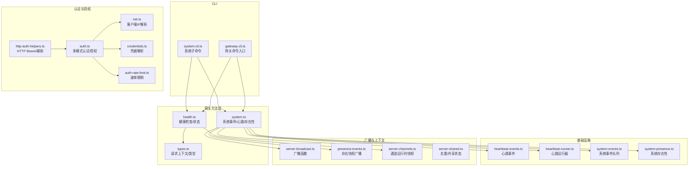
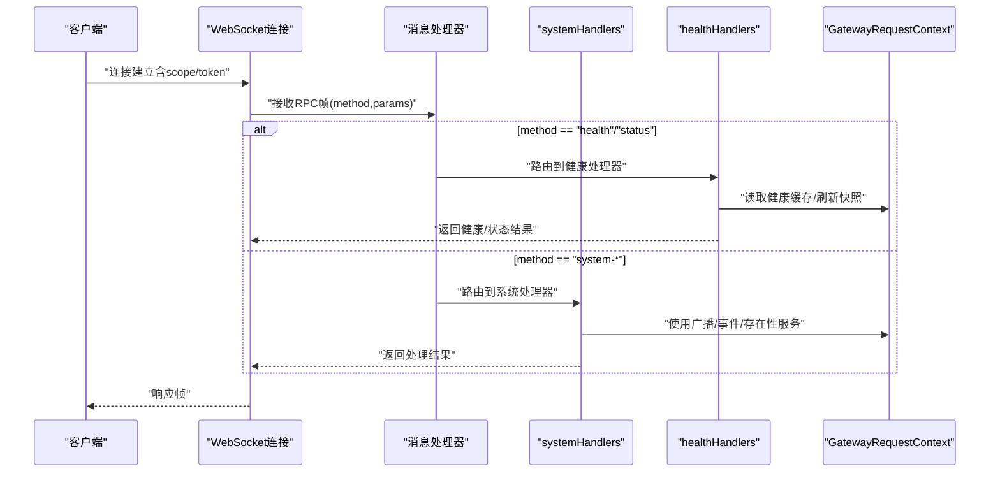
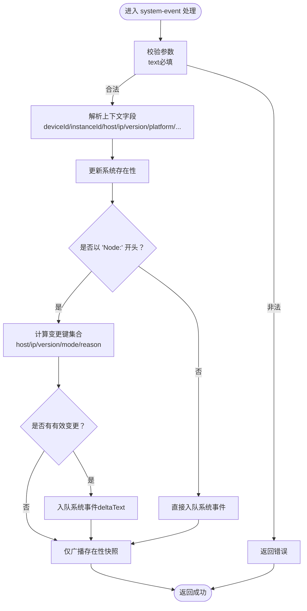
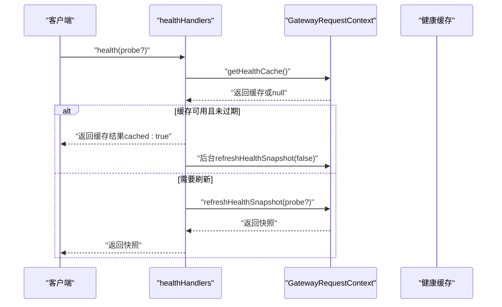
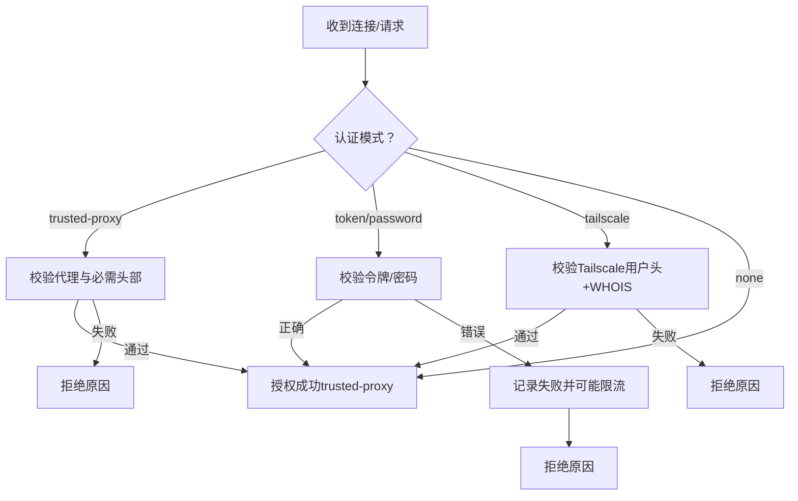
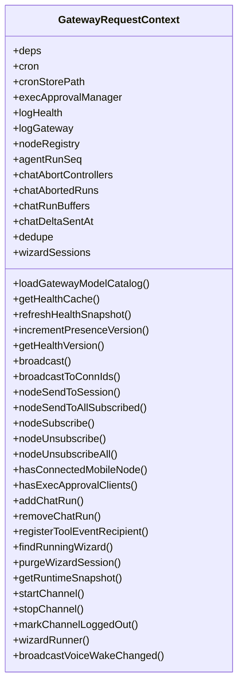
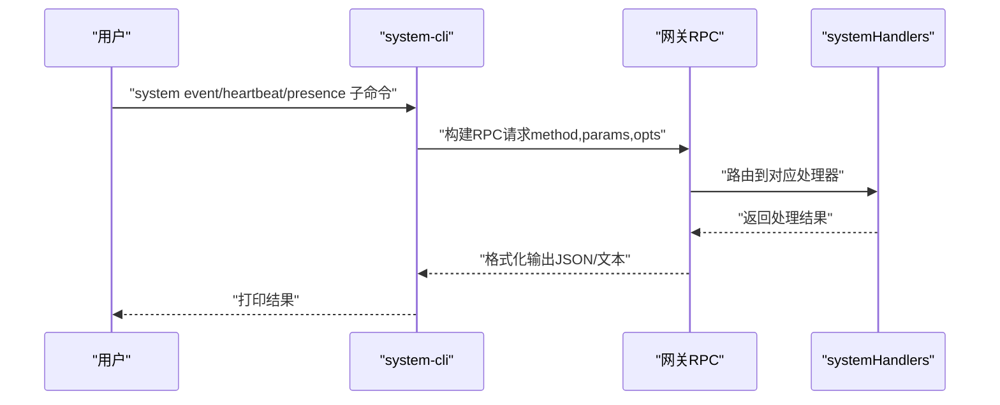
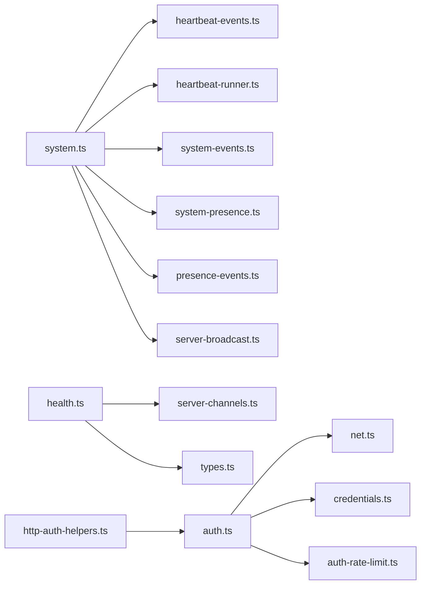

# 系统管理API

<cite>
**本文引用的文件**   
- [src/gateway/server-methods/health.ts](file://src/gateway/server-methods/health.ts)
- [src/gateway/server-methods/system.ts](file://src/gateway/server-methods/system.ts)
- [src/gateway/server-methods/types.ts](file://src/gateway/server-methods/types.ts)
- [src/gateway/auth.ts](file://src/gateway/auth.ts)
- [src/gateway/http-auth-helpers.ts](file://src/gateway/http-auth-helpers.ts)
- [src/cli/system-cli.ts](file://src/cli/system-cli.ts)
- [src/cli/gateway-cli.ts](file://src/cli/gateway-cli.ts)
- [src/commands/status.ts](file://src/commands/status.ts)
- [src/infra/heartbeat-events.ts](file://src/infra/heartbeat-events.ts)
- [src/infra/heartbeat-runner.ts](file://src/infra/heartbeat-runner.ts)
- [src/infra/system-events.ts](file://src/infra/system-events.ts)
- [src/infra/system-presence.ts](file://src/infra/system-presence.ts)
- [src/gateway/server-constants.ts](file://src/gateway/server-constants.ts)
- [src/gateway/ws-log.ts](file://src/gateway/ws-log.ts)
- [src/gateway/server-broadcast.ts](file://src/gateway/server-broadcast.ts)
- [src/gateway/server/presence-events.ts](file://src/gateway/server/presence-events.ts)
- [src/gateway/server/ws-connection/message-handler.ts](file://src/gateway/server/ws-connection/message-handler.ts)
- [src/gateway/server-channels.ts](file://src/gateway/server-channels.ts)
- [src/gateway/chat-abort.ts](file://src/gateway/chat-abort.ts)
- [src/gateway/node-registry.ts](file://src/gateway/node-registry.ts)
- [src/gateway/exec-approval-manager.ts](file://src/gateway/exec-approval-manager.ts)
- [src/gateway/wizard/session.ts](file://src/gateway/wizard/session.ts)
- [src/gateway/server-shared.ts](file://src/gateway/server-shared.ts)
- [src/security/audit-extra.async.ts](file://src/security/audit-extra.async.ts)
- [src/logging/subsystem.ts](file://src/logging/subsystem.ts)
- [src/gateway/net.ts](file://src/gateway/net.ts)
- [src/gateway/credentials.ts](file://src/gateway/credentials.ts)
- [src/gateway/auth-rate-limit.ts](file://src/gateway/auth-rate-limit.ts)
- [src/gateway/server.auth.default-token.suite.ts](file://src/gateway/server.auth.default-token.suite.ts)
</cite>

## 目录

1. [简介](#简介)
2. [项目结构](#项目结构)
3. [核心组件](#核心组件)
4. [架构总览](#架构总览)
5. [详细组件分析](#详细组件分析)
6. [依赖关系分析](#依赖关系分析)
7. [性能考量](#性能考量)
8. [故障排查指南](#故障排查指南)
9. [结论](#结论)
10. [附录](#附录)

## 简介

本文件面向OpenClaw系统管理API，聚焦通过WebSocket提供的系统配置、健康检查与运维管理能力。内容覆盖：

- 系统状态查询、配置更新与诊断信息获取
- 系统监控指标、性能统计与告警机制
- 完整的系统管理示例（配置查询、系统状态检查、运维操作）
- 系统安全策略、访问控制与审计日志机制

## 项目结构

围绕系统管理API的关键目录与文件：

- 网关方法层：系统事件、心跳、存在性与健康检查
- 认证与授权：令牌/密码/受信任代理/Tailscale多模式
- CLI工具：系统子命令与网关RPC调用
- 基础设施：心跳事件、系统事件、系统存在性
- 广播与上下文：请求上下文、广播函数、节点注册等

**图表来源**

- [src/cli/system-cli.ts:1-133](file://src/cli/system-cli.ts#L1-L133)
- [src/cli/gateway-cli.ts:1-1](file://src/cli/gateway-cli.ts#L1-L1)
- [src/gateway/server-methods/system.ts:1-135](file://src/gateway/server-methods/system.ts#L1-L135)
- [src/gateway/server-methods/health.ts:1-38](file://src/gateway/server-methods/health.ts#L1-L38)
- [src/gateway/server-methods/types.ts:1-113](file://src/gateway/server-methods/types.ts#L1-L113)
- [src/gateway/auth.ts:1-504](file://src/gateway/auth.ts#L1-L504)
- [src/gateway/http-auth-helpers.ts:1-29](file://src/gateway/http-auth-helpers.ts#L1-L29)
- [src/gateway/net.ts:1-200](file://src/gateway/net.ts#L1-L200)
- [src/gateway/credentials.ts:1-200](file://src/gateway/credentials.ts#L1-L200)
- [src/gateway/auth-rate-limit.ts:1-200](file://src/gateway/auth-rate-limit.ts#L1-L200)
- [src/infra/heartbeat-events.ts:1-200](file://src/infra/heartbeat-events.ts#L1-L200)
- [src/infra/heartbeat-runner.ts:1-200](file://src/infra/heartbeat-runner.ts#L1-L200)
- [src/infra/system-events.ts:1-200](file://src/infra/system-events.ts#L1-L200)
- [src/infra/system-presence.ts:1-200](file://src/infra/system-presence.ts#L1-L200)
- [src/gateway/server-broadcast.ts:1-200](file://src/gateway/server-broadcast.ts#L1-L200)
- [src/gateway/server/presence-events.ts:1-200](file://src/gateway/server/presence-events.ts#L1-L200)
- [src/gateway/server-channels.ts:1-200](file://src/gateway/server-channels.ts#L1-L200)
- [src/gateway/server-shared.ts:1-200](file://src/gateway/server-shared.ts#L1-L200)

**章节来源**

- [src/cli/system-cli.ts:1-133](file://src/cli/system-cli.ts#L1-L133)
- [src/gateway/server-methods/system.ts:1-135](file://src/gateway/server-methods/system.ts#L1-L135)
- [src/gateway/server-methods/health.ts:1-38](file://src/gateway/server-methods/health.ts#L1-L38)
- [src/gateway/auth.ts:1-504](file://src/gateway/auth.ts#L1-L504)

## 核心组件

- 系统方法处理器（systemHandlers）：提供“最近心跳”、“设置心跳开关”、“系统存在性列表”、“系统事件入队”等能力，并在必要时触发广播与系统事件队列。
- 健康方法处理器（healthHandlers）：提供“健康检查”和“状态摘要”，支持缓存与探测刷新，区分管理员敏感信息。
- 请求上下文（GatewayRequestContext）：封装网关运行期所需的服务、广播、节点注册、会话管理、去重等能力。
- 认证与授权（authorizeGatewayConnect）：支持无、令牌、密码、受信任代理、Tailscale等多种模式；内置速率限制与用户身份提取。
- CLI系统子命令：提供“系统事件”“心跳控制”“系统存在性”等RPC调用入口。

**章节来源**

- [src/gateway/server-methods/system.ts:10-135](file://src/gateway/server-methods/system.ts#L10-L135)
- [src/gateway/server-methods/health.ts:10-37](file://src/gateway/server-methods/health.ts#L10-L37)
- [src/gateway/server-methods/types.ts:33-91](file://src/gateway/server-methods/types.ts#L33-L91)
- [src/gateway/auth.ts:378-485](file://src/gateway/auth.ts#L378-L485)
- [src/cli/system-cli.ts:41-132](file://src/cli/system-cli.ts#L41-L132)

## 架构总览

系统管理API通过WebSocket承载RPC请求，客户端可执行系统状态查询、健康检查、心跳控制、系统事件入队与存在性查询等操作。认证层支持多种模式并具备速率限制，健康检查支持缓存与后台刷新，系统事件与存在性变更会触发广播。

**图表来源**

- [src/gateway/server-methods/health.ts:10-37](file://src/gateway/server-methods/health.ts#L10-L37)
- [src/gateway/server-methods/system.ts:10-135](file://src/gateway/server-methods/system.ts#L10-L135)
- [src/gateway/server-methods/types.ts:33-91](file://src/gateway/server-methods/types.ts#L33-L91)
- [src/gateway/server/ws-connection/message-handler.ts:236-276](file://src/gateway/server/ws-connection/message-handler.ts#L236-L276)

## 详细组件分析

### 组件A：系统方法（systemHandlers）

职责与行为：

- 最近心跳：返回最近心跳事件对象。
- 设置心跳：校验布尔参数，切换心跳开关。
- 系统存在性：列出当前系统存在性条目。
- 系统事件：校验文本必填，解析设备/实例/主机/IP/版本/平台/角色/作用域/标签等上下文，更新系统存在性；对节点存在性行进行差异化处理并入队系统事件；最终广播存在性快照。

关键流程图（系统事件入队与广播）：

**图表来源**

- [src/gateway/server-methods/system.ts:34-133](file://src/gateway/server-methods/system.ts#L34-L133)
- [src/infra/system-presence.ts:1-200](file://src/infra/system-presence.ts#L1-L200)
- [src/infra/system-events.ts:1-200](file://src/infra/system-events.ts#L1-L200)
- [src/gateway/server/presence-events.ts:1-200](file://src/gateway/server/presence-events.ts#L1-L200)

**章节来源**

- [src/gateway/server-methods/system.ts:10-135](file://src/gateway/server-methods/system.ts#L10-L135)
- [src/infra/heartbeat-events.ts:1-200](file://src/infra/heartbeat-events.ts#L1-L200)
- [src/infra/heartbeat-runner.ts:1-200](file://src/infra/heartbeat-runner.ts#L1-L200)
- [src/infra/system-events.ts:1-200](file://src/infra/system-events.ts#L1-L200)
- [src/infra/system-presence.ts:1-200](file://src/infra/system-presence.ts#L1-L200)
- [src/gateway/server/presence-events.ts:1-200](file://src/gateway/server/presence-events.ts#L1-L200)

### 组件B：健康检查（healthHandlers）

职责与行为：

- health：优先返回缓存（若未过期），否则触发快照刷新；支持探测模式；异常时返回UNAVAILABLE。
- status：根据连接作用域决定是否包含敏感信息（如管理员范围）。

缓存与刷新序列：

**图表来源**

- [src/gateway/server-methods/health.ts:11-29](file://src/gateway/server-methods/health.ts#L11-L29)
- [src/gateway/server-constants.ts:1-200](file://src/gateway/server-constants.ts#L1-L200)
- [src/gateway/ws-log.ts:1-200](file://src/gateway/ws-log.ts#L1-L200)

**章节来源**

- [src/gateway/server-methods/health.ts:10-37](file://src/gateway/server-methods/health.ts#L10-L37)
- [src/commands/status.ts:1-200](file://src/commands/status.ts#L1-L200)

### 组件C：认证与授权（authorizeGatewayConnect）

支持模式与流程：

- 模式：无、令牌、密码、受信任代理、Tailscale（按需启用）。
- 速率限制：失败尝试计数，允许重试时间窗口。
- 用户身份：受信任代理从指定头部解析；Tailscale通过反向代理转发的用户头与WHOIS校验。
- HTTP Bearer：从Authorization头提取令牌并走相同授权路径。

认证流程（简化）：

**图表来源**

- [src/gateway/auth.ts:378-485](file://src/gateway/auth.ts#L378-L485)
- [src/gateway/http-auth-helpers.ts:7-29](file://src/gateway/http-auth-helpers.ts#L7-L29)
- [src/gateway/net.ts:1-200](file://src/gateway/net.ts#L1-L200)
- [src/gateway/credentials.ts:1-200](file://src/gateway/credentials.ts#L1-L200)
- [src/gateway/auth-rate-limit.ts:1-200](file://src/gateway/auth-rate-limit.ts#L1-L200)

**章节来源**

- [src/gateway/auth.ts:1-504](file://src/gateway/auth.ts#L1-L504)
- [src/gateway/http-auth-helpers.ts:1-29](file://src/gateway/http-auth-helpers.ts#L1-L29)
- [src/gateway/server.auth.default-token.suite.ts:179-214](file://src/gateway/server.auth.default-token.suite.ts#L179-L214)

### 组件D：请求上下文（GatewayRequestContext）

上下文能力概览：

- 运行期依赖：命令依赖、定时任务、模型目录加载、通道运行时快照。
- 健康与广播：健康缓存、刷新、广播函数、存在性版本号。
- 节点与会话：节点注册、订阅/取消订阅、会话发送、中止控制。
- 去重与向导：请求去重、向导会话管理。

类图（关键接口与职责）：

**图表来源**

- [src/gateway/server-methods/types.ts:33-91](file://src/gateway/server-methods/types.ts#L33-L91)

**章节来源**

- [src/gateway/server-methods/types.ts:1-113](file://src/gateway/server-methods/types.ts#L1-L113)

### 组件E：CLI系统管理（system-cli）

CLI命令与RPC映射：

- 系统事件：将文本与模式参数发送到网关“wake”方法。
- 心跳控制：调用“last-heartbeat”“set-heartbeats”。
- 系统存在性：调用“system-presence”。

CLI到RPC序列：

**图表来源**

- [src/cli/system-cli.ts:58-71](file://src/cli/system-cli.ts#L58-L71)
- [src/cli/system-cli.ts:81-86](file://src/cli/system-cli.ts#L81-L86)
- [src/cli/system-cli.ts:94-101](file://src/cli/system-cli.ts#L94-L101)
- [src/cli/system-cli.ts:110-118](file://src/cli/system-cli.ts#L110-L118)
- [src/cli/system-cli.ts:125-131](file://src/cli/system-cli.ts#L125-L131)

**章节来源**

- [src/cli/system-cli.ts:1-133](file://src/cli/system-cli.ts#L1-L133)

## 依赖关系分析

- 系统方法依赖：心跳事件、心跳运行器、系统事件队列、系统存在性、存在性快照广播。
- 健康方法依赖：健康缓存、健康快照刷新、日志子系统。
- 认证依赖：网络解析、凭据解析、速率限制、Tailscale WHOIS。
- 上下文依赖：广播、节点注册、通道运行时、会话与中止控制、去重与向导会话。

**图表来源**

- [src/gateway/server-methods/system.ts:1-135](file://src/gateway/server-methods/system.ts#L1-L135)
- [src/gateway/server-methods/health.ts:1-38](file://src/gateway/server-methods/health.ts#L1-L38)
- [src/gateway/server-methods/types.ts:1-113](file://src/gateway/server-methods/types.ts#L1-L113)
- [src/gateway/auth.ts:1-504](file://src/gateway/auth.ts#L1-L504)
- [src/gateway/http-auth-helpers.ts:1-29](file://src/gateway/http-auth-helpers.ts#L1-L29)
- [src/gateway/net.ts:1-200](file://src/gateway/net.ts#L1-L200)
- [src/gateway/credentials.ts:1-200](file://src/gateway/credentials.ts#L1-L200)
- [src/gateway/auth-rate-limit.ts:1-200](file://src/gateway/auth-rate-limit.ts#L1-L200)

**章节来源**

- [src/gateway/server-methods/system.ts:1-135](file://src/gateway/server-methods/system.ts#L1-L135)
- [src/gateway/server-methods/health.ts:1-38](file://src/gateway/server-methods/health.ts#L1-L38)
- [src/gateway/auth.ts:1-504](file://src/gateway/auth.ts#L1-L504)

## 性能考量

- 健康检查缓存：通过常量控制刷新间隔，避免频繁探测；后台刷新失败仅记录日志，不影响即时响应。
- 广播与存在性：存在性变更后才触发广播，减少不必要广播开销。
- 速率限制：对失败尝试进行限流，降低暴力破解风险并保护后端资源。
- 日志与可观测性：健康与WS控制日志子系统用于问题定位，建议结合日志级别与目标调整。

**章节来源**

- [src/gateway/server-constants.ts:1-200](file://src/gateway/server-constants.ts#L1-L200)
- [src/gateway/ws-log.ts:1-200](file://src/gateway/ws-log.ts#L1-L200)
- [src/gateway/auth-rate-limit.ts:1-200](file://src/gateway/auth-rate-limit.ts#L1-L200)

## 故障排查指南

常见问题与定位要点：

- 认证失败
  - 检查令牌/密码是否正确；确认速率限制是否触发；验证受信任代理头部与用户白名单。
  - 参考：认证结果中的reason字段与速率限制返回的retryAfterMs。
- 健康检查异常
  - 使用probe模式强制刷新；查看后台刷新日志；确认缓存是否过期。
- 系统事件未生效
  - 确认text非空；检查节点存在性行的reason是否被忽略（周期性/心跳）；核对上下文字段是否变更。
- 权限不足
  - status接口对管理员范围（如operator.admin）才返回敏感信息；确认连接scopes。

**章节来源**

- [src/gateway/auth.ts:378-485](file://src/gateway/auth.ts#L378-L485)
- [src/gateway/server-methods/health.ts:11-29](file://src/gateway/server-methods/health.ts#L11-L29)
- [src/gateway/server-methods/system.ts:34-133](file://src/gateway/server-methods/system.ts#L34-L133)

## 结论

OpenClaw系统管理API通过WebSocket提供统一的系统状态查询、健康检查与运维管理能力。其设计强调：

- 明确的认证与授权策略，支持多模式与速率限制
- 健康检查的缓存与后台刷新机制
- 系统事件与存在性的精细化处理与广播
- CLI与RPC的一致性接口，便于自动化与运维集成

## 附录

### API定义与示例

- 健康检查
  - 方法：health
  - 参数：probe（可选，布尔）
  - 返回：健康快照或缓存标记
  - 示例：CLI“gateway health”或RPC“health”
- 状态摘要
  - 方法：status
  - 参数：无
  - 返回：状态摘要（管理员范围包含敏感信息）
  - 示例：CLI“gateway status”或RPC“status”
- 最近心跳
  - 方法：last-heartbeat
  - 参数：无
  - 返回：最近心跳事件对象
  - 示例：CLI“system heartbeat last”
- 设置心跳
  - 方法：set-heartbeats
  - 参数：enabled（布尔）
  - 返回：{ ok, enabled }
  - 示例：CLI“system heartbeat enable/disable”
- 系统存在性
  - 方法：system-presence
  - 参数：无
  - 返回：存在性列表
  - 示例：CLI“system presence”
- 系统事件
  - 方法：system-event
  - 参数：text（必填）、deviceId、instanceId、host、ip、version、platform、deviceFamily、modelIdentifier、lastInputSeconds、reason、roles、scopes、tags
  - 返回：{ ok }
  - 行为：更新存在性、入队系统事件、广播存在性快照

**章节来源**

- [src/gateway/server-methods/health.ts:10-37](file://src/gateway/server-methods/health.ts#L10-L37)
- [src/gateway/server-methods/system.ts:10-135](file://src/gateway/server-methods/system.ts#L10-L135)
- [src/cli/system-cli.ts:73-132](file://src/cli/system-cli.ts#L73-L132)

### 安全策略与访问控制

- 支持模式：无、令牌、密码、受信任代理、Tailscale
- 速率限制：失败尝试计数与重试窗口
- 用户身份：受信任代理头部、Tailscale用户头+WHOIS
- HTTP Bearer：从Authorization头提取令牌并走统一授权路径

**章节来源**

- [src/gateway/auth.ts:23-38](file://src/gateway/auth.ts#L23-L38)
- [src/gateway/auth.ts:378-485](file://src/gateway/auth.ts#L378-L485)
- [src/gateway/http-auth-helpers.ts:7-29](file://src/gateway/http-auth-helpers.ts#L7-L29)
- [src/gateway/auth-rate-limit.ts:1-200](file://src/gateway/auth-rate-limit.ts#L1-L200)

### 审计日志与合规

- 日志文件权限审计：检测日志文件是否对其他用户可读，给出修复建议
- 配置快照审计：读取配置文件快照用于审计比对

**章节来源**

- [src/security/audit-extra.async.ts:1095-1137](file://src/security/audit-extra.async.ts#L1095-L1137)
