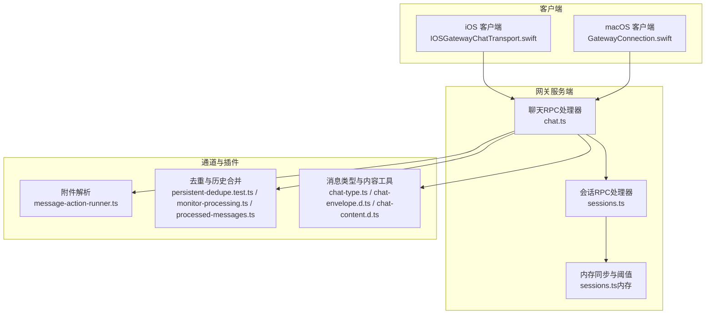
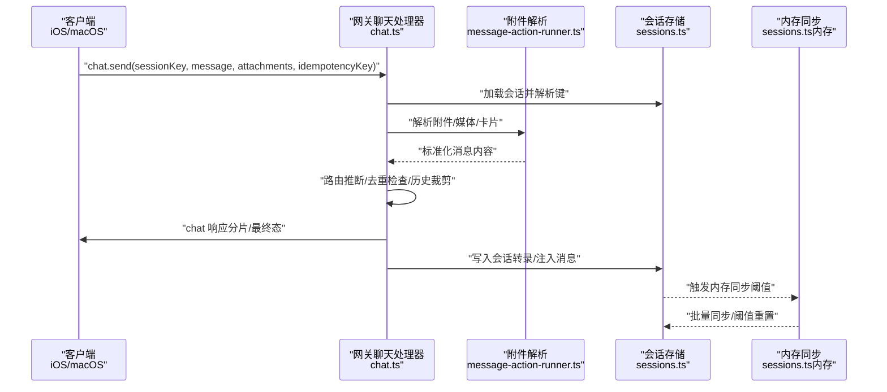
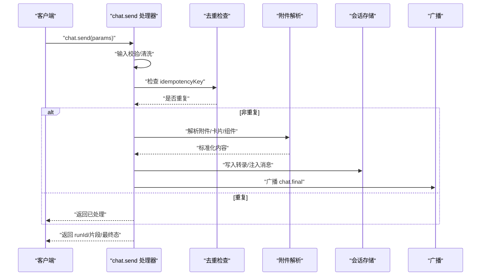
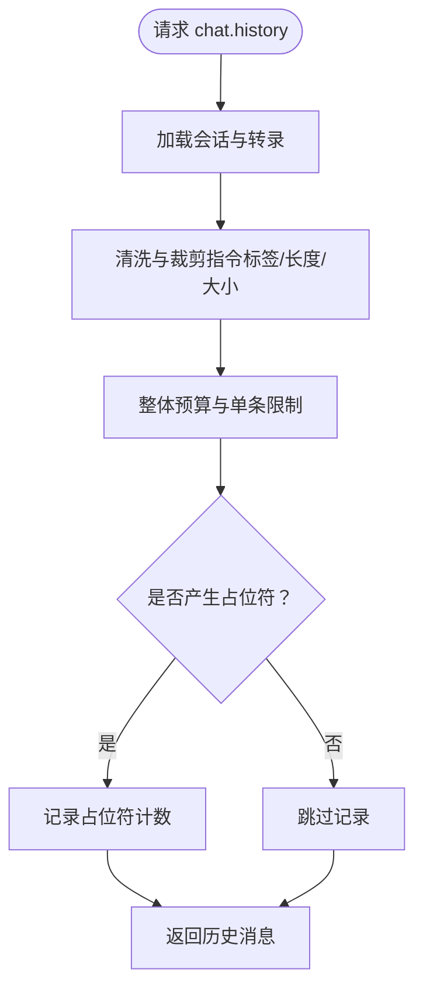
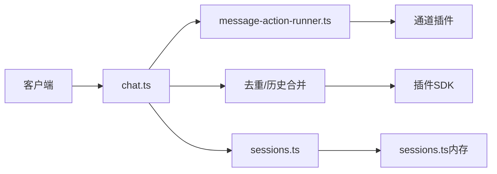

# 聊天消息API

<cite>
**本文引用的文件**
- [chat.ts](file://src/gateway/server-methods/chat.ts)
- [sessions.ts](file://src/gateway/server-methods/sessions.ts)
- [chat-type.ts](file://src/channels/chat-type.ts)
- [chat-envelope.d.ts](file://dist/plugin-sdk/shared/chat-envelope.d.ts)
- [chat-content.d.ts](file://dist/plugin-sdk/shared/chat-content.d.ts)
- [IOSGatewayChatTransport.swift](file://apps/ios/Sources/Chat/IOSGatewayChatTransport.swift)
- [GatewayConnection.swift](file://apps/macos/Sources/OpenClaw/GatewayConnection.swift)
- [webchat.md](file://docs/web/webchat.md)
- [chat.directive-tags.test.ts](file://src/gateway/server-methods/chat.directive-tags.test.ts)
- [message-action-runner.ts](file://src/infra/outbound/message-action-runner.ts)
- [chat-abort.ts](file://src/gateway/chat-abort.ts)
- [chat-transcript-inject.ts](file://src/gateway/server-methods/chat-transcript-inject.ts)
- [session-utils.ts](file://src/gateway/session-utils.ts)
- [sessions.ts（内存）](file://src/memory/manager-sync-ops.ts)
- [persistent-dedupe.test.ts](file://src/plugin-sdk/persistent-dedupe.test.ts)
- [monitor-processing.ts](file://extensions/bluebubbles/src/monitor-processing.ts)
- [processed-messages.ts](file://extensions/tlon/src/monitor/processed-messages.ts)
- [chat-type.ts（扩展）](file://extensions/feishu/src/chat-type.ts)
</cite>

## 目录

1. [简介](#简介)
2. [项目结构](#项目结构)
3. [核心组件](#核心组件)
4. [架构总览](#架构总览)
5. [详细组件分析](#详细组件分析)
6. [依赖关系分析](#依赖关系分析)
7. [性能考量](#性能考量)
8. [故障排查指南](#故障排查指南)
9. [结论](#结论)
10. [附录](#附录)

## 简介

本文件系统性地文档化 OpenClaw 的聊天消息 API，覆盖 WebSocket 接口、消息发送与接收、会话管理、消息路由与转发、会话状态同步、消息去重、持久化与历史记录管理等。文档同时提供消息交互的完整示例流程，帮助开发者快速集成与调试。

## 项目结构

OpenClaw 的聊天消息能力由“网关服务端方法”“客户端传输层”“通道与插件”“会话存储与内存同步”等模块协同完成。核心入口包括：

- 网关聊天 RPC 方法：负责 chat.send、chat.history、chat.inject、chat.abort 等
- 会话管理 RPC 方法：负责 sessions.\* 操作
- 客户端（iOS/macOS）通过 WebSocket 连接网关并调用上述方法
- 插件与通道负责消息解析、附件处理、去重与历史合并

图表来源

- [chat.ts](file://src/gateway/server-methods/chat.ts)
- [sessions.ts](file://src/gateway/server-methods/sessions.ts)
- [message-action-runner.ts](file://src/infra/outbound/message-action-runner.ts)
- [persistent-dedupe.test.ts](file://src/plugin-sdk/persistent-dedupe.test.ts)
- [monitor-processing.ts](file://extensions/bluebubbles/src/monitor-processing.ts)
- [processed-messages.ts](file://extensions/tlon/src/monitor/processed-messages.ts)
- [chat-type.ts](file://src/channels/chat-type.ts)
- [chat-envelope.d.ts](file://dist/plugin-sdk/shared/chat-envelope.d.ts)
- [chat-content.d.ts](file://dist/plugin-sdk/shared/chat-content.d.ts)
- [IOSGatewayChatTransport.swift](file://apps/ios/Sources/Chat/IOSGatewayChatTransport.swift)
- [GatewayConnection.swift](file://apps/macos/Sources/OpenClaw/GatewayConnection.swift)

章节来源

- [chat.ts](file://src/gateway/server-methods/chat.ts)
- [sessions.ts](file://src/gateway/server-methods/sessions.ts)
- [message-action-runner.ts](file://src/infra/outbound/message-action-runner.ts)
- [persistent-dedupe.test.ts](file://src/plugin-sdk/persistent-dedupe.test.ts)
- [monitor-processing.ts](file://extensions/bluebubbles/src/monitor-processing.ts)
- [processed-messages.ts](file://extensions/tlon/src/monitor/processed-messages.ts)
- [chat-type.ts](file://src/channels/chat-type.ts)
- [chat-envelope.d.ts](file://dist/plugin-sdk/shared/chat-envelope.d.ts)
- [chat-content.d.ts](file://dist/plugin-sdk/shared/chat-content.d.ts)
- [IOSGatewayChatTransport.swift](file://apps/ios/Sources/Chat/IOSGatewayChatTransport.swift)
- [GatewayConnection.swift](file://apps/macos/Sources/OpenClaw/GatewayConnection.swift)

## 核心组件

- 聊天 RPC 处理器（chat.ts）
  - 提供 chat.send、chat.history、chat.inject、chat.abort 等方法
  - 负责消息输入校验、路由推断、会话加载、历史裁剪、广播与节点投递
- 会话 RPC 处理器（sessions.ts）
  - 提供 sessions.list、sessions.preview、sessions.resolve、sessions.patch、sessions.reset、sessions.delete、sessions.get、sessions.compact 等
  - 负责会话键解析、存储更新、归档与生命周期事件
- 客户端传输层（iOS/macOS）
  - 通过 WebSocket 调用 chat.send 并接收 chat 响应
  - 支持附件参数、超时控制与响应解码
- 通道与插件
  - 附件解析与媒体处理（message-action-runner.ts）
  - 去重与历史合并（persistent-dedupe.test.ts、monitor-processing.ts、processed-messages.ts）
  - 消息类型与内容工具（chat-type.ts、chat-envelope.d.ts、chat-content.d.ts）

章节来源

- [chat.ts](file://src/gateway/server-methods/chat.ts)
- [sessions.ts](file://src/gateway/server-methods/sessions.ts)
- [message-action-runner.ts](file://src/infra/outbound/message-action-runner.ts)
- [persistent-dedupe.test.ts](file://src/plugin-sdk/persistent-dedupe.test.ts)
- [monitor-processing.ts](file://extensions/bluebubbles/src/monitor-processing.ts)
- [processed-messages.ts](file://extensions/tlon/src/monitor/processed-messages.ts)
- [chat-type.ts](file://src/channels/chat-type.ts)
- [chat-envelope.d.ts](file://dist/plugin-sdk/shared/chat-envelope.d.ts)
- [chat-content.d.ts](file://dist/plugin-sdk/shared/chat-content.d.ts)
- [IOSGatewayChatTransport.swift](file://apps/ios/Sources/Chat/IOSGatewayChatTransport.swift)
- [GatewayConnection.swift](file://apps/macos/Sources/OpenClaw/GatewayConnection.swift)

## 架构总览

下图展示从客户端到网关再到通道与会话存储的整体链路，以及消息在不同阶段的处理与广播路径。

图表来源

- [chat.ts](file://src/gateway/server-methods/chat.ts)
- [message-action-runner.ts](file://src/infra/outbound/message-action-runner.ts)
- [sessions.ts](file://src/gateway/server-methods/sessions.ts)
- [sessions.ts（内存）](file://src/memory/manager-sync-ops.ts)

章节来源

- [chat.ts](file://src/gateway/server-methods/chat.ts)
- [message-action-runner.ts](file://src/infra/outbound/message-action-runner.ts)
- [sessions.ts](file://src/gateway/server-methods/sessions.ts)
- [sessions.ts（内存）](file://src/memory/manager-sync-ops.ts)

## 详细组件分析

### 聊天消息发送（chat.send）

- 请求参数
  - 必填：sessionKey、message
  - 可选：thinking、idempotencyKey、attachments（数组）、timeoutMs
  - 附件支持类型、MIME、文件名与内容字段
- 处理流程
  - 输入校验与清洗（空字节过滤、控制字符清理）
  - 会话键解析与路由推断（区分内部/外部通道、Webchat 特例）
  - 去重检查（基于 idempotencyKey；会话转录中已存在则跳过）
  - 附件解析与内容标准化（支持 media/path/filePath/caption/card/components）
  - 写入会话转录（注入助手消息或用户消息）
  - 广播 chat.final 或 chat.delta 到连接的客户端与节点
- 响应
  - 返回 runId、sessionKey、消息片段（分片）或最终态

图表来源

- [chat.ts](file://src/gateway/server-methods/chat.ts)
- [message-action-runner.ts](file://src/infra/outbound/message-action-runner.ts)

章节来源

- [chat.ts](file://src/gateway/server-methods/chat.ts)
- [message-action-runner.ts](file://src/infra/outbound/message-action-runner.ts)
- [chat.directive-tags.test.ts](file://src/gateway/server-methods/chat.directive-tags.test.ts)

### 聊天消息接收与历史查询（chat.history）

- 请求参数
  - 必填：sessionKey
  - 可选：limit（默认 200，上限 1000）
- 处理流程
  - 加载会话并读取转录
  - 历史内容清洗（去除指令标签、截断过长文本、移除敏感字段）
  - 单条消息大小限制与整体预算限制
  - 截断占位符替换与日志统计
- 响应
  - 返回 sessionKey、sessionId、messages（按时间倒序）

图表来源

- [chat.ts](file://src/gateway/server-methods/chat.ts)

章节来源

- [chat.ts](file://src/gateway/server-methods/chat.ts)

### 会话管理（sessions.\*）

- 关键方法
  - sessions.list、sessions.preview、sessions.resolve
  - sessions.patch、sessions.reset、sessions.delete
  - sessions.get、sessions.compact
- 行为要点
  - 会话键规范化与迁移（兼容旧键）
  - 存储更新与归档（删除会话时可选择删除转录）
  - 主会话保护（禁止删除主会话）
  - 历史压缩（保留最近 N 行并清理用量统计字段）
- Webchat 客户端限制
  - 不允许通过 Webchat 直接修改会话（需使用 chat.send 进行会话级更新）

章节来源

- [sessions.ts](file://src/gateway/server-methods/sessions.ts)

### 消息类型与元数据结构

- 消息类型
  - direct（私聊）、group（群组）、channel（频道）
  - 支持别名（如 dm → direct）
- 元数据与内容
  - 内容提取工具：从多块内容中抽取文本
  - 信封剥离：去除包裹信息与消息 ID 提示
- 附件与多媒体
  - 附件字段包含类型、MIME、文件名与内容
  - 附件解析支持 media/path/filePath/caption/card/components

章节来源

- [chat-type.ts](file://src/channels/chat-type.ts)
- [chat-envelope.d.ts](file://dist/plugin-sdk/shared/chat-envelope.d.ts)
- [chat-content.d.ts](file://dist/plugin-sdk/shared/chat-content.d.ts)
- [message-action-runner.ts](file://src/infra/outbound/message-action-runner.ts)

### 消息路由与转发机制

- 路由推断
  - 基于会话键前缀与上次交付上下文推断来源通道/目标
  - Webchat/Control UI 客户端不继承外部路由
  - 显式 deliver=true 时才尝试外发
- 外部通道
  - 通道名称与目标地址解析
  - 发送策略与账户绑定
- 自动回复与模板
  - 自动回复调度与静默令牌检测
  - 回复前缀选项与静默回复处理

章节来源

- [chat.ts](file://src/gateway/server-methods/chat.ts)

### 会话状态同步

- 内存同步阈值
  - 增量字节数与消息数阈值触发同步
  - 批处理更新并重置待同步计数
- 会话转录
  - 读取/写入转录文件，确保头部存在
  - 注入助手消息并携带中止元数据

章节来源

- [sessions.ts（内存）](file://src/memory/manager-sync-ops.ts)
- [chat-transcript-inject.ts](file://src/gateway/server-methods/chat-transcript-inject.ts)

### 消息去重、持久化与历史记录管理

- 去重
  - 基于 idempotencyKey 的去重（会话转录扫描）
  - 插件侧去重缓存（内存/文件）
  - 历史去重键（消息 ID 优先，否则基于发送者/正文/时间戳组合）
- 持久化
  - 转录文件写入与头部初始化
  - 中止部分输出持久化（带中止元数据）
- 历史记录
  - 历史合并与截断（按条数与总字符数）
  - 占位符替换与预算约束

章节来源

- [chat.ts](file://src/gateway/server-methods/chat.ts)
- [persistent-dedupe.test.ts](file://src/plugin-sdk/persistent-dedupe.test.ts)
- [monitor-processing.ts](file://extensions/bluebubbles/src/monitor-processing.ts)
- [processed-messages.ts](file://extensions/tlon/src/monitor/processed-messages.ts)

### 客户端集成示例

- iOS 客户端
  - 组装参数（sessionKey、message、thinking、attachments、idempotencyKey、timeoutMs）
  - 调用 chat.send 并解码响应
- macOS 客户端
  - 参数结构与 iOS 类似，支持附件数组
- WebChat 行为
  - 使用 chat.history、chat.send、chat.inject
  - 历史从网关获取，UI 仅显示，不可离线

章节来源

- [IOSGatewayChatTransport.swift](file://apps/ios/Sources/Chat/IOSGatewayChatTransport.swift)
- [GatewayConnection.swift](file://apps/macos/Sources/OpenClaw/GatewayConnection.swift)
- [webchat.md](file://docs/web/webchat.md)

## 依赖关系分析

- 组件耦合
  - chat.ts 依赖会话存储、附件解析、去重与广播
  - sessions.ts 依赖会话存储与生命周期钩子
  - 客户端通过 WebSocket 与网关交互
- 外部依赖
  - 通道插件负责具体平台的消息发送与历史合并
  - 内存同步模块负责阈值驱动的批量同步

图表来源

- [chat.ts](file://src/gateway/server-methods/chat.ts)
- [message-action-runner.ts](file://src/infra/outbound/message-action-runner.ts)
- [sessions.ts](file://src/gateway/server-methods/sessions.ts)
- [sessions.ts（内存）](file://src/memory/manager-sync-ops.ts)

章节来源

- [chat.ts](file://src/gateway/server-methods/chat.ts)
- [sessions.ts](file://src/gateway/server-methods/sessions.ts)
- [message-action-runner.ts](file://src/infra/outbound/message-action-runner.ts)
- [sessions.ts（内存）](file://src/memory/manager-sync-ops.ts)

## 性能考量

- 历史裁剪与预算
  - 单条消息最大字节数与整体历史预算限制，避免 UI 卡顿
- 同步阈值
  - 增量阈值触发批量同步，降低频繁 IO
- 去重与占位符
  - 去重减少重复写入，占位符避免超大消息影响稳定性

## 故障排查指南

- chat.history 返回为空
  - 检查 sessionKey 是否正确，会话是否存在转录
  - 确认 limit 设置与历史裁剪策略
- chat.send 无响应或超时
  - 检查客户端超时设置与网络连通性
  - 确认 idempotencyKey 是否导致去重提前返回
- 会话无法修改
  - Webchat 客户端不允许直接修改会话，需使用 chat.send
- 历史过大被截断
  - 确认占位符计数与日志提示，调整 limit 或清理历史

章节来源

- [chat.ts](file://src/gateway/server-methods/chat.ts)
- [sessions.ts](file://src/gateway/server-methods/sessions.ts)

## 结论

OpenClaw 的聊天消息 API 以网关为中心，结合会话存储、通道插件与客户端 WebSocket，实现了稳定的消息发送、接收与会话管理。通过严格的输入校验、路由推断、去重与历史裁剪，保证了跨平台的一致体验与性能表现。开发者可依据本文档快速集成文本消息、多媒体消息与会话操作，并参考示例流程进行调试与优化。

## 附录

- 数据模型（简化）
  - 会话键：支持 agentId:scope:peer 形式，用于路由与存储定位
  - 消息体：包含角色、内容、时间戳、可选元数据（如中止标记）
  - 附件：类型、MIME、文件名与内容
- 常见错误码
  - INVALID_REQUEST：参数校验失败
  - 其他错误码详见协议定义与响应结构
