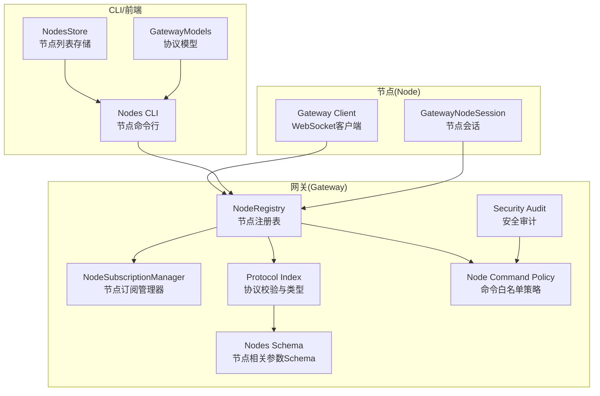
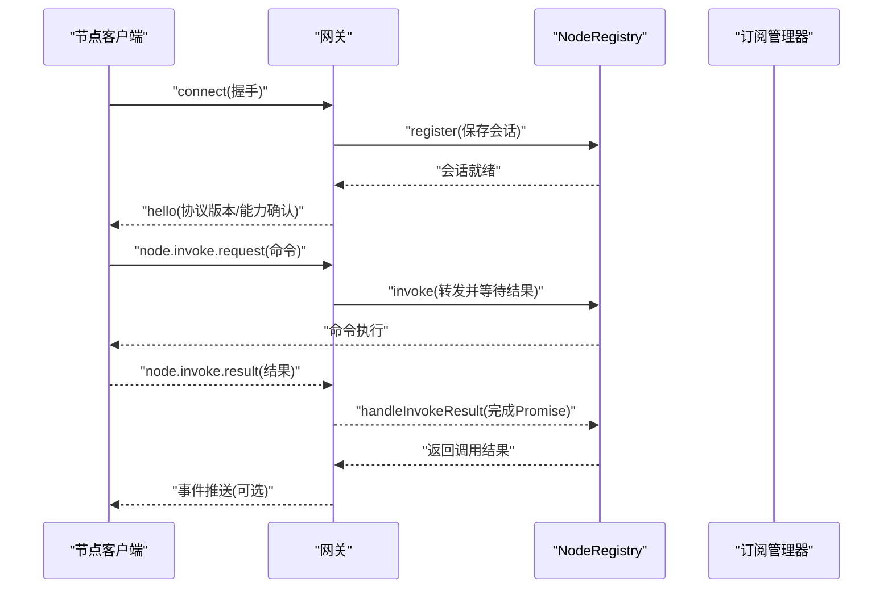
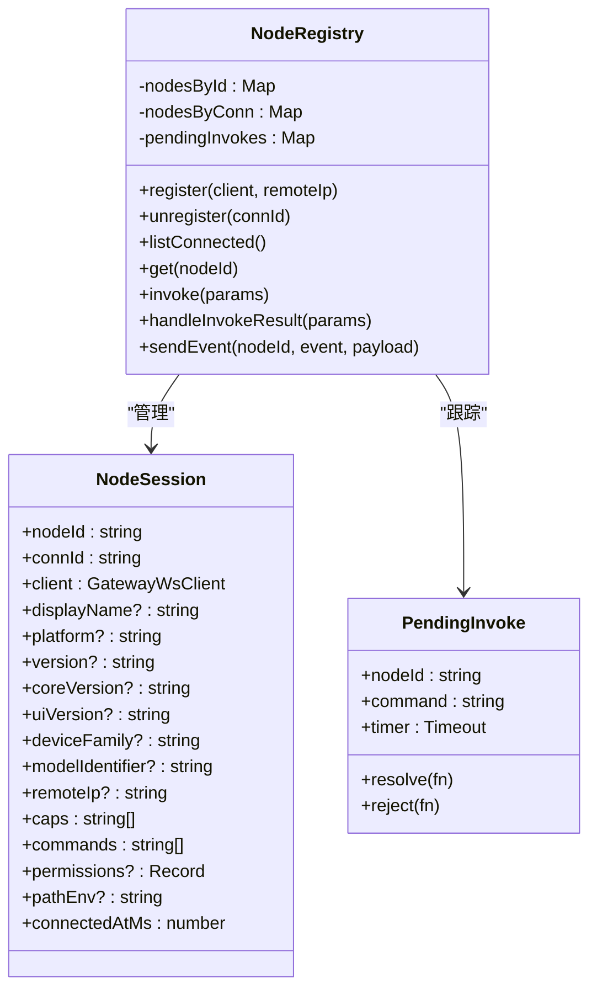
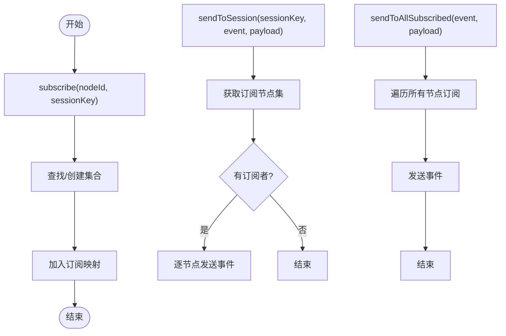
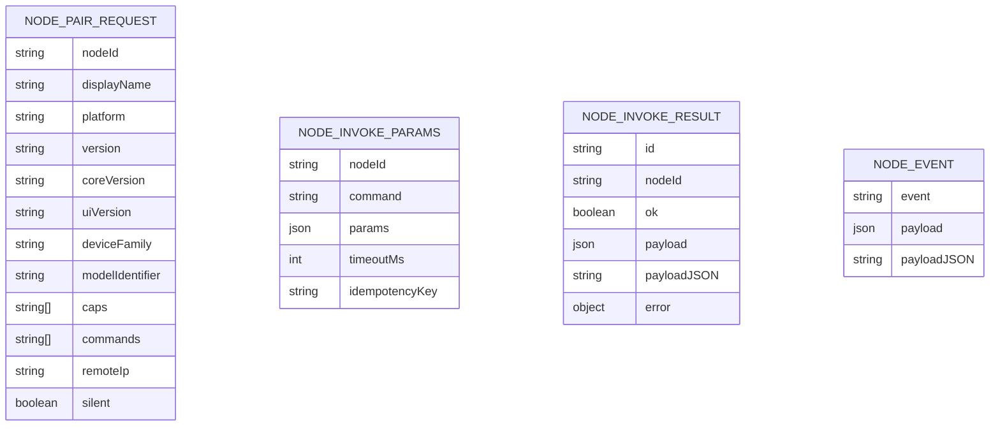
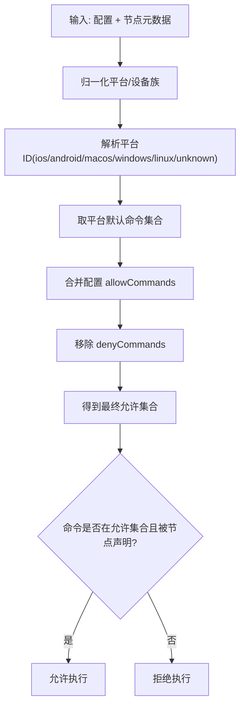
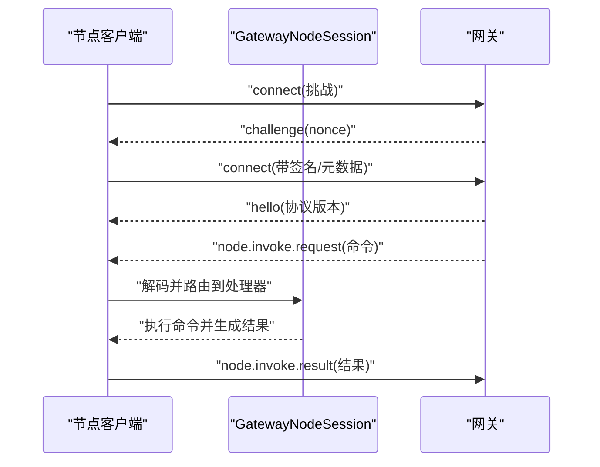
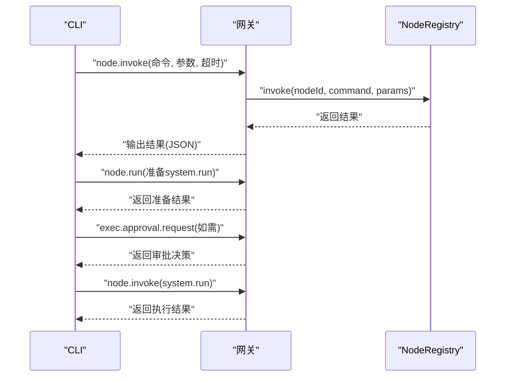
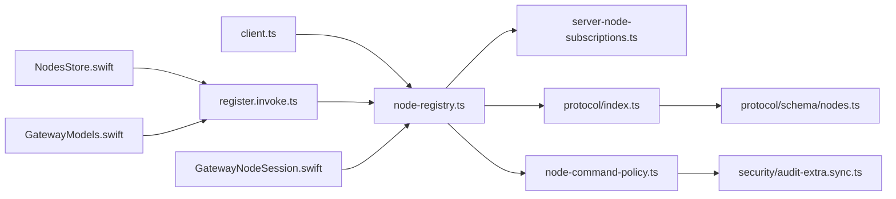

# 节点管理API

<cite>
**本文档引用的文件**
- [node-registry.ts](file://src/gateway/node-registry.ts)
- [server-node-subscriptions.ts](file://src/gateway/server-node-subscriptions.ts)
- [protocol/index.ts](file://src/gateway/protocol/index.ts)
- [protocol/schema/nodes.ts](file://src/gateway/protocol/schema/nodes.ts)
- [node-command-policy.ts](file://src/gateway/node-command-policy.ts)
- [node-pairing.ts](file://src/infra/node-pairing.ts)
- [client.ts](file://src/gateway/client.ts)
- [register.invoke.ts](file://src/cli/nodes-cli/register.invoke.ts)
- [GatewayNodeSession.swift](file://apps/shared/OpenClawKit/Sources/OpenClawKit/GatewayNodeSession.swift)
- [GatewayModels.swift](file://apps/shared/OpenClawKit/Sources/OpenClawProtocol/GatewayModels.swift)
- [NodesStore.swift](file://apps/macos/Sources/OpenClaw/NodesStore.swift)
- [audit-extra.sync.ts](file://src/security/audit-extra.sync.ts)
</cite>

## 目录

1. [简介](#简介)
2. [项目结构](#项目结构)
3. [核心组件](#核心组件)
4. [架构总览](#架构总览)
5. [详细组件分析](#详细组件分析)
6. [依赖关系分析](#依赖关系分析)
7. [性能考虑](#性能考虑)
8. [故障排查指南](#故障排查指南)
9. [结论](#结论)

## 简介

本文件系统性阐述 OpenClaw 的节点管理 API，覆盖设备节点、计算节点与执行节点的 WebSocket 接口；文档化节点发现、注册与状态管理机制；详解节点能力查询、资源分配与负载均衡策略；提供节点操作的完整示例（注册、状态查询、任务调度）；并说明节点安全策略、访问控制与故障恢复机制。

## 项目结构

OpenClaw 的节点管理由网关侧的注册表、订阅管理器、协议定义与安全策略，以及节点侧的连接客户端与命令路由共同组成。CLI 提供节点操作入口，前端应用提供节点列表与配对界面。

**图表来源**

- [node-registry.ts:38-209](file://src/gateway/node-registry.ts#L38-L209)
- [server-node-subscriptions.ts:33-164](file://src/gateway/server-node-subscriptions.ts#L33-L164)
- [protocol/index.ts:1-673](file://src/gateway/protocol/index.ts#L1-L673)
- [protocol/schema/nodes.ts:1-167](file://src/gateway/protocol/schema/nodes.ts#L1-L167)
- [node-command-policy.ts:1-212](file://src/gateway/node-command-policy.ts#L1-L212)
- [client.ts:1-532](file://src/gateway/client.ts#L1-L532)
- [register.invoke.ts:1-469](file://src/cli/nodes-cli/register.invoke.ts#L1-L469)
- [NodesStore.swift:1-60](file://apps/macos/Sources/OpenClaw/NodesStore.swift#L1-L60)
- [GatewayModels.swift:755-817](file://apps/shared/OpenClawKit/Sources/OpenClawProtocol/GatewayModels.swift#L755-L817)

**章节来源**

- [node-registry.ts:1-210](file://src/gateway/node-registry.ts#L1-L210)
- [server-node-subscriptions.ts:1-165](file://src/gateway/server-node-subscriptions.ts#L1-L165)
- [protocol/index.ts:1-673](file://src/gateway/protocol/index.ts#L1-L673)
- [protocol/schema/nodes.ts:1-167](file://src/gateway/protocol/schema/nodes.ts#L1-L167)
- [node-command-policy.ts:1-212](file://src/gateway/node-command-policy.ts#L1-L212)
- [client.ts:1-532](file://src/gateway/client.ts#L1-L532)
- [register.invoke.ts:1-469](file://src/cli/nodes-cli/register.invoke.ts#L1-L469)
- [NodesStore.swift:1-60](file://apps/macos/Sources/OpenClaw/NodesStore.swift#L1-L60)
- [GatewayModels.swift:755-817](file://apps/shared/OpenClawKit/Sources/OpenClawProtocol/GatewayModels.swift#L755-L817)

## 核心组件

- 节点注册表：维护节点会话、发起/响应节点调用、断线清理与超时处理。
- 订阅管理器：基于节点与会话键的订阅/广播，支持向特定会话或所有已连节点推送事件。
- 协议与Schema：统一定义节点配对、描述、列举、调用、事件等请求/响应格式与校验。
- 命令策略：按平台与配置生成命令白名单，限制高风险命令。
- 安全审计：检测危险命令启用与配置问题，给出修复建议。
- 节点侧客户端：负责握手、挑战、事件接收与心跳。
- CLI/前端：提供节点操作入口与节点列表展示。

**章节来源**

- [node-registry.ts:38-209](file://src/gateway/node-registry.ts#L38-L209)
- [server-node-subscriptions.ts:9-31](file://src/gateway/server-node-subscriptions.ts#L9-L31)
- [protocol/index.ts:460-673](file://src/gateway/protocol/index.ts#L460-L673)
- [protocol/schema/nodes.ts:12-167](file://src/gateway/protocol/schema/nodes.ts#L12-L167)
- [node-command-policy.ts:173-211](file://src/gateway/node-command-policy.ts#L173-L211)
- [client.ts:497-532](file://src/gateway/client.ts#L497-L532)
- [register.invoke.ts:300-469](file://src/cli/nodes-cli/register.invoke.ts#L300-L469)

## 架构总览

节点管理API通过 WebSocket 在网关与节点之间建立双向通信。节点在握手阶段上报能力与声明命令，网关据此进行命令授权与调用路由；CLI/前端通过网关RPC接口完成节点操作。

**图表来源**

- [client.ts:497-532](file://src/gateway/client.ts#L497-L532)
- [node-registry.ts:107-181](file://src/gateway/node-registry.ts#L107-L181)
- [server-node-subscriptions.ts:100-148](file://src/gateway/server-node-subscriptions.ts#L100-L148)

**章节来源**

- [client.ts:1-532](file://src/gateway/client.ts#L1-L532)
- [node-registry.ts:38-209](file://src/gateway/node-registry.ts#L38-L209)
- [server-node-subscriptions.ts:33-164](file://src/gateway/server-node-subscriptions.ts#L33-L164)

## 详细组件分析

### 节点注册表（NodeRegistry）

职责

- 注册/注销节点会话，维护连接映射与挂起调用。
- 发起节点调用并等待结果，内置超时与错误处理。
- 向节点发送事件帧。

关键数据结构

- NodeSession：包含节点标识、连接信息、能力与声明命令、权限、路径环境、连接时间等。
- PendingInvoke：记录待完成的调用请求，含超时定时器与解析器。

流程要点

- 注册：从握手参数提取节点元数据，写入会话表与连接映射。
- 注销：删除会话与连接映射，并清理该节点相关的挂起调用。
- 调用：构造请求帧，发送到节点；根据超时时间创建定时器；收到结果后解析并完成Promise。
- 结果处理：匹配请求ID与节点ID，清理定时器并回调。

**图表来源**

- [node-registry.ts:4-36](file://src/gateway/node-registry.ts#L4-L36)
- [node-registry.ts:38-209](file://src/gateway/node-registry.ts#L38-L209)

**章节来源**

- [node-registry.ts:38-209](file://src/gateway/node-registry.ts#L38-L209)

### 订阅管理器（NodeSubscriptionManager）

职责

- 维护节点与会话键之间的订阅关系。
- 支持向指定会话、所有订阅节点或所有已连节点广播事件。
- 清理订阅与会话映射。

**图表来源**

- [server-node-subscriptions.ts:33-164](file://src/gateway/server-node-subscriptions.ts#L33-L164)

**章节来源**

- [server-node-subscriptions.ts:1-165](file://src/gateway/server-node-subscriptions.ts#L1-L165)

### 协议与Schema（Protocol/Index & Nodes Schema）

职责

- 定义节点配对、列举、描述、调用、事件等请求/响应的参数Schema与校验函数。
- 统一事件帧、请求帧、响应帧的结构与字段约束。

关键Schema

- NodePairRequestParams/Approve/Reject/Verify
- NodeListParams/NodeDescribeParams
- NodeInvokeParams/NodeInvokeResultParams
- NodeEventParams
- NodePendingEnqueue/Drain 相关

**图表来源**

- [protocol/schema/nodes.ts:12-167](file://src/gateway/protocol/schema/nodes.ts#L12-L167)
- [protocol/index.ts:259-305](file://src/gateway/protocol/index.ts#L259-L305)

**章节来源**

- [protocol/index.ts:1-673](file://src/gateway/protocol/index.ts#L1-L673)
- [protocol/schema/nodes.ts:1-167](file://src/gateway/protocol/schema/nodes.ts#L1-L167)

### 命令策略与安全（Node Command Policy & Security Audit）

职责

- 按平台与设备家族推导默认命令白名单。
- 支持通过配置扩展/屏蔽命令，形成最终允许集合。
- 审计危险命令启用情况并给出修复建议。

要点

- 默认高危命令集合（相机、屏幕录制、联系人/日历/提醒/短信等添加）。
- 平台前缀与设备族关键字规则用于识别平台。
- 审计模块检查 denyCommands 中的模式与未知条目，并提示修复。

**图表来源**

- [node-command-policy.ts:162-211](file://src/gateway/node-command-policy.ts#L162-L211)
- [audit-extra.sync.ts:970-1062](file://src/security/audit-extra.sync.ts#L970-L1062)

**章节来源**

- [node-command-policy.ts:1-212](file://src/gateway/node-command-policy.ts#L1-L212)
- [audit-extra.sync.ts:967-1068](file://src/security/audit-extra.sync.ts#L967-L1068)

### 节点侧连接与调用（Gateway Client & GatewayNodeSession）

职责

- 节点端建立 WebSocket 连接，处理握手挑战与事件帧。
- 解析来自网关的 node.invoke.request，执行命令并回传结果。
- 节点侧事件以 best-effort 方式回传网关。

**图表来源**

- [client.ts:497-532](file://src/gateway/client.ts#L497-L532)
- [GatewayNodeSession.swift:433-460](file://apps/shared/OpenClawKit/Sources/OpenClawKit/GatewayNodeSession.swift#L433-L460)

**章节来源**

- [client.ts:1-532](file://src/gateway/client.ts#L1-L532)
- [GatewayNodeSession.swift:119-460](file://apps/shared/OpenClawKit/Sources/OpenClawKit/GatewayNodeSession.swift#L119-L460)

### CLI 与前端节点操作

职责

- CLI 提供 node.invoke 与 node.run 子命令，封装系统运行准备、审批与执行。
- 前端提供节点列表刷新与配对请求处理。

**图表来源**

- [register.invoke.ts:300-469](file://src/cli/nodes-cli/register.invoke.ts#L300-L469)
- [node-registry.ts:107-155](file://src/gateway/node-registry.ts#L107-L155)

**章节来源**

- [register.invoke.ts:1-469](file://src/cli/nodes-cli/register.invoke.ts#L1-L469)
- [NodesStore.swift:1-60](file://apps/macos/Sources/OpenClaw/NodesStore.swift#L1-L60)
- [GatewayModels.swift:755-817](file://apps/shared/OpenClawKit/Sources/OpenClawProtocol/GatewayModels.swift#L755-L817)

## 依赖关系分析

**图表来源**

- [client.ts:1-532](file://src/gateway/client.ts#L1-L532)
- [node-registry.ts:1-210](file://src/gateway/node-registry.ts#L1-L210)
- [server-node-subscriptions.ts:1-165](file://src/gateway/server-node-subscriptions.ts#L1-L165)
- [protocol/index.ts:1-673](file://src/gateway/protocol/index.ts#L1-L673)
- [protocol/schema/nodes.ts:1-167](file://src/gateway/protocol/schema/nodes.ts#L1-L167)
- [node-command-policy.ts:1-212](file://src/gateway/node-command-policy.ts#L1-L212)
- [audit-extra.sync.ts:967-1068](file://src/security/audit-extra.sync.ts#L967-L1068)
- [register.invoke.ts:1-469](file://src/cli/nodes-cli/register.invoke.ts#L1-L469)
- [GatewayNodeSession.swift:119-460](file://apps/shared/OpenClawKit/Sources/OpenClawKit/GatewayNodeSession.swift#L119-L460)
- [NodesStore.swift:1-60](file://apps/macos/Sources/OpenClaw/NodesStore.swift#L1-L60)
- [GatewayModels.swift:755-817](file://apps/shared/OpenClawKit/Sources/OpenClawProtocol/GatewayModels.swift#L755-L817)

**章节来源**

- [node-registry.ts:1-210](file://src/gateway/node-registry.ts#L1-L210)
- [protocol/index.ts:1-673](file://src/gateway/protocol/index.ts#L1-L673)
- [node-command-policy.ts:1-212](file://src/gateway/node-command-policy.ts#L1-L212)
- [audit-extra.sync.ts:967-1068](file://src/security/audit-extra.sync.ts#L967-L1068)
- [register.invoke.ts:1-469](file://src/cli/nodes-cli/register.invoke.ts#L1-L469)

## 性能考虑

- 调用超时：默认超时与可配置超时相结合，避免长时间阻塞。
- 事件广播：订阅管理器使用集合去重与批量发送，降低重复序列化成本。
- 心跳与断线：节点端维护最近心跳时间，网关侧在断线时清理挂起调用并触发失败回调。
- 批量操作：支持批量节点事件推送，减少网络往返。

[本节为通用指导，无需“章节来源”]

## 故障排查指南

常见问题与定位

- 节点未连接：调用返回 NOT_CONNECTED 错误，检查握手与连接状态。
- 调用超时：检查 invoke 超时设置与节点执行耗时；必要时增加超时或优化命令。
- 命令未允许：确认命令在平台默认白名单中，且未被 denyCommands 屏蔽；必要时在 allowCommands 中显式添加。
- 审计告警：若启用危险命令，安全审计会提示严重级别警告，建议移除或限制暴露面。
- 节点断线：注册表会在注销时清理挂起调用并返回 UNAVAILABLE 错误。

**章节来源**

- [node-registry.ts:114-155](file://src/gateway/node-registry.ts#L114-L155)
- [node-command-policy.ts:191-211](file://src/gateway/node-command-policy.ts#L191-L211)
- [audit-extra.sync.ts:1049-1062](file://src/security/audit-extra.sync.ts#L1049-L1062)

## 结论

OpenClaw 的节点管理API通过严格的协议Schema、白名单策略与安全审计，确保节点发现、注册、状态管理与命令调用的安全与可靠。结合订阅管理器与CLI/前端工具，实现了从节点接入到任务调度的完整闭环。建议在生产环境中最小化暴露面，谨慎启用高危命令，并定期进行安全审计。
