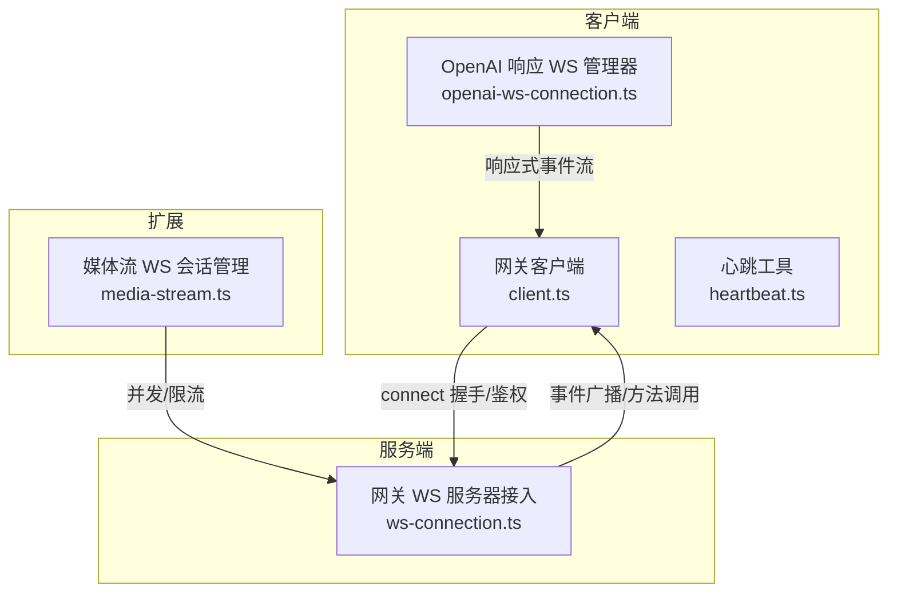
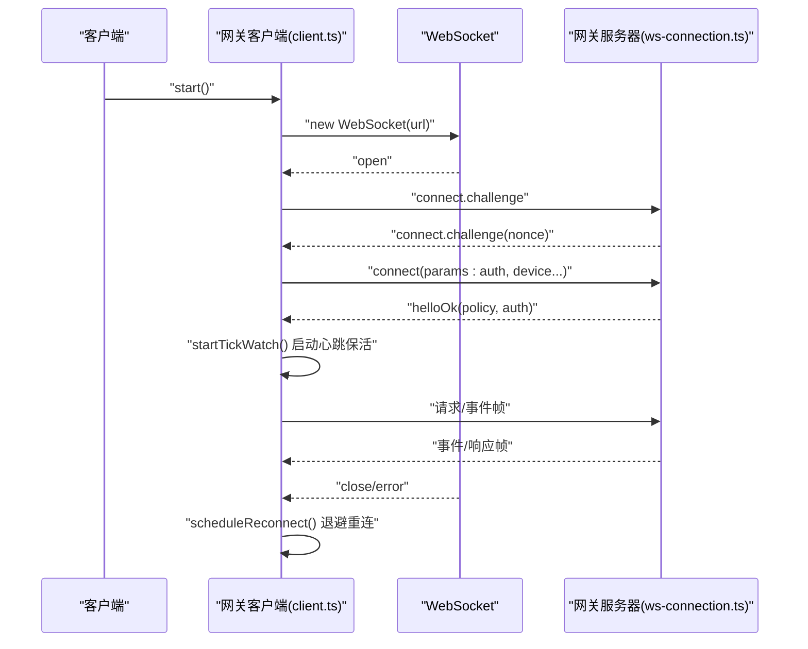
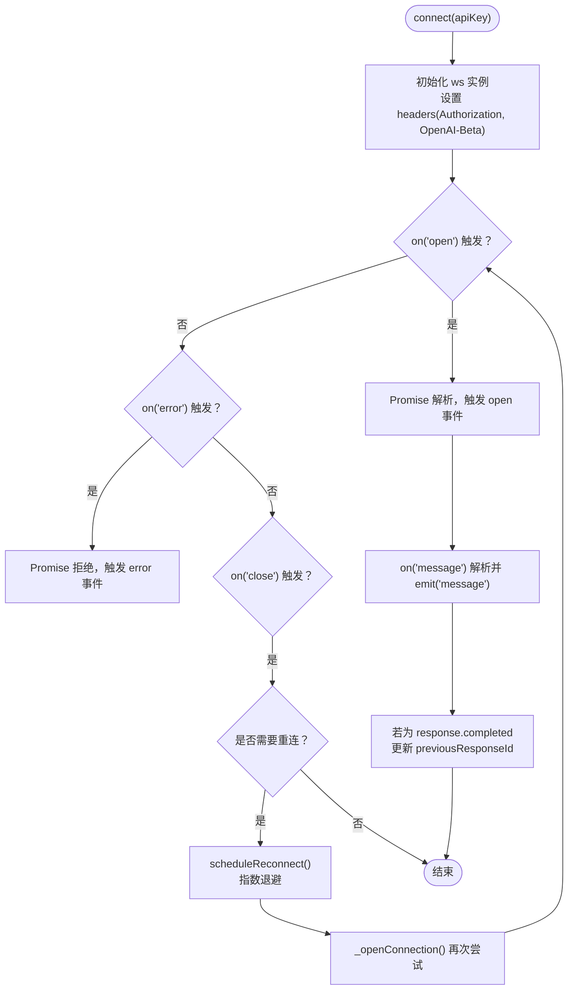
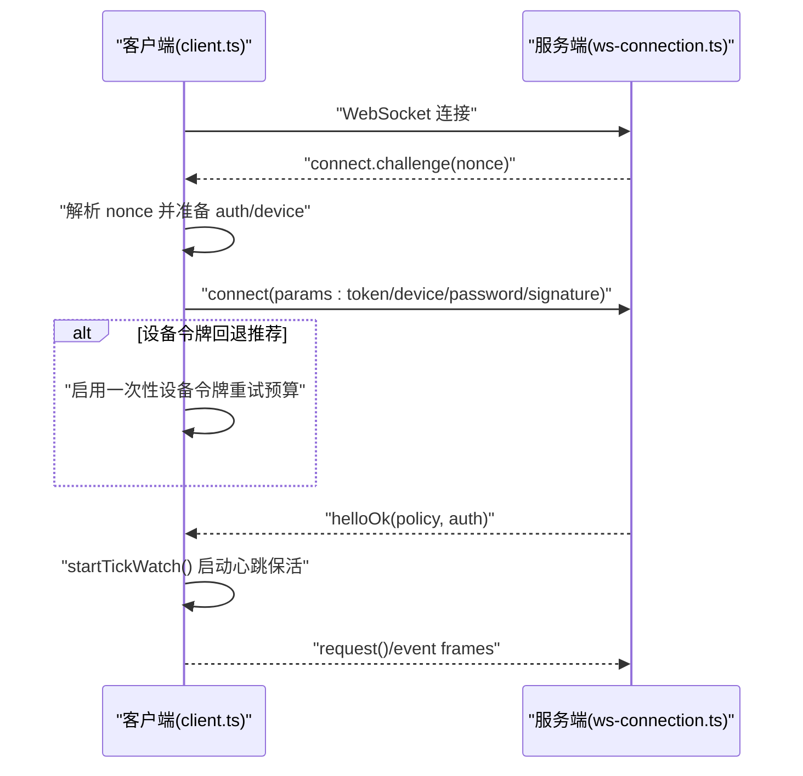
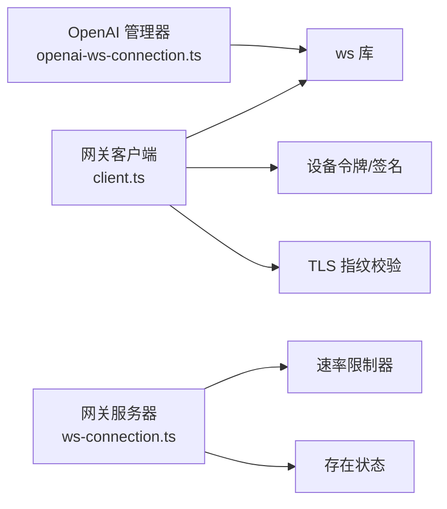

# 连接管理

<cite>
**本文引用的文件**
- [openai-ws-connection.ts](file://src/agents/openai-ws-connection.ts)
- [openai-ws-connection.test.ts](file://src/agents/openai-ws-connection.test.ts)
- [openai-ws-stream.ts](file://src/agents/openai-ws-stream.ts)
- [client.ts](file://src/gateway/client.ts)
- [connection-auth.ts](file://src/gateway/connection-auth.ts)
- [ws-connection.ts](file://src/gateway/server/ws-connection.ts)
- [heartbeat.ts](file://src/auto-reply/heartbeat.ts)
- [media-stream.ts](file://extensions/voice-call/src/media-stream.ts)
</cite>

## 目录

1. [简介](#简介)
2. [项目结构](#项目结构)
3. [核心组件](#核心组件)
4. [架构总览](#架构总览)
5. [详细组件分析](#详细组件分析)
6. [依赖关系分析](#依赖关系分析)
7. [性能考量](#性能考量)
8. [故障排查指南](#故障排查指南)
9. [结论](#结论)
10. [附录](#附录)

## 简介

本文件系统性梳理 OpenClaw 的 WebSocket 连接管理，覆盖以下主题：

- 连接建立流程与握手协议
- 认证机制（共享令牌、设备令牌、密码、设备签名）
- 连接状态管理与生命周期
- 心跳与保活机制
- 自动重连策略与退避算法
- 异常处理与错误恢复
- 连接池与并发控制
- 资源清理与安全校验

目标是帮助开发者在不同平台与场景下正确使用并扩展 WebSocket 连接能力。

## 项目结构

围绕 WebSocket 连接管理的关键模块分布如下：

- 客户端侧：OpenAI 响应 WebSocket 管理器、网关客户端（通用 WebSocket 客户端）、心跳工具
- 服务端侧：网关 WebSocket 服务器接入与握手、速率限制与安全校验
- 扩展侧：媒体流 WebSocket 会话管理（并发与限流）

**图表来源**

- [openai-ws-connection.ts:284-529](file://src/agents/openai-ws-connection.ts#L284-L529)
- [client.ts:109-674](file://src/gateway/client.ts#L109-L674)
- [ws-connection.ts:93-319](file://src/gateway/server/ws-connection.ts#L93-L319)
- [media-stream.ts:302-345](file://extensions/voice-call/src/media-stream.ts#L302-L345)

**章节来源**

- [openai-ws-connection.ts:1-529](file://src/agents/openai-ws-connection.ts#L1-L529)
- [client.ts:1-674](file://src/gateway/client.ts#L1-L674)
- [ws-connection.ts:1-319](file://src/gateway/server/ws-connection.ts#L1-L319)
- [heartbeat.ts:1-172](file://src/auto-reply/heartbeat.ts#L1-L172)
- [media-stream.ts:302-345](file://extensions/voice-call/src/media-stream.ts#L302-L345)

## 核心组件

- OpenAI 响应 WebSocket 管理器：负责与 OpenAI Responses API 建立持久连接、发送/接收事件、自动重连与错误上报。
- 网关客户端：通用 WebSocket 客户端，实现握手挑战、鉴权协商、设备令牌回退、心跳保活与重连退避。
- 网关服务器接入：统一处理连接接入、握手超时、速率限制、安全校验与关闭原因记录。
- 心跳工具：提供心跳提示词与去噪逻辑，避免无效心跳循环。
- 媒体会话管理：基于并发连接数与来源 IP 的限流与排队，防止过载。

**章节来源**

- [openai-ws-connection.ts:284-529](file://src/agents/openai-ws-connection.ts#L284-L529)
- [client.ts:109-674](file://src/gateway/client.ts#L109-L674)
- [ws-connection.ts:93-319](file://src/gateway/server/ws-connection.ts#L93-L319)
- [heartbeat.ts:1-172](file://src/auto-reply/heartbeat.ts#L1-L172)
- [media-stream.ts:302-345](file://extensions/voice-call/src/media-stream.ts#L302-L345)

## 架构总览

下图展示从客户端到服务端的典型交互路径，包括握手、鉴权、事件分发与保活。

**图表来源**

- [client.ts:134-251](file://src/gateway/client.ts#L134-L251)
- [client.ts:267-415](file://src/gateway/client.ts#L267-L415)
- [client.ts:596-618](file://src/gateway/client.ts#L596-L618)
- [ws-connection.ts:115-179](file://src/gateway/server/ws-connection.ts#L115-L179)
- [ws-connection.ts:207-265](file://src/gateway/server/ws-connection.ts#L207-L265)

## 详细组件分析

### OpenAI 响应 WebSocket 管理器

- 功能要点
  - 持久连接：通过构造函数注入可选 URL、最大重试次数与退避延迟数组。
  - 鉴权：在连接头中携带 Bearer Token 与特定 Beta 头。
  - 事件模型：定义完整的事件类型集合，支持增量响应、内容片段、函数调用参数等。
  - 发送/监听：提供 send() 与 onMessage()，内部对未打开状态进行保护。
  - 自动重连：在连接断开后按指数退避重连，最多重试固定次数。
  - 状态追踪：记录最近一次完成响应的 ID，用于后续多轮对话的上下文衔接。
  - 关闭与清理：显式 close() 取消定时器、移除监听并释放资源。

- 关键流程（连接与消息处理）

**图表来源**

- [openai-ws-connection.ts:320-428](file://src/agents/openai-ws-connection.ts#L320-L428)
- [openai-ws-connection.ts:430-455](file://src/agents/openai-ws-connection.ts#L430-L455)
- [openai-ws-connection.ts:472-512](file://src/agents/openai-ws-connection.ts#L472-L512)

- 参数与配置
  - URL：默认指向 OpenAI Responses API；可通过选项覆盖。
  - 最大重试：默认 5 次；可自定义。
  - 退避延迟：默认 1s/2s/4s/8s/16s；可自定义数组。
  - warmUp：预热连接，不生成输出，仅加载模型与工具。

- 生命周期与状态
  - isConnected()：判断当前是否处于 OPEN 状态。
  - previousResponseId：用于多轮对话的增量上下文。
  - close()：标记关闭、取消重连、清理监听并释放 socket。

- 测试验证点
  - 连接前 isConnected() 返回 false。
  - 正常连接后返回 true；关闭后返回 false。
  - 显式 close() 后断开网络不再触发重连。
  - 非预期断开按退避策略重连，实例数递增。

**章节来源**

- [openai-ws-connection.ts:251-303](file://src/agents/openai-ws-connection.ts#L251-L303)
- [openai-ws-connection.ts:315-371](file://src/agents/openai-ws-connection.ts#L315-L371)
- [openai-ws-connection.ts:375-428](file://src/agents/openai-ws-connection.ts#L375-L428)
- [openai-ws-connection.ts:430-455](file://src/agents/openai-ws-connection.ts#L430-L455)
- [openai-ws-connection.ts:472-512](file://src/agents/openai-ws-connection.ts#L472-L512)
- [openai-ws-connection.test.ts:407-488](file://src/agents/openai-ws-connection.test.ts#L407-L488)

### 网关客户端（通用 WebSocket 客户端）

- 功能要点
  - 安全约束：强制 wss:// 或允许受控的私有网络 ws://；TLS 指纹校验可选。
  - 握手挑战：等待服务端的 connect.challenge 并在超时后主动关闭。
  - 鉴权协商：支持共享令牌、设备令牌、密码与设备签名；支持“设备令牌回退”与“一次性重试预算”。
  - 错误细节码：根据服务端返回的错误详情码决定是否暂停重连或终止。
  - 心跳保活：周期性检查“tick”事件，超时则主动断开以避免静默卡死。
  - 请求/响应：基于 UUID 的请求帧，支持 expectFinal 标记；挂起队列按 id 维护。
  - 重连退避：指数退避上限至 30 秒；停止时清理定时器与挂起请求。

- 关键流程（握手与鉴权）

**图表来源**

- [client.ts:267-415](file://src/gateway/client.ts#L267-L415)
- [client.ts:417-444](file://src/gateway/client.ts#L417-L444)
- [client.ts:596-618](file://src/gateway/client.ts#L596-L618)
- [ws-connection.ts:174-179](file://src/gateway/server/ws-connection.ts#L174-L179)

- 认证与令牌处理
  - 优先级：显式令牌 > 存储的设备令牌 > 密码 > 设备签名。
  - 设备令牌回退：当服务端建议“retry_with_device_token”或返回特定错误码时，启用一次性预算并降低重连退避。
  - 清理策略：当设备令牌不匹配且无共享令牌/密码时，清理过期设备令牌缓存。

- TLS 与指纹校验
  - wss:// 场景下可配置指纹校验，确保证书指纹一致。
  - 不合规 URL 将被拒绝并触发 onConnectError。

- 心跳与保活
  - 服务端下发 policy.tickIntervalMs，客户端据此启动心跳监控。
  - 若超过两倍间隔未收到“tick”，主动断开以避免静默停滞。

**章节来源**

- [client.ts:134-251](file://src/gateway/client.ts#L134-L251)
- [client.ts:267-415](file://src/gateway/client.ts#L267-L415)
- [client.ts:417-444](file://src/gateway/client.ts#L417-L444)
- [client.ts:596-618](file://src/gateway/client.ts#L596-L618)
- [connection-auth.ts:28-66](file://src/gateway/connection-auth.ts#L28-L66)
- [ws-connection.ts:115-179](file://src/gateway/server/ws-connection.ts#L115-L179)

### 网关服务器接入与握手

- 功能要点
  - 统一接入：在 WebSocketServer 上注册 connection 事件，生成连接 ID、记录远端信息。
  - 握手挑战：向客户端发送 connect.challenge(nonce)，超时则关闭连接。
  - 客户端关闭：记录关闭原因、持续时间、最后帧元数据，并维护在线节点与存在状态。
  - 安全与日志：清洗头部字段、限制长度、记录详细上下文，便于审计与排障。

**章节来源**

- [ws-connection.ts:93-319](file://src/gateway/server/ws-connection.ts#L93-L319)

### 心跳机制与保活

- 心跳提示词与去噪
  - 提供默认心跳提示词与空内容判定，避免无效心跳循环。
  - 支持在回复中剥离心跳标记，控制是否跳过处理。

- 客户端心跳保活
  - 服务端周期性下发“tick”，客户端记录时间戳并在超阈值时断开。
  - 保活间隔由服务端策略决定，客户端最小间隔可配置。

**章节来源**

- [heartbeat.ts:1-172](file://src/auto-reply/heartbeat.ts#L1-L172)
- [client.ts:596-618](file://src/gateway/client.ts#L596-L618)

### 连接池与并发控制

- 媒体会话管理
  - 基于会话 SID 获取开放的 WebSocket，避免重复占用。
  - 按来源 IP 维护待处理连接计数，拒绝超过阈值的升级请求（429/503）。
  - 提供清理待处理连接的辅助逻辑，避免悬挂状态。

**章节来源**

- [media-stream.ts:302-345](file://extensions/voice-call/src/media-stream.ts#L302-L345)

### 连接生命周期与资源清理

- 客户端侧
  - stop/close：清理定时器、挂起请求、移除监听、关闭 socket。
  - flushPendingErrors：统一拒绝所有挂起请求，避免悬挂。
  - scheduleReconnect：指数退避上限与幂等调度。

- 服务端侧
  - close：清理握手定时器、从在线集合移除、记录关闭原因与上下文。
  - 节点注销：当连接角色为 node 时，执行节点反注册与订阅清理。

**章节来源**

- [client.ts:253-265](file://src/gateway/client.ts#L253-L265)
- [client.ts:589-594](file://src/gateway/client.ts#L589-L594)
- [client.ts:576-587](file://src/gateway/client.ts#L576-L587)
- [ws-connection.ts:181-195](file://src/gateway/server/ws-connection.ts#L181-L195)
- [ws-connection.ts:207-265](file://src/gateway/server/ws-connection.ts#L207-L265)

## 依赖关系分析

- 组件耦合
  - OpenAI 管理器与网关客户端均依赖 ws 库与 Node EventEmitter。
  - 网关客户端依赖设备身份、设备令牌存储与 TLS 指纹校验工具。
  - 服务器接入依赖速率限制器、存在状态与 Canvas Host 解析。

- 外部依赖与集成点
  - OpenAI Responses API：事件类型与响应模型。
  - 网关协议：connect/challenge、helloOk、请求/响应帧格式。
  - TLS 与指纹：wss:// 与 checkServerIdentity 校验。

**图表来源**

- [openai-ws-connection.ts:16-17](file://src/agents/openai-ws-connection.ts#L16-L17)
- [client.ts:2-25](file://src/gateway/client.ts#L2-L25)
- [ws-connection.ts:9-16](file://src/gateway/server/ws-connection.ts#L9-L16)

**章节来源**

- [openai-ws-connection.ts:16-17](file://src/agents/openai-ws-connection.ts#L16-L17)
- [client.ts:2-25](file://src/gateway/client.ts#L2-L25)
- [ws-connection.ts:9-16](file://src/gateway/server/ws-connection.ts#L9-L16)

## 性能考量

- 退避策略
  - 客户端与网关客户端均采用指数退避，上限控制在合理范围，避免风暴。
- 心跳保活
  - 通过“tick”事件检测静默停滞，及时断开避免资源浪费。
- 资源清理
  - 显式 close() 与 stop() 清理定时器与挂起请求，防止内存泄漏。
- 并发控制
  - 媒体会话按来源 IP 限流，避免过载导致的级联失败。

[本节为通用指导，无需具体文件分析]

## 故障排查指南

- 常见错误与定位
  - 握手超时：检查服务端是否正确下发 connect.challenge，确认客户端超时阈值。
  - 认证失败：区分共享令牌缺失、密码不匹配、速率限制、配对要求等，依据错误详情码决定是否暂停重连。
  - 设备令牌不匹配：在无共享凭据时清理过期设备令牌，避免循环重试。
  - TLS 指纹不匹配：确认 wss:// 与指纹配置一致。
  - 静默停滞：检查心跳保活是否正常，超过两倍间隔未收到“tick”将主动断开。

- 排查步骤
  - 查看 onConnectError/onClose 回调中的错误信息与关闭码描述。
  - 检查重连是否被暂停（如因认证错误详情码）。
  - 使用日志子系统定位握手阶段与消息阶段的问题。
  - 对媒体流场景，检查待处理连接计数与来源 IP 限流。

**章节来源**

- [client.ts:105-107](file://src/gateway/client.ts#L105-L107)
- [client.ts:211-244](file://src/gateway/client.ts#L211-L244)
- [client.ts:417-444](file://src/gateway/client.ts#L417-L444)
- [client.ts:620-645](file://src/gateway/client.ts#L620-L645)
- [ws-connection.ts:207-265](file://src/gateway/server/ws-connection.ts#L207-L265)

## 结论

OpenClaw 的 WebSocket 连接管理在客户端与服务端两端均实现了完善的握手、鉴权、保活与重连机制。通过事件驱动与退避策略，系统能够在网络波动与认证异常情况下保持稳健运行。配合速率限制、指纹校验与资源清理，整体具备良好的安全性与可维护性。建议在生产环境中：

- 明确区分共享令牌与设备令牌的使用场景与回退策略。
- 合理配置心跳保活与退避上限，避免过度重连。
- 在媒体流等高并发场景下启用来源 IP 限流与会话复用。

[本节为总结，无需具体文件分析]

## 附录

### 连接建立与认证示例（步骤说明）

- 准备参数
  - 客户端：URL、令牌（可选）、设备身份（可选）、模式与权限等。
  - 服务端：鉴权策略、速率限制、Canvas Host 配置。
- 建立连接
  - 客户端发起 WebSocket 连接，等待服务端下发 connect.challenge。
  - 客户端解析 nonce，组装 connect 请求（含 auth 与 device 信息）。
  - 服务端校验并通过 helloOk 返回策略与鉴权结果。
- 初始化与保活
  - 客户端启动心跳保活，按策略周期检查“tick”。
  - 双方可通过请求/事件帧进行业务交互。
- 状态同步
  - 服务端维护在线集合、存在状态与节点注册，客户端按需上报角色与能力。

**章节来源**

- [client.ts:134-251](file://src/gateway/client.ts#L134-L251)
- [client.ts:267-415](file://src/gateway/client.ts#L267-L415)
- [ws-connection.ts:115-179](file://src/gateway/server/ws-connection.ts#L115-L179)

### 心跳与保活配置要点

- 服务端策略：通过 helloOk 中的 policy.tickIntervalMs 下发心跳间隔。
- 客户端最小间隔：可配置最小心跳间隔，避免过于频繁。
- 超时断开：超过两倍间隔未收到“tick”主动断开。

**章节来源**

- [client.ts:384-389](file://src/gateway/client.ts#L384-L389)
- [client.ts:600-618](file://src/gateway/client.ts#L600-L618)

### 重连策略与退避

- 默认退避：1s/2s/4s/8s/16s（最多 5 次），适用于 OpenAI 管理器。
- 网关客户端：指数退避上限 30s，结合错误详情码决定是否暂停重连。

**章节来源**

- [openai-ws-connection.ts:247-249](file://src/agents/openai-ws-connection.ts#L247-L249)
- [openai-ws-connection.ts:430-455](file://src/agents/openai-ws-connection.ts#L430-L455)
- [client.ts:576-587](file://src/gateway/client.ts#L576-L587)
- [client.ts:417-444](file://src/gateway/client.ts#L417-L444)

### 连接池与并发限制

- 媒体会话：按会话 SID 获取开放连接，避免重复占用。
- 来源 IP 限流：统计每 IP 待处理连接数，超过阈值拒绝升级请求。

**章节来源**

- [media-stream.ts:302-345](file://extensions/voice-call/src/media-stream.ts#L302-L345)
