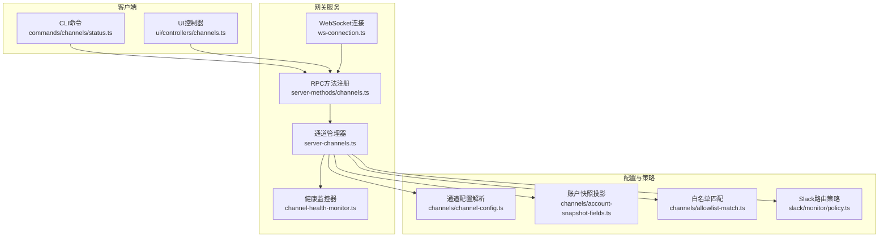
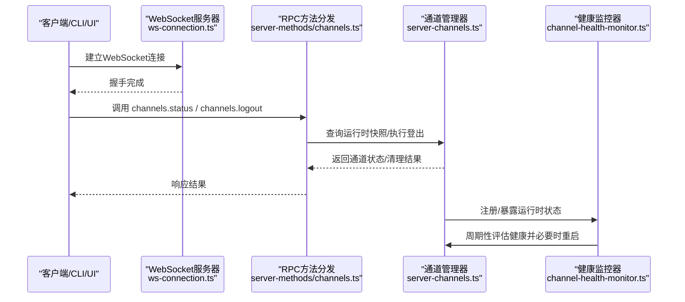
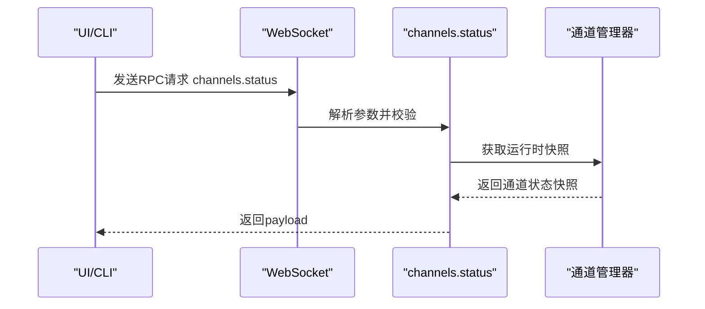
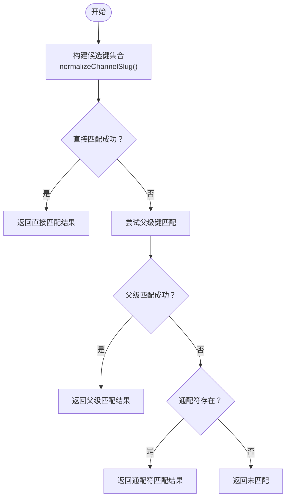
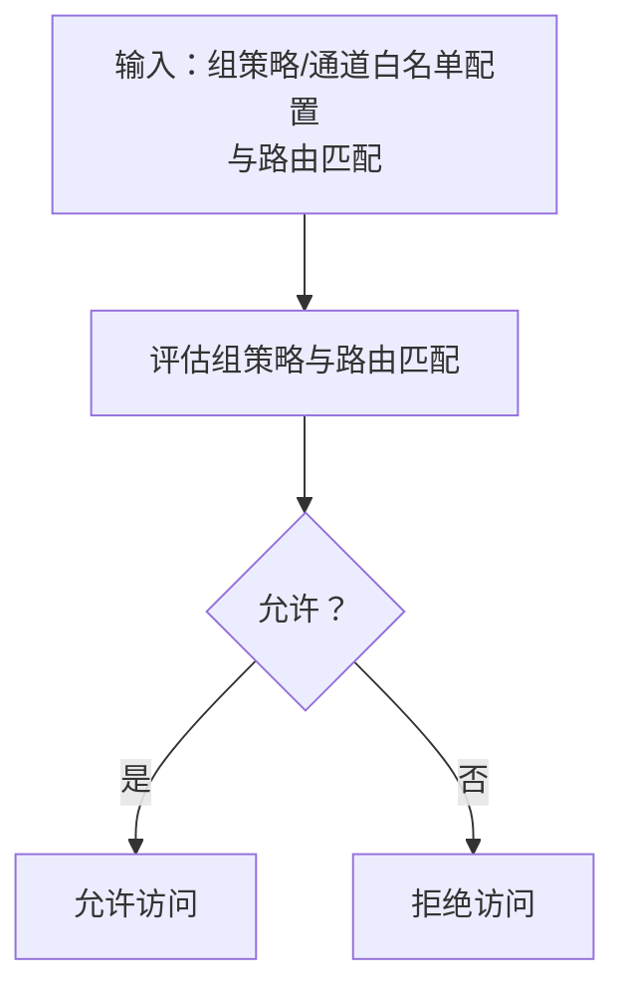
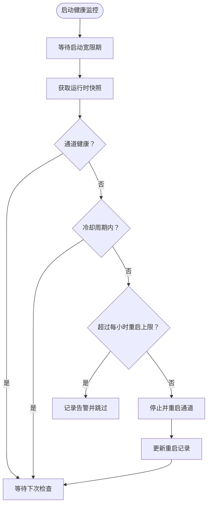
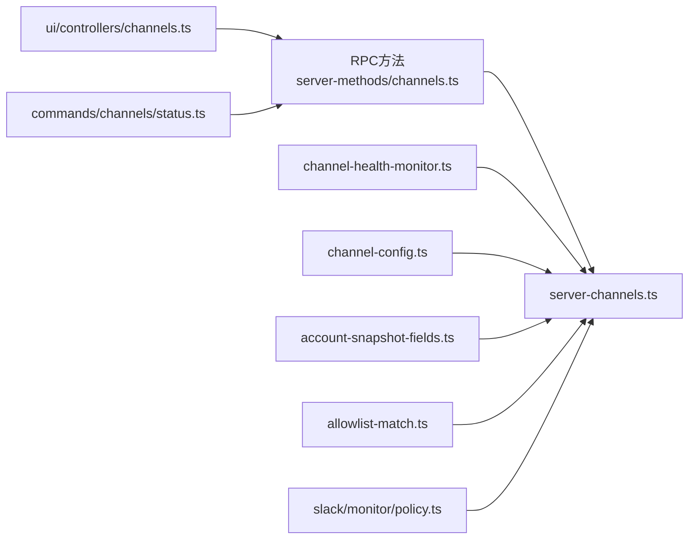

# 通道管理API

<cite>
**本文引用的文件**
- [server-channels.ts](file://src/gateway/server-channels.ts)
- [channels.ts](file://src/gateway/server-methods/channels.ts)
- [server.channels.test.ts](file://src/gateway/server.channels.test.ts)
- [channel-health-monitor.ts](file://src/gateway/channel-health-monitor.ts)
- [account-snapshot-fields.ts](file://src/channels/account-snapshot-fields.ts)
- [channel-config.ts](file://src/channels/channel-config.ts)
- [allowlist-match.ts](file://src/channels/allowlist-match.ts)
- [policy.ts](file://src/slack/monitor/policy.ts)
- [HealthStore.swift](file://apps/macos/Sources/OpenClaw/HealthStore.swift)
- [configuration.md](file://docs/zh-CN/gateway/configuration.md)
- [ws-connection.ts](file://src/gateway/server/ws-connection.ts)
- [channels.ts](file://src/gateway/protocol/schema/channels.ts)
- [channels.ts](file://src/channels/plugins/channel-config.ts)
- [channels.ts](file://src/channels/plugins/config-schema.ts)
- [channels.ts](file://src/channels/plugins/config-helpers.ts)
- [channels.ts](file://src/channels/plugins/config-writes.ts)
- [channels.ts](file://src/channels/plugins/directory-config.ts)
- [channels.ts](file://src/channels/plugins/directory-config-helpers.ts)
- [channels.ts](file://src/channels/plugins/group-mentions.ts)
- [channels.ts](file://src/channels/plugins/group-policy-warnings.ts)
- [channels.ts](file://src/channels/plugins/allowlist-match.ts)
- [channels.ts](file://src/channels/plugins/account-helpers.ts)
- [channels.ts](file://src/channels/plugins/account-action-gate.ts)
- [channels.ts](file://src/channels/plugins/catalog.ts)
- [channels.ts](file://src/channels/plugins/bluebubbles-actions.ts)
- [channels.ts](file://src/channels/plugins/onboarding/signal.ts)
- [channels.ts](file://src/commands/channels/status.ts)
- [channels.ts](file://src/commands/status-all.ts)
- [channels.ts](file://src/commands/status.scan.ts)
- [channels.ts](file://src/commands/doctor-gateway-health.ts)
- [channels.ts](file://src/gateway/method-scopes.ts)
- [channels.ts](file://ui/src/ui/controllers/channels.ts)
</cite>

## 目录

1. [简介](#简介)
2. [项目结构](#项目结构)
3. [核心组件](#核心组件)
4. [架构总览](#架构总览)
5. [详细组件分析](#详细组件分析)
6. [依赖关系分析](#依赖关系分析)
7. [性能考量](#性能考量)
8. [故障排查指南](#故障排查指南)
9. [结论](#结论)
10. [附录：操作示例与最佳实践](#附录操作示例与最佳实践)

## 简介

本文件系统性地文档化 OpenClaw 的“通道管理API”，聚焦于多平台消息通道的 WebSocket 接口，覆盖通道注册、配置管理、状态监控、认证与权限控制、消息路由规则、健康检查与故障转移、以及性能优化策略。文档同时区分各平台通道的特定接口与通用接口，提供可操作的示例路径与排障建议。

## 项目结构

围绕通道管理API的关键目录与文件如下：

- 网关层（WebSocket与RPC方法）
  - 服务器通道管理：[server-channels.ts](file://src/gateway/server-channels.ts)
  - 通道RPC方法定义与实现：[channels.ts](file://src/gateway/server-methods/channels.ts)
  - WebSocket连接与升级处理：[ws-connection.ts](file://src/gateway/server/ws-connection.ts)
  - 协议模式与通道相关字段：[channels.ts](file://src/gateway/protocol/schema/channels.ts)
  - 方法作用域与鉴权边界：[channels.ts](file://src/gateway/method-scopes.ts)
- 健康监控与自动重启
  - 健康监控器：[channel-health-monitor.ts](file://src/gateway/channel-health-monitor.ts)
  - 客户端侧健康快照解析（macOS）：[HealthStore.swift](file://apps/macos/Sources/OpenClaw/HealthStore.swift)
- 配置与匹配
  - 账户快照字段投影：[account-snapshot-fields.ts](file://src/channels/account-snapshot-fields.ts)
  - 通道配置解析与键匹配：[channel-config.ts](file://src/channels/channel-config.ts)
  - 白名单匹配算法：[allowlist-match.ts](file://src/channels/allowlist-match.ts)
  - 平台策略集成（Slack）：[policy.ts](file://src/slack/monitor/policy.ts)
- 文档与CLI参考
  - 网关配置文档（含Web渠道与心跳）：[configuration.md](file://docs/zh-CN/gateway/configuration.md)
  - CLI状态查询与诊断命令：[channels.ts](file://src/commands/channels/status.ts)、[channels.ts](file://src/commands/status-all.ts)、[channels.ts](file://src/commands/status.scan.ts)、[channels.ts](file://src/commands/doctor-gateway-health.ts)
  - UI控制器调用通道API：[channels.ts](file://ui/src/ui/controllers/channels.ts)

图表来源

- [ws-connection.ts:115-139](file://src/gateway/server/ws-connection.ts#L115-L139)
- [channels.ts:69-254](file://src/gateway/server-methods/channels.ts#L69-L254)
- [server-channels.ts](file://src/gateway/server-channels.ts)
- [channel-health-monitor.ts:76-201](file://src/gateway/channel-health-monitor.ts#L76-L201)
- [channel-config.ts:60-164](file://src/channels/channel-config.ts#L60-L164)
- [account-snapshot-fields.ts:175-218](file://src/channels/account-snapshot-fields.ts#L175-L218)
- [allowlist-match.ts:63-103](file://src/channels/allowlist-match.ts#L63-L103)
- [policy.ts:1-13](file://src/slack/monitor/policy.ts#L1-L13)

章节来源

- [ws-connection.ts:115-139](file://src/gateway/server/ws-connection.ts#L115-L139)
- [channels.ts:69-254](file://src/gateway/server-methods/channels.ts#L69-L254)
- [server-channels.ts](file://src/gateway/server-channels.ts)
- [channel-health-monitor.ts:76-201](file://src/gateway/channel-health-monitor.ts#L76-L201)
- [channel-config.ts:60-164](file://src/channels/channel-config.ts#L60-L164)
- [account-snapshot-fields.ts:175-218](file://src/channels/account-snapshot-fields.ts#L175-L218)
- [allowlist-match.ts:63-103](file://src/channels/allowlist-match.ts#L63-L103)
- [policy.ts:1-13](file://src/slack/monitor/policy.ts#L1-L13)

## 核心组件

- 通道RPC方法
  - channels.status：获取通道状态快照，支持可选探针执行与超时参数。
  - channels.logout：按通道清理会话或令牌，返回是否清理成功与通道标识。
- 通道管理器
  - 提供运行时快照、启动/停止通道、手动停止状态判定等能力，被健康监控器依赖。
- 健康监控器
  - 周期性评估通道健康，触发重启并带冷却与限速保护。
- 配置与匹配
  - 通道键匹配、规范化、通配符与父级回退；白名单匹配；凭据状态投影；Slack路由策略。
- WebSocket与协议
  - WebSocket连接建立、请求/响应帧处理、通道相关schema定义。

章节来源

- [channels.ts:69-254](file://src/gateway/server-methods/channels.ts#L69-L254)
- [server-channels.ts](file://src/gateway/server-channels.ts)
- [channel-health-monitor.ts:76-201](file://src/gateway/channel-health-monitor.ts#L76-L201)
- [channel-config.ts:60-164](file://src/channels/channel-config.ts#L60-L164)
- [account-snapshot-fields.ts:175-218](file://src/channels/account-snapshot-fields.ts#L175-L218)
- [allowlist-match.ts:63-103](file://src/channels/allowlist-match.ts#L63-L103)
- [policy.ts:1-13](file://src/slack/monitor/policy.ts#L1-L13)
- [channels.ts:102-102](file://src/gateway/protocol/schema/channels.ts#L102-L102)

## 架构总览

下图展示从客户端到网关、通道管理器与健康监控器的整体交互流程，以及配置与权限策略的参与点。

图表来源

- [ws-connection.ts:115-139](file://src/gateway/server/ws-connection.ts#L115-L139)
- [channels.ts:69-254](file://src/gateway/server-methods/channels.ts#L69-L254)
- [server-channels.ts](file://src/gateway/server-channels.ts)
- [channel-health-monitor.ts:76-201](file://src/gateway/channel-health-monitor.ts#L76-L201)

## 详细组件分析

### 组件A：通道RPC方法与WebSocket接口

- channels.status
  - 参数：probe（是否执行探针）、timeoutMs（超时毫秒数）、channelIds（可选筛选）。
  - 行为：返回通道维度的状态快照，包含配置状态、令牌来源、探针结果与最后探针时间等；若未启用探针则不执行探测。
  - 测试验证：在无环境令牌时，Telegram等通道的配置状态与令牌来源符合预期；禁用探针时探针字段为空。
- channels.logout
  - 参数：channel（通道标识）。
  - 行为：尝试清理指定通道的会话或令牌；若不存在会话则报告未清理；对Telegram等通道可从配置中清除botToken并保留其他组规则。
  - 测试验证：缺失会话时返回未清理；清理Telegram botToken后配置快照中对应字段消失。

图表来源

- [channels.ts:69-120](file://src/gateway/server-methods/channels.ts#L69-L120)
- [server-channels.ts](file://src/gateway/server-channels.ts)
- [server.channels.test.ts:106-132](file://src/gateway/server.channels.test.ts#L106-L132)

章节来源

- [channels.ts:69-120](file://src/gateway/server-methods/channels.ts#L69-L120)
- [server.channels.test.ts:106-132](file://src/gateway/server.channels.test.ts#L106-L132)
- [channels.ts:236-269](file://src/gateway/server-methods/channels.ts#L236-L269)
- [server.channels.test.ts:134-170](file://src/gateway/server.channels.test.ts#L134-L170)

### 组件B：通道配置管理与匹配

- 键匹配与规范化
  - 支持直接匹配、父级回退、通配符、大小写与空白规范化，确保配置键稳定且可扩展。
- 凭据状态投影
  - 将运行时凭据状态安全地投影到只读快照，避免泄露敏感值；支持多种令牌状态枚举。
- 白名单匹配
  - 编译允许列表，支持通配符；按ID、名称等候选进行匹配并返回命中来源。

图表来源

- [channel-config.ts:60-164](file://src/channels/channel-config.ts#L60-L164)

章节来源

- [channel-config.ts:60-164](file://src/channels/channel-config.ts#L60-L164)
- [account-snapshot-fields.ts:175-218](file://src/channels/account-snapshot-fields.ts#L175-L218)
- [allowlist-match.ts:63-103](file://src/channels/allowlist-match.ts#L63-L103)

### 组件C：权限管理与消息路由规则

- 默认受限策略
  - 若未显式配置模式，默认采用受限模式，确保安全基线。
- Slack路由策略
  - 结合组策略（开放/禁用/白名单）与通道白名单配置，统一评估路由访问许可。
- 允许来源匹配
  - 支持ID/名称等候选匹配，可选择开启名称匹配；返回命中来源以辅助审计。

图表来源

- [policy.ts:1-13](file://src/slack/monitor/policy.ts#L1-L13)
- [allowlist-match.ts:63-103](file://src/channels/allowlist-match.ts#L63-L103)

章节来源

- [policy.ts:1-13](file://src/slack/monitor/policy.ts#L1-L13)
- [allowlist-match.ts:63-103](file://src/channels/allowlist-match.ts#L63-L103)

### 组件D：通道健康检查、故障转移与自动重启

- 健康评估指标
  - 连接建立宽限期、事件停滞阈值、探针失败与超时识别。
- 自动重启策略
  - 冷却周期限制、每小时重启次数上限、重启记录清理与重试保护。
- 故障转移
  - 客户端侧根据健康快照选择已链接通道作为首选，否则选择健康通道作为后备。

图表来源

- [channel-health-monitor.ts:76-201](file://src/gateway/channel-health-monitor.ts#L76-L201)
- [HealthStore.swift:147-195](file://apps/macos/Sources/OpenClaw/HealthStore.swift#L147-L195)

章节来源

- [channel-health-monitor.ts:76-201](file://src/gateway/channel-health-monitor.ts#L76-L201)
- [HealthStore.swift:147-195](file://apps/macos/Sources/OpenClaw/HealthStore.swift#L147-L195)

## 依赖关系分析

- 方法到实现
  - channels.status → server-methods/channels.ts → server-channels.ts
  - channels.logout → server-methods/channels.ts → server-channels.ts
- 监控依赖
  - channel-health-monitor.ts 依赖 server-channels.ts 的运行时快照与启停接口。
- 配置与策略
  - 通道配置解析与白名单匹配贯穿于状态投影与路由决策。
- 协议与UI/CLI
  - 协议schema定义通道字段；CLI与UI通过RPC调用通道API。

图表来源

- [channels.ts:69-254](file://src/gateway/server-methods/channels.ts#L69-L254)
- [server-channels.ts](file://src/gateway/server-channels.ts)
- [channel-health-monitor.ts:76-201](file://src/gateway/channel-health-monitor.ts#L76-L201)
- [channel-config.ts:60-164](file://src/channels/channel-config.ts#L60-L164)
- [account-snapshot-fields.ts:175-218](file://src/channels/account-snapshot-fields.ts#L175-L218)
- [allowlist-match.ts:63-103](file://src/channels/allowlist-match.ts#L63-L103)
- [policy.ts:1-13](file://src/slack/monitor/policy.ts#L1-L13)
- [channels.ts:15-15](file://ui/src/ui/controllers/channels.ts#L15-L15)
- [channels.ts:297-297](file://src/commands/channels/status.ts#L297-L297)

章节来源

- [channels.ts:69-254](file://src/gateway/server-methods/channels.ts#L69-L254)
- [server-channels.ts](file://src/gateway/server-channels.ts)
- [channel-health-monitor.ts:76-201](file://src/gateway/channel-health-monitor.ts#L76-L201)
- [channel-config.ts:60-164](file://src/channels/channel-config.ts#L60-L164)
- [account-snapshot-fields.ts:175-218](file://src/channels/account-snapshot-fields.ts#L175-L218)
- [allowlist-match.ts:63-103](file://src/channels/allowlist-match.ts#L63-L103)
- [policy.ts:1-13](file://src/slack/monitor/policy.ts#L1-L13)
- [channels.ts:15-15](file://ui/src/ui/controllers/channels.ts#L15-L15)
- [channels.ts:297-297](file://src/commands/channels/status.ts#L297-L297)

## 性能考量

- WebSocket生命周期与连接管理
  - 启用Web渠道运行时与WebSocket生命周期行为可提升交互体验，但未使用时建议保持关闭以减少连接管理开销。
- 健康监控频率与阈值
  - 周期性检查间隔、启动宽限期、事件停滞阈值等参数可调，平衡稳定性与资源占用。
- 探针与超时
  - channels.status 支持超时参数，避免长时间阻塞；探针执行可按需开启。
- 平台特定配置
  - 如WhatsApp Web渠道的心跳与重连策略，可在配置中精细调整以适配网络环境。

章节来源

- [configuration.md:1012-1031](file://docs/zh-CN/gateway/configuration.md#L1012-L1031)
- [channel-health-monitor.ts:26-74](file://src/gateway/channel-health-monitor.ts#L26-L74)
- [channels.ts:69-120](file://src/gateway/server-methods/channels.ts#L69-L120)

## 故障排查指南

- 状态查询异常
  - 使用 channels.status 检查通道配置状态与令牌来源；若探针失败，关注错误信息与耗时。
- 登出后残留问题
  - channels.logout 失败通常表示无会话；对Telegram等通道清理botToken后需确认配置快照。
- 健康监控告警
  - 观察重启频率与冷却限制；若频繁重启，检查网络波动、平台限流与配置参数。
- 客户端侧健康判断
  - macOS端根据健康快照选择首选通道，并对超时与未知状态进行描述性提示。

章节来源

- [server.channels.test.ts:106-170](file://src/gateway/server.channels.test.ts#L106-L170)
- [channel-health-monitor.ts:146-151](file://src/gateway/channel-health-monitor.ts#L146-L151)
- [HealthStore.swift:153-163](file://apps/macos/Sources/OpenClaw/HealthStore.swift#L153-L163)

## 结论

OpenClaw 的通道管理API通过清晰的RPC方法、稳健的配置与匹配机制、严格的权限与路由策略，以及完善的健康监控与自动重启体系，实现了跨平台消息通道的统一管理。WebSocket接口提供了稳定的控制面入口，配合CLI与UI工具，便于运维与开发人员进行通道注册、配置更新、状态查询与故障排查。

## 附录：操作示例与最佳实践

- 通道状态查询
  - 示例路径：[channels.ts:297-297](file://src/commands/channels/status.ts#L297-L297)
  - 说明：通过CLI调用 channels.status，可选择开启探针与设置超时，用于快速诊断。
- 清理会话/令牌
  - 示例路径：[server.channels.test.ts:134-170](file://src/gateway/server.channels.test.ts#L134-L170)
  - 说明：针对特定通道执行 channels.logout，观察清理结果与配置快照变化。
- 健康监控与自动重启
  - 示例路径：[channel-health-monitor.ts:76-201](file://src/gateway/channel-health-monitor.ts#L76-L201)
  - 说明：合理设置检查间隔、冷却周期与重启上限，避免雪崩效应。
- 权限与路由
  - 示例路径：[policy.ts:1-13](file://src/slack/monitor/policy.ts#L1-L13)、[allowlist-match.ts:63-103](file://src/channels/allowlist-match.ts#L63-L103)
  - 说明：默认受限策略，结合组策略与白名单实现细粒度路由控制。
- UI集成
  - 示例路径：[channels.ts:15-15](file://ui/src/ui/controllers/channels.ts#L15-L15)
  - 说明：UI通过RPC调用通道API，实现可视化状态与操作。

章节来源

- [channels.ts:297-297](file://src/commands/channels/status.ts#L297-L297)
- [server.channels.test.ts:134-170](file://src/gateway/server.channels.test.ts#L134-L170)
- [channel-health-monitor.ts:76-201](file://src/gateway/channel-health-monitor.ts#L76-L201)
- [policy.ts:1-13](file://src/slack/monitor/policy.ts#L1-L13)
- [allowlist-match.ts:63-103](file://src/channels/allowlist-match.ts#L63-L103)
- [channels.ts:15-15](file://ui/src/ui/controllers/channels.ts#L15-L15)
