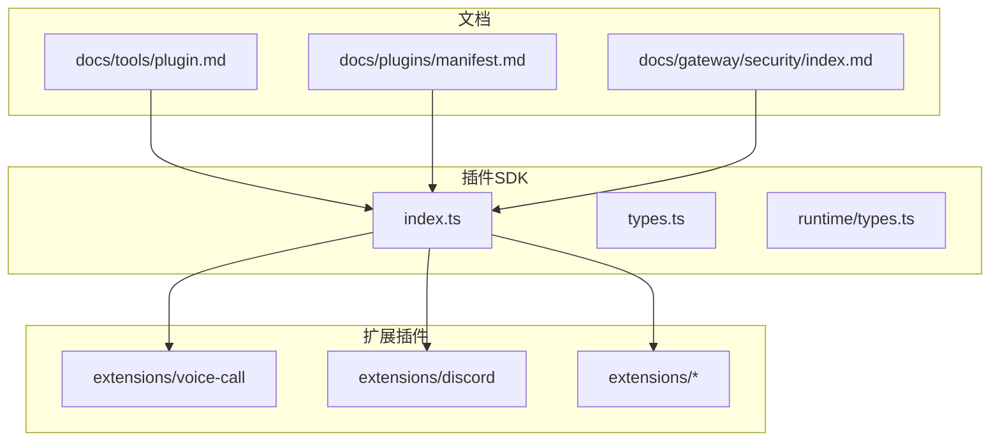
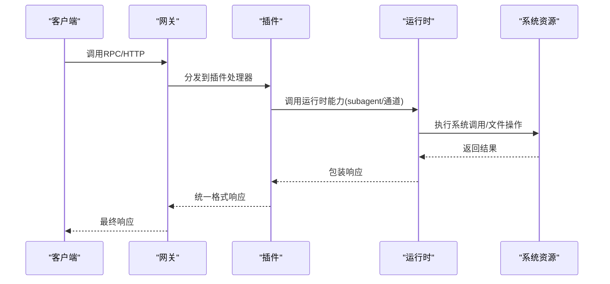
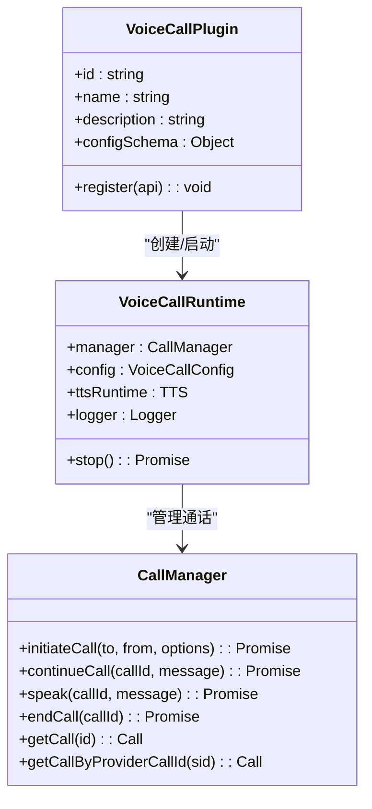
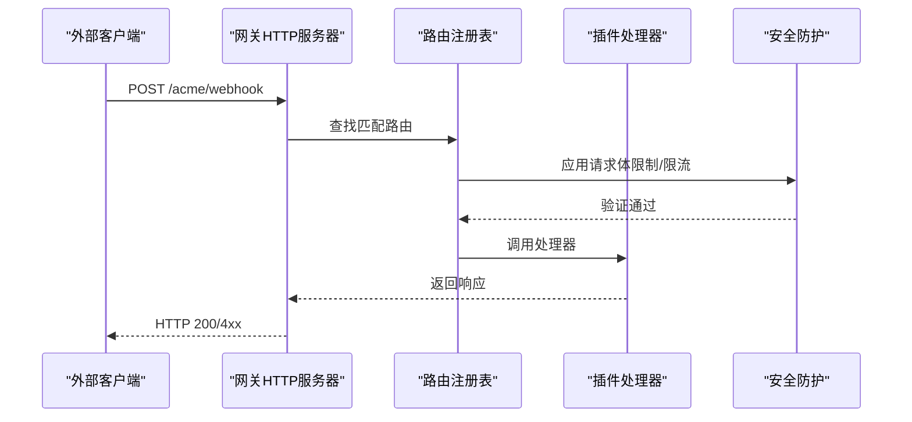
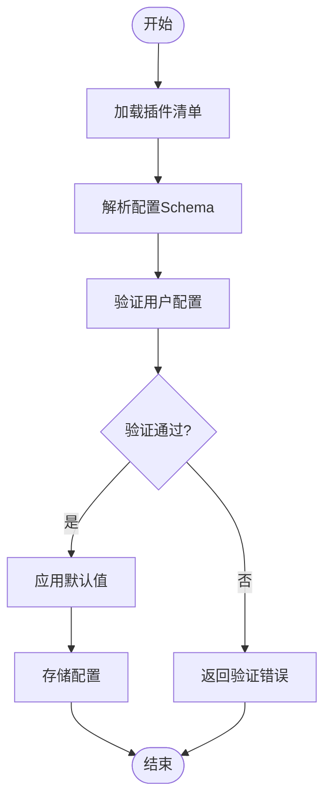
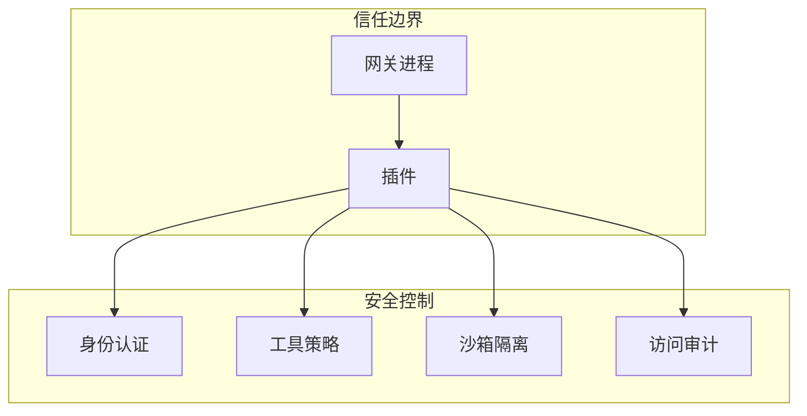
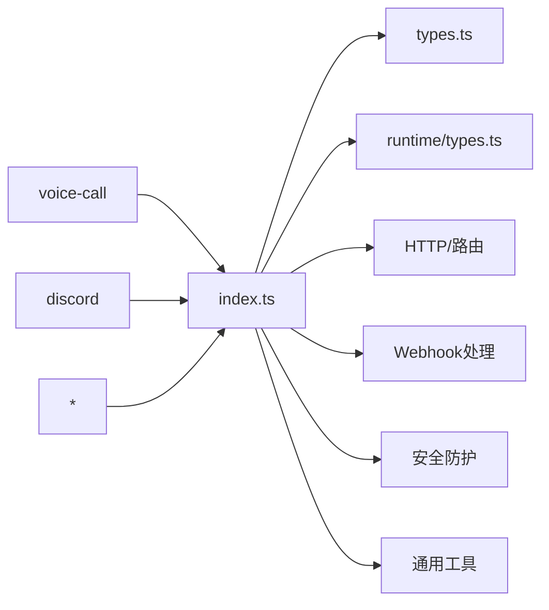

# 工具插件开发

<cite>
**本文引用的文件**
- [插件SDK入口](file://src/plugin-sdk/index.ts)
- [插件类型定义](file://src/plugins/types.ts)
- [插件运行时类型](file://src/plugins/runtime/types.ts)
- [插件开发指南](file://docs/tools/plugin.md)
- [插件清单规范](file://docs/plugins/manifest.md)
- [语音通话插件实现](file://extensions/voice-call/index.ts)
- [语音通话插件清单](file://extensions/voice-call/openclaw.plugin.json)
- [Discord频道插件入口](file://extensions/discord/index.ts)
- [网关安全指南](file://docs/gateway/security/index.md)
- [安全总览](file://docs/security/README.md)
</cite>

## 目录

1. [简介](#简介)
2. [项目结构](#项目结构)
3. [核心组件](#核心组件)
4. [架构概览](#架构概览)
5. [详细组件分析](#详细组件分析)
6. [依赖关系分析](#依赖关系分析)
7. [性能考虑](#性能考虑)
8. [故障排除指南](#故障排除指南)
9. [结论](#结论)
10. [附录](#附录)

## 简介

本指南面向OpenClaw工具插件开发者，系统阐述插件接口定义、调用机制、执行流程与安全限制。文档基于仓库中的实际代码实现，涵盖HTTP请求处理、文件操作、系统调用、配置管理、错误重试与超时处理、插件生命周期管理以及测试策略与性能监控方法。

## 项目结构

OpenClaw采用模块化设计，插件体系通过统一的SDK入口暴露能力，并在不同子域（如Discord、Telegram等）提供专用适配器。核心目录结构如下：

- `src/plugin-sdk/`：插件SDK入口与通用工具集
- `src/plugins/`：插件运行时与类型定义
- `extensions/`：官方扩展插件实现
- `docs/`：插件开发与安全指南文档

**图表来源**

- [插件SDK入口:1-826](file://src/plugin-sdk/index.ts#L1-L826)
- [插件类型定义:1-893](file://src/plugins/types.ts#L1-L893)
- [插件运行时类型:1-64](file://src/plugins/runtime/types.ts#L1-L64)

**章节来源**

- [插件SDK入口:1-826](file://src/plugin-sdk/index.ts#L1-L826)
- [插件类型定义:1-893](file://src/plugins/types.ts#L1-L893)
- [插件运行时类型:1-64](file://src/plugins/runtime/types.ts#L1-L64)

## 核心组件

本节梳理插件开发所需的核心接口与运行时能力，包括插件API、工具工厂、HTTP路由注册、命令行集成、服务生命周期与钩子系统。

- 插件API接口
  - 提供工具注册、HTTP路由注册、命令注册、服务注册、上下文引擎注册等能力
  - 支持插件钩子注册与生命周期事件监听
  - 提供路径解析、日志记录等辅助能力

- 工具工厂与参数校验
  - 工具工厂接收上下文参数，返回工具实例或数组
  - 参数校验通过TypeBox等Schema进行严格约束

- HTTP路由与Webhook
  - 支持精确匹配与前缀匹配两种路由模式
  - 提供Webhook目标解析、认证与防护机制

- 运行时能力
  - 子代理运行、等待与会话消息查询
  - 频道适配器与媒体处理

- 安全与权限
  - 插件被视为受信代码，需遵循最小权限原则
  - 提供SSRF防护、主机名白名单、请求体限制等安全措施

**章节来源**

- [插件类型定义:263-306](file://src/plugins/types.ts#L263-L306)
- [插件运行时类型:51-63](file://src/plugins/runtime/types.ts#L51-L63)
- [插件开发指南:484-521](file://docs/tools/plugin.md#L484-L521)

## 架构概览

OpenClaw插件系统采用"受信边界内运行"的设计理念，插件在进程内与网关共享同一信任域，但通过严格的配置与策略限制其作用范围。

**图表来源**

- [插件类型定义:134-137](file://src/plugins/types.ts#L134-L137)
- [插件运行时类型:8-19](file://src/plugins/runtime/types.ts#L8-L19)

## 详细组件分析

### 组件A：语音通话插件（示例）

语音通话插件展示了完整的插件开发范式：配置Schema、工具注册、RPC方法、CLI集成与服务生命周期管理。

**图表来源**

- [语音通话插件实现:146-543](file://extensions/voice-call/index.ts#L146-L543)
- [语音通话插件清单:1-601](file://extensions/voice-call/openclaw.plugin.json#L1-L601)

**章节来源**

- [语音通话插件实现:146-543](file://extensions/voice-call/index.ts#L146-L543)
- [语音通话插件清单:162-599](file://extensions/voice-call/openclaw.plugin.json#L162-L599)

### 组件B：HTTP路由与Webhook处理

插件可通过SDK注册HTTP路由，支持精确匹配与前缀匹配，并内置Webhook安全防护。

**图表来源**

- [插件开发指南:114-145](file://docs/tools/plugin.md#L114-L145)
- [插件SDK入口:125-127](file://src/plugin-sdk/index.ts#L125-L127)

**章节来源**

- [插件开发指南:114-145](file://docs/tools/plugin.md#L114-L145)
- [插件SDK入口:125-127](file://src/plugin-sdk/index.ts#L125-L127)

### 组件C：配置管理与Schema验证

插件必须提供严格的配置Schema，确保在不执行插件代码的前提下完成配置验证。

**图表来源**

- [插件清单规范:18-63](file://docs/plugins/manifest.md#L18-L63)

**章节来源**

- [插件清单规范:18-63](file://docs/plugins/manifest.md#L18-L63)

### 组件D：安全限制与权限控制

插件被视为受信代码，但需遵循最小权限原则与安全基线。

**图表来源**

- [网关安全指南:440-453](file://docs/gateway/security/index.md#L440-L453)
- [安全总览:1-18](file://docs/security/README.md#L1-L18)

**章节来源**

- [网关安全指南:440-453](file://docs/gateway/security/index.md#L440-L453)
- [安全总览:1-18](file://docs/security/README.md#L1-L18)

## 依赖关系分析

插件系统通过SDK入口聚合各类能力，形成松耦合的依赖网络。

**图表来源**

- [插件SDK入口:1-826](file://src/plugin-sdk/index.ts#L1-L826)

**章节来源**

- [插件SDK入口:1-826](file://src/plugin-sdk/index.ts#L1-L826)

## 性能考虑

- 路由冲突检测与替换机制避免重复注册导致的性能损耗
- Webhook内存防护（限流、计数器）防止突发流量冲击
- 缓存策略（插件发现/清单缓存）降低启动与重载开销
- 子代理运行与等待机制支持异步任务编排

**章节来源**

- [插件开发指南:146-186](file://docs/tools/plugin.md#L146-L186)
- [插件SDK入口:440-452](file://src/plugin-sdk/index.ts#L440-L452)

## 故障排除指南

- 配置验证失败：检查插件清单中的Schema定义与用户配置是否匹配
- 路由冲突：确认路由路径与匹配模式唯一性，必要时使用`replaceExisting`
- Webhook异常：检查请求体大小限制、内容类型与签名验证设置
- 插件未加载：确认插件ID、允许列表与安装路径配置正确
- 安全审计告警：根据安全审计报告逐项修复权限、暴露面与策略问题

**章节来源**

- [插件开发指南:384-392](file://docs/tools/plugin.md#L384-L392)
- [插件清单规范:53-63](file://docs/plugins/manifest.md#L53-L63)
- [网关安全指南:213-262](file://docs/gateway/security/index.md#L213-L262)

## 结论

OpenClaw工具插件开发遵循"受信边界内运行、最小权限原则与严格配置验证"的设计思想。通过统一的SDK接口、完善的HTTP/Webhook处理能力、安全防护与审计机制，开发者可以构建功能强大且安全可控的工具插件。建议在开发过程中：

- 严格遵循插件清单Schema规范
- 使用SDK提供的安全防护工具
- 建立完善的测试与监控体系
- 持续进行安全审计与策略优化

## 附录

### A. 开发步骤速查

- 创建插件清单与Schema
- 实现插件注册函数与工具/路由/命令
- 配置安全策略与权限
- 编写测试用例与性能基准
- 提交审核与部署

### B. 关键接口参考

- 插件API：工具注册、HTTP路由、命令注册、服务注册、钩子注册
- 运行时API：子代理运行、等待、会话消息查询
- 安全工具：SSRF防护、主机名白名单、请求体限制

**章节来源**

- [插件类型定义:263-306](file://src/plugins/types.ts#L263-L306)
- [插件运行时类型:51-63](file://src/plugins/runtime/types.ts#L51-L63)
- [插件开发指南:484-521](file://docs/tools/plugin.md#L484-L521)
