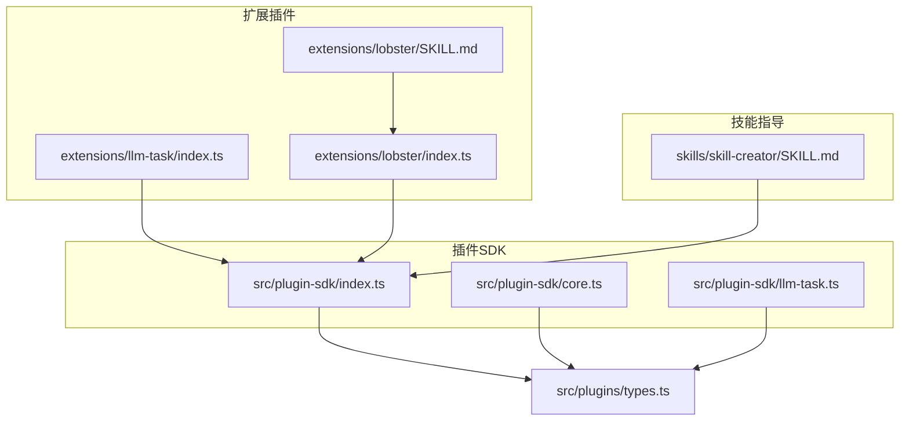
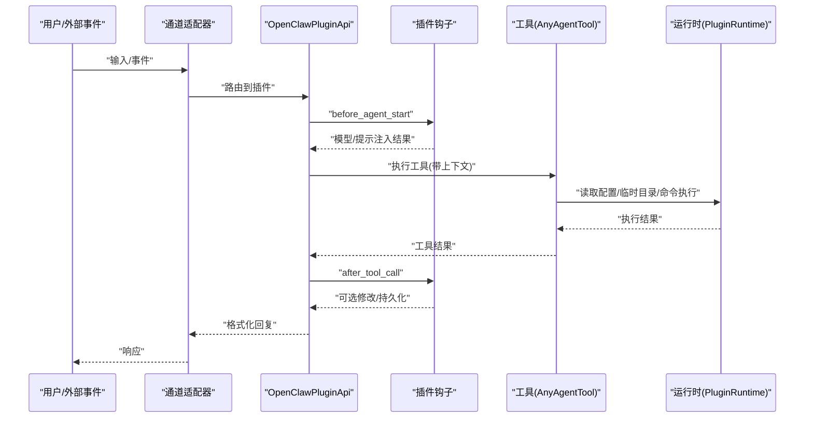
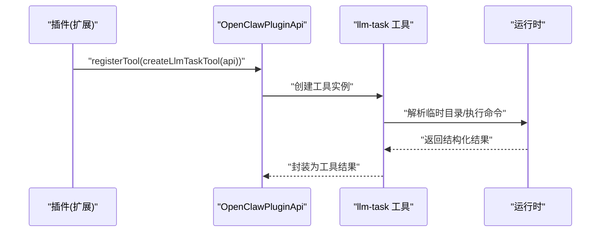
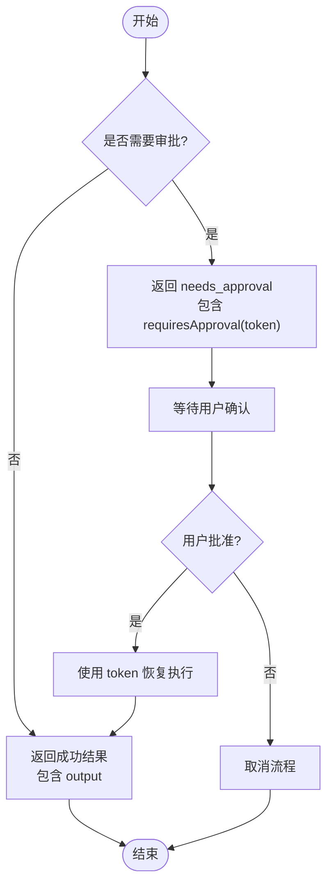
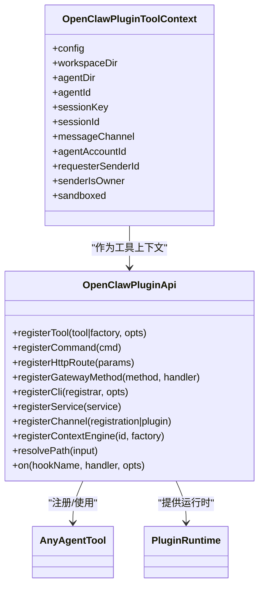
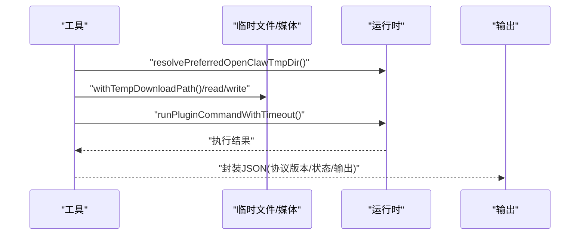
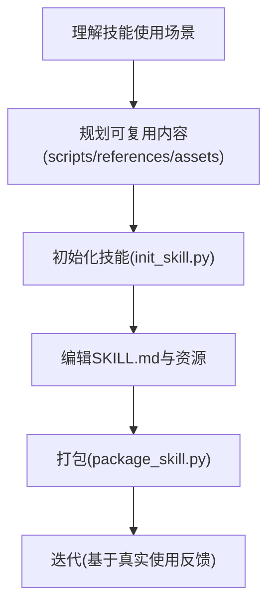
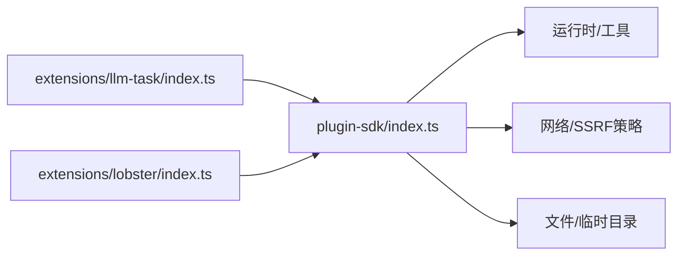

# 技能插件开发

<cite>
**本文引用的文件**
- [README.md](file://README.md)
- [src/plugin-sdk/index.ts](file://src/plugin-sdk/index.ts)
- [src/plugin-sdk/core.ts](file://src/plugin-sdk/core.ts)
- [src/plugin-sdk/llm-task.ts](file://src/plugin-sdk/llm-task.ts)
- [extensions/llm-task/index.ts](file://extensions/llm-task/index.ts)
- [extensions/lobster/index.ts](file://extensions/lobster/index.ts)
- [extensions/lobster/SKILL.md](file://extensions/lobster/SKILL.md)
- [skills/skill-creator/SKILL.md](file://skills/skill-creator/SKILL.md)
- [src/plugins/types.ts](file://src/plugins/types.ts)
</cite>

## 目录

1. [简介](#简介)
2. [项目结构](#项目结构)
3. [核心组件](#核心组件)
4. [架构总览](#架构总览)
5. [详细组件分析](#详细组件分析)
6. [依赖关系分析](#依赖关系分析)
7. [性能考量](#性能考量)
8. [故障排查指南](#故障排查指南)
9. [结论](#结论)
10. [附录](#附录)

## 简介

本文件面向在 OpenClaw 平台上开发“技能插件”的开发者，系统阐述技能插件的设计理念、接口规范、实现框架与最佳实践。内容覆盖：

- 技能注册机制与参数定义
- 返回值格式与协议约定
- LLM 任务处理、工具调用与结果格式化
- 输入验证、错误处理与性能优化
- 配置管理、版本控制与发布流程
- 与 AI 代理的集成模式与上下文传递机制

OpenClaw 提供统一的插件 SDK（plugin-sdk）与插件运行时（plugins/runtime），通过 OpenClawPluginApi 暴露注册工具、命令、HTTP 路由、网关方法、CLI、服务、通道适配器与上下文引擎的能力；同时以 SKILL.md 作为技能元数据与使用说明的载体，支持脚本、参考与资源的分层组织。

## 项目结构

围绕技能插件开发的关键目录与文件：

- 插件 SDK：src/plugin-sdk/\* 提供工具、钩子、通道、运行时、安全策略、SSRF 限制、临时路径、命令执行等能力
- 扩展插件：extensions/\* 为内置扩展，如 llm-task、lobster 等，展示如何基于 SDK 注册工具与命令
- 技能模板与指导：skills/skill-creator/SKILL.md 提供技能设计原则、结构与创作流程
- 根文档：README.md 提供平台概览、安装与使用指引

**图示来源**

- [src/plugin-sdk/index.ts:1-826](file://src/plugin-sdk/index.ts#L1-L826)
- [src/plugin-sdk/core.ts:1-44](file://src/plugin-sdk/core.ts#L1-L44)
- [src/plugin-sdk/llm-task.ts:1-6](file://src/plugin-sdk/llm-task.ts#L1-L6)
- [extensions/llm-task/index.ts:1-7](file://extensions/llm-task/index.ts#L1-L7)
- [extensions/lobster/index.ts:1-19](file://extensions/lobster/index.ts#L1-L19)
- [extensions/lobster/SKILL.md:1-98](file://extensions/lobster/SKILL.md#L1-L98)
- [skills/skill-creator/SKILL.md:1-373](file://skills/skill-creator/SKILL.md#L1-L373)
- [src/plugins/types.ts:1-893](file://src/plugins/types.ts#L1-L893)

**章节来源**

- [README.md:1-560](file://README.md#L1-L560)
- [src/plugin-sdk/index.ts:1-826](file://src/plugin-sdk/index.ts#L1-L826)
- [src/plugin-sdk/core.ts:1-44](file://src/plugin-sdk/core.ts#L1-L44)
- [src/plugin-sdk/llm-task.ts:1-6](file://src/plugin-sdk/llm-task.ts#L1-L6)
- [extensions/llm-task/index.ts:1-7](file://extensions/llm-task/index.ts#L1-L7)
- [extensions/lobster/index.ts:1-19](file://extensions/lobster/index.ts#L1-L19)
- [extensions/lobster/SKILL.md:1-98](file://extensions/lobster/SKILL.md#L1-L98)
- [skills/skill-creator/SKILL.md:1-373](file://skills/skill-creator/SKILL.md#L1-L373)
- [src/plugins/types.ts:1-893](file://src/plugins/types.ts#L1-L893)

## 核心组件

- 插件 API（OpenClawPluginApi）
  - 工具注册：registerTool(tool|factory, options)
  - 命令注册：registerCommand(def)
  - HTTP 路由注册：registerHttpRoute(params)
  - 网关方法注册：registerGatewayMethod(method, handler)
  - CLI 注册：registerCli(registrar, opts)
  - 服务注册：registerService(service)
  - 通道注册：registerChannel(registration|plugin)
  - 上下文引擎注册：registerContextEngine(id, factory)
  - 路径解析：resolvePath(input)
  - 生命周期钩子：on(hookName, handler, opts)
- 插件类型与上下文
  - OpenClawPluginConfigSchema：配置校验与 UI 提示
  - OpenClawPluginToolContext：会话、请求者、沙箱状态等上下文
  - OpenClawPluginToolFactory：按上下文动态返回工具或空
  - ProviderAuthResult/Context/Method：提供方认证流程
- 运行时与工具
  - PluginRuntime：插件运行时环境
  - AnyAgentTool：工具接口抽象
  - LLM 任务工具：llm-task 扩展通过 SDK 子集暴露能力

**章节来源**

- [src/plugins/types.ts:263-306](file://src/plugins/types.ts#L263-L306)
- [src/plugins/types.ts:58-77](file://src/plugins/types.ts#L58-L77)
- [src/plugins/types.ts:92-132](file://src/plugins/types.ts#L92-L132)
- [src/plugin-sdk/index.ts:1-826](file://src/plugin-sdk/index.ts#L1-L826)
- [src/plugin-sdk/core.ts:1-44](file://src/plugin-sdk/core.ts#L1-L44)
- [src/plugin-sdk/llm-task.ts:1-6](file://src/plugin-sdk/llm-task.ts#L1-L6)

## 架构总览

OpenClaw 的技能插件通过插件 SDK 注入到运行时，形成“工具 + 命令 + HTTP 路由 + 网关方法 + 通道适配器 + 上下文引擎”的组合能力。技能的触发与执行贯穿以下链路：

- 用户输入或外部事件进入通道适配器
- 插件钩子（before_agent_start、before_tool_call、after_tool_call 等）参与上下文构建与工具调用控制
- 工具执行后，结果经格式化并通过消息发送管线回传
- 可选：LLM 任务工具用于编排多步推理与输出

**图示来源**

- [src/plugins/types.ts:381-383](file://src/plugins/types.ts#L381-L383)
- [src/plugins/types.ts:460-488](file://src/plugins/types.ts#L460-L488)
- [src/plugins/types.ts:606-633](file://src/plugins/types.ts#L606-L633)
- [src/plugin-sdk/index.ts:1-826](file://src/plugin-sdk/index.ts#L1-L826)

## 详细组件分析

### 组件A：LLM 任务工具（llm-task）

- 设计目标：为需要多步推理、条件分支与结构化输出的任务提供稳定执行环境
- 接口要点
  - 通过扩展入口注册工具：extensions/llm-task/index.ts
  - 使用 SDK 子集导出符号，限定暴露面
- 典型用法
  - 在技能中编排多个工具调用，结合条件判断与重试策略
  - 输出遵循统一的 JSON 包装结构，便于前端与代理消费

**图示来源**

- [extensions/llm-task/index.ts:1-7](file://extensions/llm-task/index.ts#L1-L7)
- [src/plugin-sdk/llm-task.ts:1-6](file://src/plugin-sdk/llm-task.ts#L1-L6)

**章节来源**

- [extensions/llm-task/index.ts:1-7](file://extensions/llm-task/index.ts#L1-L7)
- [src/plugin-sdk/llm-task.ts:1-6](file://src/plugin-sdk/llm-task.ts#L1-L6)

### 组件B：多步骤工作流（Lobster）

- 设计目标：在需要人类审批与确定性执行的场景中，提供可暂停、可恢复的工作流
- 关键行为
  - 结构化输出：包含 protocolVersion、ok/status、output、requiresApproval 等字段
  - 审批门控：当 workflow 需要审批时返回 requiresApproval，携带 resumeToken
  - 恢复执行：使用 resume 动作与 token 继续
- 使用建议
  - 将单次动作交给直接工具，将多步骤、需审批的流程交给 Lobster

**图示来源**

- [extensions/lobster/SKILL.md:30-66](file://extensions/lobster/SKILL.md#L30-L66)

**章节来源**

- [extensions/lobster/SKILL.md:1-98](file://extensions/lobster/SKILL.md#L1-L98)
- [extensions/lobster/index.ts:1-19](file://extensions/lobster/index.ts#L1-L19)

### 组件C：技能注册与上下文传递

- 注册机制
  - 通过 OpenClawPluginApi.registerTool 注册工具，支持工厂函数按上下文返回工具或空
  - 支持可选注册（optional: true），避免在受限环境（如沙箱）下强制要求
- 上下文传递
  - OpenClawPluginToolContext 提供会话键、请求者标识、是否沙箱等信息
  - 插件可在工具内部读取配置、临时目录、命令执行等能力

**图示来源**

- [src/plugins/types.ts:263-306](file://src/plugins/types.ts#L263-L306)
- [src/plugins/types.ts:58-77](file://src/plugins/types.ts#L58-L77)
- [src/plugin-sdk/index.ts:1-826](file://src/plugin-sdk/index.ts#L1-L826)

**章节来源**

- [src/plugins/types.ts:263-306](file://src/plugins/types.ts#L263-L306)
- [src/plugins/types.ts:58-77](file://src/plugins/types.ts#L58-L77)
- [src/plugin-sdk/index.ts:1-826](file://src/plugin-sdk/index.ts#L1-L826)

### 组件D：LLM 任务处理与结果格式化

- 处理流程
  - 解析临时目录与执行命令
  - 读取/写入临时文件，必要时进行媒体加载与分块
  - 将结果封装为统一的 JSON 结构，便于后续钩子与发送管线处理
- 结果格式
  - 包含协议版本、状态码、输出主体与审批令牌等字段
  - 与 Lobster 的结构化输出保持一致的契约

**图示来源**

- [src/plugin-sdk/core.ts:34-34](file://src/plugin-sdk/core.ts#L34-L34)
- [src/plugin-sdk/index.ts:361-361](file://src/plugin-sdk/index.ts#L361-L361)

**章节来源**

- [src/plugin-sdk/core.ts:1-44](file://src/plugin-sdk/core.ts#L1-L44)
- [src/plugin-sdk/index.ts:361-361](file://src/plugin-sdk/index.ts#L361-L361)

### 组件E：技能开发最佳实践

- 设计原则
  - 简洁优先：仅在必要时提供上下文，避免过度解释
  - 自适应自由度：根据任务脆弱性选择高/中/低自由度
- 技能结构
  - 必备：SKILL.md（YAML frontmatter + Markdown 主体）
  - 可选：scripts/（可执行脚本）、references/（参考文档）、assets/（输出资源）
- 渐进披露
  - 元数据常驻（~100词）
  - SKILL.md 按需加载（<5k 词）
  - 资源按需加载（脚本可免上下文读取）

**图示来源**

- [skills/skill-creator/SKILL.md:201-211](file://skills/skill-creator/SKILL.md#L201-L211)

**章节来源**

- [skills/skill-creator/SKILL.md:1-373](file://skills/skill-creator/SKILL.md#L1-L373)

## 依赖关系分析

- 插件 SDK 对运行时与基础设施的依赖
  - 临时目录解析：resolvePreferredOpenClawTmpDir
  - 命令执行：runPluginCommandWithTimeout
  - SSRF 与网络策略：fetchWithSsrFGuard、isBlockedHostname
  - 文件锁与持久化去重：acquireFileLock、createPersistentDedupe
- 扩展插件对 SDK 的依赖
  - llm-task：仅使用 SDK 中与 llm-task 相关的导出
  - lobster：在非沙箱环境下注册工具

**图示来源**

- [src/plugin-sdk/index.ts:1-826](file://src/plugin-sdk/index.ts#L1-L826)
- [src/plugin-sdk/core.ts:34-34](file://src/plugin-sdk/core.ts#L34-L34)
- [extensions/llm-task/index.ts:1-7](file://extensions/llm-task/index.ts#L1-L7)
- [extensions/lobster/index.ts:1-19](file://extensions/lobster/index.ts#L1-L19)

**章节来源**

- [src/plugin-sdk/index.ts:1-826](file://src/plugin-sdk/index.ts#L1-L826)
- [src/plugin-sdk/core.ts:1-44](file://src/plugin-sdk/core.ts#L1-L44)
- [extensions/llm-task/index.ts:1-7](file://extensions/llm-task/index.ts#L1-L7)
- [extensions/lobster/index.ts:1-19](file://extensions/lobster/index.ts#L1-L19)

## 性能考量

- 上下文窗口管理
  - 严格控制 SKILL.md 体量，避免不必要的上下文加载
  - 将细节放入 references/，按需加载
- 工具执行优化
  - 使用临时文件与命令执行替代重复计算
  - 合理设置超时与并发队列，避免阻塞
- 网络与安全
  - 启用 SSRF 与主机白名单策略，减少无效请求
  - 使用有界计数器与限流器，防止异常流量放大

[本节为通用指导，无需特定文件引用]

## 故障排查指南

- 常见问题定位
  - 工具未注册：检查 registerTool 的工厂返回值与 sandboxed 标记
  - 审批未生效：确认 requiresApproval 字段与 resumeToken 的传递
  - 结果格式不符：核对 protocolVersion、status、output 字段
- 日志与诊断
  - 使用插件日志接口与诊断事件系统，收集 llm_input/llm_output、before_tool_call/after_tool_call 等钩子事件
- 安全与权限
  - 检查 SSRF 策略与主机白名单
  - 确认临时目录与文件锁的正确使用

**章节来源**

- [src/plugins/types.ts:606-633](file://src/plugins/types.ts#L606-L633)
- [src/plugins/types.ts:490-517](file://src/plugins/types.ts#L490-L517)
- [src/plugin-sdk/index.ts:440-472](file://src/plugin-sdk/index.ts#L440-L472)

## 结论

OpenClaw 的技能插件体系以插件 SDK 为核心，提供从工具注册、命令与 HTTP 路由、网关方法到上下文引擎的完整能力边界。通过标准化的结构化输出与钩子机制，既能满足多步骤工作流与审批门控需求，也能保证性能与安全性。结合技能创作的最佳实践，开发者可以快速构建高质量、可维护、可复用的技能模块。

[本节为总结，无需特定文件引用]

## 附录

### A. 技能注册与参数定义清单

- 工具注册
  - 参数：tool|factory、options（name/names/optional）
  - 返回：无（副作用：注册到运行时）
- 命令注册
  - 参数：def（name/nativeNames/description/acceptsArgs/requireAuth/handler）
  - 返回：无（注册到命令系统）
- HTTP 路由注册
  - 参数：params（path/handler/auth/match/replaceExisting）
  - 返回：无（注册到网关）
- 网关方法注册
  - 参数：method、handler
  - 返回：无（注册到控制平面）
- CLI 注册
  - 参数：registrar、opts（commands）
  - 返回：无（注册到 CLI）
- 服务注册
  - 参数：service（id/start/stop）
  - 返回：无（启动/停止服务）
- 通道注册
  - 参数：registration|plugin
  - 返回：无（接入通道适配器）
- 上下文引擎注册
  - 参数：id、factory
  - 返回：无（唯一激活槽位）
- 路径解析
  - 参数：input
  - 返回：string（绝对路径）
- 生命周期钩子
  - 参数：hookName、handler、opts（priority）
  - 返回：无（注册钩子）

**章节来源**

- [src/plugins/types.ts:273-293](file://src/plugins/types.ts#L273-L293)
- [src/plugins/types.ts:299-305](file://src/plugins/types.ts#L299-L305)

### B. 返回值格式与协议约定

- Lobster 协议
  - 字段：protocolVersion、ok/status、output、requiresApproval（含 prompt/items/token）
  - 行为：确定性执行、审批门控、可恢复
- LLM 任务工具
  - 输出：统一 JSON 包装，包含状态与结构化结果
- 工具结果持久化
  - 钩子：tool_result_persist 允许修改写入的消息体

**章节来源**

- [extensions/lobster/SKILL.md:30-66](file://extensions/lobster/SKILL.md#L30-L66)
- [src/plugins/types.ts:635-657](file://src/plugins/types.ts#L635-L657)

### C. 配置管理、版本控制与发布流程

- 配置 Schema
  - OpenClawPluginConfigSchema：safeParse/parse/validate/uiHints/jsonSchema
- 版本与来源
  - 插件定义包含 id/name/version/kind/description
- 发布流程
  - package_skill.py：自动校验、打包为 .skill 文件（zip），拒绝符号链接
- 版本控制
  - 通过 npm 发布渠道（stable/beta/dev）与 Git 标签管理

**章节来源**

- [src/plugins/types.ts:44-56](file://src/plugins/types.ts#L44-L56)
- [src/plugins/types.ts:248-257](file://src/plugins/types.ts#L248-L257)
- [skills/skill-creator/SKILL.md:335-362](file://skills/skill-creator/SKILL.md#L335-L362)
- [README.md:83-90](file://README.md#L83-L90)
