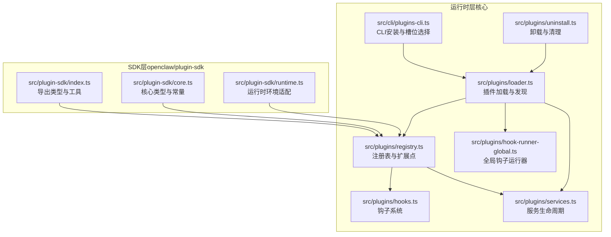
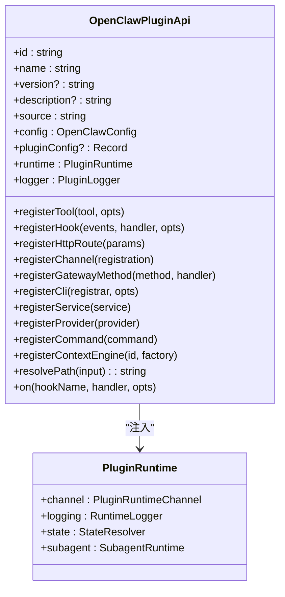
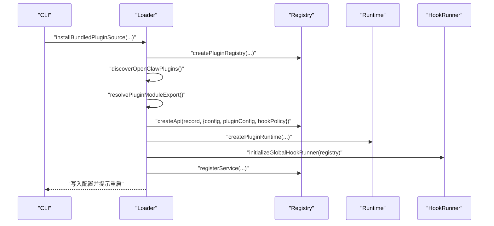
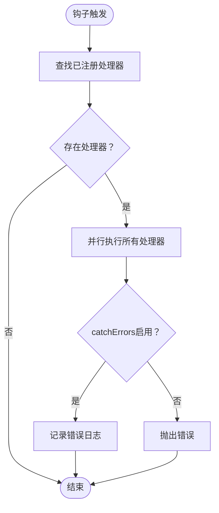
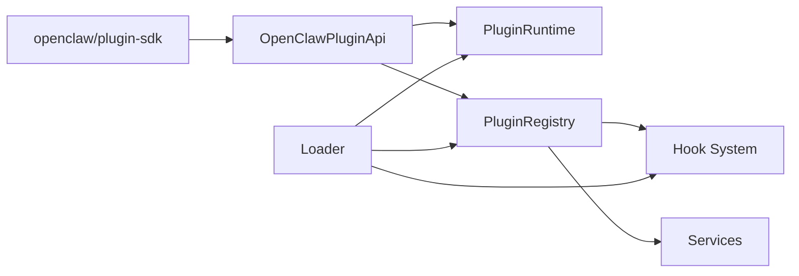

# 插件API

<cite>
**本文引用的文件**
- [docs/refactor/plugin-sdk.md](file://docs/refactor/plugin-sdk.md)
- [docs/plugins/manifest.md](file://docs/plugins/manifest.md)
- [src/plugin-sdk/index.ts](file://src/plugin-sdk/index.ts)
- [src/plugin-sdk/core.ts](file://src/plugin-sdk/core.ts)
- [src/plugin-sdk/runtime.ts](file://src/plugin-sdk/runtime.ts)
- [src/plugins/types.ts](file://src/plugins/types.ts)
- [src/plugins/runtime/types.ts](file://src/plugins/runtime/types.ts)
- [src/plugins/loader.ts](file://src/plugins/loader.ts)
- [src/plugins/registry.ts](file://src/plugins/registry.ts)
- [src/plugins/hooks.ts](file://src/plugins/hooks.ts)
- [src/plugins/hook-runner-global.ts](file://src/plugins/hook-runner-global.ts)
- [src/plugins/services.ts](file://src/plugins/services.ts)
- [src/plugins/uninstall.ts](file://src/plugins/uninstall.ts)
- [src/cli/plugins-cli.ts](file://src/cli/plugins-cli.ts)
- [SECURITY.md](file://SECURITY.md)
- [src/agents/sandbox-tool-policy.ts](file://src/agents/sandbox-tool-policy.ts)
- [src/agents/sandbox/validate-sandbox-security.ts](file://src/agents/sandbox/validate-sandbox-security.ts)
- [src/agents/sandbox/fs-bridge-mutation-helper.ts](file://src/agents/sandbox/fs-bridge-mutation-helper.ts)
- [extensions/diagnostics-otel/index.ts](file://extensions/diagnostics-otel/index.ts)
</cite>

## 目录

1. [简介](#简介)
2. [项目结构](#项目结构)
3. [核心组件](#核心组件)
4. [架构总览](#架构总览)
5. [详细组件分析](#详细组件分析)
6. [依赖关系分析](#依赖关系分析)
7. [性能考量](#性能考量)
8. [故障排查指南](#故障排查指南)
9. [结论](#结论)
10. [附录](#附录)

## 简介

本文件面向OpenClaw插件开发者，系统性阐述插件SDK与运行时的架构设计、接口规范与集成模式，覆盖插件生命周期、事件回调机制、扩展点定义、注册流程、配置管理、依赖注入、安全模型与权限控制、调试与性能监控以及发布流程。目标是帮助开发者快速理解并构建稳定、可维护且安全的插件。

## 项目结构

OpenClaw将插件体系分为两层：

- SDK层（编译期、稳定、可发布）：提供类型、工具函数与配置辅助，无运行时状态与副作用。
- 运行时层（执行面、被注入）：通过OpenClawPluginApi.runtime访问核心运行时能力，插件不得直接导入src/\*\*。

图表来源

- [src/plugin-sdk/index.ts:1-826](file://src/plugin-sdk/index.ts#L1-L826)
- [src/plugin-sdk/core.ts:1-44](file://src/plugin-sdk/core.ts#L1-L44)
- [src/plugin-sdk/runtime.ts:1-45](file://src/plugin-sdk/runtime.ts#L1-L45)
- [src/plugins/loader.ts:1-829](file://src/plugins/loader.ts#L1-L829)
- [src/plugins/registry.ts:1-625](file://src/plugins/registry.ts#L1-L625)
- [src/plugins/hooks.ts:1-723](file://src/plugins/hooks.ts#L1-L723)
- [src/plugins/hook-runner-global.ts:1-46](file://src/plugins/hook-runner-global.ts#L1-L46)
- [src/plugins/services.ts:1-75](file://src/plugins/services.ts#L1-L75)
- [src/plugins/uninstall.ts:106-156](file://src/plugins/uninstall.ts#L106-L156)
- [src/cli/plugins-cli.ts:156-197](file://src/cli/plugins-cli.ts#L156-L197)

章节来源

- [docs/refactor/plugin-sdk.md:19-50](file://docs/refactor/plugin-sdk.md#L19-L50)
- [src/plugin-sdk/index.ts:1-826](file://src/plugin-sdk/index.ts#L1-L826)

## 核心组件

- 插件SDK（类型与工具）
  - 类型导出：OpenClawPluginApi、PluginRuntime、ChannelPlugin、ProviderPlugin等。
  - 工具函数：配置Schema构建、路径解析、SSRF策略、Webhook守卫、命令运行、日志与临时文件等。
- 插件运行时（注入式）
  - 通过OpenClawPluginApi.runtime暴露核心运行时能力，如文本分块、媒体处理、路由、分组策略、去抖动、命令授权等。
- 插件注册表与扩展点
  - 注册工具、HTTP路由、通道插件、网关方法、CLI命令、服务、上下文引擎、钩子等。
- 钩子系统
  - 全局钩子运行器，支持并行执行、错误捕获与诊断。
- 加载与生命周期
  - 插件发现、清单校验、模块解析、配置验证、服务启动/停止、卸载清理。
- 安全与权限
  - 沙箱工具策略、网络隔离校验、路径安全策略、可信插件边界。

章节来源

- [src/plugin-sdk/index.ts:1-826](file://src/plugin-sdk/index.ts#L1-L826)
- [src/plugin-sdk/core.ts:1-44](file://src/plugin-sdk/core.ts#L1-L44)
- [src/plugin-sdk/runtime.ts:1-45](file://src/plugin-sdk/runtime.ts#L1-L45)
- [src/plugins/types.ts:263-306](file://src/plugins/types.ts#L263-L306)
- [src/plugins/runtime/types.ts:51-64](file://src/plugins/runtime/types.ts#L51-L64)
- [src/plugins/registry.ts:185-200](file://src/plugins/registry.ts#L185-L200)
- [src/plugins/hooks.ts:203-224](file://src/plugins/hooks.ts#L203-L224)
- [src/plugins/loader.ts:175-217](file://src/plugins/loader.ts#L175-L217)
- [src/plugins/services.ts:48-75](file://src/plugins/services.ts#L48-L75)
- [src/plugins/uninstall.ts:106-156](file://src/plugins/uninstall.ts#L106-L156)
- [SECURITY.md:104-110](file://SECURITY.md#L104-L110)
- [src/agents/sandbox-tool-policy.ts:1-37](file://src/agents/sandbox-tool-policy.ts#L1-L37)
- [src/agents/sandbox/validate-sandbox-security.ts:272-306](file://src/agents/sandbox/validate-sandbox-security.ts#L272-L306)
- [src/agents/sandbox/fs-bridge-mutation-helper.ts:1-51](file://src/agents/sandbox/fs-bridge-mutation-helper.ts#L1-L51)

## 架构总览

OpenClaw插件API采用“SDK+运行时”的双层架构：

- SDK层仅暴露稳定类型与工具，确保外部插件不依赖核心内部实现细节。
- 运行时层通过OpenClawPluginApi.runtime注入，统一访问核心能力，避免插件直接导入src/\*\*。

图表来源

- [src/plugins/types.ts:263-306](file://src/plugins/types.ts#L263-L306)
- [src/plugins/runtime/types.ts:51-64](file://src/plugins/runtime/types.ts#L51-L64)

章节来源

- [docs/refactor/plugin-sdk.md:19-50](file://docs/refactor/plugin-sdk.md#L19-L50)
- [src/plugins/types.ts:263-306](file://src/plugins/types.ts#L263-L306)
- [src/plugins/runtime/types.ts:51-64](file://src/plugins/runtime/types.ts#L51-L64)

## 详细组件分析

### 插件SDK与运行时接口

- SDK导出
  - 类型：OpenClawPluginApi、PluginRuntime、ChannelPlugin、ProviderPlugin、OpenClawPluginService等。
  - 工具：配置Schema、路径解析、SSRF策略、Webhook守卫、命令运行、日志与临时文件等。
- 运行时接口
  - 文本处理：chunkMarkdownText、resolveTextChunkLimit、hasControlCommand。
  - 回复派发：dispatchReplyWithBufferedBlockDispatcher、createReplyDispatcherWithTyping。
  - 路由与会话：resolveAgentRoute。
  - 配对与允许列表：buildPairingReply、readAllowFromStore、upsertPairingRequest。
  - 媒体：fetchRemoteMedia、saveMediaBuffer。
  - 提及与群组：buildMentionRegexes、matchesMentionPatterns、resolveGroupPolicy、resolveRequireMention。
  - 去抖动：createInboundDebouncer、resolveInboundDebounceMs。
  - 命令授权：resolveCommandAuthorizedFromAuthorizers。
  - 日志与状态：shouldLogVerbose、getChildLogger、resolveStateDir。
  - 子代理：run/waitForRun/getSessionMessages/deleteSession等。

章节来源

- [docs/refactor/plugin-sdk.md:45-145](file://docs/refactor/plugin-sdk.md#L45-L145)
- [src/plugin-sdk/index.ts:1-826](file://src/plugin-sdk/index.ts#L1-L826)
- [src/plugin-sdk/core.ts:1-44](file://src/plugin-sdk/core.ts#L1-L44)
- [src/plugin-sdk/runtime.ts:1-45](file://src/plugin-sdk/runtime.ts#L1-L45)
- [src/plugins/runtime/types.ts:51-64](file://src/plugins/runtime/types.ts#L51-L64)

### 插件注册与扩展点

- 注册API
  - registerTool、registerHook、registerHttpRoute、registerChannel、registerGatewayMethod、registerCli、registerService、registerProvider、registerCommand、registerContextEngine、on。
- 扩展点
  - 工具：工厂模式，支持命名集合与可选工具。
  - 钩子：事件名集合与处理器映射，支持提示注入与兼容旧钩子。
  - HTTP路由：精确匹配或前缀匹配，支持认证策略。
  - 通道插件：ChannelPlugin注册与停靠。
  - 提供商插件：ProviderPlugin注册与凭据处理。
  - CLI：命令注册器与命令集。
  - 服务：OpenClawPluginService生命周期（start/stop）。
  - 上下文引擎：独占槽位注册。
- 钩子策略
  - 允许/限制提示注入，兼容旧版before_agent_start结果裁剪。

章节来源

- [src/plugins/types.ts:263-306](file://src/plugins/types.ts#L263-L306)
- [src/plugins/registry.ts:185-200](file://src/plugins/registry.ts#L185-L200)
- [src/plugins/registry.ts:241-288](file://src/plugins/registry.ts#L241-L288)
- [src/plugins/hooks.ts:184-197](file://src/plugins/hooks.ts#L184-L197)
- [src/plugins/hooks.ts:714-723](file://src/plugins/hooks.ts#L714-L723)

### 插件生命周期与加载流程

- 发现与加载
  - discoverOpenClawPlugins、normalizePluginsConfig、resolveEffectiveEnableState、resolveMemorySlotDecision。
  - 解析模块导出（default或register/activate），创建OpenClawPluginApi实例。
- 配置验证
  - JSON Schema校验，缓存键生成，错误收集与诊断。
- 运行时注入
  - createPluginRuntime、initializeGlobalHookRunner、setActivePluginRegistry。
- 服务管理
  - 启动：遍历服务调用start；停止：逆序调用stop并容错。
- 卸载与清理
  - 移除加载路径、重置内存槽位、清理undefined字段。

图表来源

- [src/cli/plugins-cli.ts:156-197](file://src/cli/plugins-cli.ts#L156-L197)
- [src/plugins/loader.ts:1-829](file://src/plugins/loader.ts#L1-L829)
- [src/plugins/registry.ts:575-608](file://src/plugins/registry.ts#L575-L608)
- [src/plugins/hook-runner-global.ts:36-46](file://src/plugins/hook-runner-global.ts#L36-L46)
- [src/plugins/services.ts:48-75](file://src/plugins/services.ts#L48-L75)

章节来源

- [src/plugins/loader.ts:175-217](file://src/plugins/loader.ts#L175-L217)
- [src/plugins/loader.ts:256-288](file://src/plugins/loader.ts#L256-L288)
- [src/plugins/services.ts:48-75](file://src/plugins/services.ts#L48-L75)
- [src/plugins/uninstall.ts:106-156](file://src/plugins/uninstall.ts#L106-L156)
- [src/cli/plugins-cli.ts:156-197](file://src/cli/plugins-cli.ts#L156-L197)

### 钩子系统与事件回调

- 并行执行
  - runVoidHook并行触发所有处理器，提升吞吐。
- 错误处理
  - handleHookError在catchErrors=true时记录错误，否则抛出。
- 生命周期钩子
  - gateway_start、gateway_stop等全局钩子。
- 代理与消息钩子
  - before*model_resolve、before_prompt_build、before_agent_start、llm_input、llm_output、agent_end、before_compaction、after_compaction、before_reset、message_received、message_sending、message_sent、before_tool_call、after_tool_call、tool_result_persist、before_message_write、session_start、session_end、subagent*\*系列等。

图表来源

- [src/plugins/hooks.ts:203-224](file://src/plugins/hooks.ts#L203-L224)
- [src/plugins/hooks.ts:184-197](file://src/plugins/hooks.ts#L184-L197)

章节来源

- [src/plugins/hooks.ts:184-197](file://src/plugins/hooks.ts#L184-L197)
- [src/plugins/hooks.ts:689-705](file://src/plugins/hooks.ts#L689-L705)
- [src/plugins/hook-runner-global.ts:36-46](file://src/plugins/hook-runner-global.ts#L36-L46)

### 配置管理与清单校验

- 清单要求
  - openclaw.plugin.json必须位于插件根目录，包含id与configSchema。
  - 可选字段：kind、channels、providers、skills、name、description、uiHints、version。
- Schema要求
  - 必须提供JSON Schema，即使为空对象。
  - 未知channels键、未知插件ID引用、缺失/损坏清单均视为错误。
- 验证行为
  - 严格校验，阻止无效配置进入运行时。
  - 禁用插件保留配置并发出警告。

章节来源

- [docs/plugins/manifest.md:11-76](file://docs/plugins/manifest.md#L11-L76)

### 依赖注入与运行时环境

- 运行时环境
  - createLoggerBackedRuntime与resolveRuntimeEnv提供日志与退出封装。
- SDK别名与导出
  - openclaw/plugin-sdk/\*子路径通过别名映射到源码或产物目录，确保生产与开发一致性。
- 路径解析
  - resolvePath用于插件内相对路径解析。

章节来源

- [src/plugin-sdk/runtime.ts:9-44](file://src/plugin-sdk/runtime.ts#L9-L44)
- [src/plugins/loader.ts:112-158](file://src/plugins/loader.ts#L112-L158)
- [src/plugins/types.ts:299-300](file://src/plugins/types.ts#L299-L300)

### 插件开发示例模式

- 通道插件
  - 通过registerChannel注册ChannelPlugin，实现账户解析、消息发送、目录与群组策略等。
  - 示例参考：Telegram、Discord、Slack等通道插件的注册与适配。
- 技能插件
  - 通过registerCommand注册自定义命令，或通过registerTool注册Agent工具。
  - 示例参考：技能目录与命令定义。
- 工具插件
  - 通过registerTool(factory)注册工具工厂，支持命名集合与可选工具。
  - 示例参考：工具参数门禁、OAuth认证结果构建等。

章节来源

- [src/plugins/types.ts:243-247](file://src/plugins/types.ts#L243-L247)
- [src/plugins/types.ts:179-203](file://src/plugins/types.ts#L179-L203)
- [src/plugin-sdk/index.ts:648-800](file://src/plugin-sdk/index.ts#L648-L800)

### 安全模型、权限控制与沙箱机制

- 可信插件边界
  - 插件被视为与本地代码同等信任，安装/启用即授予相同信任级别。
- 沙箱工具策略
  - 支持allow/deny白名单合并，Agent策略优先于沙箱策略，最严格者生效。
- 网络与容器安全
  - 禁止host网络模式与容器命名空间加入，防止越狱。
- 文件系统桥接
  - 路径规范化、Symlink逃逸加固、只读根文件系统、tmpfs等隔离措施。
- SSRF与请求守卫
  - 主机名后缀白名单、HTTPS限制、请求体大小与速率限制等。

章节来源

- [SECURITY.md:104-110](file://SECURITY.md#L104-L110)
- [src/agents/sandbox-tool-policy.ts:21-37](file://src/agents/sandbox-tool-policy.ts#L21-L37)
- [src/agents/sandbox/validate-sandbox-security.ts:283-306](file://src/agents/sandbox/validate-sandbox-security.ts#L283-L306)
- [src/agents/sandbox/fs-bridge-mutation-helper.ts:1-51](file://src/agents/sandbox/fs-bridge-mutation-helper.ts#L1-L51)
- [src/plugin-sdk/index.ts:440-472](file://src/plugin-sdk/index.ts#L440-L472)

### 调试工具、性能监控与发布流程

- 调试
  - 全局钩子运行器初始化，日志记录与错误捕获。
  - 插件诊断（PluginDiagnostic）收集错误与警告。
- 性能
  - 钩子并行执行、去抖动、限流与异常追踪等。
- 发布
  - openclaw/plugin-sdk作为独立包发布，语义化版本与稳定性保证。
  - 插件清单与Schema随插件发布，CI检查禁止extensions/**导入src/**。

章节来源

- [src/plugins/hook-runner-global.ts:36-46](file://src/plugins/hook-runner-global.ts#L36-L46)
- [src/plugins/types.ts:310-316](file://src/plugins/types.ts#L310-L316)
- [docs/refactor/plugin-sdk.md:35-50](file://docs/refactor/plugin-sdk.md#L35-L50)
- [src/plugins/loader.ts:256-288](file://src/plugins/loader.ts#L256-L288)

## 依赖关系分析

- 组件耦合
  - 插件SDK与运行时通过OpenClawPluginApi解耦，插件仅依赖SDK类型与工具。
  - 注册表集中管理扩展点，降低跨模块耦合。
- 外部依赖
  - jiti动态加载、JSON Schema校验、HTTP路由与守卫、日志子系统。
- 循环依赖
  - 通过模块拆分与延迟初始化避免循环依赖风险。

图表来源

- [src/plugins/loader.ts:1-829](file://src/plugins/loader.ts#L1-L829)
- [src/plugins/registry.ts:185-200](file://src/plugins/registry.ts#L185-L200)
- [src/plugins/hooks.ts:203-224](file://src/plugins/hooks.ts#L203-L224)

章节来源

- [src/plugins/loader.ts:1-829](file://src/plugins/loader.ts#L1-L829)
- [src/plugins/registry.ts:1-200](file://src/plugins/registry.ts#L1-L200)

## 性能考量

- 钩子并行化：runVoidHook并行执行，减少总延迟。
- 去抖动与限流：resolveInboundDebounceMs与Webhook守卫降低抖动与滥用。
- 缓存与别名：SDK别名候选顺序优化加载性能。
- I/O隔离：沙箱与只读文件系统减少I/O开销与风险。

## 故障排查指南

- 常见问题
  - 插件未加载：检查openclaw.plugin.json是否存在与Schema是否有效。
  - 注册失败：确认register/activate导出存在，或使用新的register函数。
  - 钩子错误：查看全局钩子运行器日志，定位具体插件与错误堆栈。
  - 卸载残留：确认加载路径与槽位清理逻辑已执行。
- 诊断
  - 使用PluginDiagnostic收集错误与警告。
  - 通过CLI安装流程提示与日志定位问题。

章节来源

- [src/plugins/loader.ts:256-288](file://src/plugins/loader.ts#L256-L288)
- [src/plugins/uninstall.ts:106-156](file://src/plugins/uninstall.ts#L106-L156)
- [src/plugins/types.ts:310-316](file://src/plugins/types.ts#L310-L316)

## 结论

OpenClaw插件API通过清晰的SDK与运行时分层、完善的扩展点与钩子系统、严格的配置与安全策略，为开发者提供了稳定、可扩展且安全的插件生态。遵循本文档的接口规范与最佳实践，可高效构建通道、技能与工具类插件，并在生产环境中保持高可靠与高性能。

## 附录

- 示例插件
  - 诊断OpenTelemetry插件：展示registerService与emptyPluginConfigSchema的使用。
- 关键路径
  - 插件加载与注册：[src/plugins/loader.ts:175-217](file://src/plugins/loader.ts#L175-L217)，[src/plugins/registry.ts:575-608](file://src/plugins/registry.ts#L575-L608)
  - 钩子运行：[src/plugins/hooks.ts:203-224](file://src/plugins/hooks.ts#L203-L224)，[src/plugins/hook-runner-global.ts:36-46](file://src/plugins/hook-runner-global.ts#L36-L46)
  - 服务生命周期：[src/plugins/services.ts:48-75](file://src/plugins/services.ts#L48-L75)
  - 卸载清理：[src/plugins/uninstall.ts:106-156](file://src/plugins/uninstall.ts#L106-L156)
  - 清单与Schema：[docs/plugins/manifest.md:11-76](file://docs/plugins/manifest.md#L11-L76)
  - 安全边界与沙箱：[SECURITY.md:104-110](file://SECURITY.md#L104-L110)，[src/agents/sandbox-tool-policy.ts:21-37](file://src/agents/sandbox-tool-policy.ts#L21-L37)，[src/agents/sandbox/validate-sandbox-security.ts:283-306](file://src/agents/sandbox/validate-sandbox-security.ts#L283-L306)，[src/agents/sandbox/fs-bridge-mutation-helper.ts:1-51](file://src/agents/sandbox/fs-bridge-mutation-helper.ts#L1-L51)
