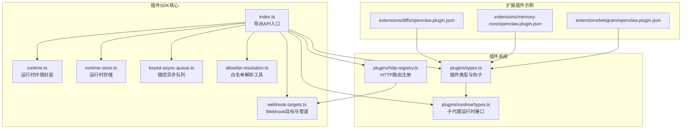
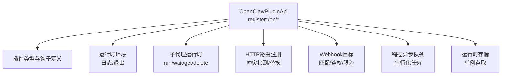
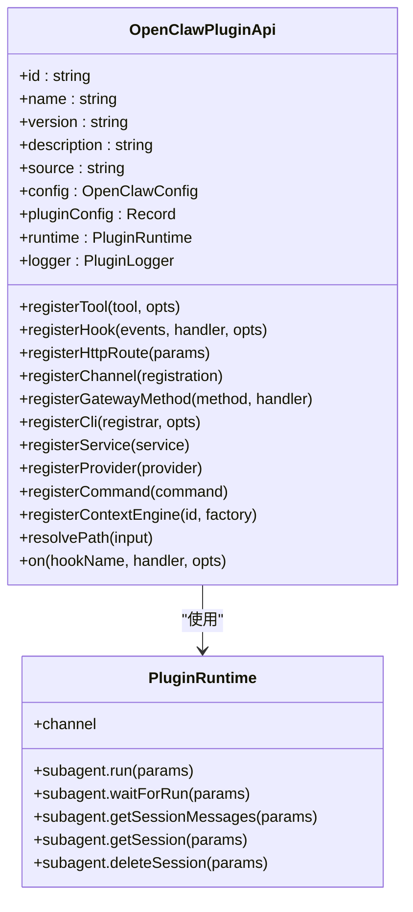
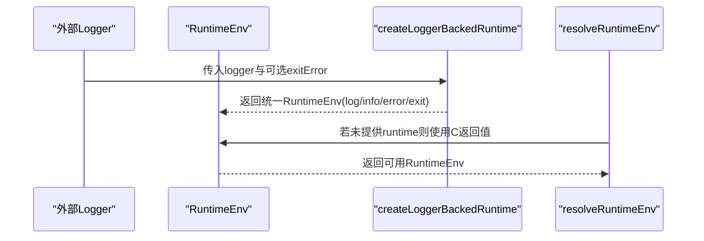
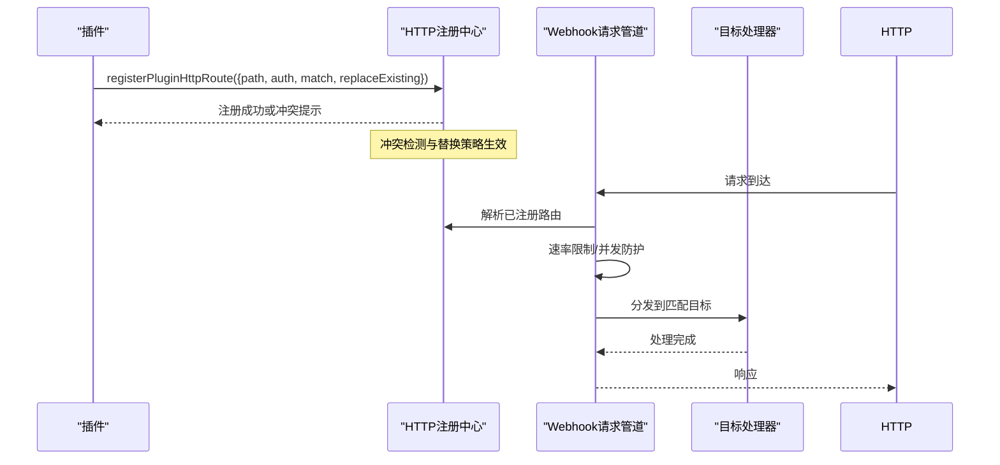
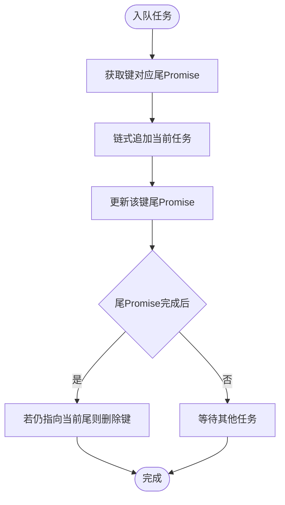
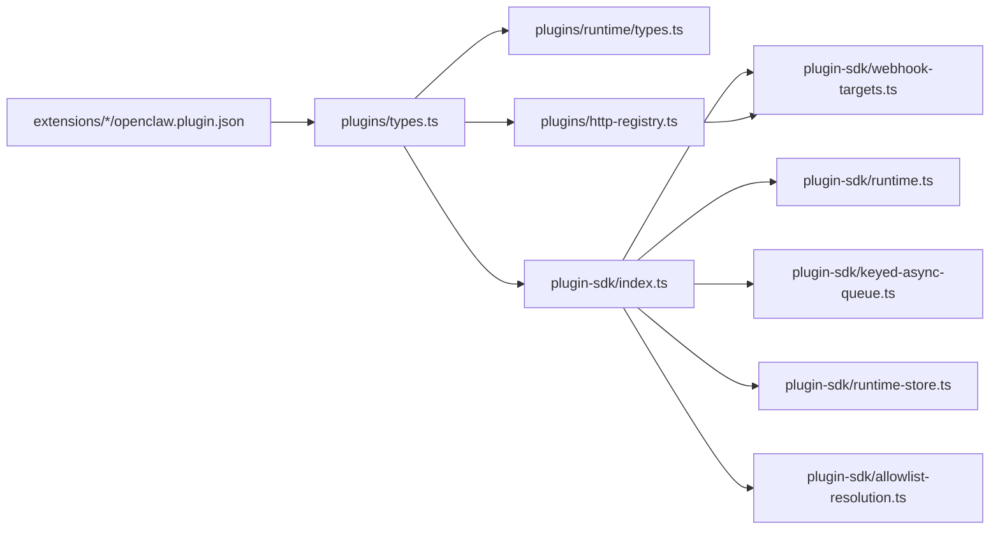

# 插件SDK架构

<cite>
**本文档引用的文件**
- [src/plugin-sdk/index.ts](file://src/plugin-sdk/index.ts)
- [src/plugin-sdk/runtime.ts](file://src/plugin-sdk/runtime.ts)
- [src/plugin-sdk/runtime-store.ts](file://src/plugin-sdk/runtime-store.ts)
- [src/plugin-sdk/keyed-async-queue.ts](file://src/plugin-sdk/keyed-async-queue.ts)
- [src/plugin-sdk/webhook-targets.ts](file://src/plugin-sdk/webhook-targets.ts)
- [src/plugin-sdk/allowlist-resolution.ts](file://src/plugin-sdk/allowlist-resolution.ts)
- [src/plugins/types.ts](file://src/plugins/types.ts)
- [src/plugins/runtime/types.ts](file://src/plugins/runtime/types.ts)
- [src/plugins/http-registry.ts](file://src/plugins/http-registry.ts)
- [extensions/diffs/openclaw.plugin.json](file://extensions/diffs/openclaw.plugin.json)
- [extensions/memory-core/openclaw.plugin.json](file://extensions/memory-core/openclaw.plugin.json)
- [extensions/telegram/openclaw.plugin.json](file://extensions/telegram/openclaw.plugin.json)
</cite>

## 目录

1. [简介](#简介)
2. [项目结构](#项目结构)
3. [核心组件](#核心组件)
4. [架构总览](#架构总览)
5. [详细组件分析](#详细组件分析)
6. [依赖关系分析](#依赖关系分析)
7. [性能考量](#性能考量)
8. [故障排查指南](#故障排查指南)
9. [结论](#结论)
10. [附录](#附录)

## 简介

本文件面向OpenClaw插件SDK的架构与实现，目标是帮助开发者理解插件系统的设计理念、核心组件、运行时环境、生命周期管理、事件系统、注册机制、依赖注入与模块加载策略、插件间通信与共享资源管理、状态同步、安全边界与沙箱隔离、权限控制等关键主题。文档通过代码级图表与流程图展示组件交互，并提供可操作的实践建议。

## 项目结构

OpenClaw插件SDK位于src/plugin-sdk目录，围绕“运行时环境”“HTTP路由与Webhook”“事件钩子”“异步队列与状态存储”等模块组织；同时在src/plugins下定义了插件类型、运行时接口与HTTP路由注册机制；扩展插件（extensions/\*）以openclaw.plugin.json声明元数据与配置模式。

**图表来源**

- [src/plugin-sdk/index.ts:1-826](file://src/plugin-sdk/index.ts#L1-L826)
- [src/plugin-sdk/runtime.ts:1-45](file://src/plugin-sdk/runtime.ts#L1-L45)
- [src/plugin-sdk/runtime-store.ts:1-27](file://src/plugin-sdk/runtime-store.ts#L1-L27)
- [src/plugin-sdk/keyed-async-queue.ts:1-49](file://src/plugin-sdk/keyed-async-queue.ts#L1-L49)
- [src/plugin-sdk/webhook-targets.ts:1-282](file://src/plugin-sdk/webhook-targets.ts#L1-L282)
- [src/plugin-sdk/allowlist-resolution.ts:1-31](file://src/plugin-sdk/allowlist-resolution.ts#L1-L31)
- [src/plugins/types.ts:1-893](file://src/plugins/types.ts#L1-L893)
- [src/plugins/runtime/types.ts:1-64](file://src/plugins/runtime/types.ts#L1-L64)
- [src/plugins/http-registry.ts:1-93](file://src/plugins/http-registry.ts#L1-L93)
- [extensions/diffs/openclaw.plugin.json:1-183](file://extensions/diffs/openclaw.plugin.json#L1-L183)
- [extensions/memory-core/openclaw.plugin.json:1-10](file://extensions/memory-core/openclaw.plugin.json#L1-L10)
- [extensions/telegram/openclaw.plugin.json:1-10](file://extensions/telegram/openclaw.plugin.json#L1-L10)

**章节来源**

- [src/plugin-sdk/index.ts:1-826](file://src/plugin-sdk/index.ts#L1-L826)
- [src/plugins/types.ts:1-893](file://src/plugins/types.ts#L1-L893)

## 核心组件

- 运行时环境与日志：提供统一的日志与退出接口，支持从外部logger桥接，便于在不同宿主中复用。
- 子代理运行时：抽象子会话运行、等待、消息读取与删除等能力，支撑多层级任务编排。
- HTTP路由与Webhook：注册插件HTTP端点、路径规范化、冲突检测、速率限制与并发防护。
- 键控异步队列：按键串行化异步任务，避免竞态与资源争用。
- 运行时存储：单例式运行时对象存取，带错误提示，确保生命周期内一致性。
- 配置与白名单：提供基础配置Schema与白名单解析映射工具，辅助鉴权与访问控制。

**章节来源**

- [src/plugin-sdk/runtime.ts:1-45](file://src/plugin-sdk/runtime.ts#L1-L45)
- [src/plugins/runtime/types.ts:1-64](file://src/plugins/runtime/types.ts#L1-L64)
- [src/plugins/http-registry.ts:1-93](file://src/plugins/http-registry.ts#L1-L93)
- [src/plugin-sdk/webhook-targets.ts:1-282](file://src/plugin-sdk/webhook-targets.ts#L1-L282)
- [src/plugin-sdk/keyed-async-queue.ts:1-49](file://src/plugin-sdk/keyed-async-queue.ts#L1-L49)
- [src/plugin-sdk/runtime-store.ts:1-27](file://src/plugin-sdk/runtime-store.ts#L1-L27)
- [src/plugin-sdk/allowlist-resolution.ts:1-31](file://src/plugin-sdk/allowlist-resolution.ts#L1-L31)

## 架构总览

OpenClaw插件SDK采用“类型驱动 + 运行时抽象 + 路由与Webhook治理 + 钩子事件系统”的整体设计。插件通过OpenClawPluginApi注册工具、命令、HTTP路由、服务、通道适配器与上下文引擎；运行时提供子代理能力与日志/退出接口；HTTP层负责请求进入、鉴权与限流；事件钩子贯穿消息收发、工具调用、会话生命周期等关键节点。

**图表来源**

- [src/plugins/types.ts:263-306](file://src/plugins/types.ts#L263-L306)
- [src/plugin-sdk/runtime.ts:9-32](file://src/plugin-sdk/runtime.ts#L9-L32)
- [src/plugins/runtime/types.ts:51-63](file://src/plugins/runtime/types.ts#L51-L63)
- [src/plugins/http-registry.ts:12-92](file://src/plugins/http-registry.ts#L12-L92)
- [src/plugin-sdk/webhook-targets.ts:115-162](file://src/plugin-sdk/webhook-targets.ts#L115-L162)
- [src/plugin-sdk/keyed-async-queue.ts:33-48](file://src/plugin-sdk/keyed-async-queue.ts#L33-L48)
- [src/plugin-sdk/runtime-store.ts:1-26](file://src/plugin-sdk/runtime-store.ts#L1-L26)

## 详细组件分析

### 组件A：插件API与事件系统

- OpenClawPluginApi提供注册与生命周期钩子接口，涵盖工具、命令、HTTP路由、通道、网关方法、CLI、服务、上下文引擎与诊断等。
- 事件钩子覆盖模型选择、提示构建、代理执行、消息收发、工具调用、会话开始/结束、子代理派生与网关启停等阶段。
- 钩子事件参数与结果类型明确，支持对提示内容、工具参数、消息写入等进行拦截与修改。

**图表来源**

- [src/plugins/types.ts:263-306](file://src/plugins/types.ts#L263-L306)
- [src/plugins/runtime/types.ts:51-63](file://src/plugins/runtime/types.ts#L51-L63)

**章节来源**

- [src/plugins/types.ts:248-306](file://src/plugins/types.ts#L248-L306)
- [src/plugins/types.ts:321-394](file://src/plugins/types.ts#L321-L394)

### 组件B：运行时环境与日志

- 提供createLoggerBackedRuntime与resolveRuntimeEnv，将外部logger桥接到统一的RuntimeEnv接口，支持可控的退出行为。
- resolveRuntimeEnvWithUnavailableExit用于在特定宿主中模拟不可用退出场景，便于错误处理与诊断。

**图表来源**

- [src/plugin-sdk/runtime.ts:9-44](file://src/plugin-sdk/runtime.ts#L9-L44)

**章节来源**

- [src/plugin-sdk/runtime.ts:1-45](file://src/plugin-sdk/runtime.ts#L1-L45)

### 组件C：HTTP路由注册与Webhook管道

- registerPluginHttpRoute负责路径规范化、重名/重叠冲突检测、认证域隔离与替换策略。
- registerWebhookTarget与withResolvedWebhookRequestPipeline组合，实现目标注册、路径匹配、鉴权、速率限制与并发防护。

**图表来源**

- [src/plugins/http-registry.ts:12-92](file://src/plugins/http-registry.ts#L12-L92)
- [src/plugin-sdk/webhook-targets.ts:27-162](file://src/plugin-sdk/webhook-targets.ts#L27-L162)

**章节来源**

- [src/plugins/http-registry.ts:1-93](file://src/plugins/http-registry.ts#L1-L93)
- [src/plugin-sdk/webhook-targets.ts:1-282](file://src/plugin-sdk/webhook-targets.ts#L1-L282)

### 组件D：键控异步队列

- 按键维护任务尾部Promise，确保同键任务串行执行，避免竞态。
- 支持入队/结算钩子，便于观测与统计。

**图表来源**

- [src/plugin-sdk/keyed-async-queue.ts:6-48](file://src/plugin-sdk/keyed-async-queue.ts#L6-L48)

**章节来源**

- [src/plugin-sdk/keyed-async-queue.ts:1-49](file://src/plugin-sdk/keyed-async-queue.ts#L1-L49)

### 组件E：运行时存储

- 单例式运行时对象存取，提供tryGet与get两种访问方式，get在未设置时抛出错误，便于显式初始化检查。

**章节来源**

- [src/plugin-sdk/runtime-store.ts:1-27](file://src/plugin-sdk/runtime-store.ts#L1-L27)

### 组件F：白名单解析工具

- 提供基础条目映射与输入批量映射函数，便于将原始输入转换为标准化的解析结果。

**章节来源**

- [src/plugin-sdk/allowlist-resolution.ts:1-31](file://src/plugin-sdk/allowlist-resolution.ts#L1-L31)

### 扩展插件示例

- 差分查看插件（diffs）：通过openclaw.plugin.json声明UI提示、默认配置与安全开关，体现插件配置Schema与UI提示的组织方式。
- 记忆核心插件（memory-core）：声明kind为memory，作为内存型插件的模板。
- Telegram插件：声明channels字段，表明其作为渠道适配器的角色。

**章节来源**

- [extensions/diffs/openclaw.plugin.json:1-183](file://extensions/diffs/openclaw.plugin.json#L1-L183)
- [extensions/memory-core/openclaw.plugin.json:1-10](file://extensions/memory-core/openclaw.plugin.json#L1-L10)
- [extensions/telegram/openclaw.plugin.json:1-10](file://extensions/telegram/openclaw.plugin.json#L1-L10)

## 依赖关系分析

- 插件API依赖运行时环境与子代理接口；HTTP注册依赖路由规范化与重叠检测；Webhook管道依赖HTTP注册与请求守卫；键控队列与运行时存储为通用基础设施。
- 扩展插件通过JSON元数据声明自身角色与配置，与插件类型系统耦合度低，便于独立演进。

**图表来源**

- [src/plugins/types.ts:1-893](file://src/plugins/types.ts#L1-L893)
- [src/plugins/runtime/types.ts:1-64](file://src/plugins/runtime/types.ts#L1-L64)
- [src/plugins/http-registry.ts:1-93](file://src/plugins/http-registry.ts#L1-L93)
- [src/plugin-sdk/index.ts:1-826](file://src/plugin-sdk/index.ts#L1-L826)
- [src/plugin-sdk/runtime.ts:1-45](file://src/plugin-sdk/runtime.ts#L1-L45)
- [src/plugin-sdk/webhook-targets.ts:1-282](file://src/plugin-sdk/webhook-targets.ts#L1-L282)
- [src/plugin-sdk/keyed-async-queue.ts:1-49](file://src/plugin-sdk/keyed-async-queue.ts#L1-L49)
- [src/plugin-sdk/runtime-store.ts:1-27](file://src/plugin-sdk/runtime-store.ts#L1-L27)
- [src/plugin-sdk/allowlist-resolution.ts:1-31](file://src/plugin-sdk/allowlist-resolution.ts#L1-L31)
- [extensions/diffs/openclaw.plugin.json:1-183](file://extensions/diffs/openclaw.plugin.json#L1-L183)

**章节来源**

- [src/plugin-sdk/index.ts:1-826](file://src/plugin-sdk/index.ts#L1-L826)
- [src/plugins/types.ts:1-893](file://src/plugins/types.ts#L1-L893)

## 性能考量

- 使用键控异步队列避免同键任务并发导致的资源争用与状态不一致，适合消息去重、幂等写入等场景。
- HTTP路由注册的冲突检测与替换策略减少运行期路由歧义，降低错误分支开销。
- Webhook请求管道集成速率限制与并发防护，有助于平滑突发流量，避免后端过载。
- 运行时存储采用单例缓存，减少重复初始化成本，但需注意生命周期清理。

[本节为通用指导，无需具体文件来源]

## 故障排查指南

- HTTP路由冲突：当路径与匹配模式相同但认证域不同时会被拒绝；同一路径且无replaceExisting时会报告冲突。请检查路径规范化与认证域一致性。
- Webhook鉴权失败：resolveWebhookTargetWithAuthOrReject在目标不唯一或未匹配时返回401/400类错误，请核对目标匹配逻辑与请求方法。
- 退出不可用：在某些宿主中exit可能不可用，使用resolveRuntimeEnvWithUnavailableExit提供可控的错误包装。
- 日志与诊断：通过RuntimeEnv统一日志接口输出；结合插件钩子事件定位问题阶段与上下文。

**章节来源**

- [src/plugins/http-registry.ts:36-74](file://src/plugins/http-registry.ts#L36-L74)
- [src/plugin-sdk/webhook-targets.ts:222-271](file://src/plugin-sdk/webhook-targets.ts#L222-L271)
- [src/plugin-sdk/runtime.ts:34-44](file://src/plugin-sdk/runtime.ts#L34-L44)

## 结论

OpenClaw插件SDK以类型安全的API为核心，结合运行时抽象、HTTP/Webhook治理与事件钩子系统，提供了可扩展、可观测、可治理的插件运行平台。通过键控队列、运行时存储与白名单工具，进一步强化了并发安全与访问控制。扩展插件以JSON元数据声明自身能力，与核心类型系统解耦，便于生态繁荣与独立演进。

[本节为总结性内容，无需具体文件来源]

## 附录

- 插件注册清单（示例）
  - 工具注册：registerTool
  - 命令注册：registerCommand
  - HTTP路由注册：registerHttpRoute
  - 通道注册：registerChannel
  - 网关方法注册：registerGatewayMethod
  - CLI注册：registerCli
  - 服务注册：registerService
  - 上下文引擎注册：registerContextEngine
  - 生命周期钩子：on(...)
- 典型使用路径
  - 初始化：通过OpenClawPluginApi与运行时环境对接
  - 启动：registerService/start
  - 接入：registerHttpRoute/registerWebhookTarget
  - 编排：子代理运行时run/wait/get/delete
  - 观察：订阅钩子事件并记录诊断

[本节为概览性内容，无需具体文件来源]
