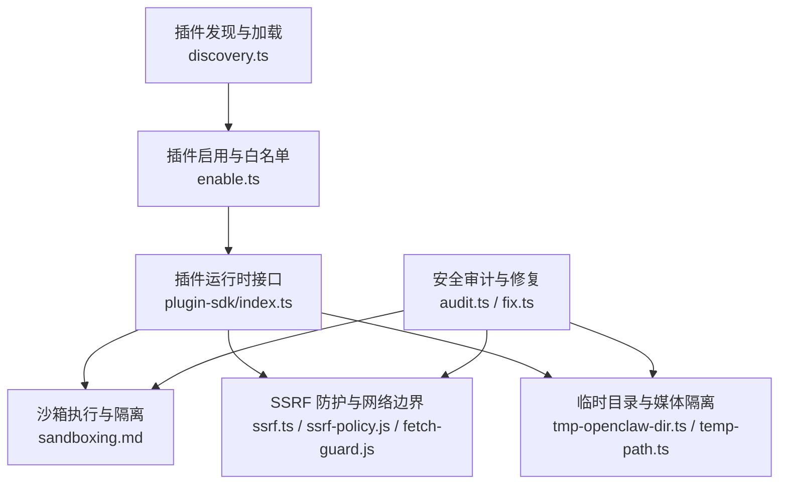
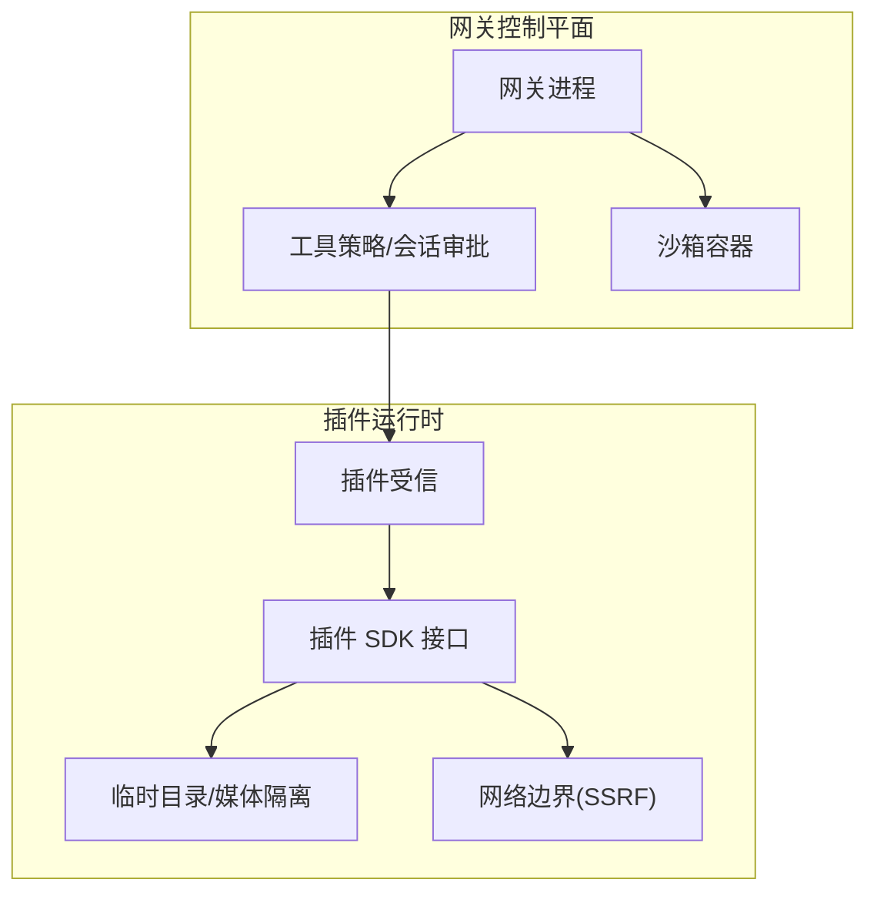
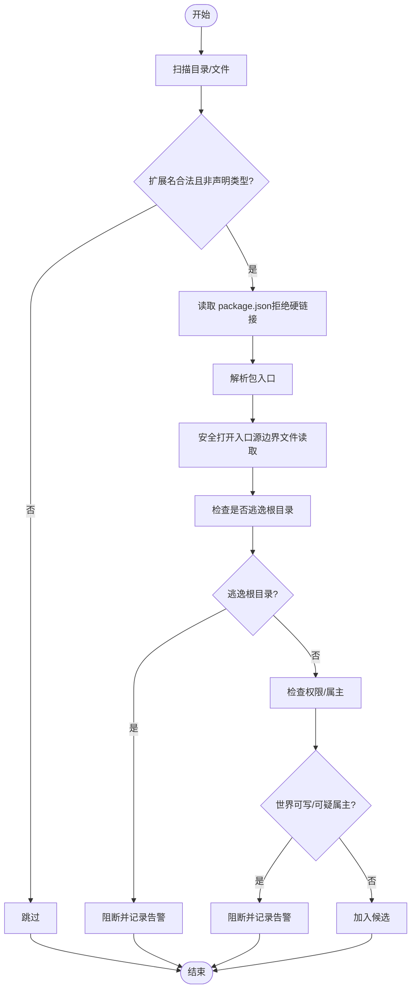
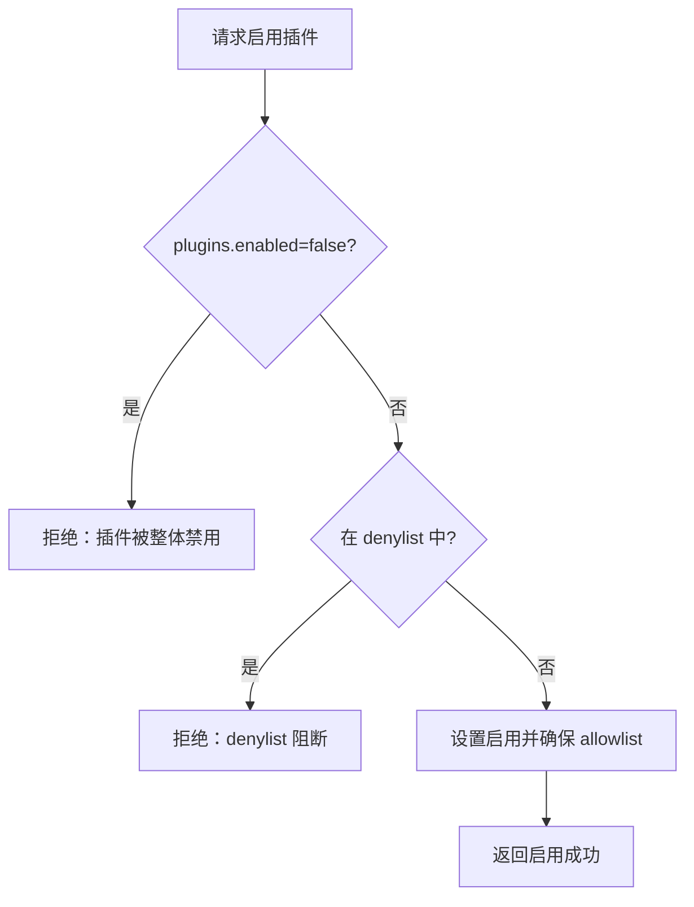
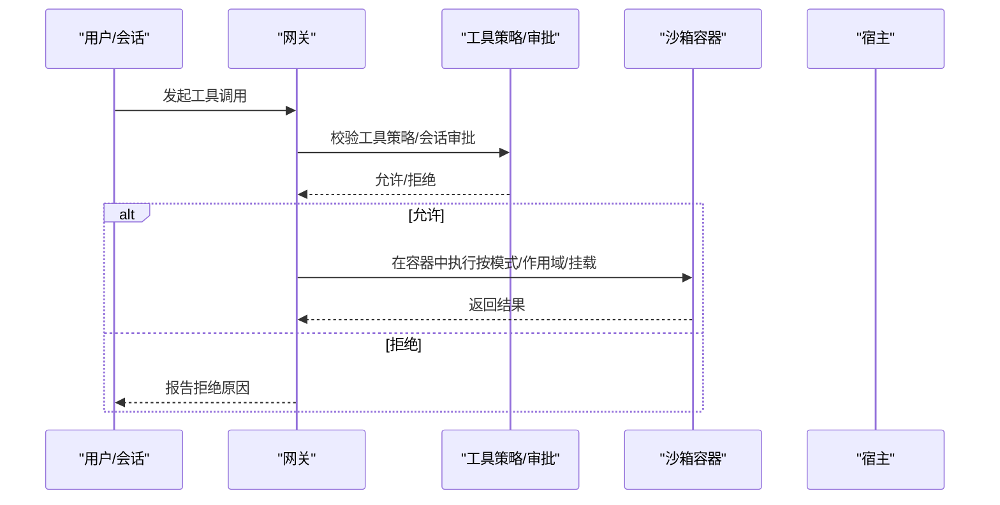
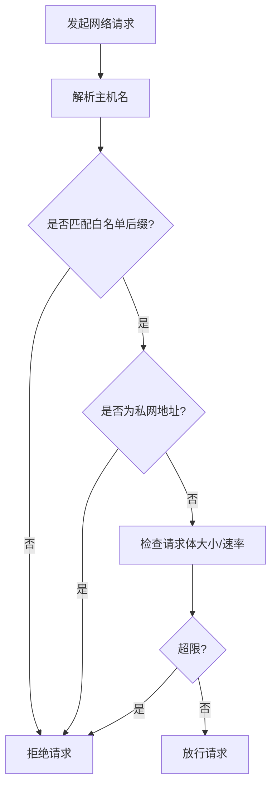
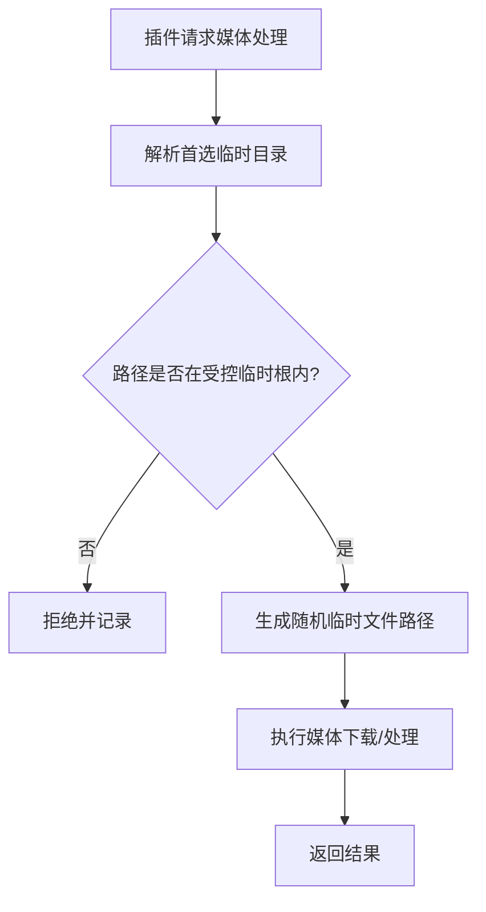
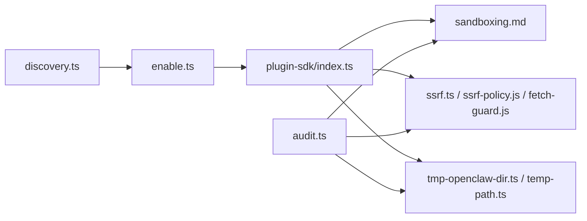

# 插件安全模型

<cite>
**本文引用的文件**
- [SECURITY.md](file://SECURITY.md)
- [sandboxing.md](file://docs/gateway/sandboxing.md)
- [sandbox-vs-tool-policy-vs-elevated.md](file://docs/gateway/sandbox-vs-tool-policy-vs-elevated.md)
- [sandbox.md](file://docs/cli/sandbox.md)
- [index.ts](file://src/plugin-sdk/index.ts)
- [discovery.ts](file://src/plugins/discovery.ts)
- [enable.ts](file://src/plugins/enable.ts)
- [ssrf.js](file://src/plugin-sdk/ssrf.js)
- [ssrf-policy.js](file://src/plugin-sdk/ssrf-policy.js)
- [fetch-guard.js](file://src/infra/net/fetch-guard.js)
- [ssrf.ts](file://src/infra/net/ssrf.ts)
- [dm-policy-shared.ts](file://src/security/dm-policy-shared.ts)
- [audit.ts](file://src/security/audit.ts)
- [fix.ts](file://src/security/fix.ts)
- [dangerous-config-flags.ts](file://src/security/dangerous-config-flags.ts)
- [dangerous-tools.ts](file://src/security/dangerous-tools.ts)
- [tmp-openclaw-dir.ts](file://src/infra/tmp-openclaw-dir.ts)
- [temp-path.ts](file://src/plugin-sdk/temp-path.ts)
- [check-no-random-messaging-tmp.mjs](file://scripts/check-no-random-messaging-tmp.mjs)
</cite>

## 目录

1. [简介](#简介)
2. [项目结构](#项目结构)
3. [核心组件](#核心组件)
4. [架构总览](#架构总览)
5. [详细组件分析](#详细组件分析)
6. [依赖关系分析](#依赖关系分析)
7. [性能与安全权衡](#性能与安全权衡)
8. [故障排查与应急响应](#故障排查与应急响应)
9. [结论](#结论)
10. [附录：配置清单与最佳实践](#附录配置清单与最佳实践)

## 简介

本文件系统性阐述 OpenClaw 插件安全模型，覆盖插件系统的信任边界、权限控制、访问隔离与沙箱机制，以及针对 SSRF、命令注入与资源访问的防护策略。文档同时给出安全审计、漏洞检测与风险评估方法，以及合规与运维建议，并提供安全事件响应与修复流程指引。

## 项目结构

围绕“插件安全”的关键代码与文档分布如下：

- 安全策略与信任模型：[SECURITY.md](file://SECURITY.md)
- 沙箱与执行隔离：[sandboxing.md](file://docs/gateway/sandboxing.md)、[sandbox-vs-tool-policy-vs-elevated.md](file://docs/gateway/sandbox-vs-tool-policy-vs-elevated.md)、[sandbox.md](file://docs/cli/sandbox.md)
- 插件 SDK 与运行时接口：[index.ts](file://src/plugin-sdk/index.ts)
- 插件发现与加载安全：[discovery.ts](file://src/plugins/discovery.ts)、[enable.ts](file://src/plugins/enable.ts)
- SSRF 防护与网络边界：[ssrf.js](file://src/plugin-sdk/ssrf.js)、[ssrf-policy.js](file://src/plugin-sdk/ssrf-policy.js)、[fetch-guard.js](file://src/infra/net/fetch-guard.js)、[ssrf.ts](file://src/infra/net/ssrf.ts)
- 安全审计与修复工具：[audit.ts](file://src/security/audit.ts)、[fix.ts](file://src/security/fix.ts)
- 危险配置与危险工具清单：[dangerous-config-flags.ts](file://src/security/dangerous-config-flags.ts)、[dangerous-tools.ts](file://src/security/dangerous-tools.ts)
- 临时目录与媒体隔离：[tmp-openclaw-dir.ts](file://src/infra/tmp-openclaw-dir.ts)、[temp-path.ts](file://src/plugin-sdk/temp-path.ts)、[check-no-random-messaging-tmp.mjs](file://scripts/check-no-random-messaging-tmp.mjs)

**图表来源**

- [discovery.ts](file://src/plugins/discovery.ts)
- [enable.ts](file://src/plugins/enable.ts)
- [index.ts](file://src/plugin-sdk/index.ts)
- [sandboxing.md](file://docs/gateway/sandboxing.md)
- [ssrf.ts](file://src/infra/net/ssrf.ts)
- [ssrf-policy.js](file://src/plugin-sdk/ssrf-policy.js)
- [fetch-guard.js](file://src/infra/net/fetch-guard.js)
- [tmp-openclaw-dir.ts](file://src/infra/tmp-openclaw-dir.ts)
- [temp-path.ts](file://src/plugin-sdk/temp-path.ts)
- [audit.ts](file://src/security/audit.ts)
- [fix.ts](file://src/security/fix.ts)

**章节来源**

- [SECURITY.md](file://SECURITY.md)
- [sandboxing.md](file://docs/gateway/sandboxing.md)
- [sandbox-vs-tool-policy-vs-elevated.md](file://docs/gateway/sandbox-vs-tool-policy-vs-elevated.md)
- [sandbox.md](file://docs/cli/sandbox.md)
- [index.ts](file://src/plugin-sdk/index.ts)
- [discovery.ts](file://src/plugins/discovery.ts)
- [enable.ts](file://src/plugins/enable.ts)
- [ssrf.ts](file://src/infra/net/ssrf.ts)
- [ssrf-policy.js](file://src/plugin-sdk/ssrf-policy.js)
- [fetch-guard.js](file://src/infra/net/fetch-guard.js)
- [tmp-openclaw-dir.ts](file://src/infra/tmp-openclaw-dir.ts)
- [temp-path.ts](file://src/plugin-sdk/temp-path.ts)
- [audit.ts](file://src/security/audit.ts)
- [fix.ts](file://src/security/fix.ts)

## 核心组件

- 插件发现与加载安全
  - 基于路径真实化、根目录约束、权限检查与硬链接拒绝等策略，阻断越界与高危候选。
  - 参考实现：[discovery.ts](file://src/plugins/discovery.ts)
- 插件启用与白名单
  - 启用前进行 denylist 校验与 allowlist 规范化，确保仅受控插件进入运行时。
  - 参考实现：[enable.ts](file://src/plugins/enable.ts)
- 插件运行时接口与能力边界
  - 提供通道适配、鉴权、Webhook、SSRF 防护、临时路径管理等安全相关能力。
  - 参考实现：[index.ts](file://src/plugin-sdk/index.ts)
- 沙箱执行与隔离
  - 通过容器化执行工具调用，限制文件系统与进程访问；支持模式、作用域、工作区挂载与浏览器沙箱。
  - 参考文档：[sandboxing.md](file://docs/gateway/sandboxing.md)、[sandbox-vs-tool-policy-vs-elevated.md](file://docs/gateway/sandbox-vs-tool-policy-vs-elevated.md)、[sandbox.md](file://docs/cli/sandbox.md)
- SSRF 防护与网络边界
  - 主机名后缀白名单、私网地址拦截、请求体限制与异常追踪，防止内网探测与 SSRF。
  - 参考实现：[ssrf.ts](file://src/infra/net/ssrf.ts)、[ssrf-policy.js](file://src/plugin-sdk/ssrf-policy.js)、[fetch-guard.js](file://src/infra/net/fetch-guard.js)
- 临时目录与媒体隔离
  - 统一的临时根目录与随机路径生成，避免任意主机路径暴露为可信媒体根。
  - 参考实现：[tmp-openclaw-dir.ts](file://src/infra/tmp-openclaw-dir.ts)、[temp-path.ts](file://src/plugin-sdk/temp-path.ts)、[check-no-random-messaging-tmp.mjs](file://scripts/check-no-random-messaging-tmp.mjs)
- 安全审计与修复
  - 提供深度审计、修复建议与自动修复工具，覆盖配置、工具策略与潜在危险项。
  - 参考实现：[audit.ts](file://src/security/audit.ts)、[fix.ts](file://src/security/fix.ts)

**章节来源**

- [discovery.ts](file://src/plugins/discovery.ts)
- [enable.ts](file://src/plugins/enable.ts)
- [index.ts](file://src/plugin-sdk/index.ts)
- [sandboxing.md](file://docs/gateway/sandboxing.md)
- [sandbox-vs-tool-policy-vs-elevated.md](file://docs/gateway/sandbox-vs-tool-policy-vs-elevated.md)
- [sandbox.md](file://docs/cli/sandbox.md)
- [ssrf.ts](file://src/infra/net/ssrf.ts)
- [ssrf-policy.js](file://src/plugin-sdk/ssrf-policy.js)
- [fetch-guard.js](file://src/infra/net/fetch-guard.js)
- [tmp-openclaw-dir.ts](file://src/infra/tmp-openclaw-dir.ts)
- [temp-path.ts](file://src/plugin-sdk/temp-path.ts)
- [check-no-random-messaging-tmp.mjs](file://scripts/check-no-random-messaging-tmp.mjs)
- [audit.ts](file://src/security/audit.ts)
- [fix.ts](file://src/security/fix.ts)

## 架构总览

OpenClaw 的插件安全架构以“信任边界清晰、最小权限、多重隔离”为核心设计原则：

- 信任边界
  - 插件作为“受信计算基”在网关进程中加载，具备与宿主相同的 OS 权限；安装/启用即授予本地代码同等信任。
  - 参考：[SECURITY.md](file://SECURITY.md)
- 访问隔离
  - 工具执行默认在宿主运行；可通过沙箱容器限制文件系统与网络访问。
  - 参考：[sandboxing.md](file://docs/gateway/sandboxing.md)
- 权限控制
  - 工具策略（allow/deny）、会话级执行审批、提升执行（elevated）为可选且受限的逃生门。
  - 参考：[sandbox-vs-tool-policy-vs-elevated.md](file://docs/gateway/sandbox-vs-tool-policy-vs-elevated.md)
- 资源访问控制
  - 临时目录与媒体处理遵循统一根目录与随机路径策略，避免任意主机路径成为可信媒体根。
  - 参考：[tmp-openclaw-dir.ts](file://src/infra/tmp-openclaw-dir.ts)、[temp-path.ts](file://src/plugin-sdk/temp-path.ts)
- SSRF 防护
  - 请求发起前进行主机名白名单校验与私网地址拦截，结合请求体大小限制与异常追踪。
  - 参考：[ssrf.ts](file://src/infra/net/ssrf.ts)、[ssrf-policy.js](file://src/plugin-sdk/ssrf-policy.js)、[fetch-guard.js](file://src/infra/net/fetch-guard.js)

**图表来源**

- [SECURITY.md](file://SECURITY.md)
- [sandboxing.md](file://docs/gateway/sandboxing.md)
- [sandbox-vs-tool-policy-vs-elevated.md](file://docs/gateway/sandbox-vs-tool-policy-vs-elevated.md)
- [index.ts](file://src/plugin-sdk/index.ts)
- [tmp-openclaw-dir.ts](file://src/infra/tmp-openclaw-dir.ts)
- [temp-path.ts](file://src/plugin-sdk/temp-path.ts)
- [ssrf.ts](file://src/infra/net/ssrf.ts)
- [ssrf-policy.js](file://src/plugin-sdk/ssrf-policy.js)
- [fetch-guard.js](file://src/infra/net/fetch-guard.js)

## 详细组件分析

### 插件发现与加载安全（路径安全与候选阻断）

- 关键机制
  - 使用安全 realpath 与路径包含判断，阻断“逃逸根目录”的插件候选。
  - 对世界可写目录与可疑属主进行阻断，降低提权与伪装风险。
  - 包装读取 package.json 时拒绝硬链接，避免符号链接陷阱。
- 典型风险与缓解
  - 越界路径：通过根目录真实化与包含判断阻断。
  - 权限滥用：世界可写与非预期属主直接告警并阻断。
  - 硬链接/符号链接：拒绝硬链接读取包清单，避免被替换目标劫持。
- 适用场景
  - 插件目录扫描、包入口解析、候选收集阶段。

**图表来源**

- [discovery.ts](file://src/plugins/discovery.ts)

**章节来源**

- [discovery.ts](file://src/plugins/discovery.ts)

### 插件启用与白名单（准入控制）

- 关键机制
  - 启用前检查全局禁用、denylist 与 allowlist 规范化，确保仅允许受控插件生效。
- 风险与缓解
  - 未授权插件：denylist 与 allowlist 双重拦截。
  - 配置错误：规范化 ID 与内置通道别名映射，避免误判。

**图表来源**

- [enable.ts](file://src/plugins/enable.ts)

**章节来源**

- [enable.ts](file://src/plugins/enable.ts)

### 沙箱执行与隔离（模式/作用域/工作区挂载）

- 关键机制
  - 模式：off/non-main/all 控制何时启用沙箱。
  - 作用域：session/agent/shared 决定容器数量与复用策略。
  - 工作区挂载：none/ro/rw 控制对工作区的可见性与写入能力。
  - 浏览器沙箱：独立网络、容器化启动参数与可选 CDP 入口限制。
- 风险与缓解
  - 进程/文件系统越权：通过容器网络与挂载策略限制。
  - 绑定挂载绕过：默认拒绝危险宿主路径，敏感目录只读。
  - 网络暴露：默认无网络或专用网络，必要时显式开启。

**图表来源**

- [sandboxing.md](file://docs/gateway/sandboxing.md)
- [sandbox-vs-tool-policy-vs-elevated.md](file://docs/gateway/sandbox-vs-tool-policy-vs-elevated.md)
- [sandbox.md](file://docs/cli/sandbox.md)

**章节来源**

- [sandboxing.md](file://docs/gateway/sandboxing.md)
- [sandbox-vs-tool-policy-vs-elevated.md](file://docs/gateway/sandbox-vs-tool-policy-vs-elevated.md)
- [sandbox.md](file://docs/cli/sandbox.md)

### SSRF 攻击防护（主机名白名单与私网拦截）

- 关键机制
  - 主机名后缀白名单策略，仅允许受信域名后缀。
  - 私网地址拦截，阻断对内网地址的直接访问。
  - 请求体大小限制与异常计数器，降低资源滥用风险。
- 风险与缓解
  - 内网探测/SSRF：白名单+私网拦截双保险。
  - 大量请求/异常：速率限制与异常追踪，辅助定位问题。

**图表来源**

- [ssrf.ts](file://src/infra/net/ssrf.ts)
- [ssrf-policy.js](file://src/plugin-sdk/ssrf-policy.js)
- [fetch-guard.js](file://src/infra/net/fetch-guard.js)

**章节来源**

- [ssrf.ts](file://src/infra/net/ssrf.ts)
- [ssrf-policy.js](file://src/plugin-sdk/ssrf-policy.js)
- [fetch-guard.js](file://src/infra/net/fetch-guard.js)

### 命令注入防范（工具策略与执行审批）

- 关键机制
  - 工具策略（allow/deny）与会话级执行审批，阻止不受控命令执行。
  - 提升执行（elevated）为可选逃生门，需严格授权与审批。
- 风险与缓解
  - 未授权命令：工具策略硬拦截。
  - 误操作：审批 UI 与细粒度上下文绑定，降低误触风险。

**章节来源**

- [sandbox-vs-tool-policy-vs-elevated.md](file://docs/gateway/sandbox-vs-tool-policy-vs-elevated.md)

### 资源访问控制（临时目录与媒体隔离）

- 关键机制
  - 统一的 OpenClaw 临时根目录，仅允许绝对路径位于该根下。
  - 插件使用 SDK 提供的随机路径生成与下载路径管理，避免任意主机路径成为可信媒体根。
  - 脚本检查禁止在消息通道中使用随机临时路径，降低误用风险。
- 风险与缓解
  - 媒体路径越权：仅允许受控临时根，拒绝任意主机路径。
  - 误用风险：脚本检查与 SDK 辅助函数共同降低误用概率。

**图表来源**

- [tmp-openclaw-dir.ts](file://src/infra/tmp-openclaw-dir.ts)
- [temp-path.ts](file://src/plugin-sdk/temp-path.ts)
- [check-no-random-messaging-tmp.mjs](file://scripts/check-no-random-messaging-tmp.mjs)

**章节来源**

- [tmp-openclaw-dir.ts](file://src/infra/tmp-openclaw-dir.ts)
- [temp-path.ts](file://src/plugin-sdk/temp-path.ts)
- [check-no-random-messaging-tmp.mjs](file://scripts/check-no-random-messaging-tmp.mjs)

### 插件间信任边界与数据加密

- 信任边界
  - 插件作为受信代码与网关同处一个操作者边界；跨插件隔离主要依赖工具策略与会话隔离。
  - 参考：[SECURITY.md](file://SECURITY.md)
- 数据加密与隐私
  - 文档未提供专门的“插件间数据加密”实现细节；建议通过 HTTPS 传输、最小化日志与会话隔离降低风险。

**章节来源**

- [SECURITY.md](file://SECURITY.md)

### 安全审计、漏洞检测与风险评估

- 安全审计
  - 提供深度审计命令，输出配置、工具策略与潜在危险项的诊断报告。
  - 参考：[audit.ts](file://src/security/audit.ts)
- 漏洞检测
  - 结合危险配置标志与危险工具清单，识别高风险配置与工具组合。
  - 参考：[dangerous-config-flags.ts](file://src/security/dangerous-config-flags.ts)、[dangerous-tools.ts](file://src/security/dangerous-tools.ts)
- 风险评估
  - 将审计结果与修复建议结合，形成可操作的风险处置清单。

**章节来源**

- [audit.ts](file://src/security/audit.ts)
- [dangerous-config-flags.ts](file://src/security/dangerous-config-flags.ts)
- [dangerous-tools.ts](file://src/security/dangerous-tools.ts)

### 安全事件响应与修复流程

- 响应流程
  - 事件发现 → 证据保全 → 影响范围评估 → 修复与回滚 → 复盘与加固。
- 修复工具
  - 提供修复建议与自动修复能力，辅助快速恢复。
  - 参考：[fix.ts](file://src/security/fix.ts)
- 报告与沟通
  - 遵循安全策略中的报告流程与接受门槛，确保高质量与可复现性。

**章节来源**

- [fix.ts](file://src/security/fix.ts)
- [SECURITY.md](file://SECURITY.md)

## 依赖关系分析

- 插件发现依赖路径安全与包清单解析，阻断越界与硬链接风险。
- 插件启用依赖工具策略与白名单，确保仅受控插件生效。
- 插件运行时接口依赖沙箱、SSRF 防护与临时目录，形成多层隔离。
- 安全审计贯穿上述各环节，提供持续监控与修复闭环。

**图表来源**

- [discovery.ts](file://src/plugins/discovery.ts)
- [enable.ts](file://src/plugins/enable.ts)
- [index.ts](file://src/plugin-sdk/index.ts)
- [sandboxing.md](file://docs/gateway/sandboxing.md)
- [ssrf.ts](file://src/infra/net/ssrf.ts)
- [ssrf-policy.js](file://src/plugin-sdk/ssrf-policy.js)
- [fetch-guard.js](file://src/infra/net/fetch-guard.js)
- [tmp-openclaw-dir.ts](file://src/infra/tmp-openclaw-dir.ts)
- [temp-path.ts](file://src/plugin-sdk/temp-path.ts)
- [audit.ts](file://src/security/audit.ts)

**章节来源**

- [discovery.ts](file://src/plugins/discovery.ts)
- [enable.ts](file://src/plugins/enable.ts)
- [index.ts](file://src/plugin-sdk/index.ts)
- [sandboxing.md](file://docs/gateway/sandboxing.md)
- [ssrf.ts](file://src/infra/net/ssrf.ts)
- [ssrf-policy.js](file://src/plugin-sdk/ssrf-policy.js)
- [fetch-guard.js](file://src/infra/net/fetch-guard.js)
- [tmp-openclaw-dir.ts](file://src/infra/tmp-openclaw-dir.ts)
- [temp-path.ts](file://src/plugin-sdk/temp-path.ts)
- [audit.ts](file://src/security/audit.ts)

## 性能与安全权衡

- 沙箱容器带来额外开销，但显著降低工具执行风险；建议在高风险工具与生产环境启用。
- 审计与修复工具可自动化减少人工干预成本，但需平衡“过度修复”与“修复不足”。

## 故障排查与应急响应

- 常见问题
  - 插件未加载：检查发现缓存、路径权限与 denylist。
  - 工具被拒绝：检查工具策略、会话审批与沙箱策略。
  - SSRF 被拒：检查主机名白名单与私网拦截规则。
  - 媒体路径失败：确认临时根与随机路径生成逻辑。
- 应急步骤
  - 使用审计命令定位问题；必要时临时放宽策略进行验证；修复后回归测试。

**章节来源**

- [discovery.ts](file://src/plugins/discovery.ts)
- [sandbox-vs-tool-policy-vs-elevated.md](file://docs/gateway/sandbox-vs-tool-policy-vs-elevated.md)
- [ssrf.ts](file://src/infra/net/ssrf.ts)
- [tmp-openclaw-dir.ts](file://src/infra/tmp-openclaw-dir.ts)
- [audit.ts](file://src/security/audit.ts)

## 结论

OpenClaw 的插件安全模型以“明确的信任边界、严格的准入控制、多层隔离与持续审计”为核心，既满足插件生态的灵活性，又有效降低越权与供应链风险。通过沙箱、工具策略、执行审批与 SSRF 防护等手段，系统在个人助理场景下提供了可操作的安全保障。

## 附录：配置清单与最佳实践

- 沙箱配置要点
  - 默认关闭沙箱，仅在高风险工具与生产环境启用；优先使用 non-main 或 all 模式。
  - 工作区挂载采用 ro 或 none，避免写入风险。
  - 浏览器沙箱使用专用网络与 CDP 入口限制。
  - 参考：[sandboxing.md](file://docs/gateway/sandboxing.md)、[sandbox.md](file://docs/cli/sandbox.md)
- 插件启用与白名单
  - 明确 plugins.allow 列表，启用前检查 denylist。
  - 参考：[enable.ts](file://src/plugins/enable.ts)
- SSRF 防护
  - 配置主机名后缀白名单；启用私网地址拦截；限制请求体大小与速率。
  - 参考：[ssrf-policy.js](file://src/plugin-sdk/ssrf-policy.js)、[fetch-guard.js](file://src/infra/net/fetch-guard.js)
- 临时目录与媒体
  - 强制使用 SDK 提供的临时路径生成；避免在消息通道中使用随机临时路径。
  - 参考：[tmp-openclaw-dir.ts](file://src/infra/tmp-openclaw-dir.ts)、[temp-path.ts](file://src/plugin-sdk/temp-path.ts)、[check-no-random-messaging-tmp.mjs](file://scripts/check-no-random-messaging-tmp.mjs)
- 安全审计与修复
  - 定期运行审计命令；根据修复建议逐步加固；保留修复前后对比。
  - 参考：[audit.ts](file://src/security/audit.ts)、[fix.ts](file://src/security/fix.ts)

**章节来源**

- [sandboxing.md](file://docs/gateway/sandboxing.md)
- [sandbox.md](file://docs/cli/sandbox.md)
- [enable.ts](file://src/plugins/enable.ts)
- [ssrf-policy.js](file://src/plugin-sdk/ssrf-policy.js)
- [fetch-guard.js](file://src/infra/net/fetch-guard.js)
- [tmp-openclaw-dir.ts](file://src/infra/tmp-openclaw-dir.ts)
- [temp-path.ts](file://src/plugin-sdk/temp-path.ts)
- [check-no-random-messaging-tmp.mjs](file://scripts/check-no-random-messaging-tmp.mjs)
- [audit.ts](file://src/security/audit.ts)
- [fix.ts](file://src/security/fix.ts)
