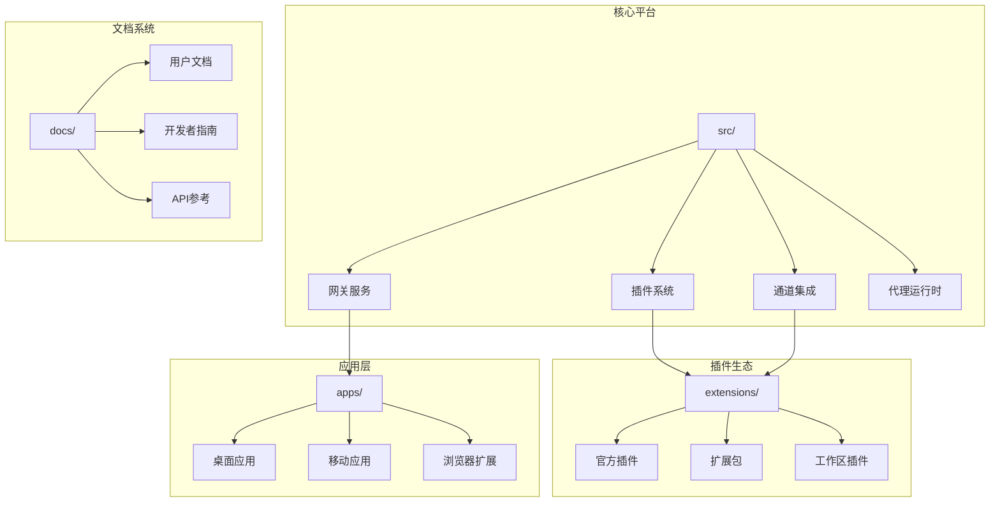
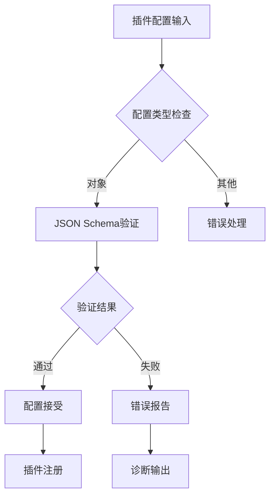
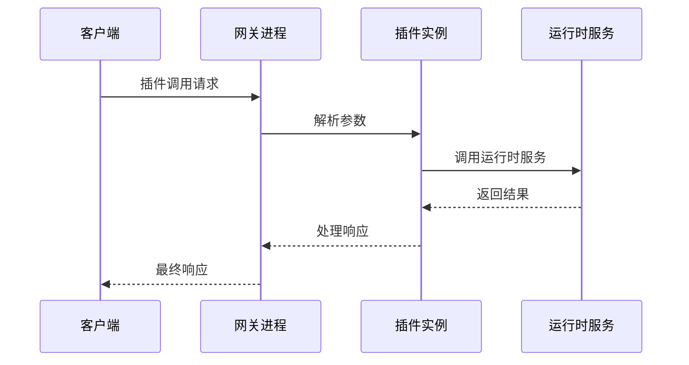
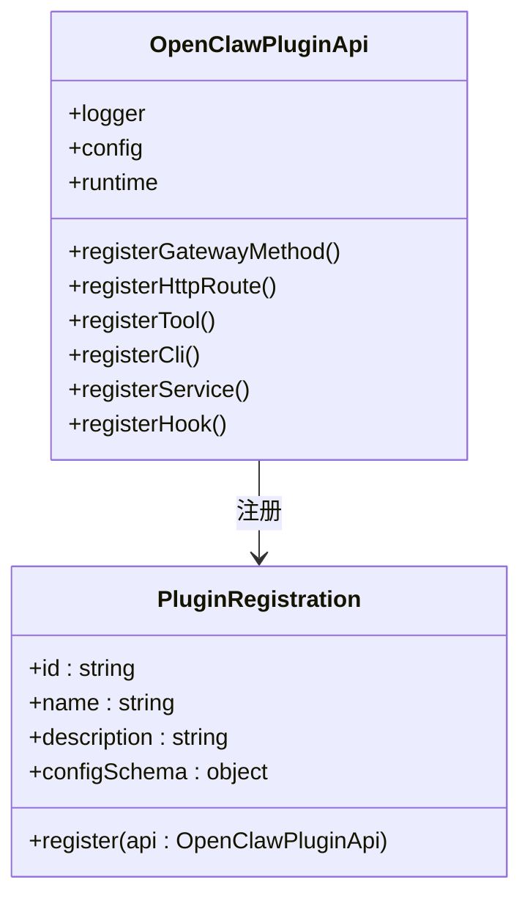
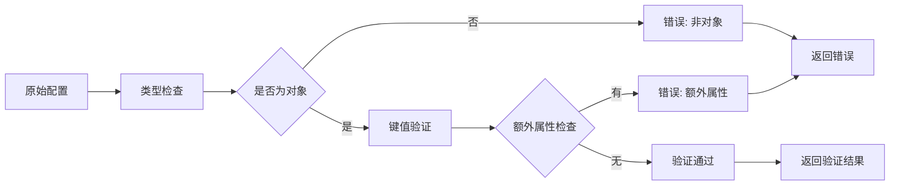
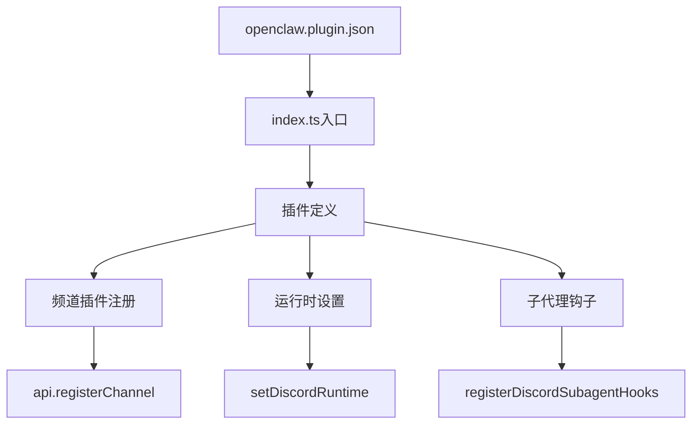
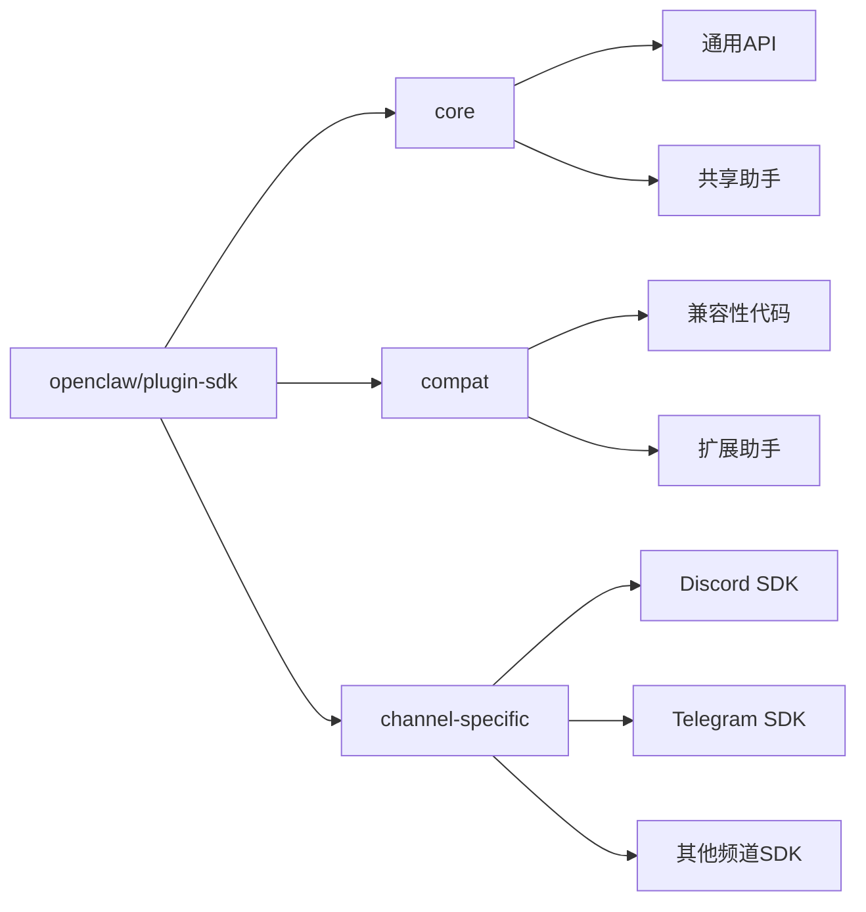

# 插件开发指南

<cite>
**本文档引用的文件**
- [README.md](file://README.md)
- [CONTRIBUTING.md](file://CONTRIBUTING.md)
- [docs/plugins/manifest.md](file://docs/plugins/manifest.md)
- [docs/tools/plugin.md](file://docs/tools/plugin.md)
- [package.json](file://package.json)
- [src/plugins/discovery.ts](file://src/plugins/discovery.ts)
- [src/plugins/config-schema.ts](file://src/plugins/config-schema.ts)
- [extensions/discord/openclaw.plugin.json](file://extensions/discord/openclaw.plugin.json)
- [extensions/discord/index.ts](file://extensions/discord/index.ts)
- [extensions/voice-call/openclaw.plugin.json](file://extensions/voice-call/openclaw.plugin.json)
- [extensions/voice-call/index.ts](file://extensions/voice-call/index.ts)
</cite>

## 目录

1. [简介](#简介)
2. [项目结构](#项目结构)
3. [核心组件](#核心组件)
4. [架构概览](#架构概览)
5. [详细组件分析](#详细组件分析)
6. [依赖分析](#依赖分析)
7. [性能考虑](#性能考虑)
8. [故障排除指南](#故障排除指南)
9. [结论](#结论)
10. [附录](#附录)

## 简介

OpenClaw是一个可扩展的个人AI助手平台，支持多渠道消息传递和语音通话功能。本指南为开发者提供从零开始创建OpenClaw插件的完整流程，包括环境搭建、项目初始化、代码编写、调试测试和发布部署。

OpenClaw插件系统采用模块化设计，通过TypeScript模块扩展核心功能，支持网关RPC方法、HTTP路由、代理工具、CLI命令等多种扩展点。所有插件都必须提供严格的配置验证和安全检查机制。

## 项目结构

OpenClaw项目采用清晰的模块化架构，主要包含以下关键目录：

**图表来源**

- [README.md:185-240](file://README.md#L185-L240)
- [package.json:23-34](file://package.json#L23-L34)

**章节来源**

- [README.md:185-240](file://README.md#L185-L240)
- [package.json:23-34](file://package.json#L23-L34)

## 核心组件

### 插件发现与加载系统

OpenClaw的插件发现系统支持多种插件源，按优先级顺序扫描：

1. **配置路径** (`plugins.load.paths`)
2. **工作区扩展** (`<workspace>/.openclaw/extensions/`)
3. **全局扩展** (`~/.openclaw/extensions/`)
4. **捆绑扩展** (`<openclaw>/extensions/`)

每个插件必须包含`openclaw.plugin.json`清单文件，用于配置验证和元数据声明。

### 配置验证系统

插件配置采用严格的JSON Schema验证，确保配置的安全性和正确性：

**图表来源**

- [src/plugins/config-schema.ts:13-33](file://src/plugins/config-schema.ts#L13-L33)
- [docs/plugins/manifest.md:47-63](file://docs/plugins/manifest.md#L47-L63)

**章节来源**

- [src/plugins/discovery.ts:618-712](file://src/plugins/discovery.ts#L618-L712)
- [src/plugins/config-schema.ts:13-33](file://src/plugins/config-schema.ts#L13-L33)
- [docs/plugins/manifest.md:47-63](file://docs/plugins/manifest.md#L47-L63)

## 架构概览

OpenClaw插件系统采用"受信任代码"模型，插件在网关进程中运行，享有与核心相同的权限级别。系统通过严格的验证和安全检查确保插件的安全性。

**图表来源**

- [docs/tools/plugin.md:78-96](file://docs/tools/plugin.md#L78-L96)
- [docs/tools/plugin.md:484-521](file://docs/tools/plugin.md#L484-L521)

## 详细组件分析

### 插件清单文件结构

每个插件都必须提供完整的`openclaw.plugin.json`清单文件，包含以下必需字段：

| 字段名         | 类型   | 必需 | 描述                   |
| -------------- | ------ | ---- | ---------------------- |
| `id`           | string | 是   | 插件唯一标识符         |
| `configSchema` | object | 是   | JSON Schema配置模式    |
| `kind`         | string | 否   | 插件类型（如"memory"） |
| `channels`     | array  | 否   | 支持的频道列表         |
| `providers`    | array  | 否   | 支持的提供商列表       |
| `skills`       | array  | 否   | 技能目录列表           |
| `name`         | string | 否   | 显示名称               |
| `description`  | string | 否   | 简短描述               |

**章节来源**

- [docs/plugins/manifest.md:18-46](file://docs/plugins/manifest.md#L18-L46)

### 插件注册API

插件通过统一的API接口注册各种功能：

**图表来源**

- [docs/tools/plugin.md:484-521](file://docs/tools/plugin.md#L484-L521)
- [extensions/discord/index.ts:7-19](file://extensions/discord/index.ts#L7-L19)

**章节来源**

- [docs/tools/plugin.md:484-521](file://docs/tools/plugin.md#L484-L521)
- [extensions/discord/index.ts:7-19](file://extensions/discord/index.ts#L7-L19)

### 配置验证实现

配置验证系统确保插件配置的安全性和完整性：

**图表来源**

- [src/plugins/config-schema.ts:13-33](file://src/plugins/config-schema.ts#L13-L33)

**章节来源**

- [src/plugins/config-schema.ts:13-33](file://src/plugins/config-schema.ts#L13-L33)

### 实际插件示例分析

以Discord插件为例，展示完整的插件实现：

**图表来源**

- [extensions/discord/openclaw.plugin.json:1-10](file://extensions/discord/openclaw.plugin.json#L1-L10)
- [extensions/discord/index.ts:7-19](file://extensions/discord/index.ts#L7-L19)

**章节来源**

- [extensions/discord/openclaw.plugin.json:1-10](file://extensions/discord/openclaw.plugin.json#L1-L10)
- [extensions/discord/index.ts:7-19](file://extensions/discord/index.ts#L7-L19)

## 依赖分析

### 核心依赖关系

OpenClaw插件系统依赖于以下关键库和框架：

| 依赖类型 | 包名              | 版本    | 用途               |
| -------- | ----------------- | ------- | ------------------ |
| 运行时   | jiti              | ^2.6.1  | TypeScript模块加载 |
| HTTP框架 | hono              | 4.12.7  | Web服务器和路由    |
| 类型验证 | @sinclair/typebox | 0.34.48 | 类型安全验证       |
| 配置管理 | ajv               | ^8.18.0 | JSON Schema验证    |
| 日志系统 | tslog             | ^4.10.2 | 结构化日志记录     |

### 插件SDK结构

**图表来源**

- [package.json:39-215](file://package.json#L39-L215)

**章节来源**

- [package.json:39-215](file://package.json#L39-L215)

## 性能考虑

### 插件发现缓存

为了提高启动性能，OpenClaw实现了智能缓存机制：

- **发现缓存**: 默认缓存时间为1秒，减少重复扫描开销
- **清单缓存**: 缓存插件清单元数据，避免重复解析
- **缓存控制**: 通过环境变量控制缓存行为

### 内存管理

插件运行时内存管理遵循以下原则：

- **延迟初始化**: 插件服务按需启动，避免不必要的资源占用
- **连接池管理**: 对外部服务连接进行池化管理
- **资源清理**: 插件停止时自动清理所有分配的资源

## 故障排除指南

### 常见问题诊断

| 问题类型     | 症状               | 解决方案                      |
| ------------ | ------------------ | ----------------------------- |
| 插件未加载   | 插件不在可用列表中 | 检查openclaw.plugin.json格式  |
| 配置验证失败 | 配置保存时报错     | 使用JSON Schema验证器检查配置 |
| 权限问题     | 插件运行时权限不足 | 检查文件权限和所有权          |
| 依赖冲突     | 插件启动失败       | 检查npm依赖版本兼容性         |

### 调试技巧

1. **启用详细日志**: 使用`--verbose`标志获取详细的插件加载信息
2. **使用Doctor命令**: 运行`openclaw plugins doctor`检查插件状态
3. **隔离测试**: 将问题插件移出配置以确定问题范围
4. **版本回退**: 如果问题出现在更新后，回退到上一个稳定版本

**章节来源**

- [docs/tools/plugin.md:479-483](file://docs/tools/plugin.md#L479-L483)

## 结论

OpenClaw插件系统为开发者提供了强大而灵活的扩展能力。通过遵循本文档的指导，开发者可以快速创建高质量的插件，为OpenClaw生态系统增加新的功能。

关键成功因素包括：

- 严格遵守配置验证要求
- 充分测试插件在不同环境下的表现
- 关注性能和安全最佳实践
- 提供清晰的文档和示例

## 附录

### 开发环境设置

1. **Node.js版本**: 确保使用Node.js 22或更高版本
2. **包管理器**: 推荐使用pnpm作为包管理器
3. **开发工具**: 安装TypeScript编译器和相关开发工具

### 发布流程

1. **本地测试**: 在开发环境中充分测试插件功能
2. **代码审查**: 提交PR前进行代码审查
3. **文档更新**: 更新相关文档和README文件
4. **版本标记**: 按照语义化版本控制进行版本标记

### 社区贡献

- 参考贡献指南了解如何参与OpenClaw项目开发
- 加入Discord社区获取技术支持和讨论
- 查看现有插件实现学习最佳实践
