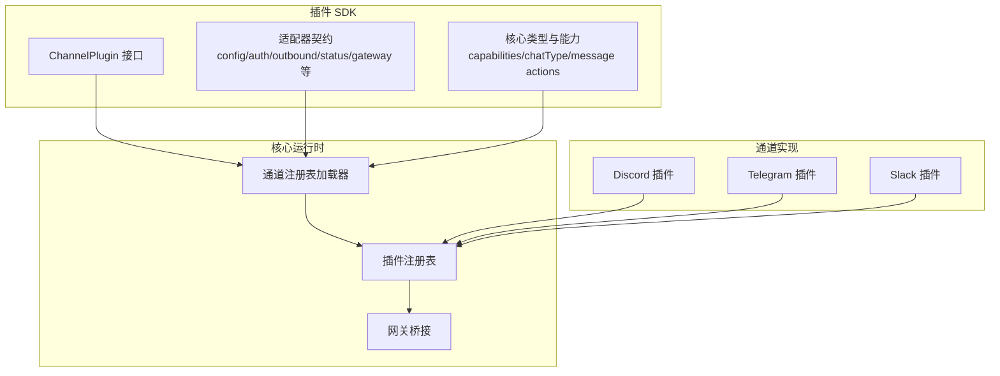
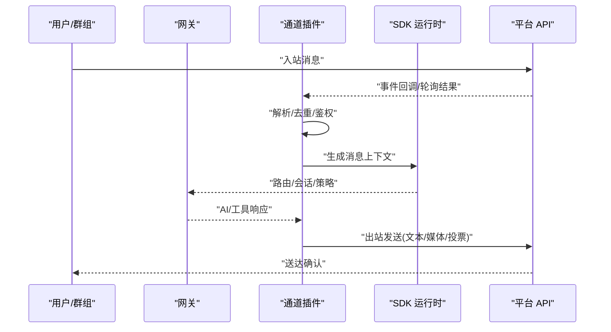
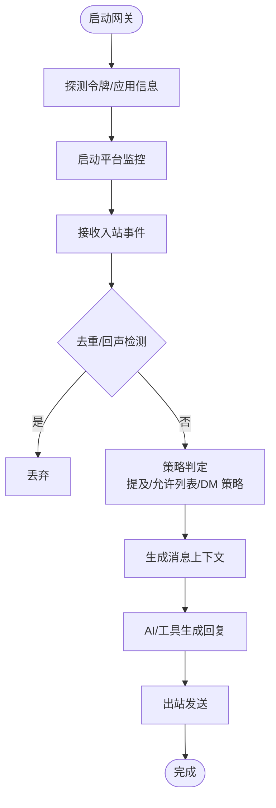
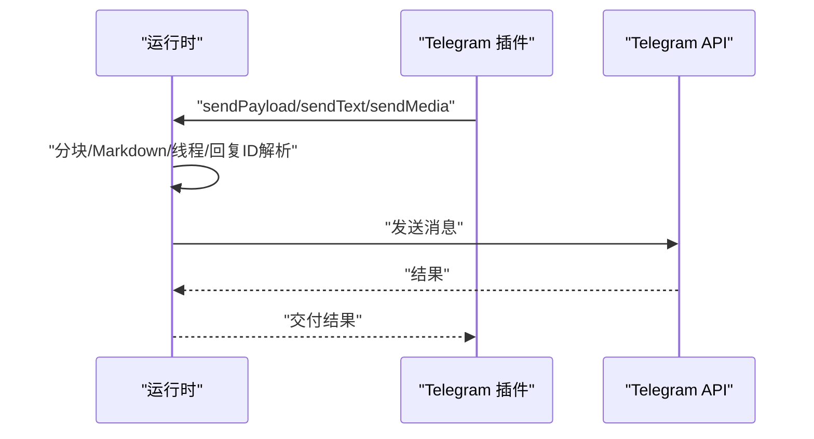
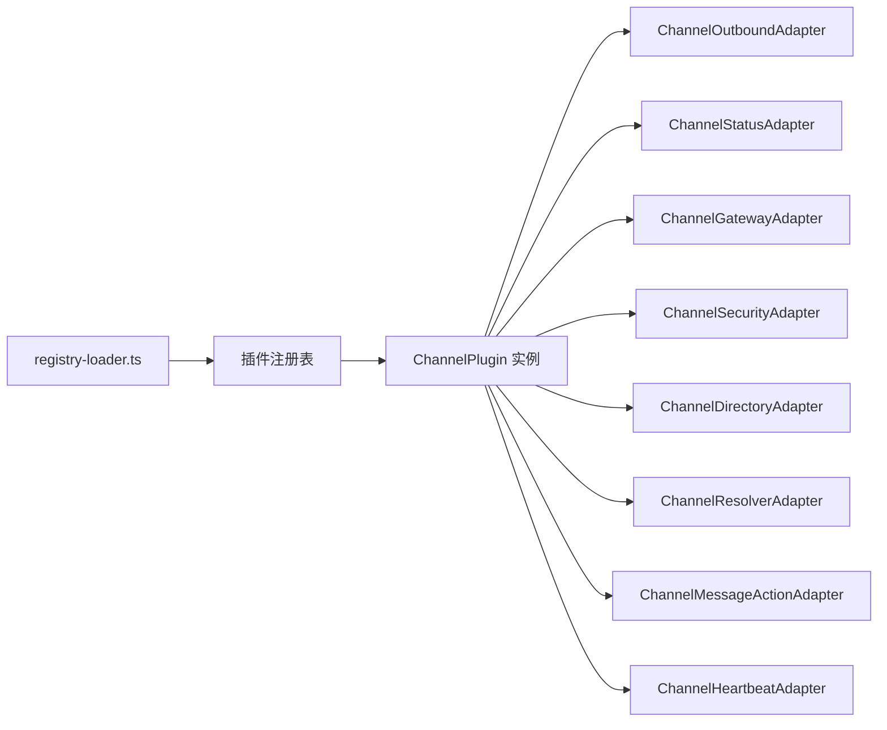

# 通道插件开发

<cite>
**本文引用的文件**
- [src/channels/plugins/types.plugin.ts](file://src/channels/plugins/types.plugin.ts)
- [src/channels/plugins/types.adapters.ts](file://src/channels/plugins/types.adapters.ts)
- [src/channels/plugins/types.core.ts](file://src/channels/plugins/types.core.ts)
- [src/channels/plugins/registry-loader.ts](file://src/channels/plugins/registry-loader.ts)
- [src/channels/plugins/load.ts](file://src/channels/plugins/load.ts)
- [src/channels/plugins/onboarding-types.ts](file://src/channels/plugins/onboarding-types.ts)
- [src/channels/plugins/message-action-names.ts](file://src/channels/plugins/message-action-names.ts)
- [src/channels/chat-type.ts](file://src/channels/chat-type.ts)
- [extensions/discord/index.ts](file://extensions/discord/index.ts)
- [extensions/discord/src/channel.ts](file://extensions/discord/src/channel.ts)
- [extensions/telegram/index.ts](file://extensions/telegram/index.ts)
- [extensions/telegram/src/channel.ts](file://extensions/telegram/src/channel.ts)
- [extensions/slack/index.ts](file://extensions/slack/index.ts)
- [extensions/slack/src/channel.ts](file://extensions/slack/src/channel.ts)
- [docs/plugins/manifest.md](file://docs/plugins/manifest.md)
- [docs/zh-CN/refactor/plugin-sdk.md](file://docs/zh-CN/refactor/plugin-sdk.md)
</cite>

## 目录

1. [简介](#简介)
2. [项目结构](#项目结构)
3. [核心组件](#核心组件)
4. [架构总览](#架构总览)
5. [详细组件分析](#详细组件分析)
6. [依赖关系分析](#依赖关系分析)
7. [性能考量](#性能考量)
8. [故障排查指南](#故障排查指南)
9. [结论](#结论)
10. [附录](#附录)

## 简介

本指南面向希望为 OpenClaw 开发“通道插件”的开发者，系统阐述通道插件的接口规范、实现模式、集成流程与最佳实践。内容覆盖消息接收/解析/转发、认证与权限管理、访问控制、配置与校验、错误处理与性能优化，并提供 Discord、Telegram、Slack 等主流平台的完整实现参考路径。

## 项目结构

OpenClaw 的通道插件体系由“插件 SDK + 核心运行时 + 具体通道实现”三层组成：

- 插件 SDK：定义统一的 ChannelPlugin 接口、适配器契约、能力模型与消息动作名称等。
- 核心运行时：负责加载插件、注册通道、桥接网关、状态采集与健康检查。
- 通道实现：各平台（如 Discord、Telegram、Slack）的具体插件，封装平台差异并对接 SDK。

图表来源

- [src/channels/plugins/types.plugin.ts:49-85](file://src/channels/plugins/types.plugin.ts#L49-L85)
- [src/channels/plugins/types.adapters.ts:1-384](file://src/channels/plugins/types.adapters.ts#L1-L384)
- [src/channels/plugins/types.core.ts:1-403](file://src/channels/plugins/types.core.ts#L1-L403)
- [src/channels/plugins/registry-loader.ts:1-35](file://src/channels/plugins/registry-loader.ts#L1-L35)
- [extensions/discord/src/channel.ts:74-463](file://extensions/discord/src/channel.ts#L74-L463)
- [extensions/telegram/src/channel.ts:120-587](file://extensions/telegram/src/channel.ts#L120-L587)
- [extensions/slack/src/channel.ts:107-475](file://extensions/slack/src/channel.ts#L107-L475)

章节来源

- [src/channels/plugins/types.plugin.ts:1-85](file://src/channels/plugins/types.plugin.ts#L1-L85)
- [src/channels/plugins/types.adapters.ts:1-384](file://src/channels/plugins/types.adapters.ts#L1-L384)
- [src/channels/plugins/types.core.ts:1-403](file://src/channels/plugins/types.core.ts#L1-L403)
- [src/channels/plugins/registry-loader.ts:1-35](file://src/channels/plugins/registry-loader.ts#L1-L35)

## 核心组件

- ChannelPlugin：通道插件的统一契约，包含元数据、能力、配置、适配器集合（认证、出站、状态、网关、目录、解析器、消息动作、心跳等）以及可选的 CLI 引导向导与代理工具。
- 适配器族：用于解耦平台差异，如 ChannelConfigAdapter、ChannelOutboundAdapter、ChannelStatusAdapter、ChannelGatewayAdapter、ChannelSecurityAdapter、ChannelDirectoryAdapter、ChannelResolverAdapter、ChannelMessageActionAdapter、ChannelHeartbeatAdapter 等。
- 能力与消息动作：通过 ChannelCapabilities 定义聊天类型、媒体、线程、投票等能力；通过 ChannelMessageActionName 列举消息动作集合。
- 注册与加载：通过 createChannelRegistryLoader 从插件注册表中按通道 ID 加载插件实例，具备缓存与注册表变更感知。

章节来源

- [src/channels/plugins/types.plugin.ts:49-85](file://src/channels/plugins/types.plugin.ts#L49-L85)
- [src/channels/plugins/types.adapters.ts:24-384](file://src/channels/plugins/types.adapters.ts#L24-L384)
- [src/channels/plugins/types.core.ts:181-194](file://src/channels/plugins/types.core.ts#L181-L194)
- [src/channels/plugins/message-action-names.ts:1-58](file://src/channels/plugins/message-action-names.ts#L1-L58)
- [src/channels/plugins/registry-loader.ts:9-35](file://src/channels/plugins/registry-loader.ts#L9-L35)

## 架构总览

通道插件的运行时交互分为“入站监听”和“出站投递”两大方向，同时贯穿“认证与权限”、“状态与审计”、“网关桥接”等环节。

图表来源

- [src/channels/plugins/types.adapters.ts:108-125](file://src/channels/plugins/types.adapters.ts#L108-L125)
- [src/channels/plugins/types.adapters.ts:275-289](file://src/channels/plugins/types.adapters.ts#L275-L289)
- [extensions/discord/src/channel.ts:416-461](file://extensions/discord/src/channel.ts#L416-L461)
- [extensions/telegram/src/channel.ts:485-532](file://extensions/telegram/src/channel.ts#L485-L532)
- [extensions/slack/src/channel.ts:454-473](file://extensions/slack/src/channel.ts#L454-L473)

## 详细组件分析

### 1) 插件接口与适配器契约

- ChannelPlugin：统一承载通道元数据、能力、配置、适配器集合与可选的代理工具。
- 适配器职责：
  - 配置：列出账户、解析账户、启用/禁用、描述快照、默认目标等。
  - 出站：选择投递模式（直连/网关/混合）、分片策略、文本长度限制、投票选项上限、目标解析与发送。
  - 状态：探针、审计、构建账户快照、收集问题。
  - 网关：启动/停止账户、二维码登录、登出。
  - 安全：DM 策略解析、警告收集。
  - 目录：自、同行、群组查询与实时列表。
  - 解析器：目标解析（用户/群组）。
  - 消息动作：动作清单、按钮/卡片支持、提取工具发送参数、执行动作。
  - 心跳：就绪检查、收件人解析。

章节来源

- [src/channels/plugins/types.plugin.ts:49-85](file://src/channels/plugins/types.plugin.ts#L49-L85)
- [src/channels/plugins/types.adapters.ts:24-384](file://src/channels/plugins/types.adapters.ts#L24-L384)

### 2) 入站消息处理流程（以 Discord 为例）

- 启动阶段：网关调用 gateway.startAccount，拉起平台监控，读取令牌并探测应用/机器人信息，记录意图状态与连接状态。
- 入站阶段：平台事件进入，插件进行去重、回声检测、策略判定（提及要求、允许列表、DM 政策），随后构造消息上下文交由运行时处理。
- 响应阶段：运行时根据路由/会话/策略生成回复，插件按能力选择直连发送或网关转发。

图表来源

- [extensions/discord/src/channel.ts:416-461](file://extensions/discord/src/channel.ts#L416-L461)
- [src/channels/plugins/types.adapters.ts:275-289](file://src/channels/plugins/types.adapters.ts#L275-L289)

章节来源

- [extensions/discord/src/channel.ts:416-461](file://extensions/discord/src/channel.ts#L416-L461)

### 3) 出站消息发送流程（以 Telegram 为例）

- 文本/媒体发送：插件解析回复到消息 ID 与线程 ID，调用运行时分块与 Markdown 处理，最终直连发送。
- 投票发送：根据平台能力与选项上限，构造投票消息并发送。
- 登出清理：清理配置中的令牌字段并写回配置文件。

图表来源

- [extensions/telegram/src/channel.ts:312-397](file://extensions/telegram/src/channel.ts#L312-L397)
- [extensions/telegram/src/channel.ts:533-585](file://extensions/telegram/src/channel.ts#L533-L585)

章节来源

- [extensions/telegram/src/channel.ts:312-397](file://extensions/telegram/src/channel.ts#L312-L397)
- [extensions/telegram/src/channel.ts:533-585](file://extensions/telegram/src/channel.ts#L533-L585)

### 4) 认证与权限管理

- 令牌来源与模式：不同通道支持多种令牌来源（环境变量、文件、显式输入），并区分只读/读写场景。
- DM 策略：基于账户作用域构建 DM 政策，支持白名单/黑名单/开放策略与条目归一化。
- 分组策略：解析提及要求与工具策略，结合群组允许列表进行路由与安全控制。
- 警告收集：针对开放路由/未配置允许列表等风险场景给出修复建议。

章节来源

- [src/channels/plugins/types.adapters.ts:378-383](file://src/channels/plugins/types.adapters.ts#L378-L383)
- [src/channels/plugins/types.adapters.ts:265-273](file://src/channels/plugins/types.adapters.ts#L265-L273)
- [extensions/slack/src/channel.ts:167-207](file://extensions/slack/src/channel.ts#L167-L207)
- [extensions/discord/src/channel.ts:115-157](file://extensions/discord/src/channel.ts#L115-L157)
- [extensions/telegram/src/channel.ts:187-216](file://extensions/telegram/src/channel.ts#L187-L216)

### 5) 消息动作与多媒体支持

- 动作清单：列举 send、broadcast、poll、react、reply、thread-_、channel-_ 等动作，供代理工具发现与调用。
- 按钮/卡片：部分通道支持组件渲染与模态表单提交。
- 多媒体：文本分块、Markdown 渲染、媒体 URL/本地路径处理、投票选项上限控制。

章节来源

- [src/channels/plugins/message-action-names.ts:1-58](file://src/channels/plugins/message-action-names.ts#L1-L58)
- [extensions/discord/src/channel.ts:168-173](file://extensions/discord/src/channel.ts#L168-L173)
- [extensions/telegram/src/channel.ts:312-397](file://extensions/telegram/src/channel.ts#L312-L397)
- [extensions/slack/src/channel.ts:270-281](file://extensions/slack/src/channel.ts#L270-L281)

### 6) 配置管理与清单校验

- 插件清单：每个插件必须提供 openclaw.plugin.json，包含 id、configSchema 等字段，用于严格配置校验。
- SDK 规范：插件 SDK 提供根别名与发布规范，确保版本稳定与类型安全。
- 通道配置：通过 createScopedChannelConfigBase 与 createScopedAccountConfigAccessors 统一账户级配置读写与快照。

章节来源

- [docs/plugins/manifest.md:9-76](file://docs/plugins/manifest.md#L9-L76)
- [docs/zh-CN/refactor/plugin-sdk.md:42-222](file://docs/zh-CN/refactor/plugin-sdk.md#L42-L222)
- [extensions/discord/src/channel.ts:65-72](file://extensions/discord/src/channel.ts#L65-L72)
- [extensions/telegram/src/channel.ts:103-110](file://extensions/telegram/src/channel.ts#L103-L110)
- [extensions/slack/src/channel.ts:98-105](file://extensions/slack/src/channel.ts#L98-L105)

### 7) 实现模式与集成流程（以三大平台为例）

#### Discord 插件

- 元数据与能力：支持 direct/channel/thread、投票、反应、线程、媒体与原生命令。
- 出站：直连发送文本/媒体/投票，设置回复到消息 ID 与静默模式。
- 状态：令牌探针、频道权限审计、构建账户快照。
- 网关：启动监控，记录意图状态与连接信息。

章节来源

- [extensions/discord/src/channel.ts:74-463](file://extensions/discord/src/channel.ts#L74-L463)
- [extensions/discord/index.ts:1-20](file://extensions/discord/index.ts#L1-L20)

#### Telegram 插件

- 元数据与能力：支持 direct/group/channel/thread、投票、反应、线程、媒体与原生命令。
- 出站：Markdown 分块、线程/回复 ID 解析、payload 多媒体发送。
- 登出：清理配置中的令牌字段并写回。
- 网关：启动监控，支持 webhook/polling 模式。

章节来源

- [extensions/telegram/src/channel.ts:120-587](file://extensions/telegram/src/channel.ts#L120-L587)
- [extensions/telegram/index.ts:1-18](file://extensions/telegram/index.ts#L1-L18)

#### Slack 插件

- 元数据与能力：支持 direct/channel/thread、反应、线程、媒体与原生命令。
- 出站：根据读写令牌选择发送，支持线程 TS。
- 状态：令牌探针、构建账户快照。
- 网关：启动监控，支持 slash 命令与媒体大小限制。

章节来源

- [extensions/slack/src/channel.ts:107-475](file://extensions/slack/src/channel.ts#L107-L475)
- [extensions/slack/index.ts:1-18](file://extensions/slack/index.ts#L1-L18)

## 依赖关系分析

- 插件加载：通过 createChannelRegistryLoader 从活动插件注册表中按通道 ID 获取插件实例，具备缓存与注册表变更感知。
- 适配器依赖：ChannelOutboundAdapter、ChannelStatusAdapter、ChannelGatewayAdapter 等在插件中组合使用，形成“契约-实现”解耦。
- 平台差异：各通道插件通过运行时函数（如 sendMessageDiscord、sendMessageTelegram、sendMessageSlack）屏蔽平台差异。

图表来源

- [src/channels/plugins/registry-loader.ts:1-35](file://src/channels/plugins/registry-loader.ts#L1-L35)
- [src/channels/plugins/types.adapters.ts:108-166](file://src/channels/plugins/types.adapters.ts#L108-L166)
- [src/channels/plugins/types.adapters.ts:275-344](file://src/channels/plugins/types.adapters.ts#L275-L344)

章节来源

- [src/channels/plugins/registry-loader.ts:1-35](file://src/channels/plugins/registry-loader.ts#L1-L35)
- [src/channels/plugins/load.ts:1-8](file://src/channels/plugins/load.ts#L1-L8)

## 性能考量

- 分片与限长：根据平台限制设置 textChunkLimit（如 Discord 2000、Telegram 4000、Slack 4000），避免超限失败。
- 并发与限流：在批量操作（如线程绑定、目录查询）中采用并发限制与限流策略，避免触发平台速率限制。
- 去重与回声抑制：入站消息应建立稳定去重键，避免重复处理与回环。
- 缓存与预热：注册表加载器具备缓存，减少重复解析成本；令牌探针与权限审计结果可短期复用。

## 故障排查指南

- 配置校验失败：检查 openclaw.plugin.json 与 configSchema 是否存在且符合规范。
- 令牌缺失/无效：核对令牌来源（环境变量/文件/输入），确认读写权限与只读模式配置。
- 权限不足：查看状态审计输出，确认频道/群组权限与意图设置（如 Discord Message Content Intent）。
- 登出后残留：确认登出流程是否清理了配置中的令牌字段并写回配置文件。
- 命令授权：当启用访问组时，命令需满足授权器配置；可通过门控策略调整“未配置时”的行为。

章节来源

- [docs/plugins/manifest.md:53-63](file://docs/plugins/manifest.md#L53-L63)
- [extensions/discord/src/channel.ts:416-461](file://extensions/discord/src/channel.ts#L416-L461)
- [extensions/telegram/src/channel.ts:533-585](file://extensions/telegram/src/channel.ts#L533-L585)
- [extensions/slack/src/channel.ts:454-473](file://extensions/slack/src/channel.ts#L454-L473)

## 结论

通过统一的 ChannelPlugin 接口与适配器契约，OpenClaw 将平台差异抽象为可插拔的通道实现。开发者只需聚焦于平台 API 的封装与运行时的集成，即可快速接入 Discord、Telegram、Slack 等主流平台，并在认证、权限、消息动作、多媒体与实时通信等方面获得一致体验与最佳实践支持。

## 附录

- 聊天类型：direct、group、channel（含 thread）。
- 消息动作名称：send、broadcast、poll、poll-vote、react、reactions、read、edit、unsend、reply、sendWithEffect、renameGroup、setGroupIcon、addParticipant、removeParticipant、leaveGroup、sendAttachment、delete、pin、unpin、list-pins、permissions、thread-create、thread-list、thread-reply、search、sticker、sticker-search、member-info、role-info、emoji-list、emoji-upload、sticker-upload、role-add、role-remove、channel-info、channel-list、channel-create、channel-edit、channel-delete、channel-move、category-create、category-edit、category-delete、topic-create、voice-status、event-list、event-create、timeout、kick、ban、set-presence、download-file。

章节来源

- [src/channels/chat-type.ts:1-19](file://src/channels/chat-type.ts#L1-L19)
- [src/channels/plugins/message-action-names.ts:1-58](file://src/channels/plugins/message-action-names.ts#L1-L58)
