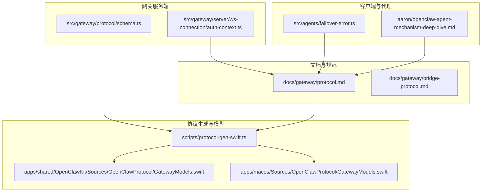
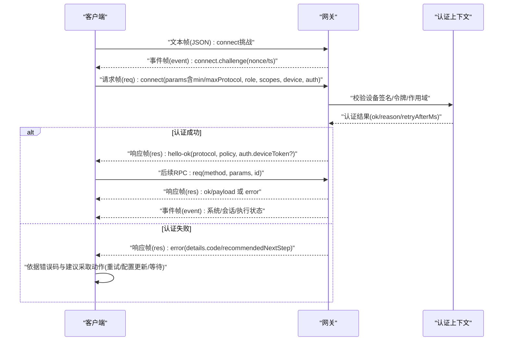
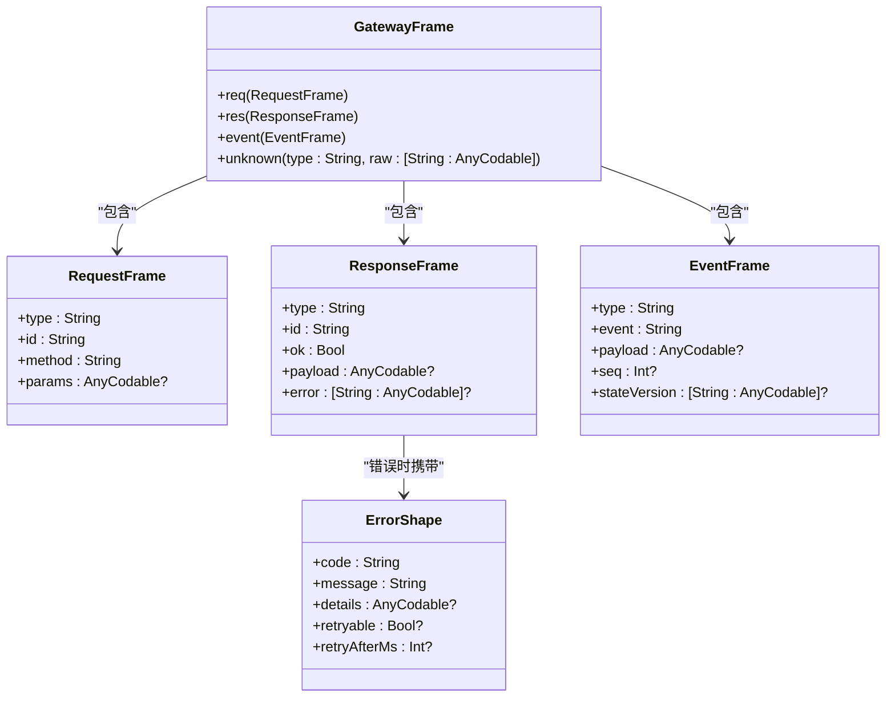
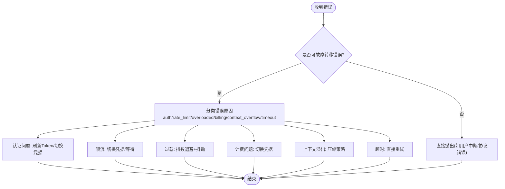
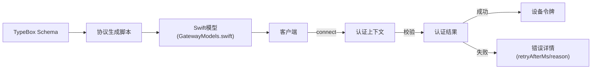

# 网关协议

<cite>
**本文引用的文件**
- [docs/gateway/protocol.md](file://docs/gateway/protocol.md)
- [docs/gateway/bridge-protocol.md](file://docs/gateway/bridge-protocol.md)
- [scripts/protocol-gen-swift.ts](file://scripts/protocol-gen-swift.ts)
- [src/gateway/protocol/schema.ts](file://src/gateway/protocol/schema.ts)
- [apps/macos/Sources/OpenClawProtocol/GatewayModels.swift](file://apps/macos/Sources/OpenClawProtocol/GatewayModels.swift)
- [apps/shared/OpenClawKit/Sources/OpenClawProtocol/GatewayModels.swift](file://apps/shared/OpenClawKit/Sources/OpenClawProtocol/GatewayModels.swift)
- [src/gateway/server/ws-connection/auth-context.ts](file://src/gateway/server/ws-connection/auth-context.ts)
- [src/agents/failover-error.ts](file://src/agents/failover-error.ts)
- [aaron/openclaw-agent-mechanism-deep-dive.md](file://aaron/openclaw-agent-mechanism-deep-dive.md)
</cite>

## 目录

1. [简介](#简介)
2. [项目结构](#项目结构)
3. [核心组件](#核心组件)
4. [架构总览](#架构总览)
5. [详细组件分析](#详细组件分析)
6. [依赖关系分析](#依赖关系分析)
7. [性能考量](#性能考量)
8. [故障排查指南](#故障排查指南)
9. [结论](#结论)
10. [附录](#附录)

## 简介

本文件面向OpenClaw网关通信协议的技术规范，聚焦于WebSocket控制平面与节点传输的统一协议，涵盖消息帧格式、编码方式、传输机制、RPC调用规范、事件订阅与消息路由、版本管理与兼容策略、实现示例路径、网络拓扑与高可用、性能优化与安全要点。目标读者包括客户端开发者、网关服务端工程师与平台集成人员。

## 项目结构

- 协议规范文档位于docs/gateway目录，定义了握手流程、帧类型、角色与作用域、版本策略与认证机制。
- 协议模型与生成脚本位于scripts/protocol-gen-swift.ts，基于TypeBox Schema生成Swift模型与枚举。
- Swift侧协议模型位于apps/\*/Sources/OpenClawProtocol/GatewayModels.swift，包含请求/响应/事件帧及常用参数结构。
- 网关认证上下文位于src/gateway/server/ws-connection/auth-context.ts，体现设备令牌校验与限流策略。
- 故障转移与过载退避策略位于src/agents/failover-error.ts与相关文档，用于指导客户端在异常时的重试与降级行为。

**图表来源**

- [docs/gateway/protocol.md:1-268](file://docs/gateway/protocol.md#L1-L268)
- [scripts/protocol-gen-swift.ts:1-248](file://scripts/protocol-gen-swift.ts#L1-L248)
- [apps/macos/Sources/OpenClawProtocol/GatewayModels.swift:1-800](file://apps/macos/Sources/OpenClawProtocol/GatewayModels.swift#L1-L800)
- [apps/shared/OpenClawKit/Sources/OpenClawProtocol/GatewayModels.swift:1-800](file://apps/shared/OpenClawKit/Sources/OpenClawProtocol/GatewayModels.swift#L1-L800)
- [src/gateway/protocol/schema.ts:1-19](file://src/gateway/protocol/schema.ts#L1-L19)
- [src/gateway/server/ws-connection/auth-context.ts:180-218](file://src/gateway/server/ws-connection/auth-context.ts#L180-L218)
- [src/agents/failover-error.ts:151-209](file://src/agents/failover-error.ts#L151-L209)
- [aaron/openclaw-agent-mechanism-deep-dive.md:967-1002](file://aaron/openclaw-agent-mechanism-deep-dive.md#L967-L1002)

**章节来源**

- [docs/gateway/protocol.md:10-268](file://docs/gateway/protocol.md#L10-L268)
- [scripts/protocol-gen-swift.ts:158-247](file://scripts/protocol-gen-swift.ts#L158-L247)
- [apps/macos/Sources/OpenClawProtocol/GatewayModels.swift:5-3583](file://apps/macos/Sources/OpenClawProtocol/GatewayModels.swift#L5-L3583)
- [apps/shared/OpenClawKit/Sources/OpenClawProtocol/GatewayModels.swift:5-3583](file://apps/shared/OpenClawKit/Sources/OpenClawProtocol/GatewayModels.swift#L5-L3583)
- [src/gateway/protocol/schema.ts:1-19](file://src/gateway/protocol/schema.ts#L1-L19)
- [src/gateway/server/ws-connection/auth-context.ts:180-218](file://src/gateway/server/ws-connection/auth-context.ts#L180-L218)
- [src/agents/failover-error.ts:151-209](file://src/agents/failover-error.ts#L151-L209)
- [aaron/openclaw-agent-mechanism-deep-dive.md:967-1002](file://aaron/openclaw-agent-mechanism-deep-dive.md#L967-L1002)

## 核心组件

- 帧类型与路由
  - 请求帧(req)：携带方法名与参数，用于RPC调用；支持幂等键以确保重复调用的安全性。
  - 响应帧(res)：携带ok标志、payload或error；错误包含code/message/details/retryable/retryAfterMs等。
  - 事件帧(event)：用于推送系统状态、会话更新、执行生命周期事件等；可带序号(seq)与状态版本(stateVersion)。
- 设备身份与配对
  - 客户端在connect阶段发送设备签名信息，网关验证挑战nonce与签名有效性，并颁发按角色+作用域限定的设备令牌。
- 版本协商
  - 客户端声明minProtocol/maxProtocol，服务端拒绝不匹配；当前协议版本常量由生成脚本注入Swift模型。
- 认证与授权
  - 支持设备令牌与一次性连接令牌；失败时返回错误详情与恢复建议；支持速率限制与重试窗口。

**章节来源**

- [docs/gateway/protocol.md:127-215](file://docs/gateway/protocol.md#L127-L215)
- [apps/macos/Sources/OpenClawProtocol/GatewayModels.swift:119-203](file://apps/macos/Sources/OpenClawProtocol/GatewayModels.swift#L119-L203)
- [apps/shared/OpenClawKit/Sources/OpenClawProtocol/GatewayModels.swift:119-203](file://apps/shared/OpenClawProtocol/GatewayModels.swift#L119-L203)
- [scripts/protocol-gen-swift.ts:30-34](file://scripts/protocol-gen-swift.ts#L30-L34)
- [src/gateway/server/ws-connection/auth-context.ts:180-218](file://src/gateway/server/ws-connection/auth-context.ts#L180-L218)

## 架构总览

下图展示了客户端通过WebSocket与网关建立连接、完成认证与版本协商、进行RPC调用与事件订阅的整体流程。

**图表来源**

- [docs/gateway/protocol.md:22-90](file://docs/gateway/protocol.md#L22-L90)
- [src/gateway/server/ws-connection/auth-context.ts:180-218](file://src/gateway/server/ws-connection/auth-context.ts#L180-L218)

## 详细组件分析

### 帧模型与序列化

- GatewayFrame枚举统一承载req/res/event三种变体，并对未知type进行兜底存储，便于向前兼容。
- RequestFrame/ResponseFrame/EventFrame分别对应三类消息的核心字段，Swift模型通过CodingKeys映射JSON键名。
- 错误形状ErrorShape包含code/message/details/retryable/retryAfterMs，便于客户端进行差异化处理。

**图表来源**

- [apps/macos/Sources/OpenClawProtocol/GatewayModels.swift:3543-3583](file://apps/macos/Sources/OpenClawProtocol/GatewayModels.swift#L3543-L3583)
- [apps/shared/OpenClawKit/Sources/OpenClawProtocol/GatewayModels.swift:3543-3583](file://apps/shared/OpenClawKit/Sources/OpenClawProtocol/GatewayModels.swift#L3543-L3583)
- [apps/macos/Sources/OpenClawProtocol/GatewayModels.swift:119-203](file://apps/macos/Sources/OpenClawProtocol/GatewayModels.swift#L119-L203)
- [apps/shared/OpenClawKit/Sources/OpenClawProtocol/GatewayModels.swift:119-203](file://apps/shared/OpenClawKit/Sources/OpenClawProtocol/GatewayModels.swift#L119-L203)
- [apps/macos/Sources/OpenClawProtocol/GatewayModels.swift:343-371](file://apps/macos/Sources/OpenClawProtocol/GatewayModels.swift#L343-L371)
- [apps/shared/OpenClawKit/Sources/OpenClawProtocol/GatewayModels.swift:343-371](file://apps/shared/OpenClawKit/Sources/OpenClawProtocol/GatewayModels.swift#L343-L371)

**章节来源**

- [scripts/protocol-gen-swift.ts:158-211](file://scripts/protocol-gen-swift.ts#L158-L211)
- [apps/macos/Sources/OpenClawProtocol/GatewayModels.swift:3543-3583](file://apps/macos/Sources/OpenClawProtocol/GatewayModels.swift#L3543-L3583)
- [apps/shared/OpenClawKit/Sources/OpenClawProtocol/GatewayModels.swift:3543-3583](file://apps/shared/OpenClawKit/Sources/OpenClawProtocol/GatewayModels.swift#L3543-L3583)

### RPC调用规范

- 方法调用通过req帧发起，需提供唯一id以便与res帧匹配；部分写操作需要幂等键。
- 响应通过res帧返回，ok为true时携带payload，否则携带error对象；客户端应根据error.details.code与recommendedNextStep决定下一步动作。
- 节点侧能力通过caps/commands/permissions在connect时声明，网关侧进行服务端白名单校验。

**章节来源**

- [docs/gateway/protocol.md:129-164](file://docs/gateway/protocol.md#L129-L164)
- [docs/gateway/protocol.md:200-215](file://docs/gateway/protocol.md#L200-L215)

### 事件订阅与消息路由

- 事件帧(event)用于系统状态、会话更新、执行生命周期等通知；可选seq与stateVersion用于增量同步。
- 客户端可通过特定方法订阅会话或系统事件，网关按订阅关系分发事件。
- 节点侧可上报exec.finished/exec.denied等事件，网关映射为系统事件。

**章节来源**

- [docs/gateway/protocol.md:131-133](file://docs/gateway/protocol.md#L131-L133)
- [docs/gateway/protocol.md:172-190](file://docs/gateway/protocol.md#L172-L190)

### 版本管理、向后兼容与升级策略

- 协议版本常量由生成脚本注入Swift模型；客户端在connect中声明minProtocol/maxProtocol，服务端拒绝不匹配。
- 生成脚本从TypeBox Schema生成Swift模型，确保跨语言一致性；变更Schema后需重新生成模型。
- 文档明确Bridge协议为隐式v1，存在破坏性变更前需增加显式版本字段。

**章节来源**

- [scripts/protocol-gen-swift.ts:30-34](file://scripts/protocol-gen-swift.ts#L30-L34)
- [docs/gateway/protocol.md:191-199](file://docs/gateway/protocol.md#L191-L199)
- [docs/gateway/bridge-protocol.md:88-92](file://docs/gateway/bridge-protocol.md#L88-L92)

### 实现示例（序列化/反序列化与错误处理）

- 序列化/反序列化
  - GatewayFrame通过type字段动态解包为具体帧类型；未知type则保留原始字典，避免协议升级导致解析失败。
  - RequestFrame/ResponseFrame/EventFrame使用CodingKeys映射JSON字段，确保大小写与命名转换一致。
- 错误处理
  - 错误形状包含code/message/details/retryable/retryAfterMs；客户端依据details.code与recommendedNextStep进行重试或提示用户操作。
  - 认证失败场景，服务端返回rate_limited/device_token_mismatch等原因，客户端应遵循重试窗口与恢复建议。

**章节来源**

- [apps/macos/Sources/OpenClawProtocol/GatewayModels.swift:3543-3583](file://apps/macos/Sources/OpenClawProtocol/GatewayModels.swift#L3543-L3583)
- [apps/shared/OpenClawKit/Sources/OpenClawProtocol/GatewayModels.swift:3543-3583](file://apps/shared/OpenClawKit/Sources/OpenClawProtocol/GatewayModels.swift#L3543-L3583)
- [src/gateway/server/ws-connection/auth-context.ts:180-218](file://src/gateway/server/ws-connection/auth-context.ts#L180-L218)
- [docs/gateway/protocol.md:209-214](file://docs/gateway/protocol.md#L209-L214)

### 网络拓扑、负载均衡与故障转移

- 网关作为统一控制平面与节点传输入口，客户端通过WebSocket连接；TLS可选并支持证书指纹固定。
- 文档未给出具体的LB/Failover拓扑细节，但提供了故障转移与过载退避策略，可用于指导客户端在异常时的行为。
- 过载退避策略采用指数回退与抖动，避免惊群效应；timeout类错误不标记Profile失败，可直接重试。

**图表来源**

- [aaron/openclaw-agent-mechanism-deep-dive.md:967-1002](file://aaron/openclaw-agent-mechanism-deep-dive.md#L967-L1002)
- [src/agents/failover-error.ts:151-209](file://src/agents/failover-error.ts#L151-L209)

**章节来源**

- [aaron/openclaw-agent-mechanism-deep-dive.md:967-1002](file://aaron/openclaw-agent-mechanism-deep-dive.md#L967-L1002)
- [src/agents/failover-error.ts:151-209](file://src/agents/failover-error.ts#L151-L209)

## 依赖关系分析

- 协议生成链路
  - TypeBox Schema -> 生成脚本 -> Swift模型(GatewayModels.swift) -> 客户端编译产物。
- 认证与授权
  - 客户端connect阶段 -> 认证上下文校验 -> 设备令牌/速率限制 -> 成功后颁发设备令牌。
- 错误与重试
  - 服务端返回错误详情 -> 客户端解析错误码与建议 -> 执行重试/切换凭据/等待/提示用户。

**图表来源**

- [scripts/protocol-gen-swift.ts:213-242](file://scripts/protocol-gen-swift.ts#L213-L242)
- [apps/macos/Sources/OpenClawProtocol/GatewayModels.swift:5-3583](file://apps/macos/Sources/OpenClawProtocol/GatewayModels.swift#L5-L3583)
- [src/gateway/server/ws-connection/auth-context.ts:180-218](file://src/gateway/server/ws-connection/auth-context.ts#L180-L218)
- [docs/gateway/protocol.md:209-214](file://docs/gateway/protocol.md#L209-L214)

**章节来源**

- [scripts/protocol-gen-swift.ts:213-242](file://scripts/protocol-gen-swift.ts#L213-L242)
- [src/gateway/server/ws-connection/auth-context.ts:180-218](file://src/gateway/server/ws-connection/auth-context.ts#L180-L218)
- [docs/gateway/protocol.md:209-214](file://docs/gateway/protocol.md#L209-L214)

## 性能考量

- 指数退避与抖动：在过载场景采用指数回退策略，初始等待250ms，最大1.5s，配合20%抖动降低并发峰值。
- 超时类错误可直接重试，无需标记凭据失败，减少不必要的凭据切换成本。
- 事件帧可携带seq/stateVersion，便于增量同步，降低全量数据传输开销。

**章节来源**

- [aaron/openclaw-agent-mechanism-deep-dive.md:991-1002](file://aaron/openclaw-agent-mechanism-deep-dive.md#L991-L1002)
- [src/agents/failover-error.ts:151-209](file://src/agents/failover-error.ts#L151-L209)

## 故障排查指南

- 认证失败
  - 检查connect.challenge是否正确签名与nonce是否匹配；确认设备令牌是否过期或被撤销。
  - 依据错误详情中的recommendedNextStep采取行动：重试设备令牌、更新认证配置或等待后重试。
- 设备身份迁移
  - 遵循v3签名要求，绑定平台与设备家族信息；旧版v2签名仍受兼容，但元数据约束影响命令策略。
- 连接与传输
  - 确认WebSocket文本帧与JSON格式；检查TLS证书指纹与服务端配置；必要时启用本地环回自动批准场景。

**章节来源**

- [docs/gateway/protocol.md:216-256](file://docs/gateway/protocol.md#L216-L256)
- [docs/gateway/protocol.md:257-262](file://docs/gateway/protocol.md#L257-L262)
- [src/gateway/server/ws-connection/auth-context.ts:180-218](file://src/gateway/server/ws-connection/auth-context.ts#L180-L218)

## 结论

OpenClaw网关协议以WebSocket为基础，提供统一的控制平面与节点传输通道。通过明确的帧模型、严格的认证与版本协商、完善的错误与重试策略，以及可扩展的事件机制，满足多端接入与高可用部署需求。建议在客户端实现中严格遵循协议版本与错误处理规范，并结合过载退避策略提升整体稳定性与用户体验。

## 附录

- 关键实现参考路径
  - 帧模型与枚举：[apps/macos/Sources/OpenClawProtocol/GatewayModels.swift:3543-3583](file://apps/macos/Sources/OpenClawProtocol/GatewayModels.swift#L3543-L3583)
  - 生成脚本与版本常量：[scripts/protocol-gen-swift.ts:30-34](file://scripts/protocol-gen-swift.ts#L30-L34)
  - Schema入口：[src/gateway/protocol/schema.ts:1-19](file://src/gateway/protocol/schema.ts#L1-L19)
  - 认证上下文：[src/gateway/server/ws-connection/auth-context.ts:180-218](file://src/gateway/server/ws-connection/auth-context.ts#L180-L218)
  - 故障转移策略：[src/agents/failover-error.ts:151-209](file://src/agents/failover-error.ts#L151-L209)
