# Amap LBS位置服务技能

<cite>
**本文档引用的文件**
- [SKILL.md](file://skills/amap-lbs-skill/SKILL.md)
- [_meta.json](file://skills/amap-lbs-skill/_meta.json)
- [config.example.json](file://skills/amap-lbs-skill/config.example.json)
- [gaode_skill.py](file://skills/amap-lbs-skill/gaode_skill.py)
- [index.js](file://skills/amap-lbs-skill/index.js)
- [package.json](file://skills/amap-lbs-skill/package.json)
- [poi-search.js](file://skills/amap-lbs-skill/scripts/poi-search.js)
- [route-planning.js](file://skills/amap-lbs-skill/scripts/route-planning.js)
- [travel-planner.js](file://skills/amap-lbs-skill/scripts/travel-planner.js)
</cite>

## 目录
1. [简介](#简介)
2. [项目结构](#项目结构)
3. [核心组件](#核心组件)
4. [架构概览](#架构概览)
5. [详细组件分析](#详细组件分析)
6. [依赖关系分析](#依赖关系分析)
7. [性能考虑](#性能考虑)
8. [故障排除指南](#故障排除指南)
9. [结论](#结论)

## 简介

Amap LBS位置服务技能是一个基于高德地图开放平台的综合性地理位置服务解决方案。该技能提供了完整的地图数据服务，包括地点搜索、路径规划、旅游规划和数据可视化等功能，旨在为开发者和用户提供便捷的地理信息服务。

该技能支持多种使用场景，包括POI搜索、周边搜索、路径规划、智能旅游规划、热力图数据可视化等核心功能。通过统一的API接口和灵活的配置管理，用户可以轻松集成高德地图的各种服务能力。

## 项目结构

高德地图LBS位置服务技能采用模块化的项目结构设计，主要包含以下核心目录和文件：

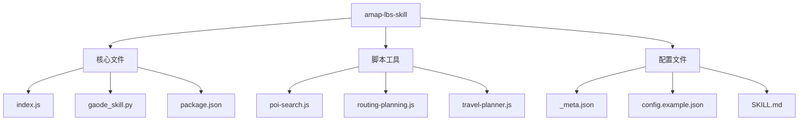

**图表来源**
- [index.js:1-407](file://skills/amap-lbs-skill/index.js#L1-L407)
- [gaode_skill.py:1-276](file://skills/amap-lbs-skill/gaode_skill.py#L1-L276)
- [poi-search.js:1-100](file://skills/amap-lbs-skill/scripts/poi-search.js#L1-L100)

**章节来源**
- [index.js:1-407](file://skills/amap-lbs-skill/index.js#L1-L407)
- [package.json:1-21](file://skills/amap-lbs-skill/package.json#L1-L21)

## 核心组件

### 主要功能模块

该技能包含以下核心功能模块：

1. **POI搜索模块** - 提供地点搜索和周边搜索功能
2. **路径规划模块** - 支持步行、驾车、骑行、公交等多种出行方式
3. **旅游规划模块** - 自动生成城市旅游路线规划
4. **数据可视化模块** - 支持热力图和地图链接生成
5. **配置管理模块** - 管理高德Web Service Key和用户配置

### 技术架构

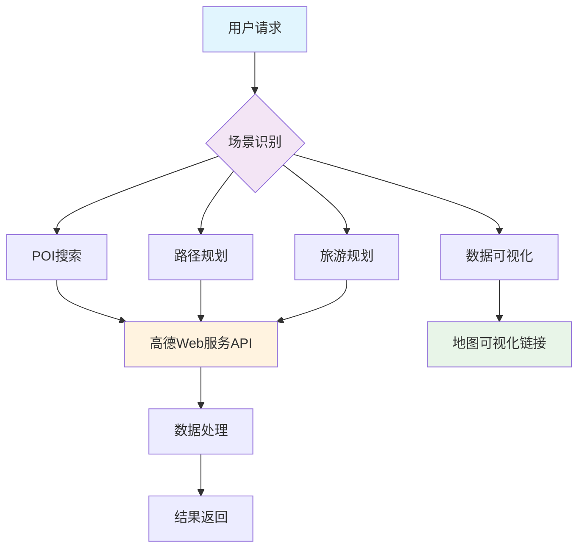

**图表来源**
- [SKILL.md:56-66](file://skills/amap-lbs-skill/SKILL.md#L56-L66)
- [index.js:76-378](file://skills/amap-lbs-skill/index.js#L76-L378)

**章节来源**
- [SKILL.md:24-35](file://skills/amap-lbs-skill/SKILL.md#L24-L35)
- [index.js:364-378](file://skills/amap-lbs-skill/index.js#L364-L378)

## 架构概览

### 系统架构设计

该技能采用分层架构设计，将业务逻辑、数据访问和外部服务集成清晰分离：

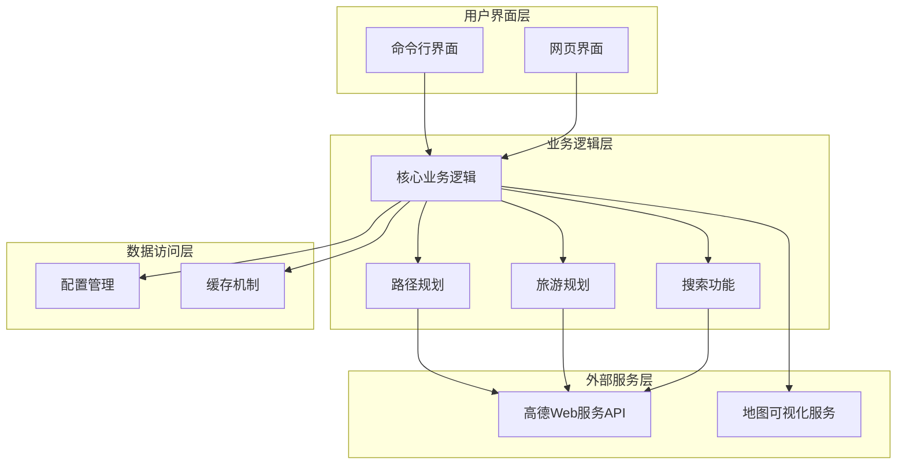

**图表来源**
- [index.js:1-407](file://skills/amap-lbs-skill/index.js#L1-L407)
- [gaode_skill.py:1-276](file://skills/amap-lbs-skill/gaode_skill.py#L1-L276)

### 数据流架构

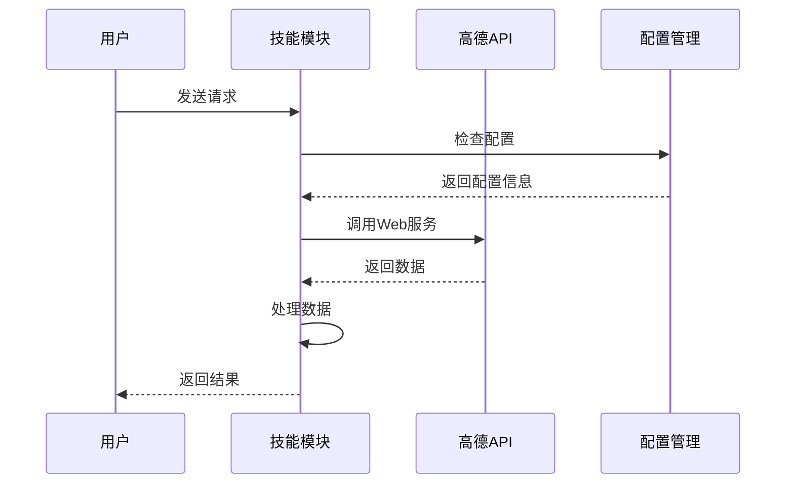

**图表来源**
- [index.js:37-74](file://skills/amap-lbs-skill/index.js#L37-L74)
- [index.js:87-115](file://skills/amap-lbs-skill/index.js#L87-L115)

## 详细组件分析

### POI搜索功能

POI（Point of Interest）搜索功能是该技能的核心组件之一，支持多种搜索模式：

#### 功能特性

- **关键词搜索**：支持精确和模糊匹配
- **城市限定**：可指定搜索范围
- **类型筛选**：按POI类型分类搜索
- **周边搜索**：基于坐标和半径的周边查找
- **分页查询**：支持大量结果的分页浏览

#### 实现架构

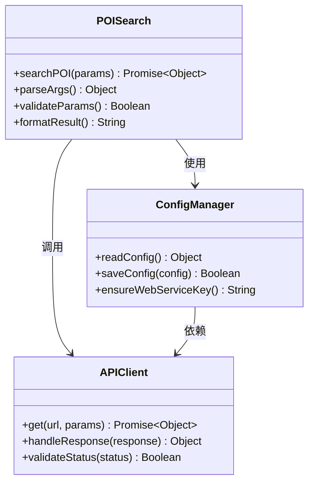

**图表来源**
- [index.js:76-115](file://skills/amap-lbs-skill/index.js#L76-L115)
- [index.js:11-52](file://skills/amap-lbs-skill/index.js#L11-L52)

#### 关键实现细节

POI搜索功能通过高德Web服务API实现，支持以下参数配置：

| 参数名称 | 类型 | 必填 | 描述 | 默认值 |
|---------|------|------|------|--------|
| keywords | string | 是 | 搜索关键词 | - |
| city | string | 否 | 城市名称或编码 | - |
| types | string | 否 | POI类型编码 | - |
| location | string | 否 | 中心点坐标 | - |
| radius | number | 否 | 搜索半径(米) | - |
| page | number | 否 | 页码 | 1 |
| offset | number | 否 | 每页数量 | 10 |

**章节来源**
- [index.js:76-115](file://skills/amap-lbs-skill/index.js#L76-L115)
- [poi-search.js:47-60](file://skills/amap-lbs-skill/scripts/poi-search.js#L47-L60)

### 路径规划功能

路径规划功能支持四种出行方式，每种方式都有其特定的应用场景：

#### 出行方式对比

| 出行方式 | API端点 | 特殊参数 | 适用场景 |
|---------|---------|----------|----------|
| 步行 | `/v3/direction/walking` | - | 短距离移动、健身 |
| 驾车 | `/v3/direction/driving` | waypoints, strategy | 长距离出行、自驾 |
| 骑行 | `/v4/direction/bicycling` | - | 环保出行、短距离 |
| 公交 | `/v3/direction/transit/integrated` | city, strategy | 城市内出行 |

#### 路径规划流程

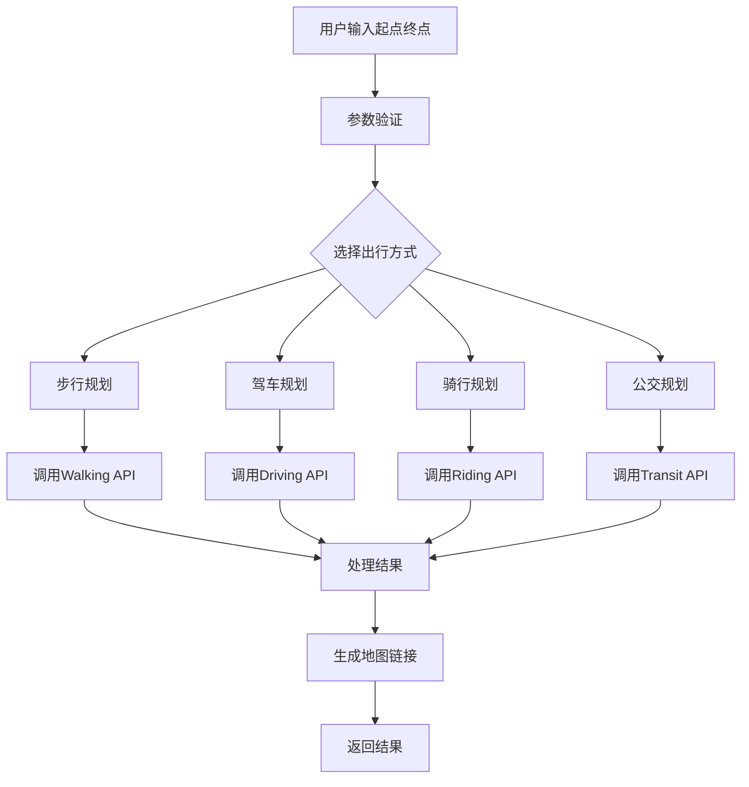

**图表来源**
- [route-planning.js:58-161](file://skills/amap-lbs-skill/scripts/route-planning.js#L58-L161)
- [index.js:118-265](file://skills/amap-lbs-skill/index.js#L118-L265)

**章节来源**
- [route-planning.js:1-180](file://skills/amap-lbs-skill/scripts/route-planning.js#L1-L180)
- [index.js:118-265](file://skills/amap-lbs-skill/index.js#L118-L265)

### 旅游规划功能

智能旅游规划功能能够自动搜索兴趣点并生成最优游览路线：

#### 规划算法

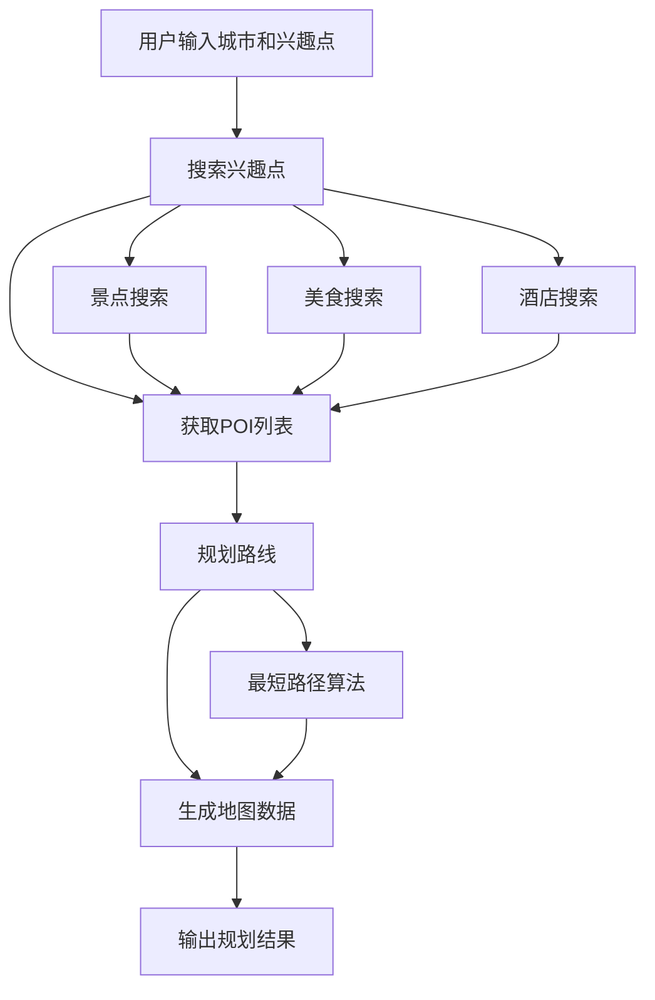

**图表来源**
- [travel-planner.js:54-59](file://skills/amap-lbs-skill/scripts/travel-planner.js#L54-L59)
- [index.js:286-362](file://skills/amap-lbs-skill/index.js#L286-L362)

#### 数据结构设计

旅游规划功能使用标准化的数据结构来表示地图任务：

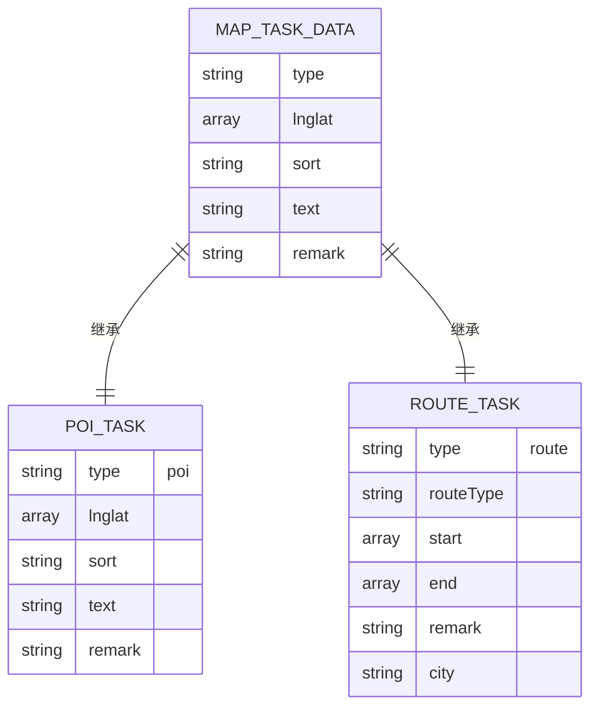

**图表来源**
- [index.js:308-347](file://skills/amap-lbs-skill/index.js#L308-L347)

**章节来源**
- [travel-planner.js:1-83](file://skills/amap-lbs-skill/scripts/travel-planner.js#L1-L83)
- [index.js:286-362](file://skills/amap-lbs-skill/index.js#L286-L362)

### 数据可视化功能

数据可视化功能支持热力图和地图链接生成：

#### 热力图生成流程

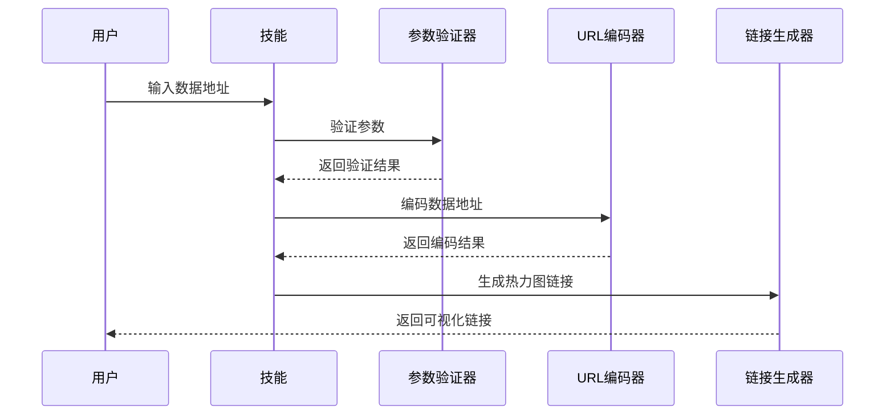

**图表来源**
- [SKILL.md:228-298](file://skills/amap-lbs-skill/SKILL.md#L228-L298)

#### 地图链接生成

**图表来源**
- [index.js:272-276](file://skills/amap-lbs-skill/index.js#L272-L276)

**章节来源**
- [SKILL.md:228-298](file://skills/amap-lbs-skill/SKILL.md#L228-L298)
- [index.js:272-276](file://skills/amap-lbs-skill/index.js#L272-L276)

### Python集成组件

除了JavaScript版本，该技能还提供了Python集成组件，支持Unix Domain Socket通信：

#### Python技能架构

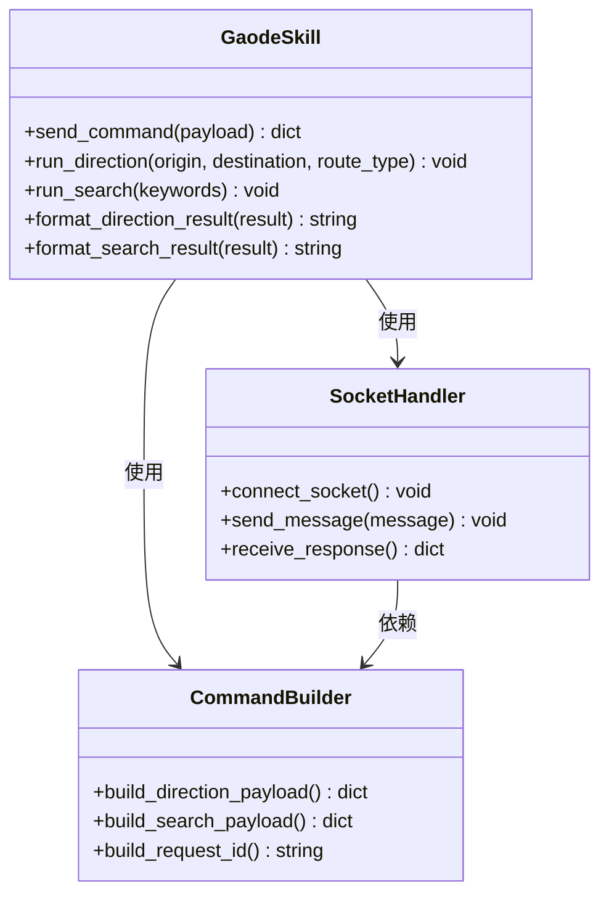

**图表来源**
- [gaode_skill.py:24-194](file://skills/amap-lbs-skill/gaode_skill.py#L24-L194)

#### 通信协议

Python组件通过Unix Domain Socket与Electron应用通信，支持以下命令：

| 命令 | 参数 | 功能描述 |
|------|------|----------|
| direction | origin, destination, type | 导航路线规划 |
| search | keywords | POI搜索 |
| requestId | 自动生成 | 唯一请求标识 |

**章节来源**
- [gaode_skill.py:1-276](file://skills/amap-lbs-skill/gaode_skill.py#L1-L276)

## 依赖关系分析

### 外部依赖

该技能的主要外部依赖包括：

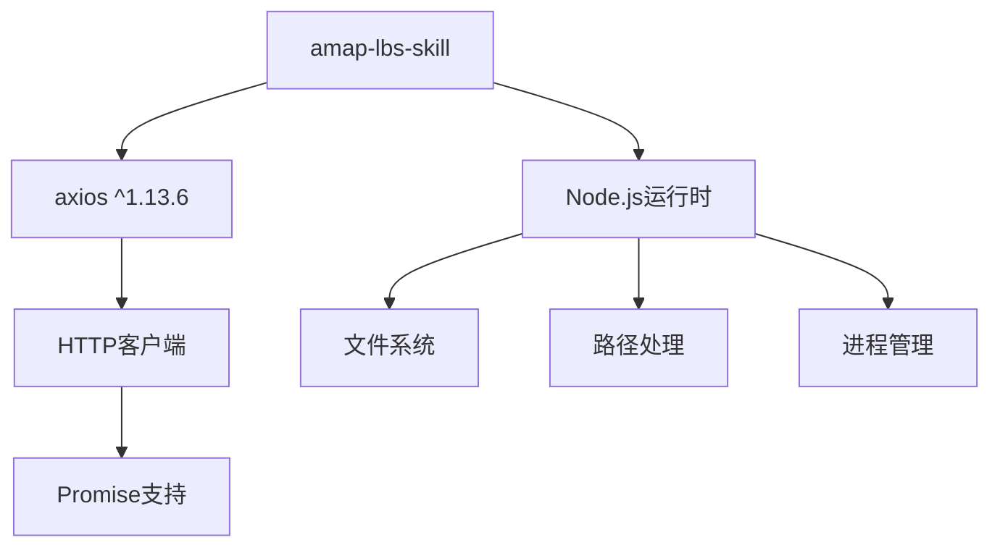

**图表来源**
- [package.json:17-19](file://skills/amap-lbs-skill/package.json#L17-L19)

### 内部模块依赖

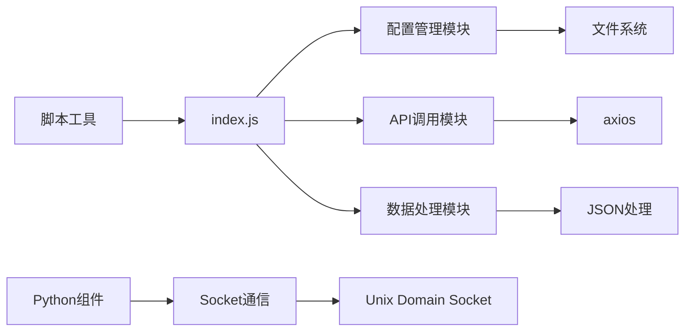

**图表来源**
- [index.js:1-407](file://skills/amap-lbs-skill/index.js#L1-L407)
- [poi-search.js:10](file://skills/amap-lbs-skill/scripts/poi-search.js#L10)

### 依赖注入模式

该技能采用了依赖注入的设计模式，使得模块间的耦合度降低：

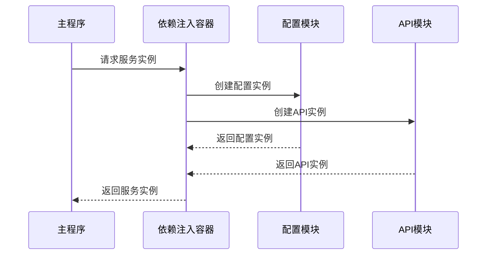

**图表来源**
- [index.js:364-378](file://skills/amap-lbs-skill/index.js#L364-L378)

**章节来源**
- [package.json:1-21](file://skills/amap-lbs-skill/package.json#L1-L21)
- [index.js:364-378](file://skills/amap-lbs-skill/index.js#L364-L378)

## 性能考虑

### API调用优化

1. **批量请求处理**：支持一次请求多个POI，减少API调用次数
2. **缓存机制**：对常用查询结果进行缓存
3. **并发控制**：限制同时进行的API请求数量
4. **重试机制**：网络异常时自动重试

### 内存管理

1. **流式处理**：大数据量时采用流式处理避免内存溢出
2. **及时释放**：及时清理不再使用的对象引用
3. **分页加载**：大量数据采用分页方式加载

### 网络优化

1. **连接池**：复用HTTP连接减少握手开销
2. **压缩传输**：启用GZIP压缩减少传输数据量
3. **超时控制**：合理的超时设置避免长时间阻塞

## 故障排除指南

### 常见问题及解决方案

#### 配置问题

| 问题症状 | 可能原因 | 解决方案 |
|----------|----------|----------|
| 无法获取Web Service Key | 环境变量未设置 | 设置AMAP_KEY或AMAP_WEBSERVICE_KEY环境变量 |
| 配置文件读取失败 | 文件权限问题 | 检查config.json文件权限 |
| Key格式错误 | Key被修改或过期 | 重新申请新的Key |

#### API调用问题

| 问题症状 | 可能原因 | 解决方案 |
|----------|----------|----------|
| 请求失败 | 网络连接问题 | 检查网络连接状态 |
| 返回状态码非1 | 参数错误 | 检查API参数格式 |
| 响应超时 | 服务器繁忙 | 增加重试间隔或稍后重试 |

#### 数据处理问题

| 问题症状 | 可能原因 | 解决方案 |
|----------|----------|----------|
| POI数据为空 | 搜索关键词不准确 | 调整关键词或增加搜索范围 |
| 坐标解析失败 | 坐标格式错误 | 确保坐标格式为"经度,纬度" |
| 路线规划失败 | 起终点不可达 | 检查起终点坐标有效性 |

### 调试技巧

1. **启用详细日志**：在开发环境中启用详细日志输出
2. **参数验证**：对所有输入参数进行严格验证
3. **错误捕获**：使用try-catch捕获并处理异常
4. **状态监控**：监控API调用状态和响应时间

**章节来源**
- [SKILL.md:456-467](file://skills/amap-lbs-skill/SKILL.md#L456-L467)
- [index.js:37-74](file://skills/amap-lbs-skill/index.js#L37-L74)

## 结论

Amap LBS位置服务技能是一个功能完整、架构清晰的地理位置服务解决方案。该技能通过模块化设计实现了高度的可扩展性和可维护性，支持多种使用场景和集成方式。

### 主要优势

1. **功能全面**：涵盖POI搜索、路径规划、旅游规划、数据可视化等核心功能
2. **易于使用**：提供简洁的API接口和丰富的使用示例
3. **灵活配置**：支持多种配置方式和环境变量设置
4. **稳定可靠**：完善的错误处理和重试机制
5. **性能优化**：合理的缓存策略和并发控制

### 技术特色

1. **多语言支持**：同时提供JavaScript和Python两种实现
2. **标准化接口**：使用统一的数据结构和API规范
3. **模块化设计**：清晰的职责分离和依赖管理
4. **可扩展性**：易于添加新功能和第三方集成

### 应用前景

该技能为开发者提供了强大的地理信息服务能力，适用于各种应用场景，包括但不限于：

- 企业级位置服务应用
- 旅游规划和导航系统
- 数据可视化和分析平台
- 物流配送和路线优化
- 城市服务和便民应用

通过持续的功能完善和技术优化，该技能将继续为用户提供更加优质的位置服务体验。