# 助手消息组件

<cite>
**本文档中引用的文件**
- [assistant-message.ts](file://src/tui/components/assistant-message.ts)
- [chat-log.ts](file://src/tui/components/chat-log.ts)
- [hyperlink-markdown.ts](file://src/tui/components/hyperlink-markdown.ts)
- [theme.ts](file://src/tui/theme/theme.ts)
- [osc8-hyperlinks.ts](file://src/tui/osc8-hyperlinks.ts)
- [AssistantMessage.tsx](file://ui-react/src/components/chat/AssistantMessage.tsx)
- [markdown-text.tsx](file://ui-react/src/components/assistant-ui/markdown-text.tsx)
- [ToolFallback.tsx](file://ui-react/src/components/chat/ToolFallback/index.tsx)
- [ToolCallGroup.tsx](file://ui-react/src/components/chat/ToolCallGroup.tsx)
- [assistant-tool-group.tsx](file://ui-react/src/components/assistant-ui/assistant-tool-group.tsx)
- [InteractiveParts.tsx](file://ui-react/src/components/chat/InteractiveParts.tsx)
- [chat-module-deep-dive.md](file://ui-react/docs/chat-module-deep-dive.md)
</cite>

## 更新摘要
**所做更改**
- 更新了工具组渲染顺序调整的说明，确保工具结果优先于交互组件显示
- 新增了 PromotedToolResult 组件的详细说明和渲染策略
- 更新了渲染顺序图表以反映最新的组件排列
- 增强了工具结果提升显示的实现细节

## 目录
1. [简介](#简介)
2. [项目结构](#项目结构)
3. [核心组件](#核心组件)
4. [架构概览](#架构概览)
5. [详细组件分析](#详细组件分析)
6. [依赖关系分析](#依赖关系分析)
7. [性能考虑](#性能考虑)
8. [故障排除指南](#故障排除指南)
9. [结论](#结论)

## 简介

助手消息组件是 OpenClaw 项目中的核心 UI 组件，负责在不同平台（终端界面和 Web 界面）中显示 AI 助手生成的消息内容。该组件支持实时流式更新、Markdown 格式渲染、超链接处理以及主题适配等功能。

**现代化更新**：组件现已全面现代化，采用新的 assistant-ui 框架重构 Web 平台组件，提供更强大的 Markdown 渲染能力和增强的用户交互体验。

**渲染顺序优化**：经过最新优化，助手消息组件现在采用"工具结果 → Markdown 文本 → 交互组件"的渲染顺序，确保工具结果优先于交互组件显示，提升用户体验和信息传递效率。

OpenClaw 是一个多功能的 AI 助手平台，支持多种通信渠道和平台集成。助手消息组件作为用户界面的重要组成部分，为用户提供清晰、美观且功能丰富的消息显示体验。

## 项目结构

助手消息组件在项目中的组织结构经过现代化重构：

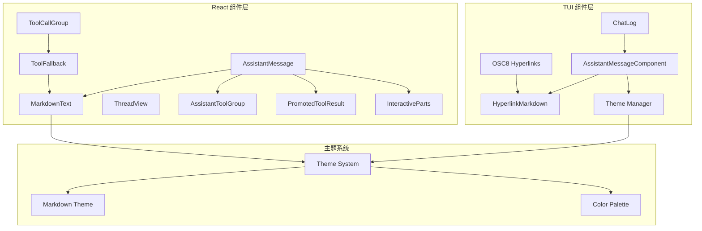

**图表来源**
- [assistant-message.ts:1-23](file://src/tui/components/assistant-message.ts#L1-L23)
- [chat-log.ts:1-151](file://src/tui/components/chat-log.ts#L1-L151)
- [hyperlink-markdown.ts:1-38](file://src/tui/components/hyperlink-markdown.ts#L1-L38)
- [osc8-hyperlinks.ts:1-232](file://src/tui/osc8-hyperlinks.ts#L1-L232)
- [theme.ts:1-232](file://src/tui/theme/theme.ts#L1-L232)
- [AssistantMessage.tsx:1-121](file://ui-react/src/components/chat/AssistantMessage.tsx#L1-L121)
- [assistant-tool-group.tsx:1-179](file://ui-react/src/components/assistant-ui/assistant-tool-group.tsx#L1-L179)
- [InteractiveParts.tsx:1-316](file://ui-react/src/components/chat/InteractiveParts.tsx#L1-L316)

**章节来源**
- [assistant-message.ts:1-23](file://src/tui/components/assistant-message.ts#L1-L23)
- [chat-log.ts:1-151](file://src/tui/components/chat-log.ts#L1-L151)
- [hyperlink-markdown.ts:1-38](file://src/tui/components/hyperlink-markdown.ts#L1-L38)
- [osc8-hyperlinks.ts:1-232](file://src/tui/osc8-hyperlinks.ts#L1-L232)
- [theme.ts:1-232](file://src/tui/theme/theme.ts#L1-L232)

## 核心组件

助手消息组件由多个相互协作的组件构成，每个组件都有特定的功能和职责。经过现代化重构后，组件架构更加清晰和强大：

### TUI 终端组件

**AssistantMessageComponent** - 主要的助手消息显示组件
- 继承自 Container 基础组件
- 负责渲染助手消息的主体内容
- 支持动态文本更新和样式应用

**HyperlinkMarkdown** - 增强的 Markdown 渲染器
- 扩展了 pi-tui 的 Markdown 组件
- 添加了 OSC 8 终端超链接支持
- 处理跨行断词的 URL 可点击功能

**ChatLog** - 消息日志管理器
- 管理整个聊天会话的消息显示
- 处理流式消息的开始、更新和结束
- 实现消息数量限制和内存管理

**OSC8 Hyperlinks** - 超链接处理引擎
- 提供高级的终端超链接支持
- 处理跨行 URL 匹配和包装
- 支持 ANSI 转义序列的正确处理

### React Web 组件

**AssistantMessage** - Web 界面的助手消息组件
- 使用 @assistant-ui/react 构建
- 支持加载状态指示器
- 提供复制和重新生成功能
- 集成现代化的 UI primitives
- **新增**：采用优化的渲染顺序，确保工具结果优先显示

**AssistantToolGroup** - 工具调用组管理组件
- 管理连续的工具调用分组
- 提供折叠/展开的工具调用摘要
- 支持工具执行状态的可视化
- 实现智能的工具类型识别

**PromotedToolResult** - 工具结果提升显示组件
- **新增**：专门负责工具结果的优先展示
- 基于工具结果的富媒体内容进行智能提升
- 支持多种工具类型的结构化渲染
- 实现工具结果与 Markdown 文本的协调显示

**InteractiveParts** - 交互组件管理器
- **更新**：在渲染顺序中最后显示
- 管理 HITL（Human-in-the-Loop）交互组件
- 支持多种交互模式：问卷、选项列表等
- 实现交互状态的智能识别和渲染

**MarkdownText** - 增强的 Markdown 文本渲染组件
- 基于 @assistant-ui/react-markdown
- 提供代码块复制功能
- 支持 GFM (GitHub Flavored Markdown)
- 集成智能的代码块头部和语言检测

**ToolFallback** - 工具调用回退组件
- 提供工具执行结果的详细展示
- 支持多种工具类型的分类和图标
- 实现可展开的结果查看器
- 集成错误状态检测和处理

**ToolCallGroup** - 工具调用组组件
- 管理连续的工具调用分组
- 提供折叠/展开的工具调用摘要
- 支持工具执行状态的可视化
- 实现智能的工具类型识别

**章节来源**
- [assistant-message.ts:5-22](file://src/tui/components/assistant-message.ts#L5-L22)
- [hyperlink-markdown.ts:10-37](file://src/tui/components/hyperlink-markdown.ts#L10-L37)
- [chat-log.ts:8-151](file://src/tui/components/chat-log.ts#L8-L151)
- [osc8-hyperlinks.ts:14-39](file://src/tui/osc8-hyperlinks.ts#L14-L39)
- [AssistantMessage.tsx:12-58](file://ui-react/src/components/chat/AssistantMessage.tsx#L12-L58)
- [assistant-tool-group.tsx:13-179](file://ui-react/src/components/assistant-ui/assistant-tool-group.tsx#L13-L179)
- [InteractiveParts.tsx:1-316](file://ui-react/src/components/chat/InteractiveParts.tsx#L1-L316)
- [markdown-text.tsx:1-268](file://ui-react/src/components/assistant-ui/markdown-text.tsx#L1-L268)
- [ToolFallback.tsx:1-579](file://ui-react/src/components/chat/ToolFallback/index.tsx#L1-L579)
- [ToolCallGroup.tsx:1-284](file://ui-react/src/components/chat/ToolCallGroup.tsx#L1-L284)

## 架构概览

助手消息组件采用现代化的分层架构设计，确保不同平台的一致性和可维护性：

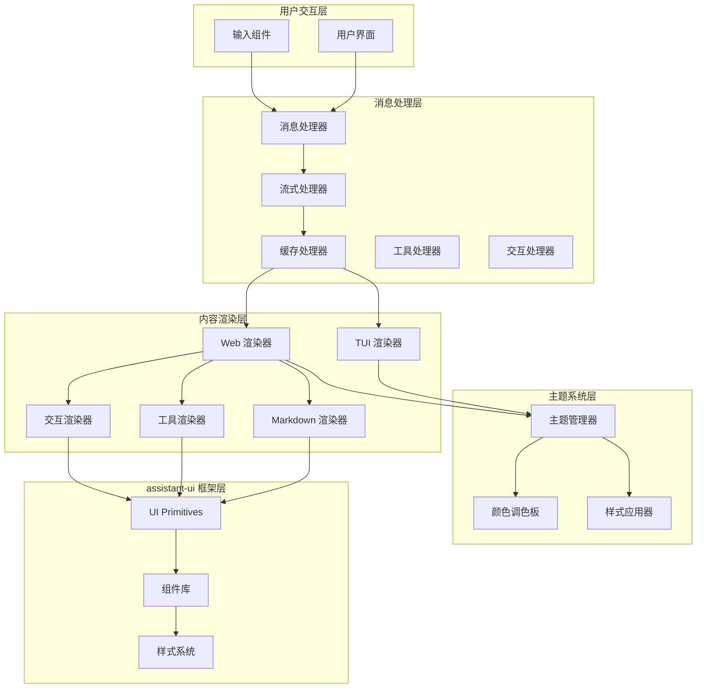

**图表来源**
- [chat-log.ts:67-151](file://src/tui/components/chat-log.ts#L67-L151)
- [theme.ts:157-232](file://src/tui/theme/theme.ts#L157-L232)
- [AssistantMessage.tsx:14-56](file://ui-react/src/components/chat/AssistantMessage.tsx#L14-L56)
- [assistant-tool-group.tsx:145-179](file://ui-react/src/components/assistant-ui/assistant-tool-group.tsx#L145-L179)
- [InteractiveParts.tsx:180-316](file://ui-react/src/components/chat/InteractiveParts.tsx#L180-L316)

## 详细组件分析

### AssistantMessage 组件渲染顺序优化

AssistantMessage 组件经过重要优化，采用了"工具结果 → Markdown 文本 → 交互组件"的渲染顺序：

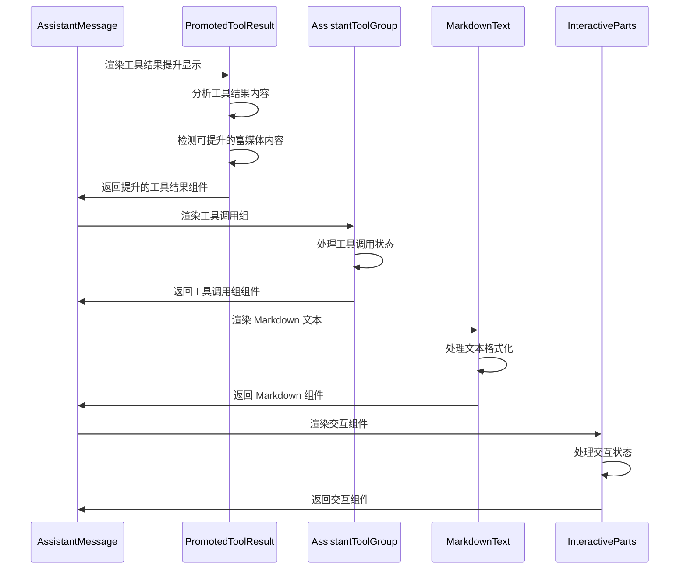

**图表来源**
- [AssistantMessage.tsx:106-116](file://ui-react/src/components/chat/AssistantMessage.tsx#L106-L116)
- [assistant-tool-group.tsx:145-179](file://ui-react/src/components/assistant-ui/assistant-tool-group.tsx#L145-L179)
- [InteractiveParts.tsx:180-316](file://ui-react/src/components/chat/InteractiveParts.tsx#L180-L316)

#### 工具结果提升机制

**新增** PromotedToolResult 组件专门负责工具结果的优先展示：

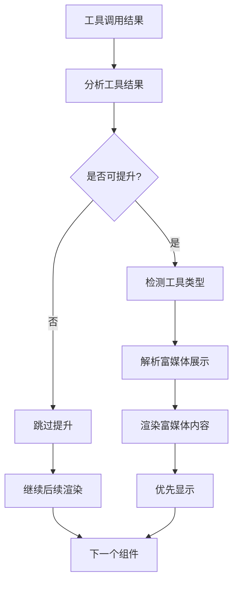

**图表来源**
- [assistant-tool-group.tsx:69-92](file://ui-react/src/components/assistant-ui/assistant-tool-group.tsx#L69-L92)
- [assistant-tool-group.tsx:105-143](file://ui-react/src/components/assistant-ui/assistant-tool-group.tsx#L105-L143)

### AssistantMessageComponent 分析

AssistantMessageComponent 是 TUI 平台的核心组件，负责助手消息的显示和管理：

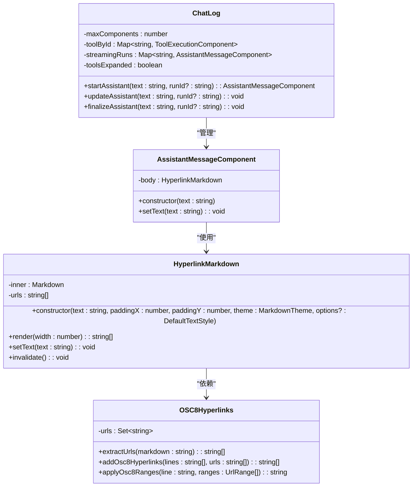

**图表来源**
- [assistant-message.ts:5-22](file://src/tui/components/assistant-message.ts#L5-L22)
- [hyperlink-markdown.ts:10-37](file://src/tui/components/hyperlink-markdown.ts#L10-L37)
- [chat-log.ts:8-151](file://src/tui/components/chat-log.ts#L8-L151)
- [osc8-hyperlinks.ts:18-39](file://src/tui/osc8-hyperlinks.ts#L18-L39)

#### 流式消息处理流程

助手消息组件支持实时流式更新，这是通过 ChatLog 类实现的：

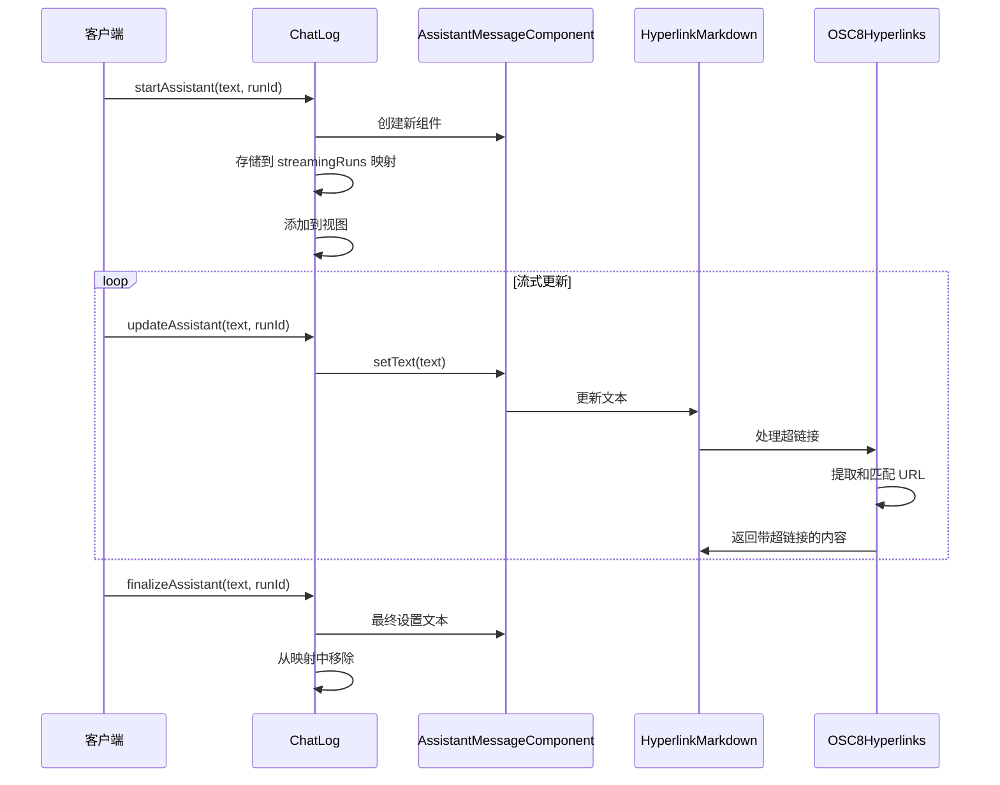

**图表来源**
- [chat-log.ts:67-151](file://src/tui/components/chat-log.ts#L67-L151)
- [assistant-message.ts:19-21](file://src/tui/components/assistant-message.ts#L19-L21)
- [osc8-hyperlinks.ts:218-231](file://src/tui/osc8-hyperlinks.ts#L218-L231)

**章节来源**
- [assistant-message.ts:1-23](file://src/tui/components/assistant-message.ts#L1-L23)
- [chat-log.ts:63-151](file://src/tui/components/chat-log.ts#L63-L151)

### HyperlinkMarkdown 组件分析

HyperlinkMarkdown 组件是对标准 Markdown 渲染器的增强，主要特性包括：

#### 超链接处理机制

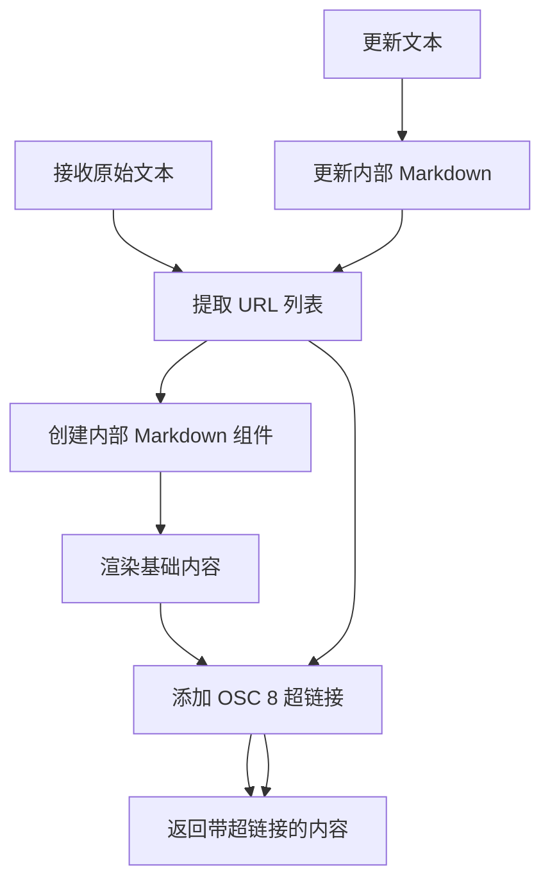

**图表来源**
- [hyperlink-markdown.ts:25-32](file://src/tui/components/hyperlink-markdown.ts#L25-L32)
- [osc8-hyperlinks.ts:18-39](file://src/tui/osc8-hyperlinks.ts#L18-L39)

#### 主题适配系统

助手消息组件支持自动主题检测和适配：

**章节来源**
- [hyperlink-markdown.ts:1-38](file://src/tui/components/hyperlink-markdown.ts#L1-L38)
- [theme.ts:48-76](file://src/tui/theme/theme.ts#L48-L76)

### React AssistantMessage 组件分析

Web 平台的 AssistantMessage 组件提供了现代化的用户交互功能：

#### 优化的渲染顺序

组件现在采用"工具结果 → 工具调用组 → Markdown 文本 → 交互组件"的渲染顺序：

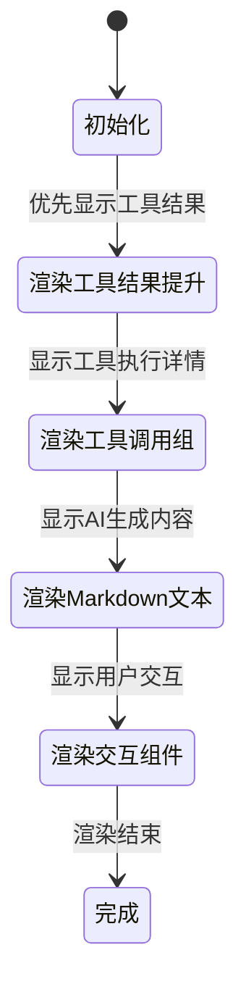

**图表来源**
- [AssistantMessage.tsx:106-116](file://ui-react/src/components/chat/AssistantMessage.tsx#L106-L116)

#### 加载状态处理

组件支持智能的加载状态指示：

#### Markdown 渲染配置

Web 组件使用专门的 Markdown 配置，集成了现代化的渲染能力：

**章节来源**
- [AssistantMessage.tsx:1-121](file://ui-react/src/components/chat/AssistantMessage.tsx#L1-L121)
- [markdown-text.tsx:1-268](file://ui-react/src/components/assistant-ui/markdown-text.tsx#L1-L268)

### ToolFallback 组件分析

ToolFallback 组件提供了强大的工具调用结果展示功能：

#### 工具分类系统

组件支持多种工具类型的智能分类：

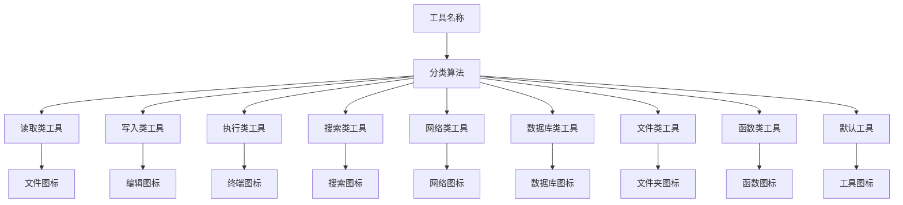

**图表来源**
- [ToolFallback.tsx:49-76](file://ui-react/src/components/chat/ToolFallback/index.tsx#L49-L76)

#### 结果展示系统

组件提供多层次的结果展示能力：

**章节来源**
- [ToolFallback.tsx:1-579](file://ui-react/src/components/chat/ToolFallback/index.tsx#L1-L579)

### ToolCallGroup 组件分析

ToolCallGroup 组件管理连续的工具调用分组：

#### 状态管理机制

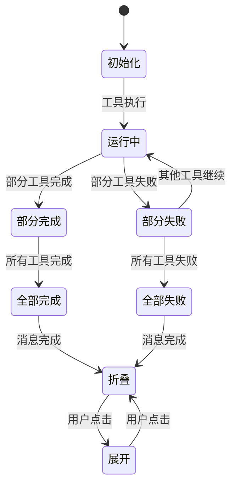

**图表来源**
- [ToolCallGroup.tsx:41-67](file://ui-react/src/components/chat/ToolCallGroup.tsx#L41-L67)

**章节来源**
- [ToolCallGroup.tsx:1-284](file://ui-react/src/components/chat/ToolCallGroup.tsx#L1-L284)

### PromotedToolResult 组件分析

**新增** PromotedToolResult 组件专门负责工具结果的优先展示：

#### 提升决策算法

组件采用智能算法决定哪些工具结果应该提升到主区域显示：

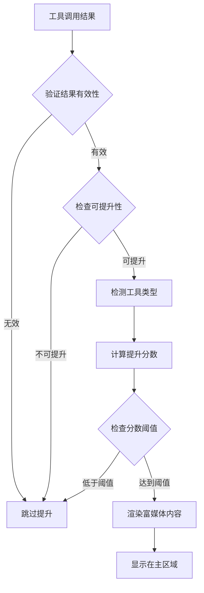

**图表来源**
- [assistant-tool-group.tsx:69-92](file://ui-react/src/components/assistant-ui/assistant-tool-group.tsx#L69-L92)
- [assistant-tool-group.tsx:105-143](file://ui-react/src/components/assistant-ui/assistant-tool-group.tsx#L105-L143)

#### 富媒体内容渲染

组件支持多种富媒体内容的结构化展示：

**章节来源**
- [assistant-tool-group.tsx:145-179](file://ui-react/src/components/assistant-ui/assistant-tool-group.tsx#L145-L179)

### InteractiveParts 组件分析

**更新** InteractiveParts 组件现在在渲染顺序的最后显示：

#### 交互状态管理

组件支持多种交互模式的状态管理：

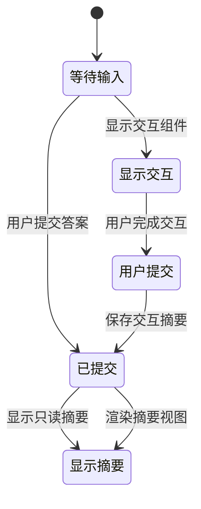

**图表来源**
- [InteractiveParts.tsx:28-31](file://ui-react/src/components/chat/InteractiveParts.tsx#L28-L31)

#### 交互模式支持

组件支持多种交互模式：

**章节来源**
- [InteractiveParts.tsx:1-316](file://ui-react/src/components/chat/InteractiveParts.tsx#L1-L316)

## 依赖关系分析

助手消息组件之间的依赖关系体现了现代化的架构设计：

```mermaid
graph LR
subgraph "外部依赖"
PI_TUI[@mariozechner/pi-tui]
ASSISTANT_UI[@assistant-ui/react]
REACT_MARKDOWN[react-markdown]
REMARK_GFM[remark-gfm]
LUCIDE_REACT[lucide-react]
END
subgraph "内部模块"
THEME[theme.ts]
HYPERLINK[hyperlink-markdown.ts]
AM[assistant-message.ts]
CL[chat-log.ts]
AMR[AssistantMessage.tsx]
MDR[markdown-text.tsx]
TF[ToolFallback.tsx]
TCG[ToolCallGroup.tsx]
ATG[AssistantToolGroup.tsx]
PTR[PromotedToolResult]
IP[InteractiveParts.tsx]
OSC8[osc8-hyperlinks.ts]
END
PI_TUI --> HYPERLINK
PI_TUI --> AM
ASSISTANT_UI --> AMR
ASSISTANT_UI --> TF
ASSISTANT_UI --> TCG
ASSISTANT_UI --> ATG
ASSISTANT_UI --> PTR
ASSISTANT_UI --> IP
REACT_MARKDOWN --> MDR
REMARK_GFM --> MDR
LUCIDE_REACT --> AMR
LUCIDE_REACT --> TF
LUCIDE_REACT --> TCG
THEME --> AM
THEME --> AMR
HYPERLINK --> AM
OSC8 --> HYPERLINK
CL --> AM
MDR --> AMR
TF --> MDR
TCG --> TF
ATG --> TCG
PTR --> ATG
IP --> AMR
```

**图表来源**
- [assistant-message.ts:1-3](file://src/tui/components/assistant-message.ts#L1-L3)
- [AssistantMessage.tsx:1-6](file://ui-react/src/components/chat/AssistantMessage.tsx#L1-L6)
- [assistant-tool-group.tsx:1-11](file://ui-react/src/components/assistant-ui/assistant-tool-group.tsx#L1-L11)
- [InteractiveParts.tsx:1-9](file://ui-react/src/components/chat/InteractiveParts.tsx#L1-L9)
- [markdown-text.tsx:1-8](file://ui-react/src/components/assistant-ui/markdown-text.tsx#L1-L8)

**章节来源**
- [assistant-message.ts:1-4](file://src/tui/components/assistant-message.ts#L1-L4)
- [AssistantMessage.tsx:1-6](file://ui-react/src/components/chat/AssistantMessage.tsx#L1-L6)

## 性能考虑

助手消息组件在设计时充分考虑了性能优化，现代化重构进一步提升了性能表现：

### 内存管理策略

- **消息数量限制**：ChatLog 组件实现了最大组件数量限制，防止内存泄漏
- **引用清理**：自动清理不再使用的组件引用
- **增量更新**：支持流式更新而不需要重新渲染整个界面
- **组件缓存**：assistant-ui 框架提供了高效的组件缓存机制

### 渲染优化

- **主题缓存**：颜色和样式信息的缓存减少重复计算
- **条件渲染**：根据状态智能选择渲染路径
- **懒加载**：Markdown 内容按需渲染
- **虚拟滚动**：大量消息时的高效滚动支持
- ****优化的渲染顺序**：工具结果优先显示减少用户等待时间

### 流式处理优化

- **去重机制**：防止重复的流式更新
- **批量处理**：合并多个更新请求
- **背压处理**：控制流式数据的处理速度
- **智能超链接处理**：优化 OSC 8 序列的生成和应用

### Web 平台优化

- **React.memo 优化**：关键组件使用记忆化避免不必要的重渲染
- **代码分割**：大型组件按需加载
- **CSS-in-JS 缓存**：动态样式的缓存和复用
- **事件委托**：优化用户交互事件的处理
- ****渲染顺序优化**：确保最重要的信息最先呈现

### 工具结果提升优化

- **智能提升决策**：基于工具类型和内容质量的智能判断
- **富媒体缓存**：提升的富媒体内容缓存减少重复渲染
- **延迟加载**：非提升的工具结果按需加载
- **状态同步**：工具结果状态与交互状态的同步更新

## 故障排除指南

### 常见问题及解决方案

#### 主题显示异常

**问题**：消息文本颜色不符合预期
**原因**：终端背景色检测失败或主题配置错误
**解决方法**：
1. 设置 `OPENCLAW_THEME` 环境变量
2. 检查终端颜色配置
3. 验证主题文件完整性

#### 流式更新问题

**问题**：消息更新不及时或出现乱码
**原因**：流式处理逻辑错误或编码问题
**解决方法**：
1. 检查 `updateAssistant` 方法调用
2. 验证文本编码格式
3. 确认流式更新频率

#### 超链接无法点击

**问题**：Markdown 中的 URL 无法点击
**原因**：OSC 8 支持缺失或终端不兼容
**解决方法**：
1. 检查终端对 OSC 8 的支持
2. 验证超链接提取逻辑
3. 回退到标准 Markdown 渲染

#### Web 组件渲染问题

**问题**：assistant-ui 组件渲染异常
**原因**：上下文提供者配置错误或依赖版本冲突
**解决方法**：
1. 检查 AssistantUIProvider 的正确配置
2. 验证依赖版本兼容性
3. 确认主题和样式系统的正确导入

#### 工具调用显示问题

**问题**：工具调用结果显示不正确
**原因**：工具分类错误或状态检测失败
**解决方法**：
1. 检查工具名称的正则表达式匹配
2. 验证工具状态的数据结构
3. 确认错误检测逻辑的正确性

#### **新增** 工具结果提升问题

**问题**：工具结果没有按预期提升显示
**原因**：提升决策算法错误或富媒体内容解析失败
**解决方法**：
1. 检查工具结果的有效性验证
2. 验证富媒体内容的解析逻辑
3. 确认提升分数计算的准确性
4. 检查工具类型检测的正确性

#### **新增** 渲染顺序问题

**问题**：组件渲染顺序不符合预期
**原因**：组件渲染逻辑错误或状态管理问题
**解决方法**：
1. 检查 AssistantMessage 组件的渲染顺序
2. 验证 PromotedToolResult 的优先级设置
3. 确认 InteractiveParts 的最后渲染逻辑
4. 检查工具调用组的状态管理

**章节来源**
- [theme.ts:48-76](file://src/tui/theme/theme.ts#L48-L76)
- [chat-log.ts:32-46](file://src/tui/components/chat-log.ts#L32-L46)
- [hyperlink-markdown.ts:25-27](file://src/tui/components/hyperlink-markdown.ts#L25-L27)
- [AssistantMessage.tsx:14-56](file://ui-react/src/components/chat/AssistantMessage.tsx#L14-L56)
- [assistant-tool-group.tsx:69-92](file://ui-react/src/components/assistant-ui/assistant-tool-group.tsx#L69-L92)
- [InteractiveParts.tsx:180-316](file://ui-react/src/components/chat/InteractiveParts.tsx#L180-L316)

## 结论

助手消息组件作为 OpenClaw 项目的核心 UI 组件，经过现代化重构和渲染顺序优化后展现了更加优秀的设计和实现质量。通过分层架构、主题适配、流式处理、assistant-ui 框架集成以及优化的渲染顺序等特性，为用户提供了跨平台一致且高质量的消息显示体验。

**主要改进包括**：

1. **跨平台一致性**：TUI 和 Web 版本提供相似的功能和用户体验
2. **性能优化**：内存管理和渲染优化确保流畅的用户体验
3. **可扩展性**：模块化设计便于功能扩展和维护
4. **主题适配**：智能的主题检测和适配支持多种终端环境
5. **现代化框架**：assistant-ui 框架提供强大的组件基础和开发体验
6. **增强的工具支持**：完善的工具调用展示和状态管理
7. **智能渲染顺序**：工具结果优先显示，提升用户体验
8. ****新增** 工具结果提升机制**：专门的组件负责工具结果的优先展示

**渲染顺序优化的关键改进**：

- **工具结果优先显示**：PromotedToolResult 组件确保最重要的工具结果最先呈现
- **交互组件最后显示**：InteractiveParts 组件在渲染顺序的最后显示，不影响工具结果的可见性
- **智能提升决策**：基于工具类型和内容质量的智能判断机制
- **富媒体内容优化**：支持多种富媒体内容的结构化展示

未来可以考虑的改进方向包括：
- 进一步优化大型消息的渲染性能
- 扩展多媒体内容的显示能力
- 增强无障碍访问支持
- 集成更多 AI 助手特有的交互功能
- 支持更多的自定义主题和样式选项
- **新增**：优化工具结果提升的算法和缓存机制
- **新增**：增强渲染顺序的可配置性和个性化设置