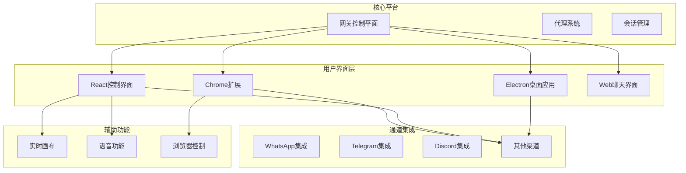
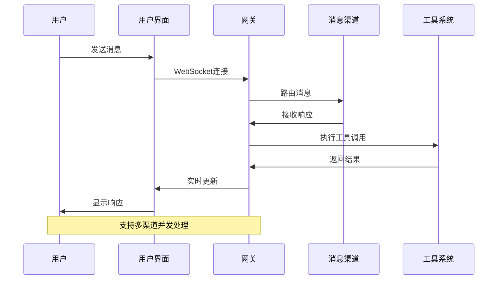
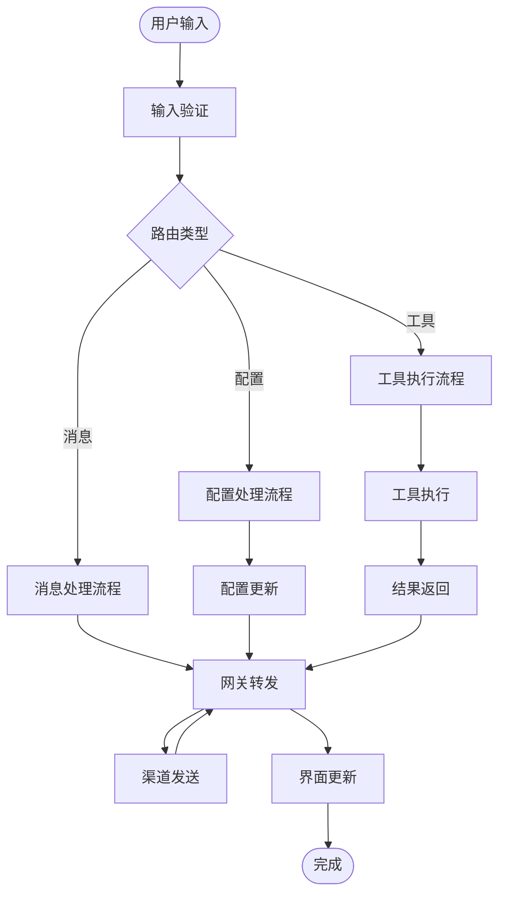
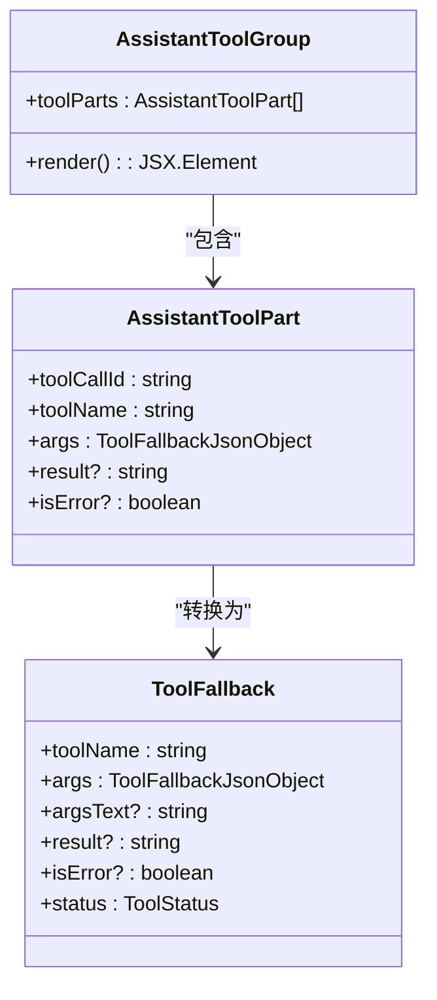
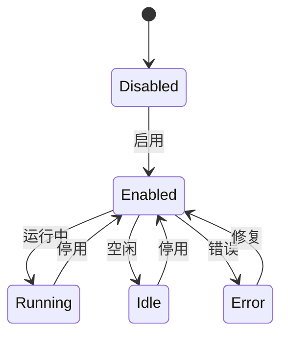
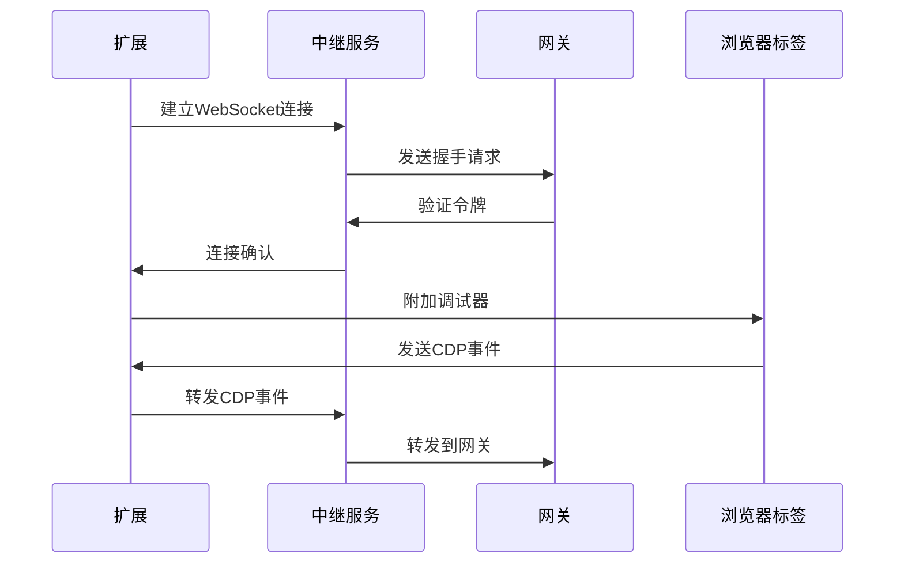
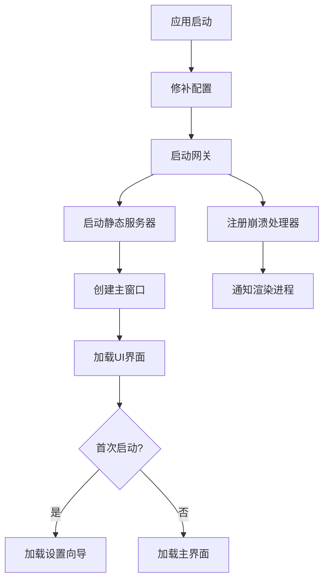
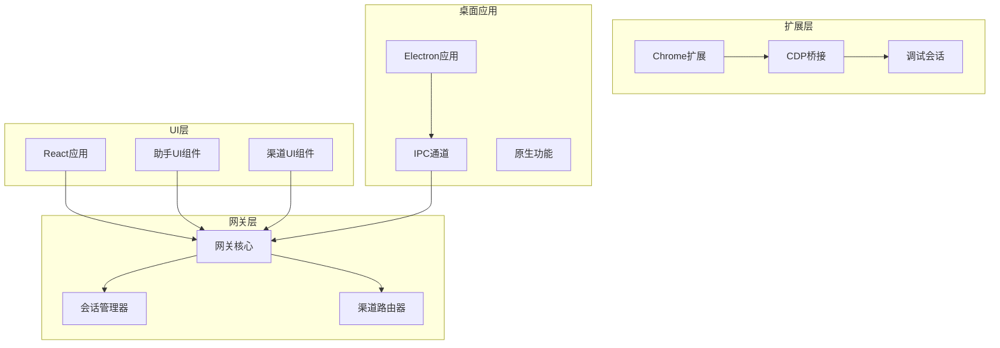
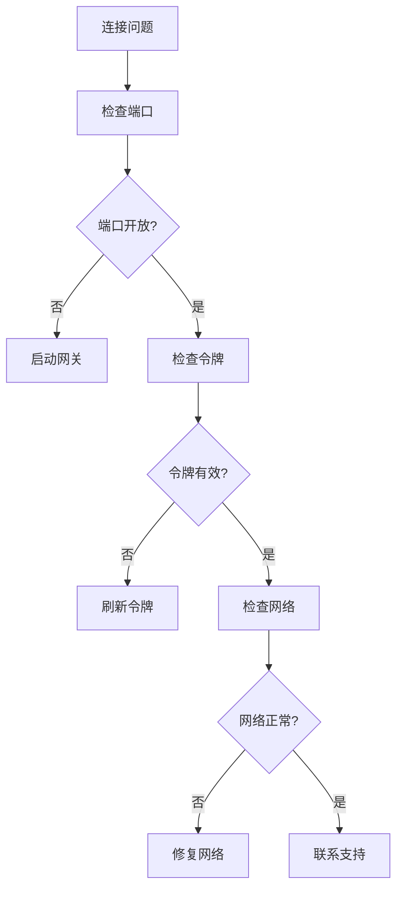

# 助手UI集成增强

<cite>
**本文档引用的文件**
- [README.md](file://README.md)
- [ui/src/main.ts](file://ui/src/main.ts)
- [ui-react/src/App.tsx](file://ui-react/src/App.tsx)
- [assets/chrome-extension/background.js](file://assets/chrome-extension/background.js)
- [apps/electron/src/main/index.ts](file://apps/electron/src/main/index.ts)
- [ui-react/src/components/assistant-ui/assistant-tool-group.tsx](file://ui-react/src/components/assistant-ui/assistant-tool-group.tsx)
- [ui-react/src/components/channels/ChannelCard.tsx](file://ui-react/src/components/channels/ChannelCard.tsx)
</cite>

## 目录
1. [简介](#简介)
2. [项目结构](#项目结构)
3. [核心组件](#核心组件)
4. [架构概览](#架构概览)
5. [详细组件分析](#详细组件分析)
6. [依赖关系分析](#依赖关系分析)
7. [性能考虑](#性能考虑)
8. [故障排除指南](#故障排除指南)
9. [结论](#结论)

## 简介

OpenClaw是一个个人AI助手平台，支持在本地设备上运行，提供多渠道消息传递、语音交互和实时画布功能。本文档重点关注助手UI集成增强功能，包括浏览器扩展、桌面应用集成和React前端组件的改进。

该项目的核心优势在于其本地优先的设计理念，通过网关控制平面协调各种客户端、工具和事件，同时提供多种用户界面选项：

- **多平台支持**：macOS、iOS、Android、Windows和Linux
- **多渠道集成**：WhatsApp、Telegram、Slack、Discord等20+消息平台
- **实时画布**：基于A2UI的可视化工作空间
- **语音交互**：支持唤醒词和连续语音模式
- **浏览器控制**：Chrome扩展实现CDP调试器桥接

## 项目结构

项目采用模块化架构，主要包含以下核心部分：

**图表来源**
- [README.md:145-150](file://README.md#L145-L150)
- [README.md:185-212](file://README.md#L185-L212)

**章节来源**
- [README.md:126-184](file://README.md#L126-L184)

## 核心组件

### 网关控制平面

网关作为单一的WebSocket控制平面，为所有客户端、工具和事件提供统一的协调中心：

- **WebSocket协议**：ws://127.0.0.1:18789
- **多客户端支持**：Pi代理、CLI、WebChat UI、macOS应用、iOS/Android节点
- **会话管理**：支持主聊天、群组隔离、激活模式、队列模式
- **安全模型**：默认主会话完全访问权限，群组/频道安全通过沙箱机制

### 浏览器扩展集成

Chrome扩展提供了强大的浏览器控制能力，通过CDP（Chrome调试协议）实现：

- **CDP桥接**：将浏览器标签页连接到OpenClaw网关
- **自动重连**：指数退避重连机制，最多尝试10次
- **状态指示**：徽章颜色表示连接状态（红色错误、橙色连接中、绿色正常）
- **调试器会话**：支持多个子会话和目标管理

### Electron桌面应用

桌面应用集成了完整的控制界面和网关管理功能：

- **静态HTTP服务器**：提供ui-react构建产物
- **原生窗口**：macOS菜单栏控制、健康监控
- **自动更新**：内置更新机制，支持后台检查
- **配置管理**：动态修补配置以适应Electron环境

**章节来源**
- [README.md:185-254](file://README.md#L185-L254)

## 架构概览

OpenClaw采用分层架构设计，确保各组件间的松耦合和高内聚：

**图表来源**
- [README.md:188-202](file://README.md#L188-L202)

### 数据流架构

**图表来源**
- [README.md:185-212](file://README.md#L185-L212)

## 详细组件分析

### React助手UI组件

助手UI组件提供了丰富的交互功能，特别是工具调用和状态管理：

#### AssistantToolGroup组件

该组件负责显示和管理工具调用的分组展示：

**图表来源**
- [ui-react/src/components/assistant-ui/assistant-tool-group.tsx:9-36](file://ui-react/src/components/assistant-ui/assistant-tool-group.tsx#L9-L36)

组件特性：
- **状态管理**：根据工具执行状态显示运行中、完成或错误状态
- **参数展示**：支持JSON格式化显示工具参数
- **结果反馈**：提供工具执行结果的可视化展示
- **错误处理**：清晰标识工具执行中的错误情况

#### ChannelCard组件

渠道卡片组件提供了渠道状态管理和用户交互功能：

**图表来源**
- [ui-react/src/components/channels/ChannelCard.tsx:13-19](file://ui-react/src/components/channels/ChannelCard.tsx#L13-L19)

组件功能：
- **状态指示**：通过不同图标和颜色显示渠道状态
- **启用/禁用**：支持动态切换渠道启用状态
- **配置状态**：显示渠道配置完成度
- **错误处理**：提供错误信息展示和用户反馈

**章节来源**
- [ui-react/src/components/assistant-ui/assistant-tool-group.tsx:1-51](file://ui-react/src/components/assistant-ui/assistant-tool-group.tsx#L1-L51)
- [ui-react/src/components/channels/ChannelCard.tsx:1-141](file://ui-react/src/components/channels/ChannelCard.tsx#L1-L141)

### 浏览器扩展后台脚本

Chrome扩展提供了强大的浏览器控制能力，通过CDP桥接实现：

#### 连接管理

**图表来源**
- [assets/chrome-extension/background.js:166-227](file://assets/chrome-extension/background.js#L166-L227)

连接特性：
- **自动重连**：指数退避重连，最多10次尝试
- **状态持久化**：使用chrome.storage.session保存连接状态
- **徽章指示**：通过徽章颜色显示连接状态
- **错误恢复**：断线后自动恢复连接

#### 调试器会话管理

组件支持复杂的调试器会话管理：

- **主会话**：每个标签页的主要调试会话
- **子会话**：处理弹出窗口和新创建的目标
- **会话映射**：维护会话ID到标签页的映射关系
- **目标管理**：跟踪目标ID和会话状态的对应关系

**章节来源**
- [assets/chrome-extension/background.js:1-1026](file://assets/chrome-extension/background.js#L1-L1026)

### Electron应用集成

Electron应用提供了桌面级的用户体验和原生功能集成：

#### 网关管理

**图表来源**
- [apps/electron/src/main/index.ts:399-499](file://apps/electron/src/main/index.ts#L399-L499)

应用特性：
- **配置修补**：动态调整配置以适应Electron环境
- **静态服务器**：提供ui-react构建产物的本地服务
- **原生窗口**：支持macOS菜单栏和窗口管理
- **自动更新**：内置更新机制，支持后台检查

#### IPC通信

应用通过IPC机制与渲染进程通信：

- **网关信息**：提供当前网关连接信息
- **配置管理**：保存和验证配置信息
- **OAuth流程**：处理认证流程和轮询
- **更新管理**：处理应用更新和安装

**章节来源**
- [apps/electron/src/main/index.ts:133-251](file://apps/electron/src/main/index.ts#L133-L251)

## 依赖关系分析

### 组件间依赖

**图表来源**
- [README.md:185-212](file://README.md#L185-L212)

### 外部依赖

项目依赖的关键外部组件：

- **Node.js运行时**：≥22版本要求
- **Electron框架**：桌面应用基础
- **React生态系统**：UI组件开发
- **Chrome扩展API**：浏览器集成
- **WebSocket协议**：实时通信
- **CDP调试协议**：浏览器控制

**章节来源**
- [README.md:50-111](file://README.md#L50-L111)

## 性能考虑

### 连接优化

系统采用了多种性能优化策略：

- **指数退避重连**：避免频繁重试导致的资源浪费
- **连接池管理**：复用WebSocket连接减少建立成本
- **状态缓存**：使用chrome.storage.session缓存连接状态
- **异步操作**：所有网络操作采用Promise和async/await模式

### 内存管理

- **垃圾回收**：及时清理不再使用的会话和连接
- **资源释放**：在应用退出时正确释放所有资源
- **内存泄漏防护**：防止调试器会话和事件监听器泄漏

### 网络效率

- **批量处理**：合并相似的CDP事件减少网络传输
- **压缩传输**：对大型数据进行压缩传输
- **连接复用**：多个标签页共享同一WebSocket连接

## 故障排除指南

### 常见问题诊断

#### 网关连接问题

#### 浏览器扩展问题

- **徽章显示异常**：检查扩展权限和调试器附加状态
- **连接不稳定**：查看重连日志和网络状况
- **工具调用失败**：验证CDP命令和目标状态

#### Electron应用问题

- **界面加载失败**：检查静态服务器状态和端口占用
- **网关启动失败**：查看启动日志和配置文件
- **自动更新问题**：检查更新服务器可达性和证书

**章节来源**
- [assets/chrome-extension/background.js:256-291](file://assets/chrome-extension/background.js#L256-L291)
- [apps/electron/src/main/index.ts:440-447](file://apps/electron/src/main/index.ts#L440-L447)

## 结论

OpenClaw的助手UI集成增强了系统的整体用户体验和功能性。通过多层架构设计，系统实现了：

1. **统一的用户体验**：无论通过浏览器、桌面应用还是移动设备，用户都能获得一致的功能体验
2. **强大的扩展能力**：Chrome扩展提供了深入的浏览器控制功能
3. **灵活的部署选项**：支持多种运行环境和配置方式
4. **可靠的连接管理**：通过智能重连和状态持久化确保系统稳定性

未来的发展方向包括进一步优化性能、增强安全性以及扩展更多的集成选项。系统的模块化设计为这些改进提供了良好的基础。