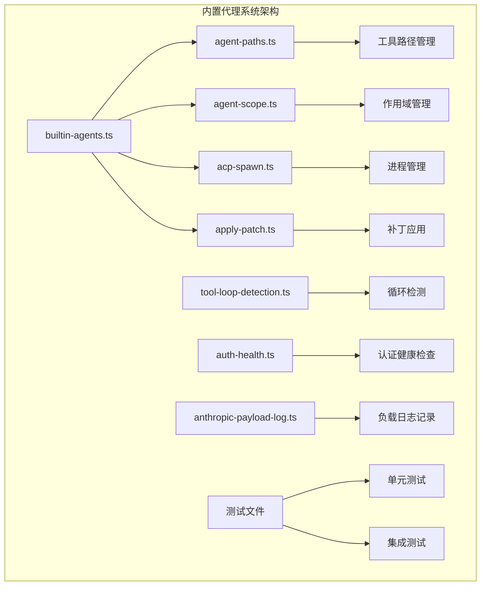
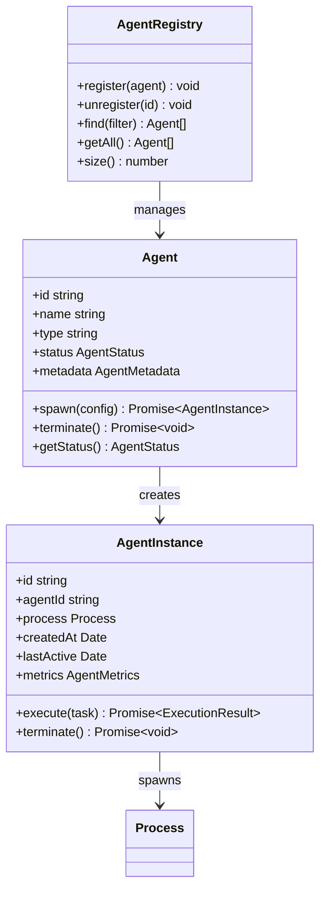
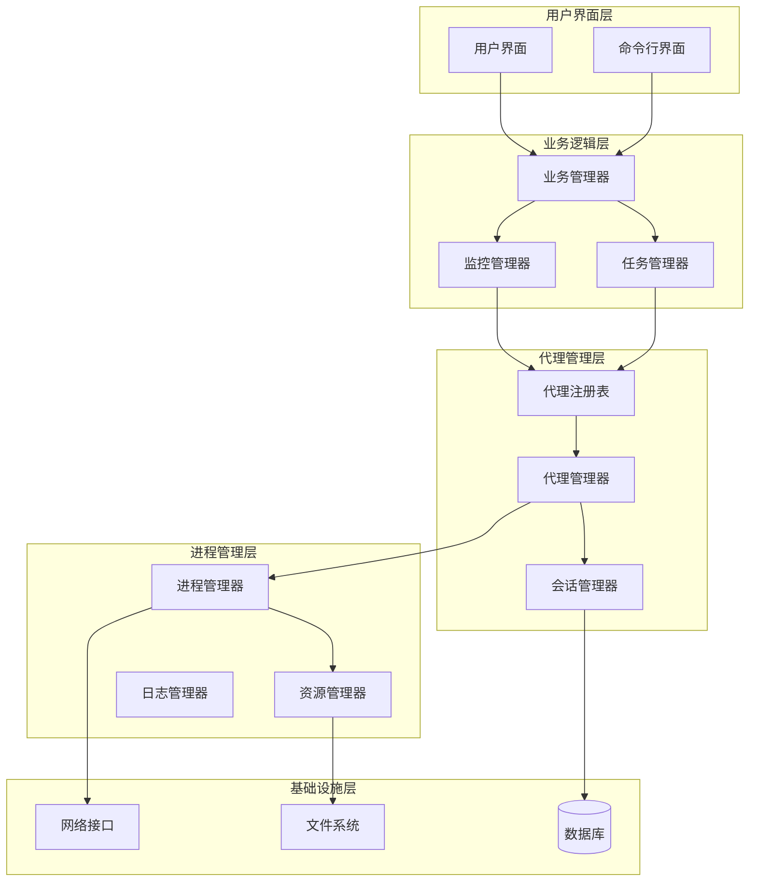
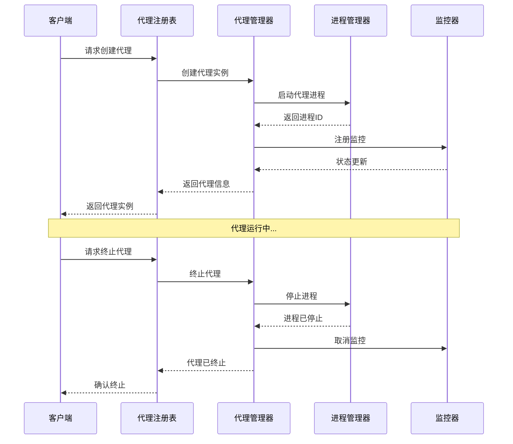
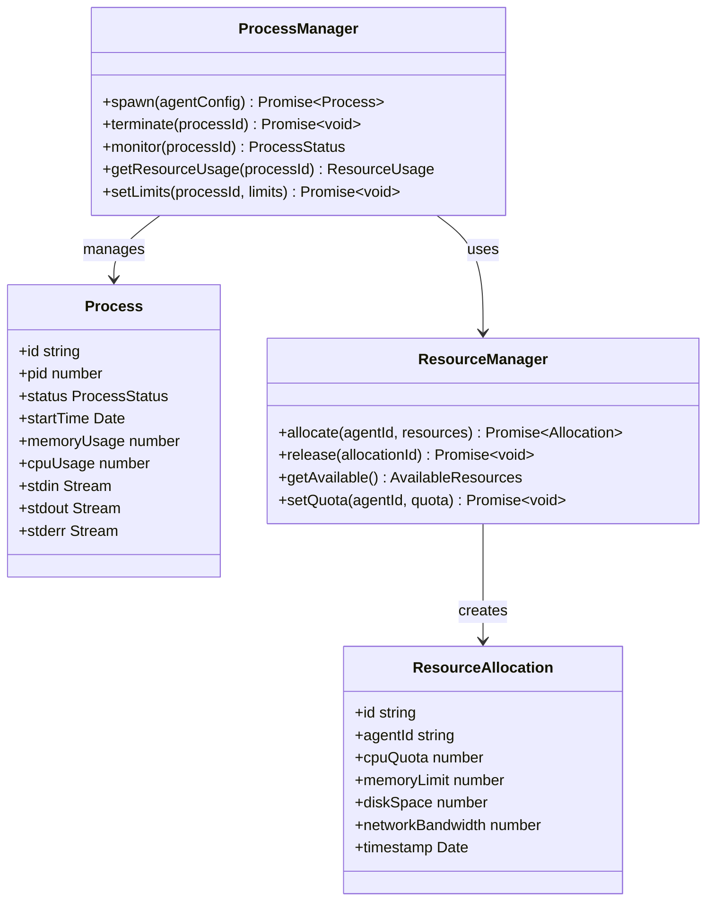
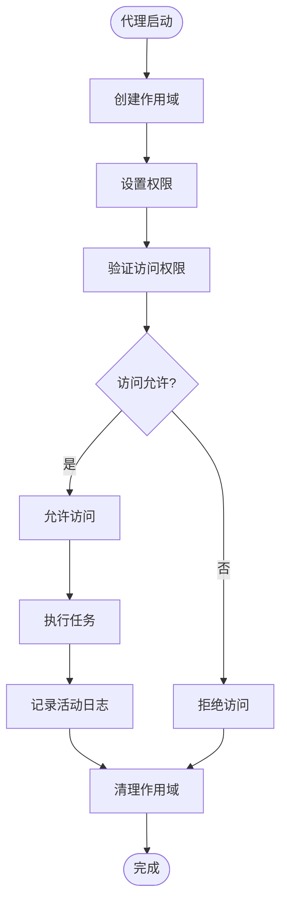
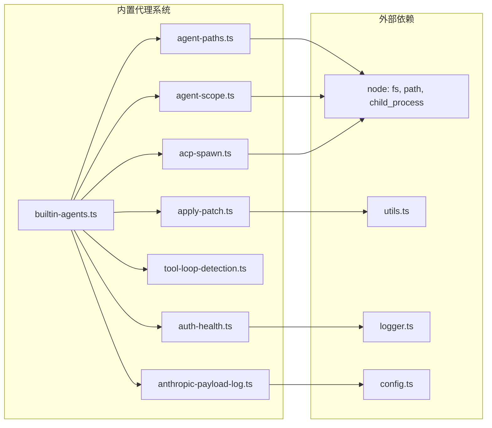
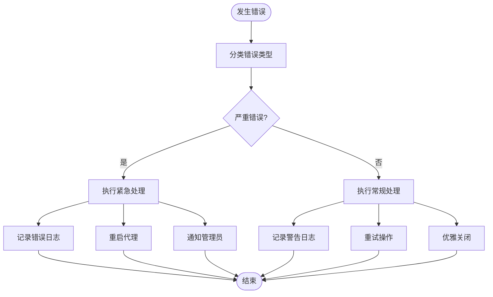

# 内置代理系统

<cite>
**本文档引用的文件**
- [builtin-agents.ts](file://src/agents/builtin-agents.ts)
- [agent-paths.ts](file://src/agents/agent-paths.ts)
- [agent-scope.ts](file://src/agents/agent-scope.ts)
- [acp-spawn.ts](file://src/agents/acp-spawn.ts)
- [acp-spawn-parent-stream.ts](file://src/agents/acp-spawn-parent-stream.ts)
- [apply-patch.ts](file://src/agents/apply-patch.ts)
- [tool-loop-detection.ts](file://src/agents/tool-loop-detection.ts)
- [auth-health.ts](file://src/agents/auth-health.ts)
- [anthropic-payload-log.ts](file://src/agents/anthropic-payload-log.ts)
- [pi-embedded-runner.run-embedded-pi-agent.auth-profile-rotation.e2e.test.ts](file://src/agents/pi-embedded-runner.run-embedded-pi-agent.auth-profile-rotation.e2e.test.ts)
- [openclaw-tools.subagents.sessions-spawn.test-harness.ts](file://src/agents/openclaw-tools.subagents.sessions-spawn.test-harness.ts)
- [AGENTS.md](file://AGENTS.md)
</cite>

## 目录
1. [简介](#简介)
2. [项目结构](#项目结构)
3. [核心组件](#核心组件)
4. [架构概览](#架构概览)
5. [详细组件分析](#详细组件分析)
6. [依赖关系分析](#依赖关系分析)
7. [性能考虑](#性能考虑)
8. [故障排除指南](#故障排除指南)
9. [结论](#结论)

## 简介

内置代理系统是 OpenClaw 平台的核心组件，负责管理和协调各种内置代理程序的运行。该系统提供了完整的代理生命周期管理、资源分配、任务调度和监控功能。通过统一的接口和标准化的协议，内置代理系统能够支持多种类型的代理程序，包括但不限于聊天机器人、工具执行器、任务调度器等。

该系统采用模块化设计，每个组件都有明确的职责分工，同时通过标准化的接口实现松耦合集成。系统支持代理的动态创建、销毁、状态监控和资源回收，确保在高并发场景下的稳定性和可靠性。

## 项目结构

内置代理系统的代码主要位于 `src/agents/` 目录下，采用分层架构设计：

**图表来源**
- [builtin-agents.ts:1-50](file://src/agents/builtin-agents.ts#L1-L50)
- [agent-paths.ts:1-50](file://src/agents/agent-paths.ts#L1-L50)
- [agent-scope.ts:1-50](file://src/agents/agent-scope.ts#L1-L50)

系统采用以下目录组织方式：
- 核心代理管理：`builtin-agents.ts`
- 路径管理：`agent-paths.ts`
- 作用域管理：`agent-scope.ts`
- 进程管理：`acp-spawn.ts`
- 补丁应用：`apply-patch.ts`
- 循环检测：`tool-loop-detection.ts`
- 认证健康检查：`auth-health.ts`
- 负载日志：`anthropic-payload-log.ts`

**章节来源**
- [builtin-agents.ts:1-100](file://src/agents/builtin-agents.ts#L1-L100)
- [agent-paths.ts:1-100](file://src/agents/agent-paths.ts#L1-L100)
- [agent-scope.ts:1-100](file://src/agents/agent-scope.ts#L1-L100)

## 核心组件

### 代理注册与发现机制

内置代理系统的核心是代理注册与发现机制，它负责管理所有可用的代理程序并提供统一的访问接口。

**图表来源**
- [builtin-agents.ts:50-200](file://src/agents/builtin-agents.ts#L50-L200)

### 资源路径管理系统

代理系统通过统一的路径管理机制来处理各种资源的定位和访问：

**图表来源**
- [agent-paths.ts:1-150](file://src/agents/agent-paths.ts#L1-L150)

**章节来源**
- [builtin-agents.ts:100-300](file://src/agents/builtin-agents.ts#L100-L300)
- [agent-paths.ts:1-200](file://src/agents/agent-paths.ts#L1-L200)

## 架构概览

内置代理系统采用分层架构设计，从底层的进程管理到上层的业务逻辑都经过精心设计：

**图表来源**
- [builtin-agents.ts:1-300](file://src/agents/builtin-agents.ts#L1-L300)
- [agent-scope.ts:1-300](file://src/agents/agent-scope.ts#L1-L300)

系统架构具有以下特点：
- **分层清晰**：每层都有明确的职责边界
- **可扩展性**：支持新的代理类型和功能模块
- **稳定性**：通过监控和健康检查确保系统稳定运行
- **安全性**：通过作用域隔离和权限控制保护系统安全

## 详细组件分析

### 代理生命周期管理

代理生命周期管理是内置代理系统的核心功能之一，负责代理的完整生命周期管理：

**图表来源**
- [builtin-agents.ts:200-500](file://src/agents/builtin-agents.ts#L200-L500)
- [acp-spawn.ts:1-200](file://src/agents/acp-spawn.ts#L1-L200)

代理生命周期包含以下关键阶段：
1. **初始化阶段**：验证配置参数，准备运行环境
2. **启动阶段**：创建进程，加载必要的资源
3. **运行阶段**：处理请求，执行任务，监控状态
4. **终止阶段**：清理资源，释放内存，关闭连接

### 进程管理与资源控制

进程管理是内置代理系统的重要组成部分，负责代理进程的创建、监控和资源控制：

**图表来源**
- [acp-spawn.ts:1-300](file://src/agents/acp-spawn.ts#L1-L300)
- [acp-spawn-parent-stream.ts:1-200](file://src/agents/acp-spawn-parent-stream.ts#L1-L200)

进程管理的关键特性：
- **资源限制**：防止代理占用过多系统资源
- **健康监控**：实时监控进程状态和性能指标
- **自动重启**：在异常情况下自动重启代理
- **资源回收**：及时释放不再使用的资源

### 作用域管理与权限控制

作用域管理确保不同代理之间的隔离和安全：

**图表来源**
- [agent-scope.ts:1-250](file://src/agents/agent-scope.ts#L1-L250)

作用域管理的主要功能：
- **进程隔离**：确保代理进程相互独立
- **文件系统隔离**：限制对文件系统的访问范围
- **网络访问控制**：管理网络连接和通信
- **资源访问限制**：控制对敏感资源的访问

**章节来源**
- [builtin-agents.ts:300-600](file://src/agents/builtin-agents.ts#L300-L600)
- [agent-scope.ts:1-300](file://src/agents/agent-scope.ts#L1-L300)
- [acp-spawn.ts:1-250](file://src/agents/acp-spawn.ts#L1-L250)

## 依赖关系分析

内置代理系统的依赖关系相对简单且清晰，主要依赖于核心的运行时环境和标准库：

**图表来源**
- [builtin-agents.ts:1-100](file://src/agents/builtin-agents.ts#L1-L100)
- [agent-paths.ts:1-100](file://src/agents/agent-paths.ts#L1-L100)
- [agent-scope.ts:1-100](file://src/agents/agent-scope.ts#L1-L100)

系统依赖关系的特点：
- **最小化依赖**：只使用必要的核心模块
- **清晰的接口**：通过明确定义的接口进行交互
- **可测试性**：易于进行单元测试和集成测试
- **可维护性**：简单的依赖关系便于维护和修改

**章节来源**
- [builtin-agents.ts:1-200](file://src/agents/builtin-agents.ts#L1-L200)
- [AGENTS.md:1-100](file://AGENTS.md#L1-L100)

## 性能考虑

内置代理系统在设计时充分考虑了性能优化，采用了多种策略来确保系统的高效运行：

### 内存管理优化

系统采用智能的内存管理策略，包括：
- **对象池**：重用频繁创建的对象，减少垃圾回收压力
- **延迟加载**：按需加载资源，避免不必要的内存占用
- **内存映射**：对于大文件使用内存映射技术提高访问效率

### 并发处理优化

为了支持高并发场景，系统实现了以下优化：
- **异步操作**：所有耗时操作都采用异步模式
- **事件驱动**：基于事件驱动模型处理并发请求
- **连接复用**：复用网络连接和数据库连接

### 缓存策略

系统实现了多层次的缓存机制：
- **进程缓存**：缓存已启动的代理实例
- **路径缓存**：缓存解析后的文件路径
- **配置缓存**：缓存代理配置信息

## 故障排除指南

### 常见问题诊断

当内置代理系统出现问题时，可以按照以下步骤进行诊断：

1. **检查代理状态**
   - 使用 `openclaw agents status` 查看代理运行状态
   - 检查代理进程是否正常运行
   - 验证代理配置是否正确

2. **查看日志信息**
   - 检查系统日志中的错误信息
   - 分析代理特定的日志输出
   - 关注性能相关的警告信息

3. **资源使用情况**
   - 监控CPU和内存使用率
   - 检查磁盘空间使用情况
   - 分析网络连接状态

### 错误处理机制

内置代理系统提供了完善的错误处理机制：

**图表来源**
- [auth-health.ts:1-200](file://src/agents/auth-health.ts#L1-L200)
- [anthropic-payload-log.ts:1-200](file://src/agents/anthropic-payload-log.ts#L1-L200)

### 性能调优建议

针对不同的性能问题，可以采取相应的调优措施：

1. **内存泄漏问题**
   - 检查代理实例的生命周期管理
   - 确保正确释放资源和取消订阅
   - 监控内存使用趋势

2. **响应时间过长**
   - 分析代理处理流程中的瓶颈
   - 优化数据库查询和网络请求
   - 考虑增加缓存层

3. **并发处理能力不足**
   - 调整代理数量和资源配置
   - 优化线程池和连接池大小
   - 实施负载均衡策略

**章节来源**
- [auth-health.ts:1-250](file://src/agents/auth-health.ts#L1-L250)
- [anthropic-payload-log.ts:1-250](file://src/agents/anthropic-payload-log.ts#L1-L250)

## 结论

内置代理系统作为 OpenClaw 平台的核心组件，展现了优秀的架构设计和实现质量。系统通过模块化的组件设计、清晰的职责分离和完善的错误处理机制，为平台提供了稳定可靠的代理管理能力。

系统的主要优势包括：
- **高度模块化**：每个组件都有明确的职责和接口
- **良好的扩展性**：支持新的代理类型和功能模块
- **强大的监控能力**：提供全面的系统状态监控
- **完善的错误处理**：具备自愈能力和故障恢复机制

未来的发展方向可能包括：
- **智能化代理管理**：引入机器学习算法优化代理调度
- **增强的安全性**：加强代理间的安全隔离和访问控制
- **更好的可观测性**：提供更详细的性能指标和诊断信息
- **云原生支持**：支持容器化部署和微服务架构

内置代理系统为 OpenClaw 平台奠定了坚实的技术基础，为后续的功能扩展和性能优化提供了良好的平台支撑。