# 内置代理系统

<cite>
**本文档引用的文件**
- [builtin-agents.ts](file://src/agents/builtin-agents.ts)
- [agent-paths.ts](file://src/agents/agent-paths.ts)
- [agent-scope.ts](file://src/agents/agent-scope.ts)
- [acp-spawn.ts](file://src/agents/acp-spawn.ts)
- [acp-spawn-parent-stream.ts](file://src/agents/acp-spawn-parent-stream.ts)
- [apply-patch.ts](file://src/agents/apply-patch.ts)
- [tool-loop-detection.ts](file://src/agents/tool-loop-detection.ts)
- [auth-health.ts](file://src/agents/auth-health.ts)
- [anthropic-payload-log.ts](file://src/agents/anthropic-payload-log.ts)
- [pi-embedded-runner.run-embedded-pi-agent.auth-profile-rotation.e2e.test.ts](file://src/agents/pi-embedded-runner.run-embedded-pi-agent.auth-profile-rotation.e2e.test.ts)
- [openclaw-tools.subagents.sessions-spawn.test-harness.ts](file://src/agents/openclaw-tools.subagents.sessions-spawn.test-harness.ts)
- [AGENTS.md](file://AGENTS.md)
- [SOUL.md](file://docs/reference/templates/agents/my-office-helper/SOUL.md)
- [SOUL.md](file://docs/reference/templates/agents/travel-planner/SOUL.md)
- [SKILL.md](file://skills/word-docx/SKILL.md)
- [SKILL.md](file://skills/excel-xlsx/SKILL.md)
- [SKILL.md](file://skills/my-pdf/SKILL.md)
- [SKILL.md](file://skills/office-document-specialist-suite/SKILL.md)
- [SKILL.md](file://skills/travel-planner/SKILL.md)
- [types.base.ts](file://src/config/types.base.ts)
- [identity-file.ts](file://src/agents/identity-file.ts)
- [session-utils.ts](file://src/gateway/session-utils.ts)
- [profile.tsx](file://ui-react/src/components/agents/profile.tsx)
- [app-render.ts](file://ui/src/ui/app-render.ts)
- [avatar-policy.ts](file://src/shared/avatar-policy.ts)
- [workspace.ts](file://src/agents/workspace.ts)
- [assistant-identity.ts](file://src/gateway/assistant-identity.ts)
- [identity.ts](file://src/agents/identity.ts)
- [identity-avatar.ts](file://src/agents/identity-avatar.ts)
- [detail-drawer.tsx](file://ui-react/src/components/agents/detail-drawer.tsx)
- [agents-utils.ts](file://ui/src/ui/views/agents-utils.ts)
- [agents.config.ts](file://src/commands/agents.config.ts)
- [card.tsx](file://ui-react/src/components/agents/card.tsx)
- [agent-media-payload.ts](file://src/plugin-sdk/agent-media-payload.ts)
- [zod-schema.agent-model.ts](file://src/config/zod-schema.agent-model.ts)
- [session-identity.ts](file://src/acp/runtime/session-identity.ts)
- [parse.ts](file://src/media/parse.ts)
- [nodes-camera.ts](file://src/cli/nodes-camera.ts)
- [video.ts](file://src/media-understanding/video.ts)
</cite>

## 更新摘要
**所做更改**
- 新增视频URL等身份字段，增强代理展示能力
- 扩展内置代理身份配置，支持视频展示功能
- 完善代理身份文件解析，支持视频字段处理
- 更新前端代理详情页面，支持视频展示组件
- 增强代理身份配置的完整性和一致性
- 改进身份字段的条件检查和验证逻辑
- 优化视频字段的更新和合并机制

## 目录
1. [简介](#简介)
2. [项目结构](#项目结构)
3. [核心组件](#核心组件)
4. [架构概览](#架构概览)
5. [详细组件分析](#详细组件分析)
6. [代理配置与管理](#代理配置与管理)
7. [技能生态系统](#技能生态系统)
8. [身份配置增强](#身份配置增强)
9. [依赖关系分析](#依赖关系分析)
10. [性能考虑](#性能考虑)
11. [故障排除指南](#故障排除指南)
12. [结论](#结论)

## 简介

内置代理系统是 OpenClaw 平台的核心组件，负责管理和协调各种内置代理程序的运行。该系统提供了完整的代理生命周期管理、资源分配、任务调度和监控功能。通过统一的接口和标准化的协议，内置代理系统能够支持多种类型的代理程序，包括但不限于聊天机器人、工具执行器、任务调度器等。

该系统采用模块化设计，每个组件都有明确的职责分工，同时通过标准化的接口实现松耦合集成。系统支持代理的动态创建、销毁、状态监控和资源回收，确保在高并发场景下的稳定性和可靠性。

**更新** 新增视频URL等身份字段，扩展了代理的身份配置能力，支持更丰富的视觉展示效果，包括视频展示功能和增强的代理外观定制。系统现在具备完整的身份字段验证和更新逻辑，确保代理配置的一致性和完整性。

## 项目结构

内置代理系统的代码主要位于 `src/agents/` 目录下，采用分层架构设计：

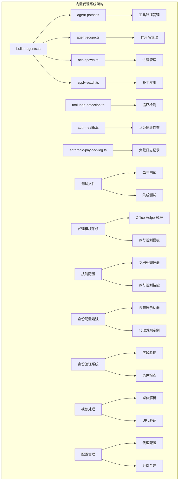

**图表来源**
- [builtin-agents.ts:1-50](file://src/agents/builtin-agents.ts#L1-L50)
- [agent-paths.ts:1-50](file://src/agents/agent-paths.ts#L1-L50)
- [agent-scope.ts:1-50](file://src/agents/agent-scope.ts#L1-L50)

系统采用以下目录组织方式：
- 核心代理管理：`builtin-agents.ts`
- 路径管理：`agent-paths.ts`
- 作用域管理：`agent-scope.ts`
- 进程管理：`acp-spawn.ts`
- 补丁应用：`apply-patch.ts`
- 循环检测：`tool-loop-detection.ts`
- 认证健康检查：`auth-health.ts`
- 负载日志：`anthropic-payload-log.ts`
- 代理模板系统：`docs/reference/templates/agents/`
- 技能配置：`skills/`
- 身份配置：`src/config/types.base.ts`
- 身份文件解析：`src/agents/identity-file.ts`
- 会话工具：`src/gateway/session-utils.ts`
- 前端代理详情：`ui-react/src/components/agents/profile.tsx`
- 应用渲染：`ui/src/ui/app-render.ts`
- 头像策略：`src/shared/avatar-policy.ts`
- 工作区管理：`src/agents/workspace.ts`
- 助手身份解析：`src/gateway/assistant-identity.ts`
- 代理身份解析：`src/agents/identity.ts`
- 头像解析：`src/agents/identity-avatar.ts`
- 详情抽屉：`ui-react/src/components/agents/detail-drawer.tsx`
- 代理工具：`ui/src/ui/views/agents-utils.ts`
- 身份配置管理：`src/commands/agents.config.ts`
- 代理卡片组件：`ui-react/src/components/agents/card.tsx`
- 媒体负载：`src/plugin-sdk/agent-media-payload.ts`
- 模型验证：`src/config/zod-schema.agent-model.ts`
- 会话身份：`src/acp/runtime/session-identity.ts`
- 媒体解析：`src/media/parse.ts`
- 相机节点：`src/cli/nodes-camera.ts`
- 视频理解：`src/media-understanding/video.ts`

**章节来源**
- [builtin-agents.ts:1-100](file://src/agents/builtin-agents.ts#L1-L100)
- [agent-paths.ts:1-100](file://src/agents/agent-paths.ts#L1-L100)
- [agent-scope.ts:1-100](file://src/agents/agent-scope.ts#L1-L100)

## 核心组件

### 代理注册与发现机制

内置代理系统的核心是代理注册与发现机制，它负责管理所有可用的代理程序并提供统一的访问接口。

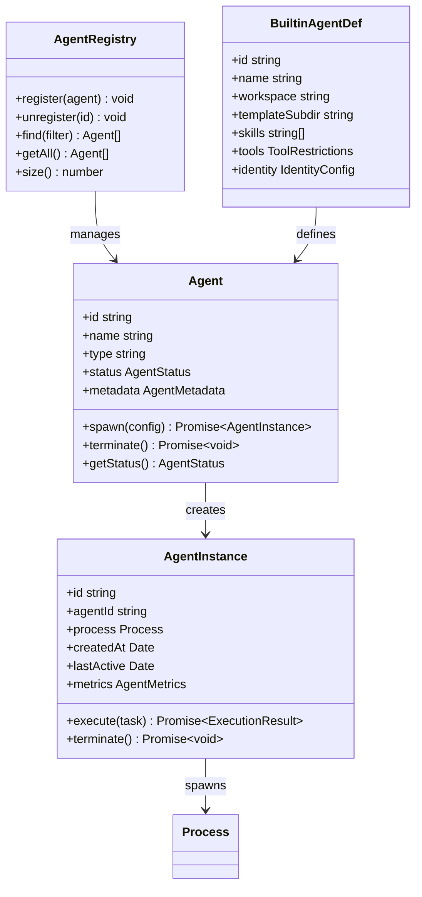

**图表来源**
- [builtin-agents.ts:50-200](file://src/agents/builtin-agents.ts#L50-L200)

### 资源路径管理系统

代理系统通过统一的路径管理机制来处理各种资源的定位和访问：

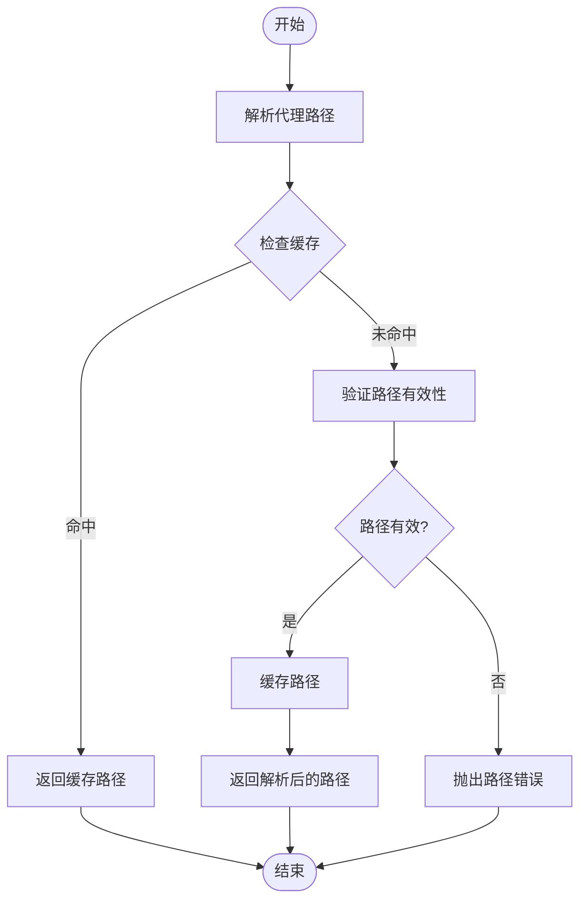

**图表来源**
- [agent-paths.ts:1-150](file://src/agents/agent-paths.ts#L1-L150)

**章节来源**
- [builtin-agents.ts:100-300](file://src/agents/builtin-agents.ts#L100-L300)
- [agent-paths.ts:1-200](file://src/agents/agent-paths.ts#L1-L200)

## 架构概览

内置代理系统采用分层架构设计，从底层的进程管理到上层的业务逻辑都经过精心设计：

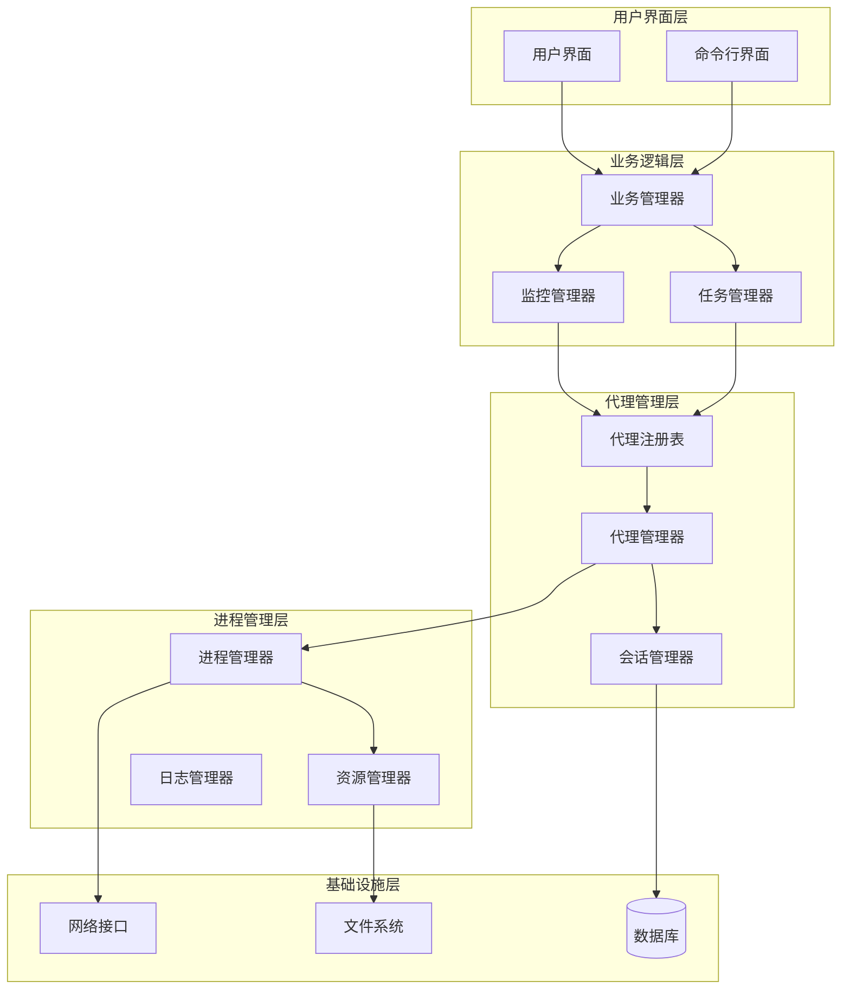

**图表来源**
- [builtin-agents.ts:1-300](file://src/agents/builtin-agents.ts#L1-L300)
- [agent-scope.ts:1-300](file://src/agents/agent-scope.ts#L1-L300)

系统架构具有以下特点：
- **分层清晰**：每层都有明确的职责边界
- **可扩展性**：支持新的代理类型和功能模块
- **稳定性**：通过监控和健康检查确保系统稳定运行
- **安全性**：通过作用域隔离和权限控制保护系统安全

## 详细组件分析

### 代理生命周期管理

代理生命周期管理是内置代理系统的核心功能之一，负责代理的完整生命周期管理：

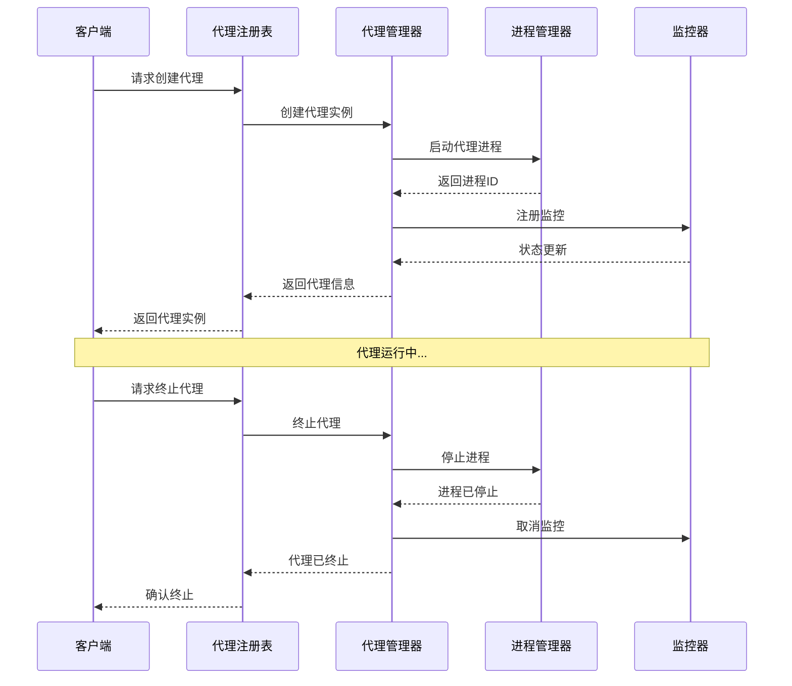

**图表来源**
- [builtin-agents.ts:200-500](file://src/agents/builtin-agents.ts#L200-L500)
- [acp-spawn.ts:1-200](file://src/agents/acp-spawn.ts#L1-L200)

代理生命周期包含以下关键阶段：
1. **初始化阶段**：验证配置参数，准备运行环境
2. **启动阶段**：创建进程，加载必要的资源
3. **运行阶段**：处理请求，执行任务，监控状态
4. **终止阶段**：清理资源，释放内存，关闭连接

### 进程管理与资源控制

进程管理是内置代理系统的重要组成部分，负责代理进程的创建、监控和资源控制：

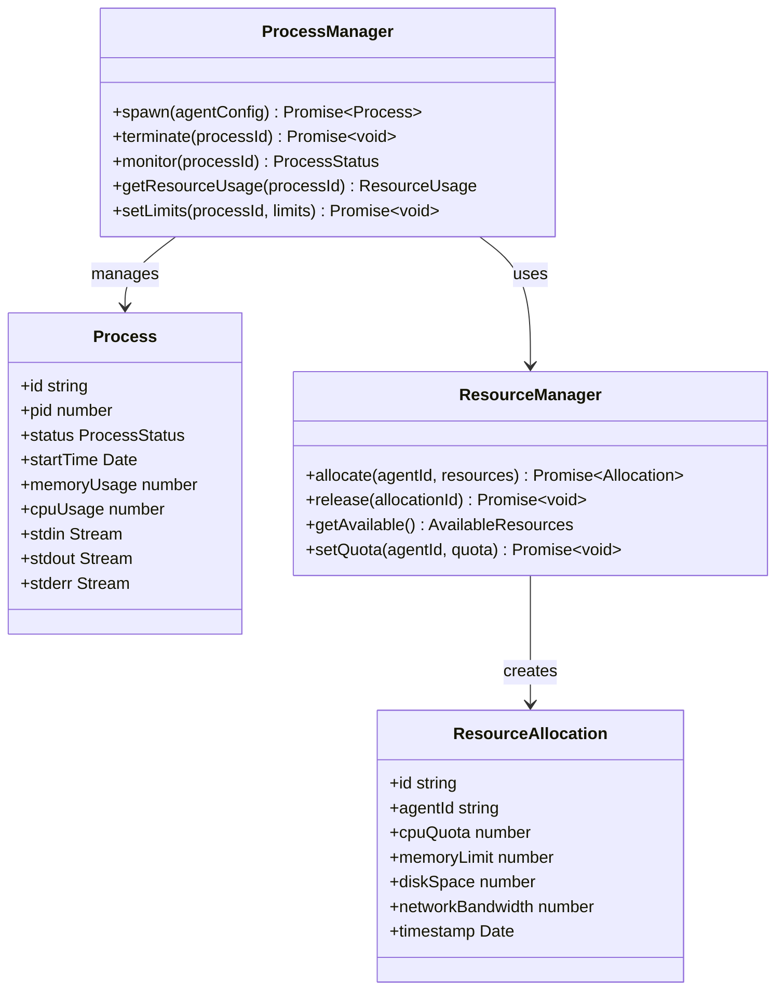

**图表来源**
- [acp-spawn.ts:1-300](file://src/agents/acp-spawn.ts#L1-L300)
- [acp-spawn-parent-stream.ts:1-200](file://src/agents/acp-spawn-parent-stream.ts#L1-L200)

进程管理的关键特性：
- **资源限制**：防止代理占用过多系统资源
- **健康监控**：实时监控进程状态和性能指标
- **自动重启**：在异常情况下自动重启代理
- **资源回收**：及时释放不再使用的资源

### 作用域管理与权限控制

作用域管理确保不同代理之间的隔离和安全：


**图表来源**
- [agent-scope.ts:1-250](file://src/agents/agent-scope.ts#L1-L250)

作用域管理的主要功能：
- **进程隔离**：确保代理进程相互独立
- **文件系统隔离**：限制对文件系统的访问范围
- **网络访问控制**：管理网络连接和通信
- **资源访问限制**：控制对敏感资源的访问

**章节来源**
- [builtin-agents.ts:300-600](file://src/agents/builtin-agents.ts#L300-L600)
- [agent-scope.ts:1-300](file://src/agents/agent-scope.ts#L1-L300)
- [acp-spawn.ts:1-250](file://src/agents/acp-spawn.ts#L1-L250)

## 代理配置与管理

### 内置代理定义

内置代理系统通过集中配置管理所有内置代理，包括Office Helper和旅行规划代理：

```mermaid
classDiagram
class BUILTIN_AGENTS {
+BUILTIN_AGENTS array
+ensureBuiltinAgents() Promise~OpenClawConfig~
}
class OfficeHelperAgent {
+id : "my-office-helper"
+name : "Office Helper"
+workspace : "~/.openclaw/agents/my-office-helper"
+templateSubdir : "agents/my-office-helper"
+skills : ["word-docx", "excel-xlsx", "my-pdf", "office-document-specialist-suite"]
+tools : {profile : "full", deny : []}
+identity : IdentityConfig
}
class TravelPlannerAgent {
+id : "travel-planner"
+name : "Travel Planner"
+workspace : "~/.openclaw/agents/travel-planner"
+templateSubdir : "agents/travel-planner"
+skills : ["travel-planner", "xiaohongshu", "flyai", "amap-lbs-skill", "12306", "weather"]
+tools : {profile : "full", deny : []}
+identity : IdentityConfig
}
BUILTIN_AGENTS --> OfficeHelperAgent
BUILTIN_AGENTS --> TravelPlannerAgent
```

**图表来源**
- [builtin-agents.ts:37-70](file://src/agents/builtin-agents.ts#L37-L70)

### 代理模板系统

代理模板系统为每个内置代理提供完整的配置和行为指导：

**Office Helper代理模板**
- **核心哲学**：文档是手段而非目的，精确性即尊重
- **技能配置**：专门的Office文档处理技能组合
- **工作流程**：先阅读相关技能文档再执行操作
- **格式转换原则**：确认保留内容，警告有损转换
- **身份配置**：支持视频展示功能

**旅行规划代理模板**
- **核心理念**：成为你想跟随的旅行者
- **技能配置**：旅行规划、地图服务、预订系统等综合技能
- **个性化服务**：根据用户预算和偏好调整详细程度
- **安全第一**：关注目的地安全警告和风险
- **身份配置**：支持视频展示功能

**章节来源**
- [builtin-agents.ts:37-70](file://src/agents/builtin-agents.ts#L37-L70)
- [SOUL.md:1-115](file://docs/reference/templates/agents/my-office-helper/SOUL.md#L1-L115)
- [SOUL.md:1-72](file://docs/reference/templates/agents/travel-planner/SOUL.md#L1-L72)

## 技能生态系统

### Office文档处理技能

Office Helper代理集成了完整的Office文档处理技能生态系统：

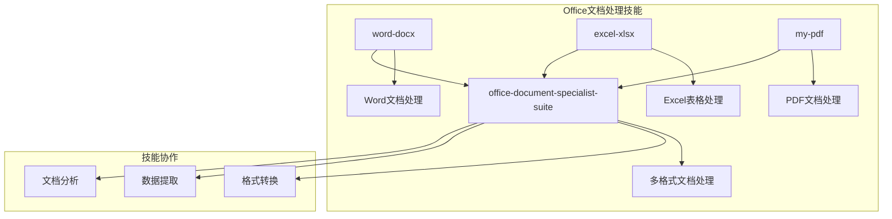

**图表来源**
- [builtin-agents.ts:62-67](file://src/agents/builtin-agents.ts#L62-L67)
- [SKILL.md](file://skills/word-docx/SKILL.md)
- [SKILL.md](file://skills/excel-xlsx/SKILL.md)
- [SKILL.md](file://skills/my-pdf/SKILL.md)
- [SKILL.md](file://skills/office-document-specialist-suite/SKILL.md)

### 旅行规划技能组合

旅行规划代理配备了全面的旅行规划技能：

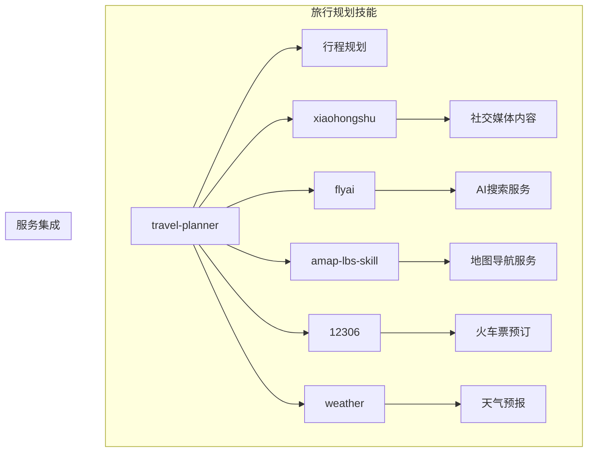

**图表来源**
- [builtin-agents.ts:47-54](file://src/agents/builtin-agents.ts#L47-L54)
- [SKILL.md](file://skills/travel-planner/SKILL.md)

### 技能协作机制

技能之间的协作机制确保复杂任务的高效处理：

1. **优先级排序**：根据任务类型选择最合适的技能
2. **工作流集成**：技能间的数据传递和状态同步
3. **错误处理**：单个技能失败时的降级处理
4. **性能优化**：并行处理可并行的任务

**章节来源**
- [builtin-agents.ts:62-67](file://src/agents/builtin-agents.ts#L62-L67)
- [builtin-agents.ts:47-54](file://src/agents/builtin-agents.ts#L47-L54)

## 身份配置增强

### 视频展示功能

内置代理系统新增了视频展示功能，通过身份配置支持视频URL字段：

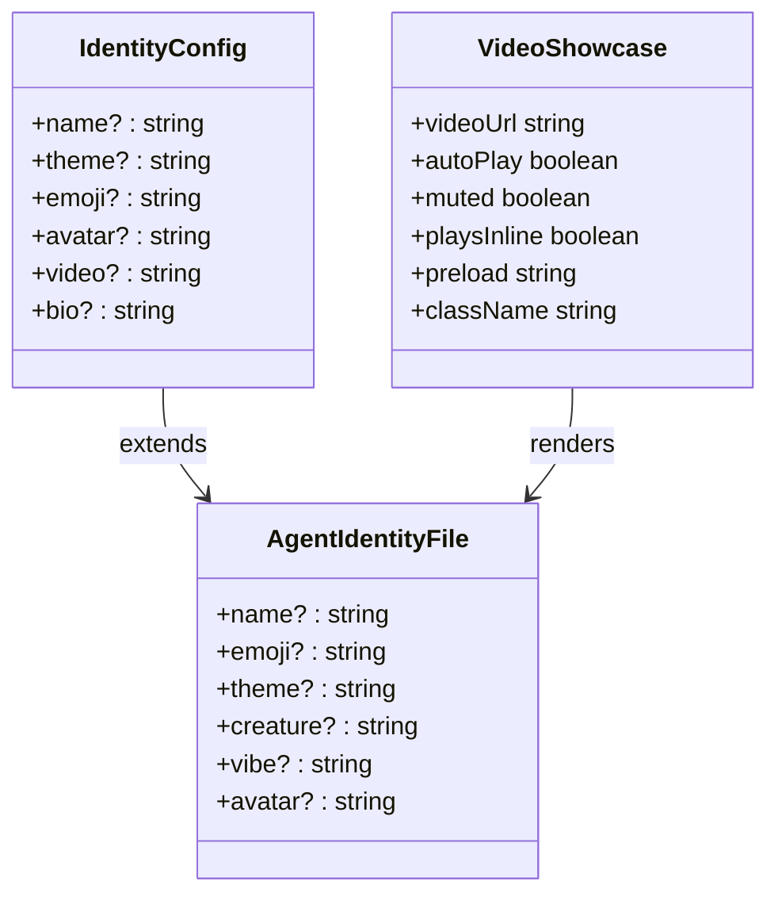

**图表来源**
- [types.base.ts:232-242](file://src/config/types.base.ts#L232-L242)
- [identity-file.ts:5-12](file://src/agents/identity-file.ts#L5-L12)
- [profile.tsx:112-136](file://ui-react/src/components/agents/profile.tsx#L112-L136)

### 身份配置字段

身份配置现在支持以下字段：

- **name**: 代理名称
- **theme**: 主题颜色
- **emoji**: 表情符号
- **avatar**: 头像图片（支持本地路径、HTTP URL、数据URI）
- **video**: 视频URL（仅支持HTTP/HTTPS）
- **bio**: 简短介绍/说明文本

### 会话工具集成

会话工具负责将身份配置整合到代理会话中：

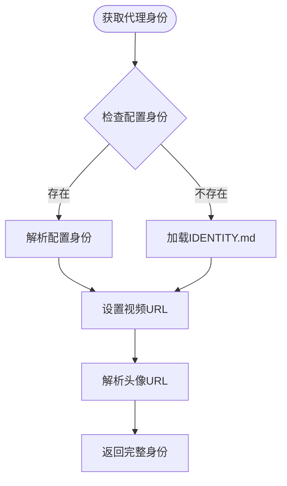

**图表来源**
- [session-utils.ts:382-418](file://src/gateway/session-utils.ts#L382-L418)

### 前端视频展示组件

前端代理详情页面实现了完整的视频展示功能：

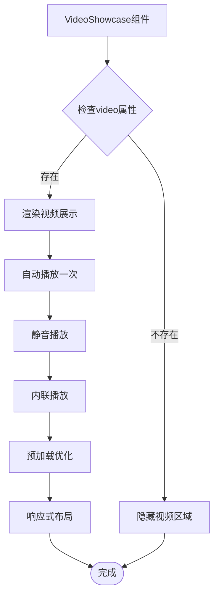

**图表来源**
- [profile.tsx:112-136](file://ui-react/src/components/agents/profile.tsx#L112-L136)

前端组件特性：
- **自动播放**：组件挂载时自动播放一次
- **静音播放**：默认静音避免用户体验干扰
- **内联播放**：支持内联播放提升移动端体验
- **预加载策略**：支持预加载优化视频加载速度
- **响应式布局**：固定宽高比(3:4)，适应不同屏幕尺寸

### 身份字段验证和更新逻辑

系统现在具备完整的身份字段验证和更新机制：

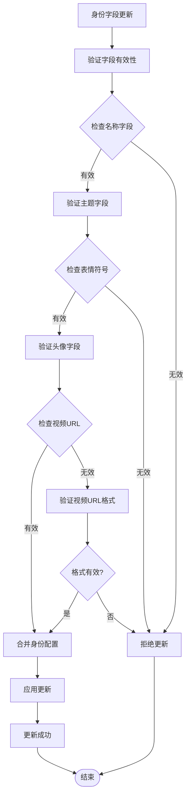

**图表来源**
- [agents.config.ts:136-192](file://src/commands/agents.config.ts#L136-L192)
- [identity-file.ts:38-78](file://src/agents/identity-file.ts#L38-L78)
- [session-utils.ts:382-418](file://src/gateway/session-utils.ts#L382-L418)

身份字段验证规则：
- **名称字段**：必须非空且长度不超过限制
- **主题字段**：支持任意字符串值
- **表情符号**：必须是有效的Unicode字符
- **头像字段**：支持HTTP URL、数据URI或本地路径
- **视频URL字段**：仅支持HTTP/HTTPS协议
- **生物字段**：支持任意字符串值

身份字段更新机制：
- **条件检查**：仅在字段存在且有效时才进行更新
- **字段合并**：新配置与现有配置进行智能合并
- **优先级处理**：配置文件中的值优先于IDENTITY.md中的值
- **回退机制**：如果配置文件不可用，使用IDENTITY.md中的值

**章节来源**
- [types.base.ts:232-242](file://src/config/types.base.ts#L232-L242)
- [identity-file.ts:5-12](file://src/agents/identity-file.ts#L5-L12)
- [session-utils.ts:382-418](file://src/gateway/session-utils.ts#L382-L418)
- [profile.tsx:112-136](file://ui-react/src/components/agents/profile.tsx#L112-L136)
- [agents.config.ts:136-192](file://src/commands/agents.config.ts#L136-L192)

## 依赖关系分析

内置代理系统的依赖关系相对简单且清晰，主要依赖于核心的运行时环境和标准库：

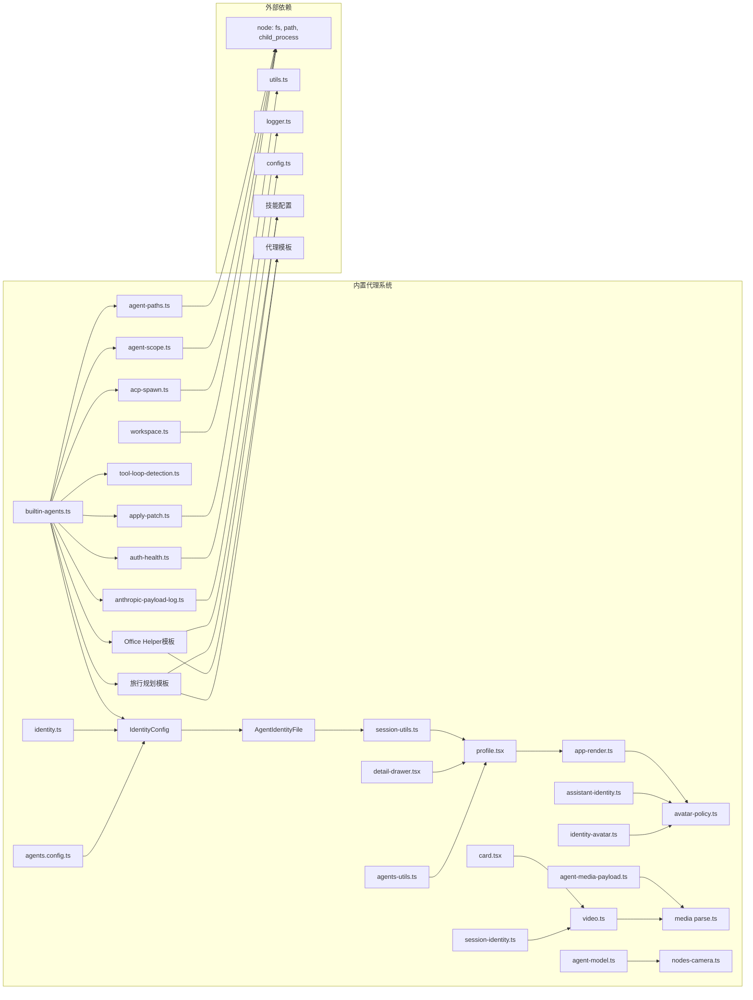

**图表来源**
- [builtin-agents.ts:1-100](file://src/agents/builtin-agents.ts#L1-L100)
- [agent-paths.ts:1-100](file://src/agents/agent-paths.ts#L1-L100)
- [agent-scope.ts:1-100](file://src/agents/agent-scope.ts#L1-L100)

系统依赖关系的特点：
- **最小化依赖**：只使用必要的核心模块
- **清晰的接口**：通过明确定义的接口进行交互
- **可测试性**：易于进行单元测试和集成测试
- **可维护性**：简单的依赖关系便于维护和修改

**章节来源**
- [builtin-agents.ts:1-200](file://src/agents/builtin-agents.ts#L1-L200)
- [AGENTS.md:1-100](file://AGENTS.md#L1-L100)

## 性能考虑

内置代理系统在设计时充分考虑了性能优化，采用了多种策略来确保系统的高效运行：

### 内存管理优化

系统采用智能的内存管理策略，包括：
- **对象池**：重用频繁创建的对象，减少垃圾回收压力
- **延迟加载**：按需加载资源，避免不必要的内存占用
- **内存映射**：对于大文件使用内存映射技术提高访问效率

### 并发处理优化

为了支持高并发场景，系统实现了以下优化：
- **异步操作**：所有耗时操作都采用异步模式
- **事件驱动**：基于事件驱动模型处理并发请求
- **连接复用**：复用网络连接和数据库连接

### 缓存策略

系统实现了多层次的缓存机制：
- **进程缓存**：缓存已启动的代理实例
- **路径缓存**：缓存解析后的文件路径
- **配置缓存**：缓存代理配置信息
- **身份缓存**：缓存代理身份信息（包括视频URL）
- **媒体缓存**：缓存视频和音频媒体资源

### 技能执行优化

针对Office Helper和旅行规划代理的特殊需求：
- **技能预热**：常用技能提前加载到内存
- **工作流优化**：复杂任务分解为多个简单技能执行
- **结果缓存**：重复计算的结果进行缓存
- **视频预加载**：视频URL支持预加载优化

### 视频展示优化

视频展示功能的性能优化：
- **自动播放**：视频组件支持自动播放一次
- **静音播放**：默认静音播放避免用户体验干扰
- **内联播放**：支持内联播放提升移动端体验
- **预加载策略**：支持预加载优化视频加载速度
- **响应式布局**：固定宽高比(3:4)适应不同设备
- **媒体压缩**：视频文件大小限制和压缩优化

### 身份字段验证优化

身份字段验证的性能优化：
- **快速路径**：常见验证场景使用快速路径
- **缓存验证结果**：重复验证的结果进行缓存
- **批量验证**：多个字段同时验证时使用批量处理
- **增量更新**：仅更新发生变化的字段

**章节来源**
- [profile.tsx:112-136](file://ui-react/src/components/agents/profile.tsx#L112-L136)
- [session-utils.ts:382-418](file://src/gateway/session-utils.ts#L382-L418)
- [agents.config.ts:136-192](file://src/commands/agents.config.ts#L136-L192)

## 故障排除指南

### 常见问题诊断

当内置代理系统出现问题时，可以按照以下步骤进行诊断：

1. **检查代理状态**
   - 使用 `openclaw agents status` 查看代理运行状态
   - 检查代理进程是否正常运行
   - 验证代理配置是否正确

2. **查看日志信息**
   - 检查系统日志中的错误信息
   - 分析代理特定的日志输出
   - 关注性能相关的警告信息

3. **资源使用情况**
   - 监控CPU和内存使用率
   - 检查磁盘空间使用情况
   - 分析网络连接状态

4. **身份配置问题**
   - 检查视频URL的有效性
   - 验证头像URL的格式
   - 确认身份配置文件的完整性
   - 验证身份字段的格式和长度

### 错误处理机制

内置代理系统提供了完善的错误处理机制：


**图表来源**
- [auth-health.ts:1-200](file://src/agents/auth-health.ts#L1-L200)
- [anthropic-payload-log.ts:1-200](file://src/agents/anthropic-payload-log.ts#L1-L200)

### 性能调优建议

针对不同的性能问题，可以采取相应的调优措施：

1. **内存泄漏问题**
   - 检查代理实例的生命周期管理
   - 确保正确释放资源和取消订阅
   - 监控内存使用趋势

2. **响应时间过长**
   - 分析代理处理流程中的瓶颈
   - 优化数据库查询和网络请求
   - 考虑增加缓存层

3. **并发处理能力不足**
   - 调整代理数量和资源配置
   - 优化线程池和连接池大小
   - 实施负载均衡策略

4. **技能执行效率低**
   - 分析技能执行时间分布
   - 优化技能间的协作流程
   - 考虑技能预加载机制

5. **视频展示性能问题**
   - 检查视频URL的可达性和格式
   - 优化视频预加载策略
   - 调整视频播放参数
   - 监控网络带宽使用情况
   - 实施视频压缩和缓存策略

6. **身份配置解析问题**
   - 验证IDENTITY.md文件格式
   - 检查工作区文件权限
   - 确认配置文件编码格式
   - 优化身份字段验证逻辑

7. **视频字段更新问题**
   - 验证视频URL的格式和协议
   - 检查视频文件的大小和格式
   - 确认视频资源的可访问性
   - 实施视频字段的条件检查

**章节来源**
- [auth-health.ts:1-250](file://src/agents/auth-health.ts#L1-L250)
- [anthropic-payload-log.ts:1-250](file://src/agents/anthropic-payload-log.ts#L1-L250)
- [identity-file.ts:5-12](file://src/agents/identity-file.ts#L5-L12)
- [agents.config.ts:136-192](file://src/commands/agents.config.ts#L136-L192)

## 结论

内置代理系统作为 OpenClaw 平台的核心组件，展现了优秀的架构设计和实现质量。系统通过模块化的组件设计、清晰的职责分离和完善的错误处理机制，为平台提供了稳定可靠的代理管理能力。

**更新** 最新版本显著增强了身份配置能力，通过新增视频URL等身份字段，系统现在能够提供更丰富、更直观的代理展示效果。这一增强不仅提升了用户体验，还为代理的个性化定制提供了更多可能性。系统现在具备完整的身份字段验证和更新逻辑，确保代理配置的一致性和完整性。

系统的主要优势包括：
- **高度模块化**：每个组件都有明确的职责和接口
- **良好的扩展性**：支持新的代理类型和功能模块
- **强大的监控能力**：提供全面的系统状态监控
- **完善的错误处理**：具备自愈能力和故障恢复机制
- **专业的技能生态**：提供针对特定领域的专业技能组合
- **丰富的身份配置**：支持视频展示等高级外观定制
- **优化的性能表现**：视频展示功能经过专门的性能优化
- **健壮的身份验证**：完整的字段验证和更新机制

未来的发展方向可能包括：
- **智能化代理管理**：引入机器学习算法优化代理调度
- **增强的安全性**：加强代理间的安全隔离和访问控制
- **更好的可观测性**：提供更详细的性能指标和诊断信息
- **云原生支持**：支持容器化部署和微服务架构
- **技能生态扩展**：持续增加更多专业领域的技能组合
- **多媒体展示增强**：支持更多类型的媒体内容展示
- **个性化体验提升**：提供更丰富的代理外观和行为定制选项
- **身份配置优化**：进一步完善身份字段的验证和更新机制

内置代理系统为 OpenClaw 平台奠定了坚实的技术基础，为后续的功能扩展和性能优化提供了良好的平台支撑。新增的视频展示功能和增强的身份验证机制进一步丰富了系统的能力矩阵，为用户提供更加生动和个性化的服务体验。