# 聊天模块深度解析

<cite>
**本文档引用的文件**
- [README.md](file://README.md)
- [message-channel.ts](file://src/utils/message-channel.ts)
- [translator.ts](file://src/acp/translator.ts)
- [delivery.ts](file://src/commands/agent/delivery.ts)
- [server-node-events.ts](file://src/gateway/server-node-events.ts)
- [dispatch-from-config.ts](file://src/auto-reply/reply/dispatch-from-config.ts)
- [monitor-debounce.ts](file://extensions/bluebubbles/src/monitor-debounce.ts)
- [processed-messages.test.ts](file://extensions/tlon/src/monitor/processed-messages.test.ts)
- [inbound.ts](file://extensions/nextcloud-talk/src/inbound.ts)
- [monitor.ts](file://extensions/zalo/src/monitor.ts)
- [ChatViewModel.swift](file://apps/shared/OpenClawKit/Sources/OpenClawChatUI/ChatViewModel.swift)
- [internal-hooks.test.ts](file://src/hooks/internal-hooks.test.ts)
- [agent.ts](file://src/gateway/server-methods/agent.ts)
</cite>

## 目录
1. [简介](#简介)
2. [项目结构概览](#项目结构概览)
3. [核心组件分析](#核心组件分析)
4. [架构总览](#架构总览)
5. [详细组件分析](#详细组件分析)
6. [依赖关系分析](#依赖关系分析)
7. [性能考量](#性能考量)
8. [故障排除指南](#故障排除指南)
9. [结论](#结论)

## 简介

OpenClaw 是一个个人AI助手平台，支持在用户已使用的各种聊天渠道上进行对话。该项目的核心优势在于其强大的聊天模块，它提供了统一的控制平面、多通道集成、会话管理和智能路由功能。

根据项目文档，OpenClaw 支持以下主要聊天渠道：
- WhatsApp、Telegram、Slack、Discord、Google Chat、Signal
- iMessage、BlueBubbles、IRC、Microsoft Teams、Matrix
- Feishu、LINE、Mattermost、Nextcloud Talk、Nostr、Synology Chat
- Tlon、Twitch、Zalo、Zalo Personal、WebChat

## 项目结构概览

OpenClaw 的聊天模块采用分层架构设计，主要包含以下几个核心层次：

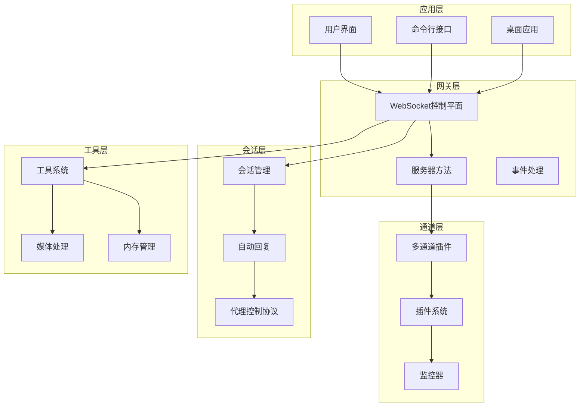

**图表来源**
- [README.md: 185-212:185-212](file://README.md#L185-L212)
- [README.md: 450-478:450-478](file://README.md#L450-L478)

**章节来源**
- [README.md: 185-212:185-212](file://README.md#L185-L212)
- [README.md: 450-478:450-478](file://README.md#L450-L478)

## 核心组件分析

### 消息通道管理系统

消息通道管理系统是聊天模块的基础架构，负责统一管理所有支持的聊天渠道。

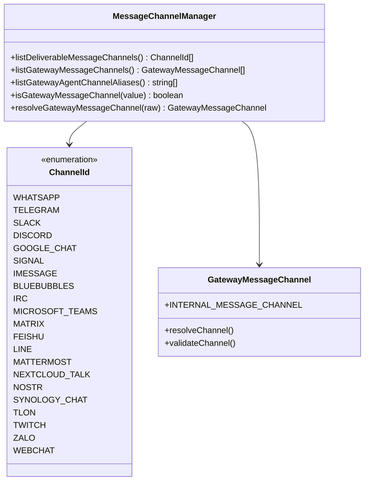

**图表来源**
- [message-channel.ts: 95-133:95-133](file://src/utils/message-channel.ts#L95-L133)

该系统的主要特性包括：
- 统一的通道标识符管理
- 内部通道与外部通道的区别
- 通道别名解析机制
- 通道验证和标准化

**章节来源**
- [message-channel.ts: 95-133:95-133](file://src/utils/message-channel.ts#L95-L133)

### 代理控制协议(ACP)翻译器

ACP翻译器是聊天模块的核心协调器，负责管理代理会话状态和配置。

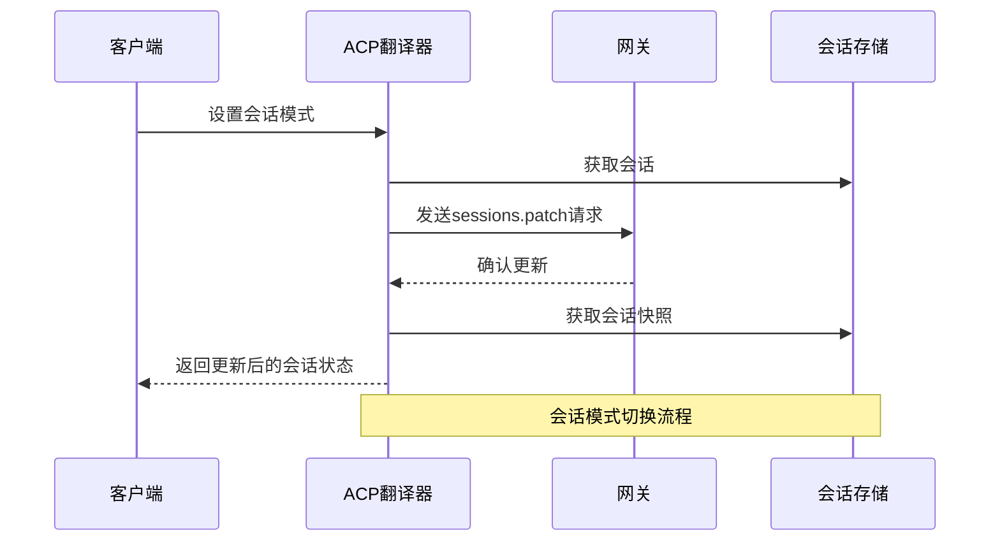

**图表来源**
- [translator.ts: 499-524:499-524](file://src/acp/translator.ts#L499-L524)

**章节来源**
- [translator.ts: 499-524:499-524](file://src/acp/translator.ts#L499-L524)

### 消息投递系统

消息投递系统负责将响应从AI代理传递到正确的聊天渠道。

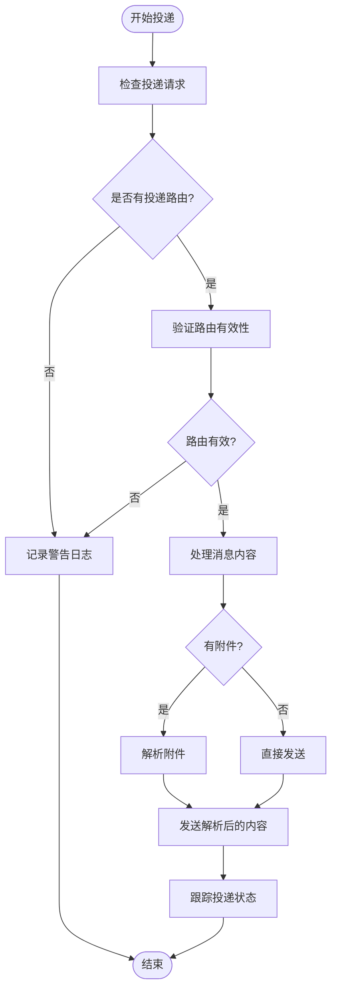

**图表来源**
- [delivery.ts: 96-117:96-117](file://src/commands/agent/delivery.ts#L96-L117)

**章节来源**
- [delivery.ts: 96-117:96-117](file://src/commands/agent/delivery.ts#L96-L117)

## 架构总览

OpenClaw 的聊天模块采用事件驱动的架构模式，通过WebSocket连接实现实时通信。

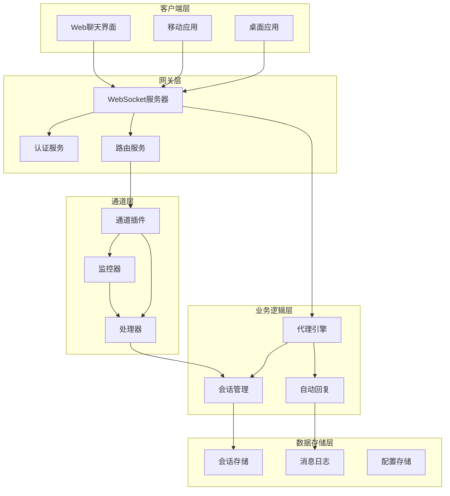

**图表来源**
- [README.md: 185-212:185-212](file://README.md#L185-L212)

## 详细组件分析

### 蓝色气泡(iMessage)监控器

蓝色气泡监控器专门处理iMessage集成，具有智能去重和防抖机制。

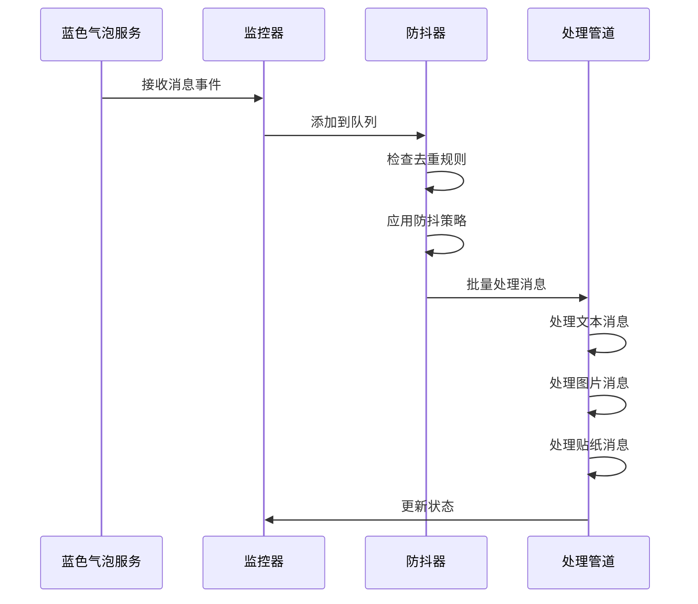

**图表来源**
- [monitor-debounce.ts: 139-176:139-176](file://extensions/bluebubbles/src/monitor-debounce.ts#L139-L176)

**章节来源**
- [monitor-debounce.ts: 139-176:139-176](file://extensions/bluebubbles/src/monitor-debounce.ts#L139-L176)

### Zalo消息处理管道

Zalo扩展展示了完整的消息处理生命周期，从接收到底层处理。

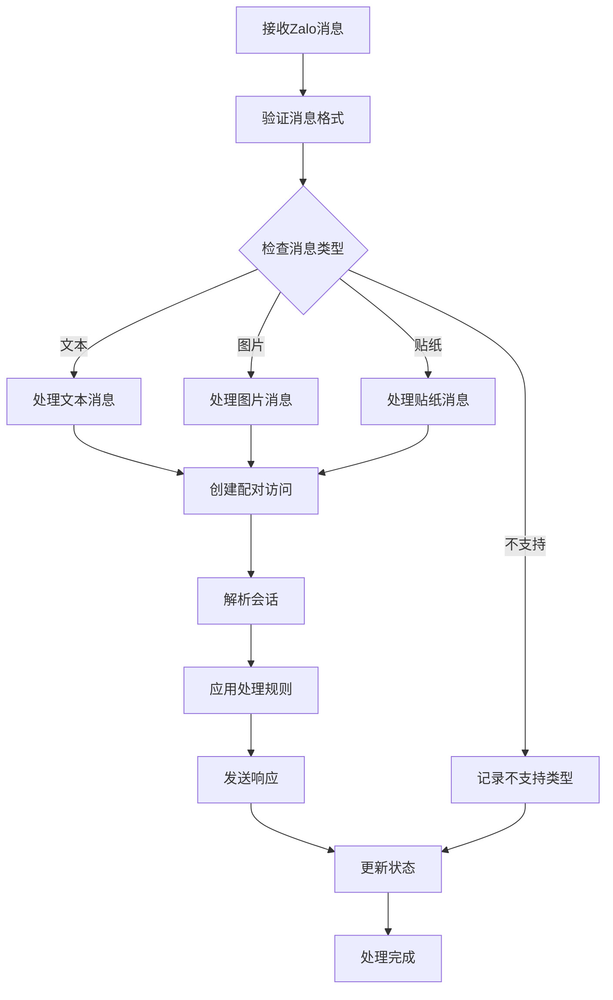

**图表来源**
- [monitor.ts: 264-378:264-378](file://extensions/zalo/src/monitor.ts#L264-L378)

**章节来源**
- [monitor.ts: 264-378:264-378](file://extensions/zalo/src/monitor.ts#L264-L378)

### 自动回复调度器

自动回复系统负责处理入站消息并决定是否需要AI代理介入。

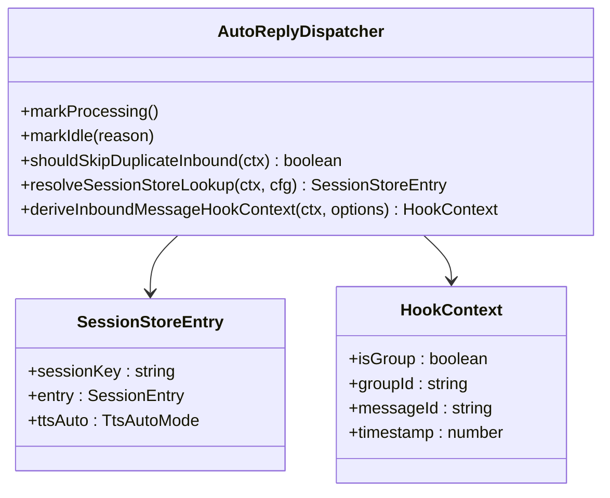

**图表来源**
- [dispatch-from-config.ts: 145-185:145-185](file://src/auto-reply/reply/dispatch-from-config.ts#L145-L185)

**章节来源**
- [dispatch-from-config.ts: 145-185:145-185](file://src/auto-reply/reply/dispatch-from-config.ts#L145-L185)

### 网关节点事件处理

网关节点事件处理系统负责管理不同节点之间的消息传递和状态同步。

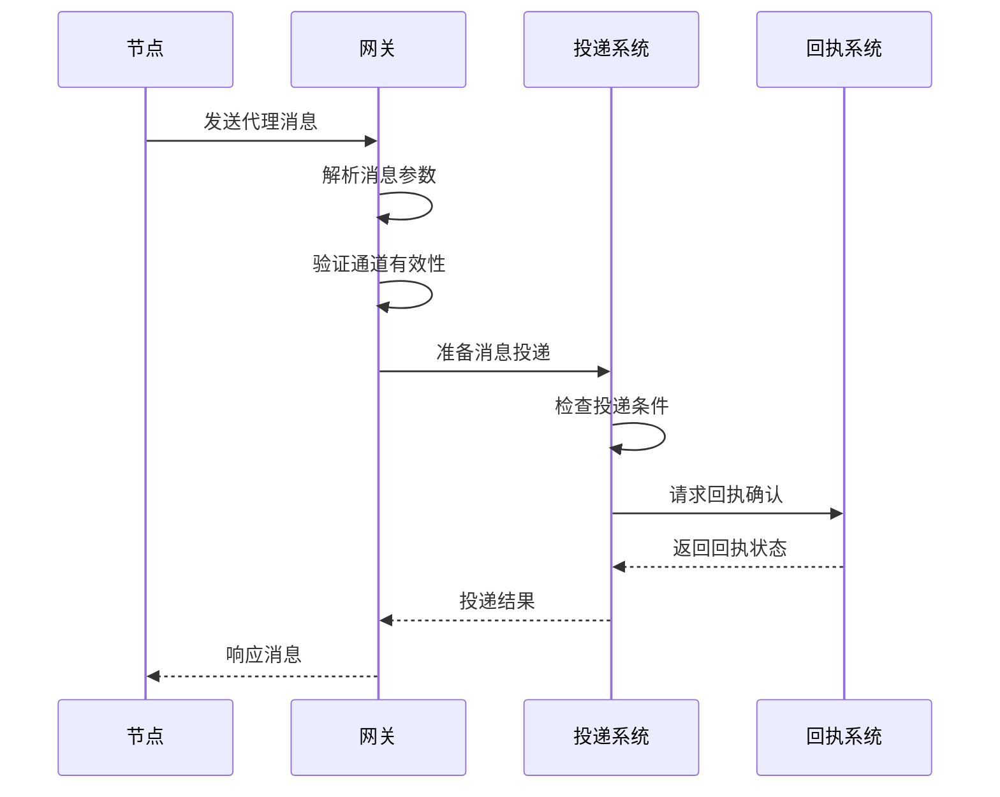

**图表来源**
- [server-node-events.ts: 397-435:397-435](file://src/gateway/server-node-events.ts#L397-L435)

**章节来源**
- [server-node-events.ts: 397-435:397-435](file://src/gateway/server-node-events.ts#L397-L435)

## 依赖关系分析

聊天模块的依赖关系呈现清晰的分层结构：

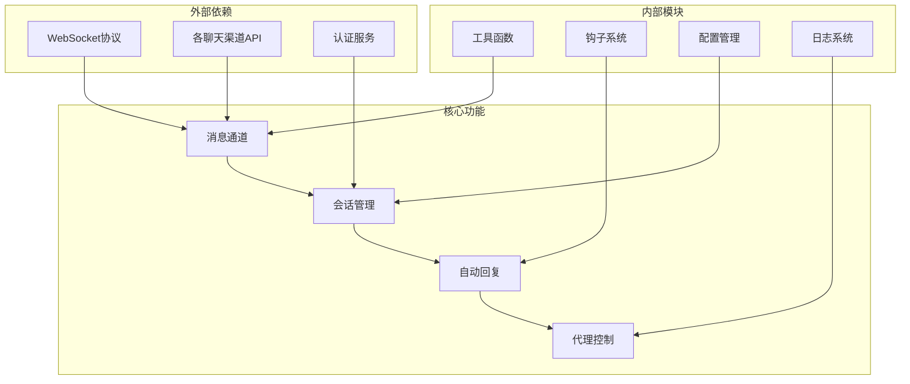

**图表来源**
- [README.md: 185-212:185-212](file://README.md#L185-L212)

**章节来源**
- [README.md: 185-212:185-212](file://README.md#L185-L212)

## 性能考量

聊天模块在设计时充分考虑了性能优化：

### 并发处理
- 使用事件驱动架构处理高并发消息
- 实现消息去重和防抖机制避免重复处理
- 采用异步处理模式提高响应速度

### 资源管理
- 会话状态缓存减少数据库查询
- 智能的内存管理避免内存泄漏
- 连接池管理优化网络资源使用

### 扩展性设计
- 插件化架构支持新渠道快速集成
- 模块化设计便于功能扩展
- 可配置的处理策略适应不同场景

## 故障排除指南

### 常见问题诊断

1. **消息未送达**
   - 检查通道配置是否正确
   - 验证认证凭据有效性
   - 确认网络连接状态

2. **会话状态异常**
   - 查看会话存储状态
   - 检查代理配置
   - 验证权限设置

3. **性能问题**
   - 监控系统资源使用
   - 检查数据库连接
   - 分析日志文件

### 调试工具

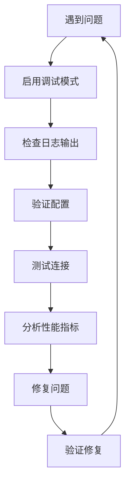

**章节来源**
- [internal-hooks.test.ts: 1-52:1-52](file://src/hooks/internal-hooks.test.ts#L1-L52)

## 结论

OpenClaw 的聊天模块展现了现代AI助手平台的优秀架构设计。通过统一的消息通道管理、智能的会话控制和灵活的插件系统，该模块成功实现了跨多个聊天渠道的一致用户体验。

主要优势包括：
- **统一性**：单一控制平面管理所有聊天渠道
- **可扩展性**：插件化架构支持新渠道快速集成
- **可靠性**：完善的错误处理和恢复机制
- **性能**：事件驱动架构确保高并发处理能力

未来发展方向可能包括：
- 更智能的会话路由算法
- 增强的多媒体处理能力
- 更丰富的第三方集成选项
- 改进的性能监控和优化工具